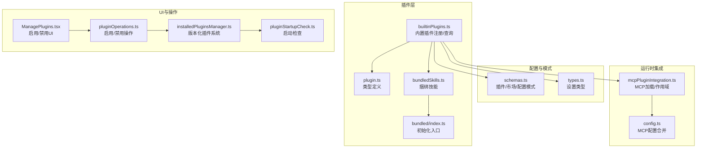
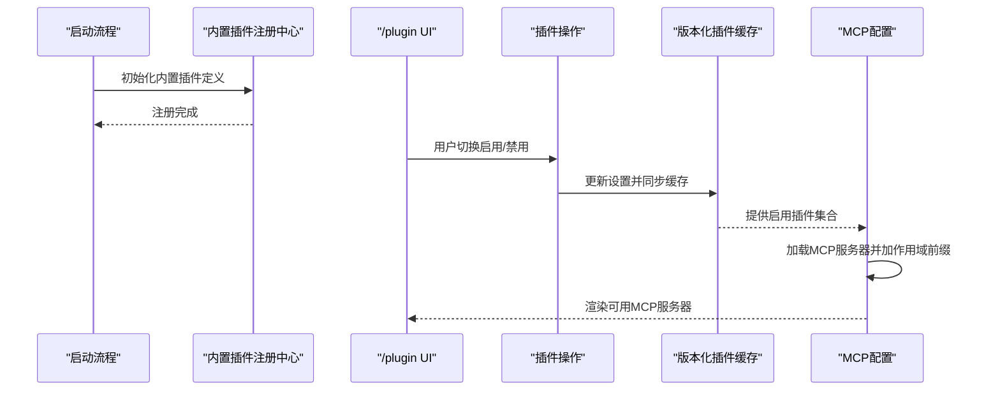
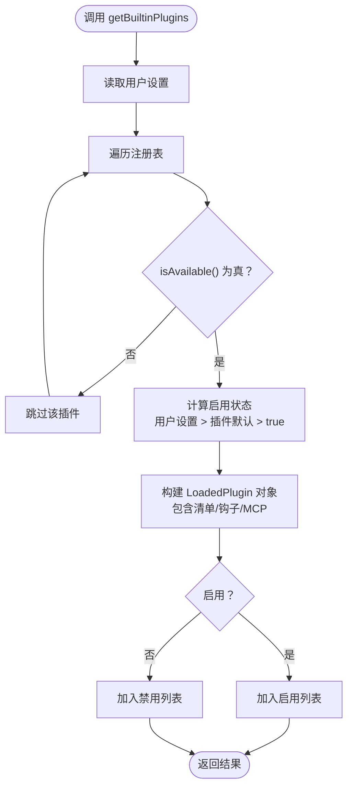
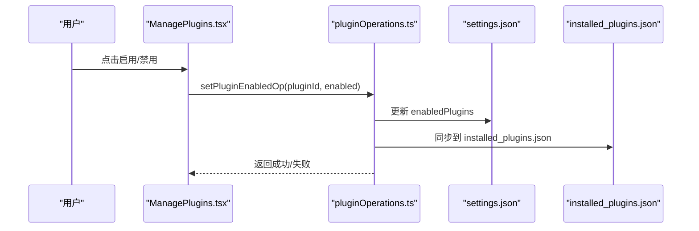
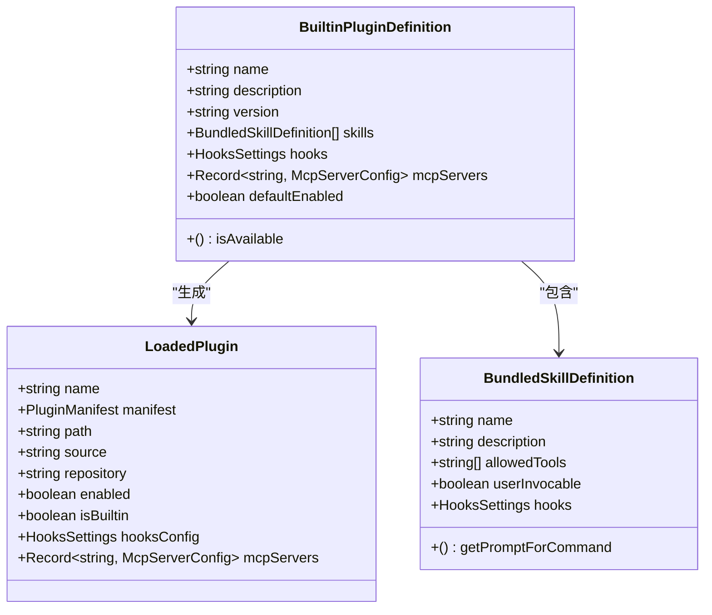
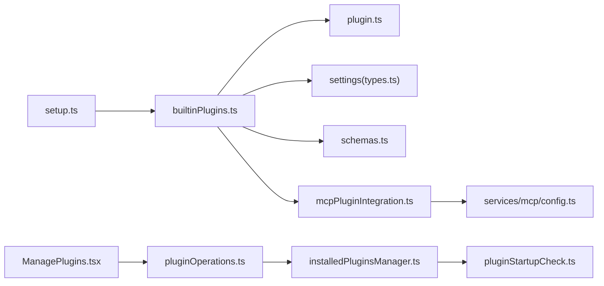

# 内置插件系统

<cite>
**本文档引用的文件**
- [builtinPlugins.ts](file://src/plugins/builtinPlugins.ts)
- [plugin.ts](file://src/types/plugin.ts)
- [bundledSkills.ts](file://src/skills/bundledSkills.ts)
- [index.ts](file://src/skills/bundled/index.ts)
- [schemas.ts](file://src/utils/plugins/schemas.ts)
- [mcpPluginIntegration.ts](file://src/utils/plugins/mcpPluginIntegration.ts)
- [pluginOperations.ts](file://src/services/plugins/pluginOperations.ts)
- [ManagePlugins.tsx](file://src/commands/plugin/ManagePlugins.tsx)
- [installedPluginsManager.ts](file://src/utils/plugins/installedPluginsManager.ts)
- [pluginStartupCheck.ts](file://src/utils/plugins/pluginStartupCheck.ts)
- [config.ts](file://src/services/mcp/config.ts)
- [types.ts](file://src/utils/settings/types.ts)
- [setup.ts](file://src/setup.ts)
</cite>

## 目录
1. [简介](#简介)
2. [项目结构](#项目结构)
3. [核心组件](#核心组件)
4. [架构总览](#架构总览)
5. [详细组件分析](#详细组件分析)
6. [依赖关系分析](#依赖关系分析)
7. [性能考虑](#性能考虑)
8. [故障排除指南](#故障排除指南)
9. [结论](#结论)
10. [附录](#附录)

## 简介
本文件系统性阐述内置插件（Built-in Plugins）的设计与实现，重点覆盖以下方面：
- 内置插件与市场插件的区别与特性
- 注册机制与管理方式
- 启用/禁用状态管理
- 功能组件：技能、钩子、MCP 服务器
- 默认配置与用户自定义选项
- 版本管理与更新机制
- 使用示例与最佳实践

内置插件是随 CLI 一起分发、可由用户在“/plugin”界面中启用/禁用的功能模块，支持提供多种组件（技能、钩子、MCP 服务器），并通过统一的 LoadedPlugin 结构参与系统运行时。

## 项目结构
围绕内置插件系统的关键目录与文件如下：
- 插件注册与查询：src/plugins/builtinPlugins.ts
- 类型定义：src/types/plugin.ts
- 技能系统：src/skills/bundledSkills.ts、src/skills/bundled/index.ts
- 插件模式与配置：src/utils/plugins/schemas.ts
- MCP 集成：src/utils/plugins/mcpPluginIntegration.ts、src/services/mcp/config.ts
- 设置与操作：src/utils/settings/types.ts、src/services/plugins/pluginOperations.ts
- UI 交互：src/commands/plugin/ManagePlugins.tsx
- 版本化插件系统：src/utils/plugins/installedPluginsManager.ts、src/utils/plugins/pluginStartupCheck.ts
- 启动流程：src/setup.ts

**图表来源**
- [builtinPlugins.ts:1-160](file://src/plugins/builtinPlugins.ts#L1-L160)
- [plugin.ts:1-364](file://src/types/plugin.ts#L1-L364)
- [bundledSkills.ts:1-221](file://src/skills/bundledSkills.ts#L1-L221)
- [index.ts:1-80](file://src/skills/bundled/index.ts#L1-L80)
- [schemas.ts:1-800](file://src/utils/plugins/schemas.ts#L1-L800)
- [mcpPluginIntegration.ts:122-377](file://src/utils/plugins/mcpPluginIntegration.ts#L122-L377)
- [config.ts:1117-1154](file://src/services/mcp/config.ts#L1117-L1154)
- [ManagePlugins.tsx:1158-1310](file://src/commands/plugin/ManagePlugins.tsx#L1158-L1310)
- [pluginOperations.ts:573-578](file://src/services/plugins/pluginOperations.ts#L573-L578)
- [installedPluginsManager.ts:706-734](file://src/utils/plugins/installedPluginsManager.ts#L706-L734)
- [pluginStartupCheck.ts:187-220](file://src/utils/plugins/pluginStartupCheck.ts#L187-L220)

**章节来源**
- [builtinPlugins.ts:1-160](file://src/plugins/builtinPlugins.ts#L1-L160)
- [plugin.ts:1-364](file://src/types/plugin.ts#L1-L364)
- [bundledSkills.ts:1-221](file://src/skills/bundledSkills.ts#L1-L221)
- [index.ts:1-80](file://src/skills/bundled/index.ts#L1-L80)
- [schemas.ts:1-800](file://src/utils/plugins/schemas.ts#L1-L800)
- [mcpPluginIntegration.ts:122-377](file://src/utils/plugins/mcpPluginIntegration.ts#L122-L377)
- [config.ts:1117-1154](file://src/services/mcp/config.ts#L1117-L1154)
- [ManagePlugins.tsx:1158-1310](file://src/commands/plugin/ManagePlugins.tsx#L1158-L1310)
- [pluginOperations.ts:573-578](file://src/services/plugins/pluginOperations.ts#L573-L578)
- [installedPluginsManager.ts:706-734](file://src/utils/plugins/installedPluginsManager.ts#L706-L734)
- [pluginStartupCheck.ts:187-220](file://src/utils/plugins/pluginStartupCheck.ts#L187-L220)

## 核心组件
- 内置插件注册中心：维护内置插件定义映射，提供注册、查询、启用状态计算与技能命令转换。
- LoadedPlugin：统一的插件运行时表示，包含清单、路径、来源、仓库标识、启用状态、是否内置、钩子与 MCP 服务器等字段。
- 插件类型定义：BuiltinPluginDefinition 支持 name/description/version/skills/hooks/mcpServers/isAvailable/defaultEnabled。
- MCP 集成：从插件清单、文件与外部 MCPB 中加载服务器配置，并添加动态作用域前缀避免冲突。
- UI 与操作：/plugin 界面支持内置插件的启用/禁用切换；操作通过设置优先级应用到已缓存插件。
- 版本化插件系统：初始化时迁移与同步 enabledPlugins，确保会话内内存状态一致。

**章节来源**
- [builtinPlugins.ts:21-128](file://src/plugins/builtinPlugins.ts#L21-L128)
- [plugin.ts:18-70](file://src/types/plugin.ts#L18-L70)
- [mcpPluginIntegration.ts:131-377](file://src/utils/plugins/mcpPluginIntegration.ts#L131-L377)
- [ManagePlugins.tsx:1158-1310](file://src/commands/plugin/ManagePlugins.tsx#L1158-L1310)
- [installedPluginsManager.ts:714-734](file://src/utils/plugins/installedPluginsManager.ts#L714-L734)

## 架构总览
内置插件系统遵循“注册—查询—启用—运行”的闭环：
- 启动阶段：initBuiltinPlugins 调用各内置插件注册函数，将定义写入注册表。
- 运行阶段：getBuiltinPlugins 基于用户设置与默认值生成 LoadedPlugin 列表；getBuiltinPluginSkillCommands 将技能转换为命令对象。
- UI 阶段：/plugin 界面展示内置插件列表，用户切换启用/禁用；setPluginEnabledOp 应用设置并刷新缓存。
- MCP 阶段：loadAllPluginsCacheOnly 与 getPluginMcpServers 并行提取启用插件的 MCP 服务器，addPluginScopeToServers 添加作用域前缀，最终合并到全局配置。

**图表来源**
- [builtinPlugins.ts:57-102](file://src/plugins/builtinPlugins.ts#L57-L102)
- [ManagePlugins.tsx:1158-1310](file://src/commands/plugin/ManagePlugins.tsx#L1158-L1310)
- [pluginOperations.ts:573-578](file://src/services/plugins/pluginOperations.ts#L573-L578)
- [installedPluginsManager.ts:714-734](file://src/utils/plugins/installedPluginsManager.ts#L714-L734)
- [config.ts:1117-1154](file://src/services/mcp/config.ts#L1117-L1154)

## 详细组件分析

### 内置插件注册与查询
- 注册：registerBuiltinPlugin 将插件定义存入 Map，键为插件名。
- 查询：getBuiltinPluginDefinition 按名称获取定义；getBuiltinPlugins 计算启用/禁用列表，依据 settings.json 的 enabledPlugins 与 defaultEnabled。
- 技能命令：getBuiltinPluginSkillCommands 将启用插件的技能定义转换为 Command 对象，便于命令工具使用。

**图表来源**
- [builtinPlugins.ts:57-102](file://src/plugins/builtinPlugins.ts#L57-L102)

**章节来源**
- [builtinPlugins.ts:28-121](file://src/plugins/builtinPlugins.ts#L28-L121)

### 内置插件与市场插件的区别
- 标识差异：内置插件 ID 以 “@builtin” 结尾，市场插件 ID 以 “@{marketplace}” 结尾。
- 可用性：内置插件通过 isAvailable 控制是否显示；市场插件通过可用性检查与网络拉取。
- 生命周期：内置插件无需下载缓存，直接参与启用状态计算；市场插件需要安装/缓存与版本管理。
- UI 分组：内置插件出现在“Built-in”分组，市场插件来自不同市场源。

**章节来源**
- [builtinPlugins.ts:12-14](file://src/plugins/builtinPlugins.ts#L12-L14)
- [schemas.ts:243-246](file://src/utils/plugins/schemas.ts#L243-L246)

### 启用/禁用状态管理
- 设置优先级：用户设置 > 插件默认 > true。
- UI 切换：/plugin 界面支持内置插件的启用/禁用；点击后通过 setPluginEnabledOp 应用设置并清理缓存。
- 版本化系统：initializeVersionedPlugins 在启动早期迁移与同步 enabledPlugins，保证会话一致性。

**图表来源**
- [ManagePlugins.tsx:1158-1310](file://src/commands/plugin/ManagePlugins.tsx#L1158-L1310)
- [pluginOperations.ts:573-578](file://src/services/plugins/pluginOperations.ts#L573-L578)
- [installedPluginsManager.ts:714-734](file://src/utils/plugins/installedPluginsManager.ts#L714-L734)

**章节来源**
- [builtinPlugins.ts:72-76](file://src/plugins/builtinPlugins.ts#L72-L76)
- [ManagePlugins.tsx:1158-1310](file://src/commands/plugin/ManagePlugins.tsx#L1158-L1310)
- [pluginOperations.ts:573-578](file://src/services/plugins/pluginOperations.ts#L573-L578)
- [installedPluginsManager.ts:714-734](file://src/utils/plugins/installedPluginsManager.ts#L714-L734)

### 功能组件：技能、钩子、MCP 服务器
- 技能（Skills）
  - 内置插件可提供技能，启用后通过 getBuiltinPluginSkillCommands 转换为命令对象，供命令工具使用。
  - 捆绑技能（bundledSkills）与内置插件技能共享相似的 Command 结构，但捆绑技能编译进二进制，内置插件技能来自注册表。
- 钩子（Hooks）
  - 内置插件可声明 hooks 配置，通过设置类型中的 PluginHookMatcher/SkillHookMatcher 组织执行上下文。
- MCP 服务器
  - 内置插件可声明 mcpServers，通过 loadPluginMcpServers 从清单、.mcp.json 或 MCPB 文件加载；addPluginScopeToServers 为每个服务器添加动态作用域前缀，避免命名冲突；最终由 extractMcpServersFromPlugins 合并到全局配置。

**图表来源**
- [plugin.ts:18-70](file://src/types/plugin.ts#L18-L70)
- [bundledSkills.ts:15-41](file://src/skills/bundledSkills.ts#L15-L41)

**章节来源**
- [builtinPlugins.ts:108-121](file://src/plugins/builtinPlugins.ts#L108-L121)
- [bundledSkills.ts:75-100](file://src/skills/bundledSkills.ts#L75-L100)
- [mcpPluginIntegration.ts:131-377](file://src/utils/plugins/mcpPluginIntegration.ts#L131-L377)
- [types.ts:1079-1096](file://src/utils/settings/types.ts#L1079-L1096)

### 默认配置与用户自定义选项
- 内置插件默认启用：若未设置用户偏好，默认启用（defaultEnabled ?? true）。
- 用户配置：插件清单支持 userConfig 字段，声明用户可配置项（类型、标题、描述、默认值、敏感标记等），在启用时弹窗收集，非敏感值保存至 settings.json，敏感值保存至安全存储。
- MCP/LSP 配置：用户配置可在 MCP/LSP 服务器配置中通过 ${user_config.KEY} 引用。

**章节来源**
- [builtinPlugins.ts:72-76](file://src/plugins/builtinPlugins.ts#L72-L76)
- [schemas.ts:587-654](file://src/utils/plugins/schemas.ts#L587-L654)
- [schemas.ts:670-703](file://src/utils/plugins/schemas.ts#L670-L703)
- [types.ts:1136-1148](file://src/utils/settings/types.ts#L1136-L1148)

### 版本管理与更新机制
- 版本化插件系统：initializeVersionedPlugins 执行单文件格式迁移、从 settings.json 同步到 installed_plugins.json，并初始化会话内存状态。
- 市场插件自动更新：isMarketplaceAutoUpdate 基于官方市场名单与策略决定是否默认自动更新；保留名称与来源验证防止冒名。
- 启动检查：getInstalledPlugins 与 findMissingPlugins 协助识别缺失插件，触发后台同步。

**章节来源**
- [installedPluginsManager.ts:714-734](file://src/utils/plugins/installedPluginsManager.ts#L714-L734)
- [pluginStartupCheck.ts:197-220](file://src/utils/plugins/pluginStartupCheck.ts#L197-L220)
- [schemas.ts:48-58](file://src/utils/plugins/schemas.ts#L48-L58)
- [schemas.ts:119-157](file://src/utils/plugins/schemas.ts#L119-L157)

### 使用示例与最佳实践
- 注册内置插件：在初始化阶段调用 registerBuiltinPlugin，传入包含 name/description/version/skills/hooks/mcpServers 的定义。
- 控制可用性：通过 isAvailable 判断系统能力（如平台、依赖），返回 false 时插件不会出现在列表中。
- 管理启用状态：在 /plugin 界面或通过 setPluginEnabledOp 切换；注意设置优先级与缓存同步。
- MCP 服务器：在插件清单中声明 mcpServers，或提供 .mcp.json/MCPB；确保服务器名称唯一，避免与内置/其他插件冲突。
- 最佳实践：
  - 为内置插件提供清晰的 description 与 version，便于用户识别。
  - 合理使用 defaultEnabled，避免影响用户体验。
  - 对敏感配置使用 userConfig 的敏感标记，避免泄露。
  - 在 isAvailable 中进行资源探测，减少无效插件的出现。

**章节来源**
- [builtinPlugins.ts:28-32](file://src/plugins/builtinPlugins.ts#L28-L32)
- [builtinPlugins.ts:66-68](file://src/plugins/builtinPlugins.ts#L66-L68)
- [ManagePlugins.tsx:1158-1310](file://src/commands/plugin/ManagePlugins.tsx#L1158-L1310)
- [pluginOperations.ts:573-578](file://src/services/plugins/pluginOperations.ts#L573-L578)
- [mcpPluginIntegration.ts:341-360](file://src/utils/plugins/mcpPluginIntegration.ts#L341-L360)

## 依赖关系分析
- 内置插件注册中心依赖设置模块以读取用户偏好，依赖类型模块以构造 LoadedPlugin。
- MCP 集成依赖插件清单与外部配置文件，负责解析与作用域化。
- UI 与操作依赖设置与版本化插件系统，确保切换即时生效。
- 启动流程在 setup 中协调各组件初始化顺序，确保插件系统在 UI 与服务之前就绪。

**图表来源**
- [builtinPlugins.ts:16-19](file://src/plugins/builtinPlugins.ts#L16-L19)
- [plugin.ts:1-11](file://src/types/plugin.ts#L1-L11)
- [types.ts:1075-1122](file://src/utils/settings/types.ts#L1075-L1122)
- [schemas.ts:1-800](file://src/utils/plugins/schemas.ts#L1-L800)
- [mcpPluginIntegration.ts:122-377](file://src/utils/plugins/mcpPluginIntegration.ts#L122-L377)
- [config.ts:1117-1154](file://src/services/mcp/config.ts#L1117-L1154)
- [ManagePlugins.tsx:1158-1310](file://src/commands/plugin/ManagePlugins.tsx#L1158-L1310)
- [pluginOperations.ts:573-578](file://src/services/plugins/pluginOperations.ts#L573-L578)
- [installedPluginsManager.ts:706-734](file://src/utils/plugins/installedPluginsManager.ts#L706-L734)
- [pluginStartupCheck.ts:187-220](file://src/utils/plugins/pluginStartupCheck.ts#L187-L220)
- [setup.ts:1-200](file://src/setup.ts#L1-L200)

**章节来源**
- [builtinPlugins.ts:16-19](file://src/plugins/builtinPlugins.ts#L16-L19)
- [plugin.ts:1-11](file://src/types/plugin.ts#L1-L11)
- [types.ts:1075-1122](file://src/utils/settings/types.ts#L1075-L1122)
- [schemas.ts:1-800](file://src/utils/plugins/schemas.ts#L1-L800)
- [mcpPluginIntegration.ts:122-377](file://src/utils/plugins/mcpPluginIntegration.ts#L122-L377)
- [config.ts:1117-1154](file://src/services/mcp/config.ts#L1117-L1154)
- [ManagePlugins.tsx:1158-1310](file://src/commands/plugin/ManagePlugins.tsx#L1158-L1310)
- [pluginOperations.ts:573-578](file://src/services/plugins/pluginOperations.ts#L573-L578)
- [installedPluginsManager.ts:706-734](file://src/utils/plugins/installedPluginsManager.ts#L706-L734)
- [pluginStartupCheck.ts:187-220](file://src/utils/plugins/pluginStartupCheck.ts#L187-L220)
- [setup.ts:1-200](file://src/setup.ts#L1-L200)

## 性能考虑
- 并行加载：MCP 服务器加载与插件提取采用 Promise.all 并行处理，提升启动速度。
- 缓存与同步：版本化插件系统在启动时完成迁移与同步，避免后续频繁磁盘 IO。
- 条件可用性：isAvailable 在注册阶段过滤不可用插件，减少后续处理开销。
- 作用域前缀：为 MCP 服务器添加 plugin:{name}:{server} 前缀，避免重复扫描与冲突检测成本。

[本节为通用指导，不直接分析具体文件]

## 故障排除指南
- 插件未出现在列表：检查 isAvailable 是否返回 true；确认插件未被策略阻止。
- 启用/禁用无效：确认 settings.json 的 enabledPlugins 已更新；检查 installed_plugins.json 同步是否完成。
- MCP 服务器冲突：检查 addPluginScopeToServers 是否正确添加作用域前缀；查看 mcpErrors 日志定位配置错误。
- 错误类型：系统提供丰富的 PluginError 类型（如 mcp-config-invalid、mcpb-download-failed 等），可通过 getPluginErrorMessage 获取可读消息。

**章节来源**
- [builtinPlugins.ts:66-68](file://src/plugins/builtinPlugins.ts#L66-L68)
- [installedPluginsManager.ts:718-724](file://src/utils/plugins/installedPluginsManager.ts#L718-L724)
- [config.ts:1120-1144](file://src/services/mcp/config.ts#L1120-L1144)
- [plugin.ts:101-363](file://src/types/plugin.ts#L101-L363)

## 结论
内置插件系统通过统一的注册、查询与运行时表示，将技能、钩子与 MCP 服务器整合进 CLI 生态。其启用/禁用机制基于设置优先级与版本化缓存，确保用户可控且性能友好。配合严格的市场与来源验证、作用域化的 MCP 服务器命名以及完善的错误类型体系，内置插件既具备灵活性又保持安全性与稳定性。

[本节为总结，不直接分析具体文件]

## 附录
- 初始化内置技能：initBundledSkills 在启动时注册各类捆绑技能，体现与内置插件类似的注册模式。
- 启动流程：setup 在各子系统初始化前完成必要的环境准备，确保插件系统在 UI 与服务之前就绪。

**章节来源**
- [index.ts:24-80](file://src/skills/bundled/index.ts#L24-L80)
- [setup.ts:1-200](file://src/setup.ts#L1-L200)