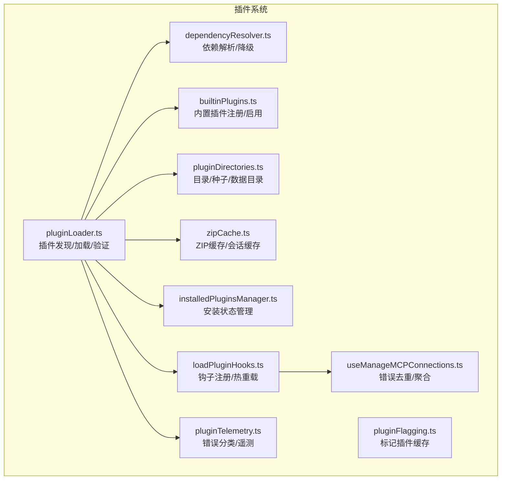
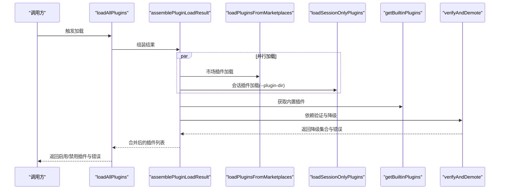
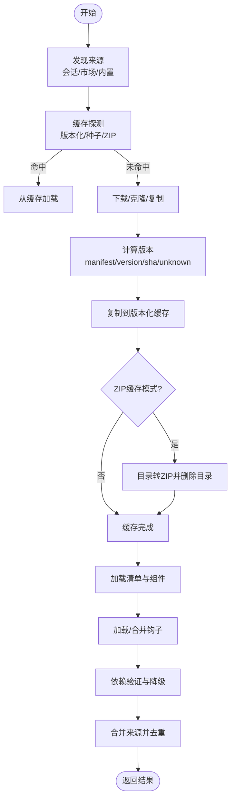
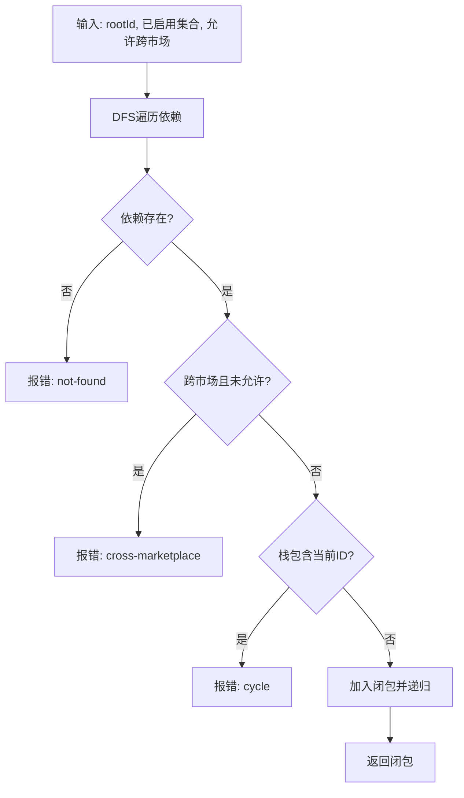
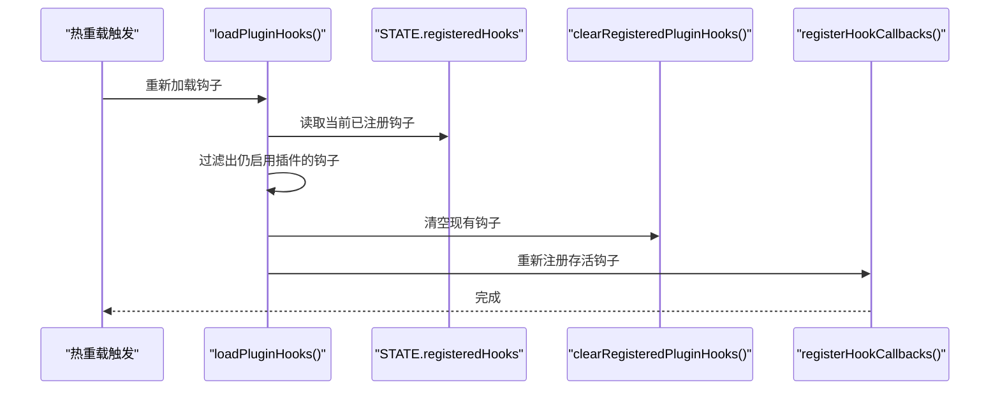
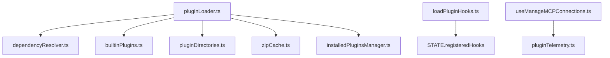

# 插件加载机制

<cite>
**本文档引用的文件**
- [pluginLoader.ts](file://src/utils/plugins/pluginLoader.ts)
- [dependencyResolver.ts](file://src/utils/plugins/dependencyResolver.ts)
- [builtinPlugins.ts](file://src/plugins/builtinPlugins.ts)
- [pluginDirectories.ts](file://src/utils/plugins/pluginDirectories.ts)
- [zipCache.ts](file://src/utils/plugins/zipCache.ts)
- [installedPluginsManager.ts](file://src/utils/plugins/installedPluginsManager.ts)
- [pluginFlagging.ts](file://src/utils/plugins/pluginFlagging.ts)
- [loadPluginHooks.ts](file://src/utils/plugins/loadPluginHooks.ts)
- [useManageMCPConnections.ts](file://src/services/mcp/useManageMCPConnections.ts)
- [pluginTelemetry.ts](file://src/utils/telemetry/pluginTelemetry.ts)
</cite>

## 目录
1. [简介](#简介)
2. [项目结构](#项目结构)
3. [核心组件](#核心组件)
4. [架构总览](#架构总览)
5. [详细组件分析](#详细组件分析)
6. [依赖关系分析](#依赖关系分析)
7. [性能考虑](#性能考虑)
8. [故障排除指南](#故障排除指南)
9. [结论](#结论)

## 简介
本文件系统化阐述该代码库中的插件加载机制，覆盖插件发现、加载、验证、依赖解析与版本兼容性检查、热重载与动态更新、错误处理与故障恢复、性能优化与缓存策略，以及加载状态监控与调试方法。内容基于源码实现细节，确保技术准确性与可操作性。

## 项目结构
插件系统围绕以下模块协同工作：
- 插件发现与加载：负责从市场（marketplace）与本地目录加载插件，生成统一的 LoadedPlugin 结构。
- 依赖解析：在安装时进行闭包解析，在加载时进行存在性校验与降级。
- 目录与缓存：集中管理插件根目录、种子缓存、版本化缓存与会话缓存。
- 内置插件：提供随应用分发的内置插件注册与启用逻辑。
- ZIP 缓存：在特定部署场景下以 ZIP 形式缓存插件，提升启动性能。
- 安装状态管理：记录已安装插件信息，支持格式迁移与持久化。
- 钩子与热重载：维护钩子注册表，支持热重载时的存活匹配与回调保留。
- 错误分类与监控：对插件命令错误进行分类，便于诊断与告警。

**图表来源**
- [pluginLoader.ts:1-120](file://src/utils/plugins/pluginLoader.ts#L1-L120)
- [dependencyResolver.ts:1-60](file://src/utils/plugins/dependencyResolver.ts#L1-L60)
- [builtinPlugins.ts:1-60](file://src/plugins/builtinPlugins.ts#L1-L60)
- [pluginDirectories.ts:1-60](file://src/utils/plugins/pluginDirectories.ts#L1-L60)
- [zipCache.ts:1-60](file://src/utils/plugins/zipCache.ts#L1-L60)
- [installedPluginsManager.ts:337-384](file://src/utils/plugins/installedPluginsManager.ts#L337-L384)
- [pluginFlagging.ts:117-144](file://src/utils/plugins/pluginFlagging.ts#L117-L144)
- [loadPluginHooks.ts:186-215](file://src/utils/plugins/loadPluginHooks.ts#L186-L215)
- [useManageMCPConnections.ts:95-132](file://src/services/mcp/useManageMCPConnections.ts#L95-L132)
- [pluginTelemetry.ts:238-259](file://src/utils/telemetry/pluginTelemetry.ts#L238-L259)

**章节来源**
- [pluginLoader.ts:1-120](file://src/utils/plugins/pluginLoader.ts#L1-L120)
- [pluginDirectories.ts:1-120](file://src/utils/plugins/pluginDirectories.ts#L1-L120)

## 核心组件
- 插件加载器（pluginLoader.ts）
  - 负责插件发现（市场/本地）、缓存策略、清单与组件加载、错误收集与返回。
  - 支持版本化缓存路径、种子缓存探测、ZIP 缓存模式、会话缓存提取。
  - 提供全量加载与仅缓存加载两种模式，分别用于交互式启动与刷新路径。
- 依赖解析器（dependencyResolver.ts）
  - 安装时：DFS 深度优先遍历，构建依赖闭包，检测环依赖、跨市场依赖、缺失依赖。
  - 加载时：固定点迭代，校验已启用插件的依赖是否满足，不满足则降级为禁用。
- 目录与缓存（pluginDirectories.ts、zipCache.ts）
  - 统一插件根目录、种子目录、数据目录；支持按环境变量切换 cowork 模式。
  - ZIP 缓存：将插件打包为 ZIP，会话内解压到临时目录，减少磁盘占用与 IO。
- 内置插件（builtinPlugins.ts）
  - 注册内置插件定义，根据用户设置决定启用/禁用，并注入钩子与 MCP 服务器。
- 安装状态管理（installedPluginsManager.ts）
  - 读写 installed_plugins.json，支持 V1 到 V2 的格式迁移，异常时回退为空状态。
- 钩子与热重载（loadPluginHooks.ts）
  - 维护钩子注册表，热重载时仅保留仍启用的插件对应的钩子，回调保持不变。
- 错误分类与监控（pluginTelemetry.ts、useManageMCPConnections.ts）
  - 对网络/未找到/权限/校验等错误进行分类；对插件错误进行去重与聚合，避免重复告警。

**章节来源**
- [pluginLoader.ts:3096-3243](file://src/utils/plugins/pluginLoader.ts#L3096-L3243)
- [dependencyResolver.ts:95-234](file://src/utils/plugins/dependencyResolver.ts#L95-L234)
- [builtinPlugins.ts:57-102](file://src/plugins/builtinPlugins.ts#L57-L102)
- [zipCache.ts:55-161](file://src/utils/plugins/zipCache.ts#L55-L161)
- [installedPluginsManager.ts:337-384](file://src/utils/plugins/installedPluginsManager.ts#L337-L384)
- [loadPluginHooks.ts:186-215](file://src/utils/plugins/loadPluginHooks.ts#L186-L215)
- [pluginTelemetry.ts:238-259](file://src/utils/telemetry/pluginTelemetry.ts#L238-L259)
- [useManageMCPConnections.ts:95-132](file://src/services/mcp/useManageMCPConnections.ts#L95-L132)

## 架构总览
插件加载采用“发现-缓存-组装-验证-合并”的流水线，支持多来源融合与严格的企业策略校验。

**图表来源**
- [pluginLoader.ts:3096-3146](file://src/utils/plugins/pluginLoader.ts#L3096-L3146)
- [pluginLoader.ts:3155-3211](file://src/utils/plugins/pluginLoader.ts#L3155-L3211)
- [builtinPlugins.ts:57-102](file://src/plugins/builtinPlugins.ts#L57-L102)
- [dependencyResolver.ts:177-234](file://src/utils/plugins/dependencyResolver.ts#L177-L234)

## 详细组件分析

### 插件发现与加载（pluginLoader.ts）
- 发现来源与优先级
  - 会话插件（--plugin-dir）：直接从指定目录加载，优先级最高，可覆盖已安装同名插件（受托管设置限制）。
  - 市场插件（settings 中的 plugin@marketplace）：按已启用列表并行加载，支持企业策略校验与目录预读。
  - 内置插件（builtin）：随应用分发，由用户设置控制启用/禁用。
- 清单与组件加载
  - 清单：优先使用 .claude-plugin/plugin.json，不存在时回退至 marketplace 条目补充。
  - 组件：commands/agents/skills/hooks/output-styles 可来自清单或 marketplace 条目，支持对象映射与路径数组两种形式。
  - 钩子：标准 hooks/hooks.json 与清单中声明的 hooks 合并，严格模式下禁止重复文件。
- 缓存策略
  - 版本化缓存：按 marketplace/name/version 组织，支持种子缓存探测与 ZIP 缓存模式。
  - 会话缓存：ZIP 缓存模式下，插件解压到会话临时目录，生命周期随会话结束清理。
  - 仅缓存加载：不进行网络下载与复制，直接从 installed_plugins.json 的 installPath 读取，适用于启动阶段。
- 错误处理
  - 清单解析失败、组件路径缺失、钩子加载失败、市场条目冲突等均作为非致命错误收集返回，保证系统继续运行。

**图表来源**
- [pluginLoader.ts:1888-2089](file://src/utils/plugins/pluginLoader.ts#L1888-L2089)
- [pluginLoader.ts:2098-2174](file://src/utils/plugins/pluginLoader.ts#L2098-L2174)
- [pluginLoader.ts:2420-2410](file://src/utils/plugins/pluginLoader.ts#L2420-L2410)
- [pluginLoader.ts:3155-3211](file://src/utils/plugins/pluginLoader.ts#L3155-L3211)

**章节来源**
- [pluginLoader.ts:1888-2089](file://src/utils/plugins/pluginLoader.ts#L1888-L2089)
- [pluginLoader.ts:2098-2174](file://src/utils/plugins/pluginLoader.ts#L2098-L2174)
- [pluginLoader.ts:2420-2410](file://src/utils/plugins/pluginLoader.ts#L2420-L2410)
- [pluginLoader.ts:3155-3211](file://src/utils/plugins/pluginLoader.ts#L3155-L3211)

### 依赖解析与版本兼容性（dependencyResolver.ts）
- 安装时解析
  - DFS 遍历依赖闭包，跳过已启用的依赖以避免意外写入设置。
  - 默认阻止跨市场依赖，可通过根市场 allowlist 放行。
  - 检测环依赖、缺失依赖、跨市场依赖三种错误。
- 加载时验证
  - 固定点迭代：逐个检查已启用插件的 manifest.dependencies 是否满足。
  - 不满足时降级为禁用，并记录原因（未启用/未找到）。
  - 支持裸依赖（无 @marketplace）从 --plugin-dir 插件通过名称匹配。
- 版本兼容性
  - 通过 calculatePluginVersion 统一版本来源顺序：manifest.version > installed_plugins.json > marketplace entry.version > 源 sha > unknown。
  - 在确定性版本（sha/entry.version/installed_version）下复用缓存键，避免键不一致导致反复克隆。

**图表来源**
- [dependencyResolver.ts:95-159](file://src/utils/plugins/dependencyResolver.ts#L95-L159)

**章节来源**
- [dependencyResolver.ts:95-159](file://src/utils/plugins/dependencyResolver.ts#L95-L159)
- [dependencyResolver.ts:177-234](file://src/utils/plugins/dependencyResolver.ts#L177-L234)

### 文件系统结构与加载策略
- 插件目录结构
  - .claude-plugin/plugin.json：插件清单（可选）。
  - commands/：自定义斜杠命令。
  - agents/：自定义 AI 角色。
  - hooks/：钩子配置 hooks.json。
  - skills/、output-styles/：技能与输出样式目录（可选）。
- 加载策略
  - 会话插件：直接从 --plugin-dir 指定路径加载，source 标记为 inline。
  - 市场插件：优先从版本化缓存/种子缓存读取；缺失时下载/克隆后缓存。
  - 内置插件：从注册表读取定义，注入钩子与 MCP 服务器。
  - 数据目录：持久化数据目录位于 plugins/data/<pluginId>，支持大小统计与清理。

**章节来源**
- [pluginLoader.ts:10-33](file://src/utils/plugins/pluginLoader.ts#L10-L33)
- [builtinPlugins.ts:57-102](file://src/plugins/builtinPlugins.ts#L57-L102)
- [pluginDirectories.ts:98-123](file://src/utils/plugins/pluginDirectories.ts#L98-L123)

### 依赖解析与版本兼容性检查
- 依赖规范化
  - bare 依赖继承声明插件的 marketplace 后缀；inline 插件的 bare 依赖通过名称匹配。
- 闭包构建
  - DFS 遍历，跳过已启用依赖；跨市场默认阻断，根市场 allowlist 放行。
- 加载时降级
  - 固定点循环，逐个验证依赖存在性；不满足则降级并记录错误。
- 版本选择
  - 优先级：manifest.version > installed_plugins.json > marketplace entry.version > 源 sha > unknown。
  - 确定性版本复用缓存键，unknown 时走克隆流程。

**章节来源**
- [dependencyResolver.ts:27-46](file://src/utils/plugins/dependencyResolver.ts#L27-L46)
- [dependencyResolver.ts:95-159](file://src/utils/plugins/dependencyResolver.ts#L95-L159)
- [dependencyResolver.ts:177-234](file://src/utils/plugins/dependencyResolver.ts#L177-L234)

### 热重载与动态更新机制
- 钩子热重载
  - 保存当前已注册钩子集合，计算仍启用的插件根集合，仅保留这些插件对应的钩子，回调保持不变。
  - 通过 clearRegisteredPluginHooks + registerHookCallbacks 实现原子替换。
- 设置快照与订阅
  - 订阅插件设置变化，维护 lastPluginSettingsSnapshot，避免并发加载期间的数据竞争。
- 生命周期
  - 重置测试态 resetHotReloadState，确保测试隔离。

**图表来源**
- [loadPluginHooks.ts:186-215](file://src/utils/plugins/loadPluginHooks.ts#L186-L215)

**章节来源**
- [loadPluginHooks.ts:186-215](file://src/utils/plugins/loadPluginHooks.ts#L186-L215)

### 插件加载错误处理与故障恢复
- 错误类型
  - 清单解析失败、组件路径缺失、钩子加载失败、市场条目冲突、网络/权限/校验错误等。
- 分类与去重
  - 对插件命令错误进行分类（网络/未找到/权限/校验/未知）。
  - 插件错误去重：基于 type/source/plugin 组合键，避免重复告警。
- 故障恢复
  - 缓存缺失：触发缓存重建（下载/克隆/复制），必要时删除损坏 ZIP。
  - 依赖不满足：自动降级为禁用，提示用户修复依赖。
  - 企业策略：未知来源 + 活跃策略 → 明确阻断，避免静默放行。

**章节来源**
- [pluginLoader.ts:980-1098](file://src/utils/plugins/pluginLoader.ts#L980-L1098)
- [pluginLoader.ts:2382-2410](file://src/utils/plugins/pluginLoader.ts#L2382-L2410)
- [useManageMCPConnections.ts:95-132](file://src/services/mcp/useManageMCPConnections.ts#L95-L132)
- [pluginTelemetry.ts:238-259](file://src/utils/telemetry/pluginTelemetry.ts#L238-L259)

### 插件加载性能优化与缓存机制
- 并行化
  - 市场插件与会话插件并行加载；清单路径存在性检查并行化，减少事件循环开销。
  - 预读市场目录与 catalog，避免每个插件单独读取配置。
- 缓存策略
  - 版本化缓存：按 marketplace/name/version 组织，命中即跳过网络与复制。
  - 种子缓存：镜像预烘焙插件，只读挂载，命中即直接使用。
  - ZIP 缓存：目录转 ZIP，会话内解压，减少磁盘占用与 IO。
  - 会话缓存：ZIP 解压到本地临时目录，会话结束清理。
- 依赖与设置缓存
  - 依赖验证后生成降级集合，避免重复计算。
  - 插件设置合并后缓存到同步访问层，仅在有变更时重置会话设置缓存。

**章节来源**
- [pluginLoader.ts:1265-1307](file://src/utils/plugins/pluginLoader.ts#L1265-L1307)
- [pluginLoader.ts:1951-1955](file://src/utils/plugins/pluginLoader.ts#L1951-L1955)
- [zipCache.ts:216-229](file://src/utils/plugins/zipCache.ts#L216-L229)
- [zipCache.ts:331-364](file://src/utils/plugins/zipCache.ts#L331-L364)
- [pluginLoader.ts:3281-3295](file://src/utils/plugins/pluginLoader.ts#L3281-L3295)

### 插件加载状态监控与调试
- 日志与调试
  - 大量调试日志（logForDebugging）贯穿加载流程，包括缓存命中、版本计算、ZIP 提取、错误分类等。
- 错误聚合
  - 插件错误去重与聚合，避免重复告警，便于用户定位问题。
- 监控指标
  - 插件抓取与克隆的遥测（成功/失败、耗时、错误类别），辅助性能分析与故障定位。

**章节来源**
- [pluginLoader.ts:562-640](file://src/utils/plugins/pluginLoader.ts#L562-L640)
- [pluginTelemetry.ts:238-259](file://src/utils/telemetry/pluginTelemetry.ts#L238-L259)
- [useManageMCPConnections.ts:95-132](file://src/services/mcp/useManageMCPConnections.ts#L95-L132)

## 依赖关系分析
- 组件耦合
  - pluginLoader 依赖 dependencyResolver（安装/加载时）、builtinPlugins（内置插件）、pluginDirectories（目录/缓存）、zipCache（ZIP/会话缓存）、installedPluginsManager（安装状态）。
  - loadPluginHooks 依赖 STATE.registeredHooks，支持热重载存活匹配。
- 外部依赖
  - 文件系统操作（fs/promises）、git 命令、ZIP 解压库（fflate）、环境变量与路径工具。
- 循环依赖
  - 未见直接循环依赖；各模块职责清晰，通过函数调用与纯函数解析器避免耦合闭环。

**图表来源**
- [pluginLoader.ts:35-122](file://src/utils/plugins/pluginLoader.ts#L35-L122)
- [loadPluginHooks.ts:186-215](file://src/utils/plugins/loadPluginHooks.ts#L186-L215)
- [useManageMCPConnections.ts:95-132](file://src/services/mcp/useManageMCPConnections.ts#L95-L132)

**章节来源**
- [pluginLoader.ts:35-122](file://src/utils/plugins/pluginLoader.ts#L35-L122)
- [loadPluginHooks.ts:186-215](file://src/utils/plugins/loadPluginHooks.ts#L186-L215)

## 性能考虑
- I/O 优化
  - 并行化路径存在性检查与市场目录预读，显著降低启动时间。
  - ZIP 缓存减少磁盘占用与 IO，会话缓存避免重复解压。
- 计算优化
  - 依赖解析采用 DFS 与固定点迭代，复杂度可控；版本计算遵循确定性优先级。
- 缓存策略
  - 多级缓存（版本化/种子/ZIP/会话）配合失效与清理机制，平衡一致性与性能。

## 故障排除指南
- 常见问题与处理
  - 缓存缺失：检查 CLAUDE_CODE_PLUGIN_USE_ZIP_CACHE 与 CLAUDE_CODE_PLUGIN_CACHE_DIR 配置，确认网络可达性。
  - 依赖不满足：查看依赖验证错误，确认目标插件是否启用或存在。
  - 钩子冲突：严格模式下禁止重复钩子文件，检查 hooks/hooks.json 与清单声明。
  - 企业策略阻断：未知来源 + 活跃策略 → 明确阻断，检查 known_marketplaces 与 allowlist/blocklist。
- 调试建议
  - 开启调试日志，关注缓存命中、版本计算、ZIP 提取与错误分类。
  - 使用错误去重与聚合结果，快速定位重复告警来源。

**章节来源**
- [pluginLoader.ts:2382-2410](file://src/utils/plugins/pluginLoader.ts#L2382-L2410)
- [dependencyResolver.ts:177-234](file://src/utils/plugins/dependencyResolver.ts#L177-L234)
- [useManageMCPConnections.ts:95-132](file://src/services/mcp/useManageMCPConnections.ts#L95-L132)

## 结论
该插件加载机制通过多来源融合、严格的依赖解析与版本兼容性检查、完善的缓存与热重载策略，实现了高性能、可扩展、可观测的插件体系。结合错误分类与去重、企业策略与安全边界，系统在易用性与稳定性之间取得良好平衡。建议在生产环境中合理配置 ZIP 缓存与种子缓存，结合监控指标持续优化启动性能与用户体验。