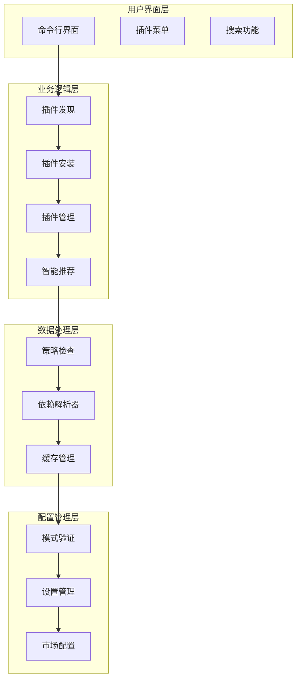
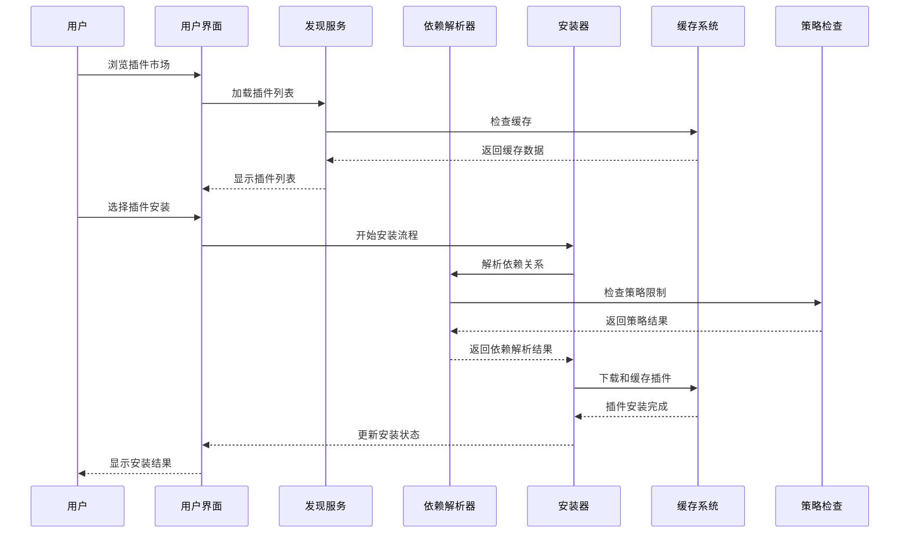
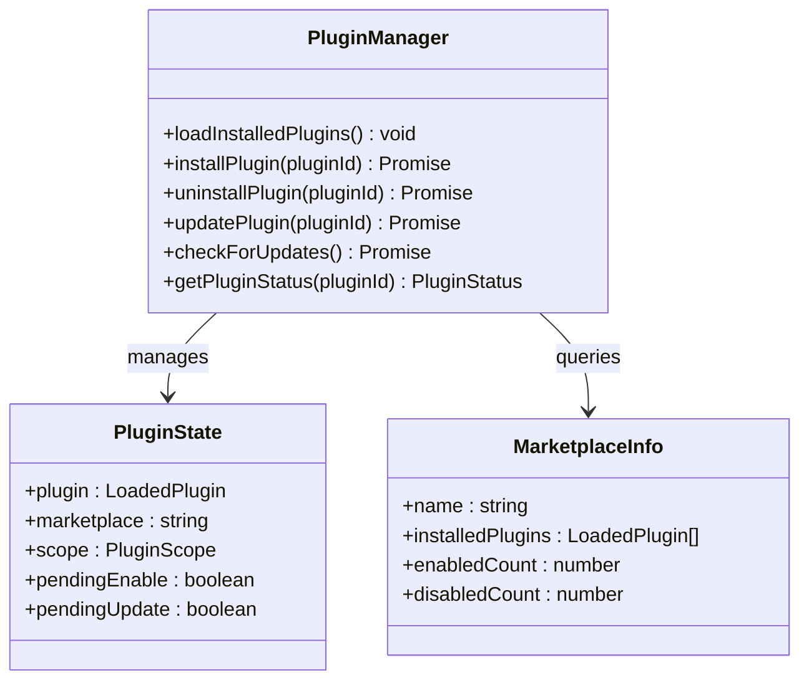
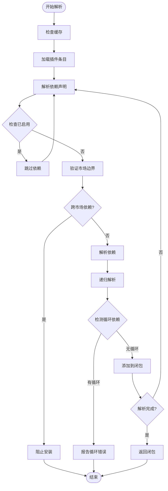
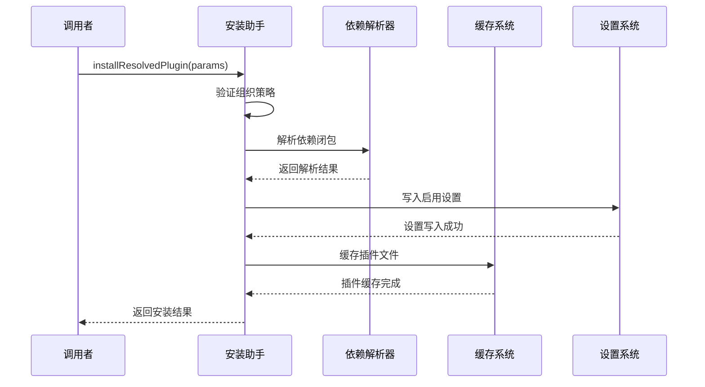
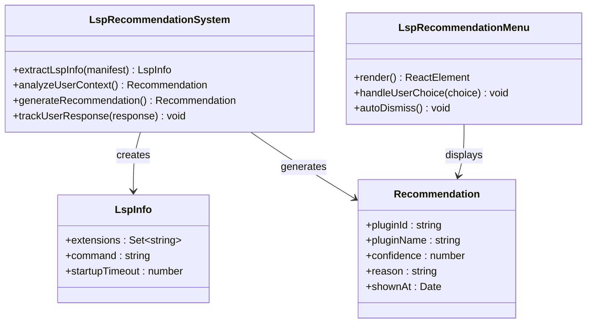
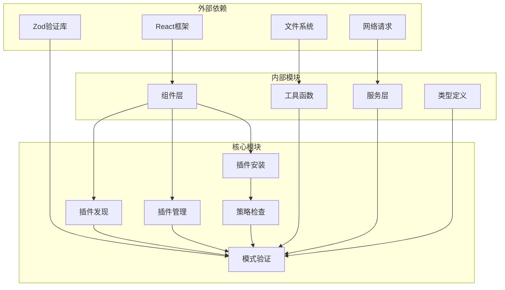

# 插件市场管理

<cite>
**本文档引用的文件**
- [ManagePlugins.tsx](file://src/commands/plugin/ManagePlugins.tsx)
- [DiscoverPlugins.tsx](file://src/commands/plugin/DiscoverPlugins.tsx)
- [pluginInstallationHelpers.ts](file://src/utils/plugins/pluginInstallationHelpers.ts)
- [dependencyResolver.ts](file://src/utils/plugins/dependencyResolver.ts)
- [schemas.ts](file://src/utils/plugins/schemas.ts)
- [pluginPolicy.ts](file://src/utils/plugins/pluginPolicy.ts)
- [useLspPluginRecommendation.tsx](file://src/hooks/useLspPluginRecommendation.tsx)
- [lspRecommendation.ts](file://src/utils/plugins/lspRecommendation.ts)
- [LspRecommendationMenu.tsx](file://src/components/LspRecommendation/LspRecommendationMenu.tsx)
- [usePluginRecommendationBase.tsx](file://src/hooks/usePluginRecommendationBase.tsx)
</cite>

## 目录
1. [简介](#简介)
2. [项目结构](#项目结构)
3. [核心组件](#核心组件)
4. [架构概览](#架构概览)
5. [详细组件分析](#详细组件分析)
6. [依赖分析](#依赖分析)
7. [性能考虑](#性能考虑)
8. [故障排除指南](#故障排除指南)
9. [结论](#结论)
10. [附录](#附录)

## 简介

插件市场管理系统是一个完整的插件生态管理解决方案，负责插件的发现、安装、更新、依赖管理以及质量保证。该系统提供了用户友好的界面来浏览和管理插件，同时确保插件的安全性和可靠性。

系统的核心功能包括：
- 插件市场发现和浏览
- 智能插件推荐和评分系统
- 安全的插件安装和更新机制
- 复杂的依赖关系解析和冲突解决
- 组织级政策控制和审核流程
- 实时LSP（语言服务器协议）插件推荐

## 项目结构

插件市场管理系统采用模块化架构，主要分为以下几个核心层次：



**图表来源**
- [ManagePlugins.tsx:397-800](file://src/commands/plugin/ManagePlugins.tsx#L397-800)
- [DiscoverPlugins.tsx:48-650](file://src/commands/plugin/DiscoverPlugins.tsx#L48-650)

**章节来源**
- [ManagePlugins.tsx:1-800](file://src/commands/plugin/ManagePlugins.tsx#L1-800)
- [DiscoverPlugins.tsx:1-781](file://src/commands/plugin/DiscoverPlugins.tsx#L1-781)

## 核心组件

### 插件发现系统

插件发现系统是用户与插件市场交互的主要入口，提供了强大的搜索和过滤功能：

- **多市场支持**：支持从多个插件市场同时加载和展示插件
- **智能排序**：基于安装次数和流行度进行排序
- **实时搜索**：支持按名称、描述和市场名称进行搜索
- **状态跟踪**：显示插件的安装状态和版本信息

### 插件安装引擎

安装引擎负责处理插件的下载、验证和部署过程：

- **依赖解析**：自动解析和安装插件依赖
- **冲突检测**：检测和解决插件间的依赖冲突
- **安全验证**：验证插件来源和完整性
- **回滚机制**：提供安装失败时的回滚能力

### 推荐系统

智能推荐系统通过多种算法为用户提供个性化的插件推荐：

- **LSP插件推荐**：基于用户IDE使用情况推荐合适的LSP插件
- **使用模式分析**：分析用户的使用历史和偏好
- **上下文感知**：根据当前工作环境提供相关推荐

**章节来源**
- [DiscoverPlugins.tsx:122-225](file://src/commands/plugin/DiscoverPlugins.tsx#L122-225)
- [pluginInstallationHelpers.ts:348-481](file://src/utils/plugins/pluginInstallationHelpers.ts#L348-481)
- [useLspPluginRecommendation.tsx:112-142](file://src/hooks/useLspPluginRecommendation.tsx#L112-142)

## 架构概览

插件市场管理系统采用分层架构设计，确保了良好的可维护性和扩展性：



**图表来源**
- [pluginInstallationHelpers.ts:348-481](file://src/utils/plugins/pluginInstallationHelpers.ts#L348-481)
- [dependencyResolver.ts:95-159](file://src/utils/plugins/dependencyResolver.ts#L95-159)

系统的关键特性包括：

1. **异步处理**：所有网络操作都是异步的，避免阻塞用户界面
2. **错误恢复**：提供完善的错误处理和重试机制
3. **状态管理**：实时跟踪插件的安装状态和进度
4. **并发控制**：合理控制并发安装数量，避免资源争用

## 详细组件分析

### 插件管理器组件

插件管理器是系统的核心组件，负责协调所有插件相关的操作：



**图表来源**
- [ManagePlugins.tsx:112-118](file://src/commands/plugin/ManagePlugins.tsx#L112-118)
- [ManagePlugins.tsx:106-111](file://src/commands/plugin/ManagePlugins.tsx#L106-111)

插件管理器的主要职责包括：

- **状态同步**：保持内存中的插件状态与磁盘状态一致
- **批量操作**：支持批量安装、卸载和更新操作
- **错误处理**：捕获和报告插件操作中的错误
- **性能优化**：使用缓存和延迟加载技术提高响应速度

**章节来源**
- [ManagePlugins.tsx:397-800](file://src/commands/plugin/ManagePlugins.tsx#L397-800)

### 依赖解析器组件

依赖解析器是系统中最重要的组件之一，负责处理复杂的插件依赖关系：



**图表来源**
- [dependencyResolver.ts:95-159](file://src/utils/plugins/dependencyResolver.ts#L95-159)

依赖解析器的核心功能包括：

- **循环检测**：防止循环依赖导致的安装问题
- **跨市场限制**：默认阻止跨插件市场依赖，确保安全性
- **版本兼容性**：检查插件版本兼容性
- **冲突解决**：提供依赖冲突的解决方案

**章节来源**
- [dependencyResolver.ts:1-306](file://src/utils/plugins/dependencyResolver.ts#L1-306)

### 插件安装助手

插件安装助手提供了统一的安装接口，封装了复杂的安装逻辑：



**图表来源**
- [pluginInstallationHelpers.ts:348-481](file://src/utils/plugins/pluginInstallationHelpers.ts#L348-481)

安装助手的主要特性：

- **原子操作**：确保安装过程的原子性，要么全部成功，要么全部失败
- **路径验证**：防止路径遍历攻击
- **缓存优化**：智能缓存机制减少重复下载
- **清理机制**：安装失败时自动清理临时文件

**章节来源**
- [pluginInstallationHelpers.ts:1-596](file://src/utils/plugins/pluginInstallationHelpers.ts#L1-596)

### LSP插件推荐系统

LSP（语言服务器协议）插件推荐系统是智能化的核心组件：



**图表来源**
- [lspRecommendation.ts:40-80](file://src/utils/plugins/lspRecommendation.ts#L40-80)
- [LspRecommendationMenu.tsx:22-72](file://src/components/LspRecommendation/LspRecommendationMenu.tsx#L22-72)

推荐系统的工作流程：

1. **信息提取**：从插件清单中提取LSP配置信息
2. **上下文分析**：分析用户的IDE使用环境和偏好
3. **智能匹配**：基于分析结果生成个性化推荐
4. **用户反馈**：收集用户对推荐的响应
5. **学习优化**：根据反馈不断优化推荐算法

**章节来源**
- [useLspPluginRecommendation.tsx:112-142](file://src/hooks/useLspPluginRecommendation.tsx#L112-142)
- [usePluginRecommendationBase.tsx:18-77](file://src/hooks/usePluginRecommendationBase.tsx#L18-77)

## 依赖分析

插件市场管理系统具有清晰的依赖关系，遵循单一职责原则：



**图表来源**
- [schemas.ts:1-800](file://src/utils/plugins/schemas.ts#L1-800)
- [pluginPolicy.ts:1-21](file://src/utils/plugins/pluginPolicy.ts#L1-21)

系统的设计原则：

- **低耦合高内聚**：每个模块都有明确的职责边界
- **依赖倒置**：高层模块不依赖低层模块的具体实现
- **接口隔离**：通过清晰的接口定义模块间的通信
- **开闭原则**：对扩展开放，对修改封闭

**章节来源**
- [schemas.ts:1287-1326](file://src/utils/plugins/schemas.ts#L1287-1326)
- [pluginPolicy.ts:9-21](file://src/utils/plugins/pluginPolicy.ts#L9-21)

## 性能考虑

系统在设计时充分考虑了性能优化：

### 缓存策略
- **多级缓存**：内存缓存、磁盘缓存和网络缓存相结合
- **智能失效**：基于时间戳和内容哈希的缓存失效机制
- **预加载机制**：提前加载可能需要的插件元数据

### 并发控制
- **队列管理**：限制同时进行的安装任务数量
- **资源池**：复用网络连接和文件句柄
- **背压机制**：防止系统过载

### 内存优化
- **懒加载**：只在需要时加载插件内容
- **对象池**：重用频繁创建的对象
- **垃圾回收**：及时释放不再使用的资源

## 故障排除指南

### 常见问题及解决方案

**插件无法安装**
1. 检查网络连接是否正常
2. 验证插件依赖关系是否满足
3. 确认磁盘空间是否充足
4. 查看详细的错误日志

**依赖冲突**
1. 使用 `plugin list` 查看冲突详情
2. 手动解决冲突或删除冲突插件
3. 检查插件版本兼容性

**推荐系统不工作**
1. 确认LSP插件配置正确
2. 检查用户IDE环境
3. 重置推荐偏好设置

**章节来源**
- [pluginInstallationHelpers.ts:304-327](file://src/utils/plugins/pluginInstallationHelpers.ts#L304-327)
- [ManagePlugins.tsx:376-383](file://src/commands/plugin/ManagePlugins.tsx#L376-383)

## 结论

插件市场管理系统是一个功能完整、设计合理的插件生态系统。系统通过模块化设计实现了高度的可维护性和扩展性，同时提供了丰富的功能来满足用户的各种需求。

系统的主要优势包括：

1. **安全性**：通过多重验证和策略检查确保插件安全
2. **智能化**：基于用户行为和上下文的智能推荐
3. **可靠性**：完善的错误处理和恢复机制
4. **可扩展性**：清晰的架构设计支持功能扩展

未来可以考虑的功能增强：
- 更精细的权限控制系统
- 插件质量评分和评论系统
- 插件开发者工具链
- 分布式插件缓存

## 附录

### API使用示例

系统提供了丰富的API供开发者使用：

**插件安装API**
```javascript
// 安装单个插件
await installPluginFromMarketplace({
  pluginId: 'plugin-name@marketplace',
  entry: pluginEntry,
  marketplaceName: 'marketplace-name',
  scope: 'user'
});
```

**插件管理API**
```javascript
// 获取插件状态
const status = await getPluginStatus('plugin-name@marketplace');

// 启用插件
await enablePluginOp('plugin-name@marketplace');

// 卸载插件
await uninstallPluginOp('plugin-name@marketplace');
```

**依赖解析API**
```javascript
// 解析依赖闭包
const result = await resolveDependencyClosure(
  'plugin-name@marketplace',
  lookupFunction,
  alreadyEnabledSet
);
```

### 配置选项

系统支持多种配置选项来满足不同的使用场景：

- **市场配置**：添加和管理插件市场源
- **策略设置**：组织级插件安装策略
- **推荐偏好**：个性化推荐设置
- **缓存配置**：缓存大小和过期策略