# 插件开发指南

<cite>
**本文档引用的文件**
- [builtinPlugins.ts](file://src/plugins/builtinPlugins.ts)
- [plugin.ts](file://src/types/plugin.ts)
- [schemas.ts](file://src/utils/plugins/schemas.ts)
- [pluginLoader.ts](file://src/utils/plugins/pluginLoader.ts)
- [loadPluginHooks.ts](file://src/utils/plugins/loadPluginHooks.ts)
- [pluginOptionsStorage.ts](file://src/utils/plugins/pluginOptionsStorage.ts)
- [ManagePlugins.tsx](file://src/commands/plugin/ManagePlugins.tsx)
- [ValidatePlugin.tsx](file://src/commands/plugin/ValidatePlugin.tsx)
- [plugins.ts](file://src/cli/handlers/plugins.ts)
- [useManagePlugins.ts](file://src/hooks/useManagePlugins.ts)
- [sessionHooks.ts](file://src/utils/hooks/sessionHooks.ts)
- [hooksSettings.ts](file://src/utils/hooks/hooksSettings.ts)
</cite>

## 目录
1. [简介](#简介)
2. [项目结构](#项目结构)
3. [核心组件](#核心组件)
4. [架构概览](#架构概览)
5. [详细组件分析](#详细组件分析)
6. [依赖关系分析](#依赖关系分析)
7. [性能考虑](#性能考虑)
8. [故障排除指南](#故障排除指南)
9. [结论](#结论)
10. [附录](#附录)

## 简介

本指南为Claude Code插件开发提供了完整的开发文档，涵盖了从基础要求到高级特性的各个方面。Claude Code是一个强大的AI辅助编程工具，其插件系统允许开发者扩展功能、集成外部服务和定制工作流程。

插件系统支持多种组件类型，包括命令、代理、技能、钩子和MCP服务器，并提供了完整的生命周期管理、配置验证和错误处理机制。本文档将详细介绍插件开发的各个方面，帮助开发者快速上手并构建高质量的插件。

## 项目结构

Claude Code的插件系统采用模块化设计，主要分布在以下目录中：

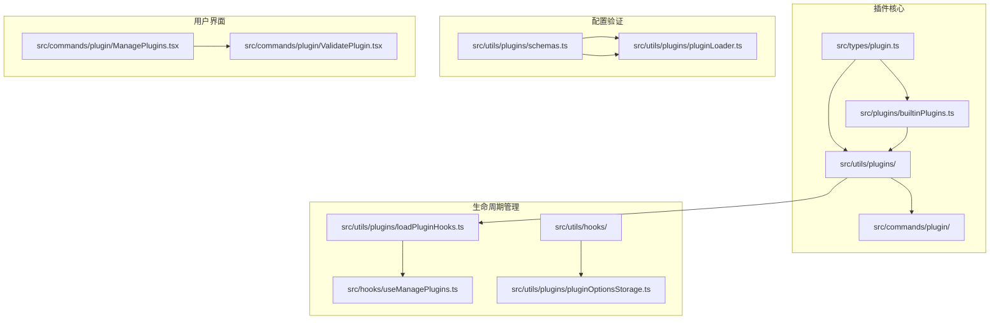

**图表来源**
- [plugin.ts:1-364](file://src/types/plugin.ts#L1-364)
- [builtinPlugins.ts:1-160](file://src/plugins/builtinPlugins.ts#L1-160)
- [schemas.ts:1-800](file://src/utils/plugins/schemas.ts#L1-800)

### 核心目录结构

插件系统的文件组织遵循清晰的层次结构：

- **src/types/plugin.ts**: 定义插件相关的所有类型定义
- **src/plugins/builtinPlugins.ts**: 内置插件注册和管理
- **src/utils/plugins/**: 插件加载、验证和管理的核心工具
- **src/commands/plugin/**: 插件管理的用户界面组件
- **src/utils/hooks/**: 钩子系统实现

**章节来源**
- [plugin.ts:1-364](file://src/types/plugin.ts#L1-364)
- [builtinPlugins.ts:1-160](file://src/plugins/builtinPlugins.ts#L1-160)

## 核心组件

### 插件类型系统

插件系统基于严格的类型定义，确保类型安全和开发体验：

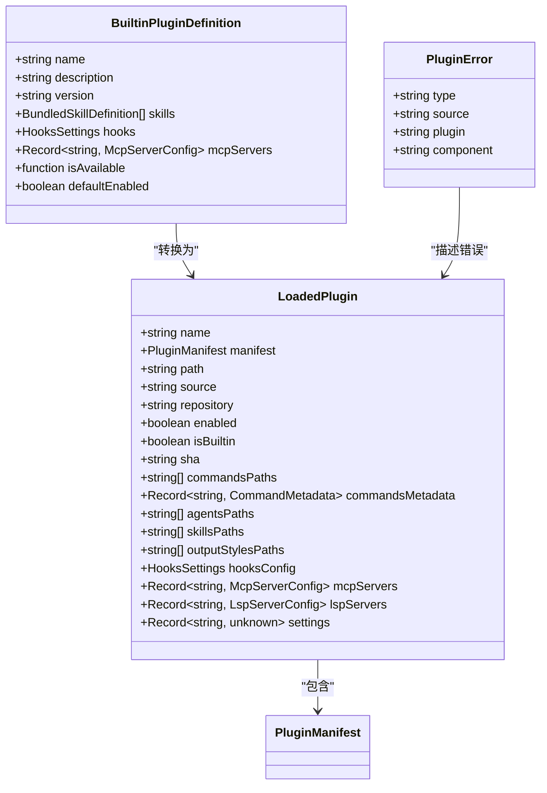

**图表来源**
- [plugin.ts:48-70](file://src/types/plugin.ts#L48-70)
- [plugin.ts:18-35](file://src/types/plugin.ts#L18-35)
- [plugin.ts:101-100](file://src/types/plugin.ts#L101-100)

### 插件生命周期

插件生命周期管理是系统的核心特性，支持完整的启用、禁用、更新和卸载流程：

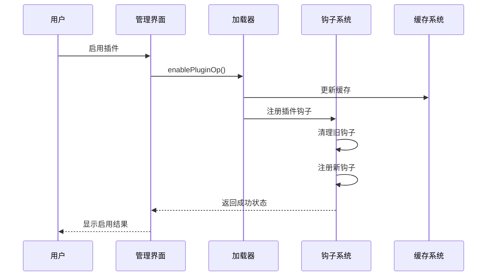

**图表来源**
- [ManagePlugins.tsx:1080-1101](file://src/commands/plugin/ManagePlugins.tsx#L1080-1101)
- [loadPluginHooks.ts:91-157](file://src/utils/plugins/loadPluginHooks.ts#L91-157)

**章节来源**
- [plugin.ts:48-70](file://src/types/plugin.ts#L48-70)
- [builtinPlugins.ts:57-102](file://src/plugins/builtinPlugins.ts#L57-102)

## 架构概览

### 整体架构设计

插件系统采用分层架构设计，确保模块间的松耦合和高内聚：

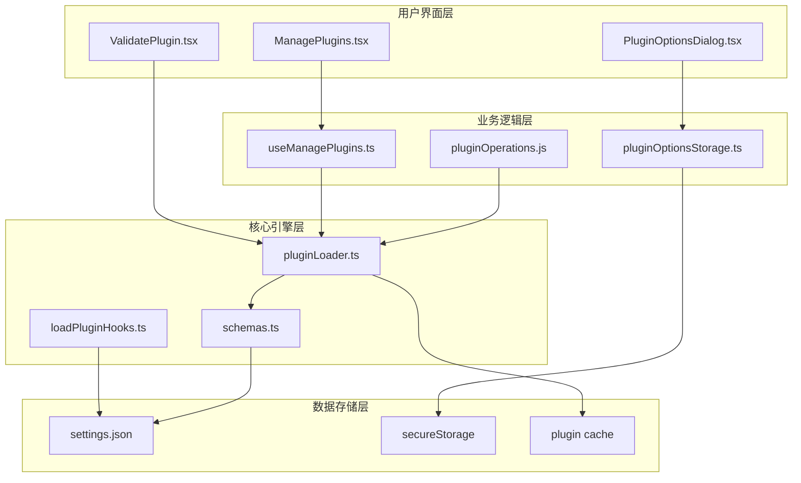

**图表来源**
- [ManagePlugins.tsx:1-200](file://src/commands/plugin/ManagePlugins.tsx#L1-200)
- [useManagePlugins.ts:37-54](file://src/hooks/useManagePlugins.ts#L37-54)
- [pluginLoader.ts:1-200](file://src/utils/plugins/pluginLoader.ts#L1-200)

### 插件发现机制

系统支持多种插件发现方式，包括市场插件、内置插件和会话插件：

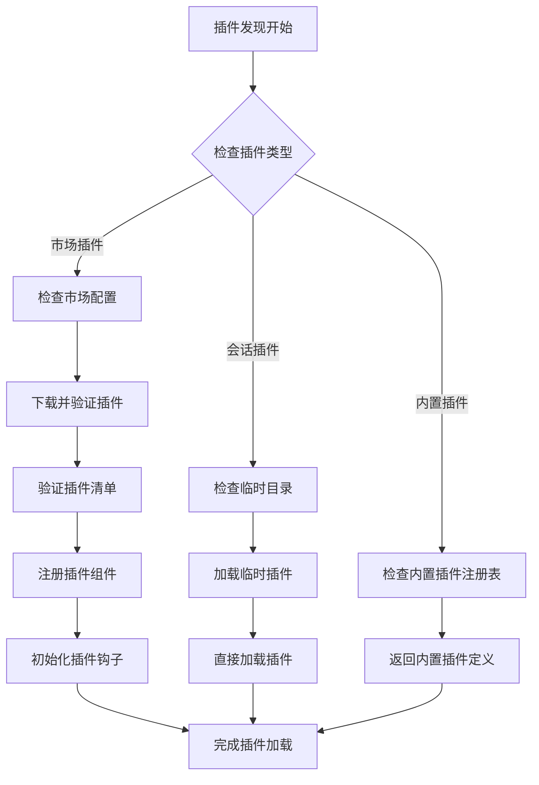

**图表来源**
- [pluginLoader.ts:10-33](file://src/utils/plugins/pluginLoader.ts#L10-33)
- [builtinPlugins.ts:25-32](file://src/plugins/builtinPlugins.ts#L25-32)

**章节来源**
- [pluginLoader.ts:10-33](file://src/utils/plugins/pluginLoader.ts#L10-33)
- [builtinPlugins.ts:1-160](file://src/plugins/builtinPlugins.ts#L1-160)

## 详细组件分析

### 插件清单验证系统

插件清单验证是确保插件质量和安全的重要环节：

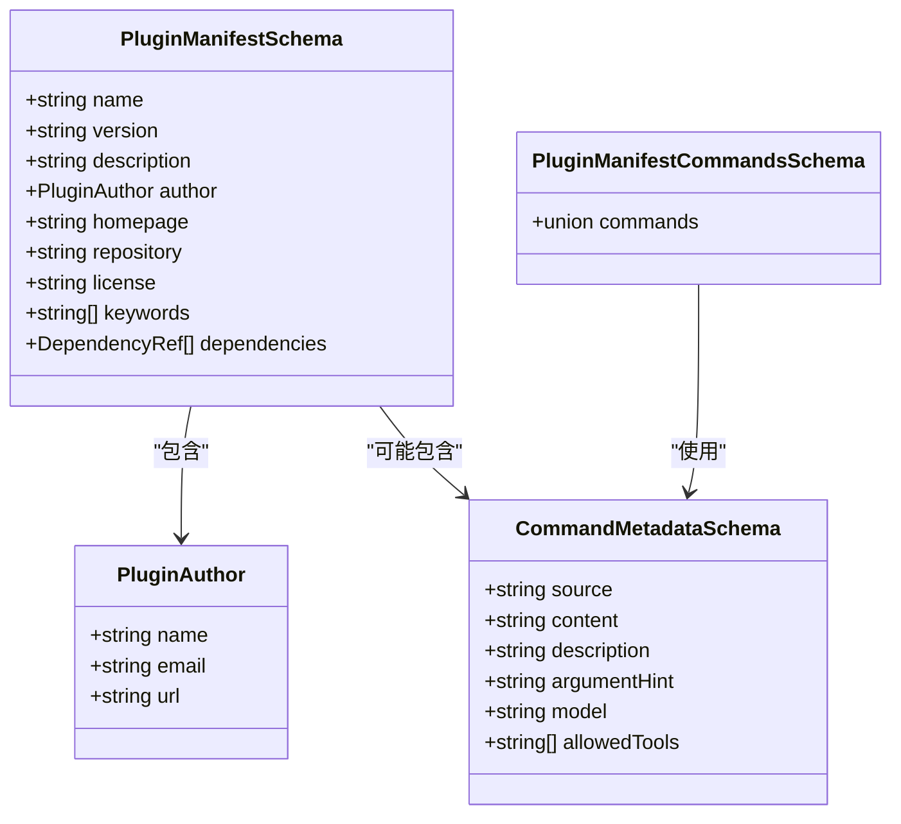

**图表来源**
- [schemas.ts:274-320](file://src/utils/plugins/schemas.ts#L274-320)
- [schemas.ts:251-266](file://src/utils/plugins/schemas.ts#L251-266)
- [schemas.ts:385-416](file://src/utils/plugins/schemas.ts#L385-416)

#### 市场名称验证

系统实现了多层次的市场名称验证机制，防止官方名称冒用：

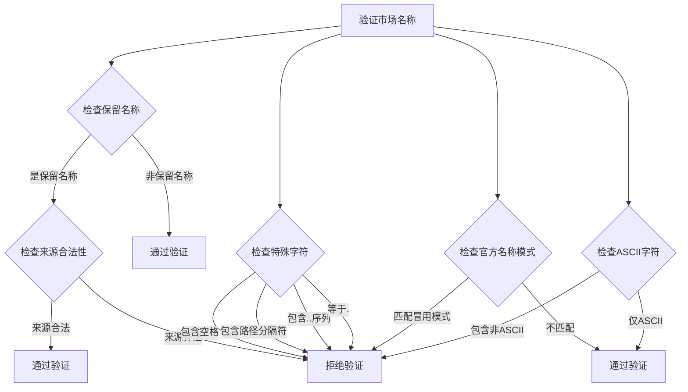

**图表来源**
- [schemas.ts:216-246](file://src/utils/plugins/schemas.ts#L216-246)
- [schemas.ts:71-101](file://src/utils/plugins/schemas.ts#L71-101)

**章节来源**
- [schemas.ts:216-246](file://src/utils/plugins/schemas.ts#L216-246)
- [schemas.ts:71-101](file://src/utils/plugins/schemas.ts#L71-101)

### 钩子系统

钩子系统是插件生命周期管理的核心组件：

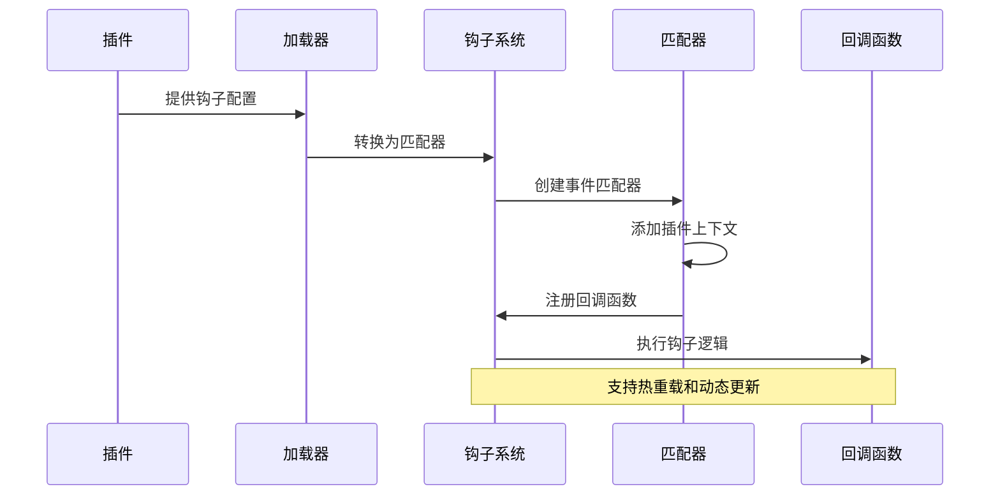

**图表来源**
- [loadPluginHooks.ts:28-86](file://src/utils/plugins/loadPluginHooks.ts#L28-86)
- [loadPluginHooks.ts:91-157](file://src/utils/plugins/loadPluginHooks.ts#L91-157)

#### 钩子事件类型

系统支持丰富的钩子事件类型，覆盖插件生命周期的各个阶段：

| 钩子事件 | 触发时机 | 用途 |
|---------|---------|------|
| PreToolUse | 工具使用前 | 修改工具参数或执行前置检查 |
| PostToolUse | 工具使用后 | 处理工具输出或清理资源 |
| SessionStart | 会话开始 | 初始化会话特定资源 |
| SessionEnd | 会话结束 | 清理会话资源 |
| Setup | 插件安装 | 执行安装后的初始化操作 |
| ConfigChange | 配置变更 | 响应用户配置更改 |

**章节来源**
- [loadPluginHooks.ts:31-59](file://src/utils/plugins/loadPluginHooks.ts#L31-59)
- [sessionHooks.ts:322-430](file://src/utils/hooks/sessionHooks.ts#L322-430)

### 插件选项管理系统

插件选项系统提供了灵活的用户配置机制：

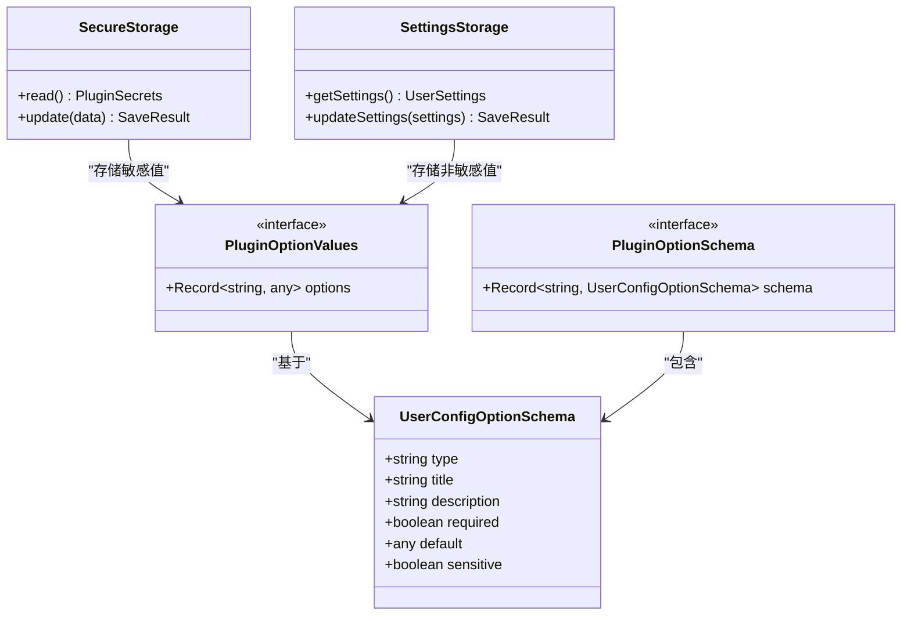

**图表来源**
- [pluginOptionsStorage.ts:31-32](file://src/utils/plugins/pluginOptionsStorage.ts#L31-32)
- [pluginOptionsStorage.ts:56-77](file://src/utils/plugins/pluginOptionsStorage.ts#L56-77)

#### 选项存储策略

系统采用分离存储策略，确保敏感信息的安全性：

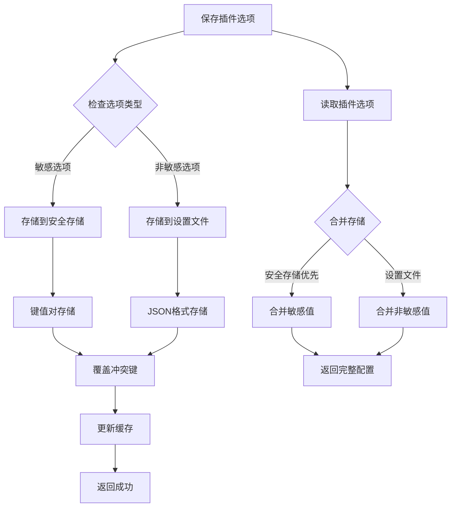

**图表来源**
- [pluginOptionsStorage.ts:90-194](file://src/utils/plugins/pluginOptionsStorage.ts#L90-194)
- [pluginOptionsStorage.ts:56-77](file://src/utils/plugins/pluginOptionsStorage.ts#L56-77)

**章节来源**
- [pluginOptionsStorage.ts:56-77](file://src/utils/plugins/pluginOptionsStorage.ts#L56-77)
- [pluginOptionsStorage.ts:90-194](file://src/utils/plugins/pluginOptionsStorage.ts#L90-194)

## 依赖关系分析

### 插件依赖解析

系统实现了智能的依赖解析机制，确保插件间的正确加载顺序：

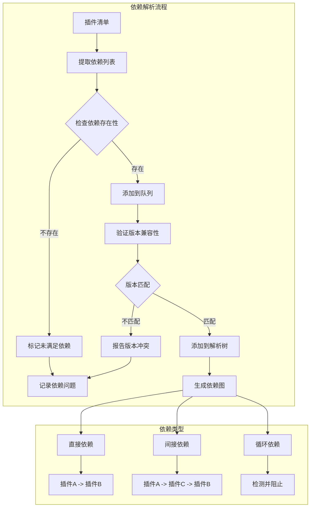

**图表来源**
- [pluginLoader.ts:1023-1207](file://src/utils/plugins/pluginLoader.ts#L1023-1207)
- [schemas.ts:313-318](file://src/utils/plugins/schemas.ts#L313-318)

### 错误处理机制

系统提供了全面的错误处理机制，支持多种错误类型的分类和处理：

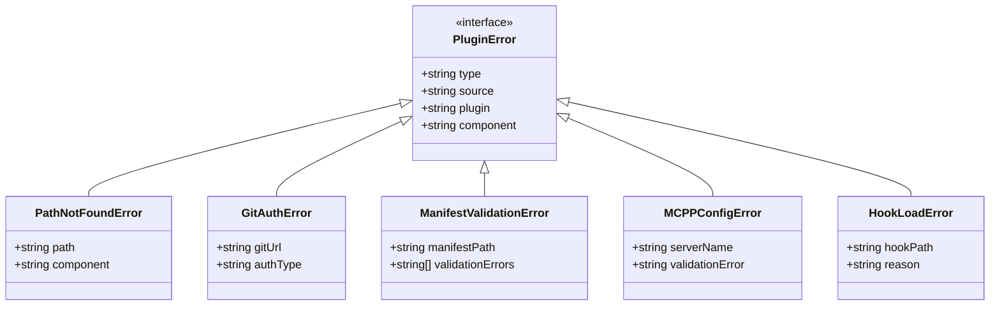

**图表来源**
- [plugin.ts:101-100](file://src/types/plugin.ts#L101-100)
- [plugin.ts:295-363](file://src/types/plugin.ts#L295-363)

**章节来源**
- [plugin.ts:101-100](file://src/types/plugin.ts#L101-100)
- [plugin.ts:295-363](file://src/types/plugin.ts#L295-363)

## 性能考虑

### 缓存策略

系统采用了多层缓存策略来优化插件加载性能：

| 缓存层级 | 缓存内容 | 缓存位置 | 生命周期 |
|---------|---------|---------|---------|
| 内存缓存 | 插件元数据 | 进程内存 | 会话级 |
| 文件缓存 | 插件清单 | ~/.claude/plugins/cache | 永久 |
| ZIP缓存 | 压缩插件包 | ~/.claude/plugins/cache | 永久 |
| 设置缓存 | 用户设置 | settings.json | 持久化 |

### 并发处理

系统支持并发插件加载，通过异步操作提高整体性能：

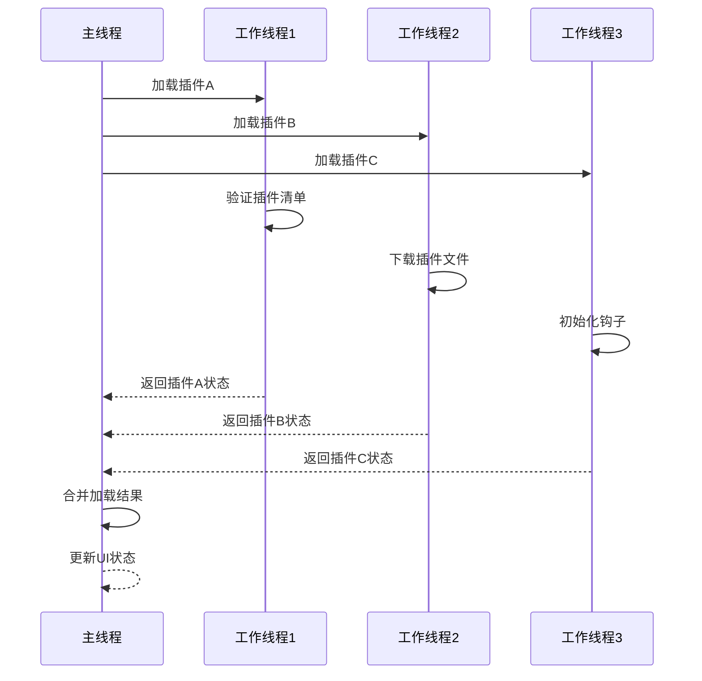

## 故障排除指南

### 常见问题诊断

#### 插件加载失败

当插件加载失败时，系统会提供详细的错误信息：

1. **清单文件损坏**: 检查plugin.json格式是否正确
2. **依赖缺失**: 确认所有必需依赖都已安装
3. **权限问题**: 验证插件目录的访问权限
4. **网络问题**: 检查插件源的可访问性

#### 钩子执行异常

钩子系统提供了完善的调试机制：

1. **钩子注册失败**: 检查钩子配置的语法正确性
2. **钩子执行超时**: 分析钩子逻辑的性能影响
3. **钩子冲突**: 检查多个插件对同一事件的处理

**章节来源**
- [pluginLoader.ts:1023-1207](file://src/utils/plugins/pluginLoader.ts#L1023-1207)
- [loadPluginHooks.ts:255-287](file://src/utils/plugins/loadPluginHooks.ts#L255-287)

### 调试工具

系统提供了多种调试工具来帮助开发者诊断问题：

1. **插件验证工具**: 使用`/plugin validate`命令验证插件清单
2. **日志系统**: 详细的调试日志输出
3. **错误报告**: 结构化的错误信息收集
4. **性能监控**: 插件加载和执行时间统计

## 结论

Claude Code的插件系统提供了一个功能完整、架构清晰的扩展平台。通过本文档的指导，开发者可以：

- 快速理解插件系统的设计理念和架构
- 掌握插件开发的最佳实践和规范
- 有效利用系统提供的工具和API
- 解决常见的开发和部署问题

插件系统的设计充分考虑了安全性、性能和可维护性，为构建高质量的插件提供了坚实的基础。

## 附录

### 开发最佳实践

1. **遵循命名规范**: 使用kebab-case命名插件和组件
2. **完善错误处理**: 为所有可能的错误情况提供处理逻辑
3. **优化性能**: 避免阻塞操作，使用异步处理
4. **安全考虑**: 对用户输入进行严格验证和过滤
5. **文档完善**: 为插件提供清晰的使用说明和示例

### 发布和分发

插件可以通过以下方式发布和分发：

1. **官方市场**: 提交到官方插件市场进行审核
2. **自建市场**: 使用自定义市场配置分发插件
3. **直接分发**: 通过GitHub仓库或其他源直接安装
4. **企业内部**: 在企业环境中部署私有插件

### 常见陷阱避免

1. **循环依赖**: 避免插件间的相互依赖
2. **资源泄漏**: 确保正确清理插件使用的资源
3. **性能问题**: 避免在钩子中执行耗时操作
4. **兼容性问题**: 确保插件与不同版本的Claude Code兼容