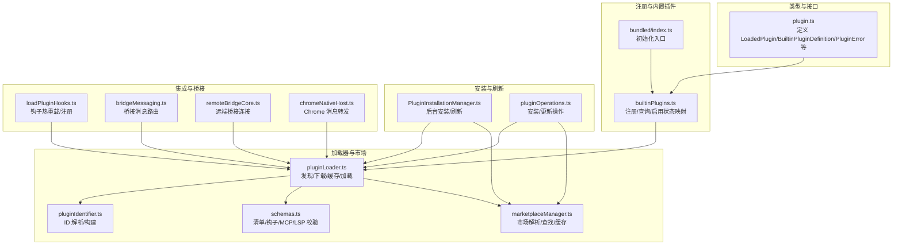
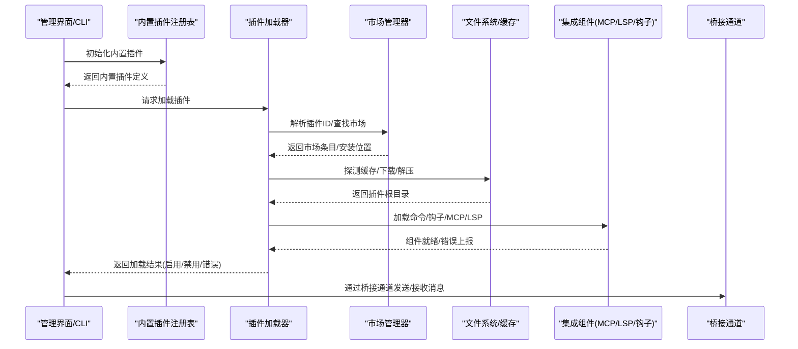
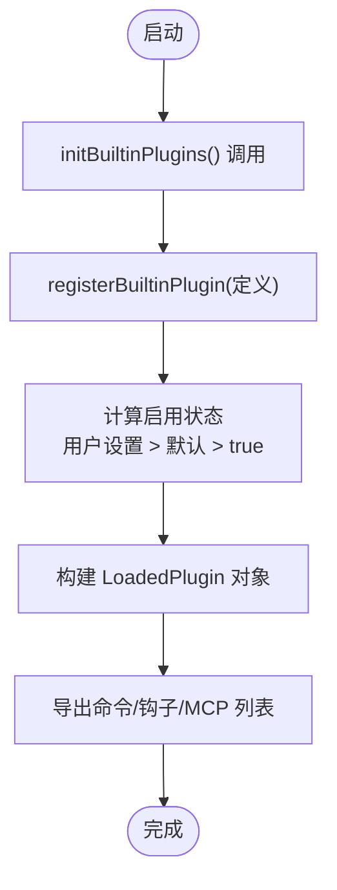
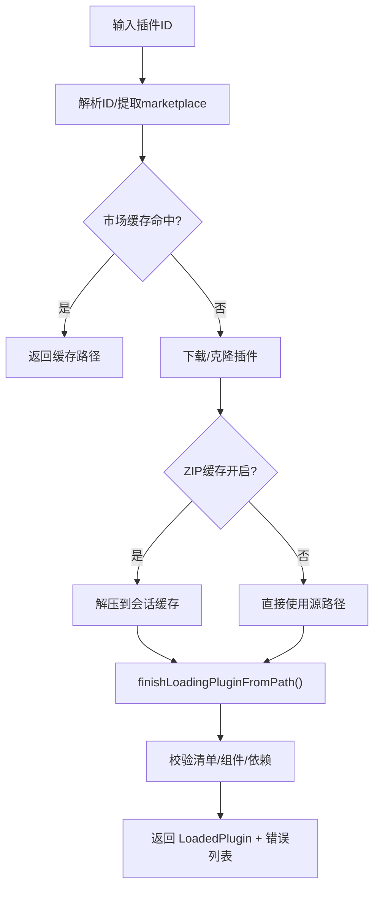
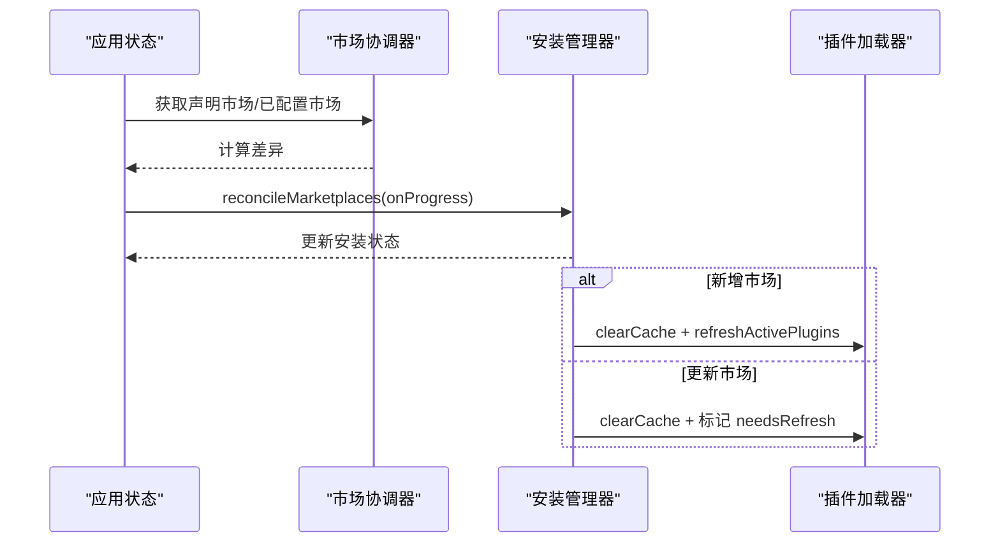
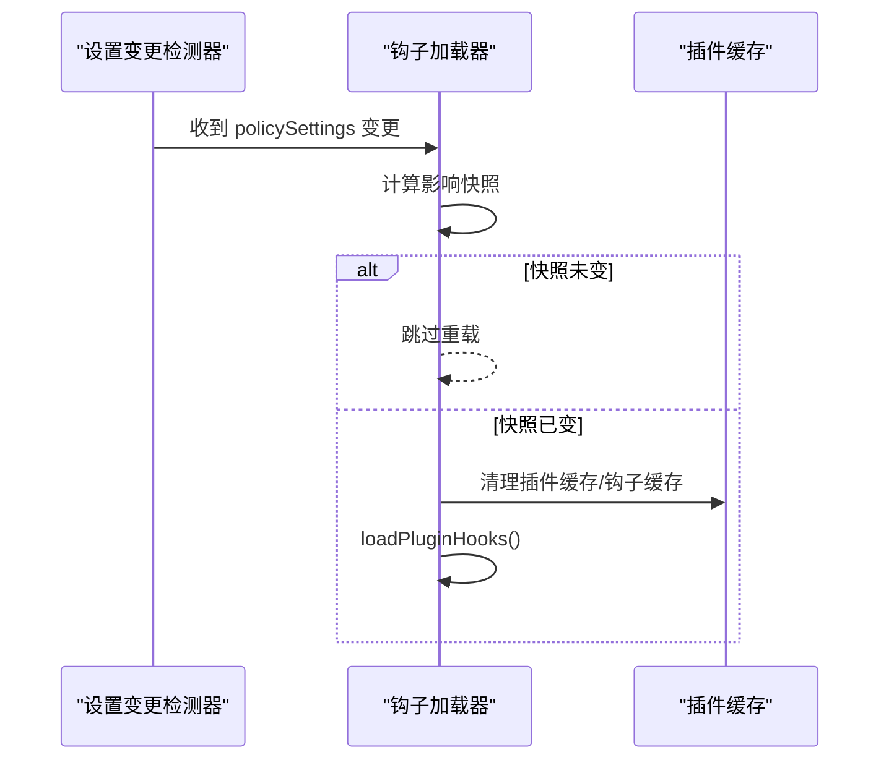
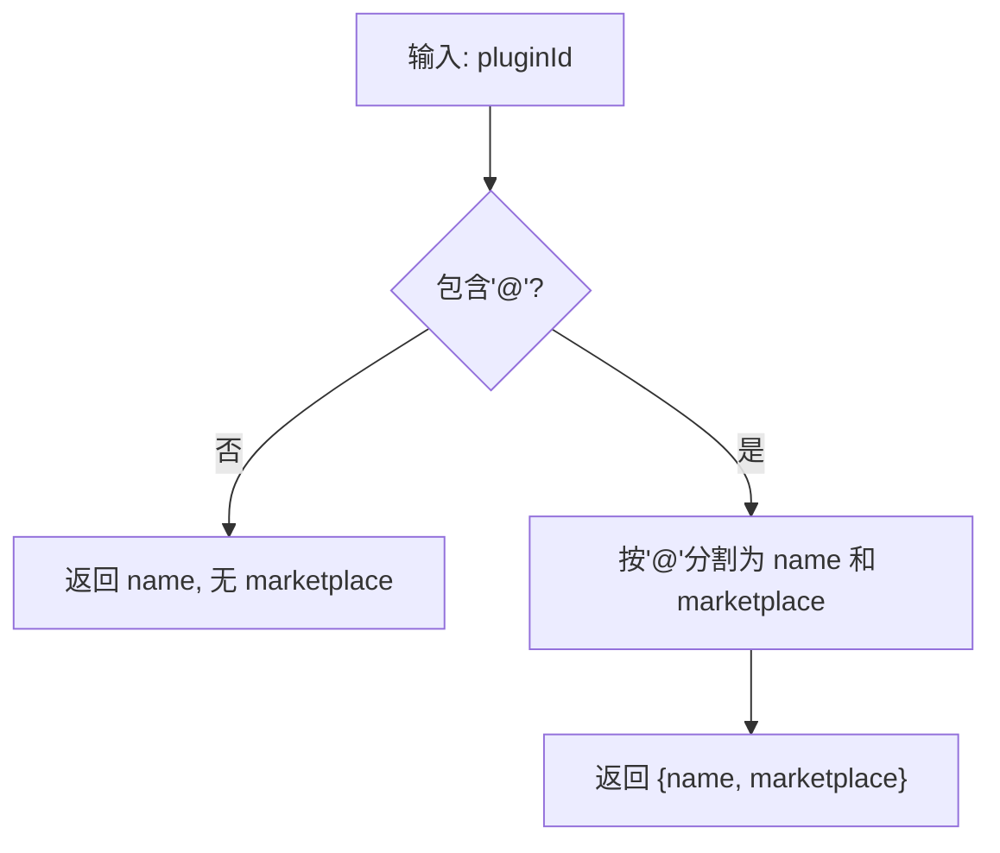
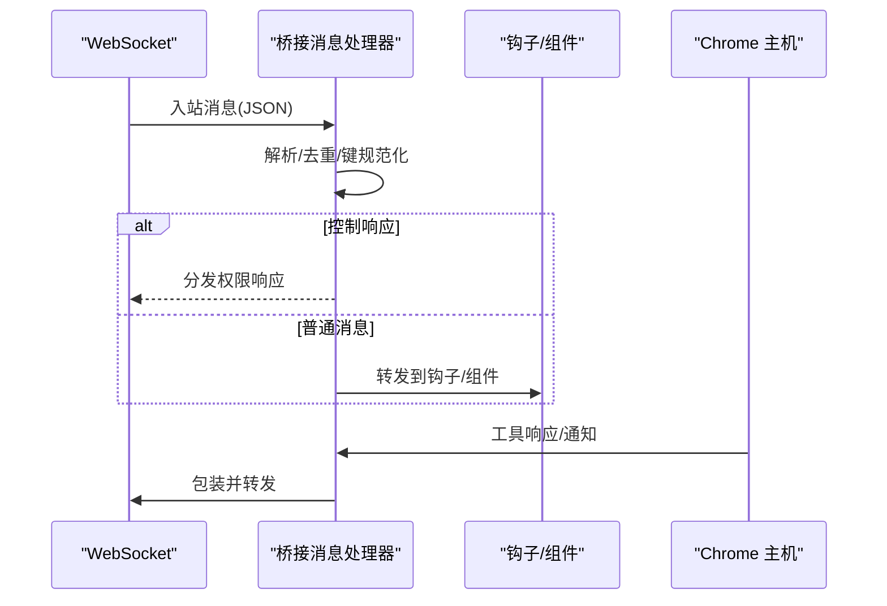
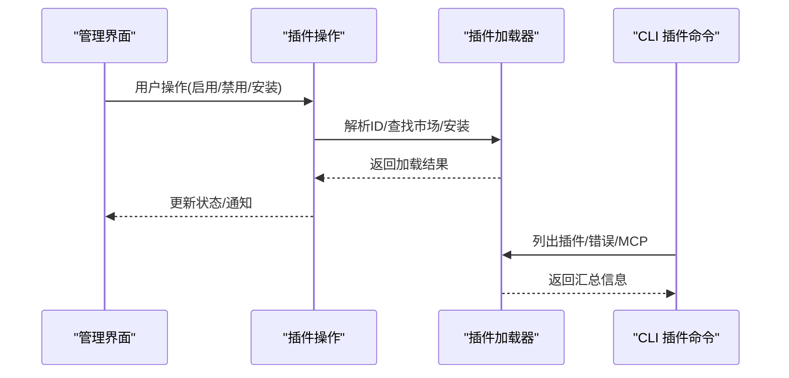
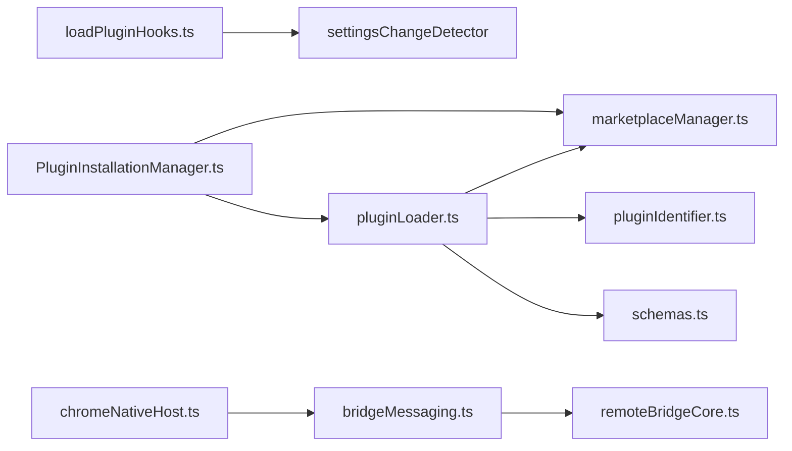

# 插件架构设计

<cite>
**本文档引用的文件**
- [builtinPlugins.ts](file://src/plugins/builtinPlugins.ts)
- [index.ts](file://src/plugins/bundled/index.ts)
- [plugin.ts](file://src/types/plugin.ts)
- [pluginLoader.ts](file://src/utils/plugins/pluginLoader.ts)
- [loadPluginHooks.ts](file://src/utils/plugins/loadPluginHooks.ts)
- [marketplaceManager.ts](file://src/utils/plugins/marketplaceManager.ts)
- [pluginIdentifier.ts](file://src/utils/plugins/pluginIdentifier.ts)
- [PluginInstallationManager.ts](file://src/services/plugins/PluginInstallationManager.ts)
- [schemas.ts](file://src/utils/plugins/schemas.ts)
- [bridgeMessaging.ts](file://src/bridge/bridgeMessaging.ts)
- [remoteBridgeCore.ts](file://src/bridge/remoteBridgeCore.ts)
- [chromeNativeHost.ts](file://src/utils/claudeInChrome/chromeNativeHost.ts)
- [plugins.ts](file://src/cli/handlers/plugins.ts)
- [ManagePlugins.tsx](file://src/commands/plugin/ManagePlugins.tsx)
- [pluginOperations.ts](file://src/services/plugins/pluginOperations.ts)
- [pluginInstallationHelpers.ts](file://src/utils/plugins/pluginInstallationHelpers.ts)
- [dependencyResolver.ts](file://src/utils/plugins/dependencyResolver.ts)
</cite>

## 目录
1. [简介](#简介)
2. [项目结构](#项目结构)
3. [核心组件](#核心组件)
4. [架构总览](#架构总览)
5. [详细组件分析](#详细组件分析)
6. [依赖关系分析](#依赖关系分析)
7. [性能考量](#性能考量)
8. [故障排查指南](#故障排查指南)
9. [结论](#结论)

## 简介
本文件系统化阐述 Claude Code 插件架构的设计与实现，覆盖插件注册机制、生命周期管理、插件间通信方式、接口规范与数据结构、标识符与命名空间管理、与核心系统的集成点与依赖关系，并给出扩展性设计建议与性能优化策略。文档面向不同技术背景读者，既提供高层概览也包含代码级图表与来源标注。

## 项目结构
插件系统围绕以下关键模块组织：
- 类型与接口：定义插件元数据、加载结果、错误类型等核心数据结构
- 注册与内置插件：内置插件注册表与启用/禁用状态管理
- 加载器：从市场或本地目录加载插件、解析清单、处理依赖与缓存
- 市场与安装：市场配置、后台安装、刷新与错误处理
- 集成与桥接：与 MCP/LSP 等外部服务集成，以及桥接通道的消息路由
- UI 与命令行：插件管理界面与 CLI 插件子命令

**图表来源**
- [plugin.ts:1-364](file://src/types/plugin.ts#L1-L364)
- [builtinPlugins.ts:1-130](file://src/plugins/builtinPlugins.ts#L1-L130)
- [index.ts:1-24](file://src/plugins/bundled/index.ts#L1-L24)
- [pluginLoader.ts:1-200](file://src/utils/plugins/pluginLoader.ts#L1-L200)
- [marketplaceManager.ts:2215-2267](file://src/utils/plugins/marketplaceManager.ts#L2215-L2267)
- [schemas.ts:1-800](file://src/utils/plugins/schemas.ts#L1-L800)
- [pluginIdentifier.ts:34-67](file://src/utils/plugins/pluginIdentifier.ts#L34-L67)
- [PluginInstallationManager.ts:1-185](file://src/services/plugins/PluginInstallationManager.ts#L1-L185)
- [pluginOperations.ts:335-379](file://src/services/plugins/pluginOperations.ts#L335-L379)
- [loadPluginHooks.ts:186-287](file://src/utils/plugins/loadPluginHooks.ts#L186-L287)
- [bridgeMessaging.ts:124-148](file://src/bridge/bridgeMessaging.ts#L124-L148)
- [remoteBridgeCore.ts:379-389](file://src/bridge/remoteBridgeCore.ts#L379-L389)
- [chromeNativeHost.ts:234-385](file://src/utils/claudeInChrome/chromeNativeHost.ts#L234-L385)

**章节来源**
- [plugin.ts:1-364](file://src/types/plugin.ts#L1-L364)
- [builtinPlugins.ts:1-130](file://src/plugins/builtinPlugins.ts#L1-L130)
- [index.ts:1-24](file://src/plugins/bundled/index.ts#L1-L24)
- [pluginLoader.ts:1-200](file://src/utils/plugins/pluginLoader.ts#L1-L200)
- [marketplaceManager.ts:2215-2267](file://src/utils/plugins/marketplaceManager.ts#L2215-L2267)
- [schemas.ts:1-800](file://src/utils/plugins/schemas.ts#L1-L800)
- [pluginIdentifier.ts:34-67](file://src/utils/plugins/pluginIdentifier.ts#L34-L67)
- [PluginInstallationManager.ts:1-185](file://src/services/plugins/PluginInstallationManager.ts#L1-L185)
- [pluginOperations.ts:335-379](file://src/services/plugins/pluginOperations.ts#L335-L379)
- [loadPluginHooks.ts:186-287](file://src/utils/plugins/loadPluginHooks.ts#L186-L287)
- [bridgeMessaging.ts:124-148](file://src/bridge/bridgeMessaging.ts#L124-L148)
- [remoteBridgeCore.ts:379-389](file://src/bridge/remoteBridgeCore.ts#L379-L389)
- [chromeNativeHost.ts:234-385](file://src/utils/claudeInChrome/chromeNativeHost.ts#L234-L385)

## 核心组件
- 插件类型与数据结构
  - BuiltinPluginDefinition：内置插件定义，包含名称、描述、版本、技能、钩子、MCP 服务器、可用性检查与默认启用状态
  - LoadedPlugin：已加载插件对象，包含清单、路径、来源、仓库标识、启用状态、是否内置、组件路径与配置、钩子与 MCP/LSP 配置等
  - PluginError：统一的插件错误类型，涵盖路径不存在、网络错误、清单解析/校验失败、市场不可用、MCP/LSP 配置无效/启动失败、依赖不满足等
  - PluginLoadResult：加载结果聚合（启用/禁用插件列表与错误列表）

- 内置插件注册与状态
  - 注册：在启动时调用注册函数将内置插件加入注册表
  - 查询：按名称获取定义；判断是否内置插件 ID
  - 构建 LoadedPlugin：根据用户设置与默认值生成启用/禁用列表，内置插件来源为“builtin”命名空间

- 插件标识符与命名空间
  - 格式：name@marketplace 或 name@builtin
  - 解析/构建：提供解析与构建工具，支持多市场与内置场景
  - 命名空间隔离：内置插件使用专用命名空间，避免与市场插件冲突

- 加载器与市场
  - 发现顺序：市场插件优先于会话插件
  - 缓存与 ZIP：支持版本化缓存与 ZIP 缓存，提升加载速度
  - 清单校验：基于 Zod schema 的清单、钩子、MCP/LSP 等结构校验
  - 错误收集：统一错误类型与可读消息映射

- 安装与刷新
  - 后台安装：声明市场与实际配置差异时自动安装/更新市场
  - 刷新策略：新市场安装后自动刷新插件，更新后提示用户手动刷新
  - 安装操作：在指定市场中查找插件条目并执行安装

- 集成与桥接
  - 钩子热重载：监听策略设置变化，按需清理缓存并重新加载钩子
  - 桥接消息：桥接通道对入站消息进行解析与路由，过滤重复消息
  - 远端桥接：建立远端传输连接，记录诊断事件
  - Chrome 消息：作为 MCP 客户端代理，转发通知与响应

**章节来源**
- [plugin.ts:18-364](file://src/types/plugin.ts#L18-L364)
- [builtinPlugins.ts:21-130](file://src/plugins/builtinPlugins.ts#L21-L130)
- [index.ts:17-24](file://src/plugins/bundled/index.ts#L17-L24)
- [pluginIdentifier.ts:34-67](file://src/utils/plugins/pluginIdentifier.ts#L34-L67)
- [pluginLoader.ts:1-200](file://src/utils/plugins/pluginLoader.ts#L1-L200)
- [schemas.ts:1-800](file://src/utils/plugins/schemas.ts#L1-L800)
- [PluginInstallationManager.ts:60-185](file://src/services/plugins/PluginInstallationManager.ts#L60-L185)
- [pluginOperations.ts:335-379](file://src/services/plugins/pluginOperations.ts#L335-L379)
- [loadPluginHooks.ts:186-287](file://src/utils/plugins/loadPluginHooks.ts#L186-L287)
- [bridgeMessaging.ts:124-148](file://src/bridge/bridgeMessaging.ts#L124-L148)
- [remoteBridgeCore.ts:379-389](file://src/bridge/remoteBridgeCore.ts#L379-L389)
- [chromeNativeHost.ts:234-385](file://src/utils/claudeInChrome/chromeNativeHost.ts#L234-L385)

## 架构总览
下图展示插件系统从注册到加载、从市场解析到组件集成的整体流程。

**图表来源**
- [builtinPlugins.ts:21-130](file://src/plugins/builtinPlugins.ts#L21-L130)
- [pluginLoader.ts:1-200](file://src/utils/plugins/pluginLoader.ts#L1-L200)
- [marketplaceManager.ts:2215-2267](file://src/utils/plugins/marketplaceManager.ts#L2215-L2267)
- [PluginInstallationManager.ts:60-185](file://src/services/plugins/PluginInstallationManager.ts#L60-L185)
- [loadPluginHooks.ts:186-287](file://src/utils/plugins/loadPluginHooks.ts#L186-L287)
- [bridgeMessaging.ts:124-148](file://src/bridge/bridgeMessaging.ts#L124-L148)

## 详细组件分析

### 内置插件注册与状态管理
- 注册机制：在启动阶段调用注册函数，将插件定义写入内存注册表
- 状态映射：根据用户设置与默认值生成 LoadedPlugin，内置插件来源标记为“builtin”
- 查询接口：按名称获取定义；判断是否内置插件 ID
- 技能导出：仅启用的内置插件技能会被转换为命令对象供 UI 使用

**图表来源**
- [index.ts:17-24](file://src/plugins/bundled/index.ts#L17-L24)
- [builtinPlugins.ts:21-130](file://src/plugins/builtinPlugins.ts#L21-L130)

**章节来源**
- [index.ts:17-24](file://src/plugins/bundled/index.ts#L17-L24)
- [builtinPlugins.ts:21-130](file://src/plugins/builtinPlugins.ts#L21-L130)

### 插件加载器与缓存策略
- 发现与优先级：市场插件优先于会话插件
- 缓存路径：版本化缓存目录，支持种子缓存探测
- ZIP 缓存：可选的 ZIP 缓存与提取，加速加载
- 清单与校验：基于 Zod schema 的强类型校验
- 错误收集：统一错误类型与人类可读消息映射

**图表来源**
- [pluginLoader.ts:1-200](file://src/utils/plugins/pluginLoader.ts#L1-L200)
- [pluginLoader.ts:123-2410](file://src/utils/plugins/pluginLoader.ts#L123-L2410)

**章节来源**
- [pluginLoader.ts:1-200](file://src/utils/plugins/pluginLoader.ts#L1-L200)
- [pluginLoader.ts:123-2410](file://src/utils/plugins/pluginLoader.ts#L123-L2410)

### 市场与安装管理
- 市场解析：支持缓存优先与源拉取两种路径
- 插件查找：按 ID 在指定市场或所有已知市场中查找
- 后台安装：根据声明市场与实际配置差异，自动安装/更新市场
- 刷新策略：新市场安装后自动刷新插件，更新后提示用户刷新

**图表来源**
- [PluginInstallationManager.ts:60-185](file://src/services/plugins/PluginInstallationManager.ts#L60-L185)
- [marketplaceManager.ts:2215-2267](file://src/utils/plugins/marketplaceManager.ts#L2215-L2267)

**章节来源**
- [PluginInstallationManager.ts:60-185](file://src/services/plugins/PluginInstallationManager.ts#L60-L185)
- [marketplaceManager.ts:2215-2267](file://src/utils/plugins/marketplaceManager.ts#L2215-L2267)

### 钩子系统与热重载
- 注册与存活：根据启用的插件根路径筛选存活匹配器，保留回调钩子
- 热重载触发：当策略设置变化且影响插件的快照发生变更时，清理缓存并重新加载钩子

**图表来源**
- [loadPluginHooks.ts:186-287](file://src/utils/plugins/loadPluginHooks.ts#L186-L287)

**章节来源**
- [loadPluginHooks.ts:186-287](file://src/utils/plugins/loadPluginHooks.ts#L186-L287)

### 插件标识符与命名空间
- 解析：支持 name@marketplace 与 name@builtin 两种格式
- 构建：从名称与市场名组合生成插件 ID
- 校验：保留关键字与非法字符限制，确保命名安全

**图表来源**
- [pluginIdentifier.ts:34-67](file://src/utils/plugins/pluginIdentifier.ts#L34-L67)

**章节来源**
- [pluginIdentifier.ts:34-67](file://src/utils/plugins/pluginIdentifier.ts#L34-L67)

### 插件与桥接通道的通信
- 入站消息路由：解析并过滤重复消息，区分控制响应与其他消息
- 远端桥接：建立传输连接，记录诊断事件
- Chrome 消息：作为 MCP 客户端代理，转发通知与工具响应

**图表来源**
- [bridgeMessaging.ts:124-148](file://src/bridge/bridgeMessaging.ts#L124-L148)
- [remoteBridgeCore.ts:379-389](file://src/bridge/remoteBridgeCore.ts#L379-L389)
- [chromeNativeHost.ts:234-385](file://src/utils/claudeInChrome/chromeNativeHost.ts#L234-L385)

**章节来源**
- [bridgeMessaging.ts:124-148](file://src/bridge/bridgeMessaging.ts#L124-L148)
- [remoteBridgeCore.ts:379-389](file://src/bridge/remoteBridgeCore.ts#L379-L389)
- [chromeNativeHost.ts:234-385](file://src/utils/claudeInChrome/chromeNativeHost.ts#L234-L385)

### UI 与 CLI 集成
- 管理界面：展示内置与市场插件，支持启用/禁用、查看命令/钩子/MCP 列表
- CLI 插件命令：列出已安装插件、显示错误与 MCP 服务器信息

**图表来源**
- [ManagePlugins.tsx:224-245](file://src/commands/plugin/ManagePlugins.tsx#L224-L245)
- [plugins.ts:199-282](file://src/cli/handlers/plugins.ts#L199-L282)
- [pluginOperations.ts:335-379](file://src/services/plugins/pluginOperations.ts#L335-L379)

**章节来源**
- [ManagePlugins.tsx:224-245](file://src/commands/plugin/ManagePlugins.tsx#L224-L245)
- [plugins.ts:199-282](file://src/cli/handlers/plugins.ts#L199-L282)
- [pluginOperations.ts:335-379](file://src/services/plugins/pluginOperations.ts#L335-L379)

## 依赖关系分析
- 组件耦合
  - 插件加载器依赖市场管理器、标识符解析、缓存与 ZIP 处理、清单校验
  - 钩子系统依赖设置变更检测器与缓存清理
  - 安装管理器依赖市场协调与插件刷新
  - 桥接通道依赖消息解析与传输层

**图表来源**
- [pluginLoader.ts:1-200](file://src/utils/plugins/pluginLoader.ts#L1-L200)
- [marketplaceManager.ts:2215-2267](file://src/utils/plugins/marketplaceManager.ts#L2215-L2267)
- [pluginIdentifier.ts:34-67](file://src/utils/plugins/pluginIdentifier.ts#L34-L67)
- [schemas.ts:1-800](file://src/utils/plugins/schemas.ts#L1-L800)
- [loadPluginHooks.ts:186-287](file://src/utils/plugins/loadPluginHooks.ts#L186-L287)
- [PluginInstallationManager.ts:60-185](file://src/services/plugins/PluginInstallationManager.ts#L60-L185)
- [bridgeMessaging.ts:124-148](file://src/bridge/bridgeMessaging.ts#L124-L148)
- [remoteBridgeCore.ts:379-389](file://src/bridge/remoteBridgeCore.ts#L379-L389)
- [chromeNativeHost.ts:234-385](file://src/utils/claudeInChrome/chromeNativeHost.ts#L234-L385)

**章节来源**
- [pluginLoader.ts:1-200](file://src/utils/plugins/pluginLoader.ts#L1-L200)
- [marketplaceManager.ts:2215-2267](file://src/utils/plugins/marketplaceManager.ts#L2215-L2267)
- [pluginIdentifier.ts:34-67](file://src/utils/plugins/pluginIdentifier.ts#L34-L67)
- [schemas.ts:1-800](file://src/utils/plugins/schemas.ts#L1-L800)
- [loadPluginHooks.ts:186-287](file://src/utils/plugins/loadPluginHooks.ts#L186-L287)
- [PluginInstallationManager.ts:60-185](file://src/services/plugins/PluginInstallationManager.ts#L60-L185)
- [bridgeMessaging.ts:124-148](file://src/bridge/bridgeMessaging.ts#L124-L148)
- [remoteBridgeCore.ts:379-389](file://src/bridge/remoteBridgeCore.ts#L379-L389)
- [chromeNativeHost.ts:234-385](file://src/utils/claudeInChrome/chromeNativeHost.ts#L234-L385)

## 性能考量
- 缓存与 ZIP：版本化缓存与 ZIP 缓存显著减少重复下载与解压开销
- 种子缓存：支持从种子目录预热缓存，进一步缩短首次加载时间
- 异步与后台：市场安装与插件刷新采用后台执行，避免阻塞启动
- 去重与限流：桥接通道对重复消息进行去重，降低无效处理
- 错误早返回：在解析/校验阶段尽早失败，减少后续昂贵操作

[本节为通用性能讨论，无需具体文件来源]

## 故障排查指南
- 常见错误类型
  - 路径不存在、网络错误、清单解析/校验失败、市场不可用、MCP/LSP 配置无效/启动失败、依赖不满足、插件缓存缺失等
- 错误消息映射：提供统一的错误消息生成逻辑，便于日志与 UI 展示
- 依赖解析：跨市场依赖被阻止，循环依赖与重复安装被检测与报告
- 安装辅助：CLI 插件命令可列出插件、错误与 MCP 服务器，帮助定位问题

**章节来源**
- [plugin.ts:101-363](file://src/types/plugin.ts#L101-L363)
- [pluginInstallationHelpers.ts:258-297](file://src/utils/plugins/pluginInstallationHelpers.ts#L258-L297)
- [dependencyResolver.ts:106-142](file://src/utils/plugins/dependencyResolver.ts#L106-L142)
- [plugins.ts:199-282](file://src/cli/handlers/plugins.ts#L199-L282)

## 结论
Claude Code 插件系统以类型安全的数据结构为核心，结合内置插件注册、市场驱动的安装与缓存、强校验的清单与组件加载、以及钩子热重载与桥接通道通信，形成了高扩展性与高可靠性的插件生态。通过命名空间隔离与严格的依赖解析策略，系统在保证安全性的同时提供了灵活的扩展能力。建议在后续迭代中逐步完善错误类型的覆盖范围与 UI 提示，持续优化缓存策略与增量加载能力。