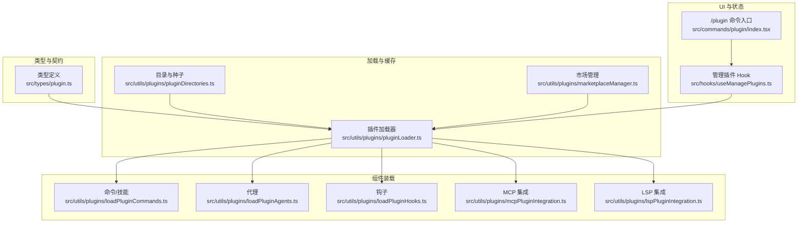
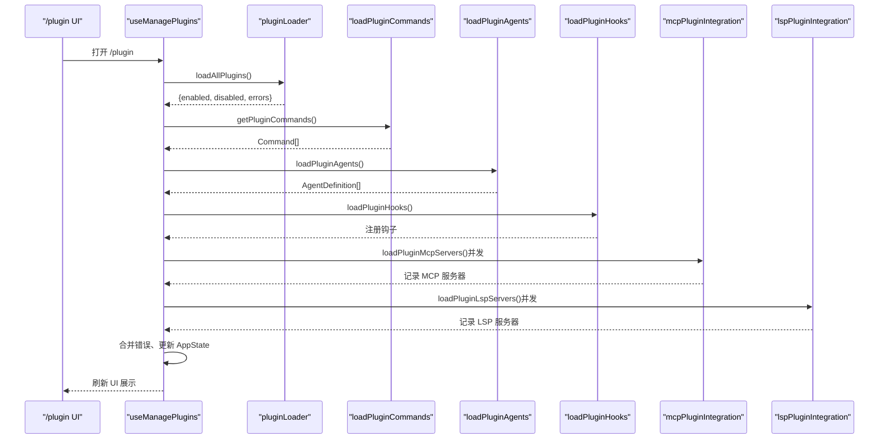
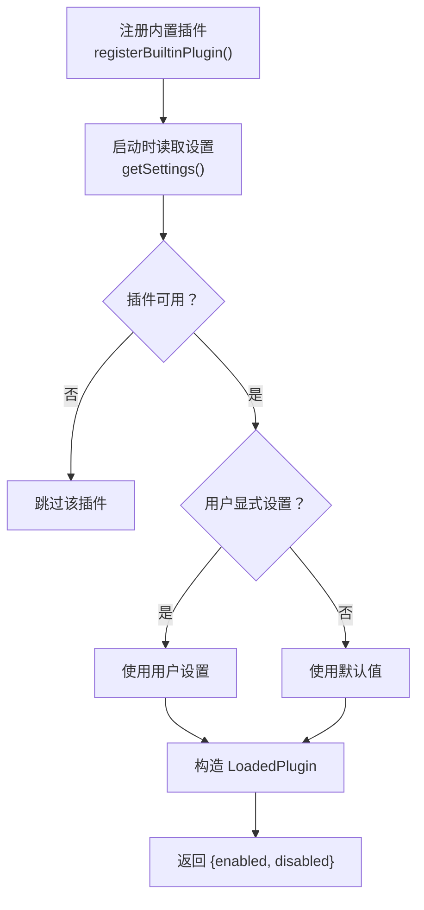
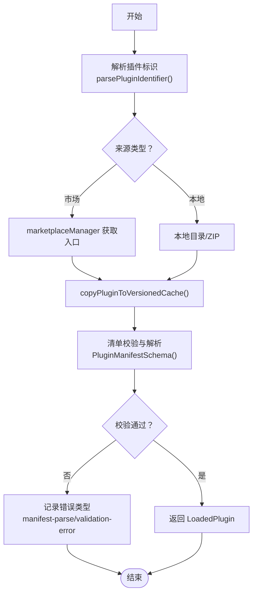
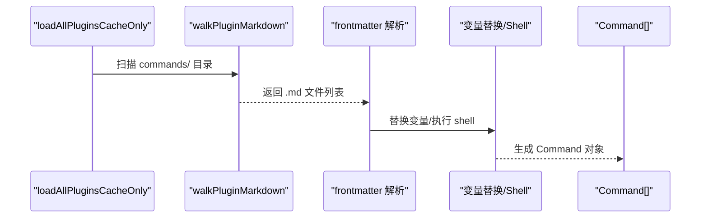
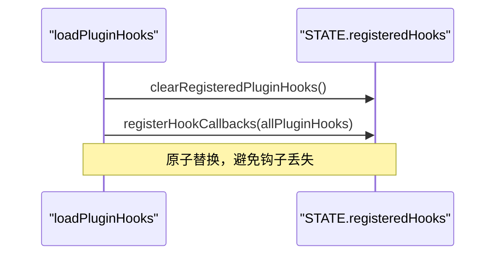
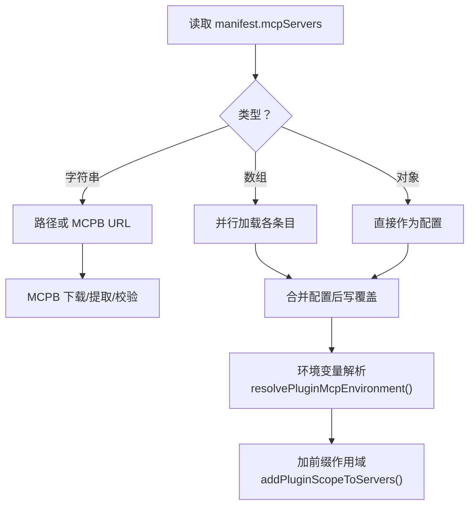
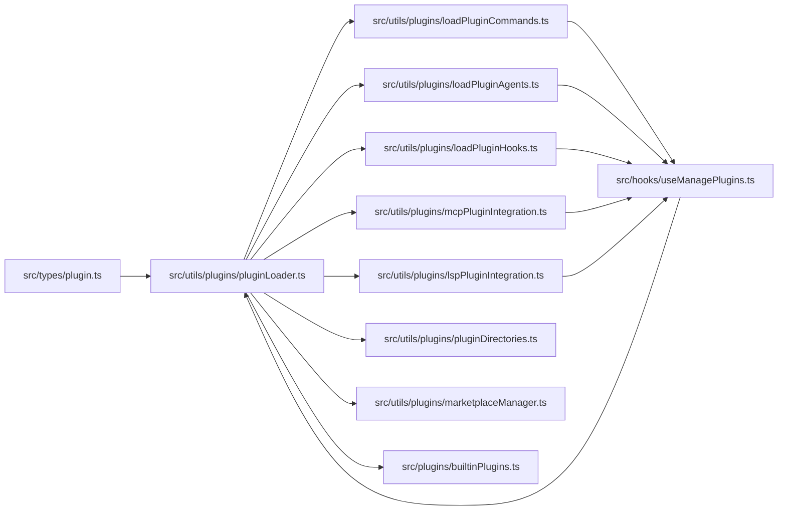

# 插件系统

<cite>
**本文引用的文件**
- [builtinPlugins.ts](file://src/plugins/builtinPlugins.ts)
- [plugin.ts](file://src/types/plugin.ts)
- [useManagePlugins.ts](file://src/hooks/useManagePlugins.ts)
- [pluginLoader.ts](file://src/utils/plugins/pluginLoader.ts)
- [loadPluginCommands.ts](file://src/utils/plugins/loadPluginCommands.ts)
- [loadPluginAgents.ts](file://src/utils/plugins/loadPluginAgents.ts)
- [loadPluginHooks.ts](file://src/utils/plugins/loadPluginHooks.ts)
- [mcpPluginIntegration.ts](file://src/utils/plugins/mcpPluginIntegration.ts)
- [lspPluginIntegration.ts](file://src/utils/plugins/lspPluginIntegration.ts)
- [pluginDirectories.ts](file://src/utils/plugins/pluginDirectories.ts)
- [marketplaceManager.ts](file://src/utils/plugins/marketplaceManager.ts)
- [index.tsx](file://src/commands/plugin/index.tsx)
</cite>

## 目录
1. [简介](#简介)
2. [项目结构](#项目结构)
3. [核心组件](#核心组件)
4. [架构总览](#架构总览)
5. [详细组件分析](#详细组件分析)
6. [依赖关系分析](#依赖关系分析)
7. [性能考量](#性能考量)
8. [故障排查指南](#故障排查指南)
9. [结论](#结论)
10. [附录](#附录)

## 简介
本文件系统性阐述 Claude Code 插件系统的架构设计与实现机制，覆盖插件发现、加载、验证、卸载、内置插件、插件市场集成、权限与安全控制、以及与技能系统的集成方式。文档同时提供开发指南、最佳实践与调试方法，帮助开发者快速上手并稳定扩展插件生态。

## 项目结构
插件系统围绕“类型定义—加载器—组件装载—市场与目录—集成服务—UI命令”六大层面组织，形成清晰的分层与职责边界：

- 类型与契约：统一的插件类型、错误模型与清单格式
- 加载与缓存：插件发现、版本化缓存、种子缓存、网络与本地来源处理
- 组件装载：命令/技能、代理、钩子、MCP/LSP 服务器
- 市场与目录：已知市场、缓存、种子目录、数据目录
- 集成服务：MCP/LSP 环境变量解析、作用域命名、冲突消解
- UI 命令：/plugin 管理界面入口

图表来源
- [plugin.ts:1-364](file://src/types/plugin.ts#L1-L364)
- [pluginLoader.ts:1-800](file://src/utils/plugins/pluginLoader.ts#L1-L800)
- [loadPluginCommands.ts:1-947](file://src/utils/plugins/loadPluginCommands.ts#L1-L947)
- [loadPluginAgents.ts:1-349](file://src/utils/plugins/loadPluginAgents.ts#L1-L349)
- [loadPluginHooks.ts:1-288](file://src/utils/plugins/loadPluginHooks.ts#L1-L288)
- [mcpPluginIntegration.ts:1-635](file://src/utils/plugins/mcpPluginIntegration.ts#L1-L635)
- [lspPluginIntegration.ts:1-388](file://src/utils/plugins/lspPluginIntegration.ts#L1-L388)
- [pluginDirectories.ts:1-179](file://src/utils/plugins/pluginDirectories.ts#L1-L179)
- [marketplaceManager.ts:1-800](file://src/utils/plugins/marketplaceManager.ts#L1-L800)
- [useManagePlugins.ts:1-305](file://src/hooks/useManagePlugins.ts#L1-L305)
- [index.tsx:1-11](file://src/commands/plugin/index.tsx#L1-L11)

章节来源
- [plugin.ts:1-364](file://src/types/plugin.ts#L1-L364)
- [pluginLoader.ts:1-800](file://src/utils/plugins/pluginLoader.ts#L1-L800)
- [pluginDirectories.ts:1-179](file://src/utils/plugins/pluginDirectories.ts#L1-L179)
- [marketplaceManager.ts:1-800](file://src/utils/plugins/marketplaceManager.ts#L1-L800)
- [useManagePlugins.ts:1-305](file://src/hooks/useManagePlugins.ts#L1-L305)
- [index.tsx:1-11](file://src/commands/plugin/index.tsx#L1-L11)

## 核心组件
- 插件类型与错误模型：统一承载插件清单、加载结果、错误类型与消息映射，确保类型安全与可诊断性
- 内置插件注册表：集中管理随 CLI 发布的内置插件，支持启用/禁用与可用性检查
- 插件加载器：负责从市场或本地源发现、克隆/复制、校验、缓存与版本化安装
- 组件装载器：命令/技能、代理、钩子、MCP/LSP 服务器的解析与注册
- 市场与目录：已知市场配置、缓存目录、种子目录、持久化数据目录
- 管理 Hook：初始化加载、变更检测、刷新与错误聚合，驱动 UI 与状态更新

章节来源
- [builtinPlugins.ts:1-160](file://src/plugins/builtinPlugins.ts#L1-L160)
- [plugin.ts:1-364](file://src/types/plugin.ts#L1-L364)
- [pluginLoader.ts:1-800](file://src/utils/plugins/pluginLoader.ts#L1-L800)
- [loadPluginCommands.ts:1-947](file://src/utils/plugins/loadPluginCommands.ts#L1-L947)
- [loadPluginAgents.ts:1-349](file://src/utils/plugins/loadPluginAgents.ts#L1-L349)
- [loadPluginHooks.ts:1-288](file://src/utils/plugins/loadPluginHooks.ts#L1-L288)
- [mcpPluginIntegration.ts:1-635](file://src/utils/plugins/mcpPluginIntegration.ts#L1-L635)
- [lspPluginIntegration.ts:1-388](file://src/utils/plugins/lspPluginIntegration.ts#L1-L388)
- [pluginDirectories.ts:1-179](file://src/utils/plugins/pluginDirectories.ts#L1-L179)
- [marketplaceManager.ts:1-800](file://src/utils/plugins/marketplaceManager.ts#L1-L800)
- [useManagePlugins.ts:1-305](file://src/hooks/useManagePlugins.ts#L1-L305)

## 架构总览
下图展示插件系统在启动时的主流程：管理 Hook 触发加载，加载器汇总内置与外部插件，组件装载器分别解析命令/技能、代理、钩子、MCP/LSP，最终写入 AppState 并触发 UI 更新。

图表来源
- [useManagePlugins.ts:1-305](file://src/hooks/useManagePlugins.ts#L1-L305)
- [pluginLoader.ts:1-800](file://src/utils/plugins/pluginLoader.ts#L1-L800)
- [loadPluginCommands.ts:1-947](file://src/utils/plugins/loadPluginCommands.ts#L1-L947)
- [loadPluginAgents.ts:1-349](file://src/utils/plugins/loadPluginAgents.ts#L1-L349)
- [loadPluginHooks.ts:1-288](file://src/utils/plugins/loadPluginHooks.ts#L1-L288)
- [mcpPluginIntegration.ts:1-635](file://src/utils/plugins/mcpPluginIntegration.ts#L1-L635)
- [lspPluginIntegration.ts:1-388](file://src/utils/plugins/lspPluginIntegration.ts#L1-L388)

## 详细组件分析

### 内置插件注册与加载
- 注册机制：通过注册函数将内置插件定义加入内存映射，支持按名称查询与可用性过滤
- 加载策略：根据用户设置与默认值决定启用/禁用；生成 LoadedPlugin 结构，注入钩子与 MCP 服务器配置
- 技能转换：将内置技能定义转换为命令对象，便于统一调度

图表来源
- [builtinPlugins.ts:1-160](file://src/plugins/builtinPlugins.ts#L1-L160)

章节来源
- [builtinPlugins.ts:1-160](file://src/plugins/builtinPlugins.ts#L1-L160)

### 插件发现、加载与验证
- 源优先级：市场插件（含官方市场与自定义）> 会话内插件（--plugin-dir 或 SDK 选项）
- 目录结构：支持 plugin.json 清单、commands/agents/hooks 等目录
- 缓存与版本化：按 marketplace/name/version 存放，支持 ZIP 缓存与种子缓存命中
- 安全与校验：路径合法性检查、清单解析与模式校验、错误收集与分类

图表来源
- [pluginLoader.ts:1-800](file://src/utils/plugins/pluginLoader.ts#L1-L800)
- [marketplaceManager.ts:1-800](file://src/utils/plugins/marketplaceManager.ts#L1-L800)
- [plugin.ts:1-364](file://src/types/plugin.ts#L1-L364)

章节来源
- [pluginLoader.ts:1-800](file://src/utils/plugins/pluginLoader.ts#L1-L800)
- [marketplaceManager.ts:1-800](file://src/utils/plugins/marketplaceManager.ts#L1-L800)
- [plugin.ts:1-364](file://src/types/plugin.ts#L1-L364)

### 命令/技能装载
- 文件扫描：递归遍历 commands/ 目录，支持技能目录（含 SKILL.md）与普通 .md 文件
- 元信息解析：frontmatter 提取描述、工具限制、参数提示、effort、模型等
- 变量替换：支持 ${CLAUDE_PLUGIN_ROOT}、${CLAUDE_PLUGIN_DATA}、${user_config.X}、${CLAUDE_SESSION_ID} 等
- Shell 执行：可在提示中执行 shell 命令以动态生成内容
- 缓存与去重：memoize 缓存、重复路径检测

图表来源
- [loadPluginCommands.ts:1-947](file://src/utils/plugins/loadPluginCommands.ts#L1-L947)

章节来源
- [loadPluginCommands.ts:1-947](file://src/utils/plugins/loadPluginCommands.ts#L1-L947)

### 代理装载
- 文件扫描：遍历 agents/ 目录，支持多级命名空间
- 元信息解析：tools、skills、color、model、memory、isolation、effort、maxTurns 等
- 内存增强：当启用自动记忆时自动注入读写编辑工具
- 安全约束：忽略插件代理中的 permissionMode、hooks、mcpServers 字段，避免越权

章节来源
- [loadPluginAgents.ts:1-349](file://src/utils/plugins/loadPluginAgents.ts#L1-L349)

### 钩子装载与热重载
- 转换与合并：将插件钩子配置转换为匹配器，按事件类型聚合
- 原子替换：先清空再注册，保证切换期间旧钩子仍有效
- 热重载：基于策略设置快照检测变化，必要时清理缓存并重新加载

图表来源
- [loadPluginHooks.ts:1-288](file://src/utils/plugins/loadPluginHooks.ts#L1-L288)

章节来源
- [loadPluginHooks.ts:1-288](file://src/utils/plugins/loadPluginHooks.ts#L1-L288)

### MCP 服务器集成
- 多来源：manifest.mcpServers、.mcp.json、MCPB 文件
- 用户配置：支持 manifest.userConfig 与通道级 userConfig，缺失时提示配置
- 环境变量：支持 ${CLAUDE_PLUGIN_ROOT}、${CLAUDE_PLUGIN_DATA}、${user_config.X}、通用环境变量
- 作用域与冲突：添加 plugin: 前缀避免命名冲突，动态作用域管理

图表来源
- [mcpPluginIntegration.ts:1-635](file://src/utils/plugins/mcpPluginIntegration.ts#L1-L635)

章节来源
- [mcpPluginIntegration.ts:1-635](file://src/utils/plugins/mcpPluginIntegration.ts#L1-L635)

### LSP 服务器集成
- 多来源：.lsp.json 文件与 manifest.lspServers
- 路径安全：严格校验相对路径不越界，防止目录穿越
- 环境变量：同 MCP 流程，支持用户配置与通用变量
- 作用域与缓存：动态作用域、缓存解析后的服务器集合

章节来源
- [lspPluginIntegration.ts:1-388](file://src/utils/plugins/lspPluginIntegration.ts#L1-L388)

### 插件目录与数据持久化
- 主目录：~/.claude/plugins 或 cowork_plugins（由 --cowork 或环境变量控制）
- 种子目录：只读回退层，支持多层叠加，优先级从高到低
- 数据目录：每个插件持久化数据目录，随插件更新保留，卸载时清理

章节来源
- [pluginDirectories.ts:1-179](file://src/utils/plugins/pluginDirectories.ts#L1-L179)

### 插件市场管理
- 已知市场：known_marketplaces.json 记录来源、安装位置、最后更新时间
- 缓存：marketplaces/<name>/... 或 <name>.json
- 同步：registerSeedMarketplaces 将种子中的市场注册到主配置
- 更新：git pull 支持超时、SSH 主机密钥校验、认证失败等增强错误提示

章节来源
- [marketplaceManager.ts:1-800](file://src/utils/plugins/marketplaceManager.ts#L1-L800)

### 管理插件 Hook（初始化与刷新）
- 初始化：一次性加载所有插件、检测下架插件、通知标记插件、装载命令/代理/钩子、统计 MCP/LSP 数量、重置 LSP 管理器
- 刷新：通过 /reload-plugins 触发，仅刷新命令/代理/钩子/MCP，保持 MCP 连接键稳定
- 错误聚合：合并现有 LSP/插件错误，避免重复与遗漏

章节来源
- [useManagePlugins.ts:1-305](file://src/hooks/useManagePlugins.ts#L1-L305)

### /plugin 命令入口
- 类型：本地 JSX 命令，别名 plugins、marketplace
- 立即执行：immediate: true，打开插件管理 UI

章节来源
- [index.tsx:1-11](file://src/commands/plugin/index.tsx#L1-L11)

## 依赖关系分析
- 类型层：plugin.ts 为所有模块提供统一的数据契约
- 加载层：pluginLoader.ts 依赖 marketplaceManager.ts、pluginDirectories.ts、内置插件注册表
- 组件层：loadPluginCommands.ts、loadPluginAgents.ts、loadPluginHooks.ts 分别依赖 pluginLoader 的缓存结果
- 集成层：mcpPluginIntegration.ts、lspPluginIntegration.ts 依赖插件选项存储与环境变量展开
- UI 层：useManagePlugins.ts 聚合加载结果并写入 AppState

图表来源
- [plugin.ts:1-364](file://src/types/plugin.ts#L1-L364)
- [pluginLoader.ts:1-800](file://src/utils/plugins/pluginLoader.ts#L1-L800)
- [loadPluginCommands.ts:1-947](file://src/utils/plugins/loadPluginCommands.ts#L1-L947)
- [loadPluginAgents.ts:1-349](file://src/utils/plugins/loadPluginAgents.ts#L1-L349)
- [loadPluginHooks.ts:1-288](file://src/utils/plugins/loadPluginHooks.ts#L1-L288)
- [mcpPluginIntegration.ts:1-635](file://src/utils/plugins/mcpPluginIntegration.ts#L1-L635)
- [lspPluginIntegration.ts:1-388](file://src/utils/plugins/lspPluginIntegration.ts#L1-L388)
- [pluginDirectories.ts:1-179](file://src/utils/plugins/pluginDirectories.ts#L1-L179)
- [marketplaceManager.ts:1-800](file://src/utils/plugins/marketplaceManager.ts#L1-L800)
- [builtinPlugins.ts:1-160](file://src/plugins/builtinPlugins.ts#L1-L160)
- [useManagePlugins.ts:1-305](file://src/hooks/useManagePlugins.ts#L1-L305)

## 性能考量
- 并行加载：命令/代理/MCP/LSP 在启用插件集合上并行解析，显著降低冷启动时间
- 缓存策略：版本化缓存、ZIP 缓存、种子缓存命中，减少重复下载与解析
- 去重与幂等：重复路径检测、memoize 缓存、原子钩子替换，避免无效计算与状态撕裂
- 热重载优化：基于策略快照检测变化，仅在必要时清理缓存并重载

## 故障排查指南
- 常见错误类型：路径不存在、Git 认证失败、网络错误、清单解析/校验失败、市场不可用、MCP/LSP 配置无效、请求超时/崩溃等
- 错误消息映射：通过统一的错误类型与消息工厂，便于 UI 展示与日志定位
- 调试建议：
  - 使用 /reload-plugins 刷新生效
  - 查看 Doctor UI 中的错误列表
  - 检查插件缓存目录与数据目录权限
  - 核对市场来源与网络连通性
  - 关注 MCP/LSP 环境变量缺失提示

章节来源
- [plugin.ts:101-364](file://src/types/plugin.ts#L101-L364)

## 结论
Claude Code 插件系统通过清晰的类型契约、健壮的加载与缓存机制、完善的组件装载与集成服务，实现了可扩展、可观测、可维护的插件生态。内置插件与市场插件并行管理，结合严格的权限与安全控制，既满足用户灵活扩展的需求，又保障运行时的稳定性与安全性。

## 附录

### 插件 API 规范与开发指南
- 清单字段：name、description、version、mcpServers、lspServers、userConfig、channels 等
- 组件目录：commands/（含技能目录）、agents/、hooks/、.mcp.json、.lsp.json
- 变量与配置：支持 ${CLAUDE_PLUGIN_ROOT}、${CLAUDE_PLUGIN_DATA}、${user_config.X}、${CLAUDE_SESSION_ID} 等
- 生命周期：启用/禁用、热重载、卸载清理（含数据目录）

章节来源
- [plugin.ts:1-364](file://src/types/plugin.ts#L1-L364)
- [loadPluginCommands.ts:1-947](file://src/utils/plugins/loadPluginCommands.ts#L1-L947)
- [loadPluginAgents.ts:1-349](file://src/utils/plugins/loadPluginAgents.ts#L1-L349)
- [mcpPluginIntegration.ts:1-635](file://src/utils/plugins/mcpPluginIntegration.ts#L1-L635)
- [lspPluginIntegration.ts:1-388](file://src/utils/plugins/lspPluginIntegration.ts#L1-L388)
- [pluginDirectories.ts:1-179](file://src/utils/plugins/pluginDirectories.ts#L1-L179)

### 权限与安全控制
- 市场来源策略：支持白名单/黑名单、企业策略强制、种子目录只读覆盖
- 路径与变量安全：严格路径校验、环境变量缺失追踪、通用变量展开
- 钩子与代理限制：禁止插件代理声明高危字段，避免越权

章节来源
- [marketplaceManager.ts:1-800](file://src/utils/plugins/marketplaceManager.ts#L1-L800)
- [lspPluginIntegration.ts:1-388](file://src/utils/plugins/lspPluginIntegration.ts#L1-L388)
- [loadPluginAgents.ts:1-349](file://src/utils/plugins/loadPluginAgents.ts#L1-L349)

### 插件市场集成与管理
- 已知市场配置：known_marketplaces.json，支持 URL/GitHub/NPM/本地文件
- 缓存与同步：本地缓存、种子同步、自动更新策略
- 增强错误提示：SSH 主机密钥变更、认证失败、网络超时等

章节来源
- [marketplaceManager.ts:1-800](file://src/utils/plugins/marketplaceManager.ts#L1-L800)

### 与技能系统的集成
- 内置技能通过内置插件注册，转换为命令对象参与统一调度
- 技能目录与命令目录共享 frontmatter 元信息与变量替换机制

章节来源
- [builtinPlugins.ts:1-160](file://src/plugins/builtinPlugins.ts#L1-L160)
- [loadPluginCommands.ts:1-947](file://src/utils/plugins/loadPluginCommands.ts#L1-L947)