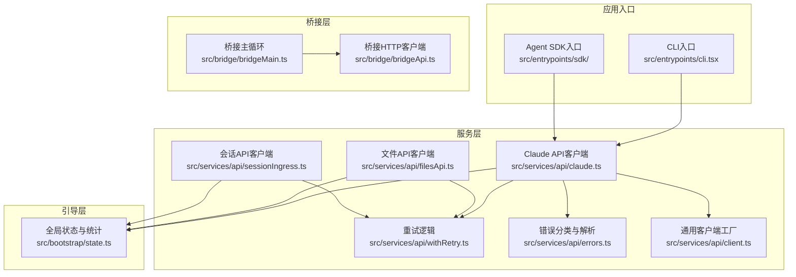
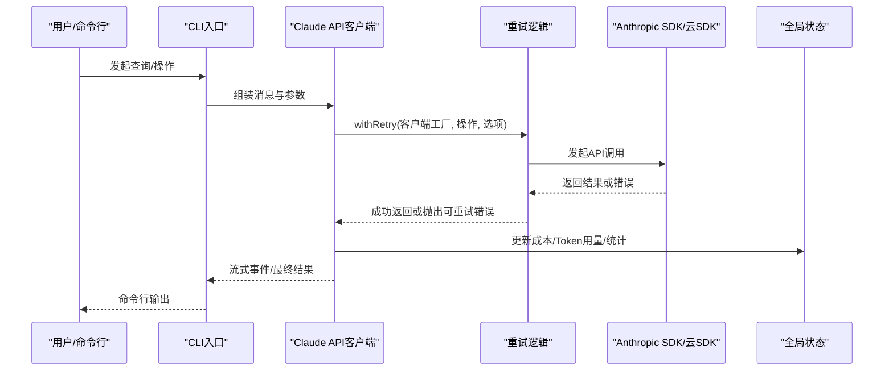
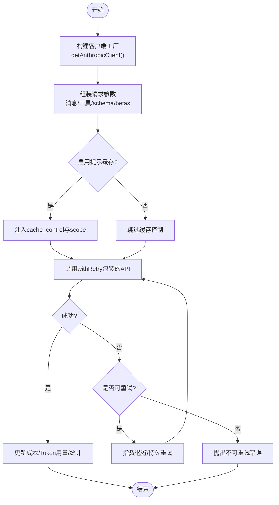
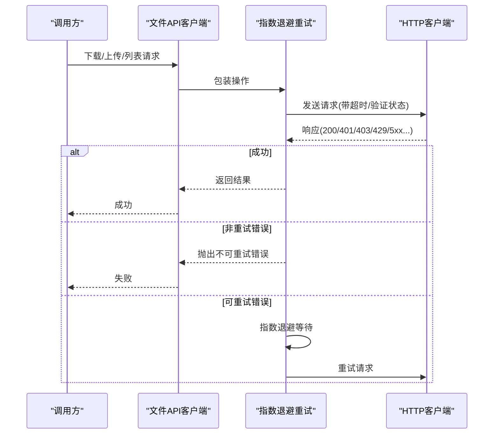
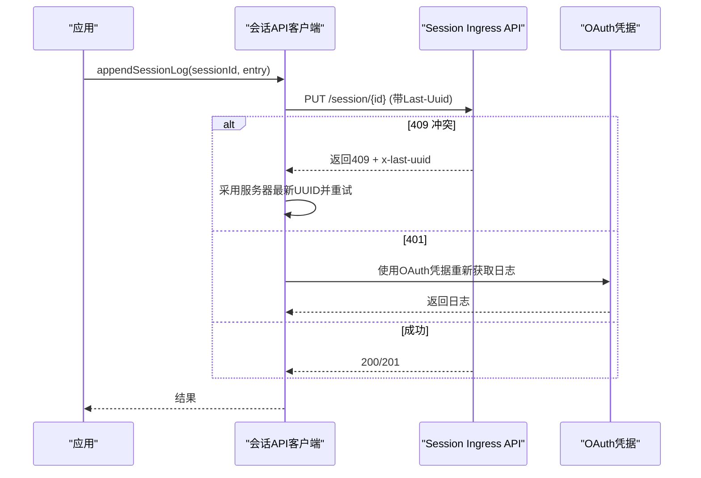
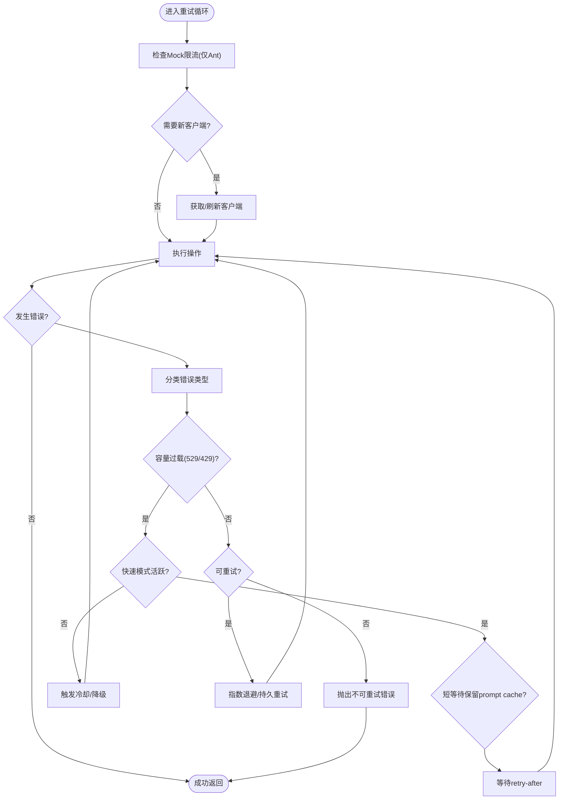
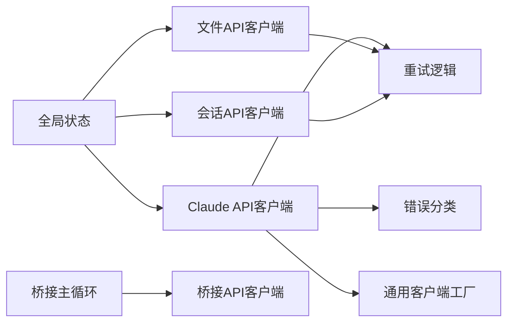

# API客户端

<cite>
**本文档引用的文件**
- [README.md](file://README.md)
- [package.json](file://package.json)
- [src/services/api/claude.ts](file://src/services/api/claude.ts)
- [src/services/api/client.ts](file://src/services/api/client.ts)
- [src/services/api/withRetry.ts](file://src/services/api/withRetry.ts)
- [src/services/api/errors.ts](file://src/services/api/errors.ts)
- [src/services/api/filesApi.ts](file://src/services/api/filesApi.ts)
- [src/services/api/sessionIngress.ts](file://src/services/api/sessionIngress.ts)
- [src/bootstrap/state.ts](file://src/bootstrap/state.ts)
- [src/bridge/bridgeApi.ts](file://src/bridge/bridgeApi.ts)
- [src/bridge/bridgeMain.ts](file://src/bridge/bridgeMain.ts)
</cite>

## 目录
1. [简介](#简介)
2. [项目结构](#项目结构)
3. [核心组件](#核心组件)
4. [架构总览](#架构总览)
5. [详细组件分析](#详细组件分析)
6. [依赖关系分析](#依赖关系分析)
7. [性能考虑](#性能考虑)
8. [故障排除指南](#故障排除指南)
9. [结论](#结论)
10. [附录](#附录)

## 简介
本文件面向Claude Code API客户端的技术文档，系统阐述其设计架构、核心功能与实现细节，涵盖以下方面：
- Claude API客户端：消息流式调用、参数构建、提示缓存、快速模式、努力值（effort）与任务预算（task budget）等。
- 文件API客户端：公共文件下载/上传、并发限制、指数退避重试、路径安全校验。
- 会话API客户端：会话日志持久化、乐观并发控制（Last-Uuid）、序列化写入、OAuth回退与迁移。
- 认证机制：多云平台（Bedrock/Vertex/Foundry）与OAuth集成、令牌刷新、自定义头部注入。
- 请求重试策略：基于状态码与错误类型的智能退避、容量过载保护、持久重试模式。
- 错误处理与响应解析：统一错误分类、速率限制与配额信息提取、媒体尺寸与PDF/图像错误处理。
- 使用量统计：会话级成本与Token用量聚合、Turn维度统计、统计存储接口。
- 会话管理：会话切换、项目根目录锚定、计划模式与自动模式的头信息锁存。
- 配置与环境适配：环境变量驱动的多云与代理、自定义头部、调试与诊断日志。

## 项目结构
该项目采用分层架构，服务层（services/api）封装了Claude API、文件API与会话API；桥接层（bridge）负责远程/桌面桥接；引导层（bootstrap）提供全局状态与统计；工具与实用模块分布在utils与constants中。

**图表来源**
- [src/services/api/claude.ts](file://src/services/api/claude.ts)
- [src/services/api/client.ts](file://src/services/api/client.ts)
- [src/services/api/withRetry.ts](file://src/services/api/withRetry.ts)
- [src/services/api/errors.ts](file://src/services/api/errors.ts)
- [src/services/api/filesApi.ts](file://src/services/api/filesApi.ts)
- [src/services/api/sessionIngress.ts](file://src/services/api/sessionIngress.ts)
- [src/bridge/bridgeApi.ts](file://src/bridge/bridgeApi.ts)
- [src/bridge/bridgeMain.ts](file://src/bridge/bridgeMain.ts)
- [src/bootstrap/state.ts](file://src/bootstrap/state.ts)

**章节来源**
- [README.md](file://README.md)
- [package.json](file://package.json)

## 核心组件
- Claude API客户端：负责消息流式调用、工具schema注入、系统提示组装、提示缓存控制、快速模式与努力值、任务预算、元数据注入与额外body参数。
- 文件API客户端：支持公共文件下载/上传、BYOC模式上传、列表查询、并发限流、指数退避重试与路径安全校验。
- 会话API客户端：提供会话日志追加与拉取、乐观并发控制（Last-Uuid）、序列化写入、OAuth回退与迁移。
- 通用客户端工厂：按环境变量选择底层SDK（Anthropic/Bedrock/Vertex/Foundry），注入默认头部、超时、代理与自定义头部。
- 重试逻辑：统一的withRetry生成器，支持529/429/401/403等错误的差异化处理、持久重试模式、最大令牌上下文溢出调整。
- 错误分类与解析：针对提示过长、媒体尺寸、PDF/图像错误、速率限制、无效模型名等进行分类与人性化消息生成。
- 全局状态与统计：会话ID、项目根目录、成本与Token用量、Turn维度统计、提示缓存1小时TTL允许列表与用户资格锁存。

**章节来源**
- [src/services/api/claude.ts](file://src/services/api/claude.ts)
- [src/services/api/client.ts](file://src/services/api/client.ts)
- [src/services/api/withRetry.ts](file://src/services/api/withRetry.ts)
- [src/services/api/errors.ts](file://src/services/api/errors.ts)
- [src/services/api/filesApi.ts](file://src/services/api/filesApi.ts)
- [src/services/api/sessionIngress.ts](file://src/services/api/sessionIngress.ts)
- [src/bootstrap/state.ts](file://src/bootstrap/state.ts)

## 架构总览
下图展示了API客户端在整体系统中的位置与交互关系：

**图表来源**
- [src/services/api/claude.ts](file://src/services/api/claude.ts)
- [src/services/api/client.ts](file://src/services/api/client.ts)
- [src/services/api/withRetry.ts](file://src/services/api/withRetry.ts)
- [src/bootstrap/state.ts](file://src/bootstrap/state.ts)

## 详细组件分析

### Claude API客户端
- 设计要点
  - 客户端工厂：根据环境变量动态选择Anthropic/Bedrock/Vertex/Foundry，并注入默认头部、超时、代理与自定义头部。
  - 提示缓存：支持ephemeral 1小时TTL与全局作用域，结合用户类型与GrowthBook配置进行资格判定。
  - 快速模式与努力值：通过beta头与输出配置传递，支持过载时的冷却与降级。
  - 任务预算：向API发送任务预算（task_budget），帮助模型自我节制。
  - 元数据注入：包含设备ID、会话ID、账户UUID等，便于后端追踪与审计。
  - 额外body参数：支持CLAUDE_CODE_EXTRA_BODY与beta头合并，避免重复。
- 关键流程
  - 查询模型：queryModelWithoutStreaming/queryModelWithStreaming，内部委托withStreamingVCR包装，确保成功事件记录。
  - API验证：verifyApiKey使用轻量模型与最小请求体进行认证有效性检查。
  - 消息转换：userMessageToMessageParam/assistantMessageToMessageParam支持提示缓存控制与内容克隆。
- 最佳实践
  - 合理设置超时与重试上限，避免长时间阻塞。
  - 对于大文件/多图像场景，优先启用提示缓存以降低Token消耗。
  - 使用任务预算与快速模式时，关注过载与冷却策略，避免频繁抖动。

**图表来源**
- [src/services/api/claude.ts](file://src/services/api/claude.ts)
- [src/services/api/client.ts](file://src/services/api/client.ts)
- [src/services/api/withRetry.ts](file://src/services/api/withRetry.ts)
- [src/bootstrap/state.ts](file://src/bootstrap/state.ts)

**章节来源**
- [src/services/api/claude.ts](file://src/services/api/claude.ts)
- [src/services/api/client.ts](file://src/services/api/client.ts)
- [src/bootstrap/state.ts](file://src/bootstrap/state.ts)

### 文件API客户端
- 功能特性
  - 下载：支持公共文件API下载，带指数退避重试、超时与非重试错误直接抛出。
  - 上传：BYOC模式上传，支持文件大小校验、边界构造、并发限制与取消信号。
  - 列表：1P/Cloud模式列出指定时间后的文件，支持分页游标。
  - 并发：通过并发限制函数限制同时进行的下载/上传数量。
  - 安全：路径规范化与禁止上溯，防止路径遍历攻击。
- 错误处理
  - 404/401/403等非重试错误直接抛出；网络错误与非期望状态码进入重试循环。
  - 上传失败区分“不可重试”与“网络错误”，并上报分析事件。
- 性能优化
  - 默认并发5，可根据网络状况调整。
  - 大文件下载采用二进制响应，上传采用multipart/form-data并设置Content-Length。

**图表来源**
- [src/services/api/filesApi.ts](file://src/services/api/filesApi.ts)

**章节来源**
- [src/services/api/filesApi.ts](file://src/services/api/filesApi.ts)

### 会话API客户端
- 功能特性
  - 追加日志：PUT /v1/session_ingress/session/{id}，支持Last-Uuid乐观并发控制，自动恢复409冲突。
  - 获取日志：GET /v1/session_ingress/session/{id}，支持after_last_compact过滤。
  - OAuth回退：在会话令牌失效时，使用OAuth凭据从新端点获取日志。
  - Teleport迁移：通过Sessions API获取事件流，替代旧的session-ingress一次性拉取。
  - 序列化写入：同一会话内串行化追加，避免竞态。
- 错误处理
  - 401：令牌过期或无效，需重新登录。
  - 409：采用服务器最新UUID恢复，或回退到会话拉取。
  - 404：会话不存在或迁移窗口内不确定，按策略回退。
- 最佳实践
  - 在高并发场景下，利用序列化包装保证一致性。
  - 对于大规模会话迁移，优先使用Teleport事件流，避免一次性50k限制。

**图表来源**
- [src/services/api/sessionIngress.ts](file://src/services/api/sessionIngress.ts)

**章节来源**
- [src/services/api/sessionIngress.ts](file://src/services/api/sessionIngress.ts)

### 重试策略与错误处理
- 重试策略
  - 529/429：前台来源（如REPL主线程、SDK、Agent）默认重试，后台来源（摘要/建议/分类器）默认不重试。
  - 持久重试：在特定条件下无限重试，周期性心跳输出，避免被宿主环境标记为空闲。
  - 最大令牌上下文溢出：解析400错误中的输入/上下文限制，动态调整max_tokens。
  - 快速模式过载：短等待保留prompt cache，长等待触发冷却并降级到标准速度。
- 错误分类
  - 提示过长、媒体尺寸（图像/PDF）、请求过大、工具并发错误、无效模型名、信用余额不足等。
  - 速率限制：支持新的统一配额头，自动提取配额状态与重置时间。
- 最佳实践
  - 对于外部订阅用户，尊重x-should-retry头；企业用户可忽略并继续重试。
  - 在Mock限流场景下，优先使用内部测试头避免真实限流影响。

**图表来源**
- [src/services/api/withRetry.ts](file://src/services/api/withRetry.ts)
- [src/services/api/errors.ts](file://src/services/api/errors.ts)

**章节来源**
- [src/services/api/withRetry.ts](file://src/services/api/withRetry.ts)
- [src/services/api/errors.ts](file://src/services/api/errors.ts)

### 认证机制与环境适配
- 多云平台
  - Bedrock：支持AWS凭证刷新与区域配置，可选Bearer Token认证。
  - Vertex：支持Google Auth与项目ID回退，避免元数据服务器超时。
  - Foundry：支持Azure AD令牌或API Key认证。
- OAuth与订阅用户
  - 订阅用户使用OAuth访问令牌，非订阅用户使用API Key或辅助工具提供的密钥。
  - 在远程模式下，401/403被视为瞬时故障而非凭据错误。
- 自定义头部与代理
  - 支持ANHROPIC_CUSTOM_HEADERS注入，第一方API注入x-client-request-id用于日志关联。
  - 代理支持通过getProxyFetchOptions配置，Bedrock/Vertex/Foundry分别处理其SDK的代理参数。
- 最佳实践
  - 在受限网络环境中，优先配置代理与超时，避免长时间阻塞。
  - 使用DEBUG输出查看SDK日志与请求详情，便于问题定位。

**章节来源**
- [src/services/api/client.ts](file://src/services/api/client.ts)

### 使用量统计与会话管理
- 使用量统计
  - 全局状态维护总成本USD、API耗时、工具耗时、Turn维度统计、Token用量（输入/输出/缓存读/缓存创建）。
  - 会话切换与项目根目录锚定，确保技能/历史/会话稳定性。
- 会话管理
  - 提示缓存1小时TTL允许列表与用户资格锁存，避免中途配额翻转导致缓存抖动。
  - 快速模式、AFK模式、缓存编辑等beta头锁存，保持prompt cache稳定。
- 最佳实践
  - 在长时间运行的会话中，定期检查lastApiCompletionTimestamp与prompt cache命中情况。
  - 使用markPostCompaction标记压缩后首次API成功，便于区分缓存miss原因。

**章节来源**
- [src/bootstrap/state.ts](file://src/bootstrap/state.ts)

### 桥接层（远程/桌面）
- 桥接API客户端
  - 注册环境、轮询工作、确认/停止工作、心跳、权限事件上报、会话归档与重连。
  - OAuth 401自动刷新与致命错误分类（401/403/404/410等）。
- 桥接主循环
  - 多会话/多环境能力、心跳保活、容量唤醒、超时看门狗、工作树清理、日志与诊断。
- 最佳实践
  - 在远程模式下，注意v2环境的JWT生命周期，配合reconnectSession实现无感续期。
  - 使用容量唤醒机制减少空闲等待，提升吞吐。

**章节来源**
- [src/bridge/bridgeApi.ts](file://src/bridge/bridgeApi.ts)
- [src/bridge/bridgeMain.ts](file://src/bridge/bridgeMain.ts)

## 依赖关系分析
- 组件耦合
  - Claude API客户端依赖重试逻辑与错误分类，通过withRetry统一处理异常。
  - 文件与会话API客户端各自封装重试与并发控制，避免跨模块耦合。
  - 通用客户端工厂集中处理多云与OAuth，降低上层复杂度。
- 外部依赖
  - @anthropic-ai/sdk及其云SDK（bedrock-sdk/vertex-sdk/foundry-sdk）。
  - axios用于HTTP请求，lodash-es用于聚合统计。
- 循环依赖
  - bootstrap/state作为全局状态中心，避免被上层模块直接导入，通过导出函数访问。

**图表来源**
- [src/services/api/claude.ts](file://src/services/api/claude.ts)
- [src/services/api/client.ts](file://src/services/api/client.ts)
- [src/services/api/withRetry.ts](file://src/services/api/withRetry.ts)
- [src/services/api/errors.ts](file://src/services/api/errors.ts)
- [src/services/api/filesApi.ts](file://src/services/api/filesApi.ts)
- [src/services/api/sessionIngress.ts](file://src/services/api/sessionIngress.ts)
- [src/bridge/bridgeApi.ts](file://src/bridge/bridgeApi.ts)
- [src/bridge/bridgeMain.ts](file://src/bridge/bridgeMain.ts)
- [src/bootstrap/state.ts](file://src/bootstrap/state.ts)

**章节来源**
- [src/services/api/claude.ts](file://src/services/api/claude.ts)
- [src/services/api/client.ts](file://src/services/api/client.ts)
- [src/services/api/withRetry.ts](file://src/services/api/withRetry.ts)
- [src/services/api/errors.ts](file://src/services/api/errors.ts)
- [src/services/api/filesApi.ts](file://src/services/api/filesApi.ts)
- [src/services/api/sessionIngress.ts](file://src/services/api/sessionIngress.ts)
- [src/bridge/bridgeApi.ts](file://src/bridge/bridgeApi.ts)
- [src/bridge/bridgeMain.ts](file://src/bridge/bridgeMain.ts)
- [src/bootstrap/state.ts](file://src/bootstrap/state.ts)

## 性能考虑
- 重试与退避
  - 默认指数退避，最大延迟与抖动控制，避免放大网络拥塞。
  - 持久重试模式下，周期性心跳输出，避免被宿主环境判定为空闲。
- 并发与限流
  - 文件API默认并发5，可根据网络与磁盘I/O调整。
  - 会话日志追加采用每会话串行化，避免竞争。
- 缓存与提示压缩
  - 提示缓存1小时TTL与全局作用域，结合用户资格锁存，减少重复计算。
  - 自动压缩与snip/上下文重构降低Token占用。
- 代理与超时
  - 统一代理配置与合理超时，避免阻塞与资源浪费。

## 故障排除指南
- 常见错误与处理
  - 401/403：OAuth令牌过期或撤销，触发刷新或重新登录。
  - 429/529：前台来源默认重试，后台来源不重试；快速模式下短等待保留缓存，长等待触发冷却。
  - 提示过长：解析错误中的实际/限制Token数，进行上下文缩减或压缩。
  - 媒体尺寸/PDF错误：根据错误详情提示调整文件大小或格式。
  - 无效模型名：检查订阅计划与模型可用性，必要时切换模型。
- 诊断与日志
  - 开启DEBUG输出查看SDK日志与请求详情。
  - 使用/getStats查看会话级成本与Token用量。
  - 检查lastApiCompletionTimestamp与prompt cache命中情况。
- 最佳实践
  - 在高负载时段，优先使用快速模式与提示缓存，避免频繁过载。
  - 对于大文件/多图像场景，先进行预处理（如PDF转文本、图像压缩）再提交。

**章节来源**
- [src/services/api/errors.ts](file://src/services/api/errors.ts)
- [src/services/api/withRetry.ts](file://src/services/api/withRetry.ts)
- [src/bootstrap/state.ts](file://src/bootstrap/state.ts)

## 结论
本API客户端通过分层设计与统一的重试/错误处理机制，在多云平台与复杂会话场景下提供了稳健的调用体验。结合提示缓存、快速模式、任务预算与严格的统计体系，能够在保证质量的同时优化成本与性能。建议在生产环境中遵循本文档的配置与最佳实践，结合监控与日志进行持续优化。

## 附录
- 配置项概览
  - ANTHROPIC_API_KEY：直接API访问密钥。
  - ANTHROPIC_AUTH_TOKEN：辅助工具提供的令牌。
  - AWS_* / VERTEX_* / ANTHROPIC_FOUNDRY_*：对应云平台认证与区域配置。
  - CLAUDE_CODE_EXTRA_BODY：附加请求体参数（JSON对象）。
  - CLAUDE_CODE_EXTRA_METADATA：附加元数据（JSON对象）。
  - CLAUDE_CODE_MAX_RETRIES：最大重试次数。
  - CLAUDE_CODE_ADDITIONAL_PROTECTION：额外保护头。
  - API_TIMEOUT_MS：API超时（毫秒）。
  - ANTHROPIC_CUSTOM_HEADERS：自定义请求头（多行“Name: Value”）。
- 示例路径
  - Claude API调用：[src/services/api/claude.ts](file://src/services/api/claude.ts)
  - 文件下载/上传：[src/services/api/filesApi.ts](file://src/services/api/filesApi.ts)
  - 会话日志追加/拉取：[src/services/api/sessionIngress.ts](file://src/services/api/sessionIngress.ts)
  - 重试逻辑：[src/services/api/withRetry.ts](file://src/services/api/withRetry.ts)
  - 错误分类：[src/services/api/errors.ts](file://src/services/api/errors.ts)
  - 客户端工厂：[src/services/api/client.ts](file://src/services/api/client.ts)
  - 全局状态：[src/bootstrap/state.ts](file://src/bootstrap/state.ts)
  - 桥接API：[src/bridge/bridgeApi.ts](file://src/bridge/bridgeApi.ts)
  - 桥接主循环：[src/bridge/bridgeMain.ts](file://src/bridge/bridgeMain.ts)