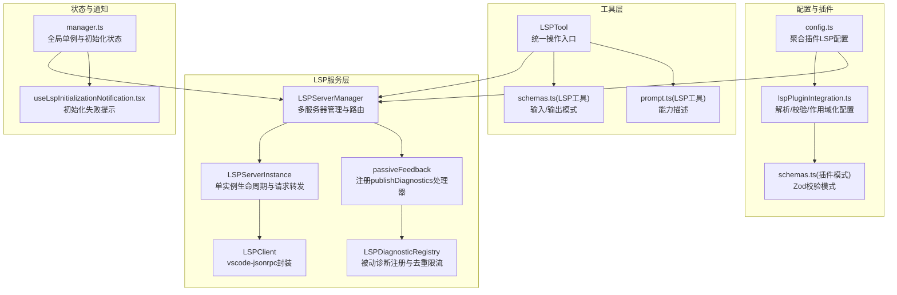
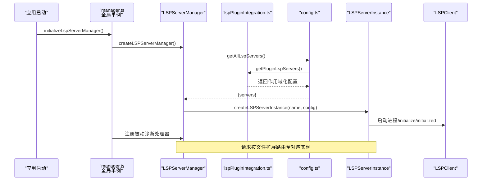
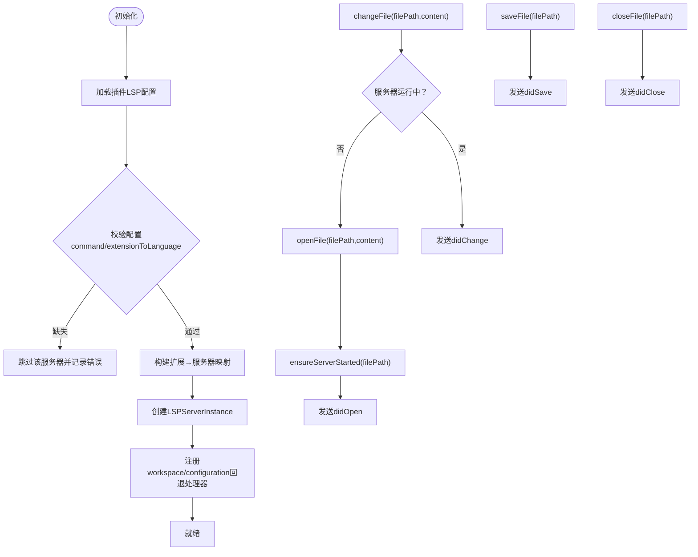
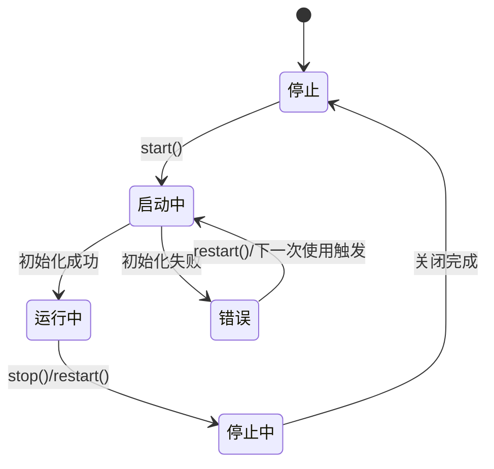
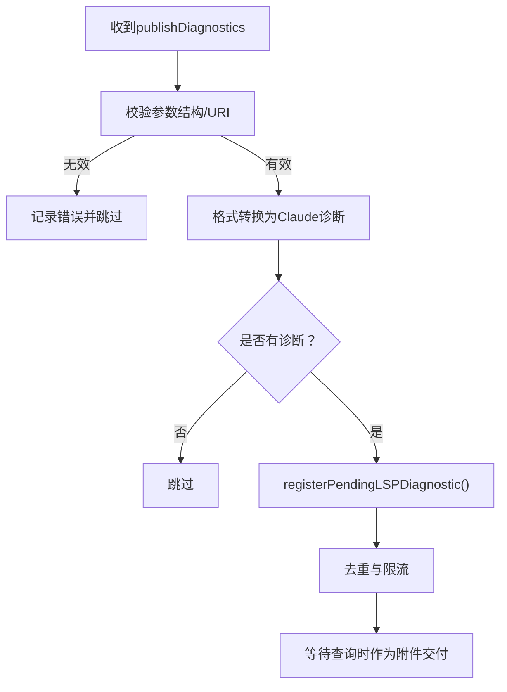
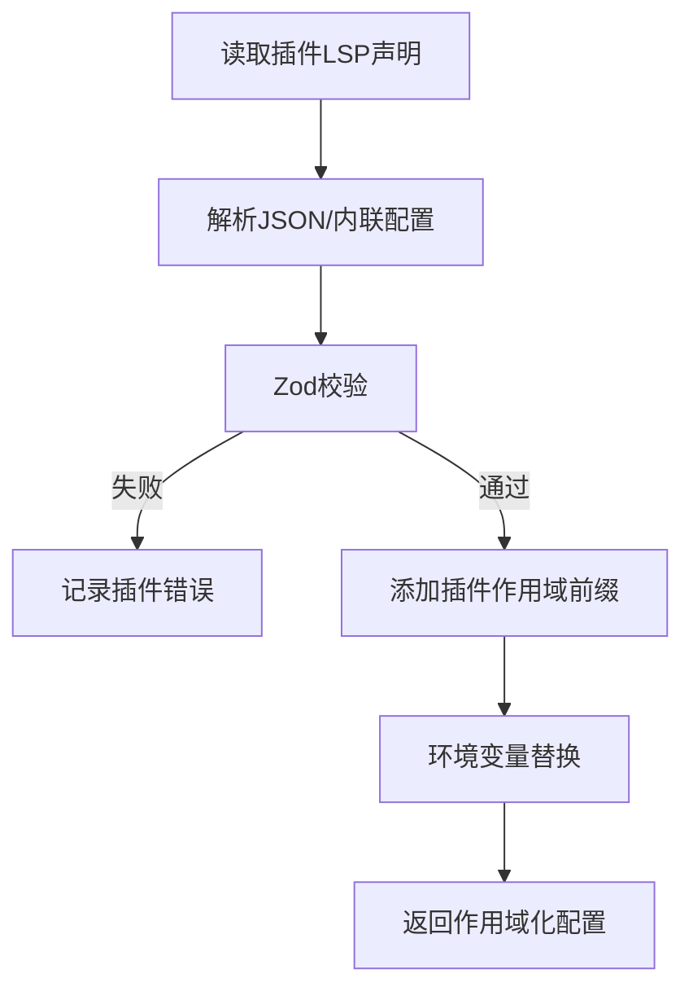
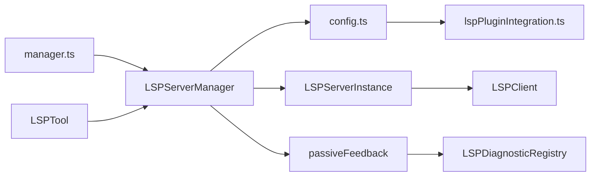

# LSP服务

<cite>
**本文引用的文件**
- [LSPServerManager.ts](file://src/services/lsp/LSPServerManager.ts)
- [LSPServerInstance.ts](file://src/services/lsp/LSPServerInstance.ts)
- [LSPClient.ts](file://src/services/lsp/LSPClient.ts)
- [config.ts](file://src/services/lsp/config.ts)
- [manager.ts](file://src/services/lsp/manager.ts)
- [LSPDiagnosticRegistry.ts](file://src/services/lsp/LSPDiagnosticRegistry.ts)
- [passiveFeedback.ts](file://src/services/lsp/passiveFeedback.ts)
- [lspPluginIntegration.ts](file://src/utils/plugins/lspPluginIntegration.ts)
- [schemas.ts（插件模式）](file://src/utils/plugins/schemas.ts)
- [LSPTool.ts](file://src/tools/LSPTool/LSPTool.ts)
- [schemas.ts（LSP工具）](file://src/tools/LSPTool/schemas.ts)
- [prompt.ts（LSP工具）](file://src/tools/LSPTool/prompt.ts)
- [useLspInitializationNotification.tsx](file://src/hooks/notifs/useLspInitializationNotification.tsx)
</cite>

## 目录
1. [简介](#简介)
2. [项目结构](#项目结构)
3. [核心组件](#核心组件)
4. [架构总览](#架构总览)
5. [详细组件分析](#详细组件分析)
6. [依赖关系分析](#依赖关系分析)
7. [性能考量](#性能考量)
8. [故障排除指南](#故障排除指南)
9. [结论](#结论)
10. [附录](#附录)

## 简介
本文件系统性阐述 Claude Code 的 LSP（Language Server Protocol）服务设计与实现，覆盖语言服务器管理、诊断注册与被动反馈、请求/通知路由、文件同步、生命周期管理、错误处理与性能监控、以及与工具层（LSPTool）的集成方式。文档面向不同技术背景的读者，既提供高层架构视图，也给出代码级细节与可视化图示。

## 项目结构
LSP 服务位于 src/services/lsp 下，围绕“服务器管理器 + 单实例 + 客户端封装 + 配置加载 + 被动诊断”展开；同时通过插件系统动态注入 LSP 服务器配置，并在工具层提供统一的 LSP 操作入口。

**图表来源**
- [LSPServerManager.ts:1-421](file://src/services/lsp/LSPServerManager.ts#L1-L421)
- [LSPServerInstance.ts:24-450](file://src/services/lsp/LSPServerInstance.ts#L24-L450)
- [LSPClient.ts:43-301](file://src/services/lsp/LSPClient.ts#L43-L301)
- [config.ts:1-80](file://src/services/lsp/config.ts#L1-L80)
- [lspPluginIntegration.ts:1-388](file://src/utils/plugins/lspPluginIntegration.ts#L1-L388)
- [schemas.ts（插件模式）:705-820](file://src/utils/plugins/schemas.ts#L705-L820)
- [LSPDiagnosticRegistry.ts:1-387](file://src/services/lsp/LSPDiagnosticRegistry.ts#L1-L387)
- [passiveFeedback.ts:1-329](file://src/services/lsp/passiveFeedback.ts#L1-L329)
- [manager.ts:1-290](file://src/services/lsp/manager.ts#L1-L290)
- [LSPTool.ts:35-125](file://src/tools/LSPTool/LSPTool.ts#L35-L125)
- [schemas.ts（LSP工具）:1-215](file://src/tools/LSPTool/schemas.ts#L1-L215)
- [prompt.ts（LSP工具）:1-21](file://src/tools/LSPTool/prompt.ts#L1-L21)
- [useLspInitializationNotification.tsx:51-100](file://src/hooks/notifs/useLspInitializationNotification.tsx#L51-L100)

**章节来源**
- [LSPServerManager.ts:1-421](file://src/services/lsp/LSPServerManager.ts#L1-L421)
- [config.ts:1-80](file://src/services/lsp/config.ts#L1-L80)
- [manager.ts:1-290](file://src/services/lsp/manager.ts#L1-L290)

## 核心组件
- LSPServerManager：负责加载插件配置、构建扩展到服务器映射、按需启动服务器、路由请求与文件同步通知。
- LSPServerInstance：封装单个 LSP 进程的生命周期（stopped/starting/running/stopping/error），提供请求/通知发送与事件注册。
- LSPClient：基于 vscode-jsonrpc 的客户端封装，负责进程启动、initialize/initialized 流程、请求/通知转发。
- LSPDiagnosticRegistry：被动诊断注册、跨轮次去重、体积限制与交付。
- passiveFeedback：注册 textDocument/publishDiagnostics 处理器，桥接 LSP 诊断到 Claude 附件系统。
- 插件集成：从插件加载 LSP 配置，进行路径安全校验、环境变量替换、作用域化命名与合并。
- 工具层：LSPTool 提供统一的 LSP 操作输入/输出模式与 UI 展示。

**章节来源**
- [LSPServerManager.ts:16-43](file://src/services/lsp/LSPServerManager.ts#L16-L43)
- [LSPServerInstance.ts:33-65](file://src/services/lsp/LSPServerInstance.ts#L33-L65)
- [LSPClient.ts:51-83](file://src/services/lsp/LSPClient.ts#L51-L83)
- [LSPDiagnosticRegistry.ts:24-39](file://src/services/lsp/LSPDiagnosticRegistry.ts#L24-L39)
- [passiveFeedback.ts:117-124](file://src/services/lsp/passiveFeedback.ts#L117-L124)
- [lspPluginIntegration.ts:47-122](file://src/utils/plugins/lspPluginIntegration.ts#L47-L122)
- [LSPTool.ts:55-125](file://src/tools/LSPTool/LSPTool.ts#L55-L125)

## 架构总览
LSP 服务采用“配置驱动 + 插件注入 + 单例管理 + 被动诊断”的架构。初始化时，manager 加载所有插件的 LSP 配置并创建实例；运行期按文件扩展选择服务器，确保服务器启动后转发请求；被动诊断通过注册处理器异步收集并交付。

**图表来源**
- [manager.ts:145-208](file://src/services/lsp/manager.ts#L145-L208)
- [LSPServerManager.ts:71-148](file://src/services/lsp/LSPServerManager.ts#L71-L148)
- [config.ts:15-79](file://src/services/lsp/config.ts#L15-L79)
- [lspPluginIntegration.ts:322-358](file://src/utils/plugins/lspPluginIntegration.ts#L322-L358)
- [LSPServerInstance.ts:90-120](file://src/services/lsp/LSPServerInstance.ts#L90-L120)
- [LSPClient.ts:256-287](file://src/services/lsp/LSPClient.ts#L256-L287)

## 详细组件分析

### LSPServerManager：多服务器管理与路由
- 初始化：加载插件 LSP 配置，校验必填字段（命令、扩展映射），建立扩展→服务器列表映射，为每个配置创建实例并注册 workspace/configuration 回退处理器。
- 生命周期：支持按需启动、统一关闭；对非 running 状态的服务器进行显式停止。
- 文件同步：open/change/save/close 将 didOpen/didChange/didSave/didClose 路由到对应服务器，自动处理未打开文件的 didOpen。
- 请求路由：sendRequest 自动确保服务器已启动并转发请求，异常记录日志并抛出。

**图表来源**
- [LSPServerManager.ts:71-148](file://src/services/lsp/LSPServerManager.ts#L71-L148)
- [LSPServerManager.ts:270-400](file://src/services/lsp/LSPServerManager.ts#L270-L400)

**章节来源**
- [LSPServerManager.ts:16-43](file://src/services/lsp/LSPServerManager.ts#L16-L43)
- [LSPServerManager.ts:71-148](file://src/services/lsp/LSPServerManager.ts#L71-L148)
- [LSPServerManager.ts:270-400](file://src/services/lsp/LSPServerManager.ts#L270-L400)

### LSPServerInstance：单实例生命周期与请求转发
- 状态机：stopped → starting → running；running → stopping → stopped；任何状态可进入 error；error 可在下次使用时重试启动。
- 健康检查：isHealthy() 基于当前状态判断是否可发送请求/通知。
- 请求/通知：sendRequest/sendNotification 包装底层客户端调用，失败时记录错误并抛出。
- 事件注册：onNotification/onRequest 用于被动诊断与协议请求处理。

**图表来源**
- [LSPServerInstance.ts:74-79](file://src/services/lsp/LSPServerInstance.ts#L74-L79)

**章节来源**
- [LSPServerInstance.ts:33-65](file://src/services/lsp/LSPServerInstance.ts#L33-L65)
- [LSPServerInstance.ts:412-450](file://src/services/lsp/LSPServerInstance.ts#L412-L450)

### LSPClient：vscode-jsonrpc 封装
- 进程与连接：启动子进程，建立 MessageConnection；暴露 capabilities/isInitialized 等只读状态。
- initialize/initialized：发送 initialize 并接收 InitializeResult，随后发送 initialized。
- 请求/通知：sendRequest/sendNotification 在未启动或未初始化时抛错；连接断开或异常时记录错误。

**章节来源**
- [LSPClient.ts:51-83](file://src/services/lsp/LSPClient.ts#L51-L83)
- [LSPClient.ts:256-287](file://src/services/lsp/LSPClient.ts#L256-L287)
- [LSPClient.ts:289-301](file://src/services/lsp/LSPClient.ts#L289-L301)

### 被动诊断：注册与交付
- 注册处理器：遍历所有服务器实例，注册 textDocument/publishDiagnostics 处理器，捕获参数结构与 URI 解析异常。
- 格式转换：将 LSP PublishDiagnosticsParams 转换为 Claude 诊断格式（含严重级别映射、范围标准化、可选 code/source）。
- 去重与限流：跨批与跨轮次去重（LRU 记录），每文件与总量上限控制，优先保留更严重的诊断。
- 交付：checkForLSPDiagnostics() 返回待交付的诊断集合，清空已交付项，便于后续轮次增量交付。

**图表来源**
- [passiveFeedback.ts:160-278](file://src/services/lsp/passiveFeedback.ts#L160-L278)
- [LSPDiagnosticRegistry.ts:136-184](file://src/services/lsp/LSPDiagnosticRegistry.ts#L136-L184)
- [LSPDiagnosticRegistry.ts:193-338](file://src/services/lsp/LSPDiagnosticRegistry.ts#L193-L338)

**章节来源**
- [passiveFeedback.ts:117-124](file://src/services/lsp/passiveFeedback.ts#L117-L124)
- [passiveFeedback.ts:160-278](file://src/services/lsp/passiveFeedback.ts#L160-L278)
- [LSPDiagnosticRegistry.ts:24-39](file://src/services/lsp/LSPDiagnosticRegistry.ts#L24-L39)
- [LSPDiagnosticRegistry.ts:193-338](file://src/services/lsp/LSPDiagnosticRegistry.ts#L193-L338)

### 插件配置加载与校验
- 加载来源：插件目录下的 .lsp.json 或 manifest.lspServers 字段，支持字符串路径、内联对象、数组混合。
- 安全校验：禁止路径穿越，严格 JSON 解析与 Zod 校验。
- 环境变量替换：支持 ${CLAUDE_PLUGIN_ROOT}、${CLAUDE_PLUGIN_DATA}、${user_config.X} 与通用环境变量。
- 作用域化命名：为避免冲突，给服务器名加上 plugin:插件名:原名 前缀，并标记 scope 为 dynamic。

**图表来源**
- [lspPluginIntegration.ts:57-122](file://src/utils/plugins/lspPluginIntegration.ts#L57-L122)
- [lspPluginIntegration.ts:229-292](file://src/utils/plugins/lspPluginIntegration.ts#L229-L292)
- [lspPluginIntegration.ts:298-315](file://src/utils/plugins/lspPluginIntegration.ts#L298-L315)
- [schemas.ts（插件模式）:705-820](file://src/utils/plugins/schemas.ts#L705-L820)

**章节来源**
- [config.ts:15-79](file://src/services/lsp/config.ts#L15-L79)
- [lspPluginIntegration.ts:47-122](file://src/utils/plugins/lspPluginIntegration.ts#L47-L122)
- [lspPluginIntegration.ts:229-292](file://src/utils/plugins/lspPluginIntegration.ts#L229-L292)
- [lspPluginIntegration.ts:298-315](file://src/utils/plugins/lspPluginIntegration.ts#L298-L315)
- [schemas.ts（插件模式）:705-820](file://src/utils/plugins/schemas.ts#L705-L820)

### 工具层：LSPTool 统一入口
- 输入模式：支持 goToDefinition、findReferences、hover、documentSymbol、workspaceSymbol、goToImplementation、prepareCallHierarchy、incomingCalls、outgoingCalls 等操作，均要求 filePath、line、character。
- 输出模式：统一输出 operation、result、filePath、可选 resultCount/fileCount。
- UI 与提示：提供操作标签、特殊展示与用户提示文本。

**章节来源**
- [LSPTool.ts:55-125](file://src/tools/LSPTool/LSPTool.ts#L55-L125)
- [schemas.ts（LSP工具）:1-215](file://src/tools/LSPTool/schemas.ts#L1-L215)
- [prompt.ts（LSP工具）:1-21](file://src/tools/LSPTool/prompt.ts#L1-L21)

## 依赖关系分析
- manager.ts 作为全局单例，持有 LSPServerManager 实例，维护初始化状态与重试逻辑，并在初始化完成后注册被动诊断处理器。
- LSPServerManager 依赖 config.ts 获取插件 LSP 配置，再为每个配置创建 LSPServerInstance。
- LSPServerInstance 依赖 LSPClient 与 vscode-jsonrpc 进行进程与协议交互。
- passiveFeedback 依赖 LSPServerManager 的 getAllServers 接口批量注册处理器。
- LSPDiagnosticRegistry 与 passiveFeedback 共同完成被动诊断的注册、去重与交付。
- LSPTool 通过 LSPServerManager 的 sendRequest 路由到具体服务器执行操作。

**图表来源**
- [manager.ts:1-290](file://src/services/lsp/manager.ts#L1-L290)
- [LSPServerManager.ts:1-421](file://src/services/lsp/LSPServerManager.ts#L1-L421)
- [config.ts:1-80](file://src/services/lsp/config.ts#L1-L80)
- [lspPluginIntegration.ts:1-388](file://src/utils/plugins/lspPluginIntegration.ts#L1-L388)
- [LSPServerInstance.ts:1-450](file://src/services/lsp/LSPServerInstance.ts#L1-L450)
- [LSPClient.ts:1-301](file://src/services/lsp/LSPClient.ts#L1-L301)
- [passiveFeedback.ts:1-329](file://src/services/lsp/passiveFeedback.ts#L1-L329)
- [LSPDiagnosticRegistry.ts:1-387](file://src/services/lsp/LSPDiagnosticRegistry.ts#L1-L387)
- [LSPTool.ts:1-125](file://src/tools/LSPTool/LSPTool.ts#L1-L125)

**章节来源**
- [manager.ts:1-290](file://src/services/lsp/manager.ts#L1-L290)
- [LSPServerManager.ts:1-421](file://src/services/lsp/LSPServerManager.ts#L1-L421)

## 性能考量
- 启动与重试：单实例采用指数回退的基础延迟以应对瞬时错误，但未实现重启上限与超时配置，建议在上层结合重试策略与资源限制。
- 请求转发：sendRequest/sendNotification 均进行健康检查与异常包装，避免上游吞掉错误导致静默失败。
- 文件同步：openFile 会根据扩展映射选择语言 ID；changeFile 会在未打开时自动触发 openFile，保证 LSP 服务器的协议顺序。
- 被动诊断：去重与限流（每文件与总量上限）降低对话轮次中的冗余与噪声，提升用户体验。
- 插件加载：并发加载多个插件的 LSP 配置，失败不阻塞其他插件，提高可用性。

[本节为通用性能讨论，无需特定文件引用]

## 故障排除指南
- 初始化失败
  - 症状：全局初始化状态为 failed，manager 返回 undefined。
  - 排查：查看初始化状态与错误详情，确认插件加载与配置解析是否报错。
  - 处理：调用重初始化接口以刷新插件缓存后重新初始化。
  
  **章节来源**
  - [manager.ts:76-94](file://src/services/lsp/manager.ts#L76-L94)
  - [manager.ts:145-208](file://src/services/lsp/manager.ts#L145-L208)

- 服务器未启动或不可用
  - 症状：sendRequest 抛出“服务器未启动/未初始化”错误。
  - 排查：确认文件扩展是否映射到有效服务器；检查 ensureServerStarted 是否成功。
  - 处理：等待服务器启动完成或手动触发启动。

  **章节来源**
  - [LSPServerManager.ts:215-236](file://src/services/lsp/LSPServerManager.ts#L215-L236)
  - [LSPServerInstance.ts:412-450](file://src/services/lsp/LSPServerInstance.ts#L412-L450)

- 被动诊断未显示
  - 症状：LSP 发送了诊断但未出现在对话中。
  - 排查：确认已注册处理器；检查格式转换与去重/限流逻辑；查看诊断注册与交付日志。
  - 处理：修复服务器端诊断格式或调整限流阈值。

  **章节来源**
  - [passiveFeedback.ts:160-278](file://src/services/lsp/passiveFeedback.ts#L160-L278)
  - [LSPDiagnosticRegistry.ts:193-338](file://src/services/lsp/LSPDiagnosticRegistry.ts#L193-L338)

- 插件 LSP 配置无效
  - 症状：插件声明的 LSP 未生效或报“配置无效”。
  - 排查：检查 .lsp.json 路径是否相对且在插件目录内；确认 Zod 校验是否通过；查看环境变量替换结果。
  - 处理：修正路径、补充必要字段、提供缺失的环境变量。

  **章节来源**
  - [lspPluginIntegration.ts:28-45](file://src/utils/plugins/lspPluginIntegration.ts#L28-L45)
  - [lspPluginIntegration.ts:68-106](file://src/utils/plugins/lspPluginIntegration.ts#L68-L106)
  - [lspPluginIntegration.ts:229-292](file://src/utils/plugins/lspPluginIntegration.ts#L229-L292)

- 工具层操作失败
  - 症状：LSPTool 执行某操作返回错误。
  - 排查：确认输入参数（filePath/line/character）是否符合要求；检查目标文件是否已打开且语言 ID 正确。
  - 处理：修正坐标与文件路径；确保服务器已启动。

  **章节来源**
  - [LSPTool.ts:55-125](file://src/tools/LSPTool/LSPTool.ts#L55-L125)
  - [schemas.ts（LSP工具）:1-215](file://src/tools/LSPTool/schemas.ts#L1-L215)

- 初始化失败通知
  - 症状：界面出现 LSP 初始化失败提示。
  - 排查：查看通知内容与错误来源，定位具体失败的插件或服务器。
  - 处理：根据提示进入插件设置或查看日志。

  **章节来源**
  - [useLspInitializationNotification.tsx:51-100](file://src/hooks/notifs/useLspInitializationNotification.tsx#L51-L100)

## 结论
本 LSP 服务通过“插件驱动 + 单例管理 + 被动诊断”的设计，在保证协议兼容性的同时，提供了稳健的生命周期管理、请求路由与诊断交付能力。配合工具层统一入口与严格的配置校验，能够满足多语言服务器共存与高效协作的需求。建议在生产环境中结合重试策略、资源限制与可观测性指标进一步完善稳定性与性能。

[本节为总结，无需特定文件引用]

## 附录

### LSP 配置选项与校验要点
- 必填字段：command、extensionToLanguage（至少一个映射）。
- 参数校验：命令不得包含空格（除非绝对路径），args 为字符串数组，transport 默认 stdio。
- 环境变量：支持 ${CLAUDE_PLUGIN_ROOT}、${CLAUDE_PLUGIN_DATA}、${user_config.X} 与通用变量替换。
- 作用域化：服务器名自动加前缀避免冲突。

**章节来源**
- [schemas.ts（插件模式）:705-820](file://src/utils/plugins/schemas.ts#L705-L820)
- [lspPluginIntegration.ts:229-292](file://src/utils/plugins/lspPluginIntegration.ts#L229-L292)
- [lspPluginIntegration.ts:298-315](file://src/utils/plugins/lspPluginIntegration.ts#L298-L315)

### 服务器发现与连接优化策略
- 服务器发现：仅来自插件，不支持用户/项目直接配置。
- 连接优化：按扩展映射选择首个服务器；首次使用时惰性启动；文件同步遵循 LSP 协议顺序（先 didOpen 再 didChange）。
- 健壮性：workspace/configuration 请求返回空配置以满足部分服务器的协议行为；被动诊断处理器对异常进行隔离与告警。

**章节来源**
- [config.ts:15-79](file://src/services/lsp/config.ts#L15-L79)
- [LSPServerManager.ts:88-148](file://src/services/lsp/LSPServerManager.ts#L88-L148)
- [LSPServerManager.ts:270-400](file://src/services/lsp/LSPServerManager.ts#L270-L400)
- [passiveFeedback.ts:125-135](file://src/services/lsp/passiveFeedback.ts#L125-L135)

### 最佳实践
- 使用插件集中管理 LSP 服务器，避免分散配置。
- 对大文件与高并发场景启用被动诊断的去重与限流策略。
- 在工具层统一输入/输出模式，确保坐标与路径一致性。
- 监控初始化状态与被动诊断处理器注册成功率，及时发现服务器问题。

[本节为通用建议，无需特定文件引用]