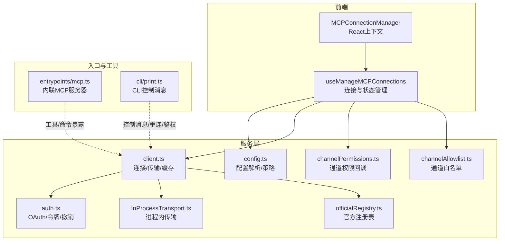
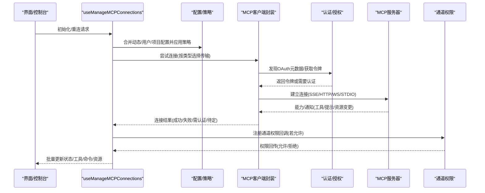
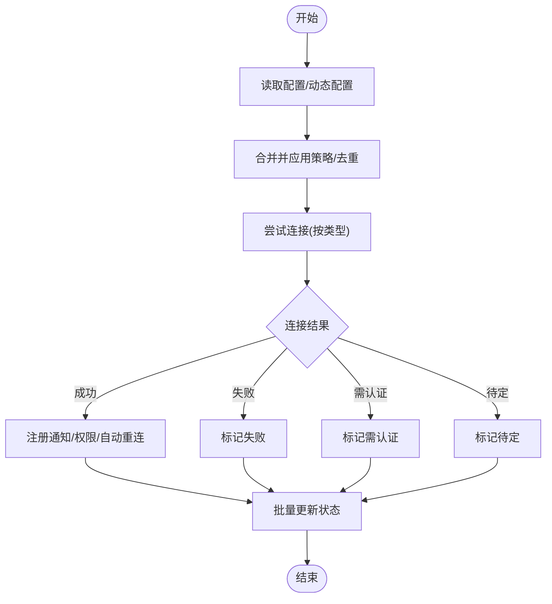
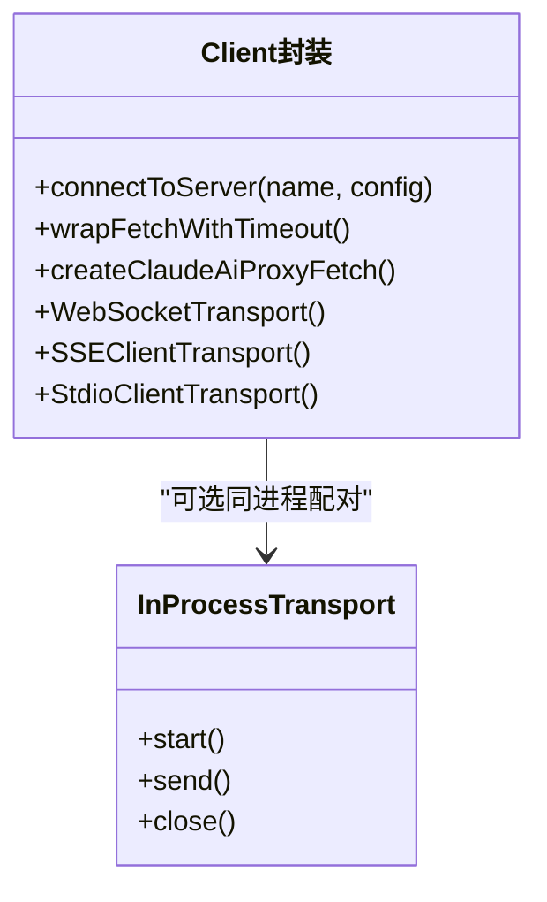
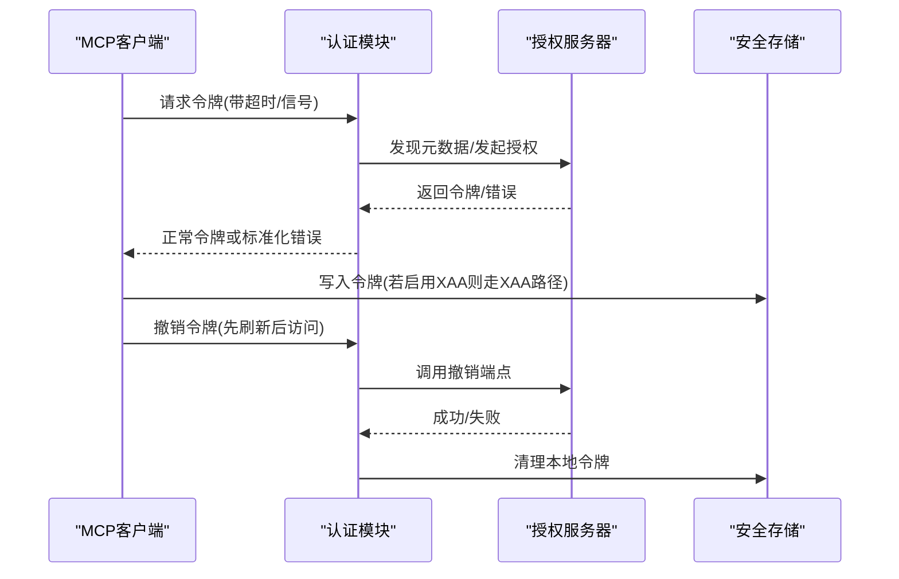
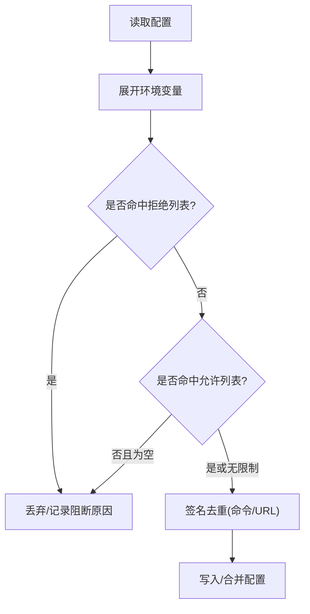
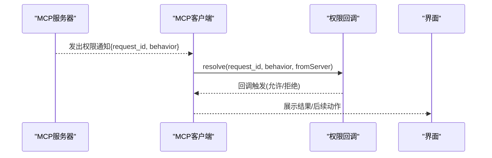
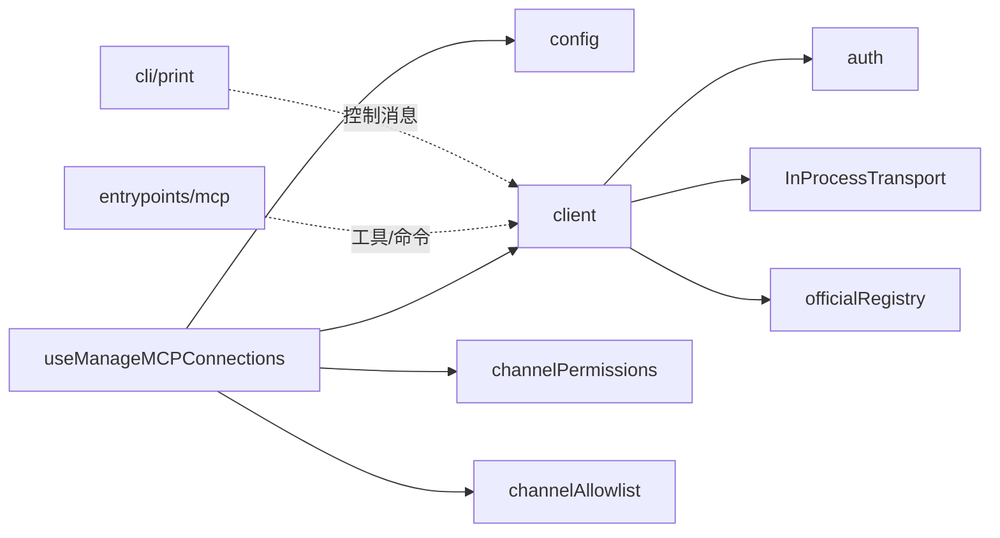

# MCP管理

<cite>
**本文引用的文件**
- [src/services/mcp/MCPConnectionManager.tsx](file://src/services/mcp/MCPConnectionManager.tsx)
- [src/services/mcp/useManageMCPConnections.ts](file://src/services/mcp/useManageMCPConnections.ts)
- [src/services/mcp/client.ts](file://src/services/mcp/client.ts)
- [src/services/mcp/config.ts](file://src/services/mcp/config.ts)
- [src/services/mcp/auth.ts](file://src/services/mcp/auth.ts)
- [src/services/mcp/types.ts](file://src/services/mcp/types.ts)
- [src/services/mcp/InProcessTransport.ts](file://src/services/mcp/InProcessTransport.ts)
- [src/services/mcp/officialRegistry.ts](file://src/services/mcp/officialRegistry.ts)
- [src/services/mcp/channelPermissions.ts](file://src/services/mcp/channelPermissions.ts)
- [src/services/mcp/channelAllowlist.ts](file://src/services/mcp/channelAllowlist.ts)
- [src/entrypoints/mcp.ts](file://src/entrypoints/mcp.ts)
- [src/cli/print.ts](file://src/cli/print.ts)
</cite>

## 目录
1. [简介](#简介)
2. [项目结构](#项目结构)
3. [核心组件](#核心组件)
4. [架构总览](#架构总览)
5. [详细组件分析](#详细组件分析)
6. [依赖关系分析](#依赖关系分析)
7. [性能考量](#性能考量)
8. [故障排查指南](#故障排查指南)
9. [结论](#结论)
10. [附录](#附录)

## 简介
本文件面向Claude Code中的MCP（Model Context Protocol）管理服务，系统性阐述MCP连接管理的设计原理与实现机制，覆盖服务器发现、连接建立、认证授权、消息路由、资源管理、权限控制、生命周期管理与故障恢复、配置与连接池、性能优化与最佳实践等内容。目标是帮助开发者与运维人员快速理解并高效集成与维护MCP生态。

## 项目结构
围绕MCP管理的关键目录与文件如下：
- 服务层：连接管理、客户端封装、配置解析、认证与授权、通道权限、官方注册表等
- 前端集成：React上下文与Hook，负责批量状态更新、自动重连、通知处理
- 入口与工具：CLI控制台消息处理、内联MCP服务器入口

**图表来源**
- [src/services/mcp/MCPConnectionManager.tsx:1-73](file://src/services/mcp/MCPConnectionManager.tsx#L1-L73)
- [src/services/mcp/useManageMCPConnections.ts:1-120](file://src/services/mcp/useManageMCPConnections.ts#L1-L120)
- [src/services/mcp/config.ts:1-120](file://src/services/mcp/config.ts#L1-L120)
- [src/services/mcp/client.ts:1-120](file://src/services/mcp/client.ts#L1-L120)
- [src/services/mcp/auth.ts:1-120](file://src/services/mcp/auth.ts#L1-L120)
- [src/services/mcp/channelPermissions.ts:1-60](file://src/services/mcp/channelPermissions.ts#L1-L60)
- [src/services/mcp/channelAllowlist.ts:1-60](file://src/services/mcp/channelAllowlist.ts#L1-L60)
- [src/services/mcp/officialRegistry.ts:1-60](file://src/services/mcp/officialRegistry.ts#L1-L60)
- [src/services/mcp/InProcessTransport.ts:1-63](file://src/services/mcp/InProcessTransport.ts#L1-L63)
- [src/entrypoints/mcp.ts:1-60](file://src/entrypoints/mcp.ts#L1-L60)
- [src/cli/print.ts:3281-3310](file://src/cli/print.ts#L3281-L3310)

**章节来源**
- [src/services/mcp/MCPConnectionManager.tsx:1-73](file://src/services/mcp/MCPConnectionManager.tsx#L1-L73)
- [src/services/mcp/useManageMCPConnections.ts:1-120](file://src/services/mcp/useManageMCPConnections.ts#L1-L120)
- [src/services/mcp/config.ts:1-120](file://src/services/mcp/config.ts#L1-L120)
- [src/services/mcp/client.ts:1-120](file://src/services/mcp/client.ts#L1-L120)
- [src/services/mcp/auth.ts:1-120](file://src/services/mcp/auth.ts#L1-L120)
- [src/services/mcp/channelPermissions.ts:1-60](file://src/services/mcp/channelPermissions.ts#L1-L60)
- [src/services/mcp/channelAllowlist.ts:1-60](file://src/services/mcp/channelAllowlist.ts#L1-L60)
- [src/services/mcp/officialRegistry.ts:1-60](file://src/services/mcp/officialRegistry.ts#L1-L60)
- [src/services/mcp/InProcessTransport.ts:1-63](file://src/services/mcp/InProcessTransport.ts#L1-L63)
- [src/entrypoints/mcp.ts:1-60](file://src/entrypoints/mcp.ts#L1-L60)
- [src/cli/print.ts:3281-3310](file://src/cli/print.ts#L3281-L3310)

## 核心组件
- 连接管理器与上下文：通过React上下文暴露重连与启停能力，集中管理MCP服务器生命周期。
- 连接与状态管理Hook：负责批量状态更新、自动重连、通知监听、策略过滤与去重。
- 客户端封装：统一抽象不同传输类型（stdio/SSE/HTTP/WebSocket），封装超时、代理、头部、会话令牌、输出存储与内容截断。
- 配置与策略：企业级允许/拒绝列表、签名去重、环境变量展开、托管配置路径、写入原子化。
- 认证与授权：OAuth元数据发现、令牌刷新与撤销、跨应用访问（XAA）、安全存储与清理。
- 通道权限与白名单：基于实验特性与白名单的通道权限回传与前置校验。
- 官方注册表：拉取并缓存官方MCP服务器URL集合，用于信任判定。
- 进程内传输：在同进程内模拟MCP客户端/服务端通信，避免子进程开销。
- 内联MCP服务器入口：将本地工具/命令暴露为MCP工具，供外部MCP客户端调用。

**章节来源**
- [src/services/mcp/MCPConnectionManager.tsx:1-73](file://src/services/mcp/MCPConnectionManager.tsx#L1-L73)
- [src/services/mcp/useManageMCPConnections.ts:120-220](file://src/services/mcp/useManageMCPConnections.ts#L120-L220)
- [src/services/mcp/client.ts:595-720](file://src/services/mcp/client.ts#L595-L720)
- [src/services/mcp/config.ts:536-620](file://src/services/mcp/config.ts#L536-L620)
- [src/services/mcp/auth.ts:313-420](file://src/services/mcp/auth.ts#L313-L420)
- [src/services/mcp/channelPermissions.ts:170-241](file://src/services/mcp/channelPermissions.ts#L170-L241)
- [src/services/mcp/channelAllowlist.ts:37-77](file://src/services/mcp/channelAllowlist.ts#L37-L77)
- [src/services/mcp/officialRegistry.ts:29-73](file://src/services/mcp/officialRegistry.ts#L29-L73)
- [src/services/mcp/InProcessTransport.ts:1-63](file://src/services/mcp/InProcessTransport.ts#L1-L63)
- [src/entrypoints/mcp.ts:35-120](file://src/entrypoints/mcp.ts#L35-L120)

## 架构总览
下图展示从配置到连接、认证、通知与资源同步的全链路：

**图表来源**
- [src/services/mcp/useManageMCPConnections.ts:765-820](file://src/services/mcp/useManageMCPConnections.ts#L765-L820)
- [src/services/mcp/config.ts:536-620](file://src/services/mcp/config.ts#L536-L620)
- [src/services/mcp/client.ts:619-800](file://src/services/mcp/client.ts#L619-L800)
- [src/services/mcp/auth.ts:256-312](file://src/services/mcp/auth.ts#L256-L312)
- [src/services/mcp/channelPermissions.ts:209-241](file://src/services/mcp/channelPermissions.ts#L209-L241)

## 详细组件分析

### 连接管理器与状态批处理
- React上下文提供重连与启停函数，避免在应用状态中重复传递。
- Hook内部使用微任务窗口合并多源事件，减少渲染抖动；根据连接状态决定是否注册自动重连与通知处理器。
- 对于“禁用/失败”状态，保留工具/命令/资源以便UI显示；对于“已断开”的远端连接，按指数退避重连。

**图表来源**
- [src/services/mcp/MCPConnectionManager.tsx:37-72](file://src/services/mcp/MCPConnectionManager.tsx#L37-L72)
- [src/services/mcp/useManageMCPConnections.ts:293-320](file://src/services/mcp/useManageMCPConnections.ts#L293-L320)

**章节来源**
- [src/services/mcp/MCPConnectionManager.tsx:1-73](file://src/services/mcp/MCPConnectionManager.tsx#L1-L73)
- [src/services/mcp/useManageMCPConnections.ts:293-320](file://src/services/mcp/useManageMCPConnections.ts#L293-L320)

### 传输与连接建立
- 支持多种传输类型：SSE、HTTP、WebSocket（含IDE专用变体）、STDIO、SDK占位。
- 统一封装超时与Accept头规范化，确保流式HTTP符合规范。
- 会话令牌与代理支持，日志脱敏敏感头字段。
- 进程内传输用于同进程MCP服务/客户端测试与内联场景。

**图表来源**
- [src/services/mcp/client.ts:492-550](file://src/services/mcp/client.ts#L492-L550)
- [src/services/mcp/InProcessTransport.ts:11-49](file://src/services/mcp/InProcessTransport.ts#L11-L49)

**章节来源**
- [src/services/mcp/client.ts:492-550](file://src/services/mcp/client.ts#L492-L550)
- [src/services/mcp/InProcessTransport.ts:1-63](file://src/services/mcp/InProcessTransport.ts#L1-L63)

### 认证与授权
- OAuth元数据发现与标准化错误响应，支持非标准错误码归一化。
- 令牌撤销遵循RFC 7009，优先合规方式，回退至Bearer认证以兼容非标服务器。
- XAA（跨应用访问）：一次IdP登录复用，执行RFC 8693+7523交换，保存到与OAuth相同的密钥库槽位。
- 本地令牌清理与缓存键生成，防止误用与泄露。

**图表来源**
- [src/services/mcp/auth.ts:157-191](file://src/services/mcp/auth.ts#L157-L191)
- [src/services/mcp/auth.ts:381-459](file://src/services/mcp/auth.ts#L381-L459)
- [src/services/mcp/auth.ts:664-800](file://src/services/mcp/auth.ts#L664-L800)

**章节来源**
- [src/services/mcp/auth.ts:157-191](file://src/services/mcp/auth.ts#L157-L191)
- [src/services/mcp/auth.ts:381-459](file://src/services/mcp/auth.ts#L381-L459)
- [src/services/mcp/auth.ts:664-800](file://src/services/mcp/auth.ts#L664-L800)

### 配置与策略
- 允许/拒绝列表：名称、命令数组、URL模式三类匹配；支持通配符；空允许列表默认阻断。
- 签名去重：基于命令数组或解码后的代理URL，避免插件与手动配置重复。
- 环境变量展开、缺失变量收集、写入原子化（临时文件+rename）。
- 企业托管配置路径与独占控制，阻止添加/修改。

**图表来源**
- [src/services/mcp/config.ts:341-508](file://src/services/mcp/config.ts#L341-L508)
- [src/services/mcp/config.ts:536-551](file://src/services/mcp/config.ts#L536-L551)
- [src/services/mcp/config.ts:556-616](file://src/services/mcp/config.ts#L556-L616)
- [src/services/mcp/config.ts:88-131](file://src/services/mcp/config.ts#L88-L131)

**章节来源**
- [src/services/mcp/config.ts:341-508](file://src/services/mcp/config.ts#L341-L508)
- [src/services/mcp/config.ts:536-551](file://src/services/mcp/config.ts#L536-L551)
- [src/services/mcp/config.ts:556-616](file://src/services/mcp/config.ts#L556-L616)
- [src/services/mcp/config.ts:88-131](file://src/services/mcp/config.ts#L88-L131)

### 通道权限与白名单
- 通道权限回传：服务器解析用户“yes tbxkq”回复并发出结构化通知，客户端匹配请求ID并回调。
- 白名单与开关：基于GrowthBook的运行时开关与白名单条目，仅允许经批准的插件通道接入。
- 前置校验：在注册前进行能力与白名单检查，必要时弹出一次性提示。

**图表来源**
- [src/services/mcp/channelPermissions.ts:209-241](file://src/services/mcp/channelPermissions.ts#L209-L241)
- [src/services/mcp/channelAllowlist.ts:37-77](file://src/services/mcp/channelAllowlist.ts#L37-L77)

**章节来源**
- [src/services/mcp/channelPermissions.ts:170-241](file://src/services/mcp/channelPermissions.ts#L170-L241)
- [src/services/mcp/channelAllowlist.ts:37-77](file://src/services/mcp/channelAllowlist.ts#L37-L77)

### 官方注册表与信任
- 后台拉取官方MCP服务器URL集合，标准化去除查询参数与尾随斜杠，便于快速匹配。
- 提供URL是否属于官方集合的判定，用于风险提示或策略决策。

**章节来源**
- [src/services/mcp/officialRegistry.ts:29-73](file://src/services/mcp/officialRegistry.ts#L29-L73)

### 内联MCP服务器入口
- 将本地工具/命令暴露为MCP工具，支持输入/输出Schema转换与错误包装，通过STDIO传输启动。

**章节来源**
- [src/entrypoints/mcp.ts:35-120](file://src/entrypoints/mcp.ts#L35-L120)

### CLI控制消息与重连/鉴权
- 控制台消息处理：根据subtype分派到“通道启用”“鉴权”“清除鉴权”等逻辑，结合当前状态与SDK客户端池进行操作。
- 重连流程：在连接失败或断开后按指数退避重连，并在最终失败时更新状态。

**章节来源**
- [src/cli/print.ts:3281-3310](file://src/cli/print.ts#L3281-L3310)
- [src/cli/print.ts:3642-3675](file://src/cli/print.ts#L3642-L3675)

## 依赖关系分析
- 组件耦合与内聚：连接管理Hook聚合了配置、客户端、认证、通道权限等多个模块，形成高内聚低耦合的协调者角色。
- 外部依赖：SDK客户端/传输、HTTP客户端、安全存储、GrowthBook特性开关、平台代理与TLS配置。
- 可能的循环依赖：模块间通过函数注入与延迟导入规避直接循环；注意避免在状态模块中存放函数导致序列化问题。

**图表来源**
- [src/services/mcp/useManageMCPConnections.ts:1-120](file://src/services/mcp/useManageMCPConnections.ts#L1-L120)
- [src/services/mcp/client.ts:1-120](file://src/services/mcp/client.ts#L1-L120)
- [src/services/mcp/auth.ts:1-120](file://src/services/mcp/auth.ts#L1-L120)
- [src/services/mcp/InProcessTransport.ts:1-63](file://src/services/mcp/InProcessTransport.ts#L1-L63)
- [src/services/mcp/channelPermissions.ts:1-60](file://src/services/mcp/channelPermissions.ts#L1-L60)
- [src/services/mcp/channelAllowlist.ts:1-60](file://src/services/mcp/channelAllowlist.ts#L1-L60)
- [src/services/mcp/officialRegistry.ts:1-60](file://src/services/mcp/officialRegistry.ts#L1-L60)
- [src/entrypoints/mcp.ts:1-60](file://src/entrypoints/mcp.ts#L1-L60)
- [src/cli/print.ts:3281-3310](file://src/cli/print.ts#L3281-L3310)

## 性能考量
- 连接批处理：批量更新状态窗口（约16ms）减少频繁渲染与状态抖动。
- 并发与超时：请求级超时替代连接级过期信号，避免单次超时信号泄漏；流式HTTP强制Accept头，减少406重试。
- 缓存与去重：连接缓存键、工具/命令/资源缓存、认证缓存（15分钟），降低重复开销。
- 重连退避：指数退避上限控制，避免风暴式重试。
- IO与内存：文件状态缓存大小限制、输出持久化与截断，避免大输出占用过多内存。

**章节来源**
- [src/services/mcp/useManageMCPConnections.ts:207-308](file://src/services/mcp/useManageMCPConnections.ts#L207-L308)
- [src/services/mcp/client.ts:492-550](file://src/services/mcp/client.ts#L492-L550)
- [src/services/mcp/client.ts:257-317](file://src/services/mcp/client.ts#L257-L317)

## 故障排查指南
- “需要认证”状态
  - 触发条件：远端服务器返回401或OAuth发现但无可用令牌。
  - 处理建议：执行“mcp_authenticate”或“mcp_clear_auth”后重连；检查企业策略与代理设置。
- “会话过期”
  - 触发条件：服务器返回404且包含特定JSON-RPC代码。
  - 处理建议：清理会话缓存后重新获取客户端并重试。
- “连接失败/断开”
  - 触发条件：网络异常、超时、服务器关闭。
  - 处理建议：查看自动重连日志；确认代理/TLS配置；检查防火墙与URL可达性。
- “通道权限被拒/未注册”
  - 触发条件：服务器未声明相应能力或通道不在白名单。
  - 处理建议：确认GrowthBook开关与白名单；检查服务器能力声明。
- “企业策略阻断”
  - 触发条件：允许/拒绝列表匹配。
  - 处理建议：调整允许/拒绝列表或移除冲突配置。

**章节来源**
- [src/services/mcp/client.ts:193-206](file://src/services/mcp/client.ts#L193-L206)
- [src/services/mcp/auth.ts:349-363](file://src/services/mcp/auth.ts#L349-L363)
- [src/services/mcp/useManageMCPConnections.ts:354-468](file://src/services/mcp/useManageMCPConnections.ts#L354-L468)
- [src/services/mcp/channelPermissions.ts:177-194](file://src/services/mcp/channelPermissions.ts#L177-L194)
- [src/services/mcp/config.ts:417-508](file://src/services/mcp/config.ts#L417-L508)

## 结论
该MCP管理服务以“配置—连接—认证—通知—权限—资源”为主线，构建了高可用、可扩展、可治理的MCP生态。通过策略化配置、严格的认证授权、通道权限与白名单、自动重连与批处理优化，既满足企业级安全与合规要求，又兼顾开发体验与性能表现。建议在生产环境中结合企业策略与通道白名单，配合可观测性与告警体系，持续优化连接与重连策略。

## 附录
- 关键类型与配置
  - 传输类型：stdio、sse、sse-ide、http、ws、sdk
  - 服务器状态：connected、failed、needs-auth、pending、disabled
  - 配置作用域：local、user、project、dynamic、enterprise、claudeai、managed
- 常用环境变量
  - MCP_TIMEOUT：连接超时（毫秒）
  - MCP_TOOL_TIMEOUT：工具调用超时（毫秒）
  - MCP_SERVER_CONNECTION_BATCH_SIZE：本地服务器连接批大小
  - MCP_REMOTE_SERVER_CONNECTION_BATCH_SIZE：远端服务器连接批大小
  - CLAUDE_CODE_DISABLE_NONESSENTIAL_TRAFFIC：禁用非必要流量（如官方注册表拉取）

**章节来源**
- [src/services/mcp/types.ts:23-26](file://src/services/mcp/types.ts#L23-L26)
- [src/services/mcp/types.ts:180-227](file://src/services/mcp/types.ts#L180-L227)
- [src/services/mcp/types.ts:10-21](file://src/services/mcp/types.ts#L10-L21)
- [src/services/mcp/client.ts:456-561](file://src/services/mcp/client.ts#L456-L561)
- [src/services/mcp/officialRegistry.ts:34-42](file://src/services/mcp/officialRegistry.ts#L34-L42)