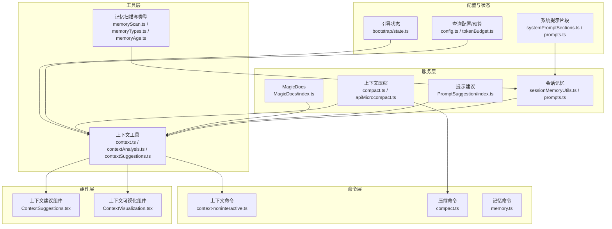
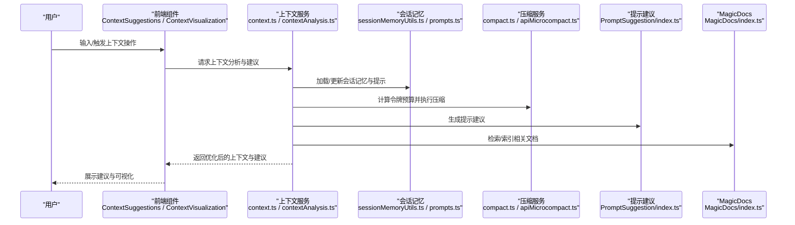
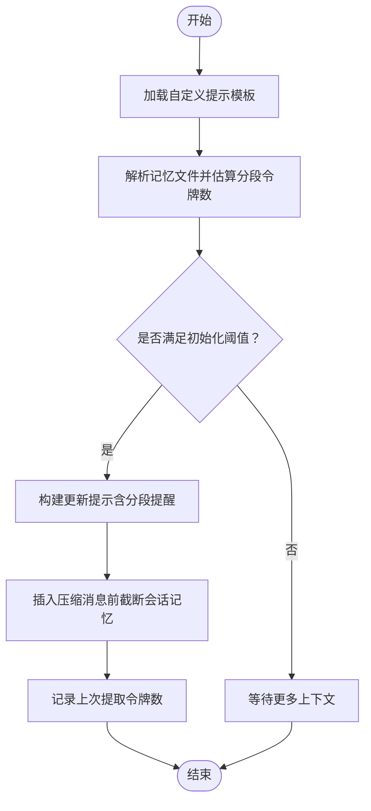
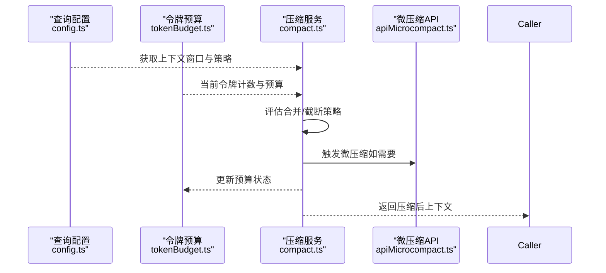
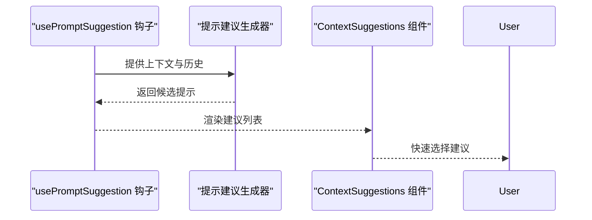
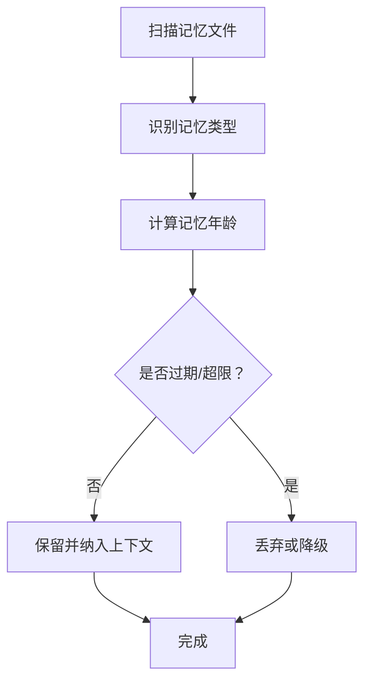
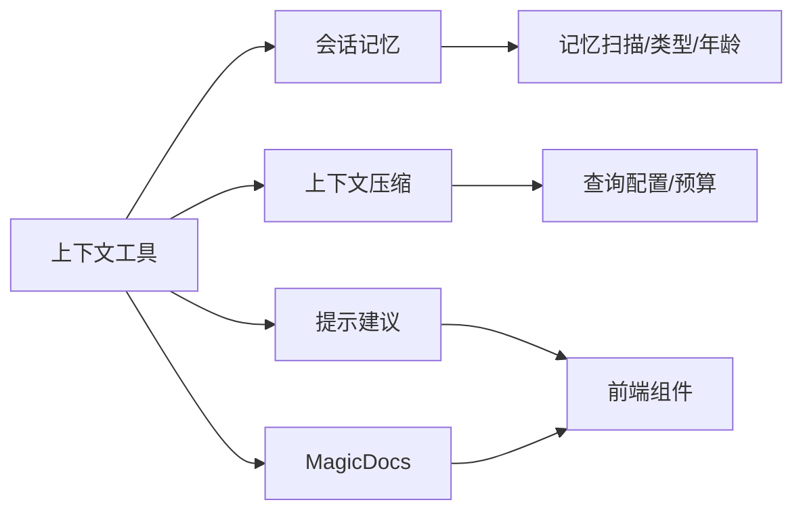

# 上下文服务

<cite>
**本文引用的文件**
- [src/services/SessionMemory/sessionMemoryUtils.ts](file://src/services/SessionMemory/sessionMemoryUtils.ts)
- [src/services/SessionMemory/prompts.ts](file://src/services/SessionMemory/prompts.ts)
- [src/services/PromptSuggestion/index.ts](file://src/services/PromptSuggestion/index.ts)
- [src/services/MagicDocs/index.ts](file://src/services/MagicDocs/index.ts)
- [src/services/compact/compact.ts](file://src/services/compact/compact.ts)
- [src/services/compact/apiMicrocompact.ts](file://src/services/compact/apiMicrocompact.ts)
- [src/utils/context.ts](file://src/utils/context.ts)
- [src/utils/contextAnalysis.ts](file://src/utils/contextAnalysis.ts)
- [src/utils/contextSuggestions.ts](file://src/utils/contextSuggestions.ts)
- [src/memdir/memoryScan.ts](file://src/memdir/memoryScan.ts)
- [src/memdir/memoryTypes.ts](file://src/memdir/memoryTypes.ts)
- [src/memdir/memoryAge.ts](file://src/memdir/memoryAge.ts)
- [src/commands/context/context-noninteractive.ts](file://src/commands/context/context-noninteractive.ts)
- [src/commands/compact/compact.ts](file://src/commands/compact/compact.ts)
- [src/commands/memory/memory.ts](file://src/commands/memory/memory.ts)
- [src/hooks/usePromptSuggestion.ts](file://src/hooks/usePromptSuggestion.ts)
- [src/components/ContextSuggestions.tsx](file://src/components/ContextSuggestions.tsx)
- [src/components/ContextVisualization.tsx](file://src/components/ContextVisualization.tsx)
- [src/context.ts](file://src/context.ts)
- [src/bootstrap/state.ts](file://src/bootstrap/state.ts)
- [src/query/tokenBudget.ts](file://src/query/tokenBudget.ts)
- [src/query/config.ts](file://src/query/config.ts)
- [src/constants/systemPromptSections.ts](file://src/constants/systemPromptSections.ts)
- [src/constants/prompts.ts](file://src/constants/prompts.ts)
- [src/utils/model/contextWindowUpgradeCheck.ts](file://src/utils/model/contextWindowUpgradeCheck.ts)
- [src/services/teamMemorySync/teamMemorySync.ts](file://src/services/teamMemorySync/teamMemorySync.ts)
- [src/services/teamMemorySync/teamMemPaths.ts](file://src/services/teamMemorySync/teamMemPaths.ts)
- [src/services/teamMemorySync/teamMemPrompts.ts](file://src/services/teamMemorySync/teamMemPrompts.ts)
</cite>

## 目录
1. [简介](#简介)
2. [项目结构](#项目结构)
3. [核心组件](#核心组件)
4. [架构总览](#架构总览)
5. [详细组件分析](#详细组件分析)
6. [依赖关系分析](#依赖关系分析)
7. [性能考量](#性能考量)
8. [故障排查指南](#故障排查指南)
9. [结论](#结论)
10. [附录](#附录)

## 简介
本技术文档聚焦于 Claude Code 的“上下文服务”，系统性阐述以下能力与实现：
- 上下文压缩（Context Compression）：通过多策略合并、截断与重写，将长历史与大体量上下文压缩到可接受的令牌预算内。
- 会话记忆（Session Memory）：持续维护与更新会话级记忆，支持自定义提示模板、分段大小估算与截断策略。
- 提示建议（Prompt Suggestions）：基于当前上下文与历史交互，动态生成高质量提示建议，提升用户输入效率。
- MagicDocs：面向代码与文档的智能索引与检索服务，辅助上下文构建与内容增强。
- 记忆检索与团队共享：扫描本地记忆文件、管理记忆类型与年龄，并与团队记忆同步模块协同工作。

文档还覆盖数据结构、缓存策略、性能优化、与其他系统组件的集成方式、配置项与调优参数，以及扩展开发指南与最佳实践。

## 项目结构
上下文服务相关代码主要分布在以下区域：
- 服务层：会话记忆、提示建议、MagicDocs、上下文压缩等服务实现。
- 工具层：上下文分析、上下文建议、上下文可视化、记忆扫描与类型管理等工具函数。
- 命令层：上下文命令、压缩命令、记忆命令等 CLI 入口。
- 组件层：前端上下文建议与可视化组件。
- 配置与状态：查询配置、令牌预算、系统提示片段、引导状态等。

图表来源
- [src/services/SessionMemory/sessionMemoryUtils.ts](file://src/services/SessionMemory/sessionMemoryUtils.ts)
- [src/services/SessionMemory/prompts.ts](file://src/services/SessionMemory/prompts.ts)
- [src/services/PromptSuggestion/index.ts](file://src/services/PromptSuggestion/index.ts)
- [src/services/MagicDocs/index.ts](file://src/services/MagicDocs/index.ts)
- [src/services/compact/compact.ts](file://src/services/compact/compact.ts)
- [src/services/compact/apiMicrocompact.ts](file://src/services/compact/apiMicrocompact.ts)
- [src/utils/context.ts](file://src/utils/context.ts)
- [src/utils/contextAnalysis.ts](file://src/utils/contextAnalysis.ts)
- [src/utils/contextSuggestions.ts](file://src/utils/contextSuggestions.ts)
- [src/memdir/memoryScan.ts](file://src/memdir/memoryScan.ts)
- [src/memdir/memoryTypes.ts](file://src/memdir/memoryTypes.ts)
- [src/memdir/memoryAge.ts](file://src/memdir/memoryAge.ts)
- [src/commands/context/context-noninteractive.ts](file://src/commands/context/context-noninteractive.ts)
- [src/commands/compact/compact.ts](file://src/commands/compact/compact.ts)
- [src/commands/memory/memory.ts](file://src/commands/memory/memory.ts)
- [src/components/ContextSuggestions.tsx](file://src/components/ContextSuggestions.tsx)
- [src/components/ContextVisualization.tsx](file://src/components/ContextVisualization.tsx)
- [src/query/config.ts](file://src/query/config.ts)
- [src/query/tokenBudget.ts](file://src/query/tokenBudget.ts)
- [src/constants/systemPromptSections.ts](file://src/constants/systemPromptSections.ts)
- [src/bootstrap/state.ts](file://src/bootstrap/state.ts)

章节来源
- [src/services/SessionMemory/sessionMemoryUtils.ts](file://src/services/SessionMemory/sessionMemoryUtils.ts)
- [src/services/SessionMemory/prompts.ts](file://src/services/SessionMemory/prompts.ts)
- [src/utils/context.ts](file://src/utils/context.ts)
- [src/utils/contextAnalysis.ts](file://src/utils/contextAnalysis.ts)
- [src/utils/contextSuggestions.ts](file://src/utils/contextSuggestions.ts)
- [src/memdir/memoryScan.ts](file://src/memdir/memoryScan.ts)
- [src/memdir/memoryTypes.ts](file://src/memdir/memoryTypes.ts)
- [src/memdir/memoryAge.ts](file://src/memdir/memoryAge.ts)
- [src/commands/context/context-noninteractive.ts](file://src/commands/context/context-noninteractive.ts)
- [src/commands/compact/compact.ts](file://src/commands/compact/compact.ts)
- [src/commands/memory/memory.ts](file://src/commands/memory/memory.ts)
- [src/components/ContextSuggestions.tsx](file://src/components/ContextSuggestions.tsx)
- [src/components/ContextVisualization.tsx](file://src/components/ContextVisualization.tsx)
- [src/query/config.ts](file://src/query/config.ts)
- [src/query/tokenBudget.ts](file://src/query/tokenBudget.ts)
- [src/constants/systemPromptSections.ts](file://src/constants/systemPromptSections.ts)
- [src/bootstrap/state.ts](file://src/bootstrap/state.ts)

## 核心组件
- 会话记忆（Session Memory）
  - 负责加载自定义提示模板、解析记忆文件分段、估算分段与总量的令牌数、生成分段提醒、在插入压缩消息时进行截断，以及记录提取时刻的上下文规模。
  - 关键接口：获取配置、初始化阈值判断、记录提取令牌数、构建更新提示、截断用于压缩的内容等。
- 上下文压缩（Context Compression）
  - 提供上下文压缩与微压缩（microcompact）API，结合令牌预算与窗口升级检查，确保在有限上下文内维持高效对话。
- 提示建议（Prompt Suggestions）
  - 基于当前上下文与历史交互，动态生成高质量提示建议，前端通过组件展示并支持快捷选择。
- MagicDocs
  - 面向代码与文档的智能索引与检索服务，辅助上下文构建与内容增强。
- 记忆扫描与类型管理（Memory Scan & Types）
  - 扫描本地记忆文件、识别记忆类型与年龄，支撑会话记忆与团队共享的记忆管理。

章节来源
- [src/services/SessionMemory/sessionMemoryUtils.ts](file://src/services/SessionMemory/sessionMemoryUtils.ts)
- [src/services/SessionMemory/prompts.ts](file://src/services/SessionMemory/prompts.ts)
- [src/services/compact/compact.ts](file://src/services/compact/compact.ts)
- [src/services/compact/apiMicrocompact.ts](file://src/services/compact/apiMicrocompact.ts)
- [src/services/PromptSuggestion/index.ts](file://src/services/PromptSuggestion/index.ts)
- [src/services/MagicDocs/index.ts](file://src/services/MagicDocs/index.ts)
- [src/memdir/memoryScan.ts](file://src/memdir/memoryScan.ts)
- [src/memdir/memoryTypes.ts](file://src/memdir/memoryTypes.ts)
- [src/memdir/memoryAge.ts](file://src/memdir/memoryAge.ts)

## 架构总览
上下文服务围绕“数据输入—分析—压缩—输出”的主流程展开，同时与会话记忆、提示建议、MagicDocs、记忆扫描与团队共享模块协同工作。

图表来源
- [src/utils/context.ts](file://src/utils/context.ts)
- [src/utils/contextAnalysis.ts](file://src/utils/contextAnalysis.ts)
- [src/services/SessionMemory/sessionMemoryUtils.ts](file://src/services/SessionMemory/sessionMemoryUtils.ts)
- [src/services/SessionMemory/prompts.ts](file://src/services/SessionMemory/prompts.ts)
- [src/services/compact/compact.ts](file://src/services/compact/compact.ts)
- [src/services/compact/apiMicrocompact.ts](file://src/services/compact/apiMicrocompact.ts)
- [src/services/PromptSuggestion/index.ts](file://src/services/PromptSuggestion/index.ts)
- [src/services/MagicDocs/index.ts](file://src/services/MagicDocs/index.ts)
- [src/components/ContextSuggestions.tsx](file://src/components/ContextSuggestions.tsx)
- [src/components/ContextVisualization.tsx](file://src/components/ContextVisualization.tsx)

## 详细组件分析

### 会话记忆（Session Memory）
- 功能要点
  - 自定义提示模板加载与变量替换，支持按分段估算令牌数与生成提醒。
  - 在插入压缩消息前对会话记忆进行截断，避免占用过多预算。
  - 记录上次提取时的令牌数，用于计算最小更新间隔。
  - 判断是否满足初始化阈值，以决定是否启用会话记忆。
- 数据结构与复杂度
  - 分段解析与令牌估算：线性扫描文本，时间复杂度 O(n)，空间复杂度 O(n)。
  - 截断策略：按分段最大字符数进行截断，近似 O(n)。
- 错误处理
  - 文件读取失败时回退默认提示；异常统一记录日志并返回默认值。
- 性能影响
  - 令牌估算采用近似方法，平衡准确性与性能；分段提醒仅在必要时附加，避免冗余开销。

图表来源
- [src/services/SessionMemory/prompts.ts](file://src/services/SessionMemory/prompts.ts)
- [src/services/SessionMemory/sessionMemoryUtils.ts](file://src/services/SessionMemory/sessionMemoryUtils.ts)

章节来源
- [src/services/SessionMemory/sessionMemoryUtils.ts](file://src/services/SessionMemory/sessionMemoryUtils.ts)
- [src/services/SessionMemory/prompts.ts](file://src/services/SessionMemory/prompts.ts)

### 上下文压缩（Context Compression）
- 功能要点
  - 结合查询配置与令牌预算，执行上下文压缩与微压缩（microcompact）。
  - 与上下文窗口升级检查协同，确保在模型能力范围内最大化利用上下文。
- 数据流
  - 输入：原始上下文消息列表、当前令牌计数、预算限制。
  - 处理：评估合并策略、截断过长片段、重写关键信息。
  - 输出：压缩后的上下文与预算状态。
- 性能特性
  - 压缩算法以线性扫描与局部重写为主，整体近似 O(n)。
  - 微压缩 API 用于更激进的压缩场景，需谨慎设置阈值以避免信息丢失。

图表来源
- [src/services/compact/compact.ts](file://src/services/compact/compact.ts)
- [src/services/compact/apiMicrocompact.ts](file://src/services/compact/apiMicrocompact.ts)
- [src/query/config.ts](file://src/query/config.ts)
- [src/query/tokenBudget.ts](file://src/query/tokenBudget.ts)

章节来源
- [src/services/compact/compact.ts](file://src/services/compact/compact.ts)
- [src/services/compact/apiMicrocompact.ts](file://src/services/compact/apiMicrocompact.ts)
- [src/query/config.ts](file://src/query/config.ts)
- [src/query/tokenBudget.ts](file://src/query/tokenBudget.ts)

### 提示建议（Prompt Suggestions）
- 功能要点
  - 基于当前上下文与历史交互，生成高质量提示建议，前端组件支持快速选择与预览。
  - 与钩子（hooks）集成，便于在不同交互阶段注入建议。
- 数据流
  - 输入：当前上下文、历史消息、用户意图。
  - 处理：建议生成器分析上下文并产出候选提示。
  - 输出：建议列表与可视化组件。
- 性能特性
  - 建议生成通常为轻量级分析，复杂度近似 O(n)；建议列表缓存可减少重复计算。

图表来源
- [src/hooks/usePromptSuggestion.ts](file://src/hooks/usePromptSuggestion.ts)
- [src/services/PromptSuggestion/index.ts](file://src/services/PromptSuggestion/index.ts)
- [src/components/ContextSuggestions.tsx](file://src/components/ContextSuggestions.tsx)

章节来源
- [src/hooks/usePromptSuggestion.ts](file://src/hooks/usePromptSuggestion.ts)
- [src/services/PromptSuggestion/index.ts](file://src/services/PromptSuggestion/index.ts)
- [src/components/ContextSuggestions.tsx](file://src/components/ContextSuggestions.tsx)

### MagicDocs
- 功能要点
  - 面向代码与文档的智能索引与检索服务，辅助上下文构建与内容增强。
  - 与上下文服务协同，提供相关文档片段以丰富上下文。
- 集成点
  - 作为上下文分析与建议的上游数据源，参与最终上下文的组装。

章节来源
- [src/services/MagicDocs/index.ts](file://src/services/MagicDocs/index.ts)

### 记忆扫描与类型管理（Memory Scan & Types）
- 功能要点
  - 扫描本地记忆文件，识别记忆类型与年龄，支撑会话记忆与团队共享的记忆管理。
- 数据结构
  - 记忆类型枚举与路径管理，年龄计算用于过期清理与优先级排序。
- 性能特性
  - 扫描与类型识别为线性操作，复杂度 O(n)；年龄计算基于时间戳差值，常数时间。

图表来源
- [src/memdir/memoryScan.ts](file://src/memdir/memoryScan.ts)
- [src/memdir/memoryTypes.ts](file://src/memdir/memoryTypes.ts)
- [src/memdir/memoryAge.ts](file://src/memdir/memoryAge.ts)

章节来源
- [src/memdir/memoryScan.ts](file://src/memdir/memoryScan.ts)
- [src/memdir/memoryTypes.ts](file://src/memdir/memoryTypes.ts)
- [src/memdir/memoryAge.ts](file://src/memdir/memoryAge.ts)

### 团队记忆同步（Team Memory Sync）
- 功能要点
  - 将本地会话记忆与团队共享路径、提示模板进行同步，确保跨设备与团队成员的一致性。
- 集成点
  - 与会话记忆模块配合，统一管理记忆文件的路径与提示模板。

章节来源
- [src/services/teamMemorySync/teamMemorySync.ts](file://src/services/teamMemorySync/teamMemorySync.ts)
- [src/services/teamMemorySync/teamMemPaths.ts](file://src/services/teamMemorySync/teamMemPaths.ts)
- [src/services/teamMemorySync/teamMemPrompts.ts](file://src/services/teamMemorySync/teamMemPrompts.ts)

## 依赖关系分析
- 组件耦合
  - 上下文工具层与服务层松耦合，通过清晰的接口（如构建更新提示、截断内容）进行交互。
  - 会话记忆与压缩服务存在间接依赖：压缩前需考虑会话记忆的截断结果。
  - 提示建议与上下文分析紧密耦合，建议生成器依赖上下文分析结果。
- 外部依赖
  - 查询配置与令牌预算提供上下文窗口与预算约束。
  - 系统提示片段与引导状态影响上下文构建策略。
- 循环依赖
  - 未发现直接循环依赖；各模块通过接口与钩子解耦。

图表来源
- [src/utils/context.ts](file://src/utils/context.ts)
- [src/utils/contextAnalysis.ts](file://src/utils/contextAnalysis.ts)
- [src/services/SessionMemory/sessionMemoryUtils.ts](file://src/services/SessionMemory/sessionMemoryUtils.ts)
- [src/services/compact/compact.ts](file://src/services/compact/compact.ts)
- [src/services/PromptSuggestion/index.ts](file://src/services/PromptSuggestion/index.ts)
- [src/services/MagicDocs/index.ts](file://src/services/MagicDocs/index.ts)
- [src/memdir/memoryScan.ts](file://src/memdir/memoryScan.ts)
- [src/memdir/memoryTypes.ts](file://src/memdir/memoryTypes.ts)
- [src/memdir/memoryAge.ts](file://src/memdir/memoryAge.ts)
- [src/query/config.ts](file://src/query/config.ts)
- [src/query/tokenBudget.ts](file://src/query/tokenBudget.ts)

章节来源
- [src/utils/context.ts](file://src/utils/context.ts)
- [src/utils/contextAnalysis.ts](file://src/utils/contextAnalysis.ts)
- [src/services/SessionMemory/sessionMemoryUtils.ts](file://src/services/SessionMemory/sessionMemoryUtils.ts)
- [src/services/compact/compact.ts](file://src/services/compact/compact.ts)
- [src/services/PromptSuggestion/index.ts](file://src/services/PromptSuggestion/index.ts)
- [src/services/MagicDocs/index.ts](file://src/services/MagicDocs/index.ts)
- [src/memdir/memoryScan.ts](file://src/memdir/memoryScan.ts)
- [src/memdir/memoryTypes.ts](file://src/memdir/memoryTypes.ts)
- [src/memdir/memoryAge.ts](file://src/memdir/memoryAge.ts)
- [src/query/config.ts](file://src/query/config.ts)
- [src/query/tokenBudget.ts](file://src/query/tokenBudget.ts)

## 性能考量
- 令牌估算与近似
  - 使用近似估算方法平衡准确性和性能，适用于大规模上下文的快速评估。
- 分段与截断
  - 对会话记忆进行分段与截断，避免单一分段过大导致预算不足。
- 建议缓存
  - 前端建议组件与钩子可缓存候选提示，减少重复计算。
- 窗口升级检查
  - 结合模型上下文窗口升级检查，动态调整压缩策略，提升吞吐与质量。
- I/O 与文件访问
  - 记忆文件读取与模板加载应尽量缓存，避免频繁磁盘访问。

## 故障排查指南
- 会话记忆提示模板加载失败
  - 现象：无法读取自定义提示模板，回退默认值。
  - 排查：确认模板文件路径与权限；检查日志中的错误码；验证变量替换语法。
- 初始化阈值未满足
  - 现象：会话记忆未启用。
  - 排查：确认当前上下文令牌数是否达到最小初始化阈值；逐步增加上下文长度或降低阈值。
- 压缩后预算仍不足
  - 现象：压缩后仍超出预算。
  - 排查：检查压缩策略与微压缩阈值；调整上下文窗口或减少非关键信息。
- 建议生成不生效
  - 现象：提示建议未显示或为空。
  - 排查：确认钩子是否正确接入；检查上下文分析结果；验证建议生成器逻辑。
- 记忆扫描异常
  - 现象：记忆文件未被识别或年龄计算异常。
  - 排查：检查文件格式与编码；确认时间戳有效性；核对记忆类型映射。

章节来源
- [src/services/SessionMemory/prompts.ts](file://src/services/SessionMemory/prompts.ts)
- [src/services/SessionMemory/sessionMemoryUtils.ts](file://src/services/SessionMemory/sessionMemoryUtils.ts)
- [src/services/compact/compact.ts](file://src/services/compact/compact.ts)
- [src/services/compact/apiMicrocompact.ts](file://src/services/compact/apiMicrocompact.ts)
- [src/hooks/usePromptSuggestion.ts](file://src/hooks/usePromptSuggestion.ts)
- [src/memdir/memoryScan.ts](file://src/memdir/memoryScan.ts)
- [src/memdir/memoryTypes.ts](file://src/memdir/memoryTypes.ts)
- [src/memdir/memoryAge.ts](file://src/memdir/memoryAge.ts)

## 结论
上下文服务通过“压缩—记忆—建议—索引”四维协同，实现了在有限上下文窗口内的高效对话体验。会话记忆提供持续的知识沉淀，压缩服务保障预算可控，提示建议提升交互效率，MagicDocs增强内容质量。配合记忆扫描与团队同步，形成从个人到团队的上下文一致性。建议在实际部署中结合业务场景调优阈值与策略，并关注性能与稳定性。

## 附录

### 配置选项与调优参数
- 会话记忆
  - 最小初始化令牌数：决定何时启用会话记忆。
  - 分段最大长度：限制单段字符数，避免截断成本过高。
  - 最小更新间隔：基于上次提取令牌数计算，避免频繁更新。
- 上下文压缩
  - 令牌预算：当前回合可用的最大令牌数。
  - 上下文窗口：模型支持的最大上下文长度。
  - 微压缩阈值：在极端情况下进一步压缩的触发条件。
- 提示建议
  - 建议数量上限：一次生成的建议条目数量。
  - 缓存有效期：建议缓存的存活时间。
- MagicDocs
  - 索引范围：限定检索的文档或代码范围。
  - 相关性阈值：过滤低相关度的文档片段。
- 记忆扫描
  - 扫描深度：递归扫描的目录层级。
  - 年龄阈值：过期记忆的判定标准。
- 团队记忆同步
  - 同步频率：团队记忆更新的周期。
  - 冲突解决策略：当本地与远端冲突时的处理规则。

### 使用建议
- 优先启用会话记忆并在满足初始化阈值后再使用高级压缩策略。
- 在高负载场景下适度提高微压缩阈值，避免过度压缩导致信息丢失。
- 为提示建议设置合理的缓存策略，减少重复计算。
- 定期清理过期记忆，保持扫描效率。
- 在团队协作中统一会话记忆模板与同步策略，确保一致性。

### 扩展开发指南与最佳实践
- 新增压缩策略
  - 在压缩服务中新增策略入口，遵循现有接口规范，确保与预算与窗口检查兼容。
- 新增提示建议生成器
  - 实现建议生成器接口，接入钩子系统，提供可缓存的候选集。
- 新增记忆类型
  - 在记忆类型枚举中添加新类型，完善扫描与年龄计算逻辑。
- 新增团队同步规则
  - 在团队同步模块中扩展路径与提示模板处理逻辑，确保冲突解决策略明确。
- 性能优化
  - 对热点路径进行缓存与批处理；使用近似估算替代精确计算以提升速度；合理拆分任务以利用并发。