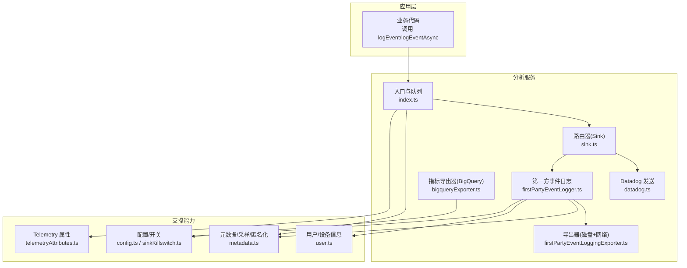
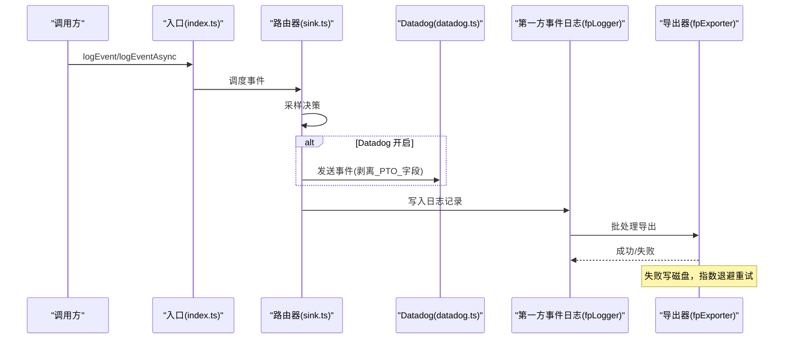
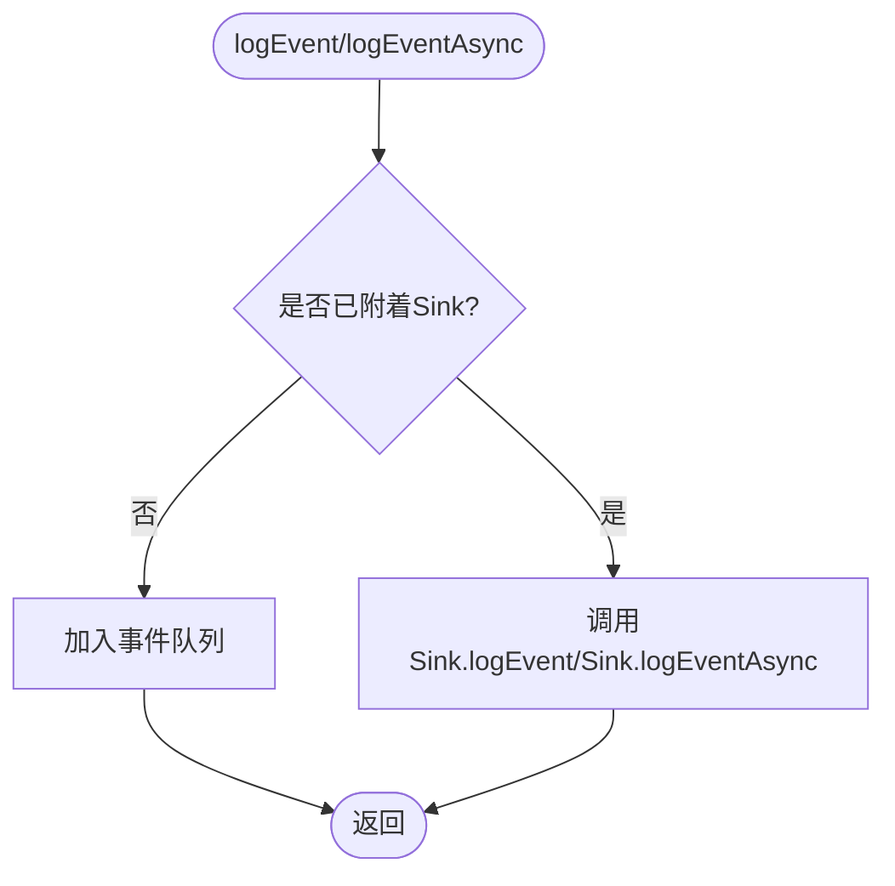
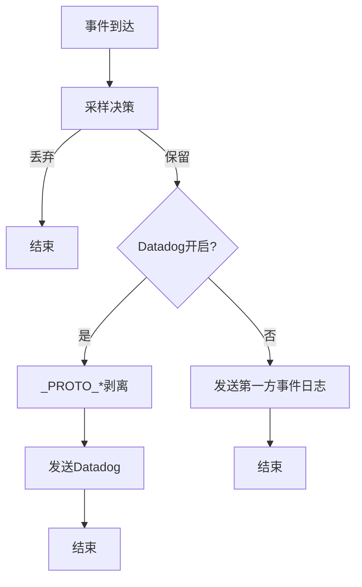
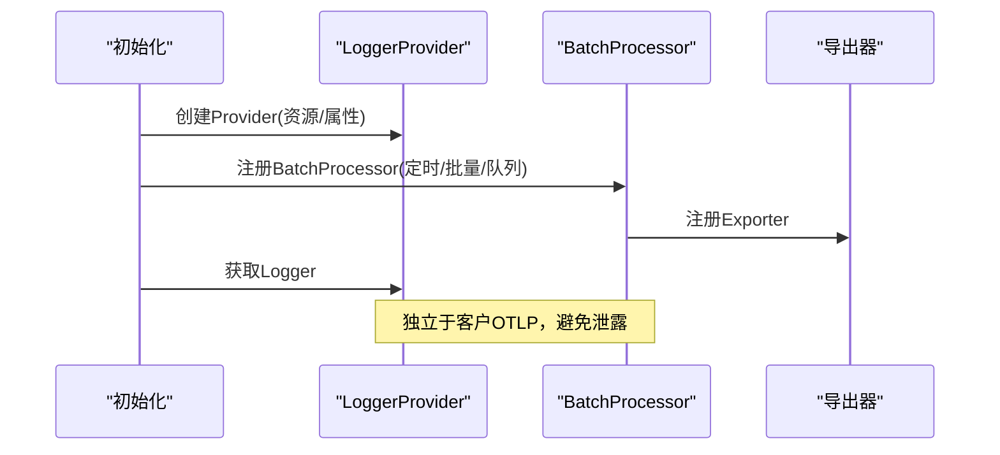
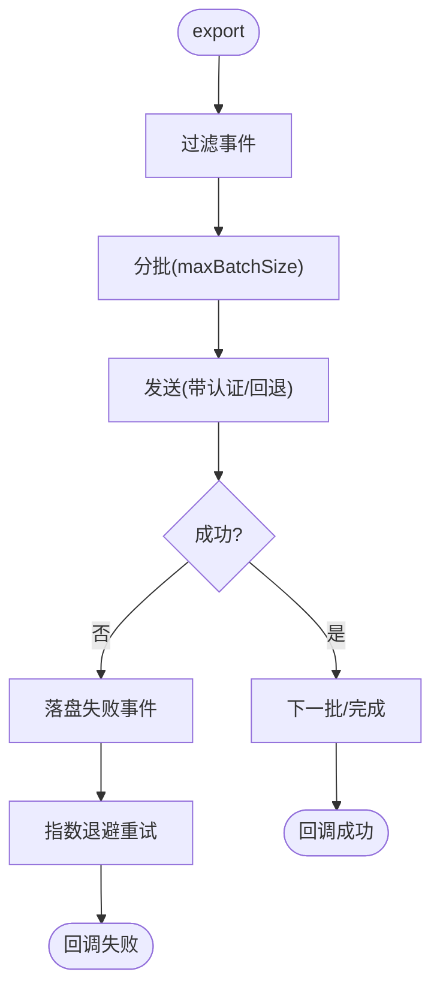
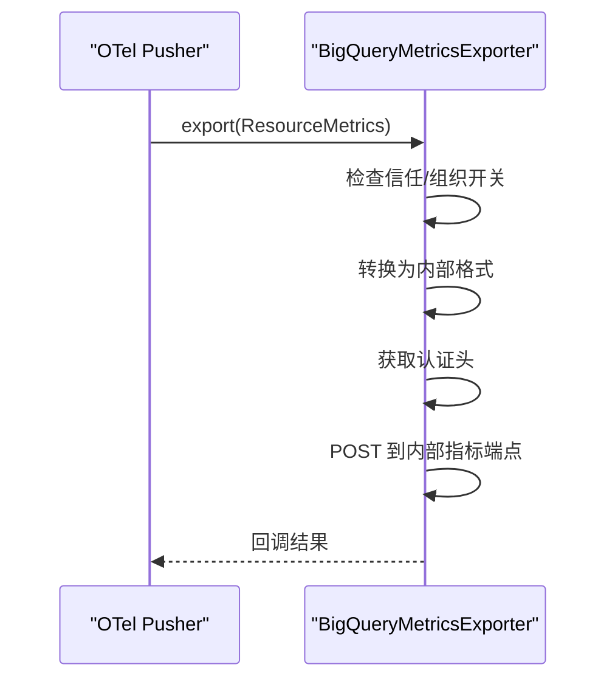
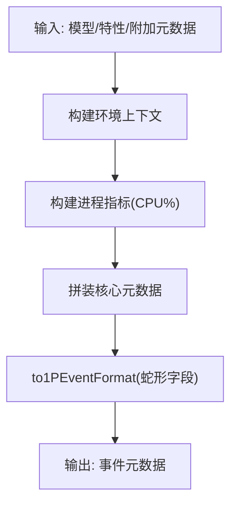
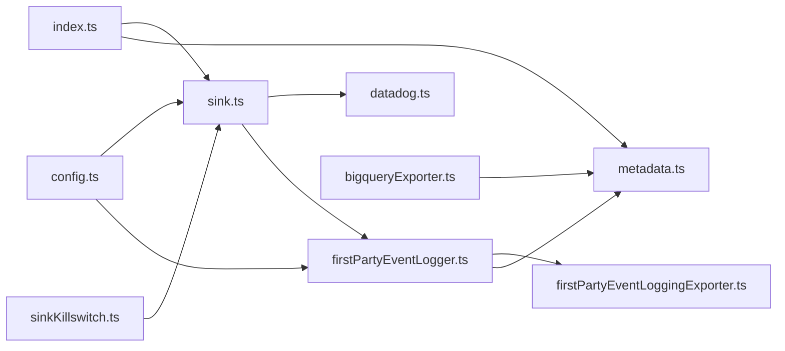

# 分析系统

<cite>
**本文引用的文件**
- [src/services/analytics/index.ts](file://src/services/analytics/index.ts)
- [src/services/analytics/sink.ts](file://src/services/analytics/sink.ts)
- [src/services/analytics/firstPartyEventLogger.ts](file://src/services/analytics/firstPartyEventLogger.ts)
- [src/services/analytics/firstPartyEventLoggingExporter.ts](file://src/services/analytics/firstPartyEventLoggingExporter.ts)
- [src/services/analytics/datadog.ts](file://src/services/analytics/datadog.ts)
- [src/services/analytics/metadata.ts](file://src/services/analytics/metadata.ts)
- [src/services/analytics/config.ts](file://src/services/analytics/config.ts)
- [src/services/analytics/sinkKillswitch.ts](file://src/services/analytics/sinkKillswitch.ts)
- [src/utils/telemetry/bigqueryExporter.ts](file://src/utils/telemetry/bigqueryExporter.ts)
- [src/utils/telemetryAttributes.ts](file://src/utils/telemetryAttributes.ts)
- [src/utils/user.ts](file://src/utils/user.ts)
- [docs/zh/01-遥测与隐私分析.md](file://docs/zh/01-遥测与隐私分析.md)
- [src/components/grove/Grove.tsx](file://src/components/grove/Grove.tsx)
</cite>

## 目录
1. [简介](#简介)
2. [项目结构](#项目结构)
3. [核心组件](#核心组件)
4. [架构总览](#架构总览)
5. [详细组件分析](#详细组件分析)
6. [依赖关系分析](#依赖关系分析)
7. [性能考量](#性能考量)
8. [故障排查指南](#故障排查指南)
9. [结论](#结论)
10. [附录](#附录)

## 简介
本技术文档面向 Claude Code 分析系统，系统性阐述遥测与分析的整体架构、事件采集与路由、指标导出、第一方事件日志与第三方服务集成（Datadog）、数据存储与传输、隐私保护与匿名化策略、配置选项、性能监控与调试方法，以及数据分析使用指南与最佳实践。

## 项目结构
分析系统主要由以下模块组成：
- 公共入口与队列：事件入口、延迟初始化与队列管理
- 路由器（Sink）：统一调度 Datadog 与第一方事件日志
- 第一方事件日志：基于 OpenTelemetry Logs 的批处理导出器，带磁盘失败重试
- 指标导出器：BigQuery Metrics Exporter，组织级指标开关与认证
- 元数据与采样：统一事件元数据构建、动态采样配置、PII 匿名化
- 配置与开关：全局遥测开关、单点 Kill Switch、GrowthBook 动态配置
- 文档与 UI：隐私设置入口、中文文档对遥测与隐私的说明

图表来源
- [src/services/analytics/index.ts:1-174](file://src/services/analytics/index.ts#L1-L174)
- [src/services/analytics/sink.ts:1-115](file://src/services/analytics/sink.ts#L1-L115)
- [src/services/analytics/firstPartyEventLogger.ts:1-450](file://src/services/analytics/firstPartyEventLogger.ts#L1-L450)
- [src/services/analytics/firstPartyEventLoggingExporter.ts:1-807](file://src/services/analytics/firstPartyEventLoggingExporter.ts#L1-L807)
- [src/services/analytics/datadog.ts:1-308](file://src/services/analytics/datadog.ts#L1-L308)
- [src/utils/telemetry/bigqueryExporter.ts:1-253](file://src/utils/telemetry/bigqueryExporter.ts#L1-L253)
- [src/services/analytics/metadata.ts:1-974](file://src/services/analytics/metadata.ts#L1-L974)
- [src/services/analytics/config.ts:1-39](file://src/services/analytics/config.ts#L1-L39)
- [src/services/analytics/sinkKillswitch.ts:1-26](file://src/services/analytics/sinkKillswitch.ts#L1-L26)
- [src/utils/telemetryAttributes.ts:1-42](file://src/utils/telemetryAttributes.ts#L1-L42)
- [src/utils/user.ts:49-81](file://src/utils/user.ts#L49-L81)

章节来源
- [src/services/analytics/index.ts:1-174](file://src/services/analytics/index.ts#L1-L174)
- [src/services/analytics/sink.ts:1-115](file://src/services/analytics/sink.ts#L1-L115)
- [src/services/analytics/firstPartyEventLogger.ts:1-450](file://src/services/analytics/firstPartyEventLogger.ts#L1-L450)
- [src/services/analytics/firstPartyEventLoggingExporter.ts:1-807](file://src/services/analytics/firstPartyEventLoggingExporter.ts#L1-L807)
- [src/services/analytics/datadog.ts:1-308](file://src/services/analytics/datadog.ts#L1-L308)
- [src/utils/telemetry/bigqueryExporter.ts:1-253](file://src/utils/telemetry/bigqueryExporter.ts#L1-L253)
- [src/services/analytics/metadata.ts:1-974](file://src/services/analytics/metadata.ts#L1-L974)
- [src/services/analytics/config.ts:1-39](file://src/services/analytics/config.ts#L1-L39)
- [src/services/analytics/sinkKillswitch.ts:1-26](file://src/services/analytics/sinkKillswitch.ts#L1-L26)
- [src/utils/telemetryAttributes.ts:1-42](file://src/utils/telemetryAttributes.ts#L1-L42)
- [src/utils/user.ts:49-81](file://src/utils/user.ts#L49-L81)

## 核心组件
- 入口与队列（index.ts）
  - 提供同步/异步事件接口，支持延迟初始化与事件队列，避免启动路径阻塞
  - 提供 stripProtoFields 以在通用后端前剥离 PII-tagged 字段
- 路由器（sink.ts）
  - 统一调度 Datadog 与第一方事件日志；按动态采样配置决定是否记录
  - 支持 Datadog 开关与单点 Kill Switch
- 第一方事件日志（firstPartyEventLogger.ts）
  - 基于 OpenTelemetry Logs 的独立 Provider，独立资源与批处理器
  - 支持动态批配置刷新、失败事件磁盘落盘与指数退避重试
- 导出器（firstPartyEventLoggingExporter.ts）
  - 批量发送至内部 /api/event_logging/batch，失败落盘，后台重试
  - 支持认证回退（401 自动降级为无认证），并发安全与幂等
- 指标导出器（bigqueryExporter.ts）
  - 将 OTel 指标转换为内部格式，按组织级开关与订阅类型附加资源属性
- 元数据与采样（metadata.ts）
  - 统一构建环境上下文、进程指标、会话/用户/订阅等元数据
  - 工具输入截断、MCP/技能名称匿名化、文件扩展名提取与清洗
- 配置与开关（config.ts / sinkKillswitch.ts）
  - 全局遥测开关、第三方云提供商豁免、单点 Kill Switch
- Telemetry 属性（telemetryAttributes.ts）
  - 控制会话 ID、版本、账户 UUID 等指标属性的包含策略
- 用户信息（user.ts）
  - 设备 ID、会话 ID、核心用户数据的预取与缓存

章节来源
- [src/services/analytics/index.ts:1-174](file://src/services/analytics/index.ts#L1-L174)
- [src/services/analytics/sink.ts:1-115](file://src/services/analytics/sink.ts#L1-L115)
- [src/services/analytics/firstPartyEventLogger.ts:1-450](file://src/services/analytics/firstPartyEventLogger.ts#L1-L450)
- [src/services/analytics/firstPartyEventLoggingExporter.ts:1-807](file://src/services/analytics/firstPartyEventLoggingExporter.ts#L1-L807)
- [src/utils/telemetry/bigqueryExporter.ts:1-253](file://src/utils/telemetry/bigqueryExporter.ts#L1-L253)
- [src/services/analytics/metadata.ts:1-974](file://src/services/analytics/metadata.ts#L1-L974)
- [src/services/analytics/config.ts:1-39](file://src/services/analytics/config.ts#L1-L39)
- [src/services/analytics/sinkKillswitch.ts:1-26](file://src/services/analytics/sinkKillswitch.ts#L1-L26)
- [src/utils/telemetryAttributes.ts:1-42](file://src/utils/telemetryAttributes.ts#L1-L42)
- [src/utils/user.ts:49-81](file://src/utils/user.ts#L49-L81)

## 架构总览
分析系统采用“入口 + 路由器 + 多后端”的分层设计：
- 入口负责事件聚合与延迟初始化
- 路由器负责采样与分流（Datadog 与第一方事件日志）
- 第一方事件日志通过独立 Provider 与导出器实现高可靠传输
- 指标通过 BigQuery 导出器进行组织级合规传输
- 元数据与匿名化策略贯穿所有后端，确保隐私合规

图表来源
- [src/services/analytics/index.ts:125-173](file://src/services/analytics/index.ts#L125-L173)
- [src/services/analytics/sink.ts:48-86](file://src/services/analytics/sink.ts#L48-L86)
- [src/services/analytics/datadog.ts:160-279](file://src/services/analytics/datadog.ts#L160-L279)
- [src/services/analytics/firstPartyEventLogger.ts:216-230](file://src/services/analytics/firstPartyEventLogger.ts#L216-L230)
- [src/services/analytics/firstPartyEventLoggingExporter.ts:277-377](file://src/services/analytics/firstPartyEventLoggingExporter.ts#L277-L377)

## 详细组件分析

### 入口与队列（index.ts）
- 设计要点
  - 无依赖的纯接口，避免循环导入
  - 事件队列在未附着 Sink 时暂存，附着后异步清空
  - 提供 stripProtoFields 以在通用后端前剥离 PII-tagged 字段
- 关键流程
  - 事件进入队列或直接转发
  - 初始化时批量投递队列事件，避免阻塞启动

图表来源
- [src/services/analytics/index.ts:83-123](file://src/services/analytics/index.ts#L83-L123)
- [src/services/analytics/index.ts:133-164](file://src/services/analytics/index.ts#L133-L164)

章节来源
- [src/services/analytics/index.ts:1-174](file://src/services/analytics/index.ts#L1-L174)

### 路由器（sink.ts）
- 设计要点
  - 采样：按动态配置对事件进行采样，采样率写入元数据
  - Datadog：通用访问后端，发送前剥离 _PROTO_* 字段
  - 第一方：直接透传完整元数据给导出器
  - 开关：支持单点 Kill Switch 与 Gate 缓存回退
- 关键流程
  - 初始化 Gate（Statsig）
  - 事件到达：采样 → 剥离字段（Datadog）→ 路由到各后端

图表来源
- [src/services/analytics/sink.ts:29-86](file://src/services/analytics/sink.ts#L29-L86)

章节来源
- [src/services/analytics/sink.ts:1-115](file://src/services/analytics/sink.ts#L1-L115)

### 第一方事件日志（firstPartyEventLogger.ts）
- 设计要点
  - 独立 LoggerProvider 与 BatchLogRecordProcessor
  - 动态批配置（GrowthBook）热更新，变更时重建流水线
  - 启动时扫描并重试上批次失败事件
- 关键流程
  - 初始化：构建资源、创建导出器、注册 Logger
  - 日志：增强元数据（模型、会话、环境、进程指标等）→ emit
  - 关闭：优雅 shutdown 并 forceFlush

图表来源
- [src/services/analytics/firstPartyEventLogger.ts:312-389](file://src/services/analytics/firstPartyEventLogger.ts#L312-L389)

章节来源
- [src/services/analytics/firstPartyEventLogger.ts:1-450](file://src/services/analytics/firstPartyEventLogger.ts#L1-L450)

### 导出器（firstPartyEventLoggingExporter.ts）
- 设计要点
  - 批量发送，失败事件追加到当前会话磁盘文件，原子写入
  - 指数退避重试（quadratic backoff），最大尝试次数可配
  - 401 自动降级为无认证发送，支持并发安全与幂等
  - 支持“停止”开关（Kill Switch），禁用时短路网络请求
- 关键流程
  - export：过滤事件、分批、发送、失败落盘、调度重试
  - retry：启动时扫描历史失败文件，后台重试
  - transform：将 OTel 日志转换为内部事件格式，Hoist PII-tagged 字段

图表来源
- [src/services/analytics/firstPartyEventLoggingExporter.ts:277-377](file://src/services/analytics/firstPartyEventLoggingExporter.ts#L277-L377)
- [src/services/analytics/firstPartyEventLoggingExporter.ts:445-517](file://src/services/analytics/firstPartyEventLoggingExporter.ts#L445-L517)

章节来源
- [src/services/analytics/firstPartyEventLoggingExporter.ts:1-807](file://src/services/analytics/firstPartyEventLoggingExporter.ts#L1-L807)

### 指标导出器（bigqueryExporter.ts）
- 设计要点
  - 将 OTel 指标转换为内部格式，附加资源属性（服务名、版本、OS、架构、WSL 版本、客户类型/订阅类型）
  - 组织级指标开关检查与认证头注入
  - 强制 Delta 聚合时序，保证仪表板正确性
- 关键流程
  - export：检查信任状态与组织开关 → 转换 → 认证 → 发送 → 回调

图表来源
- [src/utils/telemetry/bigqueryExporter.ts:63-148](file://src/utils/telemetry/bigqueryExporter.ts#L63-L148)

章节来源
- [src/utils/telemetry/bigqueryExporter.ts:1-253](file://src/utils/telemetry/bigqueryExporter.ts#L1-L253)

### 元数据与采样（metadata.ts）
- 设计要点
  - 统一构建环境上下文（平台、架构、包管理器、运行时、WSL/Linux/Distro/VCS 等）
  - 进程指标（内存、CPU 百分比等）按时间差计算
  - 工具输入截断与匿名化（字符串/数组/嵌套对象边界）
  - MCP/技能名称匿名化、文件扩展名提取与清洗
  - 会话/用户/订阅等核心元数据拼装
- 关键流程
  - getEventMetadata：聚合环境、进程、会话、订阅等信息
  - to1PEventFormat：转换为第一方事件格式（snake_case）

图表来源
- [src/services/analytics/metadata.ts:693-743](file://src/services/analytics/metadata.ts#L693-L743)
- [src/services/analytics/metadata.ts:796-800](file://src/services/analytics/metadata.ts#L796-L800)

章节来源
- [src/services/analytics/metadata.ts:1-974](file://src/services/analytics/metadata.ts#L1-L974)

### 配置与开关（config.ts / sinkKillswitch.ts）
- 设计要点
  - isAnalyticsDisabled：测试环境、第三方云提供商、隐私等级为“无遥测/仅必要流量”时禁用
  - isSinkKilled：按 GrowthBook 配置禁用单个后端（Datadog/第一方）
- 关键流程
  - 初始化阶段读取 Gate，早期事件使用缓存值
  - 运行期通过 onGrowthBookRefresh 通知订阅者重建配置

章节来源
- [src/services/analytics/config.ts:1-39](file://src/services/analytics/config.ts#L1-L39)
- [src/services/analytics/sinkKillswitch.ts:1-26](file://src/services/analytics/sinkKillswitch.ts#L1-L26)

### Telemetry 属性与用户信息
- Telemetry 属性（telemetryAttributes.ts）
  - 控制是否包含会话 ID、版本、账户 UUID 等指标属性
  - 通过环境变量与默认策略控制基数
- 用户信息（user.ts）
  - 设备 ID、会话 ID、核心用户数据预取与缓存
  - 登录/登出/切换账号时重置缓存

章节来源
- [src/utils/telemetryAttributes.ts:1-42](file://src/utils/telemetryAttributes.ts#L1-L42)
- [src/utils/user.ts:49-81](file://src/utils/user.ts#L49-L81)

## 依赖关系分析
- 组件耦合
  - index.ts 与 sink.ts 双向协作：入口负责队列与接口，路由器负责采样与分流
  - firstPartyEventLogger.ts 与 firstPartyEventLoggingExporter.ts 强耦合：前者产生日志，后者负责导出与重试
  - bigqueryExporter.ts 与 metadata.ts：指标导出依赖元数据中的资源属性
- 外部依赖
  - Datadog：HTTP 日志端点、客户端令牌、标签字段规范
  - GrowthBook：动态配置、特征值、实验曝光日志
  - OpenTelemetry：Logs/Metrics SDK、批处理器、资源属性

图表来源
- [src/services/analytics/index.ts:1-174](file://src/services/analytics/index.ts#L1-L174)
- [src/services/analytics/sink.ts:1-115](file://src/services/analytics/sink.ts#L1-L115)
- [src/services/analytics/firstPartyEventLogger.ts:1-450](file://src/services/analytics/firstPartyEventLogger.ts#L1-L450)
- [src/services/analytics/firstPartyEventLoggingExporter.ts:1-807](file://src/services/analytics/firstPartyEventLoggingExporter.ts#L1-L807)
- [src/utils/telemetry/bigqueryExporter.ts:1-253](file://src/utils/telemetry/bigqueryExporter.ts#L1-L253)
- [src/services/analytics/metadata.ts:1-974](file://src/services/analytics/metadata.ts#L1-L974)
- [src/services/analytics/config.ts:1-39](file://src/services/analytics/config.ts#L1-L39)
- [src/services/analytics/sinkKillswitch.ts:1-26](file://src/services/analytics/sinkKillswitch.ts#L1-L26)

章节来源
- [src/services/analytics/index.ts:1-174](file://src/services/analytics/index.ts#L1-L174)
- [src/services/analytics/sink.ts:1-115](file://src/services/analytics/sink.ts#L1-L115)
- [src/services/analytics/firstPartyEventLogger.ts:1-450](file://src/services/analytics/firstPartyEventLogger.ts#L1-L450)
- [src/services/analytics/firstPartyEventLoggingExporter.ts:1-807](file://src/services/analytics/firstPartyEventLoggingExporter.ts#L1-L807)
- [src/utils/telemetry/bigqueryExporter.ts:1-253](file://src/utils/telemetry/bigqueryExporter.ts#L1-L253)
- [src/services/analytics/metadata.ts:1-974](file://src/services/analytics/metadata.ts#L1-L974)
- [src/services/analytics/config.ts:1-39](file://src/services/analytics/config.ts#L1-L39)
- [src/services/analytics/sinkKillswitch.ts:1-26](file://src/services/analytics/sinkKillswitch.ts#L1-L26)

## 性能考量
- 启动路径优化
  - 事件队列与延迟初始化避免阻塞启动
  - Datadog 初始化采用缓存值，减少首次事件等待
- 批处理与背压
  - 第一方事件日志默认批大小与队列上限可控，降低网络开销
  - 指数退避重试避免雪崩，最大尝试次数可配置
- 卡片inality 控制
  - 模型名、工具名、版本等进行归一化与截断
  - 会话 ID/版本/账户 UUID 的包含策略可通过环境变量控制
- CPU/内存指标
  - 进程指标按时间差计算 CPU 百分比，避免频繁采样带来的开销

[本节为通用指导，不直接分析具体文件]

## 故障排查指南
- Datadog 发送问题
  - 检查 isAnalyticsDisabled 与 3P 提供商条件
  - 确认 allowed 事件集合与客户端令牌
  - 查看 flush 定时器与批量大小
- 第一方事件日志
  - 查看失败事件磁盘文件（按会话与批次 UUID 命名）
  - 观察指数退避重试与后台重试逻辑
  - 检查认证状态（信任对话、OAuth 令牌有效期、scope）
- 指标导出
  - 组织级指标开关与认证头缺失是常见失败原因
  - 确保 Delta 聚合时序一致性
- 隐私与匿名化
  - 工具输入截断与 MCP 名称匿名化
  - 文件扩展名清洗与长扩展名替换为 other
- 配置与开关
  - GrowthBook Gate 缓存回退与刷新
  - Kill Switch 对单后端的禁用

章节来源
- [src/services/analytics/datadog.ts:130-157](file://src/services/analytics/datadog.ts#L130-L157)
- [src/services/analytics/firstPartyEventLoggingExporter.ts:218-275](file://src/services/analytics/firstPartyEventLoggingExporter.ts#L218-L275)
- [src/services/analytics/firstPartyEventLoggingExporter.ts:445-517](file://src/services/analytics/firstPartyEventLoggingExporter.ts#L445-L517)
- [src/utils/telemetry/bigqueryExporter.ts:90-148](file://src/utils/telemetry/bigqueryExporter.ts#L90-L148)
- [src/services/analytics/metadata.ts:242-303](file://src/services/analytics/metadata.ts#L242-L303)
- [src/services/analytics/metadata.ts:323-412](file://src/services/analytics/metadata.ts#L323-L412)
- [src/services/analytics/config.ts:19-27](file://src/services/analytics/config.ts#L19-L27)
- [src/services/analytics/sinkKillswitch.ts:18-25](file://src/services/analytics/sinkKillswitch.ts#L18-L25)

## 结论
该分析系统通过“入口 + 路由器 + 多后端”的架构实现了高可用、可扩展且合规的遥测能力。第一方事件日志与磁盘重试保障了可靠性，Datadog 与 BigQuery 的差异化后端满足不同场景需求，动态采样与匿名化策略兼顾了数据价值与隐私保护。通过 GrowthBook 的动态配置与 Kill Switch，系统具备灵活的运行期治理能力。

[本节为总结，不直接分析具体文件]

## 附录

### 隐私与数据匿名化策略
- 工具输入截断与匿名化
  - 字符串、JSON、数组、嵌套对象均有边界控制
  - 通过环境变量可启用完整工具输入记录（仅限调试）
- MCP/技能名称匿名化
  - 非官方/非内置服务器名称与工具名进行匿名化
- 文件扩展名提取与清洗
  - 从允许命令中提取扩展名，长扩展名替换为 other
- PII-tagged 字段处理
  - _PROTO_* 字段仅用于特权列，通用后端发送前剥离
- 用户标识
  - 设备 ID 与会话 ID 作为关键标识，版本桶化与哈希化用于告警与基数控制

章节来源
- [src/services/analytics/metadata.ts:242-303](file://src/services/analytics/metadata.ts#L242-L303)
- [src/services/analytics/metadata.ts:323-412](file://src/services/analytics/metadata.ts#L323-L412)
- [src/services/analytics/index.ts:45-58](file://src/services/analytics/index.ts#L45-L58)
- [src/services/analytics/firstPartyEventLoggingExporter.ts:714-758](file://src/services/analytics/firstPartyEventLoggingExporter.ts#L714-L758)
- [docs/zh/01-遥测与隐私分析.md:65-110](file://docs/zh/01-遥测与隐私分析.md#L65-L110)

### 配置选项与环境变量
- 采样与批处理
  - tengu_event_sampling_config：事件级采样配置
  - tengu_1p_event_batch_config：第一方事件批处理配置（间隔、批量、队列、重试、端点）
  - OTEL_LOGS_EXPORT_INTERVAL：Datadog 批间隔
- 匿名化与细节
  - OTEL_LOG_TOOL_DETAILS：启用完整工具输入记录
- 指标属性基数控制
  - OTEL_METRICS_INCLUDE_SESSION_ID / OTEL_METRICS_INCLUDE_VERSION / OTEL_METRICS_INCLUDE_ACCOUNT_UUID
- Datadog
  - CLAUDE_CODE_DATADOG_FLUSH_INTERVAL_MS：刷新间隔覆盖
  - DATADOG_CLIENT_TOKEN：客户端令牌（常量）
- 第一方事件日志
  - ANTHROPIC_BASE_URL：目标端点选择（prod/staging）
  - CLAUDE_CONFIG_DIR：失败事件存储目录（运行时解析）

章节来源
- [src/services/analytics/firstPartyEventLogger.ts:87-102](file://src/services/analytics/firstPartyEventLogger.ts#L87-L102)
- [src/services/analytics/datadog.ts:301-307](file://src/services/analytics/datadog.ts#L301-L307)
- [src/utils/telemetryAttributes.ts:9-27](file://src/utils/telemetryAttributes.ts#L9-L27)
- [src/services/analytics/firstPartyEventLoggingExporter.ts:112-139](file://src/services/analytics/firstPartyEventLoggingExporter.ts#L112-L139)

### 使用指南与最佳实践
- 事件记录
  - 优先使用受控元数据类型，避免直接记录代码/文件路径
  - 对高基数字段（如模型名、工具名）进行归一化
- 采样与成本
  - 合理设置事件级采样率，平衡数据质量与成本
- 可靠性
  - 依赖第一方事件日志的磁盘重试与指数退避
  - 在网络异常时关注失败文件与重试日志
- 隐私
  - 默认匿名化策略下，谨慎开启完整工具输入记录
  - 避免在元数据中显式包含敏感信息
- UI 与设置
  - 隐私设置入口位于 UI 中，便于用户查看与管理

章节来源
- [src/services/analytics/index.ts:19-33](file://src/services/analytics/index.ts#L19-L33)
- [src/components/grove/Grove.tsx:421-462](file://src/components/grove/Grove.tsx#L421-L462)
- [docs/zh/01-遥测与隐私分析.md:82-110](file://docs/zh/01-遥测与隐私分析.md#L82-L110)