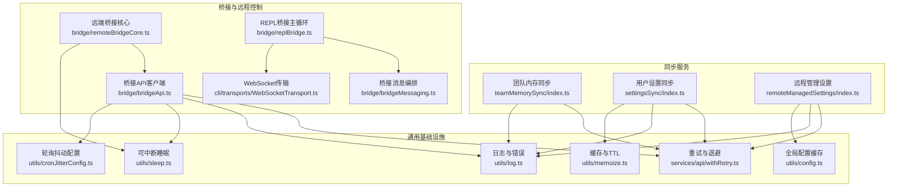
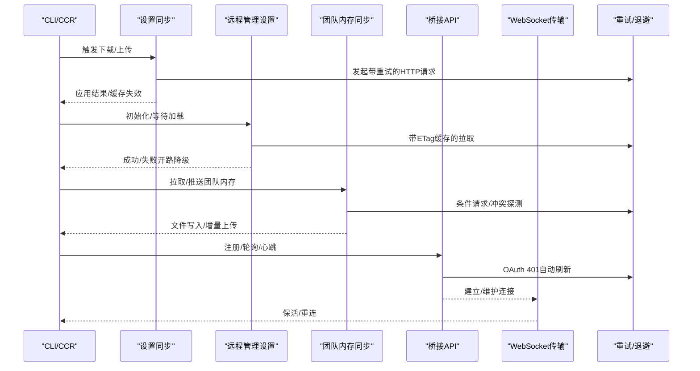
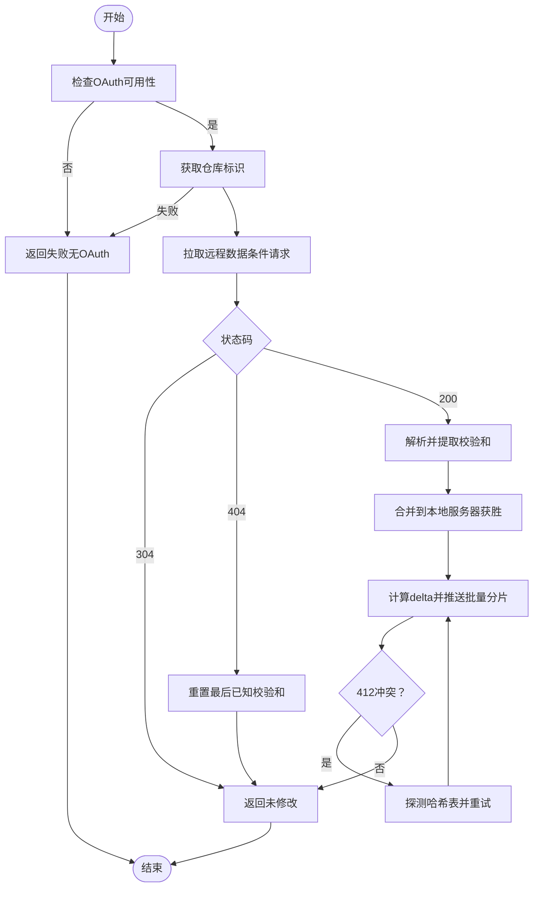
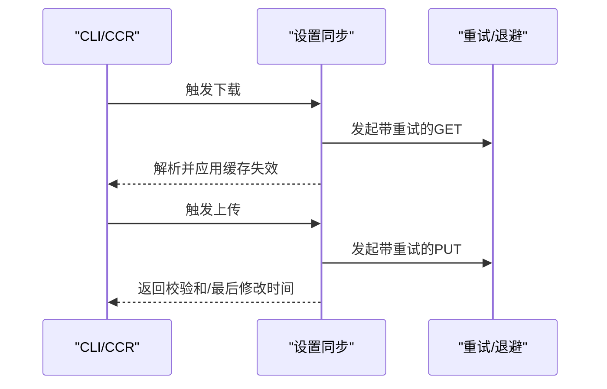
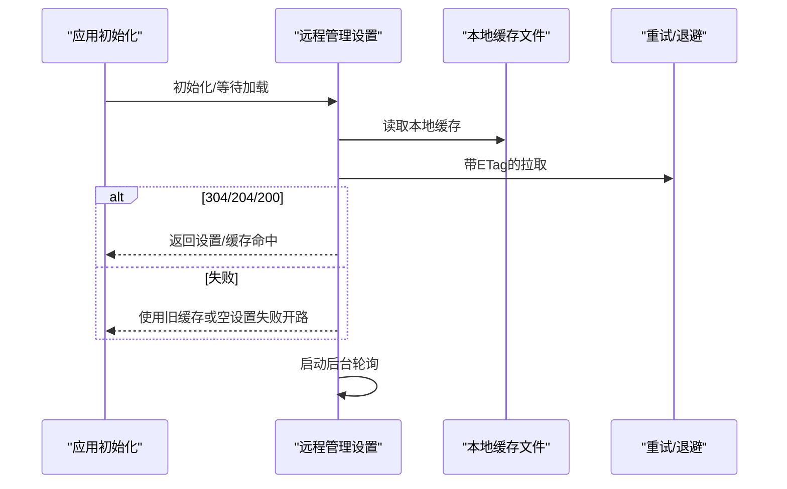
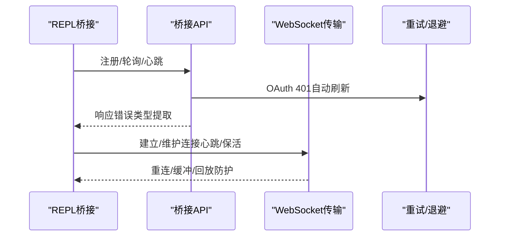
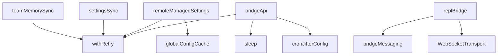

# 同步服务

<cite>
**本文引用的文件**
- [src/services/teamMemorySync/index.ts](file://src/services/teamMemorySync/index.ts)
- [src/services/teamMemorySync/secretScanner.ts](file://src/services/teamMemorySync/secretScanner.ts)
- [src/services/settingsSync/index.ts](file://src/services/settingsSync/index.ts)
- [src/services/remoteManagedSettings/index.ts](file://src/services/remoteManagedSettings/index.ts)
- [src/services/api/withRetry.ts](file://src/services/api/withRetry.ts)
- [src/bridge/bridgeApi.ts](file://src/bridge/bridgeApi.ts)
- [src/bridge/bridgeMessaging.ts](file://src/bridge/bridgeMessaging.ts)
- [src/bridge/remoteBridgeCore.ts](file://src/bridge/remoteBridgeCore.ts)
- [src/bridge/replBridge.ts](file://src/bridge/replBridge.ts)
- [src/cli/transports/WebSocketTransport.ts](file://src/cli/transports/WebSocketTransport.ts)
- [src/utils/sleep.ts](file://src/utils/sleep.ts)
- [src/utils/log.ts](file://src/utils/log.ts)
- [src/utils/memoize.ts](file://src/utils/memoize.ts)
- [src/utils/config.ts](file://src/utils/config.ts)
- [src/utils/cronJitterConfig.ts](file://src/utils/cronJitterConfig.ts)
- [src/commands/security-review.ts](file://src/commands/security-review.ts)
</cite>

## 目录
1. [简介](#简介)
2. [项目结构](#项目结构)
3. [核心组件](#核心组件)
4. [架构总览](#架构总览)
5. [详细组件分析](#详细组件分析)
6. [依赖关系分析](#依赖关系分析)
7. [性能考量](#性能考量)
8. [故障排查指南](#故障排查指南)
9. [结论](#结论)
10. [附录](#附录)

## 简介
本技术文档系统性阐述 Claude Code 的同步服务，覆盖以下主题：
- 团队内存同步：基于 ETag/条件请求的双向同步、乐观锁冲突处理、按内容哈希的增量上传、入口级安全扫描与过滤。
- 设置同步：用户设置与记忆文件的增量上传与下载、大小限制与校验、应用后缓存失效与内部写标记。
- 远程管理设置：企业级托管设置的拉取、缓存、ETag 校验、后台轮询与安全检查。
- 安全机制：OAuth 认证头注入、令牌刷新与 401 自恢复、可信设备令牌、入站消息去重与回放防护、敏感信息扫描。
- 配置与性能：重试策略、指数退避、超时、并发批处理、LRU 缓存与 TTL、轮询抖动配置。
- 故障恢复与一致性：304/404 处理、412 冲突探测、分片上传、失败开路（fail-open）降级、心跳与保活。

## 项目结构
同步服务主要分布在如下模块：
- 团队内存同步：src/services/teamMemorySync/*
- 用户设置同步：src/services/settingsSync/*
- 远程管理设置：src/services/remoteManagedSettings/*
- 桥接与远程控制：src/bridge/*（含 API 客户端、消息编排、传输层）
- 通用基础设施：重试、日志、睡眠、缓存、配置、定时抖动等工具

图表来源
- [src/services/teamMemorySync/index.ts:1-1257](file://src/services/teamMemorySync/index.ts#L1-L1257)
- [src/services/settingsSync/index.ts:1-582](file://src/services/settingsSync/index.ts#L1-L582)
- [src/services/remoteManagedSettings/index.ts:1-639](file://src/services/remoteManagedSettings/index.ts#L1-L639)
- [src/bridge/bridgeApi.ts:1-540](file://src/bridge/bridgeApi.ts#L1-L540)
- [src/bridge/bridgeMessaging.ts:1-462](file://src/bridge/bridgeMessaging.ts#L1-L462)
- [src/bridge/remoteBridgeCore.ts:553-592](file://src/bridge/remoteBridgeCore.ts#L553-L592)
- [src/bridge/replBridge.ts:1077-1911](file://src/bridge/replBridge.ts#L1077-L1911)
- [src/cli/transports/WebSocketTransport.ts:60-133](file://src/cli/transports/WebSocketTransport.ts#L60-L133)
- [src/services/api/withRetry.ts:353-514](file://src/services/api/withRetry.ts#L353-L514)
- [src/utils/sleep.ts:1-38](file://src/utils/sleep.ts#L1-L38)
- [src/utils/log.ts:158-203](file://src/utils/log.ts#L158-L203)
- [src/utils/memoize.ts:1-172](file://src/utils/memoize.ts#L1-L172)
- [src/utils/config.ts:1036-1055](file://src/utils/config.ts#L1036-L1055)
- [src/utils/cronJitterConfig.ts:26-75](file://src/utils/cronJitterConfig.ts#L26-L75)

章节来源
- [src/services/teamMemorySync/index.ts:1-1257](file://src/services/teamMemorySync/index.ts#L1-L1257)
- [src/services/settingsSync/index.ts:1-582](file://src/services/settingsSync/index.ts#L1-L582)
- [src/services/remoteManagedSettings/index.ts:1-639](file://src/services/remoteManagedSettings/index.ts#L1-L639)
- [src/bridge/bridgeApi.ts:1-540](file://src/bridge/bridgeApi.ts#L1-L540)
- [src/bridge/bridgeMessaging.ts:1-462](file://src/bridge/bridgeMessaging.ts#L1-L462)
- [src/bridge/remoteBridgeCore.ts:553-592](file://src/bridge/remoteBridgeCore.ts#L553-L592)
- [src/bridge/replBridge.ts:1077-1911](file://src/bridge/replBridge.ts#L1077-L1911)
- [src/cli/transports/WebSocketTransport.ts:60-133](file://src/cli/transports/WebSocketTransport.ts#L60-L133)
- [src/services/api/withRetry.ts:353-514](file://src/services/api/withRetry.ts#L353-L514)
- [src/utils/sleep.ts:1-38](file://src/utils/sleep.ts#L1-L38)
- [src/utils/log.ts:158-203](file://src/utils/log.ts#L158-L203)
- [src/utils/memoize.ts:1-172](file://src/utils/memoize.ts#L1-L172)
- [src/utils/config.ts:1036-1055](file://src/utils/config.ts#L1036-L1055)
- [src/utils/cronJitterConfig.ts:26-75](file://src/utils/cronJitterConfig.ts#L26-L75)

## 核心组件
- 团队内存同步（Team Memory Sync）
  - 支持 OAuth 第一方认证、ETag 条件请求、304/404 分支处理、解析校验与错误分类。
  - 基于内容哈希的增量上传（delta），支持批量分片与冲突探测（412）。
  - 入口级敏感信息扫描与跳过，避免本地机密外泄。
- 用户设置同步（Settings Sync）
  - 交互式 CLI 增量上传；CCR 场景提前下载并应用，支持大小限制与内部写标记抑制变更检测。
- 远程管理设置（Remote Managed Settings）
  - 基于 ETag 的缓存与 304 利用，失败开路降级，后台轮询，安全检查与用户确认。
- 桥接与远程控制（Bridge）
  - OAuth 401 自动刷新、带可信设备令牌、入站消息去重与回放防护、心跳保活、传输层重连与缓冲。

章节来源
- [src/services/teamMemorySync/index.ts:1-1257](file://src/services/teamMemorySync/index.ts#L1-L1257)
- [src/services/settingsSync/index.ts:1-582](file://src/services/settingsSync/index.ts#L1-L582)
- [src/services/remoteManagedSettings/index.ts:1-639](file://src/services/remoteManagedSettings/index.ts#L1-L639)
- [src/bridge/bridgeApi.ts:1-540](file://src/bridge/bridgeApi.ts#L1-L540)
- [src/bridge/bridgeMessaging.ts:1-462](file://src/bridge/bridgeMessaging.ts#L1-L462)

## 架构总览
下图展示同步服务在不同场景下的关键交互路径与组件协作：

图表来源
- [src/services/settingsSync/index.ts:129-202](file://src/services/settingsSync/index.ts#L129-L202)
- [src/services/remoteManagedSettings/index.ts:514-555](file://src/services/remoteManagedSettings/index.ts#L514-L555)
- [src/services/teamMemorySync/index.ts:770-800](file://src/services/teamMemorySync/index.ts#L770-L800)
- [src/bridge/bridgeApi.ts:106-139](file://src/bridge/bridgeApi.ts#L106-L139)
- [src/cli/transports/WebSocketTransport.ts:60-133](file://src/cli/transports/WebSocketTransport.ts#L60-L133)
- [src/services/api/withRetry.ts:353-514](file://src/services/api/withRetry.ts#L353-L514)

## 详细组件分析

### 团队内存同步（Team Memory Sync）
- 数据同步策略
  - 拉取：条件请求（If-None-Match）+ 304/404 分支；解析响应并提取校验和。
  - 推送：仅上传内容哈希与服务器不一致的键（delta），批量按字节上限切分；冲突（412）时探测哈希表并重试。
  - 文件写入：对路径进行边界校验，跳过内容一致的文件以减少缓存失效与事件风暴。
- 冲突解决
  - 拉取阶段：服务器获胜（覆盖本地）。
  - 推送阶段：乐观锁（If-Match）+ 冲突探测（view=hashes）+ 重试；本地版本覆盖服务器版本，避免静默丢失用户编辑。
- 增量更新
  - 基于 sha256 内容哈希比较；批量分片上传避免网关 413。
- 安全与合规
  - 入口级敏感信息扫描（gitleaks 规则集），发现即跳过文件并记录。
  - 仅在第一方 OAuth 可用时启用。
- 错误处理
  - 统一错误分类（认证/超时/网络/未知），304/404 正常分支，413 结构化错误解析并学习最大条目数。

图表来源
- [src/services/teamMemorySync/index.ts:188-306](file://src/services/teamMemorySync/index.ts#L188-L306)
- [src/services/teamMemorySync/index.ts:862-972](file://src/services/teamMemorySync/index.ts#L862-L972)
- [src/services/teamMemorySync/secretScanner.ts:177-227](file://src/services/teamMemorySync/secretScanner.ts#L177-L227)

章节来源
- [src/services/teamMemorySync/index.ts:1-1257](file://src/services/teamMemorySync/index.ts#L1-L1257)
- [src/services/teamMemorySync/secretScanner.ts:177-227](file://src/services/teamMemorySync/secretScanner.ts#L177-L227)

### 用户设置同步（Settings Sync）
- 数据同步策略
  - 交互式 CLI：增量上传（仅变化项），基于键集合比对。
  - CCR：启动前下载并应用，支持大小限制与内部写标记抑制变更检测。
- 冲突与一致性
  - 下载后统一应用，触发缓存失效；上传成功后记录校验和与最后修改时间。
- 错误处理
  - 统一错误分类与重试；空响应与 404 视为空设置。

图表来源
- [src/services/settingsSync/index.ts:129-202](file://src/services/settingsSync/index.ts#L129-L202)
- [src/services/settingsSync/index.ts:315-345](file://src/services/settingsSync/index.ts#L315-L345)
- [src/services/settingsSync/index.ts:347-392](file://src/services/settingsSync/index.ts#L347-L392)

章节来源
- [src/services/settingsSync/index.ts:1-582](file://src/services/settingsSync/index.ts#L1-L582)

### 远程管理设置（Remote Managed Settings）
- 数据同步策略
  - 基于 ETag 的缓存与 304 利用；失败开路降级（使用旧缓存或空设置）。
  - 后台轮询（默认 1 小时）检测变更并触发热重载。
- 安全与合规
  - 应用前执行安全检查，用户拒绝则保留当前设置。
  - 文件权限严格（0600），失败忽略保存错误。
- 错误处理
  - 404/204 视为空设置；认证错误不重试；其他错误统一分类。

图表来源
- [src/services/remoteManagedSettings/index.ts:514-555](file://src/services/remoteManagedSettings/index.ts#L514-L555)
- [src/services/remoteManagedSettings/index.ts:415-503](file://src/services/remoteManagedSettings/index.ts#L415-L503)
- [src/services/remoteManagedSettings/index.ts:612-628](file://src/services/remoteManagedSettings/index.ts#L612-L628)

章节来源
- [src/services/remoteManagedSettings/index.ts:1-639](file://src/services/remoteManagedSettings/index.ts#L1-L639)

### 桥接与远程控制（Bridge）
- 安全与认证
  - OAuth 令牌刷新（401 自动恢复）、可信设备令牌头、ID 校验防止路径注入。
- 传输与保活
  - WebSocket 传输层：自动重连、心跳、保活帧、消息缓冲与回放防护。
- 控制请求与去重
  - 入站消息去重（echo 与重复提示）、控制请求快速响应，避免服务器挂起。

图表来源
- [src/bridge/bridgeApi.ts:106-139](file://src/bridge/bridgeApi.ts#L106-L139)
- [src/bridge/remoteBridgeCore.ts:553-592](file://src/bridge/remoteBridgeCore.ts#L553-L592)
- [src/bridge/replBridge.ts:1077-1911](file://src/bridge/replBridge.ts#L1077-L1911)
- [src/cli/transports/WebSocketTransport.ts:60-133](file://src/cli/transports/WebSocketTransport.ts#L60-L133)

章节来源
- [src/bridge/bridgeApi.ts:1-540](file://src/bridge/bridgeApi.ts#L1-L540)
- [src/bridge/bridgeMessaging.ts:1-462](file://src/bridge/bridgeMessaging.ts#L1-L462)
- [src/bridge/remoteBridgeCore.ts:553-592](file://src/bridge/remoteBridgeCore.ts#L553-L592)
- [src/bridge/replBridge.ts:1077-1911](file://src/bridge/replBridge.ts#L1077-L1911)
- [src/cli/transports/WebSocketTransport.ts:60-133](file://src/cli/transports/WebSocketTransport.ts#L60-L133)

## 依赖关系分析
- 耦合与内聚
  - 同步模块各自职责清晰：团队内存、用户设置、远程管理设置分别封装各自的协议、缓存与错误处理。
  - 通用基础设施（重试、日志、睡眠、缓存）被多模块复用，降低重复代码。
- 外部依赖与集成点
  - HTTP 客户端 axios；OAuth 令牌；文件系统；WebSocket 传输；JSON 序列化与哈希。
- 循环依赖
  - 模块间通过函数注入与纯工具函数避免循环导入；桥接 API 客户端通过回调注入刷新逻辑。

图表来源
- [src/services/teamMemorySync/index.ts:1-1257](file://src/services/teamMemorySync/index.ts#L1-L1257)
- [src/services/settingsSync/index.ts:1-582](file://src/services/settingsSync/index.ts#L1-L582)
- [src/services/remoteManagedSettings/index.ts:1-639](file://src/services/remoteManagedSettings/index.ts#L1-L639)
- [src/bridge/bridgeApi.ts:1-540](file://src/bridge/bridgeApi.ts#L1-L540)
- [src/bridge/bridgeMessaging.ts:1-462](file://src/bridge/bridgeMessaging.ts#L1-L462)
- [src/bridge/replBridge.ts:1077-1911](file://src/bridge/replBridge.ts#L1077-L1911)
- [src/cli/transports/WebSocketTransport.ts:60-133](file://src/cli/transports/WebSocketTransport.ts#L60-L133)
- [src/services/api/withRetry.ts:353-514](file://src/services/api/withRetry.ts#L353-L514)
- [src/utils/sleep.ts:1-38](file://src/utils/sleep.ts#L1-L38)
- [src/utils/config.ts:1036-1055](file://src/utils/config.ts#L1036-L1055)
- [src/utils/cronJitterConfig.ts:26-75](file://src/utils/cronJitterConfig.ts#L26-L75)

章节来源
- [src/services/api/withRetry.ts:353-514](file://src/services/api/withRetry.ts#L353-L514)
- [src/utils/memoize.ts:1-172](file://src/utils/memoize.ts#L1-L172)
- [src/utils/config.ts:1036-1055](file://src/utils/config.ts#L1036-L1055)
- [src/utils/cronJitterConfig.ts:26-75](file://src/utils/cronJitterConfig.ts#L26-L75)

## 性能考量
- 重试与退避
  - 统一的指数退避与“持久重试”策略，长睡眠分片避免宿主误判空闲。
- 并发与批处理
  - 团队内存推送采用贪心装箱（bin-packing）按字节上限切分，提升吞吐并避免网关 413。
- 缓存与TTL
  - memoizeWithTTL 实现写透缓存，冷热分离；全局配置缓存写透避免频繁磁盘读。
- 轮询抖动
  - 周期性抖动配置从 GrowthBook 动态拉取，避免集中抖动。
- I/O 优化
  - 团队内存写入跳过内容一致文件，减少缓存失效与事件风暴；设置应用阶段批量写入并统一失效缓存。

章节来源
- [src/services/api/withRetry.ts:353-514](file://src/services/api/withRetry.ts#L353-L514)
- [src/services/teamMemorySync/index.ts:426-460](file://src/services/teamMemorySync/index.ts#L426-L460)
- [src/utils/memoize.ts:40-107](file://src/utils/memoize.ts#L40-L107)
- [src/utils/config.ts:1036-1055](file://src/utils/config.ts#L1036-L1055)
- [src/utils/cronJitterConfig.ts:67-75](file://src/utils/cronJitterConfig.ts#L67-L75)

## 故障排查指南
- 常见错误与定位
  - 认证失败（401/403/404/410）：检查 OAuth 令牌、作用域与会话有效期；桥接 API 客户端会抛出致命错误。
  - 超时与网络错误：检查重试与退避是否生效；确认代理与空闲超时。
  - 冲突（412）：团队内存推送探测哈希表后重试；若仍失败，检查 view=hashes 是否可用。
  - 结构化 413：解析 max_entries 并截断条目；学习服务器限制避免后续失败。
- 日志与诊断
  - 统一日志接口与内存错误日志；可启用硬失败模式快速暴露问题。
  - 桥接调试：注入故障队列模拟 401/5xx 与瞬时错误，辅助定位。
- 降级与恢复
  - 远程管理设置失败开路：优先使用旧缓存；404/204 清理缓存文件。
  - 团队内存/设置同步：304/404 正常路径；401 自动刷新；412 冲突探测。

章节来源
- [src/bridge/bridgeApi.ts:454-508](file://src/bridge/bridgeApi.ts#L454-L508)
- [src/bridge/bridgeDebug.ts:77-110](file://src/bridge/bridgeDebug.ts#L77-L110)
- [src/utils/log.ts:158-203](file://src/utils/log.ts#L158-L203)
- [src/services/teamMemorySync/index.ts:526-552](file://src/services/teamMemorySync/index.ts#L526-L552)
- [src/services/remoteManagedSettings/index.ts:432-502](file://src/services/remoteManagedSettings/index.ts#L432-L502)

## 结论
该同步体系通过明确的协议契约、严格的认证与安全检查、稳健的错误处理与降级策略，实现了跨环境的一致性与可靠性。团队内存同步强调内容级增量与冲突探测，用户设置同步强调最小化变更与缓存一致性，远程管理设置强调安全检查与后台轮询。桥接与传输层确保了远程控制场景下的高可用与可观测性。整体设计兼顾易用性与可维护性，适合在复杂的企业环境中稳定运行。

## 附录
- 扩展开发指南
  - 新增同步目标时，遵循现有模式：认证头注入、条件请求、错误分类、重试与退避、缓存与ETag、失败开路。
  - 引入安全扫描与大小限制，避免敏感信息泄露与资源滥用。
  - 在桥接场景中，确保控制请求快速响应与消息去重，保障服务器侧不会超时挂起。
- 最佳实践建议
  - 使用内容哈希进行增量判断，避免全量传输。
  - 对大体量数据采用分片上传与批量处理。
  - 保持 ETag 缓存与服务器校验一致，减少不必要的网络往返。
  - 在企业场景中启用可信设备令牌与安全检查，降低风险面。
  - 通过轮询抖动与可中断睡眠，平衡实时性与资源消耗。