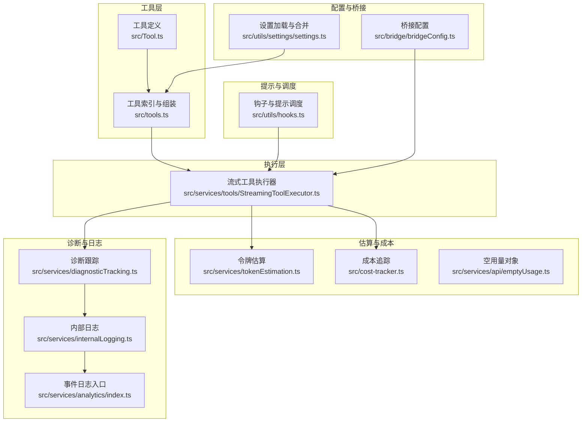
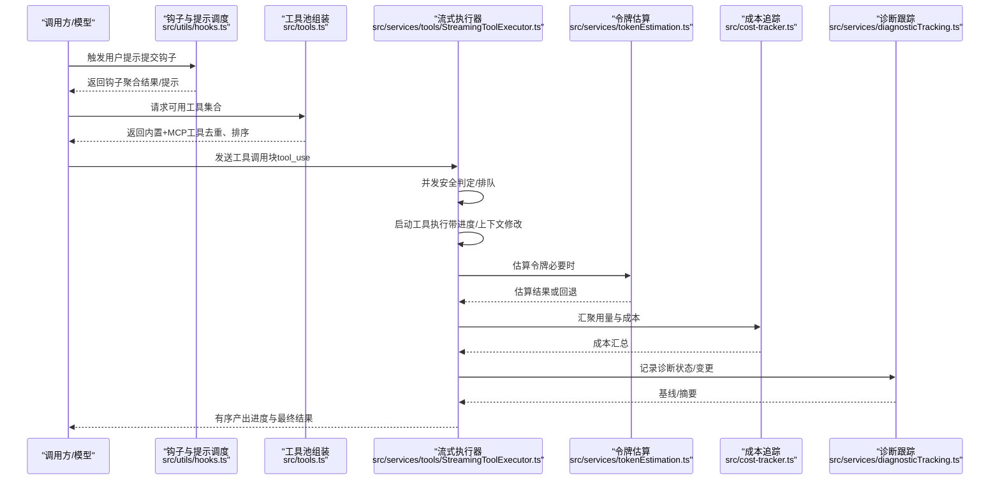
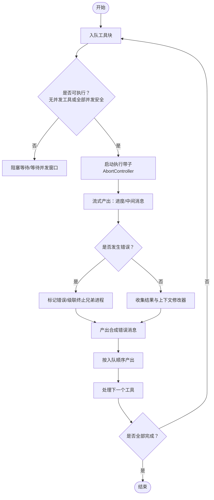
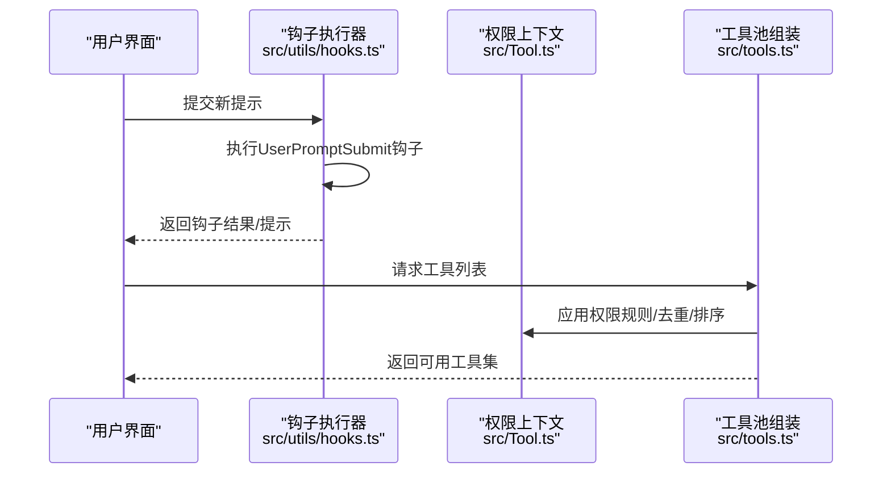
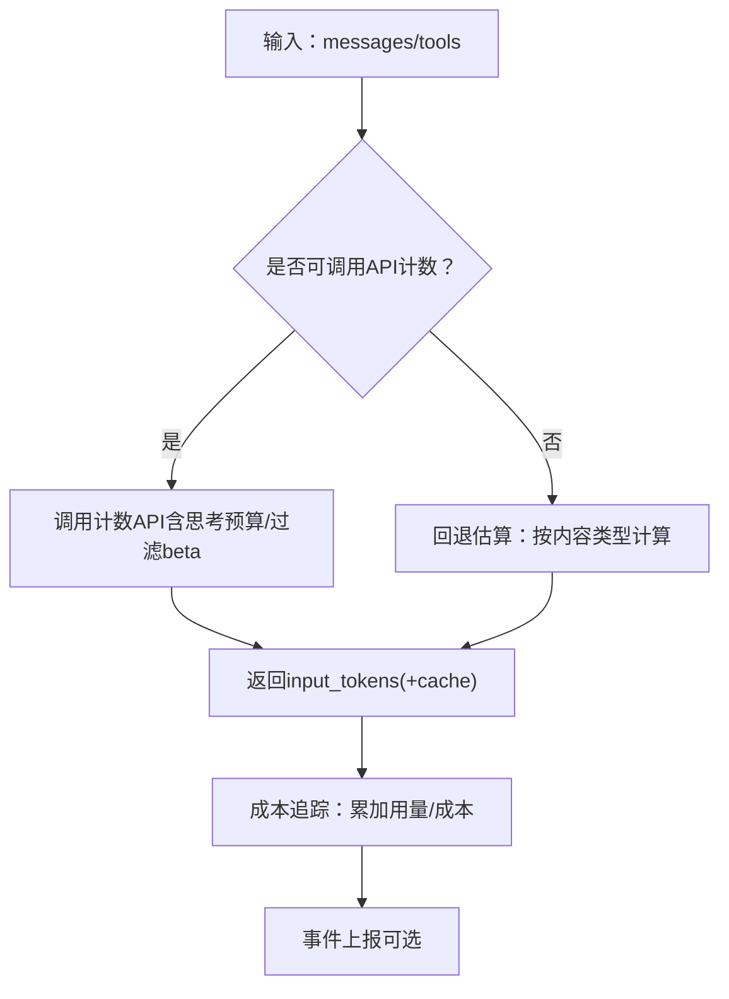
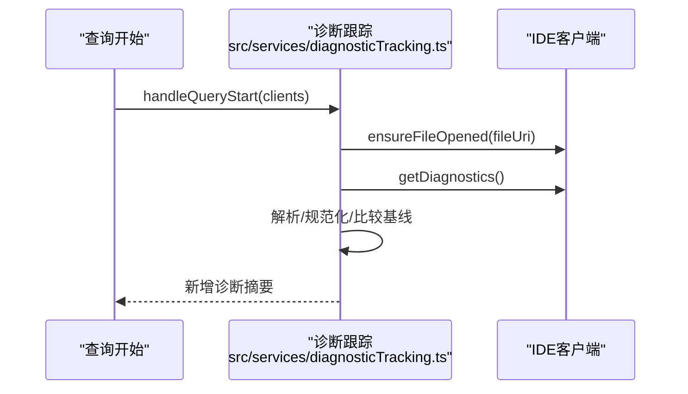
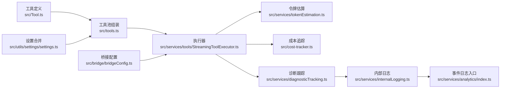

# 实用工具服务

<cite>
**本文引用的文件**
- [src/services/tools/StreamingToolExecutor.ts](file://src/services/tools/StreamingToolExecutor.ts)
- [src/services/tokenEstimation.ts](file://src/services/tokenEstimation.ts)
- [src/services/diagnosticTracking.ts](file://src/services/diagnosticTracking.ts)
- [src/services/internalLogging.ts](file://src/services/internalLogging.ts)
- [src/services/analytics/index.ts](file://src/services/analytics/index.ts)
- [src/tools.ts](file://src/tools.ts)
- [src/Tool.ts](file://src/Tool.ts)
- [src/utils/hooks.ts](file://src/utils/hooks.ts)
- [src/utils/settings/settings.ts](file://src/utils/settings/settings.ts)
- [src/bridge/bridgeConfig.ts](file://src/bridge/bridgeConfig.ts)
- [src/cost-tracker.ts](file://src/cost-tracker.ts)
- [src/utils/messages.ts](file://src/utils/messages.ts)
- [src/services/api/emptyUsage.ts](file://src/services/api/emptyUsage.ts)
</cite>

## 目录
1. [简介](#简介)
2. [项目结构](#项目结构)
3. [核心组件](#核心组件)
4. [架构总览](#架构总览)
5. [详细组件分析](#详细组件分析)
6. [依赖关系分析](#依赖关系分析)
7. [性能考量](#性能考量)
8. [故障排查指南](#故障排查指南)
9. [结论](#结论)
10. [附录](#附录)

## 简介
本文件面向Claude Code实用工具服务，系统化阐述以下能力与实现：
- 工具执行器：并发安全控制、流式执行、结果有序产出与中断处理
- 提示管理与调度：钩子触发、权限上下文、工具池组装与提示缓存友好性
- 令牌估算与成本控制：API计数、回退估算、资源预算与成本追踪
- 诊断跟踪与内部日志：IDE诊断采集、错误归因与可观测性
- 配置与扩展：设置源合并、环境变量展开、桥接配置与可插拔工具

目标是帮助开发者快速理解并正确使用工具服务，同时为二次开发提供清晰的扩展点。

## 项目结构
实用工具服务横跨“工具定义”、“执行器”、“估算与成本”、“诊断与日志”、“配置与桥接”等多个模块，形成“工具即能力”的统一抽象，并通过上下文与钩子实现灵活的提示调度与权限控制。

图表来源
- [src/Tool.ts:1-793](file://src/Tool.ts#L1-L793)
- [src/tools.ts:1-390](file://src/tools.ts#L1-L390)
- [src/services/tools/StreamingToolExecutor.ts:1-531](file://src/services/tools/StreamingToolExecutor.ts#L1-L531)
- [src/utils/hooks.ts:3810-3855](file://src/utils/hooks.ts#L3810-L3855)
- [src/services/tokenEstimation.ts:1-496](file://src/services/tokenEstimation.ts#L1-L496)
- [src/cost-tracker.ts:286-323](file://src/cost-tracker.ts#L286-L323)
- [src/services/diagnosticTracking.ts:1-398](file://src/services/diagnosticTracking.ts#L1-L398)
- [src/services/internalLogging.ts:1-91](file://src/services/internalLogging.ts#L1-L91)
- [src/services/analytics/index.ts:1-174](file://src/services/analytics/index.ts#L1-L174)
- [src/utils/settings/settings.ts:1-800](file://src/utils/settings/settings.ts#L1-L800)
- [src/bridge/bridgeConfig.ts:1-49](file://src/bridge/bridgeConfig.ts#L1-L49)

章节来源
- [src/Tool.ts:1-793](file://src/Tool.ts#L1-L793)
- [src/tools.ts:1-390](file://src/tools.ts#L1-L390)
- [src/services/tools/StreamingToolExecutor.ts:1-531](file://src/services/tools/StreamingToolExecutor.ts#L1-L531)
- [src/utils/hooks.ts:3810-3855](file://src/utils/hooks.ts#L3810-L3855)
- [src/services/tokenEstimation.ts:1-496](file://src/services/tokenEstimation.ts#L1-L496)
- [src/cost-tracker.ts:286-323](file://src/cost-tracker.ts#L286-L323)
- [src/services/diagnosticTracking.ts:1-398](file://src/services/diagnosticTracking.ts#L1-L398)
- [src/services/internalLogging.ts:1-91](file://src/services/internalLogging.ts#L1-L91)
- [src/services/analytics/index.ts:1-174](file://src/services/analytics/index.ts#L1-L174)
- [src/utils/settings/settings.ts:1-800](file://src/utils/settings/settings.ts#L1-L800)
- [src/bridge/bridgeConfig.ts:1-49](file://src/bridge/bridgeConfig.ts#L1-L49)

## 核心组件
- 工具定义与类型系统：统一的工具接口、输入输出模式、权限检查、渲染与摘要等扩展点
- 工具池与组装：内置工具与MCP工具的合并、去重与排序，确保提示缓存稳定性
- 流式工具执行器：并发安全控制、进度消息优先产出、错误传播与取消、有序结果回传
- 令牌估算：API计数、回退估算（含文件类型感知）、思考块支持与平台差异处理
- 成本追踪：用量累加、成本汇总、顾问工具用量拆分与事件上报
- 诊断跟踪：IDE诊断采集、基线对比、变更检测与摘要格式化
- 内部日志与事件：容器ID/命名空间识别、权限上下文记录、事件队列与异步落盘
- 配置与桥接：多源设置合并、环境变量展开、桥接认证与URL解析

章节来源
- [src/Tool.ts:150-300](file://src/Tool.ts#L150-L300)
- [src/tools.ts:345-390](file://src/tools.ts#L345-L390)
- [src/services/tools/StreamingToolExecutor.ts:40-125](file://src/services/tools/StreamingToolExecutor.ts#L40-L125)
- [src/services/tokenEstimation.ts:124-201](file://src/services/tokenEstimation.ts#L124-L201)
- [src/cost-tracker.ts:286-323](file://src/cost-tracker.ts#L286-L323)
- [src/services/diagnosticTracking.ts:30-76](file://src/services/diagnosticTracking.ts#L30-L76)
- [src/services/internalLogging.ts:68-91](file://src/services/internalLogging.ts#L68-L91)
- [src/utils/settings/settings.ts:645-800](file://src/utils/settings/settings.ts#L645-L800)
- [src/bridge/bridgeConfig.ts:17-49](file://src/bridge/bridgeConfig.ts#L17-L49)

## 架构总览
下图展示从“用户/模型请求”到“工具执行、估算、成本与诊断”的端到端流程：

图表来源
- [src/utils/hooks.ts:3826-3855](file://src/utils/hooks.ts#L3826-L3855)
- [src/tools.ts:345-390](file://src/tools.ts#L345-L390)
- [src/services/tools/StreamingToolExecutor.ts:140-205](file://src/services/tools/StreamingToolExecutor.ts#L140-L205)
- [src/services/tokenEstimation.ts:124-201](file://src/services/tokenEstimation.ts#L124-L201)
- [src/cost-tracker.ts:286-323](file://src/cost-tracker.ts#L286-L323)
- [src/services/diagnosticTracking.ts:135-182](file://src/services/diagnosticTracking.ts#L135-L182)

## 详细组件分析

### 工具执行器：并发、流式与结果处理
- 并发控制
  - 执行器维护“已入队/执行中/已完成/已产出”的状态机
  - 非并发安全工具串行执行；并发安全工具可并行
  - 错误传播：Bash类工具失败会级联终止同组兄弟进程
- 流式执行
  - 进度消息优先产出，保证UI即时反馈
  - 支持“丢弃”（流式回退）场景，避免过期结果污染
- 结果处理
  - 保持原始接收顺序产出，非并发工具阻塞后续
  - 上下文修改器在串行工具间生效，保障状态一致性

图表来源
- [src/services/tools/StreamingToolExecutor.ts:140-205](file://src/services/tools/StreamingToolExecutor.ts#L140-L205)
- [src/services/tools/StreamingToolExecutor.ts:265-405](file://src/services/tools/StreamingToolExecutor.ts#L265-L405)
- [src/services/tools/StreamingToolExecutor.ts:412-490](file://src/services/tools/StreamingToolExecutor.ts#L412-L490)

章节来源
- [src/services/tools/StreamingToolExecutor.ts:40-125](file://src/services/tools/StreamingToolExecutor.ts#L40-L125)
- [src/services/tools/StreamingToolExecutor.ts:140-205](file://src/services/tools/StreamingToolExecutor.ts#L140-L205)
- [src/services/tools/StreamingToolExecutor.ts:265-405](file://src/services/tools/StreamingToolExecutor.ts#L265-L405)
- [src/services/tools/StreamingToolExecutor.ts:412-490](file://src/services/tools/StreamingToolExecutor.ts#L412-L490)

### 提示调度系统：钩子与权限上下文
- 用户提示提交钩子
  - 在用户提交提示后触发，允许注入/修改上下文
  - 支持超时、信号与请求提示回调
- 权限上下文
  - 统一的工具权限规则来源与模式
  - 允许自动拒绝、对话前自动化检查等策略
- 工具池组装
  - 合并内置工具与MCP工具，去重并保持排序以稳定提示缓存键

图表来源
- [src/utils/hooks.ts:3826-3855](file://src/utils/hooks.ts#L3826-L3855)
- [src/Tool.ts:123-148](file://src/Tool.ts#L123-L148)
- [src/tools.ts:345-390](file://src/tools.ts#L345-L390)

章节来源
- [src/utils/hooks.ts:3810-3855](file://src/utils/hooks.ts#L3810-L3855)
- [src/Tool.ts:123-148](file://src/Tool.ts#L123-L148)
- [src/tools.ts:345-390](file://src/tools.ts#L345-L390)

### 令牌估算与成本控制
- API计数
  - 使用主循环模型与beta参数调用计数接口
  - 对思考块启用特殊预算，Bedrock路径动态引入AWS SDK
- 回退估算
  - 基于字符长度与文件类型调整字节/令牌比率
  - 文本内容按字符串估算，图像/文档按固定上限估算
- 成本追踪
  - 累加输入/输出/缓存读写令牌，计算USD成本
  - 支持顾问工具用量拆分与事件上报

图表来源
- [src/services/tokenEstimation.ts:124-201](file://src/services/tokenEstimation.ts#L124-L201)
- [src/services/tokenEstimation.ts:251-325](file://src/services/tokenEstimation.ts#L251-L325)
- [src/services/tokenEstimation.ts:437-495](file://src/services/tokenEstimation.ts#L437-L495)
- [src/cost-tracker.ts:286-323](file://src/cost-tracker.ts#L286-L323)

章节来源
- [src/services/tokenEstimation.ts:124-201](file://src/services/tokenEstimation.ts#L124-L201)
- [src/services/tokenEstimation.ts:251-325](file://src/services/tokenEstimation.ts#L251-L325)
- [src/services/tokenEstimation.ts:437-495](file://src/services/tokenEstimation.ts#L437-L495)
- [src/cost-tracker.ts:286-323](file://src/cost-tracker.ts#L286-L323)

### 诊断跟踪与内部日志
- 诊断跟踪
  - 初始化/重置状态、规范化URI、打开文件确保语言服务就绪
  - 获取基线诊断、比较新旧差异、格式化摘要并限制长度
- 内部日志
  - 容器ID与命名空间识别（仅蚂蚁用户）
  - 记录工具权限上下文，用于审计与问题定位

图表来源
- [src/services/diagnosticTracking.ts:103-182](file://src/services/diagnosticTracking.ts#L103-L182)
- [src/services/diagnosticTracking.ts:188-283](file://src/services/diagnosticTracking.ts#L188-L283)
- [src/services/internalLogging.ts:68-91](file://src/services/internalLogging.ts#L68-L91)

章节来源
- [src/services/diagnosticTracking.ts:30-76](file://src/services/diagnosticTracking.ts#L30-L76)
- [src/services/diagnosticTracking.ts:103-182](file://src/services/diagnosticTracking.ts#L103-L182)
- [src/services/diagnosticTracking.ts:188-283](file://src/services/diagnosticTracking.ts#L188-L283)
- [src/services/internalLogging.ts:68-91](file://src/services/internalLogging.ts#L68-L91)

### 配置与扩展：设置、桥接与环境变量
- 设置加载与合并
  - 多源设置（用户/项目/本地/策略/标志）按优先级合并
  - 支持数组去重合并、无效规则过滤与错误去重
- 环境变量展开
  - 支持${VAR}与${VAR:-default}语法，缺失变量记录以便诊断
- 桥接配置
  - 开发覆盖：桥接令牌与基础URL优先级高于OAuth存储
  - 统一获取访问令牌与基础URL

章节来源
- [src/utils/settings/settings.ts:645-800](file://src/utils/settings/settings.ts#L645-L800)
- [src/utils/settings/settings.ts:178-231](file://src/utils/settings/settings.ts#L178-L231)
- [src/services/mcp/envExpansion.ts:10-38](file://src/services/mcp/envExpansion.ts#L10-L38)
- [src/bridge/bridgeConfig.ts:17-49](file://src/bridge/bridgeConfig.ts#L17-L49)

## 依赖关系分析
- 工具层
  - 工具定义依赖消息类型、权限类型、主题与工具结果映射
  - 工具池组装依赖权限规则、MCP工具与去重排序
- 执行器
  - 依赖工具定义、上下文、消息构造与子AbortController
  - 与令牌估算、成本追踪、诊断跟踪存在调用链
- 估算与成本
  - 估算依赖模型选择、beta参数、附件归一化与平台差异
  - 成本追踪依赖用量对象与顾问工具拆分
- 日志与分析
  - 事件队列与异步落盘，支持PII字段剥离与采样

图表来源
- [src/Tool.ts:1-793](file://src/Tool.ts#L1-L793)
- [src/tools.ts:1-390](file://src/tools.ts#L1-L390)
- [src/services/tools/StreamingToolExecutor.ts:1-531](file://src/services/tools/StreamingToolExecutor.ts#L1-L531)
- [src/services/tokenEstimation.ts:1-496](file://src/services/tokenEstimation.ts#L1-L496)
- [src/cost-tracker.ts:286-323](file://src/cost-tracker.ts#L286-L323)
- [src/services/diagnosticTracking.ts:1-398](file://src/services/diagnosticTracking.ts#L1-L398)
- [src/services/internalLogging.ts:1-91](file://src/services/internalLogging.ts#L1-L91)
- [src/services/analytics/index.ts:1-174](file://src/services/analytics/index.ts#L1-L174)
- [src/utils/settings/settings.ts:1-800](file://src/utils/settings/settings.ts#L1-L800)
- [src/bridge/bridgeConfig.ts:1-49](file://src/bridge/bridgeConfig.ts#L1-L49)

章节来源
- [src/Tool.ts:1-793](file://src/Tool.ts#L1-L793)
- [src/tools.ts:1-390](file://src/tools.ts#L1-L390)
- [src/services/tools/StreamingToolExecutor.ts:1-531](file://src/services/tools/StreamingToolExecutor.ts#L1-L531)
- [src/services/tokenEstimation.ts:1-496](file://src/services/tokenEstimation.ts#L1-L496)
- [src/cost-tracker.ts:286-323](file://src/cost-tracker.ts#L286-L323)
- [src/services/diagnosticTracking.ts:1-398](file://src/services/diagnosticTracking.ts#L1-L398)
- [src/services/internalLogging.ts:1-91](file://src/services/internalLogging.ts#L1-L91)
- [src/services/analytics/index.ts:1-174](file://src/services/analytics/index.ts#L1-L174)
- [src/utils/settings/settings.ts:1-800](file://src/utils/settings/settings.ts#L1-L800)
- [src/bridge/bridgeConfig.ts:1-49](file://src/bridge/bridgeConfig.ts#L1-L49)

## 性能考量
- 令牌估算
  - API计数优先，回退估算按文件类型优化，避免过度保守导致的压缩
  - 思考块启用时增加预算，减少被截断风险
- 执行器并发
  - 并发安全工具并行提升吞吐，非并发工具串行保证一致性
  - 进度消息优先产出，降低UI等待时间
- 成本追踪
  - 累加与事件上报分离，支持异步落盘与采样
- 诊断跟踪
  - 基线缓存与增量比较，避免重复扫描
  - 摘要截断保护消息长度

[本节为通用指导，无需特定文件引用]

## 故障排查指南
- 工具执行
  - 若出现“并行工具被取消”，检查首个失败工具类型（如Bash）是否引发级联终止
  - 使用“丢弃”功能在流式回退时清理悬而未决的结果
- 令牌估算
  - API不可用时回退估算可能低估，建议在关键路径上启用更保守的阈值
  - 思考块需特殊预算，确认相关beta参数正确传递
- 诊断跟踪
  - 文件路径不匹配会记录错误，检查协议前缀与大小写敏感路径
  - 无法获取诊断时返回空，确认IDE连接与诊断能力
- 内部日志
  - 蚂蚁用户可查看容器ID与命名空间，便于定位运行环境
- 成本追踪
  - 空用量对象用于初始化，确保统计不会为null
  - 顾问工具用量拆分后计入总成本，核对事件元数据

章节来源
- [src/services/tools/StreamingToolExecutor.ts:153-205](file://src/services/tools/StreamingToolExecutor.ts#L153-L205)
- [src/services/tokenEstimation.ts:124-201](file://src/services/tokenEstimation.ts#L124-L201)
- [src/services/diagnosticTracking.ts:161-167](file://src/services/diagnosticTracking.ts#L161-L167)
- [src/services/internalLogging.ts:68-91](file://src/services/internalLogging.ts#L68-L91)
- [src/services/api/emptyUsage.ts:1-22](file://src/services/api/emptyUsage.ts#L1-L22)
- [src/cost-tracker.ts:304-321](file://src/cost-tracker.ts#L304-L321)

## 结论
实用工具服务通过“工具即能力”的统一抽象，结合流式执行器、令牌估算与成本追踪、诊断与日志体系，以及可扩展的配置与桥接机制，实现了高并发、可观测、可治理的工具执行闭环。开发者可在不破坏提示缓存与成本控制的前提下，灵活扩展工具与提示调度策略。

[本节为总结，无需特定文件引用]

## 附录

### 配置选项与扩展要点
- 设置源
  - 支持用户/项目/本地/策略/标志多源合并，数组去重与错误去重
- 环境变量展开
  - 支持默认值语法，缺失变量记录便于诊断
- 桥接配置
  - 开发覆盖优先级高于OAuth存储，便于调试

章节来源
- [src/utils/settings/settings.ts:645-800](file://src/utils/settings/settings.ts#L645-L800)
- [src/utils/settings/settings.ts:178-231](file://src/utils/settings/settings.ts#L178-L231)
- [src/services/mcp/envExpansion.ts:10-38](file://src/services/mcp/envExpansion.ts#L10-L38)
- [src/bridge/bridgeConfig.ts:17-49](file://src/bridge/bridgeConfig.ts#L17-L49)

### 工具结果消息构造参考
- 工具调用消息与结果消息的构造逻辑，确保元信息与可检索文本一致

章节来源
- [src/utils/messages.ts:4306-4352](file://src/utils/messages.ts#L4306-L4352)