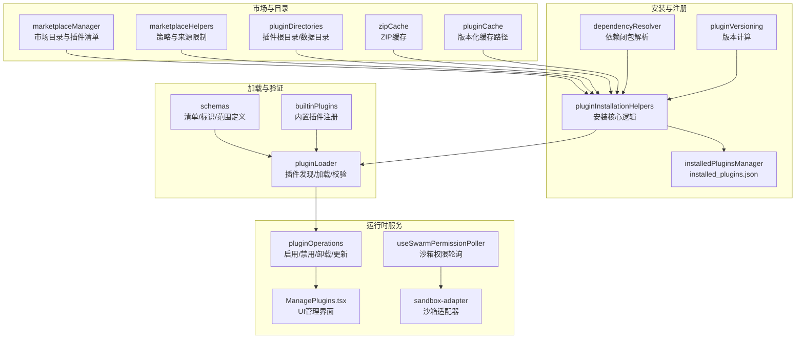
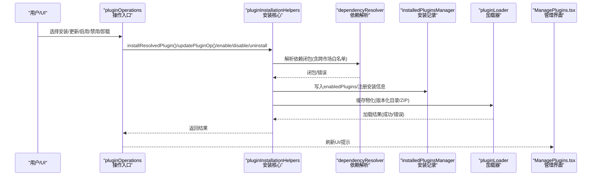
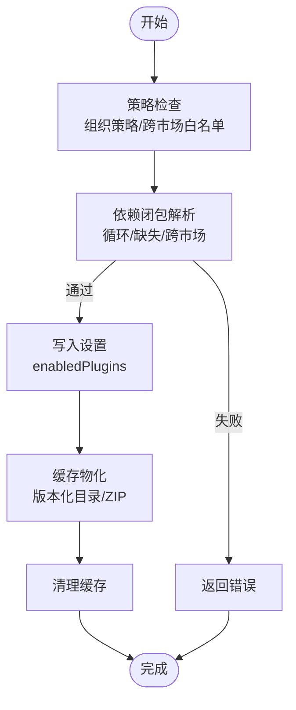
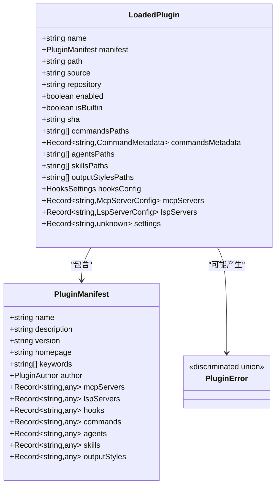
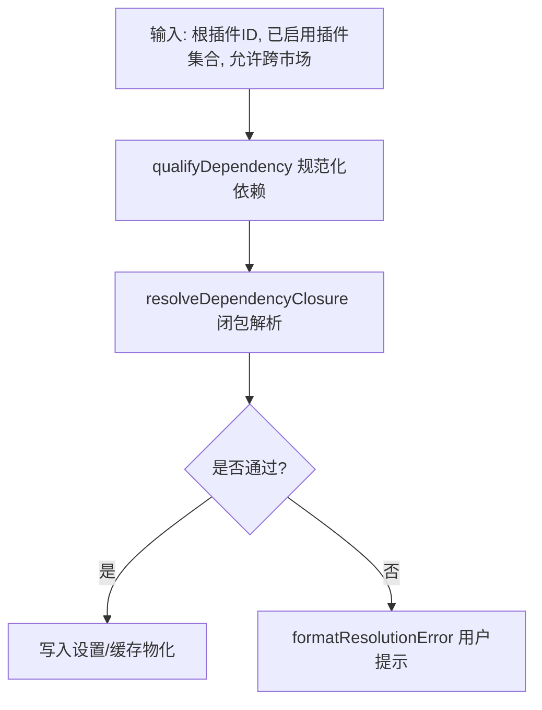
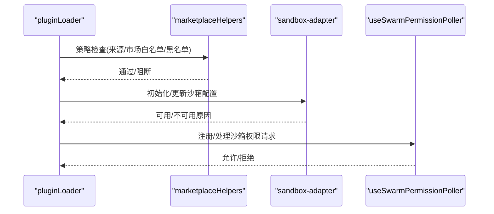
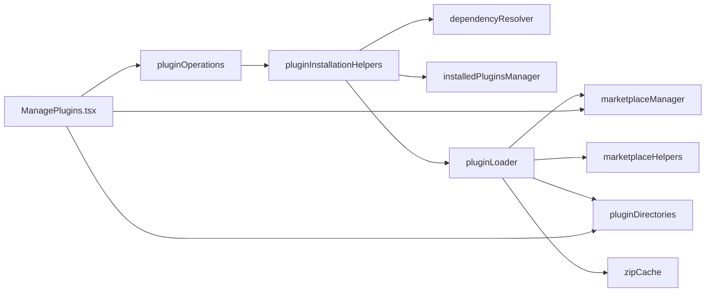

# 插件系统

<cite>
**本文引用的文件**
- [src/plugins/builtinPlugins.ts](file://src/plugins/builtinPlugins.ts)
- [src/types/plugin.ts](file://src/types/plugin.ts)
- [src/utils/plugins/pluginLoader.ts](file://src/utils/plugins/pluginLoader.ts)
- [src/utils/plugins/dependencyResolver.ts](file://src/utils/plugins/dependencyResolver.ts)
- [src/utils/plugins/pluginInstallationHelpers.ts](file://src/utils/plugins/pluginInstallationHelpers.ts)
- [src/utils/plugins/installedPluginsManager.ts](file://src/utils/plugins/installedPluginsManager.ts)
- [src/services/plugins/pluginOperations.ts](file://src/services/plugins/pluginOperations.ts)
- [src/commands/plugin/ManagePlugins.tsx](file://src/commands/plugin/ManagePlugins.tsx)
- [src/utils/plugins/marketplaceManager.ts](file://src/utils/plugins/marketplaceManager.ts)
- [src/utils/plugins/marketplaceHelpers.ts](file://src/utils/plugins/marketplaceHelpers.ts)
- [src/utils/sandbox/sandbox-adapter.ts](file://src/utils/sandbox/sandbox-adapter.ts)
- [src/hooks/useSwarmPermissionPoller.ts](file://src/hooks/useSwarmPermissionPoller.ts)
- [src/utils/sandbox/sandbox-ui-utils.ts](file://src/utils/sandbox/sandbox-ui-utils.ts)
- [src/cli/handlers/plugins.ts](file://src/cli/handlers/plugins.ts)
- [src/utils/plugins/pluginVersioning.ts](file://src/utils/plugins/pluginVersioning.ts)
- [src/utils/plugins/zipCache.ts](file://src/utils/plugins/zipCache.ts)
- [src/utils/plugins/pluginDirectories.ts](file://src/utils/plugins/pluginDirectories.ts)
- [src/utils/plugins/pluginOptionsStorage.ts](file://src/utils/plugins/pluginOptionsStorage.ts)
- [src/utils/plugins/pluginPolicy.ts](file://src/utils/plugins/pluginPolicy.ts)
- [src/utils/plugins/pluginFlagging.ts](file://src/utils/plugins/pluginFlagging.ts)
- [src/utils/plugins/pluginIdentifier.ts](file://src/utils/plugins/pluginIdentifier.ts)
- [src/utils/plugins/cacheUtils.ts](file://src/utils/plugins/cacheUtils.ts)
- [src/utils/plugins/mcpbHandler.ts](file://src/utils/plugins/mcpbHandler.ts)
- [src/services/mcp/MCPConnectionManager.ts](file://src/services/mcp/MCPConnectionManager.ts)
- [src/components/mcp/types.ts](file://src/components/mcp/types.ts)
- [src/utils/plugins/fetchTelemetry.ts](file://src/utils/plugins/fetchTelemetry.ts)
- [src/utils/plugins/gitAvailability.ts](file://src/utils/plugins/gitAvailability.ts)
- [src/utils/execFileNoThrow.ts](file://src/utils/execFileNoThrow.ts)
- [src/utils/file.ts](file://src/utils/file.ts)
- [src/utils/fsOperations.ts](file://src/utils/fsOperations.ts)
- [src/utils/errors.ts](file://src/utils/errors.ts)
- [src/utils/log.ts](file://src/utils/log.ts)
- [src/utils/debug.ts](file://src/utils/debug.ts)
- [src/utils/settings/settings.ts](file://src/utils/settings/settings.ts)
- [src/utils/settings/types.ts](file://src/utils/settings/types.ts)
- [src/utils/plugins/schemas.ts](file://src/utils/plugins/schemas.ts)
- [src/bootstrap/state.ts](file://src/bootstrap/state.ts)
- [src/utils/plugins/pluginStartupCheck.ts](file://src/utils/plugins/pluginStartupCheck.ts)
- [src/utils/plugins/pluginLoader.ts](file://src/utils/plugins/pluginLoader.ts)
- [src/utils/plugins/pluginLoader.ts](file://src/utils/plugins/pluginLoader.ts)
- [src/utils/plugins/pluginLoader.ts](file://src/utils/plugins/pluginLoader.ts)
</cite>

## 目录
1. [简介](#简介)
2. [项目结构](#项目结构)
3. [核心组件](#核心组件)
4. [架构总览](#架构总览)
5. [详细组件分析](#详细组件分析)
6. [依赖关系分析](#依赖关系分析)
7. [性能考量](#性能考量)
8. [故障排除指南](#故障排除指南)
9. [结论](#结论)
10. [附录](#附录)

## 简介
本文件面向Claude Code插件系统，系统化阐述其架构设计、核心功能与实现细节，覆盖插件安装、卸载、更新、启用/禁用、依赖解析、版本兼容性检查、加载机制、插件API规范、插件间通信与资源共享、安全策略与沙箱隔离、权限控制、开发调试与性能优化、最佳实践与故障排除等内容。目标是帮助开发者与运维人员快速理解并高效使用该插件体系。

## 项目结构
插件系统围绕“市场目录—安装注册—加载验证—运行时服务”四层展开，关键模块如下：
- 市场与目录：市场配置、插件清单、种子缓存、ZIP缓存、插件目录与数据目录
- 安装与注册：安装流程、依赖解析、版本计算、安装记录写入
- 加载与验证：插件发现、清单校验、重复检测、错误收集、钩子变量解析
- 运行时服务：内置插件注册、MCP/LSP/Hook/技能/命令等组件加载与暴露

图表来源
- [src/utils/plugins/marketplaceManager.ts](file://src/utils/plugins/marketplaceManager.ts)
- [src/utils/plugins/marketplaceHelpers.ts](file://src/utils/plugins/marketplaceHelpers.ts)
- [src/utils/plugins/pluginDirectories.ts](file://src/utils/plugins/pluginDirectories.ts)
- [src/utils/plugins/zipCache.ts](file://src/utils/plugins/zipCache.ts)
- [src/utils/plugins/pluginInstallationHelpers.ts](file://src/utils/plugins/pluginInstallationHelpers.ts)
- [src/utils/plugins/installedPluginsManager.ts](file://src/utils/plugins/installedPluginsManager.ts)
- [src/utils/plugins/dependencyResolver.ts](file://src/utils/plugins/dependencyResolver.ts)
- [src/utils/plugins/pluginVersioning.ts](file://src/utils/plugins/pluginVersioning.ts)
- [src/utils/plugins/pluginLoader.ts](file://src/utils/plugins/pluginLoader.ts)
- [src/utils/plugins/schemas.ts](file://src/utils/plugins/schemas.ts)
- [src/plugins/builtinPlugins.ts](file://src/plugins/builtinPlugins.ts)
- [src/services/plugins/pluginOperations.ts](file://src/services/plugins/pluginOperations.ts)
- [src/commands/plugin/ManagePlugins.tsx](file://src/commands/plugin/ManagePlugins.tsx)
- [src/hooks/useSwarmPermissionPoller.ts](file://src/hooks/useSwarmPermissionPoller.ts)
- [src/utils/sandbox/sandbox-adapter.ts](file://src/utils/sandbox/sandbox-adapter.ts)

章节来源
- [src/utils/plugins/marketplaceManager.ts](file://src/utils/plugins/marketplaceManager.ts)
- [src/utils/plugins/pluginInstallationHelpers.ts](file://src/utils/plugins/pluginInstallationHelpers.ts)
- [src/utils/plugins/pluginLoader.ts](file://src/utils/plugins/pluginLoader.ts)
- [src/plugins/builtinPlugins.ts](file://src/plugins/builtinPlugins.ts)

## 核心组件
- 插件类型与清单
  - LoadedPlugin：已加载插件的统一描述，包含清单、路径、来源、仓库、启用状态、组件路径、设置等
  - PluginError：类型安全的错误类型集合，覆盖路径/网络/Git/清单/市场/MCP/LSP/钩子/依赖等错误
  - 类型导出与工具函数：getPluginErrorMessage用于统一错误消息格式
- 内置插件注册
  - 注册表、可用性判断、默认启用状态、按用户设置拆分启用/禁用列表
  - 将内置插件能力映射为命令对象，供技能工具使用
- 插件加载器
  - 发现来源（市场/内联）、清单校验、钩子变量解析、重复名检测、错误收集
  - 版本化缓存路径、种子缓存探测、ZIP缓存、复制/移动到版本化目录
  - 支持从Git/Git子目录/NPM/本地源安装
- 依赖解析
  - 依赖闭包解析（循环检测、跨市场依赖阻断、缺失依赖）
  - 加载时固定点校验与降级（demote），避免未满足依赖导致的会话异常
- 安装与注册
  - 安装核心：策略检查、依赖闭包、设置写入、缓存物化、清理缓存
  - 注册：写入installed_plugins.json（V1/V2），支持多作用域（用户/项目/本地/托管/内置）
- 运行时操作
  - 启用/禁用/卸载/更新，支持非就地更新（新版本目录+内存重启生效）
  - 卸载时处理持久化数据清理与孤儿版本标记
- UI管理
  - 插件列表、详情、失败插件、MCP服务器、选项配置、本地插件不可远程更新提示
  - 配置MCPB文件、保存用户配置、触发重载生效

章节来源
- [src/types/plugin.ts](file://src/types/plugin.ts)
- [src/plugins/builtinPlugins.ts](file://src/plugins/builtinPlugins.ts)
- [src/utils/plugins/pluginLoader.ts](file://src/utils/plugins/pluginLoader.ts)
- [src/utils/plugins/dependencyResolver.ts](file://src/utils/plugins/dependencyResolver.ts)
- [src/utils/plugins/pluginInstallationHelpers.ts](file://src/utils/plugins/pluginInstallationHelpers.ts)
- [src/utils/plugins/installedPluginsManager.ts](file://src/utils/plugins/installedPluginsManager.ts)
- [src/services/plugins/pluginOperations.ts](file://src/services/plugins/pluginOperations.ts)
- [src/commands/plugin/ManagePlugins.tsx](file://src/commands/plugin/ManagePlugins.tsx)

## 架构总览
下图展示从“安装/更新/启用/禁用/卸载”到“加载/验证/运行”的端到端流程，以及与市场、策略、沙箱、MCP/LSP/Hook/技能/命令等子系统的交互。

图表来源
- [src/services/plugins/pluginOperations.ts](file://src/services/plugins/pluginOperations.ts)
- [src/utils/plugins/pluginInstallationHelpers.ts](file://src/utils/plugins/pluginInstallationHelpers.ts)
- [src/utils/plugins/dependencyResolver.ts](file://src/utils/plugins/dependencyResolver.ts)
- [src/utils/plugins/installedPluginsManager.ts](file://src/utils/plugins/installedPluginsManager.ts)
- [src/utils/plugins/pluginLoader.ts](file://src/utils/plugins/pluginLoader.ts)
- [src/commands/plugin/ManagePlugins.tsx](file://src/commands/plugin/ManagePlugins.tsx)

## 详细组件分析

### 组件A：插件安装与更新流程
- 安装
  - 策略检查（组织策略阻断、跨市场依赖白名单）
  - 依赖闭包解析（循环/缺失/跨市场阻断）
  - 设置一次性写入enabledPlugins
  - 缓存物化（版本化目录/ZIP），注册安装信息
  - 清理缓存，返回用户提示
- 更新
  - 非就地更新：下载/复制到新版本目录，更新installed_plugins.json（内存不变，需重启生效）
  - 处理最后作用域移除后的孤儿版本标记与数据清理
- 卸载
  - 按作用域删除安装记录，若为最后作用域则清理持久化数据与配置
  - 提示反向依赖影响（加载时verifyAndDemote捕获）

图表来源
- [src/utils/plugins/pluginInstallationHelpers.ts](file://src/utils/plugins/pluginInstallationHelpers.ts)
- [src/utils/plugins/dependencyResolver.ts](file://src/utils/plugins/dependencyResolver.ts)
- [src/utils/plugins/installedPluginsManager.ts](file://src/utils/plugins/installedPluginsManager.ts)
- [src/utils/plugins/zipCache.ts](file://src/utils/plugins/zipCache.ts)
- [src/utils/plugins/pluginDirectories.ts](file://src/utils/plugins/pluginDirectories.ts)
- [src/services/plugins/pluginOperations.ts](file://src/services/plugins/pluginOperations.ts)

章节来源
- [src/utils/plugins/pluginInstallationHelpers.ts](file://src/utils/plugins/pluginInstallationHelpers.ts)
- [src/services/plugins/pluginOperations.ts](file://src/services/plugins/pluginOperations.ts)

### 组件B：插件加载与验证
- 发现来源
  - 市场插件（settings中带@marketplace标识）
  - 会话内联插件（--plugin-dir或SDK传入）
- 清单与组件
  - 插件清单schema校验，命令/代理/技能/Hook/MCP/LSP路径解析
  - 钩子配置加载与变量解析，重复名称检测
- 错误收集
  - 统一的PluginError类型，getPluginErrorMessage格式化显示
- 路径与缓存
  - 版本化缓存路径、种子缓存探测、ZIP缓存、复制/移动到版本化目录
  - 兼容旧版非版本化缓存路径

图表来源
- [src/types/plugin.ts](file://src/types/plugin.ts)
- [src/utils/plugins/pluginLoader.ts](file://src/utils/plugins/pluginLoader.ts)

章节来源
- [src/utils/plugins/pluginLoader.ts](file://src/utils/plugins/pluginLoader.ts)
- [src/types/plugin.ts](file://src/types/plugin.ts)

### 组件C：依赖解析与版本兼容性
- 依赖解析
  - qualifyDependency：规范化依赖引用（继承声明插件的市场后缀）
  - resolveDependencyClosure：DFS遍历，检测循环、缺失、跨市场依赖阻断
  - verifyAndDemote：加载时固定点检查，降级未满足依赖（不写设置）
- 版本兼容性
  - calculatePluginVersion：基于源/清单/Git提交/显式版本计算
  - 版本化缓存路径与种子缓存探测，确保首次启动时能命中已有版本

图表来源
- [src/utils/plugins/dependencyResolver.ts](file://src/utils/plugins/dependencyResolver.ts)
- [src/utils/plugins/pluginInstallationHelpers.ts](file://src/utils/plugins/pluginInstallationHelpers.ts)
- [src/utils/plugins/pluginVersioning.ts](file://src/utils/plugins/pluginVersioning.ts)

章节来源
- [src/utils/plugins/dependencyResolver.ts](file://src/utils/plugins/dependencyResolver.ts)
- [src/utils/plugins/pluginVersioning.ts](file://src/utils/plugins/pluginVersioning.ts)

### 组件D：插件API规范与资源
- 插件API规范
  - 插件清单字段：name/description/version/keywords/author等
  - 组件声明：commands/agents/skills/hooks/mcpServers/lspServers/outputStyles
  - 资源路径：commandsPath/agentsPath/skillsPath/outputStylesPaths等
- 资源共享与暴露
  - 内置插件注册为LoadedPlugin，映射为命令对象供技能工具使用
  - 加载器读取各组件路径，构建可调用能力
- MCP/LSP/Hook/技能/命令
  - MCP服务器配置与连接管理
  - LSP服务器配置与生命周期
  - Hook配置与事件钩子
  - 技能与命令的元数据与执行

章节来源
- [src/types/plugin.ts](file://src/types/plugin.ts)
- [src/plugins/builtinPlugins.ts](file://src/plugins/builtinPlugins.ts)
- [src/utils/plugins/pluginLoader.ts](file://src/utils/plugins/pluginLoader.ts)
- [src/services/mcp/MCPConnectionManager.ts](file://src/services/mcp/MCPConnectionManager.ts)
- [src/components/mcp/types.ts](file://src/components/mcp/types.ts)

### 组件E：安全策略、沙箱隔离与权限控制
- 策略与来源限制
  - getStrictKnownMarketplaces/getBlockedMarketplaces：严格已知市场/黑名单
  - isSourceAllowedByPolicy/isSourceInBlocklist：来源允许/阻断判断
  - getPluginByIdCacheOnly：缓存读取，避免启动阻塞
- 沙箱与权限
  - sandbox-adapter：平台支持、依赖检查、配置动态刷新、网络初始化等待
  - useSwarmPermissionPoller：沙箱权限请求回调注册与响应处理
  - sandbox-ui-utils：沙箱违规标签清理
- 权限与合规
  - 企业策略阻止安装/依赖安装
  - 插件标记与告警（flaggedPlugins）

图表来源
- [src/utils/plugins/pluginLoader.ts](file://src/utils/plugins/pluginLoader.ts)
- [src/utils/plugins/marketplaceHelpers.ts](file://src/utils/plugins/marketplaceHelpers.ts)
- [src/utils/sandbox/sandbox-adapter.ts](file://src/utils/sandbox/sandbox-adapter.ts)
- [src/hooks/useSwarmPermissionPoller.ts](file://src/hooks/useSwarmPermissionPoller.ts)
- [src/utils/sandbox/sandbox-ui-utils.ts](file://src/utils/sandbox/sandbox-ui-utils.ts)

章节来源
- [src/utils/plugins/marketplaceHelpers.ts](file://src/utils/plugins/marketplaceHelpers.ts)
- [src/utils/sandbox/sandbox-adapter.ts](file://src/utils/sandbox/sandbox-adapter.ts)
- [src/hooks/useSwarmPermissionPoller.ts](file://src/hooks/useSwarmPermissionPoller.ts)
- [src/utils/sandbox/sandbox-ui-utils.ts](file://src/utils/sandbox/sandbox-ui-utils.ts)

### 组件F：插件间通信与资源共享
- MCP服务器
  - 插件可声明多个MCP服务器，UI中可查看/切换启用状态
  - 通过MCPConnectionManager进行连接/断开/认证
- 资源共享
  - 插件选项存储与加载（用户配置）
  - 数据目录清理与持久化数据管理
- UI集成
  - ManagePlugins.tsx聚合插件、MCP、失败插件、标记插件，支持搜索、配置、MCP详情/工具

章节来源
- [src/commands/plugin/ManagePlugins.tsx](file://src/commands/plugin/ManagePlugins.tsx)
- [src/utils/plugins/pluginOptionsStorage.ts](file://src/utils/plugins/pluginOptionsStorage.ts)
- [src/utils/plugins/pluginDirectories.ts](file://src/utils/plugins/pluginDirectories.ts)
- [src/services/mcp/MCPConnectionManager.ts](file://src/services/mcp/MCPConnectionManager.ts)

## 依赖关系分析
- 组件耦合
  - pluginOperations依赖pluginInstallationHelpers/dependencyResolver/installedPluginsManager/pluginLoader
  - pluginLoader依赖marketplaceManager/marketplaceHelpers/pluginDirectories/zipCache/schemas/builtinPlugins
  - UI ManagePlugins依赖pluginOperations/marketplaceManager/pluginDirectories/pluginOptionsStorage
- 外部依赖
  - Git/NPM/FS/网络访问（通过execFileNoThrow、fsOperations、errors等封装）
  - Telemetry/Fetch分类统计（fetchTelemetry）
- 循环依赖
  - 通过模块边界与接口（如getPluginByIdCacheOnly）避免直接循环

图表来源
- [src/services/plugins/pluginOperations.ts](file://src/services/plugins/pluginOperations.ts)
- [src/utils/plugins/pluginInstallationHelpers.ts](file://src/utils/plugins/pluginInstallationHelpers.ts)
- [src/utils/plugins/dependencyResolver.ts](file://src/utils/plugins/dependencyResolver.ts)
- [src/utils/plugins/installedPluginsManager.ts](file://src/utils/plugins/installedPluginsManager.ts)
- [src/utils/plugins/pluginLoader.ts](file://src/utils/plugins/pluginLoader.ts)
- [src/utils/plugins/marketplaceManager.ts](file://src/utils/plugins/marketplaceManager.ts)
- [src/utils/plugins/marketplaceHelpers.ts](file://src/utils/plugins/marketplaceHelpers.ts)
- [src/utils/plugins/pluginDirectories.ts](file://src/utils/plugins/pluginDirectories.ts)
- [src/utils/plugins/zipCache.ts](file://src/utils/plugins/zipCache.ts)
- [src/commands/plugin/ManagePlugins.tsx](file://src/commands/plugin/ManagePlugins.tsx)

章节来源
- [src/services/plugins/pluginOperations.ts](file://src/services/plugins/pluginOperations.ts)
- [src/utils/plugins/pluginLoader.ts](file://src/utils/plugins/pluginLoader.ts)
- [src/commands/plugin/ManagePlugins.tsx](file://src/commands/plugin/ManagePlugins.tsx)

## 性能考量
- 缓存与I/O
  - 版本化缓存与ZIP缓存减少重复下载与解压
  - 种子缓存优先命中，避免网络拉取
  - 复制/移动采用同文件系统优化，必要时临时目录过渡
- 依赖解析
  - 闭包解析在安装阶段完成，运行时仅做固定点校验
  - 依赖查找缓存（depInfo）避免重复网络查询
- 启动与加载
  - marketplace缓存只读读取，避免启动阻塞
  - 依赖git可用性检查与浅克隆/稀疏检出降低网络与磁盘占用
- UI与交互
  - 分页与搜索过滤，避免一次性渲染大量项
  - MCP状态与错误聚合，减少重复查询

[本节为通用指导，无需特定文件引用]

## 故障排除指南
- 常见错误类型
  - 路径不存在、Git认证失败/超时、网络错误、清单解析/校验失败、市场不存在/加载失败、MCP/LSP配置无效/启动失败/崩溃/超时、钩子加载失败、组件加载失败、依赖未满足、插件缓存缺失、策略阻断
- 错误格式化
  - getPluginErrorMessage统一输出人类可读消息，便于日志与UI展示
- 定位与修复
  - 使用CLI插件状态输出（plugins命令）查看加载错误与MCP服务器状态
  - 检查installed_plugins.json与版本化缓存目录
  - 查看策略限制（严格已知市场/黑名单）与来源合法性
  - 沙箱相关问题：确认平台支持、依赖检查、网络初始化、权限轮询回调
- 数据清理
  - 卸载最后作用域时清理持久化数据目录与配置
  - 删除孤儿版本标记，释放磁盘空间

章节来源
- [src/types/plugin.ts](file://src/types/plugin.ts)
- [src/cli/handlers/plugins.ts](file://src/cli/handlers/plugins.ts)
- [src/utils/plugins/installedPluginsManager.ts](file://src/utils/plugins/installedPluginsManager.ts)
- [src/utils/plugins/marketplaceHelpers.ts](file://src/utils/plugins/marketplaceHelpers.ts)
- [src/utils/sandbox/sandbox-adapter.ts](file://src/utils/sandbox/sandbox-adapter.ts)
- [src/hooks/useSwarmPermissionPoller.ts](file://src/hooks/useSwarmPermissionPoller.ts)

## 结论
Claude Code插件系统以“市场驱动+版本化缓存+依赖闭包解析+策略与沙箱双保险”为核心设计，实现了从安装到运行的全链路可观测与可控。通过类型安全的错误模型、清晰的组件边界与丰富的运行时服务，系统在保证安全性的同时提供了强大的扩展能力。建议在开发与集成过程中遵循依赖最小化、版本明确化、策略前置化与沙箱优先化的最佳实践。

[本节为总结，无需特定文件引用]

## 附录
- 开发与调试
  - 使用/插件命令查看状态与错误
  - /reload-plugins应用变更
  - 查看installed_plugins.json与版本化缓存目录
  - 关注fetchTelemetry与日志输出
- 性能优化建议
  - 启用ZIP缓存与种子缓存
  - 控制插件数量与组件规模
  - 合理使用依赖闭包，避免不必要的跨市场依赖
- 最佳实践
  - 明确插件版本与来源，优先使用官方市场
  - 在企业环境中预先配置严格已知市场与黑名单
  - 对涉及文件系统/网络/进程的插件开启沙箱
  - 使用MCPB配置文件进行参数化与审计

[本节为通用指导，无需特定文件引用]