# 服务层架构

<cite>
**本文档引用的文件**
- [src/main.tsx](file://src/main.tsx)
- [src/bootstrap/state.ts](file://src/bootstrap/state.ts)
- [src/services/api/bootstrap.ts](file://src/services/api/bootstrap.ts)
- [src/services/mcp/client.ts](file://src/services/mcp/client.ts)
- [src/services/mcp/config.ts](file://src/services/mcp/config.ts)
- [src/services/lsp/manager.ts](file://src/services/lsp/manager.ts)
- [src/services/analytics/index.ts](file://src/services/analytics/index.ts)
- [src/utils/plugins/pluginLoader.ts](file://src/utils/plugins/pluginLoader.ts)
- [src/services/policyLimits/index.ts](file://src/services/policyLimits/index.ts)
- [src/services/remoteManagedSettings/index.ts](file://src/services/remoteManagedSettings/index.ts)
- [src/services/api/filesApi.ts](file://src/services/api/filesApi.ts)
</cite>

## 目录
1. [引言](#引言)
2. [项目结构](#项目结构)
3. [核心组件](#核心组件)
4. [架构总览](#架构总览)
5. [详细组件分析](#详细组件分析)
6. [依赖分析](#依赖分析)
7. [性能考虑](#性能考虑)
8. [故障排除指南](#故障排除指南)
9. [结论](#结论)
10. [附录](#附录)

## 引言
本文件系统性阐述 Claude Code 的服务层架构，聚焦于服务层的设计原则、职责划分与交互机制。服务层围绕以下核心能力展开：Claude API 客户端与引导数据、遥测分析、MCP 连接管理、插件加载与版本化缓存、企业策略限制与远程托管设置、文件传输 API、以及 LSP 服务器管理。文档同时覆盖服务间通信、生命周期管理、错误处理策略、扩展机制与插件集成方式，并给出配置与环境适配的实现细节及最佳实践。

## 项目结构
服务层代码主要分布在 `src/services` 与 `src/utils` 目录中，采用按功能域分层组织：
- 服务域：API 客户端（bootstrap、files）、遥测（analytics）、MCP 管理（client、config）、策略限制（policyLimits）、远程托管设置（remoteManagedSettings）、LSP 管理（lsp/manager）
- 工具域：插件加载与缓存（utils/plugins/pluginLoader）、通用工具（auth、http、settings、errors 等）

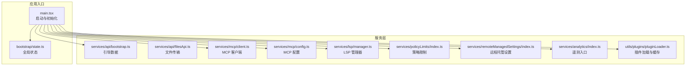

**图表来源**
- [src/main.tsx:1-800](file://src/main.tsx#L1-L800)
- [src/bootstrap/state.ts:1-800](file://src/bootstrap/state.ts#L1-L800)
- [src/services/api/bootstrap.ts:1-142](file://src/services/api/bootstrap.ts#L1-L142)
- [src/services/mcp/client.ts:1-800](file://src/services/mcp/client.ts#L1-L800)
- [src/services/mcp/config.ts:1-800](file://src/services/mcp/config.ts#L1-L800)
- [src/services/lsp/manager.ts:1-290](file://src/services/lsp/manager.ts#L1-L290)
- [src/services/policyLimits/index.ts:1-664](file://src/services/policyLimits/index.ts#L1-L664)
- [src/services/remoteManagedSettings/index.ts:1-639](file://src/services/remoteManagedSettings/index.ts#L1-L639)
- [src/services/analytics/index.ts:1-174](file://src/services/analytics/index.ts#L1-L174)
- [src/utils/plugins/pluginLoader.ts:1-800](file://src/utils/plugins/pluginLoader.ts#L1-L800)

**章节来源**
- [src/main.tsx:1-800](file://src/main.tsx#L1-L800)
- [src/bootstrap/state.ts:1-800](file://src/bootstrap/state.ts#L1-L800)

## 核心组件
- 全局状态管理：通过会话级状态对象集中管理会话标识、计数器、指标、日志器与提供者等，确保服务间共享一致的状态视图。
- API 引导数据：从 Claude API 拉取客户端数据与附加模型选项，支持缓存与校验，避免重复网络请求。
- 文件传输 API：提供下载/上传文件的能力，支持并发限流、指数退避重试与路径安全校验。
- MCP 客户端与配置：统一管理 MCP 服务器连接（SSE/WebSocket/HTTP/stdio），认证与授权失败处理，连接缓存与去重策略。
- 遥测分析：事件队列与后端接入点，支持延迟绑定与采样控制，保证非阻塞与隐私合规。
- 插件加载与缓存：支持多源插件发现、版本化缓存、种子缓存命中、ZIP 缓存、依赖解析与安全检查。
- 企业策略限制与远程托管设置：基于 ETag 的缓存与轮询，失败开路策略，安全变更检测与热更新。
- LSP 管理器：异步初始化、连接健康检查、被动通知注册与优雅关闭。

**章节来源**
- [src/bootstrap/state.ts:45-257](file://src/bootstrap/state.ts#L45-L257)
- [src/services/api/bootstrap.ts:114-142](file://src/services/api/bootstrap.ts#L114-L142)
- [src/services/api/filesApi.ts:1-749](file://src/services/api/filesApi.ts#L1-L749)
- [src/services/mcp/client.ts:1-800](file://src/services/mcp/client.ts#L1-L800)
- [src/services/mcp/config.ts:1-800](file://src/services/mcp/config.ts#L1-L800)
- [src/services/analytics/index.ts:1-174](file://src/services/analytics/index.ts#L1-L174)
- [src/utils/plugins/pluginLoader.ts:1-800](file://src/utils/plugins/pluginLoader.ts#L1-L800)
- [src/services/policyLimits/index.ts:1-664](file://src/services/policyLimits/index.ts#L1-L664)
- [src/services/remoteManagedSettings/index.ts:1-639](file://src/services/remoteManagedSettings/index.ts#L1-L639)
- [src/services/lsp/manager.ts:1-290](file://src/services/lsp/manager.ts#L1-L290)

## 架构总览
服务层采用“入口驱动 + 服务解耦 + 状态共享”的架构模式：
- 入口模块负责早期设置、预取与延迟初始化，确保关键路径最小化阻塞。
- 服务模块以职责单一为原则，通过公共接口暴露能力，避免循环依赖。
- 全局状态模块提供跨服务共享的数据与元数据，确保一致性与可观测性。
- 遥测与分析服务作为横切关注点，贯穿各服务，提供事件收集与路由。

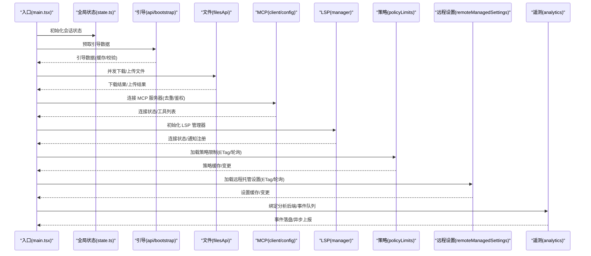

**图表来源**
- [src/main.tsx:585-800](file://src/main.tsx#L585-L800)
- [src/services/api/bootstrap.ts:114-142](file://src/services/api/bootstrap.ts#L114-L142)
- [src/services/api/filesApi.ts:317-345](file://src/services/api/filesApi.ts#L317-L345)
- [src/services/mcp/client.ts:595-800](file://src/services/mcp/client.ts#L595-L800)
- [src/services/lsp/manager.ts:145-208](file://src/services/lsp/manager.ts#L145-L208)
- [src/services/policyLimits/index.ts:556-575](file://src/services/policyLimits/index.ts#L556-L575)
- [src/services/remoteManagedSettings/index.ts:514-555](file://src/services/remoteManagedSettings/index.ts#L514-L555)
- [src/services/analytics/index.ts:95-123](file://src/services/analytics/index.ts#L95-L123)

## 详细组件分析

### Claude API 客户端与引导数据
- 职责：从 Claude API 获取引导数据（客户端数据与附加模型选项），进行响应校验与本地缓存持久化，避免重复网络请求。
- 关键流程：
  - 权限与流量控制检查（仅在首方提供且允许非必要流量时执行）。
  - OAuth 优先策略，若无可用 OAuth 则回退到 API Key。
  - 使用带重试的请求包装器处理 401 自动刷新。
  - 响应解析与缓存写入（仅在数据变化时写盘）。
- 错误处理：记录调试信息，抛出可识别的错误类型，便于上层策略处理。

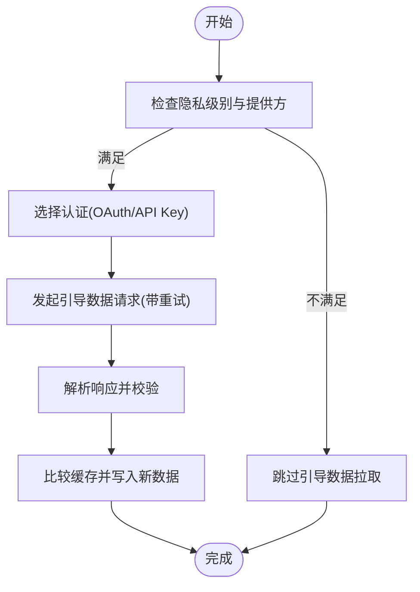

**图表来源**
- [src/services/api/bootstrap.ts:42-142](file://src/services/api/bootstrap.ts#L42-L142)

**章节来源**
- [src/services/api/bootstrap.ts:1-142](file://src/services/api/bootstrap.ts#L1-L142)

### 文件传输 API（下载/上传/列举）
- 职责：提供会话文件的下载、上传与列举能力，支持并发限流与指数退避重试。
- 关键特性：
  - 下载：单文件与批量下载，路径规范化与安全校验，超时与状态码处理。
  - 上传：文件读取、大小限制、multipart 表单构建、非可重试错误分类。
  - 列举：基于时间戳与游标分页，支持 1P/Cloud 模式。
- 性能优化：并发限流、路径缓存、错误快速失败与重试组合。

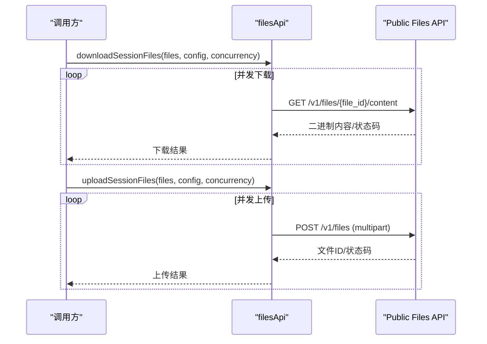

**图表来源**
- [src/services/api/filesApi.ts:317-345](file://src/services/api/filesApi.ts#L317-L345)
- [src/services/api/filesApi.ts:570-593](file://src/services/api/filesApi.ts#L570-L593)

**章节来源**
- [src/services/api/filesApi.ts:1-749](file://src/services/api/filesApi.ts#L1-L749)

### MCP 客户端与连接管理
- 职责：统一管理 MCP 服务器连接（SSE/WebSocket/HTTP/stdio），处理认证失败与会话过期，维护连接缓存与去重。
- 关键流程：
  - 连接去重：基于命令或 URL 的签名匹配，避免重复连接。
  - 认证失败处理：记录需要授权的服务器，写入临时缓存，触发用户提示。
  - 会话过期检测：识别 404 + 特定 JSON-RPC 错误码，清理连接缓存并要求重连。
  - 传输层抽象：支持 SSE、HTTP、WebSocket、STDIO、IDE 专用传输，统一超时与 Accept 头处理。
- 扩展机制：支持插件 MCP 服务器注入与签名去重，保留手动配置优先级。

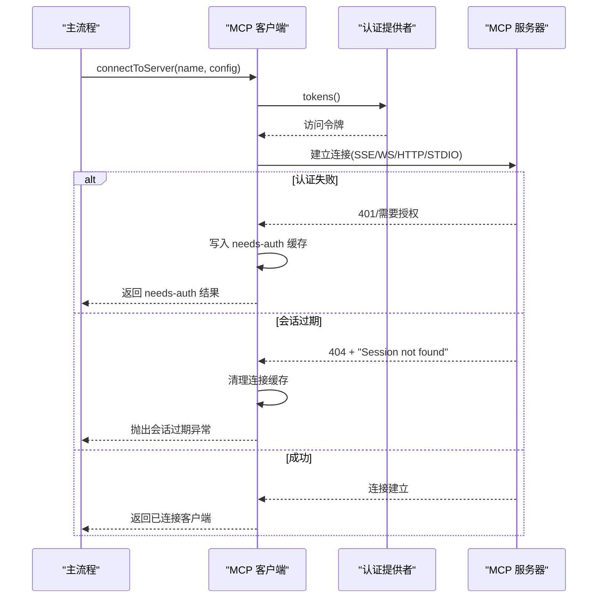

**图表来源**
- [src/services/mcp/client.ts:595-800](file://src/services/mcp/client.ts#L595-L800)
- [src/services/mcp/client.ts:193-206](file://src/services/mcp/client.ts#L193-L206)

**章节来源**
- [src/services/mcp/client.ts:1-800](file://src/services/mcp/client.ts#L1-L800)
- [src/services/mcp/config.ts:223-266](file://src/services/mcp/config.ts#L223-L266)

### MCP 配置与策略过滤
- 职责：解析与合并 MCP 配置，执行企业策略（允许/拒绝）过滤，支持环境变量展开与签名去重。
- 关键机制：
  - 策略过滤：名称、命令、URL 三类规则，支持通配符与正则转换。
  - 签名去重：基于命令数组或 URL（去除代理重写参数）生成签名，避免重复。
  - 环境变量展开：在连接前对命令、参数、头部进行变量替换。
- 安全性：保留 SDK 类型服务器豁免策略过滤，防止误伤 SDK 占位连接。

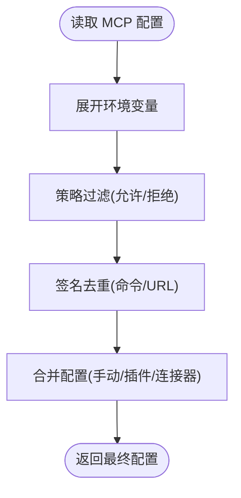

**图表来源**
- [src/services/mcp/config.ts:536-551](file://src/services/mcp/config.ts#L536-L551)
- [src/services/mcp/config.ts:223-266](file://src/services/mcp/config.ts#L223-L266)
- [src/services/mcp/config.ts:556-616](file://src/services/mcp/config.ts#L556-L616)

**章节来源**
- [src/services/mcp/config.ts:1-800](file://src/services/mcp/config.ts#L1-L800)

### 遥测分析服务
- 职责：提供事件日志的统一入口，支持事件队列、后端绑定与异步上报；通过标记类型确保元数据不含敏感信息。
- 关键设计：
  - 事件队列：在后端未就绪前暂存事件，绑定后批量投递。
  - 后端绑定：支持同步/异步事件写入，避免阻塞启动路径。
  - 采样控制：根据动态配置对事件进行采样，降低带宽与存储压力。

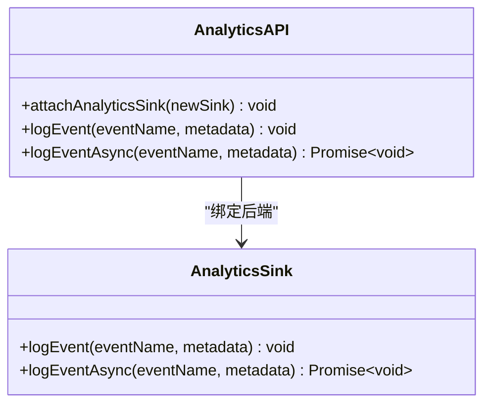

**图表来源**
- [src/services/analytics/index.ts:72-174](file://src/services/analytics/index.ts#L72-L174)

**章节来源**
- [src/services/analytics/index.ts:1-174](file://src/services/analytics/index.ts#L1-L174)

### 插件加载与缓存
- 职责：支持多源插件发现（市场、本地、种子缓存），版本化缓存与 ZIP 缓存，依赖解析与安装，错误收集与报告。
- 关键流程：
  - 缓存路径：版本化目录与种子缓存探测，兼容旧版缓存。
  - 安装：git 子目录浅克隆与稀疏检出、NPM 包缓存复用、本地目录复制。
  - 安全与合规：路径规范化与遍历防护、符号链接处理、权限与只读缓存。
- 性能优化：ZIP 缓存减少磁盘占用，种子缓存加速首次启动。

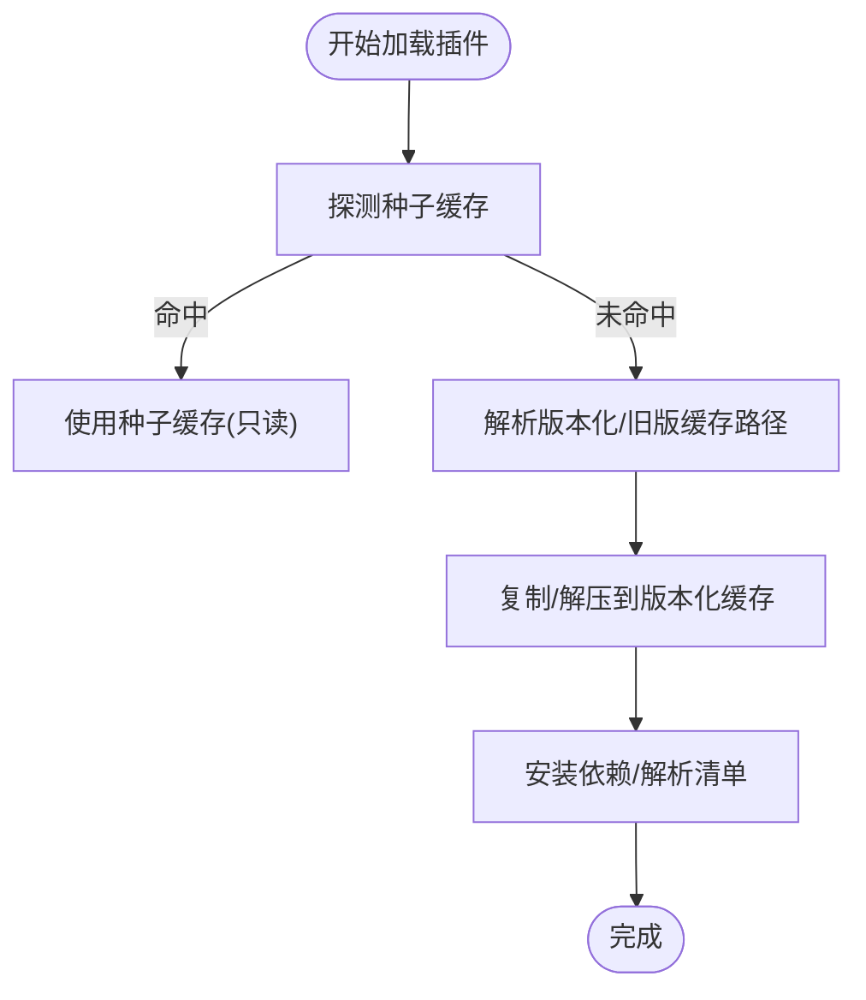

**图表来源**
- [src/utils/plugins/pluginLoader.ts:195-238](file://src/utils/plugins/pluginLoader.ts#L195-L238)
- [src/utils/plugins/pluginLoader.ts:365-465](file://src/utils/plugins/pluginLoader.ts#L365-L465)

**章节来源**
- [src/utils/plugins/pluginLoader.ts:1-800](file://src/utils/plugins/pluginLoader.ts#L1-L800)

### 企业策略限制与远程托管设置
- 职责：从 API 拉取企业策略限制与远程托管设置，基于 ETag 实现缓存与轮询，失败开路策略，变更检测与热更新。
- 关键机制：
  - 策略限制：定时轮询（1 小时），失败时使用陈旧缓存，支持“必要流量仅”模式下的例外策略。
  - 远程托管设置：安全变更检查（危险变更需用户确认），变更后触发监听器热更新。
- 生命周期：初始化时创建等待 Promise，后台轮询，优雅停止。

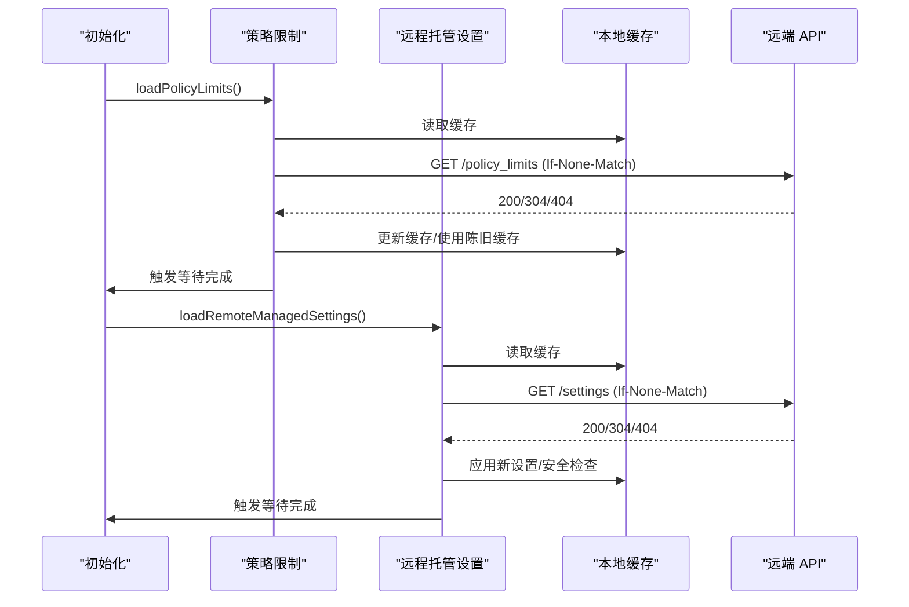

**图表来源**
- [src/services/policyLimits/index.ts:556-575](file://src/services/policyLimits/index.ts#L556-L575)
- [src/services/remoteManagedSettings/index.ts:514-555](file://src/services/remoteManagedSettings/index.ts#L514-L555)

**章节来源**
- [src/services/policyLimits/index.ts:1-664](file://src/services/policyLimits/index.ts#L1-L664)
- [src/services/remoteManagedSettings/index.ts:1-639](file://src/services/remoteManagedSettings/index.ts#L1-L639)

### LSP 服务器管理器
- 职责：异步初始化 LSP 管理器，注册被动通知处理器，支持重初始化与优雅关闭。
- 关键设计：
  - 初始化状态机：未开始/待定/成功/失败，避免竞态。
  - 生成器计数：防止陈旧初始化回调覆盖当前状态。
  - 重初始化：在插件缓存刷新后重新解析配置，确保新插件 LSP 可用。

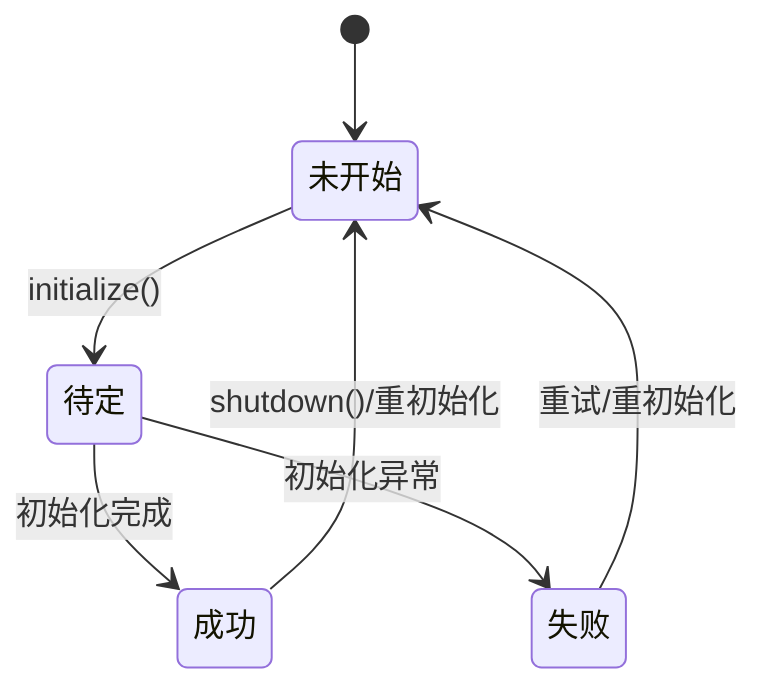

**图表来源**
- [src/services/lsp/manager.ts:14-94](file://src/services/lsp/manager.ts#L14-L94)
- [src/services/lsp/manager.ts:226-253](file://src/services/lsp/manager.ts#L226-L253)

**章节来源**
- [src/services/lsp/manager.ts:1-290](file://src/services/lsp/manager.ts#L1-L290)

## 依赖分析
- 入口依赖：入口模块依赖全局状态、分析服务、MCP 客户端、LSP 管理器、策略与远程设置等服务，形成“启动即初始化”的模式。
- 服务内聚：每个服务模块职责明确，通过公共接口交互，避免直接耦合。
- 外部依赖：axios、ws、lodash-es、zod 等库用于网络请求、传输与数据校验。
- 循环依赖规避：通过延迟导入与接口抽象降低耦合风险。

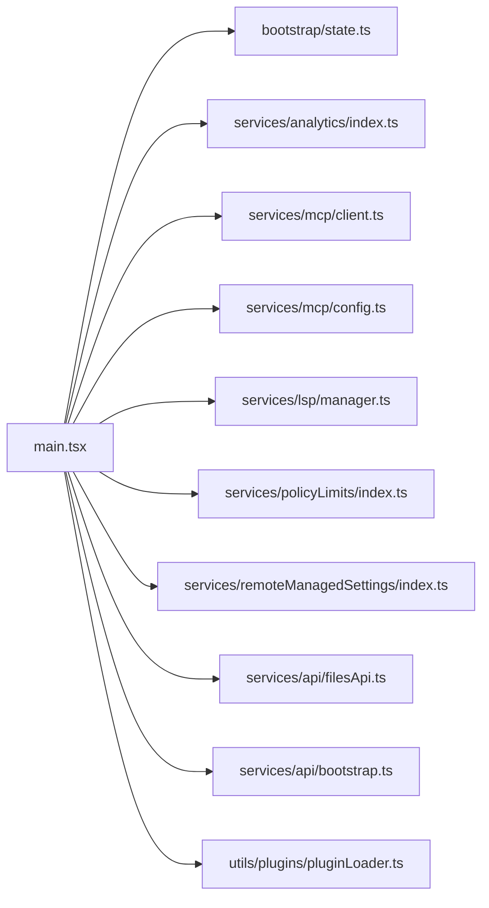

**图表来源**
- [src/main.tsx:1-800](file://src/main.tsx#L1-L800)

**章节来源**
- [src/main.tsx:1-800](file://src/main.tsx#L1-L800)

## 性能考虑
- 启动路径优化：入口模块将非关键任务延迟至首次渲染后执行，减少首屏阻塞。
- 缓存与去重：引导数据、策略限制、远程设置均采用缓存与 ETag，避免重复网络请求。
- 并发与限流：文件下载/上传采用并发限流与指数退避，提升吞吐同时降低失败率。
- 插件缓存：版本化缓存与 ZIP 缓存显著减少磁盘占用与 I/O 开销。
- LSP 管理：懒启动与被动通知注册，避免不必要的进程与连接。

## 故障排除指南
- MCP 连接失败：
  - 认证失败：检查 OAuth 令牌与服务器授权头，查看 needs-auth 缓存条目。
  - 会话过期：捕获会话过期错误，清理连接缓存并重新获取客户端。
  - 传输异常：检查代理、TLS 与超时设置，确认 Accept 头符合 MCP 规范。
- 文件传输异常：
  - 下载失败：检查文件 ID、路径规范化与权限，查看重试日志。
  - 上传失败：确认文件大小限制、认证状态与网络中断。
- 策略限制与远程设置：
  - 401/403：检查认证凭据与订阅类型，确保具备相应作用域。
  - 304/404：确认缓存有效性与 API 响应，必要时清除缓存重试。
- 插件加载问题：
  - 路径遍历：确保相对路径不越权，使用规范化函数。
  - 种子缓存：确认种子目录存在且版本化路径正确。
- LSP 连接问题：
  - 未初始化：等待初始化完成或主动调用初始化函数。
  - 服务器不可用：检查语言服务器状态与被动通知注册。

**章节来源**
- [src/services/mcp/client.ts:340-362](file://src/services/mcp/client.ts#L340-L362)
- [src/services/mcp/client.ts:193-206](file://src/services/mcp/client.ts#L193-L206)
- [src/services/api/filesApi.ts:147-180](file://src/services/api/filesApi.ts#L147-L180)
- [src/services/policyLimits/index.ts:300-386](file://src/services/policyLimits/index.ts#L300-L386)
- [src/services/remoteManagedSettings/index.ts:248-361](file://src/services/remoteManagedSettings/index.ts#L248-L361)
- [src/utils/plugins/pluginLoader.ts:195-238](file://src/utils/plugins/pluginLoader.ts#L195-L238)
- [src/services/lsp/manager.ts:145-208](file://src/services/lsp/manager.ts#L145-L208)

## 结论
Claude Code 的服务层通过清晰的职责划分与稳健的生命周期管理，实现了从 API 引导、文件传输、MCP 连接到插件加载、遥测分析与企业策略的完整能力闭环。其设计强调失败开路、缓存与轮询、并发与限流、以及安全与合规，既保证了用户体验，也兼顾了企业级部署的稳定性与可运维性。扩展方面，MCP 与插件体系提供了强大的生态集成能力，便于在不同设备与场景下实现统一的智能体体验。

## 附录
- 最佳实践：
  - 在入口阶段尽早初始化分析服务与远程设置，确保事件与策略可用。
  - 对关键网络操作使用指数退避与超时控制，避免阻塞主线程。
  - 合理使用缓存与去重策略，减少重复请求与资源浪费。
  - 在企业环境中启用策略限制与远程托管设置，结合安全检查与热更新。
- 性能优化建议：
  - 启动阶段延迟非关键任务，优先保证首屏渲染。
  - 使用并发限流与批量处理，平衡吞吐与资源消耗。
  - 启用 ZIP 缓存与种子缓存，缩短插件加载时间。
  - 对 LSP 与 MCP 连接采用懒启动与被动通知，降低常驻成本。