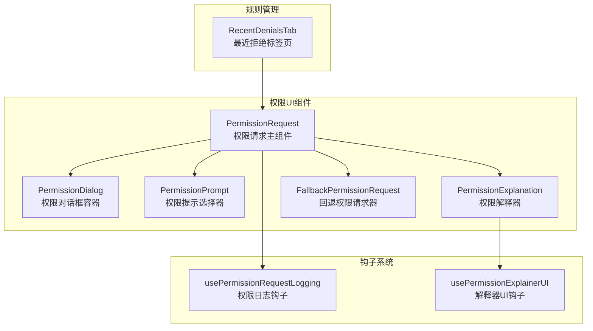
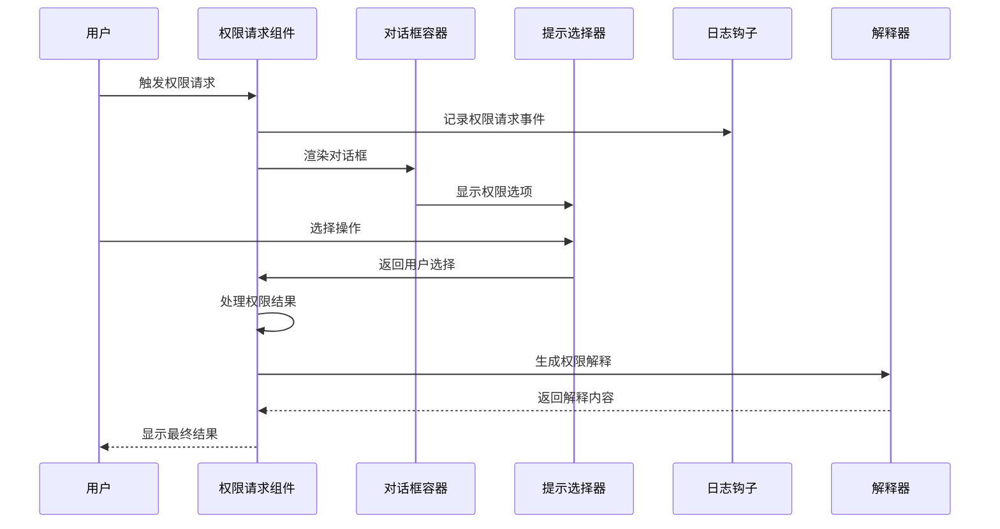
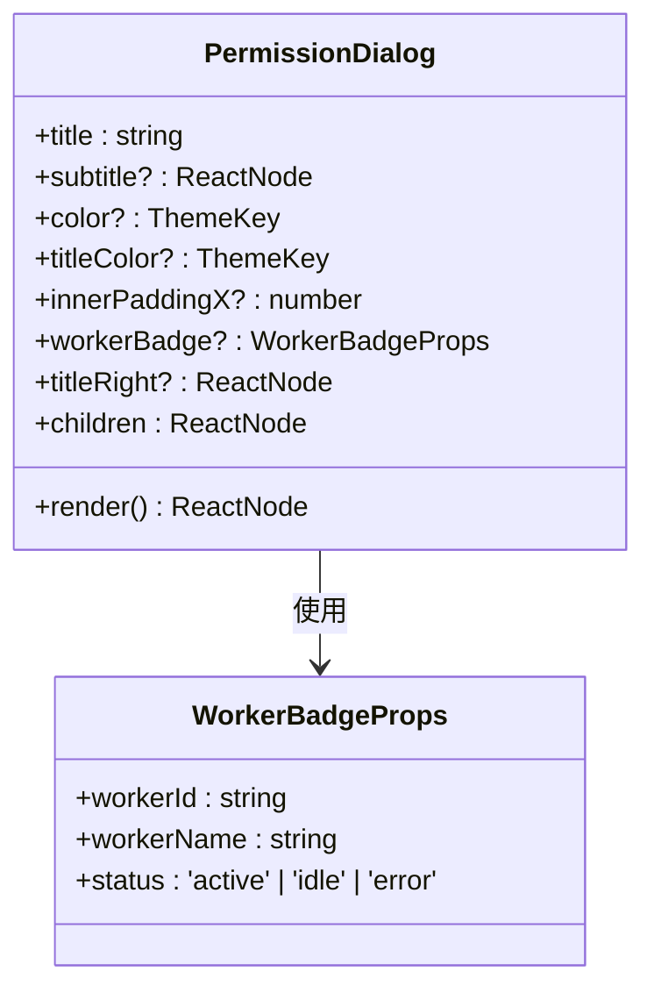
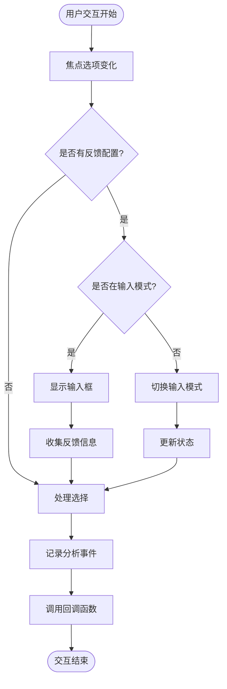
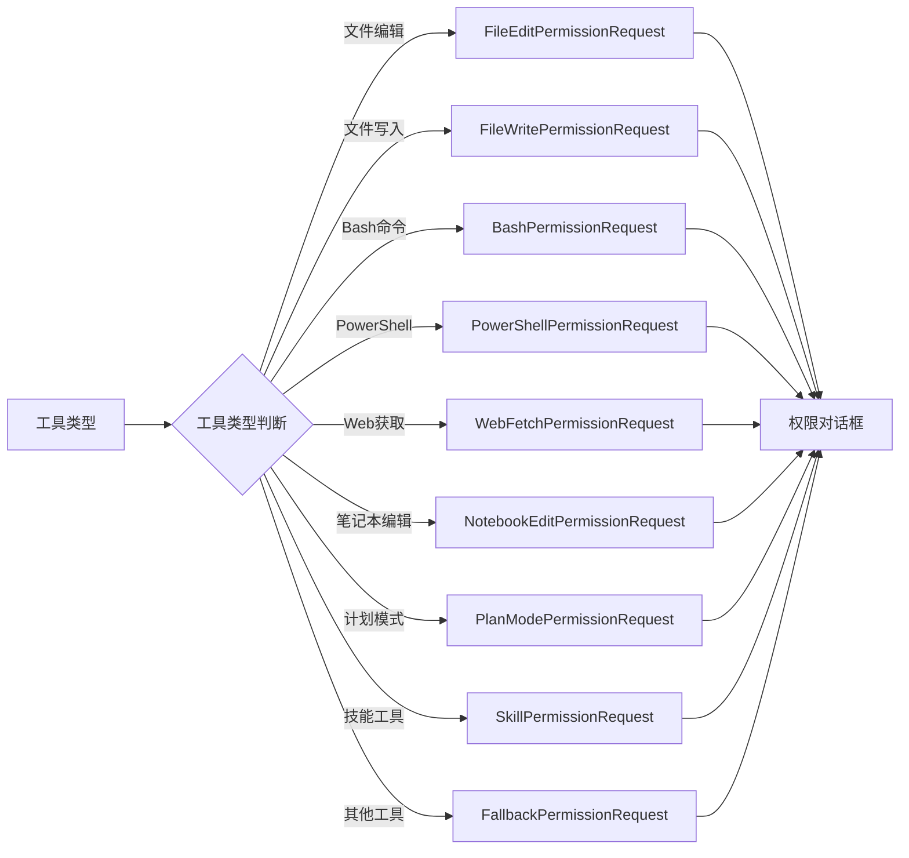
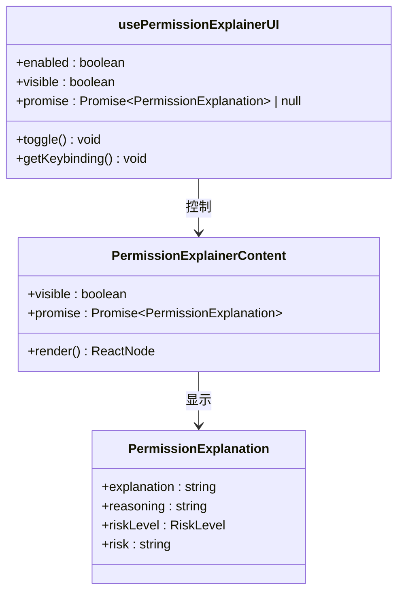
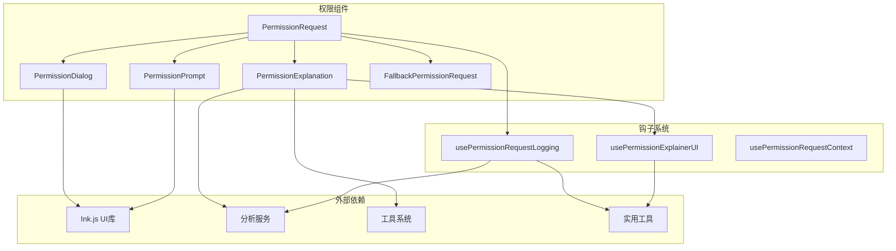

# 权限UI交互系统

<cite>
**本文档引用的文件**
- [PermissionDialog.tsx](file://src/components/permissions/PermissionDialog.tsx)
- [PermissionPrompt.tsx](file://src/components/permissions/PermissionPrompt.tsx)
- [PermissionRequest.tsx](file://src/components/permissions/PermissionRequest.tsx)
- [PermissionExplanation.tsx](file://src/components/permissions/PermissionExplanation.tsx)
- [FallbackPermissionRequest.tsx](file://src/components/permissions/FallbackPermissionRequest.tsx)
- [hooks.ts](file://src/components/permissions/hooks.ts)
- [utils.ts](file://src/components/permissions/utils.ts)
- [RecentDenialsTab.tsx](file://src/components/permissions/rules/RecentDenialsTab.tsx)
</cite>

## 目录
1. [简介](#简介)
2. [项目结构](#项目结构)
3. [核心组件](#核心组件)
4. [架构概览](#架构概览)
5. [详细组件分析](#详细组件分析)
6. [依赖关系分析](#依赖关系分析)
7. [性能考虑](#性能考虑)
8. [故障排除指南](#故障排除指南)
9. [结论](#结论)

## 简介

Claude Code权限UI交互系统是一个完整的权限管理解决方案，负责处理AI助手在执行工具调用时的权限请求、用户确认和决策过程。该系统提供了直观的用户界面、智能的权限解释、详细的审计跟踪和灵活的配置选项。

系统的核心功能包括：
- 权限提示对话框的实现和用户交互设计
- 权限解释器的功能和使用方法
- 权限拒绝跟踪机制和审计功能
- 权限钩子系统的实现和使用场景
- 响应式设计和用户体验优化
- 主题定制和国际化支持
- 权限状态的实时更新和通知机制

## 项目结构

权限UI交互系统主要位于`src/components/permissions/`目录下，采用模块化设计，每个组件都有明确的职责分工：

**图表来源**
- [PermissionRequest.tsx:146-216](file://src/components/permissions/PermissionRequest.tsx#L146-L216)
- [PermissionDialog.tsx:17-71](file://src/components/permissions/PermissionDialog.tsx#L17-L71)
- [PermissionPrompt.tsx:45-326](file://src/components/permissions/PermissionPrompt.tsx#L45-L326)

**章节来源**
- [PermissionRequest.tsx:1-217](file://src/components/permissions/PermissionRequest.tsx#L1-L217)
- [PermissionDialog.tsx:1-72](file://src/components/permissions/PermissionDialog.tsx#L1-L72)

## 核心组件

### 权限对话框容器

PermissionDialog是所有权限界面的基础容器组件，提供了统一的视觉样式和布局结构。

**章节来源**
- [PermissionDialog.tsx:17-71](file://src/components/permissions/PermissionDialog.tsx#L17-L71)

### 权限提示选择器

PermissionPrompt实现了可复用的权限确认界面，支持键盘快捷键、反馈输入和选项切换功能。

**章节来源**
- [PermissionPrompt.tsx:45-326](file://src/components/permissions/PermissionPrompt.tsx#L45-L326)

### 权限请求主组件

PermissionRequest作为入口点，根据不同的工具类型动态选择合适的权限请求组件。

**章节来源**
- [PermissionRequest.tsx:146-216](file://src/components/permissions/PermissionRequest.tsx#L146-L216)

## 架构概览

系统采用分层架构设计，从底层的工具抽象到顶层的用户界面，形成了清晰的职责分离：

**图表来源**
- [PermissionRequest.tsx:146-216](file://src/components/permissions/PermissionRequest.tsx#L146-L216)
- [hooks.ts:101-209](file://src/components/permissions/hooks.ts#L101-L209)

## 详细组件分析

### 权限对话框系统

PermissionDialog提供了统一的视觉容器，支持自定义主题颜色、标题区域和内部填充。

**图表来源**
- [PermissionDialog.tsx:7-16](file://src/components/permissions/PermissionDialog.tsx#L7-L16)

**章节来源**
- [PermissionDialog.tsx:17-71](file://src/components/permissions/PermissionDialog.tsx#L17-L71)

### 权限提示选择器

PermissionPrompt实现了复杂的用户交互逻辑，包括键盘导航、反馈收集和选项切换。

**图表来源**
- [PermissionPrompt.tsx:137-225](file://src/components/permissions/PermissionPrompt.tsx#L137-L225)

**章节来源**
- [PermissionPrompt.tsx:45-326](file://src/components/permissions/PermissionPrompt.tsx#L45-L326)

### 权限请求路由系统

PermissionRequest根据工具类型动态选择相应的权限请求组件，确保每种工具都有专门的UI处理。

**图表来源**
- [PermissionRequest.tsx:47-82](file://src/components/permissions/PermissionRequest.tsx#L47-L82)

**章节来源**
- [PermissionRequest.tsx:146-216](file://src/components/permissions/PermissionRequest.tsx#L146-L216)

### 权限解释器系统

PermissionExplanation提供了智能的权限解释功能，支持延迟加载和用户触发的解释生成。

**图表来源**
- [PermissionExplanation.tsx:92-147](file://src/components/permissions/PermissionExplanation.tsx#L92-L147)

**章节来源**
- [PermissionExplanation.tsx:92-272](file://src/components/permissions/PermissionExplanation.tsx#L92-L272)

### 回退权限请求器

FallbackPermissionRequest作为通用的权限请求处理器，支持"总是允许"选项和详细的工具信息展示。

**章节来源**
- [FallbackPermissionRequest.tsx:16-333](file://src/components/permissions/FallbackPermissionRequest.tsx#L16-L333)

### 权限钩子系统

hooks.ts提供了权限相关的各种钩子函数，包括日志记录、分析事件和状态管理。

**章节来源**
- [hooks.ts:101-209](file://src/components/permissions/hooks.ts#L101-L209)

## 依赖关系分析

系统采用了松耦合的设计模式，通过接口和类型定义实现组件间的通信：

**图表来源**
- [PermissionRequest.tsx:1-217](file://src/components/permissions/PermissionRequest.tsx#L1-L217)
- [hooks.ts:1-210](file://src/components/permissions/hooks.ts#L1-L210)

**章节来源**
- [utils.ts:5-26](file://src/components/permissions/utils.ts#L5-L26)

## 性能考虑

系统在设计时充分考虑了性能优化：

1. **懒加载策略**：权限解释器仅在用户主动触发时才加载
2. **记忆化优化**：大量使用React.memo缓存计算结果
3. **异步处理**：权限检查和解释生成采用异步方式
4. **资源管理**：及时清理AbortController信号和Promise引用

## 故障排除指南

### 常见问题及解决方案

**权限请求不显示**
- 检查工具是否正确注册
- 验证权限结果状态
- 确认用户权限设置

**键盘快捷键无效**
- 检查Keybinding配置
- 验证焦点状态
- 确认快捷键冲突

**权限解释器加载失败**
- 检查网络连接
- 验证API密钥
- 查看错误日志

**章节来源**
- [hooks.ts:116-209](file://src/components/permissions/hooks.ts#L116-L209)

## 结论

Claude Code权限UI交互系统通过模块化设计、智能的用户界面和完善的审计功能，为AI助手的权限管理提供了全面的解决方案。系统不仅保证了安全性，还注重用户体验，通过直观的界面设计和丰富的交互功能，使权限管理变得更加透明和可控。

该系统的主要优势包括：
- 完整的权限管理流程覆盖
- 灵活的组件架构设计
- 强大的审计和跟踪能力
- 优秀的用户体验设计
- 可扩展的钩子系统

通过持续的优化和改进，该系统能够适应不断发展的AI应用需求，为用户提供安全可靠的权限管理体验。