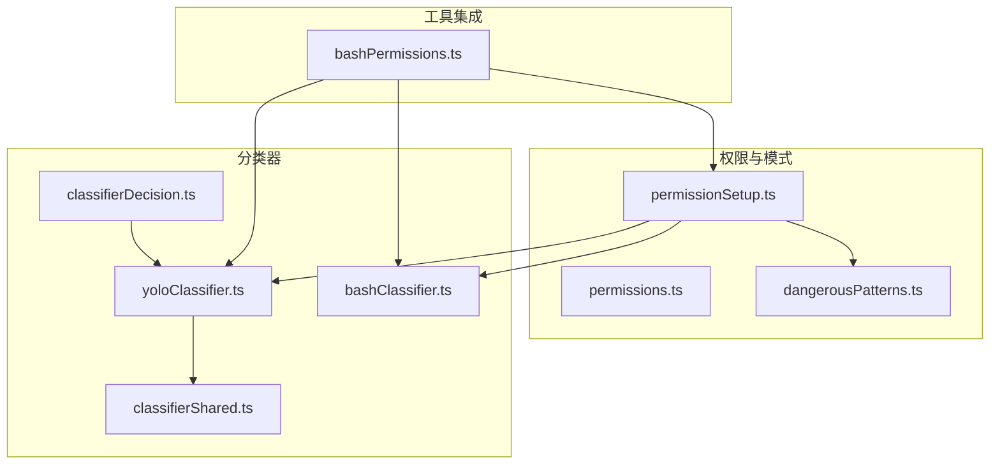
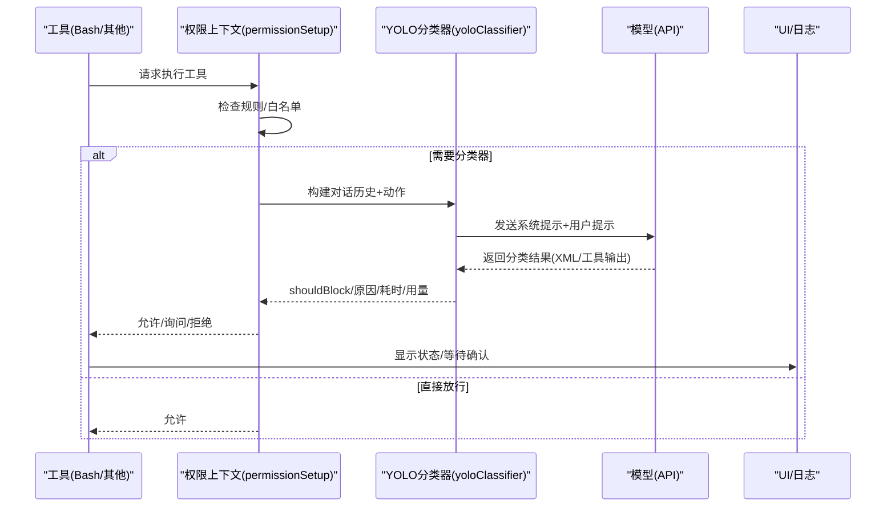
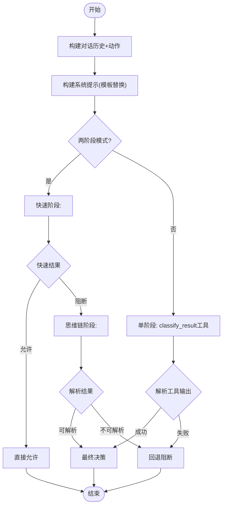
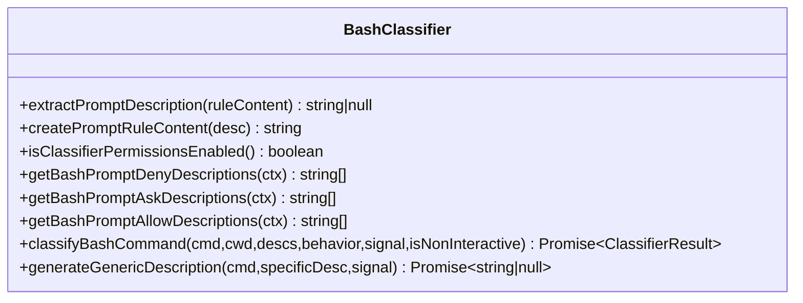
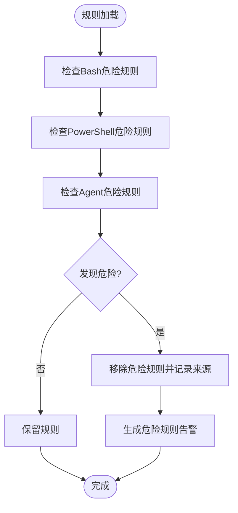
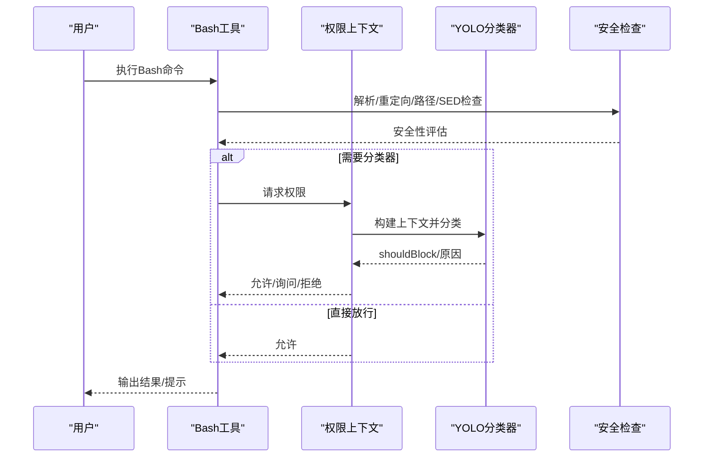
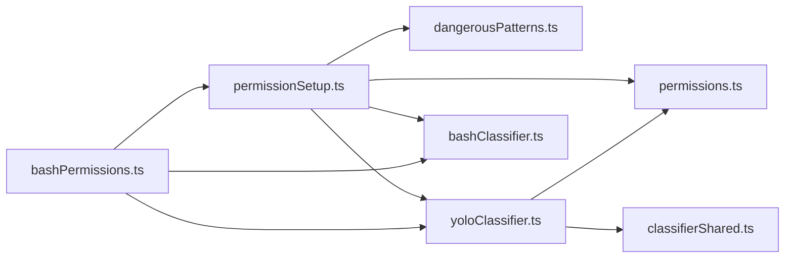

# 权限分类器系统

<cite>
**本文档引用的文件**
- [permissionSetup.ts](file://src/utils/permissions/permissionSetup.ts)
- [yoloClassifier.ts](file://src/utils/permissions/yoloClassifier.ts)
- [classifierDecision.ts](file://src/utils/permissions/classifierDecision.ts)
- [classifierShared.ts](file://src/utils/permissions/classifierShared.ts)
- [bashClassifier.ts](file://src/utils/permissions/bashClassifier.ts)
- [dangerousPatterns.ts](file://src/utils/permissions/dangerousPatterns.ts)
- [permissions.ts](file://src/types/permissions.ts)
- [bashPermissions.ts](file://src/tools/BashTool/bashPermissions.ts)
</cite>

## 目录
1. [简介](#简介)
2. [项目结构](#项目结构)
3. [核心组件](#核心组件)
4. [架构总览](#架构总览)
5. [详细组件分析](#详细组件分析)
6. [依赖关系分析](#依赖关系分析)
7. [性能考虑](#性能考虑)
8. [故障排除指南](#故障排除指南)
9. [结论](#结论)
10. [附录](#附录)

## 简介
本技术文档面向Claude Code权限分类器系统，重点解释自动模式（auto mode）下的安全分类机制，包括YOLO模式分类器与Bash语义分类器的工作原理、危险模式检测策略、安全防护措施、配置与自定义方法、性能优化与准确性提升策略，以及监控与维护指南。文档旨在帮助开发者与运维人员理解并正确使用该系统。

## 项目结构
权限分类器系统主要由以下模块组成：
- 权限规则与模式管理：负责解析、应用与清理权限规则，切换权限模式（默认/计划/自动/绕过），并检测危险规则。
- YOLO分类器：基于对话历史与工具调用构建上下文，通过两阶段XML或单阶段工具输出格式进行安全决策。
- Bash语义分类器：对Bash命令进行语义级匹配与描述生成，支持prompt规则与行为分类。
- 危险模式识别：识别可能导致绕过分类器的危险规则（如通配符、解释器前缀、Agent允许等）。
- 类型与共享工具：统一的权限类型定义、分类器响应解析与工具提取。

**图表来源**
- [permissionSetup.ts:1-1533](file://src/utils/permissions/permissionSetup.ts#L1-1533)
- [yoloClassifier.ts:1-1496](file://src/utils/permissions/yoloClassifier.ts#L1-1496)
- [classifierDecision.ts:1-99](file://src/utils/permissions/classifierDecision.ts#L1-99)
- [classifierShared.ts:1-40](file://src/utils/permissions/classifierShared.ts#L1-40)
- [bashClassifier.ts:1-62](file://src/utils/permissions/bashClassifier.ts#L1-62)
- [dangerousPatterns.ts:1-81](file://src/utils/permissions/dangerousPatterns.ts#L1-81)
- [bashPermissions.ts:1-200](file://src/tools/BashTool/bashPermissions.ts#L1-200)

**章节来源**
- [permissionSetup.ts:1-1533](file://src/utils/permissions/permissionSetup.ts#L1-1533)
- [yoloClassifier.ts:1-1496](file://src/utils/permissions/yoloClassifier.ts#L1-1496)
- [classifierDecision.ts:1-99](file://src/utils/permissions/classifierDecision.ts#L1-99)
- [classifierShared.ts:1-40](file://src/utils/permissions/classifierShared.ts#L1-40)
- [bashClassifier.ts:1-62](file://src/utils/permissions/bashClassifier.ts#L1-62)
- [dangerousPatterns.ts:1-81](file://src/utils/permissions/dangerousPatterns.ts#L1-81)
- [bashPermissions.ts:1-200](file://src/tools/BashTool/bashPermissions.ts#L1-200)

## 核心组件
- 权限模式与规则管理
  - 支持模式：默认(default)、计划(plan)、自动(auto)、绕过权限(bypassPermissions)、接受编辑(acceptEdits)、不询问(dontAsk)等。
  - 规则行为：允许(allow)、拒绝(deny)、询问(ask)。
  - 规则来源：用户设置、项目设置、本地设置、会话、命令行参数等。
- 自动模式分类器（YOLO）
  - 基于对话历史与工具调用构建紧凑文本，支持两阶段XML分类（快速阻断+思维链解释）与单阶段工具输出格式。
  - 可配置模型、JSONL转录格式、是否启用两阶段分类。
- Bash语义分类器
  - 仅在ANT构建中启用；支持从prompt规则生成描述、行为分类（deny/ask/allow）与结果解析。
- 危险模式检测
  - 检测可能导致绕过分类器的危险规则：通配符、解释器前缀、Agent允许、特定平台工具等。
- 允许白名单
  - 在自动模式下跳过分类器的“安全”工具集合，减少不必要的API调用。

**章节来源**
- [permissions.ts:16-38](file://src/types/permissions.ts#L16-L38)
- [permissions.ts:44-79](file://src/types/permissions.ts#L44-L79)
- [permissions.ts:416-442](file://src/types/permissions.ts#L416-L442)
- [yoloClassifier.ts:484-540](file://src/utils/permissions/yoloClassifier.ts#L484-L540)
- [yoloClassifier.ts:1308-1390](file://src/utils/permissions/yoloClassifier.ts#L1308-L1390)
- [bashClassifier.ts:1-62](file://src/utils/permissions/bashClassifier.ts#L1-L62)
- [permissionSetup.ts:84-147](file://src/utils/permissions/permissionSetup.ts#L84-L147)
- [classifierDecision.ts:56-94](file://src/utils/permissions/classifierDecision.ts#L56-L94)

## 架构总览
自动模式权限检查流程如下：
- 初始化权限上下文，加载规则与目录，检测危险与过度宽泛规则。
- 工具执行前，若为允许白名单工具则直接放行；否则进入分类器评估。
- YOLO分类器根据对话历史与动作构建输入，调用模型进行分类，返回阻断/允许及原因。
- 若分类器不可用或超长，按安全策略回退到阻断或提示用户确认。
- 分类器结果写入决策原因，供UI与日志使用。

**图表来源**
- [permissionSetup.ts:872-1033](file://src/utils/permissions/permissionSetup.ts#L872-L1033)
- [yoloClassifier.ts:1012-1306](file://src/utils/permissions/yoloClassifier.ts#L1012-L1306)
- [classifierDecision.ts:96-98](file://src/utils/permissions/classifierDecision.ts#L96-L98)

## 详细组件分析

### YOLO分类器（自动模式）
- 输入构建
  - 从消息列表抽取用户文本与助手工具调用块，序列化为紧凑文本。
  - 可选注入CLAUDE.md作为用户意图前缀，带缓存控制。
- 系统提示与模板
  - 使用基础系统提示，替换权限模板（外部/Anthropic内部），支持用户自定义允许/拒绝/环境规则。
- 两阶段XML分类
  - 快速阶段：短最大令牌数与停止序列，快速得到阻断/允许。
  - 思维链阶段：在快速阶段阻断后，进一步要求链式思考以降低误判。
- 单阶段工具输出
  - 使用自定义工具报告分类结果，包含思考、阻断决策与原因。
- 错误处理与诊断
  - 超长提示：检测确定性错误，回退到正常提示而非重试。
  - 异常捕获：记录错误提示与上下文对比，便于问题定位。
  - 可选转储请求/响应与错误提示到临时目录，便于分享与复现。

**图表来源**
- [yoloClassifier.ts:1012-1306](file://src/utils/permissions/yoloClassifier.ts#L1012-L1306)
- [yoloClassifier.ts:711-996](file://src/utils/permissions/yoloClassifier.ts#L711-L996)
- [yoloClassifier.ts:1110-1130](file://src/utils/permissions/yoloClassifier.ts#L1110-L1130)

**章节来源**
- [yoloClassifier.ts:484-540](file://src/utils/permissions/yoloClassifier.ts#L484-L540)
- [yoloClassifier.ts:711-996](file://src/utils/permissions/yoloClassifier.ts#L711-L996)
- [yoloClassifier.ts:1012-1306](file://src/utils/permissions/yoloClassifier.ts#L1012-L1306)
- [yoloClassifier.ts:1308-1390](file://src/utils/permissions/yoloClassifier.ts#L1308-L1390)

### Bash语义分类器（ANT专用）
- 功能特性
  - 提供prompt规则描述提取、生成通用描述、行为分类（deny/ask/allow）与结果解析。
  - 在非ANT构建中为占位实现（禁用）。
- 使用场景
  - 与自动模式结合，对Bash命令进行更细粒度的安全评估与建议。

**图表来源**
- [bashClassifier.ts:1-62](file://src/utils/permissions/bashClassifier.ts#L1-L62)

**章节来源**
- [bashClassifier.ts:1-62](file://src/utils/permissions/bashClassifier.ts#L1-L62)

### 危险模式检测与防护
- 危险规则识别
  - Bash危险：工具级允许（无内容）、通配符、解释器前缀（如python:*、node:*）、脚本解释器模式等。
  - PowerShell危险：嵌套shell、字符串/脚本块执行、进程启动、事件/会话代码执行、.NET逃逸等。
  - Agent危险：任何Agent允许规则都会绕过子代理评估。
- 过度宽泛规则
  - Bash(*)或PowerShell(*)等价于YOLO模式，应被识别并警告。
- 防护措施
  - 自动模式入口时移除危险规则，保存到“剥离清单”，退出自动模式时恢复。
  - 对CLI传入的危险规则进行检测与告警。
  - 对危险规则来源进行格式化显示，便于定位与修复。

**图表来源**
- [permissionSetup.ts:84-147](file://src/utils/permissions/permissionSetup.ts#L84-L147)
- [permissionSetup.ts:157-233](file://src/utils/permissions/permissionSetup.ts#L157-L233)
- [permissionSetup.ts:272-285](file://src/utils/permissions/permissionSetup.ts#L272-L285)
- [dangerousPatterns.ts:14-81](file://src/utils/permissions/dangerousPatterns.ts#L14-L81)

**章节来源**
- [permissionSetup.ts:84-147](file://src/utils/permissions/permissionSetup.ts#L84-L147)
- [permissionSetup.ts:157-233](file://src/utils/permissions/permissionSetup.ts#L157-L233)
- [permissionSetup.ts:272-342](file://src/utils/permissions/permissionSetup.ts#L272-L342)
- [permissionSetup.ts:505-579](file://src/utils/permissions/permissionSetup.ts#L505-L579)
- [dangerousPatterns.ts:14-81](file://src/utils/permissions/dangerousPatterns.ts#L14-L81)

### 允许白名单与快速路径
- 白名单工具
  - 包括只读文件操作、搜索/只读工具、任务管理元数据、计划模式/界面工具、团队协调工具、睡眠等。
  - 不包含写/编辑工具——这些通过“接受编辑”快速路径处理（仅限工作目录内）。
- 作用
  - 减少自动模式下不必要的分类器调用，提升性能与用户体验。

**章节来源**
- [classifierDecision.ts:56-94](file://src/utils/permissions/classifierDecision.ts#L56-L94)

### 工具集成与执行流程
- Bash工具权限检查
  - 解析命令、提取重定向、校验路径约束与sed限制。
  - 对复合命令设置上限，避免性能问题。
  - 对可能被误解析的命令提前触发安全检查。
  - 与分类器协作：对于敏感路径或需要上下文判断的情况，允许分类器介入评估。

**图表来源**
- [bashPermissions.ts:1-200](file://src/tools/BashTool/bashPermissions.ts#L1-L200)
- [yoloClassifier.ts:1012-1306](file://src/utils/permissions/yoloClassifier.ts#L1012-L1306)

**章节来源**
- [bashPermissions.ts:1-200](file://src/tools/BashTool/bashPermissions.ts#L1-L200)

## 依赖关系分析
- 模块耦合
  - permissionSetup.ts是权限与模式的核心，依赖危险模式列表、规则解析与更新、自动模式门控。
  - yoloClassifier.ts依赖系统提示模板、转录构建、工具共享解析器、模型选择与缓存控制。
  - bashPermissions.ts依赖权限上下文、分类器、安全检查与规则建议。
- 外部依赖
  - 模型API（sideQuery）、GrowthBook配置、统计事件上报、缓存控制。

**图表来源**
- [permissionSetup.ts:1-1533](file://src/utils/permissions/permissionSetup.ts#L1-L1533)
- [yoloClassifier.ts:1-1496](file://src/utils/permissions/yoloClassifier.ts#L1-1496)
- [bashPermissions.ts:1-200](file://src/tools/BashTool/bashPermissions.ts#L1-200)
- [dangerousPatterns.ts:1-81](file://src/utils/permissions/dangerousPatterns.ts#L1-81)
- [classifierShared.ts:1-40](file://src/utils/permissions/classifierShared.ts#L1-40)

**章节来源**
- [permissionSetup.ts:1-1533](file://src/utils/permissions/permissionSetup.ts#L1-L1533)
- [yoloClassifier.ts:1-1496](file://src/utils/permissions/yoloClassifier.ts#L1-1496)
- [bashPermissions.ts:1-200](file://src/tools/BashTool/bashPermissions.ts#L1-200)

## 性能考虑
- 分类器调用优化
  - 允许白名单工具跳过分类器，减少API调用与延迟。
  - 两阶段XML分类：快速阶段优先阻断，避免不必要的思维链阶段。
  - prompt长度控制：比较主循环上下文与分类器上下文，确保分类器提示小于主循环，防止溢出。
- 并发与资源
  - 分类器请求并发受模型与重试策略控制，避免过载。
  - 超长提示错误为确定性错误，不应重试，应回退到常规提示。
- 缓存与稳定性
  - 系统提示与CLAUDE.md前缀使用缓存控制，提升命中率与稳定性。

**章节来源**
- [classifierDecision.ts:56-94](file://src/utils/permissions/classifierDecision.ts#L56-L94)
- [yoloClassifier.ts:711-996](file://src/utils/permissions/yoloClassifier.ts#L711-L996)
- [yoloClassifier.ts:1068-1106](file://src/utils/permissions/yoloClassifier.ts#L1068-L1106)

## 故障排除指南
- 分类器不可用
  - 当分类器返回unavailable=true或阶段2解析失败时，默认阻断以保证安全。
  - 记录错误提示与上下文对比，便于定位问题。
- 超长提示
  - 检测到“提示过长”错误时，记录实际与限制令牌数，避免重试。
- 中止与中断
  - 用户中止请求时，返回阻断并标记为中断。
- 错误转储
  - 可选将请求/响应与错误提示写入临时目录，便于分享与复现。

**章节来源**
- [yoloClassifier.ts:941-996](file://src/utils/permissions/yoloClassifier.ts#L941-L996)
- [yoloClassifier.ts:1260-1306](file://src/utils/permissions/yoloClassifier.ts#L1260-L1306)
- [yoloClassifier.ts:1463-1471](file://src/utils/permissions/yoloClassifier.ts#L1463-L1471)

## 结论
权限分类器系统通过“规则+分类器”的双层安全机制，在自动模式下实现了对工具调用的智能评估与快速决策。YOLO分类器与Bash语义分类器协同工作，结合危险规则检测与白名单优化，既保障了安全性，又兼顾了性能与可用性。通过合理的配置与监控，系统能够在复杂交互场景中保持稳定与可控。

## 附录

### 配置与自定义方法
- 自动模式系统提示模板
  - 外部模板与Anthropic内部模板可切换，支持用户自定义允许/拒绝/环境规则。
- 模型与分类器模式
  - 可通过环境变量或GrowthBook配置选择模型、启用两阶段XML分类、切换JSONL转录格式。
- 规则来源与持久化
  - 支持用户设置、项目设置、本地设置、会话与命令行参数，危险规则可被检测并移除。

**章节来源**
- [yoloClassifier.ts:484-540](file://src/utils/permissions/yoloClassifier.ts#L484-L540)
- [yoloClassifier.ts:1334-1390](file://src/utils/permissions/yoloClassifier.ts#L1334-L1390)
- [permissionSetup.ts:456-503](file://src/utils/permissions/permissionSetup.ts#L456-L503)