# 权限控制系统

<cite>
**本文档引用的文件**
- [src/utils/permissions/PermissionUpdateSchema.ts](file://src/utils/permissions/PermissionUpdateSchema.ts)
- [src/bridge/bridgePermissionCallbacks.ts](file://src/bridge/bridgePermissionCallbacks.ts)
- [src/hooks/useSwarmPermissionPoller.ts](file://src/hooks/useSwarmPermissionPoller.ts)
- [src/components/permissions/SandboxPermissionRequest.tsx](file://src/components/permissions/SandboxPermissionRequest.tsx)
- [src/components/permissions/rules/AddPermissionRules.tsx](file://src/components/permissions/rules/AddPermissionRules.tsx)
- [src/utils/permissions/pathValidation.ts](file://src/utils/permissions/pathValidation.ts)
- [src/utils/permissions/filesystem.ts](file://src/utils/permissions/filesystem.ts)
- [src/hooks/useCanUseTool.tsx](file://src/hooks/useCanUseTool.tsx)
- [src/components/permissions/PermissionPrompt.tsx](file://src/components/permissions/PermissionPrompt.tsx)
- [src/utils/sandbox/sandbox-adapter.ts](file://src/utils/sandbox/sandbox-adapter.ts)
</cite>

## 目录
1. [简介](#简介)
2. [项目结构](#项目结构)
3. [核心组件](#核心组件)
4. [架构概览](#架构概览)
5. [详细组件分析](#详细组件分析)
6. [依赖关系分析](#依赖关系分析)
7. [性能考虑](#性能考虑)
8. [故障排除指南](#故障排除指南)
9. [结论](#结论)

## 简介

Claude Code权限控制系统是一个多层次的安全框架，旨在保护用户系统免受潜在危险操作的影响。该系统通过规则引擎、沙箱机制和用户交互设计，实现了细粒度的权限控制和执行安全保障。

系统的核心目标是：
- 防止恶意或意外的文件系统操作
- 控制网络访问权限
- 管理工具使用权限
- 提供透明的权限决策过程
- 支持团队协作环境下的权限同步

## 项目结构

权限控制系统主要分布在以下目录中：

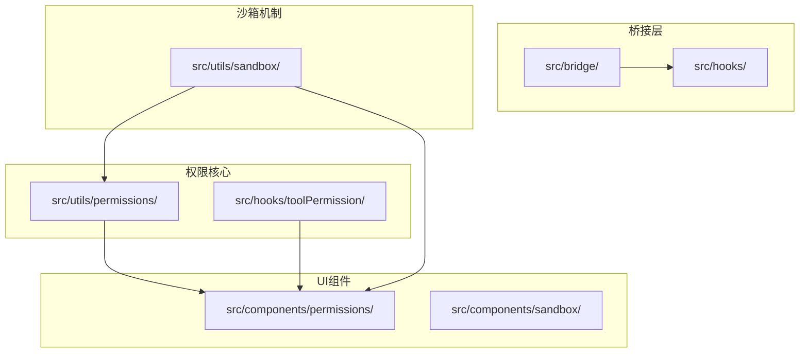

**图表来源**
- [src/utils/permissions/PermissionUpdateSchema.ts:1-79](file://src/utils/permissions/PermissionUpdateSchema.ts#L1-L79)
- [src/components/permissions/SandboxPermissionRequest.tsx:1-163](file://src/components/permissions/SandboxPermissionRequest.tsx#L1-L163)

**章节来源**
- [src/utils/permissions/PermissionUpdateSchema.ts:1-79](file://src/utils/permissions/PermissionUpdateSchema.ts#L1-L79)
- [src/bridge/bridgePermissionCallbacks.ts:1-44](file://src/bridge/bridgePermissionCallbacks.ts#L1-L44)

## 核心组件

### 权限更新架构

权限系统的核心是基于Zod模式的权限更新架构，支持多种权限更新类型：

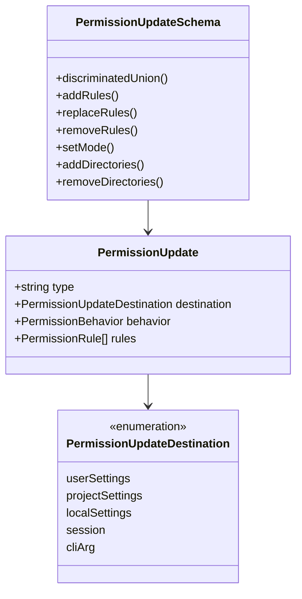

**图表来源**
- [src/utils/permissions/PermissionUpdateSchema.ts:27-79](file://src/utils/permissions/PermissionUpdateSchema.ts#L27-L79)

### 权限决策流程

系统采用多层决策机制，从规则匹配到用户交互：

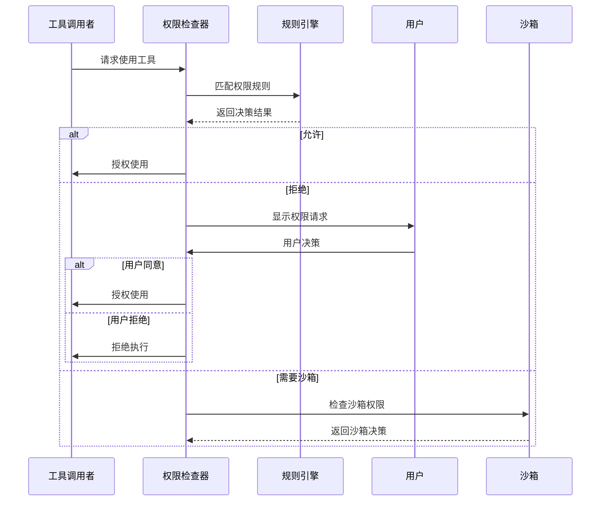

**图表来源**
- [src/hooks/useCanUseTool.tsx:32-183](file://src/hooks/useCanUseTool.tsx#L32-L183)
- [src/utils/permissions/filesystem.ts:1-800](file://src/utils/permissions/filesystem.ts#L1-L800)

**章节来源**
- [src/utils/permissions/PermissionUpdateSchema.ts:1-79](file://src/utils/permissions/PermissionUpdateSchema.ts#L1-L79)
- [src/hooks/useCanUseTool.tsx:1-204](file://src/hooks/useCanUseTool.tsx#L1-L204)

## 架构概览

### 整体架构设计

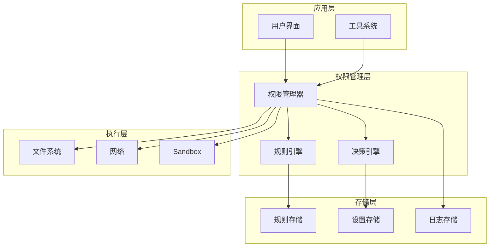

**图表来源**
- [src/utils/permissions/filesystem.ts:1-800](file://src/utils/permissions/filesystem.ts#L1-L800)
- [src/utils/sandbox/sandbox-adapter.ts:1-800](file://src/utils/sandbox/sandbox-adapter.ts#L1-L800)

### 权限验证流程

系统采用分层验证策略，确保每个操作都经过适当的检查：

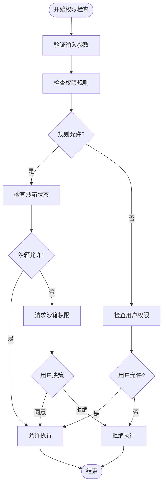

**图表来源**
- [src/utils/permissions/pathValidation.ts:373-486](file://src/utils/permissions/pathValidation.ts#L373-L486)
- [src/hooks/useSwarmPermissionPoller.ts:268-331](file://src/hooks/useSwarmPermissionPoller.ts#L268-L331)

## 详细组件分析

### 路径验证系统

路径验证系统是权限控制的核心组件，负责确保文件操作的安全性：

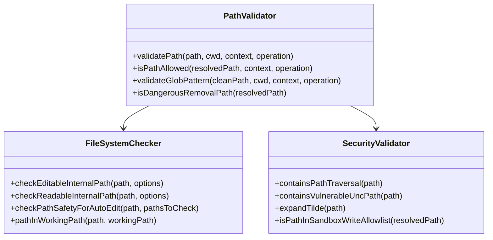

**图表来源**
- [src/utils/permissions/pathValidation.ts:141-263](file://src/utils/permissions/pathValidation.ts#L141-L263)
- [src/utils/permissions/filesystem.ts:620-665](file://src/utils/permissions/filesystem.ts#L620-L665)

#### 路径验证流程

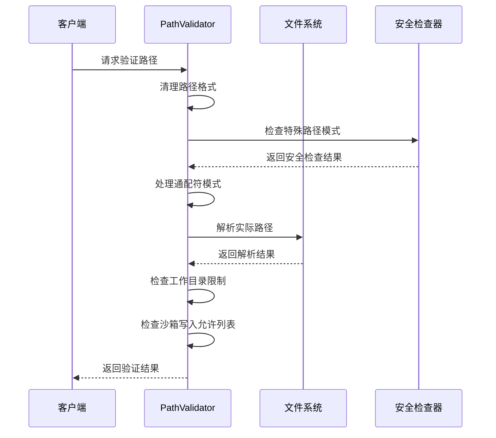

**图表来源**
- [src/utils/permissions/pathValidation.ts:373-486](file://src/utils/permissions/pathValidation.ts#L373-L486)

**章节来源**
- [src/utils/permissions/pathValidation.ts:1-486](file://src/utils/permissions/pathValidation.ts#L1-L486)
- [src/utils/permissions/filesystem.ts:1-800](file://src/utils/permissions/filesystem.ts#L1-L800)

### 沙箱权限管理系统

沙箱系统提供了额外的安全层，通过容器化技术隔离潜在危险操作：

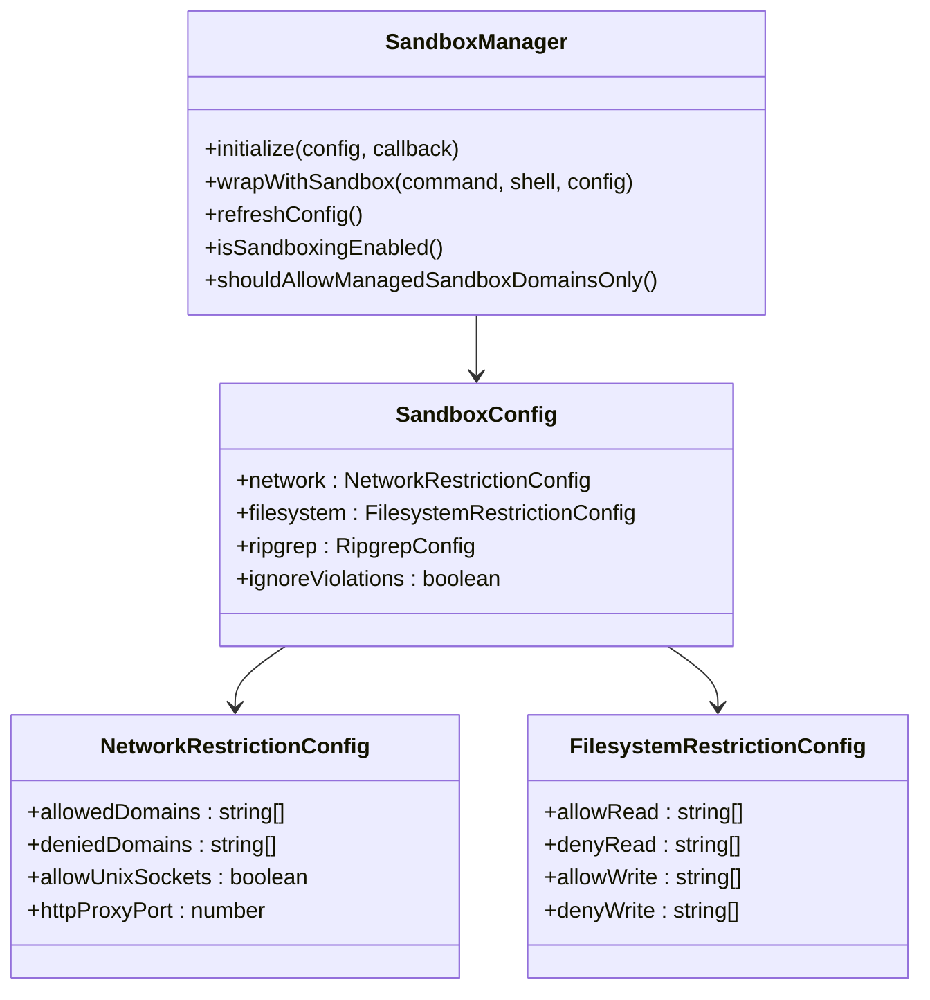

**图表来源**
- [src/utils/sandbox/sandbox-adapter.ts:172-381](file://src/utils/sandbox/sandbox-adapter.ts#L172-L381)

#### 沙箱初始化流程

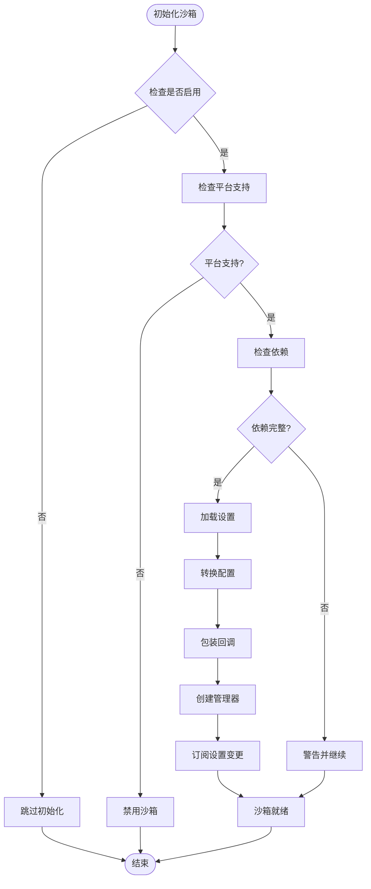

**图表来源**
- [src/utils/sandbox/sandbox-adapter.ts:730-792](file://src/utils/sandbox/sandbox-adapter.ts#L730-L792)

**章节来源**
- [src/utils/sandbox/sandbox-adapter.ts:1-800](file://src/utils/sandbox/sandbox-adapter.ts#L1-L800)

### 权限请求处理

权限请求处理系统提供了用户友好的交互界面：

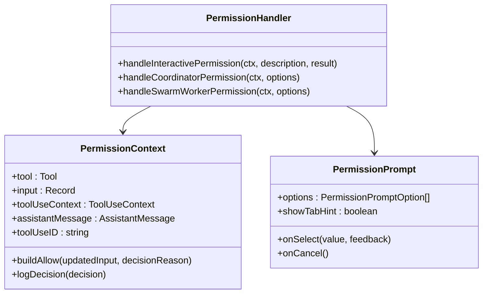

**图表来源**
- [src/hooks/useCanUseTool.tsx:160-168](file://src/hooks/useCanUseTool.tsx#L160-L168)
- [src/components/permissions/PermissionPrompt.tsx:23-336](file://src/components/permissions/PermissionPrompt.tsx#L23-L336)

#### 权限请求流程

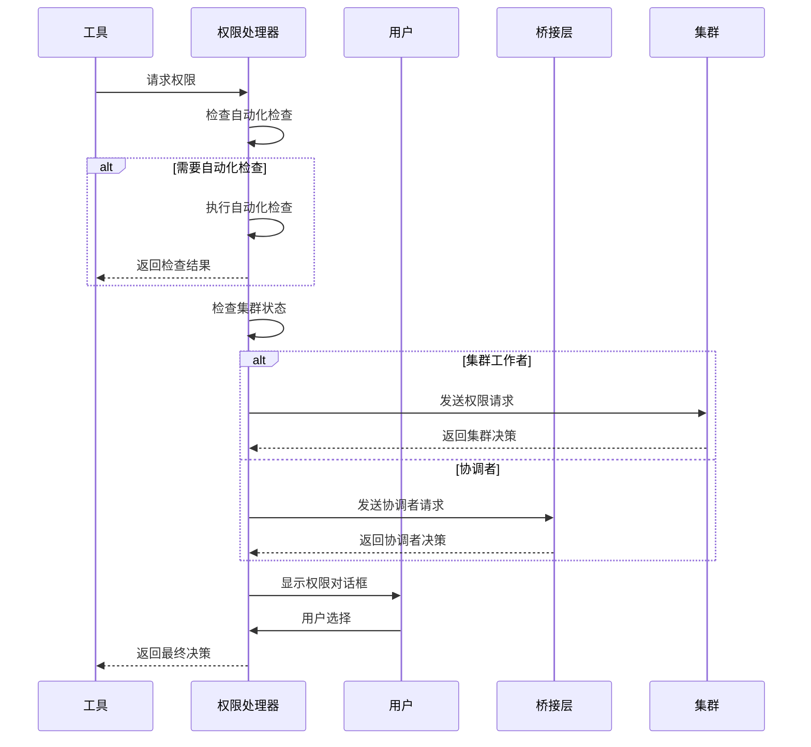

**图表来源**
- [src/hooks/useCanUseTool.tsx:95-168](file://src/hooks/useCanUseTool.tsx#L95-L168)

**章节来源**
- [src/hooks/useCanUseTool.tsx:1-204](file://src/hooks/useCanUseTool.tsx#L1-L204)
- [src/components/permissions/PermissionPrompt.tsx:1-336](file://src/components/permissions/PermissionPrompt.tsx#L1-L336)

### 团队权限同步

在团队协作环境中，权限需要在多个节点之间同步：

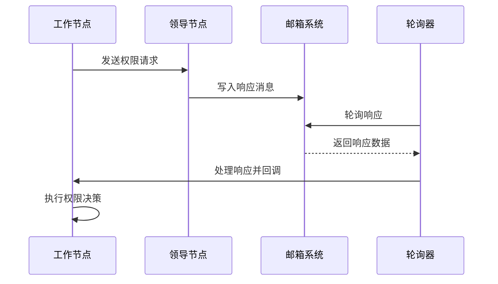

**图表来源**
- [src/hooks/useSwarmPermissionPoller.ts:297-310](file://src/hooks/useSwarmPermissionPoller.ts#L297-L310)

**章节来源**
- [src/hooks/useSwarmPermissionPoller.ts:1-331](file://src/hooks/useSwarmPermissionPoller.ts#L1-L331)

## 依赖关系分析

### 组件依赖图

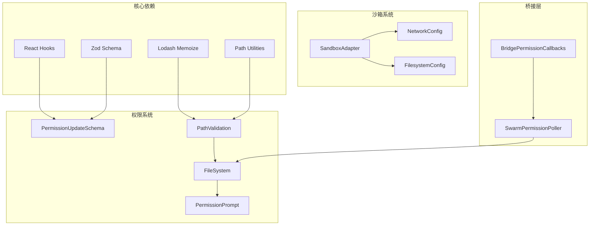

**图表来源**
- [src/utils/permissions/PermissionUpdateSchema.ts:8-19](file://src/utils/permissions/PermissionUpdateSchema.ts#L8-L19)
- [src/utils/permissions/pathValidation.ts:1-12](file://src/utils/permissions/pathValidation.ts#L1-L12)

### 数据流分析

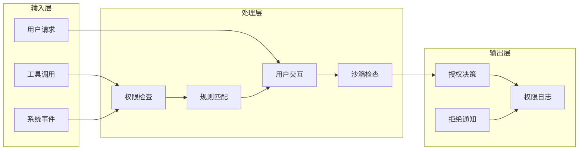

**图表来源**
- [src/hooks/useCanUseTool.tsx:32-183](file://src/hooks/useCanUseTool.tsx#L32-L183)

**章节来源**
- [src/utils/permissions/PermissionUpdateSchema.ts:1-79](file://src/utils/permissions/PermissionUpdateSchema.ts#L1-L79)
- [src/bridge/bridgePermissionCallbacks.ts:1-44](file://src/bridge/bridgePermissionCallbacks.ts#L1-L44)

## 性能考虑

### 缓存策略

系统采用了多层缓存机制来优化性能：

1. **路径解析缓存**：使用`memoize`函数缓存路径解析结果
2. **工作目录缓存**：缓存工作目录的解析路径
3. **规则匹配缓存**：缓存规则匹配结果
4. **沙箱配置缓存**：缓存沙箱配置以避免重复计算

### 异步处理

- 权限检查采用异步处理，避免阻塞主线程
- 沙箱初始化使用Promise链式调用
- 集群权限同步使用轮询机制

### 内存管理

- 使用WeakMap管理回调注册表
- 及时清理过期的权限请求
- 合理的垃圾回收策略

## 故障排除指南

### 常见问题诊断

#### 权限检查失败

**症状**：工具调用被无故拒绝
**可能原因**：
- 规则匹配错误
- 路径解析失败
- 沙箱配置问题

**解决步骤**：
1. 检查权限规则配置
2. 验证路径格式
3. 查看沙箱日志

#### 沙箱初始化失败

**症状**：沙箱功能不可用
**可能原因**：
- 平台不支持
- 依赖缺失
- 配置错误

**解决步骤**：
1. 运行沙箱诊断命令
2. 检查系统依赖
3. 验证沙箱配置

#### 权限同步问题

**症状**：团队成员权限不一致
**可能原因**：
- 网络连接问题
- 邮箱系统故障
- 轮询间隔设置不当

**解决步骤**：
1. 检查网络连接
2. 重启权限轮询器
3. 调整轮询间隔

**章节来源**
- [src/utils/sandbox/sandbox-adapter.ts:562-592](file://src/utils/sandbox/sandbox-adapter.ts#L562-L592)
- [src/hooks/useSwarmPermissionPoller.ts:311-318](file://src/hooks/useSwarmPermissionPoller.ts#L311-L318)

## 结论

Claude Code权限控制系统通过多层次的设计实现了全面的安全保障。系统的核心优势包括：

1. **模块化设计**：清晰的组件分离便于维护和扩展
2. **灵活的规则引擎**：支持复杂的权限规则配置
3. **强大的沙箱机制**：提供额外的安全隔离层
4. **用户友好的界面**：平衡安全性与易用性
5. **团队协作支持**：完善的权限同步机制

该系统为开发者提供了可扩展的权限控制框架，可以根据具体需求进行定制和增强。通过持续的安全审计和性能优化，系统能够适应不断变化的安全威胁和业务需求。