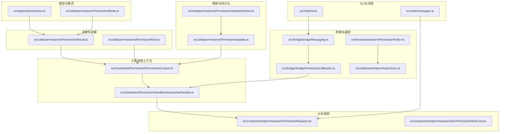
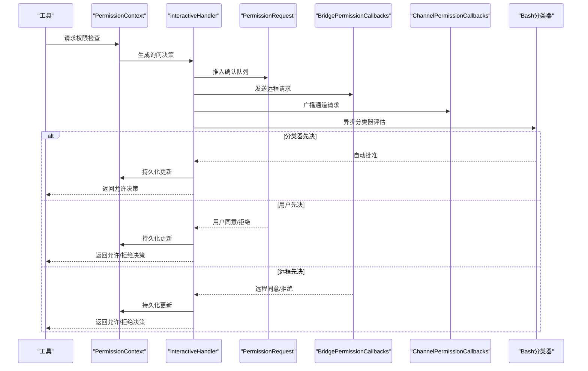
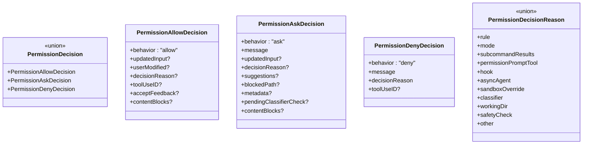
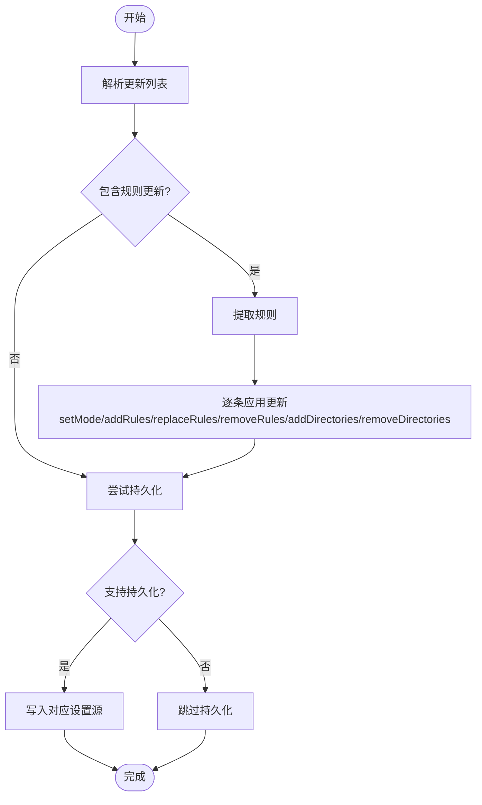
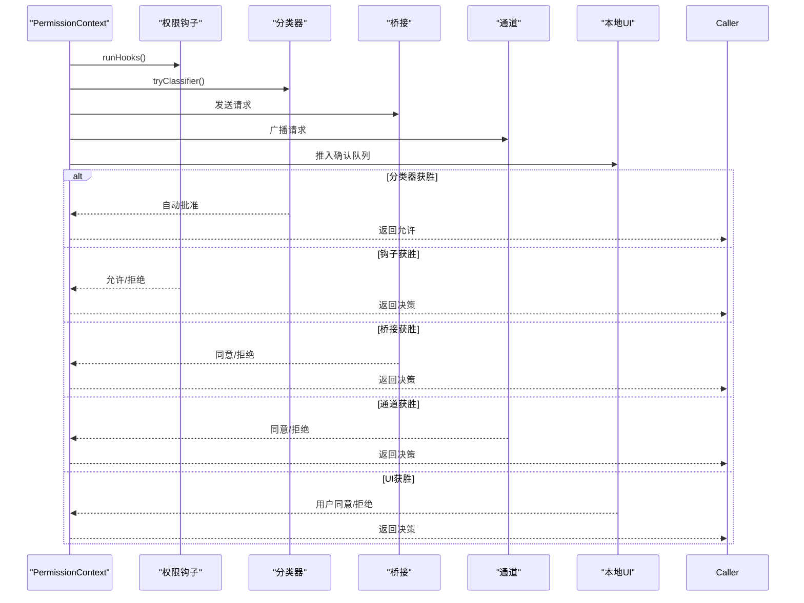
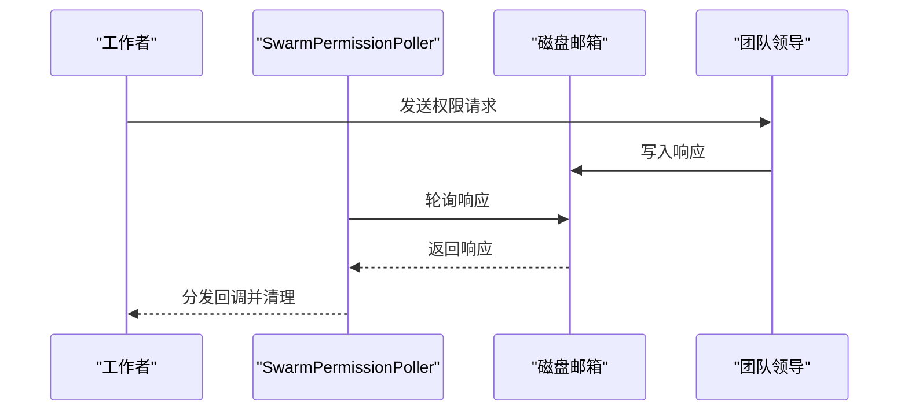
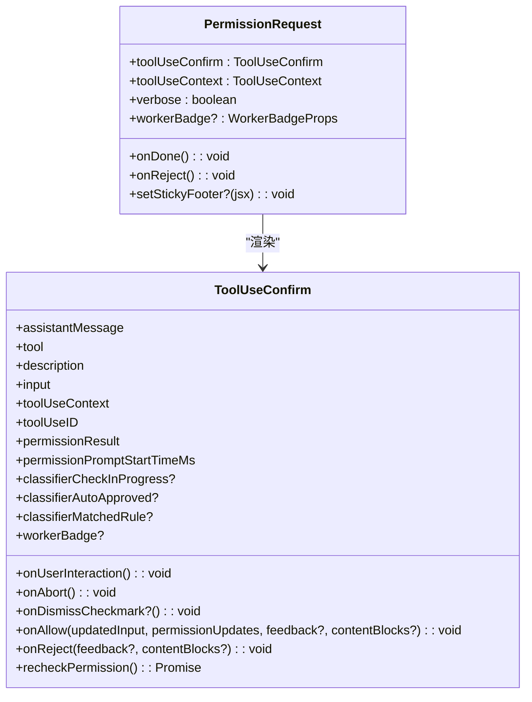
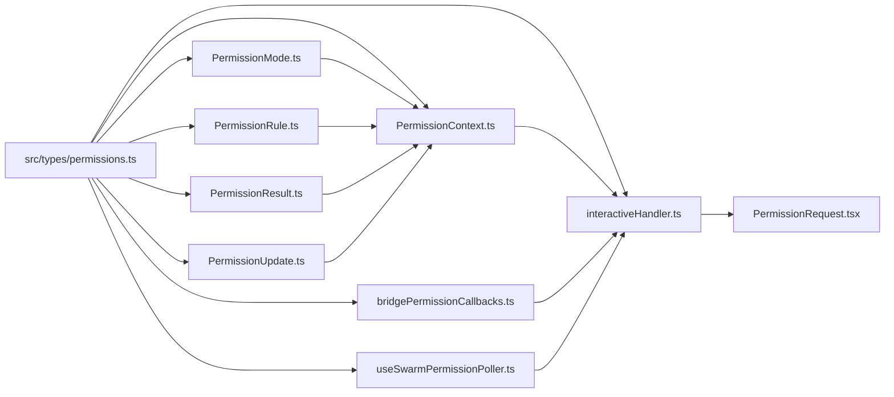

# 权限系统架构

<cite>
**本文档引用的文件**
- [PermissionMode.ts](file://src/utils/permissions/PermissionMode.ts)
- [PermissionResult.ts](file://src/utils/permissions/PermissionResult.ts)
- [PermissionUpdate.ts](file://src/utils/permissions/PermissionUpdate.ts)
- [PermissionUpdateSchema.ts](file://src/utils/permissions/PermissionUpdateSchema.ts)
- [PermissionRule.ts](file://src/utils/permissions/PermissionRule.ts)
- [permissions.ts](file://src/types/permissions.ts)
- [PermissionContext.ts](file://src/hooks/toolPermission/PermissionContext.ts)
- [interactiveHandler.ts](file://src/hooks/toolPermission/handlers/interactiveHandler.ts)
- [useSwarmPermissionPoller.ts](file://src/hooks/useSwarmPermissionPoller.ts)
- [bridgePermissionCallbacks.ts](file://src/bridge/bridgePermissionCallbacks.ts)
- [bridgeMessaging.ts](file://src/bridge/bridgeMessaging.ts)
- [PermissionRequest.tsx](file://src/components/permissions/PermissionRequest.tsx)
- [PermissionRuleList.tsx](file://src/components/permissions/rules/PermissionRuleList.tsx)
- [messages.ts](file://src/utils/messages.ts)
- [print.ts](file://src/cli/print.ts)
- [permissionSync.ts](file://src/utils/swarm/permissionSync.ts)
</cite>

## 目录
1. [简介](#简介)
2. [项目结构](#项目结构)
3. [核心组件](#核心组件)
4. [架构总览](#架构总览)
5. [详细组件分析](#详细组件分析)
6. [依赖关系分析](#依赖关系分析)
7. [性能考量](#性能考量)
8. [故障排除指南](#故障排除指南)
9. [结论](#结论)
10. [附录](#附录)

## 简介
本文件为 Claude Code 权限系统架构的详细技术文档，面向开发者与维护者，系统阐述权限模式定义、权限结果处理、权限更新与持久化、交互式权限流程、跨模块集成以及扩展性与可维护性设计。文档通过代码级分析与可视化图表，帮助读者快速理解权限系统的整体设计思路与实现细节。

## 项目结构
权限系统主要分布在以下目录与文件中：
- 类型与模式定义：`src/types/permissions.ts`、`src/utils/permissions/PermissionMode.ts`
- 权限决策与结果：`src/utils/permissions/PermissionResult.ts`
- 权限更新与持久化：`src/utils/permissions/PermissionUpdate.ts`、`src/utils/permissions/PermissionUpdateSchema.ts`
- 规则与行为：`src/utils/permissions/PermissionRule.ts`
- 工具权限上下文与交互：`src/hooks/toolPermission/PermissionContext.ts`、`src/hooks/toolPermission/handlers/interactiveHandler.ts`
- 跨进程/跨模块通信：`src/bridge/bridgePermissionCallbacks.ts`、`src/bridge/bridgeMessaging.ts`、`src/hooks/useSwarmPermissionPoller.ts`
- 用户界面与规则管理：`src/components/permissions/PermissionRequest.tsx`、`src/components/permissions/rules/PermissionRuleList.tsx`
- CLI 与桥接：`src/cli/print.ts`
- 消息与提示：`src/utils/messages.ts`



**图表来源**
- [permissions.ts:1-442](file://src/types/permissions.ts#L1-L442)
- [PermissionMode.ts:1-142](file://src/utils/permissions/PermissionMode.ts#L1-L142)
- [PermissionResult.ts:1-36](file://src/utils/permissions/PermissionResult.ts#L1-L36)
- [PermissionRule.ts:1-41](file://src/utils/permissions/PermissionRule.ts#L1-L41)
- [PermissionUpdate.ts:1-390](file://src/utils/permissions/PermissionUpdate.ts#L1-L390)
- [PermissionUpdateSchema.ts:1-79](file://src/utils/permissions/PermissionUpdateSchema.ts#L1-L79)
- [PermissionContext.ts:1-389](file://src/hooks/toolPermission/PermissionContext.ts#L1-L389)
- [interactiveHandler.ts:1-537](file://src/hooks/toolPermission/handlers/interactiveHandler.ts#L1-L537)
- [bridgePermissionCallbacks.ts:1-44](file://src/bridge/bridgePermissionCallbacks.ts#L1-L44)
- [bridgeMessaging.ts:328-371](file://src/bridge/bridgeMessaging.ts#L328-L371)
- [useSwarmPermissionPoller.ts:1-331](file://src/hooks/useSwarmPermissionPoller.ts#L1-L331)
- [permissionSync.ts:758-794](file://src/utils/swarm/permissionSync.ts#L758-L794)
- [PermissionRequest.tsx:1-217](file://src/components/permissions/PermissionRequest.tsx#L1-L217)
- [PermissionRuleList.tsx](file://src/components/permissions/rules/PermissionRuleList.tsx)
- [print.ts:3983-4014](file://src/cli/print.ts#L3983-L4014)
- [messages.ts:4354-4396](file://src/utils/messages.ts#L4354-L4396)

**章节来源**
- [permissions.ts:1-442](file://src/types/permissions.ts#L1-L442)
- [PermissionMode.ts:1-142](file://src/utils/permissions/PermissionMode.ts#L1-L142)
- [PermissionResult.ts:1-36](file://src/utils/permissions/PermissionResult.ts#L1-L36)
- [PermissionRule.ts:1-41](file://src/utils/permissions/PermissionRule.ts#L1-L41)
- [PermissionUpdate.ts:1-390](file://src/utils/permissions/PermissionUpdate.ts#L1-L390)
- [PermissionUpdateSchema.ts:1-79](file://src/utils/permissions/PermissionUpdateSchema.ts#L1-L79)
- [PermissionContext.ts:1-389](file://src/hooks/toolPermission/PermissionContext.ts#L1-L389)
- [interactiveHandler.ts:1-537](file://src/hooks/toolPermission/handlers/interactiveHandler.ts#L1-L537)
- [bridgePermissionCallbacks.ts:1-44](file://src/bridge/bridgePermissionCallbacks.ts#L1-L44)
- [bridgeMessaging.ts:328-371](file://src/bridge/bridgeMessaging.ts#L328-L371)
- [useSwarmPermissionPoller.ts:1-331](file://src/hooks/useSwarmPermissionPoller.ts#L1-L331)
- [permissionSync.ts:758-794](file://src/utils/swarm/permissionSync.ts#L758-L794)
- [PermissionRequest.tsx:1-217](file://src/components/permissions/PermissionRequest.tsx#L1-L217)
- [PermissionRuleList.tsx](file://src/components/permissions/rules/PermissionRuleList.tsx)
- [print.ts:3983-4014](file://src/cli/print.ts#L3983-L4014)
- [messages.ts:4354-4396](file://src/utils/messages.ts#L4354-L4396)

## 核心组件
- 权限模式与行为：定义权限模式（如默认、计划模式、自动、绕过等）及其外部映射，提供模式标题、颜色、符号等元信息，并支持模式到外部模式的转换。
- 权限规则与行为：定义规则值（工具名+可选内容）、规则来源（用户设置、项目设置、会话等）与行为（允许、拒绝、询问）。
- 权限结果：统一的决策类型（允许、拒绝、询问），并提供决策原因（规则、模式、子命令结果、钩子、分类器等）。
- 权限更新：支持添加/替换/移除规则、设置模式、增删工作目录等操作；提供应用与持久化能力，支持不同目标源（用户/项目/本地/会话/命令行）。
- 工具权限上下文：封装权限检查的上下文、钩子执行、分类器评估、持久化更新、队列操作与日志记录。
- 交互式权限处理器：协调本地 UI、桥接（Web 应用）、通道（Telegram/iMessage/Discord）与分类器的并发决策，采用“先到先得”策略。
- 跨模块通信：桥接回调接口、桥接消息处理、群组权限轮询器与磁盘邮箱同步。
- UI 组件：按工具类型渲染对应的权限请求对话框，支持粘性页脚、键盘绑定与通知。

**章节来源**
- [PermissionMode.ts:93-141](file://src/utils/permissions/PermissionMode.ts#L93-L141)
- [permissions.ts:16-38](file://src/types/permissions.ts#L16-L38)
- [PermissionRule.ts:19-41](file://src/utils/permissions/PermissionRule.ts#L19-L41)
- [PermissionResult.ts:23-35](file://src/utils/permissions/PermissionResult.ts#L23-L35)
- [permissions.ts:44-80](file://src/types/permissions.ts#L44-L80)
- [PermissionUpdate.ts:49-188](file://src/utils/permissions/PermissionUpdate.ts#L49-L188)
- [PermissionUpdate.ts:196-206](file://src/utils/permissions/PermissionUpdate.ts#L196-L206)
- [PermissionUpdate.ts:222-342](file://src/utils/permissions/PermissionUpdate.ts#L222-L342)
- [PermissionContext.ts:96-348](file://src/hooks/toolPermission/PermissionContext.ts#L96-L348)
- [interactiveHandler.ts:57-537](file://src/hooks/toolPermission/handlers/interactiveHandler.ts#L57-L537)
- [bridgePermissionCallbacks.ts:10-27](file://src/bridge/bridgePermissionCallbacks.ts#L10-L27)
- [bridgeMessaging.ts:328-371](file://src/bridge/bridgeMessaging.ts#L328-L371)
- [useSwarmPermissionPoller.ts:268-331](file://src/hooks/useSwarmPermissionPoller.ts#L268-L331)
- [PermissionRequest.tsx:47-82](file://src/components/permissions/PermissionRequest.tsx#L47-L82)

## 架构总览
权限系统采用“类型驱动 + 上下文管理 + 并发决策 + 多通道通信”的架构：
- 类型层：在 `src/types/permissions.ts` 中集中定义权限模式、规则、行为与结果，避免循环依赖。
- 决策层：在 `PermissionContext` 中封装权限检查、钩子执行、分类器评估与持久化。
- 更新层：在 `PermissionUpdate` 中提供原子化的更新应用与持久化，支持多目标源。
- 交互层：在 `interactiveHandler` 中协调本地 UI、桥接、通道与分类器的并发响应。
- 通信层：通过桥接回调、桥接消息、群组轮询与磁盘邮箱实现跨进程/跨模块协作。



**图表来源**
- [PermissionContext.ts:216-263](file://src/hooks/toolPermission/PermissionContext.ts#L216-L263)
- [interactiveHandler.ts:57-537](file://src/hooks/toolPermission/handlers/interactiveHandler.ts#L57-L537)
- [PermissionRequest.tsx:103-127](file://src/components/permissions/PermissionRequest.tsx#L103-L127)
- [bridgePermissionCallbacks.ts:10-27](file://src/bridge/bridgePermissionCallbacks.ts#L10-L27)
- [print.ts:3983-4014](file://src/cli/print.ts#L3983-L4014)

## 详细组件分析

### 权限模式与行为
- 模式定义：包含内部模式集合（含 auto/bubble）与外部模式集合，提供模式标题、短标题、符号与颜色映射。
- 外部模式转换：根据用户类型与模式类型，将内部模式映射到外部可用模式。
- 模式校验：提供字符串到模式的解析与默认回退逻辑。

```mermaid
classDiagram
class PermissionMode {
+permissionModeFromString(str) PermissionMode
+toExternalPermissionMode(mode) ExternalPermissionMode
+isExternalPermissionMode(mode) boolean
+permissionModeTitle(mode) string
+permissionModeShortTitle(mode) string
+permissionModeSymbol(mode) string
+getModeColor(mode) ModeColorKey
}
class ExternalPermissionMode {
<<enum>>
"acceptEdits"
"bypassPermissions"
"default"
"dontAsk"
"plan"
}
PermissionMode --> ExternalPermissionMode : "映射"
```

**图表来源**
- [PermissionMode.ts:93-141](file://src/utils/permissions/PermissionMode.ts#L93-L141)
- [permissions.ts:16-38](file://src/types/permissions.ts#L16-L38)

**章节来源**
- [PermissionMode.ts:93-141](file://src/utils/permissions/PermissionMode.ts#L93-L141)
- [permissions.ts:16-38](file://src/types/permissions.ts#L16-L38)

### 权限规则与行为
- 规则值：包含工具名与可选规则内容，用于匹配具体工具调用。
- 行为枚举：允许、拒绝、询问三种行为，决定是否直接放行、阻断或弹窗确认。
- 规则来源：支持用户设置、项目设置、本地设置、命令行参数、会话等来源。

```mermaid
classDiagram
class PermissionRuleValue {
+string toolName
+string ruleContent?
}
class PermissionBehavior {
<<enum>>
"allow"
"deny"
"ask"
}
class PermissionRuleSource {
<<enum>>
"userSettings"
"projectSettings"
"localSettings"
"flagSettings"
"policySettings"
"cliArg"
"command"
"session"
}
class PermissionRule {
+source : PermissionRuleSource
+ruleBehavior : PermissionBehavior
+ruleValue : PermissionRuleValue
}
```

**图表来源**
- [PermissionRule.ts:19-41](file://src/utils/permissions/PermissionRule.ts#L19-L41)
- [permissions.ts:54-79](file://src/types/permissions.ts#L54-L79)

**章节来源**
- [PermissionRule.ts:19-41](file://src/utils/permissions/PermissionRule.ts#L19-L41)
- [permissions.ts:54-79](file://src/types/permissions.ts#L54-L79)

### 权限结果与决策
- 决策类型：允许、拒绝、询问；询问决策包含建议更新、阻断路径、元数据与异步分类器检查。
- 决策原因：支持规则、模式、子命令结果、钩子、分类器、工作目录安全检查等多种原因类型。
- 结果描述：提供人类可读的规则行为描述（允许/拒绝/询问）。



**图表来源**
- [permissions.ts:174-324](file://src/types/permissions.ts#L174-L324)
- [PermissionResult.ts:23-35](file://src/utils/permissions/PermissionResult.ts#L23-L35)

**章节来源**
- [permissions.ts:174-324](file://src/types/permissions.ts#L174-L324)
- [PermissionResult.ts:23-35](file://src/utils/permissions/PermissionResult.ts#L23-L35)

### 权限更新与持久化
- 更新类型：添加/替换/移除规则、设置模式、增删工作目录。
- 应用策略：对上下文进行不可变更新，支持批量应用。
- 持久化策略：仅对可持久化目标源（用户/项目/本地设置）写入，支持规则与目录的增删改。



**图表来源**
- [PermissionUpdate.ts:30-47](file://src/utils/permissions/PermissionUpdate.ts#L30-L47)
- [PermissionUpdate.ts:55-206](file://src/utils/permissions/PermissionUpdate.ts#L55-L206)
- [PermissionUpdate.ts:222-342](file://src/utils/permissions/PermissionUpdate.ts#L222-L342)

**章节来源**
- [PermissionUpdate.ts:30-47](file://src/utils/permissions/PermissionUpdate.ts#L30-L47)
- [PermissionUpdate.ts:55-206](file://src/utils/permissions/PermissionUpdate.ts#L55-L206)
- [PermissionUpdate.ts:222-342](file://src/utils/permissions/PermissionUpdate.ts#L222-L342)

### 工具权限上下文与交互
- 上下文职责：封装工具、输入、工具使用上下文、消息 ID、工具使用 ID；提供日志记录、持久化、取消与中断、分类器评估、钩子执行与构建决策。
- 队列操作：抽象出通用的队列操作接口，支持 React 状态与 REPL 状态后端。
- 交互处理器：协调本地 UI、桥接、通道与分类器的并发决策，采用“先到先得”策略，确保唯一决议。



**图表来源**
- [PermissionContext.ts:216-263](file://src/hooks/toolPermission/PermissionContext.ts#L216-L263)
- [interactiveHandler.ts:410-531](file://src/hooks/toolPermission/handlers/interactiveHandler.ts#L410-L531)
- [bridgePermissionCallbacks.ts:10-27](file://src/bridge/bridgePermissionCallbacks.ts#L10-L27)

**章节来源**
- [PermissionContext.ts:96-348](file://src/hooks/toolPermission/PermissionContext.ts#L96-L348)
- [interactiveHandler.ts:57-537](file://src/hooks/toolPermission/handlers/interactiveHandler.ts#L57-L537)

### 跨模块通信与群组权限
- 桥接回调：定义桥接侧的请求/响应接口，支持取消挂起请求。
- 桥接消息：处理 `set_permission_mode` 等控制请求，返回成功/错误响应。
- 群组轮询：在工作者模式下轮询权限响应，解析并分发到对应回调。
- 磁盘邮箱：通过磁盘邮箱在团队成员间传递权限响应，支持清理与错误日志。



**图表来源**
- [useSwarmPermissionPoller.ts:268-331](file://src/hooks/useSwarmPermissionPoller.ts#L268-L331)
- [permissionSync.ts:758-794](file://src/utils/swarm/permissionSync.ts#L758-L794)

**章节来源**
- [bridgePermissionCallbacks.ts:10-27](file://src/bridge/bridgePermissionCallbacks.ts#L10-L27)
- [bridgeMessaging.ts:328-371](file://src/bridge/bridgeMessaging.ts#L328-L371)
- [useSwarmPermissionPoller.ts:1-331](file://src/hooks/useSwarmPermissionPoller.ts#L1-L331)
- [permissionSync.ts:758-794](file://src/utils/swarm/permissionSync.ts#L758-L794)

### UI 与规则管理
- 权限请求组件：按工具类型动态选择对应的权限请求组件，支持键盘绑定、通知与粘性页脚。
- 规则列表：提供规则增删改查、最近拒绝项查看与工作区目录管理。



**图表来源**
- [PermissionRequest.tsx:103-127](file://src/components/permissions/PermissionRequest.tsx#L103-L127)

**章节来源**
- [PermissionRequest.tsx:47-82](file://src/components/permissions/PermissionRequest.tsx#L47-L82)
- [PermissionRequest.tsx:103-127](file://src/components/permissions/PermissionRequest.tsx#L103-L127)

## 依赖关系分析
- 类型依赖：所有实现文件从 `src/types/permissions.ts` 导入类型，避免循环依赖。
- 上下文依赖：`PermissionContext` 依赖工具类型、消息类型、权限结果与更新类型。
- 交互依赖：`interactiveHandler` 依赖桥接回调、通道回调、分类器与 UI 队列。
- 通信依赖：桥接消息处理依赖回调接口；群组轮询依赖磁盘邮箱与响应解析。



**图表来源**
- [permissions.ts:1-442](file://src/types/permissions.ts#L1-L442)
- [PermissionMode.ts:1-142](file://src/utils/permissions/PermissionMode.ts#L1-L142)
- [PermissionRule.ts:1-41](file://src/utils/permissions/PermissionRule.ts#L1-L41)
- [PermissionResult.ts:1-36](file://src/utils/permissions/PermissionResult.ts#L1-L36)
- [PermissionUpdate.ts:1-390](file://src/utils/permissions/PermissionUpdate.ts#L1-L390)
- [PermissionContext.ts:1-389](file://src/hooks/toolPermission/PermissionContext.ts#L1-L389)
- [interactiveHandler.ts:1-537](file://src/hooks/toolPermission/handlers/interactiveHandler.ts#L1-L537)
- [bridgePermissionCallbacks.ts:1-44](file://src/bridge/bridgePermissionCallbacks.ts#L1-L44)
- [useSwarmPermissionPoller.ts:1-331](file://src/hooks/useSwarmPermissionPoller.ts#L1-L331)
- [PermissionRequest.tsx:1-217](file://src/components/permissions/PermissionRequest.tsx#L1-L217)

**章节来源**
- [permissions.ts:1-442](file://src/types/permissions.ts#L1-L442)
- [PermissionContext.ts:1-389](file://src/hooks/toolPermission/PermissionContext.ts#L1-L389)
- [interactiveHandler.ts:1-537](file://src/hooks/toolPermission/handlers/interactiveHandler.ts#L1-L537)

## 性能考量
- 并发决策：交互处理器同时竞速桥接、通道、钩子与分类器，采用“先到先得”策略减少等待时间。
- 异步分类器：仅在适用工具（如 Bash）且满足条件时启动，避免不必要的 API 调用。
- 去抖与节流：轮询间隔固定（毫秒级），避免频繁 IO；UI 层通过队列与一次性解析防止重复渲染。
- 持久化批处理：批量应用更新后再刷新上下文，降低设置写入频率。

[本节为通用指导，无需特定文件引用]

## 故障排除指南
- 权限响应未到达：检查桥接回调注册、桥接消息处理与磁盘邮箱写入；确认轮询器已激活。
- 决策冲突：确认“先到先得”策略是否被正确实现，避免重复决议；检查 UI 队列移除与分类器指示器清理。
- 规则解析失败：验证规则值与行为的 Zod 模式，确保序列化/反序列化一致性。
- 持久化失败：检查目标源是否可写，确认规则/目录更新的去重与替换逻辑。

**章节来源**
- [useSwarmPermissionPoller.ts:118-160](file://src/hooks/useSwarmPermissionPoller.ts#L118-L160)
- [bridgeMessaging.ts:328-371](file://src/bridge/bridgeMessaging.ts#L328-L371)
- [PermissionUpdate.ts:222-342](file://src/utils/permissions/PermissionUpdate.ts#L222-L342)
- [interactiveHandler.ts:433-531](file://src/hooks/toolPermission/handlers/interactiveHandler.ts#L433-L531)

## 结论
Claude Code 权限系统以类型驱动为核心，结合上下文管理、并发决策与多通道通信，实现了灵活、可扩展且可维护的权限控制框架。通过清晰的模式/规则/更新/结果抽象与严格的生命周期管理，系统在保证安全性的同时提供了良好的用户体验与开发可维护性。

[本节为总结性内容，无需特定文件引用]

## 附录
- 最佳实践
  - 使用类型文件集中定义权限相关类型，避免循环依赖。
  - 在工具权限上下文中统一处理钩子、分类器与 UI 的并发决策。
  - 对权限更新进行原子化应用与持久化，确保一致性。
  - 通过桥接与群组轮询实现跨模块协作，保持最小耦合。
- 设计模式
  - 上下文模式：将权限检查与决策封装在上下文中，便于测试与复用。
  - 策略模式：通过权限模式与行为策略化，支持动态切换与扩展。
  - 观察者模式：桥接与通道回调采用订阅/取消订阅机制，解耦响应处理。
  - 命令模式：权限更新以命令形式存在，支持撤销/重放与持久化。

[本节为概念性内容，无需特定文件引用]