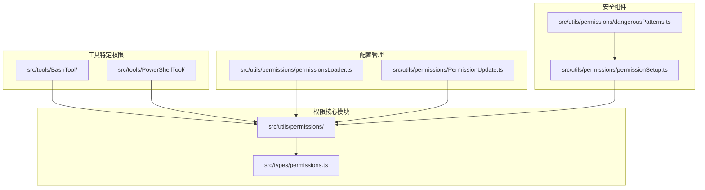
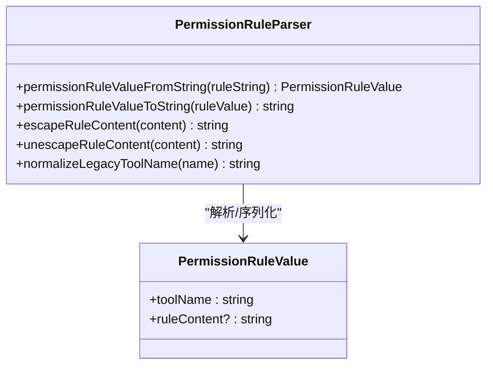
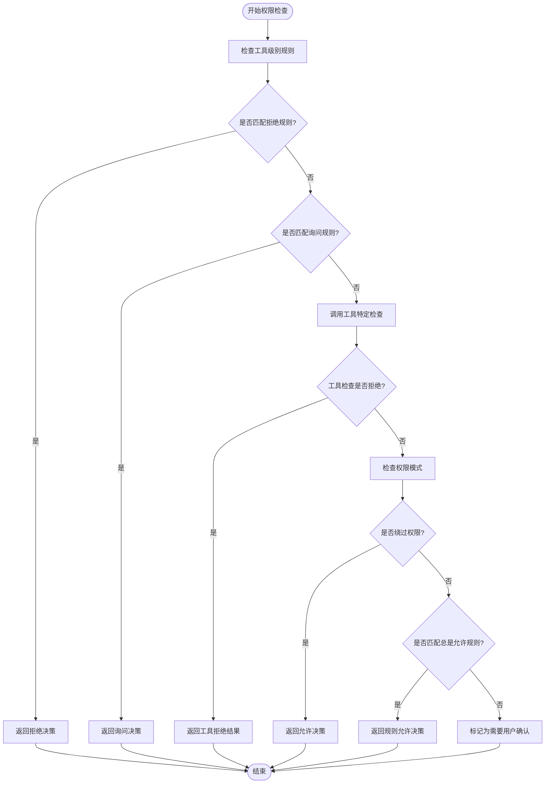
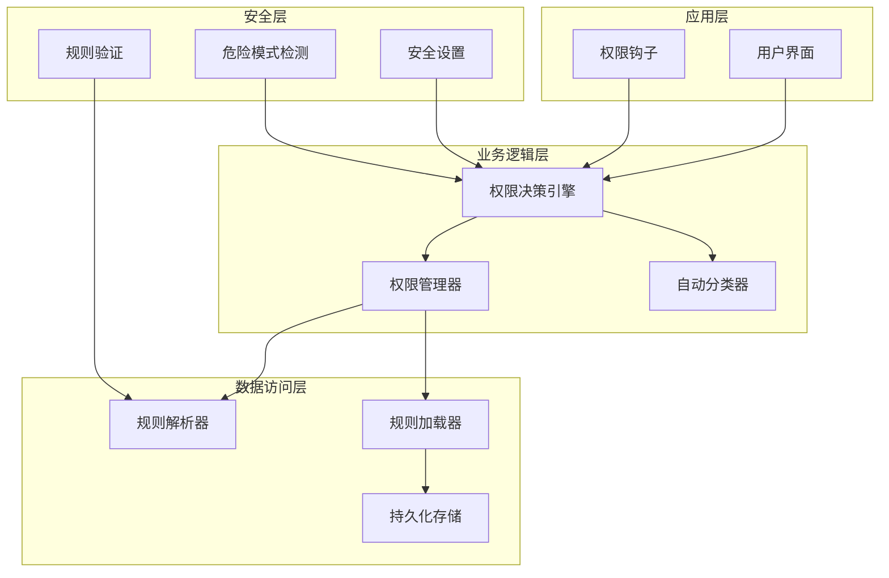
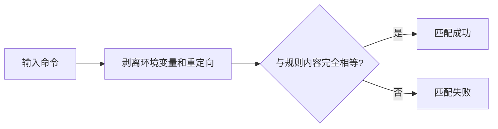
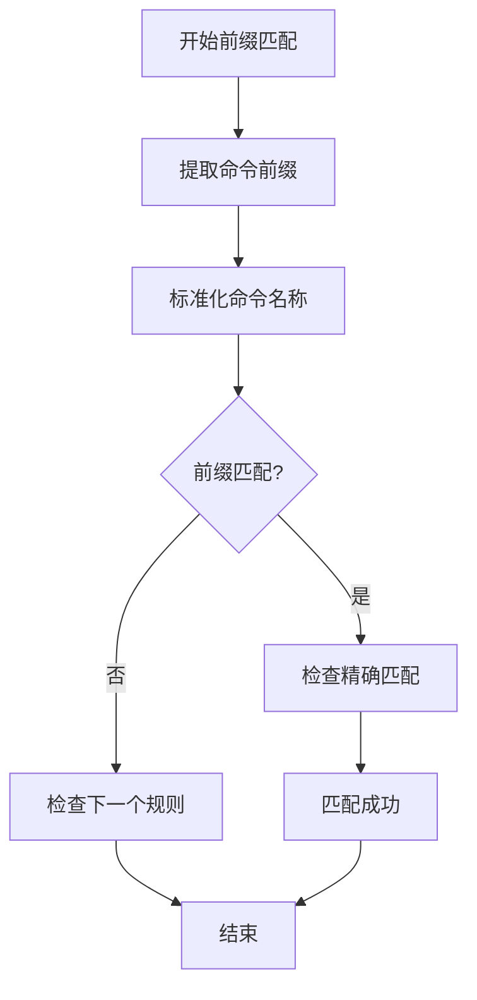
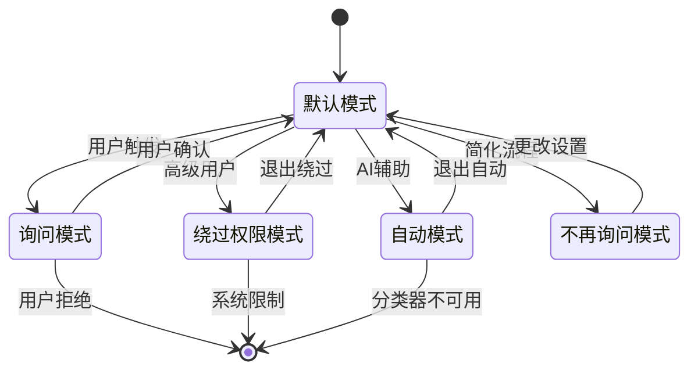
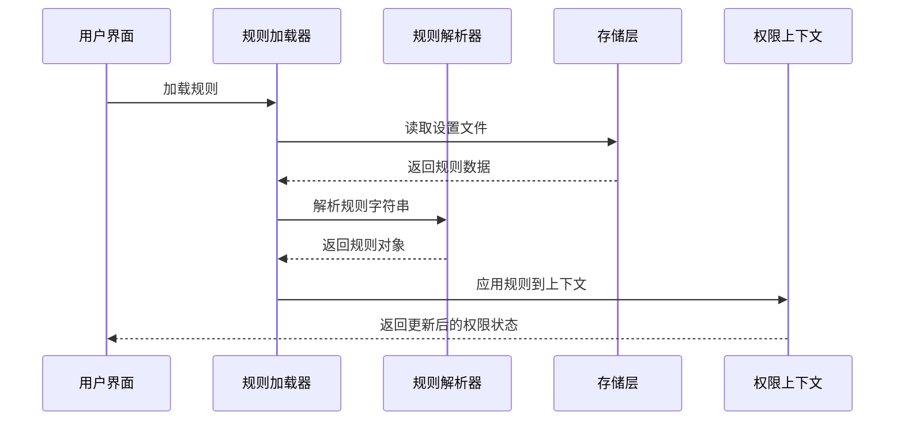
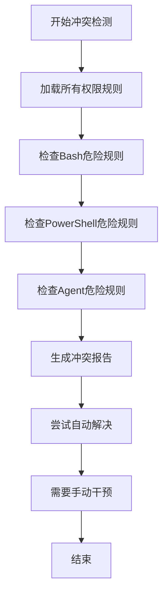
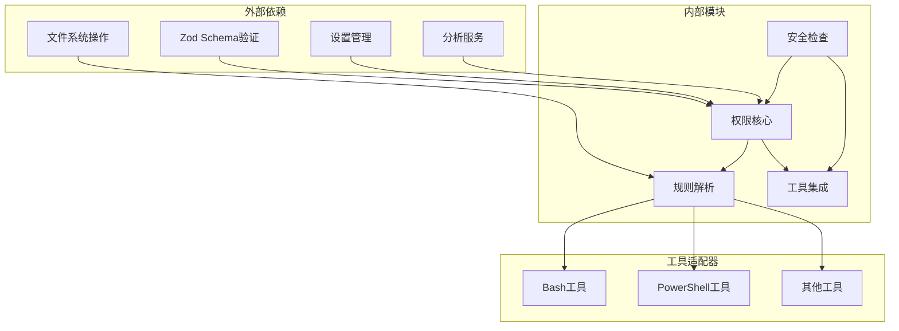

# 权限规则引擎

<cite>
**本文档引用的文件**
- [permissionRuleParser.ts](file://src/utils/permissions/permissionRuleParser.ts)
- [permissions.ts](file://src/utils/permissions/permissions.ts)
- [permissionsLoader.ts](file://src/utils/permissions/permissionsLoader.ts)
- [permissionSetup.ts](file://src/utils/permissions/permissionSetup.ts)
- [PermissionUpdate.ts](file://src/utils/permissions/PermissionUpdate.ts)
- [permissions.ts（类型定义）](file://src/types/permissions.ts)
- [bashPermissions.ts](file://src/tools/BashTool/bashPermissions.ts)
- [powershellPermissions.ts](file://src/tools/PowerShellTool/powershellPermissions.ts)
- [dangerousPatterns.ts](file://src/utils/permissions/dangerousPatterns.ts)
</cite>

## 目录
1. [简介](#简介)
2. [项目结构](#项目结构)
3. [核心组件](#核心组件)
4. [架构概览](#架构概览)
5. [详细组件分析](#详细组件分析)
6. [依赖关系分析](#依赖关系分析)
7. [性能考虑](#性能考虑)
8. [故障排除指南](#故障排除指南)
9. [结论](#结论)
10. [附录](#附录)

## 简介

Claude Code权限规则引擎是一个复杂的权限控制系统，用于管理AI助手在各种工具和操作上的访问权限。该引擎支持多种权限模式、规则类型和匹配算法，确保在提供强大功能的同时保持安全性。

该系统的核心特性包括：
- 多层次权限控制（允许、拒绝、询问）
- 支持多种工具类型的权限规则
- 智能规则匹配算法（精确匹配、前缀匹配、通配符匹配）
- 自动模式和交互模式的智能切换
- 安全的规则存储和加载机制
- 冲突检测和解决策略

## 项目结构

权限规则引擎主要分布在以下目录中：

**图表来源**
- [permissions.ts:1-100](file://src/utils/permissions/permissions.ts#L1-L100)
- [permissionsLoader.ts:1-50](file://src/utils/permissions/permissionsLoader.ts#L1-L50)
- [bashPermissions.ts:1-50](file://src/tools/BashTool/bashPermissions.ts#L1-L50)

**章节来源**
- [permissions.ts:1-150](file://src/utils/permissions/permissions.ts#L1-L150)
- [permissionsLoader.ts:1-100](file://src/utils/permissions/permissionsLoader.ts#L1-L100)

## 核心组件

### 权限规则解析器

权限规则解析器负责将字符串格式的规则转换为可执行的数据结构：

**图表来源**
- [permissionRuleParser.ts:93-152](file://src/utils/permissions/permissionRuleParser.ts#L93-L152)

### 权限决策引擎

权限决策引擎是整个系统的核心，负责评估权限请求并做出决策：

**图表来源**
- [permissions.ts:1158-1319](file://src/utils/permissions/permissions.ts#L1158-L1319)

**章节来源**
- [permissions.ts:1158-1319](file://src/utils/permissions/permissions.ts#L1158-L1319)
- [permissionRuleParser.ts:1-199](file://src/utils/permissions/permissionRuleParser.ts#L1-L199)

## 架构概览

权限规则引擎采用分层架构设计，确保了高度的模块化和可扩展性：

**图表来源**
- [permissions.ts:1-150](file://src/utils/permissions/permissions.ts#L1-L150)
- [permissionSetup.ts:1-100](file://src/utils/permissions/permissionSetup.ts#L1-L100)

## 详细组件分析

### 规则语法和解析机制

权限规则采用统一的语法格式：`工具名(规则内容)` 或 `工具名`。解析器支持转义字符处理和遗留工具名称映射。

#### 规则语法规范

| 规则类型 | 语法示例 | 描述 |
|---------|---------|------|
| 工具级规则 | `Bash` | 匹配整个Bash工具 |
| 前缀规则 | `Bash(npm:*)` | 匹配以"npm:"开头的命令 |
| 精确规则 | `Bash("git commit -m 'fix'")` | 匹配完全相同的命令 |
| 通配符规则 | `PowerShell(*)` | 允许所有PowerShell命令 |

#### 解析算法复杂度

规则解析的时间复杂度为O(n)，其中n是规则字符串长度。内存使用为O(k)，k为解析后规则元素数量。

**章节来源**
- [permissionRuleParser.ts:81-152](file://src/utils/permissions/permissionRuleParser.ts#L81-L152)
- [permissionsLoader.ts:91-114](file://src/utils/permissions/permissionsLoader.ts#L91-L114)

### 规则匹配算法

系统实现了三种匹配模式，每种都有特定的使用场景和性能特征：

#### 精确匹配算法

精确匹配用于完全相同的命令比较，适用于已知的特定命令模式：

**图表来源**
- [bashPermissions.ts:778-800](file://src/tools/BashTool/bashPermissions.ts#L778-L800)

#### 前缀匹配算法

前缀匹配是最常用的匹配方式，支持部分命令模式：

**图表来源**
- [powershellPermissions.ts:170-333](file://src/tools/PowerShellTool/powershellPermissions.ts#L170-L333)

#### 通配符匹配算法

通配符匹配支持更灵活的模式匹配，但性能开销较大：

| 匹配类型 | 性能特征 | 使用场景 |
|---------|---------|---------|
| 精确匹配 | O(1) | 特定命令授权 |
| 前缀匹配 | O(m) | 命令类别授权 |
| 通配符匹配 | O(m×n) | 复杂模式匹配 |

**章节来源**
- [bashPermissions.ts:778-800](file://src/tools/BashTool/bashPermissions.ts#L778-L800)
- [powershellPermissions.ts:170-333](file://src/tools/PowerShellTool/powershellPermissions.ts#L170-L333)

### 权限模式系统

系统支持多种权限模式，每种模式都有不同的安全级别和用户体验：

**图表来源**
- [permissions.ts:116-120](file://src/utils/permissions/permissions.ts#L116-L120)

#### 模式特性对比

| 模式 | 安全级别 | 用户体验 | 主要用途 |
|------|---------|---------|---------|
| 默认模式 | 最高 | 最详细 | 日常使用 |
| 询问模式 | 中等 | 需要确认 | 特殊操作 |
| 绕过权限模式 | 低 | 无确认 | 高级用户 |
| 自动模式 | 中等 | 半自动化 | AI辅助 |
| 不再询问模式 | 中等 | 快速确认 | 熟悉操作 |

**章节来源**
- [permissions.ts:116-120](file://src/utils/permissions/permissions.ts#L116-L120)
- [permissions.ts（类型定义）:16-38](file://src/types/permissions.ts#L16-L38)

### 规则存储和加载机制

系统提供了完整的规则存储和加载机制，支持多种数据源和持久化策略：

**图表来源**
- [permissionsLoader.ts:120-133](file://src/utils/permissions/permissionsLoader.ts#L120-L133)

#### 数据源优先级

| 数据源 | 优先级 | 作用域 | 更新方式 |
|--------|-------|-------|---------|
| 策略设置 | 最高 | 组织级 | 系统管理员 |
| 用户设置 | 高 | 用户级 | 用户配置 |
| 项目设置 | 中 | 项目级 | 项目配置 |
| 本地设置 | 中 | 会话级 | 临时配置 |
| CLI参数 | 低 | 运行时 | 命令行参数 |
| 会话规则 | 最低 | 临时 | 临时授权 |

**章节来源**
- [permissionsLoader.ts:120-145](file://src/utils/permissions/permissionsLoader.ts#L120-L145)
- [PermissionUpdate.ts:55-120](file://src/utils/permissions/PermissionUpdate.ts#L55-L120)

### 冲突检测和解决策略

系统内置了强大的冲突检测机制，能够识别和解决潜在的权限冲突：

#### 危险规则检测

**图表来源**
- [permissionSetup.ts:287-342](file://src/utils/permissions/permissionSetup.ts#L287-L342)

#### 冲突解决策略

| 冲突类型 | 检测方法 | 解决方案 | 影响范围 |
|---------|---------|---------|---------|
| 覆盖权限规则 | 规则内容分析 | 移除或修改危险规则 | 组织策略 |
| 模糊规则冲突 | 规则匹配度评估 | 提供建议和替代方案 | 用户配置 |
| 循环依赖 | 依赖关系图分析 | 手动调整规则顺序 | 项目配置 |
| 性能问题 | 匹配算法复杂度分析 | 优化规则结构 | 全局 |

**章节来源**
- [permissionSetup.ts:287-342](file://src/utils/permissions/permissionSetup.ts#L287-L342)
- [dangerousPatterns.ts:1-81](file://src/utils/permissions/dangerousPatterns.ts#L1-L81)

## 依赖关系分析

权限规则引擎的依赖关系体现了清晰的分层架构：

**图表来源**
- [permissions.ts:1-50](file://src/utils/permissions/permissions.ts#L1-L50)

### 模块耦合度分析

| 模块 | 内聚性 | 耦合度 | 主要职责 |
|------|-------|-------|---------|
| 权限核心 | 高 | 低 | 核心决策逻辑 |
| 规则解析 | 高 | 中 | 规则语法处理 |
| 工具集成 | 中 | 高 | 工具特定逻辑 |
| 安全检查 | 高 | 中 | 安全策略实施 |
| 配置管理 | 中 | 低 | 设置持久化 |

**章节来源**
- [permissions.ts:1-150](file://src/utils/permissions/permissions.ts#L1-L150)
- [bashPermissions.ts:1-100](file://src/tools/BashTool/bashPermissions.ts#L1-L100)

## 性能考虑

权限规则引擎在设计时充分考虑了性能优化：

### 时间复杂度优化

| 组件 | 原始复杂度 | 优化后复杂度 | 优化技术 |
|------|-----------|-------------|---------|
| 规则解析 | O(n) | O(n) | 字符串预处理 |
| 精确匹配 | O(1) | O(1) | 直接比较 |
| 前缀匹配 | O(m) | O(m) | 缓存匹配结果 |
| 通配符匹配 | O(m×n) | O(m×n) | 模式编译缓存 |
| 规则加载 | O(k) | O(k) | 异步加载 |

### 内存使用优化

系统采用了多种内存优化策略：
- 规则对象复用和缓存
- 字符串池化减少内存分配
- 懒加载机制延迟初始化
- 增量更新避免全量重建

## 故障排除指南

### 常见问题诊断

#### 规则不生效

**症状**：配置的权限规则没有按预期工作

**排查步骤**：
1. 检查规则语法格式是否正确
2. 验证规则内容是否与实际命令匹配
3. 确认规则优先级和覆盖关系
4. 查看权限日志获取详细信息

#### 性能问题

**症状**：权限检查响应缓慢

**解决方案**：
1. 优化规则结构，减少通配符使用
2. 合理使用前缀规则替代通配符
3. 清理无效和重复的规则
4. 考虑使用会话级规则减少全局检查

#### 安全警告

**症状**：系统提示潜在的安全风险

**处理方法**：
1. 检查危险规则（如`Bash(*)`、`PowerShell(*)`）
2. 审核自动模式下的权限设置
3. 更新安全策略和规则配置
4. 联系安全管理员进行审查

**章节来源**
- [permissionSetup.ts:287-342](file://src/utils/permissions/permissionSetup.ts#L287-L342)
- [permissions.ts:800-1058](file://src/utils/permissions/permissions.ts#L800-L1058)

## 结论

Claude Code权限规则引擎通过其精心设计的架构和实现，为AI助手的权限管理提供了强大而灵活的解决方案。系统的主要优势包括：

1. **模块化设计**：清晰的分层架构使得系统易于维护和扩展
2. **多模式支持**：适应不同用户需求和安全级别的权限管理模式
3. **智能匹配**：高效的规则匹配算法支持复杂的权限场景
4. **安全优先**：内置的安全检测和冲突解决机制确保系统安全
5. **性能优化**：针对大规模规则集的性能优化保证用户体验

该引擎为开发者提供了完整的权限管理框架，同时为最终用户提供了直观易用的权限控制界面。通过合理的配置和使用，可以有效平衡功能性和安全性。

## 附录

### 规则编写最佳实践

#### 命令级规则
- 优先使用前缀规则而非通配符规则
- 避免使用`*`作为唯一规则内容
- 为常用命令创建精确规则以提高性能

#### 安全规则
- 定期审查危险规则并及时移除
- 在自动模式下谨慎使用宽松规则
- 使用工具特定的安全检查增强保护

#### 维护建议
- 定期清理无效和过期的规则
- 建立规则变更的审核流程
- 记录重要的权限变更历史

### 调试工具和技巧

系统提供了丰富的调试功能：
- 详细的权限决策日志
- 规则匹配过程跟踪
- 性能指标监控
- 冲突检测报告

这些工具可以帮助开发者快速定位和解决问题，确保权限系统的稳定运行。