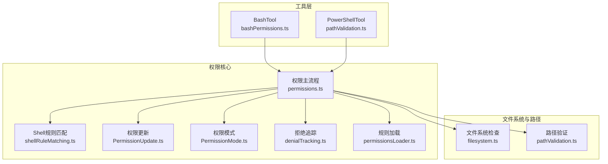
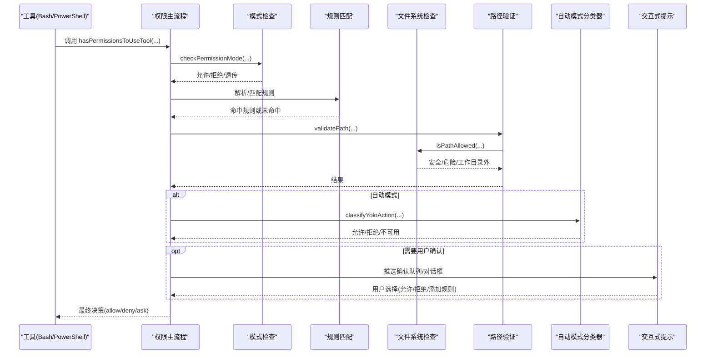
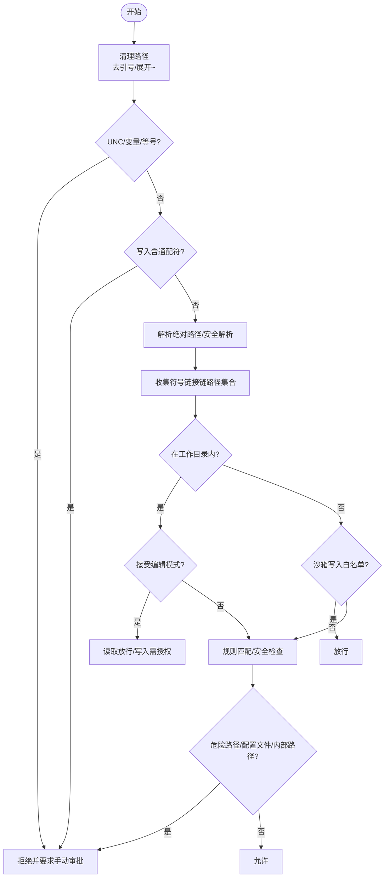
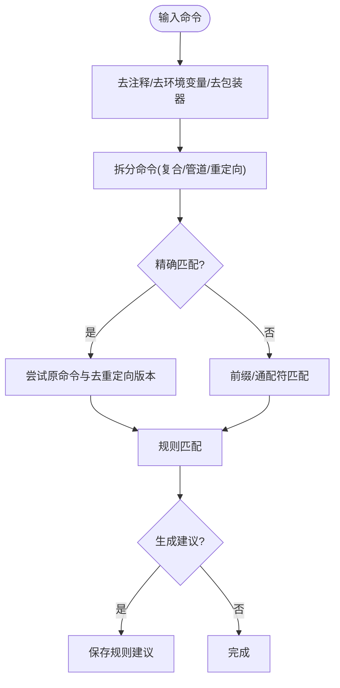
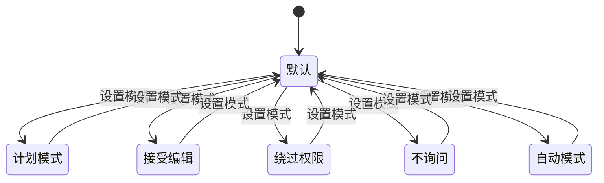
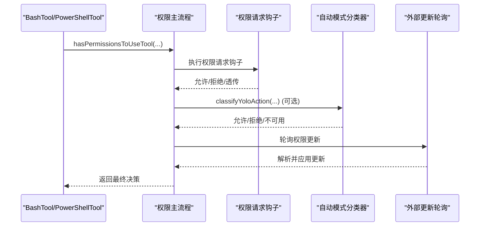
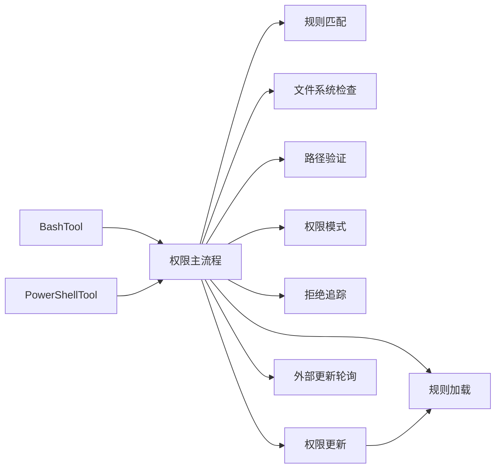

# 权限验证机制

<cite>
**本文档引用的文件**
- [src/utils/permissions/permissions.ts](file://src/utils/permissions/permissions.ts)
- [src/utils/permissions/PermissionUpdate.ts](file://src/utils/permissions/PermissionUpdate.ts)
- [src/utils/permissions/shellRuleMatching.ts](file://src/utils/permissions/shellRuleMatching.ts)
- [src/utils/permissions/pathValidation.ts](file://src/utils/permissions/pathValidation.ts)
- [src/utils/permissions/filesystem.ts](file://src/utils/permissions/filesystem.ts)
- [src/utils/permissions/PermissionMode.ts](file://src/utils/permissions/PermissionMode.ts)
- [src/utils/permissions/denialTracking.ts](file://src/utils/permissions/denialTracking.ts)
- [src/utils/permissions/permissionsLoader.ts](file://src/utils/permissions/permissionsLoader.ts)
- [src/tools/BashTool/bashPermissions.ts](file://src/tools/BashTool/bashPermissions.ts)
- [src/tools/BashTool/modeValidation.ts](file://src/tools/BashTool/modeValidation.ts)
- [src/tools/PowerShellTool/pathValidation.ts](file://src/tools/PowerShellTool/pathValidation.ts)
- [src/utils/permissions/PermissionResult.ts](file://src/utils/permissions/PermissionResult.ts)
- [src/utils/permissions/PermissionRule.ts](file://src/utils/permissions/PermissionRule.ts)
- [src/utils/permissions/PermissionUpdateSchema.ts](file://src/utils/permissions/PermissionUpdateSchema.ts)
- [src/utils/settings/permissionValidation.ts](file://src/utils/settings/permissionValidation.ts)
- [src/hooks/toolPermission/handlers/interactiveHandler.ts](file://src/hooks/toolPermission/handlers/interactiveHandler.ts)
- [src/hooks/useSwarmPermissionPoller.ts](file://src/hooks/useSwarmPermissionPoller.ts)
- [src/entrypoints/sdk/coreSchemas.ts](file://src/entrypoints/sdk/coreSchemas.ts)
</cite>

## 目录
1. [简介](#简介)
2. [项目结构](#项目结构)
3. [核心组件](#核心组件)
4. [架构总览](#架构总览)
5. [详细组件分析](#详细组件分析)
6. [依赖关系分析](#依赖关系分析)
7. [性能考虑](#性能考虑)
8. [故障排除指南](#故障排除指南)
9. [结论](#结论)

## 简介
本文件系统化阐述 Claude Code 的权限验证机制，覆盖命令行工具（Bash、PowerShell）的路径验证、文件系统权限验证、Shell 规则匹配算法与策略、权限模式切换逻辑与触发条件、错误处理与异常情况、性能优化与缓存策略，以及权限验证与工具执行的集成方式。目标是帮助开发者与运维人员深入理解并正确配置与扩展权限体系。

## 项目结构
权限验证相关代码主要分布在以下模块：
- 工具层：BashTool、PowerShellTool 的权限检查入口与具体规则匹配
- 权限核心：规则解析、匹配、更新、持久化、模式管理
- 文件系统与路径：路径规范化、安全检查、工作目录约束
- 集成与交互：权限提示、自动模式分类器、外部更新轮询

**图表来源**
- [src/tools/BashTool/bashPermissions.ts:1-800](file://src/tools/BashTool/bashPermissions.ts#L1-L800)
- [src/tools/PowerShellTool/pathValidation.ts:1028-1061](file://src/tools/PowerShellTool/pathValidation.ts#L1028-L1061)
- [src/utils/permissions/permissions.ts:1-800](file://src/utils/permissions/permissions.ts#L1-L800)
- [src/utils/permissions/shellRuleMatching.ts:1-229](file://src/utils/permissions/shellRuleMatching.ts#L1-L229)
- [src/utils/permissions/PermissionUpdate.ts:1-390](file://src/utils/permissions/PermissionUpdate.ts#L1-L390)
- [src/utils/permissions/PermissionMode.ts:1-142](file://src/utils/permissions/PermissionMode.ts#L1-L142)
- [src/utils/permissions/denialTracking.ts:1-46](file://src/utils/permissions/denialTracking.ts#L1-L46)
- [src/utils/permissions/permissionsLoader.ts:1-297](file://src/utils/permissions/permissionsLoader.ts#L1-L297)
- [src/utils/permissions/filesystem.ts:1-800](file://src/utils/permissions/filesystem.ts#L1-L800)
- [src/utils/permissions/pathValidation.ts:1-486](file://src/utils/permissions/pathValidation.ts#L1-L486)

**章节来源**
- [src/utils/permissions/permissions.ts:1-800](file://src/utils/permissions/permissions.ts#L1-L800)
- [src/utils/permissions/PermissionUpdate.ts:1-390](file://src/utils/permissions/PermissionUpdate.ts#L1-L390)
- [src/utils/permissions/shellRuleMatching.ts:1-229](file://src/utils/permissions/shellRuleMatching.ts#L1-L229)
- [src/utils/permissions/pathValidation.ts:1-486](file://src/utils/permissions/pathValidation.ts#L1-L486)
- [src/utils/permissions/filesystem.ts:1-800](file://src/utils/permissions/filesystem.ts#L1-L800)
- [src/tools/BashTool/bashPermissions.ts:1-800](file://src/tools/BashTool/bashPermissions.ts#L1-L800)
- [src/tools/PowerShellTool/pathValidation.ts:1028-1061](file://src/tools/PowerShellTool/pathValidation.ts#L1028-L1061)

## 核心组件
- 权限主流程：统一入口，协调规则匹配、模式判断、自动模式分类器、交互式提示与外部更新
- Shell 规则匹配：解析规则类型（精确、前缀、通配符），生成建议，支持大小写敏感/不敏感匹配
- 路径验证：对文件路径进行安全检查、UNC/环境变量/波浪号展开限制、通配符限制、危险路径识别
- 文件系统检查：内部可读/可写路径白名单、危险文件/目录保护、工作目录范围校验、符号链接链跟踪
- 权限更新：添加/替换/移除规则、设置模式、持久化到不同设置源
- 权限模式：默认、计划模式、接受编辑、绕过权限、不询问、自动模式等
- 拒绝追踪：连续拒绝次数与总数统计，决定是否回退到人工确认
- 规则加载：从多源设置加载规则，支持受管规则优先

**章节来源**
- [src/utils/permissions/permissions.ts:473-800](file://src/utils/permissions/permissions.ts#L473-L800)
- [src/utils/permissions/shellRuleMatching.ts:1-229](file://src/utils/permissions/shellRuleMatching.ts#L1-L229)
- [src/utils/permissions/pathValidation.ts:1-486](file://src/utils/permissions/pathValidation.ts#L1-L486)
- [src/utils/permissions/filesystem.ts:1-800](file://src/utils/permissions/filesystem.ts#L1-L800)
- [src/utils/permissions/PermissionUpdate.ts:1-390](file://src/utils/permissions/PermissionUpdate.ts#L1-L390)
- [src/utils/permissions/PermissionMode.ts:1-142](file://src/utils/permissions/PermissionMode.ts#L1-L142)
- [src/utils/permissions/denialTracking.ts:1-46](file://src/utils/permissions/denialTracking.ts#L1-L46)
- [src/utils/permissions/permissionsLoader.ts:1-297](file://src/utils/permissions/permissionsLoader.ts#L1-L297)

## 架构总览
权限验证在工具调用时按阶段执行：模式判定 → 规则匹配 → 路径/文件系统安全检查 → 自动模式分类器（可选）→ 交互式提示（可选）→ 外部更新应用。

**图表来源**
- [src/utils/permissions/permissions.ts:473-800](file://src/utils/permissions/permissions.ts#L473-L800)
- [src/tools/BashTool/modeValidation.ts:72-116](file://src/tools/BashTool/modeValidation.ts#L72-L116)
- [src/utils/permissions/shellRuleMatching.ts:159-184](file://src/utils/permissions/shellRuleMatching.ts#L159-L184)
- [src/utils/permissions/pathValidation.ts:373-485](file://src/utils/permissions/pathValidation.ts#L373-L485)
- [src/utils/permissions/filesystem.ts:141-263](file://src/utils/permissions/filesystem.ts#L141-L263)

**章节来源**
- [src/utils/permissions/permissions.ts:473-800](file://src/utils/permissions/permissions.ts#L473-L800)
- [src/tools/BashTool/modeValidation.ts:72-116](file://src/tools/BashTool/modeValidation.ts#L72-L116)
- [src/utils/permissions/pathValidation.ts:373-485](file://src/utils/permissions/pathValidation.ts#L373-L485)
- [src/utils/permissions/filesystem.ts:141-263](file://src/utils/permissions/filesystem.ts#L141-L263)

## 详细组件分析

### 路径验证的实现原理与安全检查机制
- 路径清理与展开
  - 移除首尾引号、展开波浪号、拒绝不受支持的波浪号变体（如 ~user、~+、~-）
  - 拒绝包含 $、% 或以 = 开头的路径（避免 TOCTOU）
  - UNC 路径阻断（防御凭据泄漏与 WebDAV 攻击）
- 通配符与危险路径
  - 写入操作禁止通配符；读取操作仅验证基目录
  - 危险路径检测：根目录、家目录、Windows 驱动器根、危险目录与文件
- 符号链接与解析
  - 获取原始路径、中间链接目标与最终解析路径集合，确保所有层级均受规则约束
  - 防循环链接与最大深度限制
- 工作目录与沙箱
  - 工作目录内路径按“接受编辑”模式快速放行（读取）或需要显式授权（写入）
  - 沙箱写入白名单：当沙箱启用且目标在允许列表中时，写入无需交互
- 安全检查
  - Windows 特征检测：ADS、8.3 名称、长路径前缀、尾随空格点、DOS 设备名、三连点
  - Claude 配置文件与敏感文件保护
  - 内部可读/可写路径白名单（会话内存、临时目录等）

**图表来源**
- [src/utils/permissions/pathValidation.ts:373-485](file://src/utils/permissions/pathValidation.ts#L373-L485)
- [src/utils/permissions/filesystem.ts:620-665](file://src/utils/permissions/filesystem.ts#L620-L665)
- [src/utils/permissions/filesystem.ts:683-744](file://src/utils/permissions/filesystem.ts#L683-L744)
- [src/utils/permissions/filesystem.ts:101-123](file://src/utils/permissions/filesystem.ts#L101-L123)

**章节来源**
- [src/utils/permissions/pathValidation.ts:373-485](file://src/utils/permissions/pathValidation.ts#L373-L485)
- [src/utils/permissions/filesystem.ts:620-665](file://src/utils/permissions/filesystem.ts#L620-L665)
- [src/utils/permissions/filesystem.ts:683-744](file://src/utils/permissions/filesystem.ts#L683-L744)
- [src/utils/permissions/filesystem.ts:101-123](file://src/utils/permissions/filesystem.ts#L101-L123)

### Shell 规则匹配的算法与策略
- 规则类型
  - 精确匹配：完整命令字符串
  - 前缀匹配：如 Bash(npm:*)，兼容旧版 :* 语法
  - 通配符匹配：支持 \* 转义，大小写敏感（Bash）
- 匹配策略
  - 去注释、去环境变量前缀、去包装器（timeout/time/nice/nohup 等）后提取稳定前缀
  - 对于精确匹配，同时尝试“原命令”和“去重定向命令”两种形式
  - 复合命令（&&、||、管道）在前缀/通配匹配时预计算“是否复合”，防止通过包装规避
- 建议生成
  - 精确命令：建议保存为精确规则
  - 多行/含 heredoc：建议保存为前缀规则
  - 无 heredoc 的多行：建议保存为第一行前缀
- 性能优化
  - 模式匹配正则对象编译一次复用
  - 固定哨兵占位符避免每次正则替换开销

**图表来源**
- [src/utils/permissions/shellRuleMatching.ts:159-184](file://src/utils/permissions/shellRuleMatching.ts#L159-L184)
- [src/utils/permissions/shellRuleMatching.ts:90-154](file://src/utils/permissions/shellRuleMatching.ts#L90-L154)
- [src/tools/BashTool/bashPermissions.ts:778-872](file://src/tools/BashTool/bashPermissions.ts#L778-L872)

**章节来源**
- [src/utils/permissions/shellRuleMatching.ts:1-229](file://src/utils/permissions/shellRuleMatching.ts#L1-L229)
- [src/tools/BashTool/bashPermissions.ts:778-872](file://src/tools/BashTool/bashPermissions.ts#L778-L872)

### 权限模式切换的逻辑与触发条件
- 模式定义
  - 默认：常规行为
  - 计划模式：暂停图标，强调规划阶段
  - 接受编辑：读取放行、部分文件系统命令在该模式下自动放行
  - 绕过权限：跳过权限检查（高风险）
  - 不询问：ask 转为 deny
  - 自动模式：AI 分类器替代人工确认（受功能门控）
- 切换触发
  - 用户通过权限更新设置模式
  - 工具入口根据上下文动态应用模式（如 Bash 的 acceptEdits 快速通道）
  - 外部来源（IPC/磁盘轮询）推送模式更新

**图表来源**
- [src/utils/permissions/PermissionMode.ts:42-91](file://src/utils/permissions/PermissionMode.ts#L42-L91)
- [src/utils/permissions/PermissionUpdate.ts:55-67](file://src/utils/permissions/PermissionUpdate.ts#L55-L67)

**章节来源**
- [src/utils/permissions/PermissionMode.ts:1-142](file://src/utils/permissions/PermissionMode.ts#L1-L142)
- [src/utils/permissions/PermissionUpdate.ts:55-67](file://src/utils/permissions/PermissionUpdate.ts#L55-L67)
- [src/tools/BashTool/modeValidation.ts:72-116](file://src/tools/BashTool/modeValidation.ts#L72-L116)

### 权限验证与工具执行的集成方式
- 工具入口
  - BashTool/PowerShellTool 在执行前调用 hasPermissionsToUseTool，获得 allow/deny/ask
- 自动模式
  - 在 auto/plan 模式下，若满足 acceptEdits 快速通道或分类器允许，则直接放行
- 交互式提示
  - ask 时推送确认队列，等待用户选择；支持回调链路与桥接回调
- 外部更新
  - 轮询外部来源（IPC/磁盘）的权限更新，安全解析后应用并持久化

**图表来源**
- [src/utils/permissions/permissions.ts:392-471](file://src/utils/permissions/permissions.ts#L392-L471)
- [src/utils/permissions/permissions.ts:518-702](file://src/utils/permissions/permissions.ts#L518-L702)
- [src/hooks/useSwarmPermissionPoller.ts:28-76](file://src/hooks/useSwarmPermissionPoller.ts#L28-L76)

**章节来源**
- [src/utils/permissions/permissions.ts:392-471](file://src/utils/permissions/permissions.ts#L392-L471)
- [src/utils/permissions/permissions.ts:518-702](file://src/utils/permissions/permissions.ts#L518-L702)
- [src/hooks/useSwarmPermissionPoller.ts:28-76](file://src/hooks/useSwarmPermissionPoller.ts#L28-L76)

### 错误处理与异常情况
- 规则格式校验
  - 括号匹配、转义处理、示例与建议提示
- 权限更新解析
  - 轮询外部更新时过滤非法条目，避免传播到回调
- 自动模式失败
  - 分类器不可用或报错时，按策略回退（如拒绝或继续提示）
- 拒绝追踪
  - 连续拒绝超过阈值回退到人工确认，防止自动化滥用

**章节来源**
- [src/utils/settings/permissionValidation.ts:39-262](file://src/utils/settings/permissionValidation.ts#L39-L262)
- [src/hooks/useSwarmPermissionPoller.ts:35-52](file://src/hooks/useSwarmPermissionPoller.ts#L35-L52)
- [src/utils/permissions/denialTracking.ts:12-45](file://src/utils/permissions/denialTracking.ts#L12-L45)

## 依赖关系分析
- 工具层依赖权限主流程与规则匹配模块
- 权限主流程依赖文件系统与路径模块、模式管理、拒绝追踪、规则加载与更新
- 外部更新通过轮询模块注入到权限上下文中

**图表来源**
- [src/tools/BashTool/bashPermissions.ts:1-800](file://src/tools/BashTool/bashPermissions.ts#L1-L800)
- [src/tools/PowerShellTool/pathValidation.ts:1028-1061](file://src/tools/PowerShellTool/pathValidation.ts#L1028-L1061)
- [src/utils/permissions/permissions.ts:1-800](file://src/utils/permissions/permissions.ts#L1-L800)
- [src/utils/permissions/PermissionUpdate.ts:1-390](file://src/utils/permissions/PermissionUpdate.ts#L1-L390)
- [src/hooks/useSwarmPermissionPoller.ts:28-76](file://src/hooks/useSwarmPermissionPoller.ts#L28-L76)

**章节来源**
- [src/utils/permissions/permissions.ts:1-800](file://src/utils/permissions/permissions.ts#L1-L800)
- [src/utils/permissions/PermissionUpdate.ts:1-390](file://src/utils/permissions/PermissionUpdate.ts#L1-L390)
- [src/hooks/useSwarmPermissionPoller.ts:28-76](file://src/hooks/useSwarmPermissionPoller.ts#L28-L76)

## 性能考虑
- 缓存与记忆化
  - 工作目录解析结果缓存（getResolvedWorkingDirPaths）
  - 沙箱写入白名单解析缓存（getResolvedSandboxConfigPath）
  - Claude 临时目录路径缓存（getClaudeTempDir）
  - 规则匹配正则对象编译一次复用
- 减少系统调用
  - 同一命令的多个写入目标共享已解析路径集合
  - 复合命令预计算“是否复合”，避免重复解析
- 早返回与短路
  - deny 规则优先
  - acceptEdits 快速通道
  - 自动模式分类器短路
- 并发与异步
  - 分类器与钩子异步竞争，减少阻塞

**章节来源**
- [src/utils/permissions/filesystem.ts:676-681](file://src/utils/permissions/filesystem.ts#L676-L681)
- [src/utils/permissions/pathValidation.ts:125-128](file://src/utils/permissions/pathValidation.ts#L125-L128)
- [src/utils/permissions/pathValidation.ts:101-128](file://src/utils/permissions/pathValidation.ts#L101-L128)
- [src/utils/permissions/shellRuleMatching.ts:12-20](file://src/utils/permissions/shellRuleMatching.ts#L12-L20)
- [src/utils/permissions/permissions.ts:605-656](file://src/utils/permissions/permissions.ts#L605-L656)

## 故障排除指南
- 规则无法匹配
  - 检查规则格式（括号、转义、通配符）
  - 使用建议生成功能（精确/前缀）
- 路径被拒
  - 确认路径不含 $、%、= 或 UNC
  - 检查是否为危险路径（根/家目录、危险目录/文件）
  - 若为写入操作，确认未使用通配符
- 自动模式无效
  - 确认当前模式为 auto/plan，且分类器可用
  - 检查拒绝追踪阈值是否触发回退
- 外部更新不生效
  - 检查轮询模块日志，确认条目通过 Schema 校验
  - 确认目标设置源可写

**章节来源**
- [src/utils/settings/permissionValidation.ts:39-262](file://src/utils/settings/permissionValidation.ts#L39-L262)
- [src/utils/permissions/pathValidation.ts:382-436](file://src/utils/permissions/pathValidation.ts#L382-L436)
- [src/utils/permissions/permissions.ts:518-702](file://src/utils/permissions/permissions.ts#L518-L702)
- [src/hooks/useSwarmPermissionPoller.ts:35-52](file://src/hooks/useSwarmPermissionPoller.ts#L35-L52)

## 结论
Claude Code 的权限验证机制通过“模式 + 规则 + 路径/文件系统安全检查 + 自动模式分类器”的组合，在保证安全性的同时提供了灵活的用户体验。其关键优势在于：
- 明确的模式边界与快速通道（acceptEdits）
- 可信的规则匹配与建议生成
- 深度路径安全检查与缓存优化
- 自动化与交互式提示的平衡
- 外部更新的健壮解析与持久化