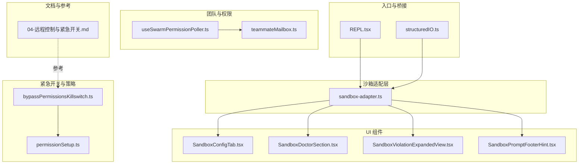
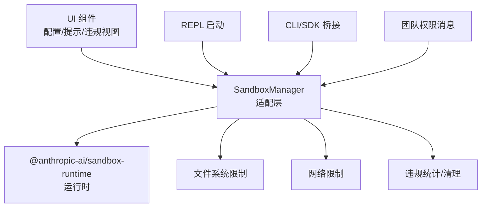
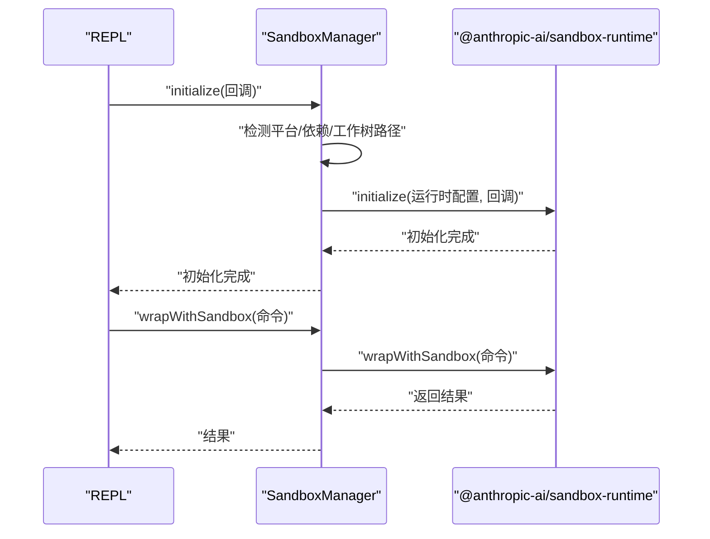
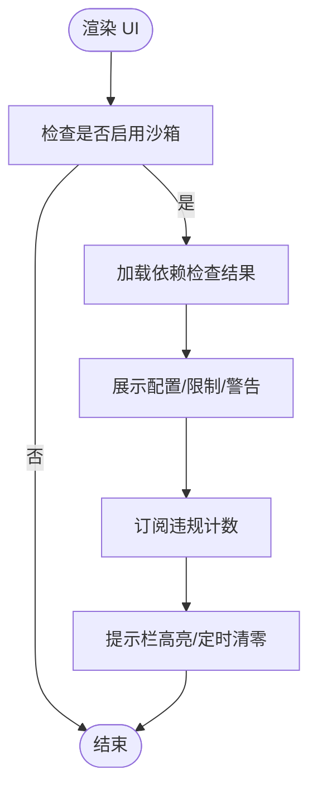
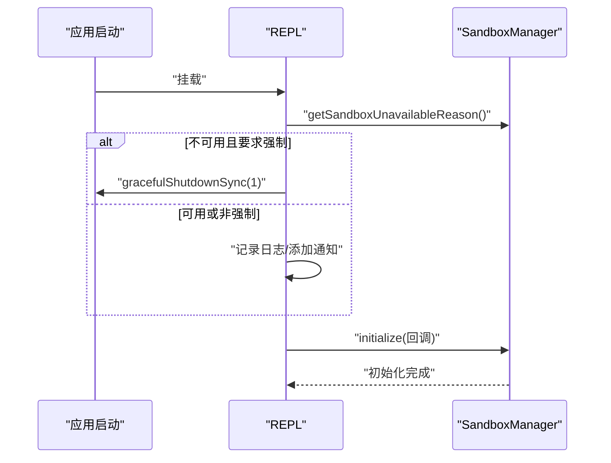
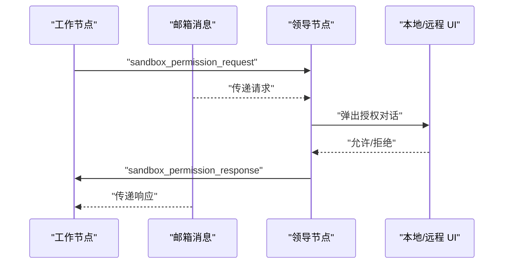
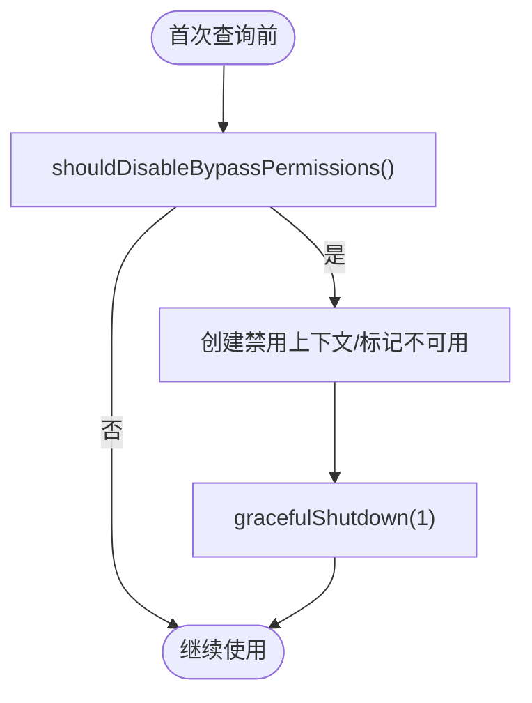
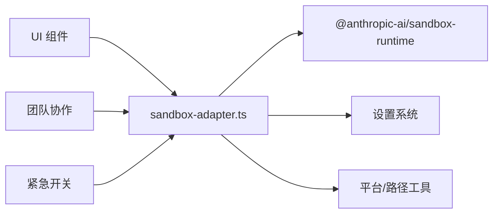

# 沙箱执行机制

<cite>
**本文引用的文件**
- [sandbox-adapter.ts](file://src/utils/sandbox/sandbox-adapter.ts)
- [sandbox-ui-utils.ts](file://src/utils/sandbox/sandbox-ui-utils.ts)
- [SandboxConfigTab.tsx](file://src/components/sandbox/SandboxConfigTab.tsx)
- [SandboxDoctorSection.tsx](file://src/components/sandbox/SandboxDoctorSection.tsx)
- [SandboxViolationExpandedView.tsx](file://src/components/SandboxViolationExpandedView.tsx)
- [SandboxPromptFooterHint.tsx](file://src/components/PromptInput/SandboxPromptFooterHint.tsx)
- [REPL.tsx](file://src/screens/REPL.tsx)
- [structuredIO.ts](file://src/cli/structuredIO.ts)
- [useSwarmPermissionPoller.ts](file://src/hooks/useSwarmPermissionPoller.ts)
- [teammateMailbox.ts](file://src/utils/teammateMailbox.ts)
- [bypassPermissionsKillswitch.ts](file://src/utils/permissions/bypassPermissionsKillswitch.ts)
- [permissionSetup.ts](file://src/utils/permissions/permissionSetup.ts)
- [index.ts](file://src/services/analytics/index.ts)
- [04-远程控制与紧急开关.md](file://docs/zh/04-远程控制与紧急开关.md)
</cite>

## 目录
1. [简介](#简介)
2. [项目结构](#项目结构)
3. [核心组件](#核心组件)
4. [架构总览](#架构总览)
5. [详细组件分析](#详细组件分析)
6. [依赖关系分析](#依赖关系分析)
7. [性能考虑](#性能考虑)
8. [故障排除指南](#故障排除指南)
9. [结论](#结论)
10. [附录](#附录)

## 简介
本文件系统化阐述 Claude Code 的沙箱执行机制，涵盖安全隔离原理、适配器设计与工作流程、与 UI 的集成与交互、绕过权限的紧急开关机制与安全控制、性能影响与优化策略、监控与故障排除方法，以及在不同操作系统上的实现差异。目标是帮助开发者与运维人员全面理解并正确配置与使用沙箱。

## 项目结构
围绕沙箱的关键目录与文件包括：
- 适配层与运行时封装：src/utils/sandbox/sandbox-adapter.ts
- UI 展示与提示：src/components/sandbox/*.tsx、src/components/PromptInput/SandboxPromptFooterHint.tsx、src/components/SandboxViolationExpandedView.tsx
- REPL 启动与初始化：src/screens/REPL.tsx
- 权限请求桥接（CLI/SDK）：src/cli/structuredIO.ts
- 团队协作与权限消息：src/hooks/useSwarmPermissionPoller.ts、src/utils/teammateMailbox.ts
- 绕过权限紧急开关：src/utils/permissions/bypassPermissionsKillswitch.ts、src/utils/permissions/permissionSetup.ts
- 文档与参考：docs/zh/04-远程控制与紧急开关.md

**图表来源**
- [sandbox-adapter.ts](file://src/utils/sandbox/sandbox-adapter.ts)
- [SandboxConfigTab.tsx](file://src/components/sandbox/SandboxConfigTab.tsx)
- [SandboxDoctorSection.tsx](file://src/components/sandbox/SandboxDoctorSection.tsx)
- [SandboxViolationExpandedView.tsx](file://src/components/SandboxViolationExpandedView.tsx)
- [SandboxPromptFooterHint.tsx](file://src/components/PromptInput/SandboxPromptFooterHint.tsx)
- [REPL.tsx](file://src/screens/REPL.tsx)
- [structuredIO.ts](file://src/cli/structuredIO.ts)
- [useSwarmPermissionPoller.ts](file://src/hooks/useSwarmPermissionPoller.ts)
- [teammateMailbox.ts](file://src/utils/teammateMailbox.ts)
- [bypassPermissionsKillswitch.ts](file://src/utils/permissions/bypassPermissionsKillswitch.ts)
- [permissionSetup.ts](file://src/utils/permissions/permissionSetup.ts)
- [04-远程控制与紧急开关.md](file://docs/zh/04-远程控制与紧急开关.md)

**章节来源**
- [sandbox-adapter.ts](file://src/utils/sandbox/sandbox-adapter.ts)
- [SandboxConfigTab.tsx](file://src/components/sandbox/SandboxConfigTab.tsx)
- [SandboxDoctorSection.tsx](file://src/components/sandbox/SandboxDoctorSection.tsx)
- [SandboxViolationExpandedView.tsx](file://src/components/SandboxViolationExpandedView.tsx)
- [SandboxPromptFooterHint.tsx](file://src/components/PromptInput/SandboxPromptFooterHint.tsx)
- [REPL.tsx](file://src/screens/REPL.tsx)
- [structuredIO.ts](file://src/cli/structuredIO.ts)
- [useSwarmPermissionPoller.ts](file://src/hooks/useSwarmPermissionPoller.ts)
- [teammateMailbox.ts](file://src/utils/teammateMailbox.ts)
- [bypassPermissionsKillswitch.ts](file://src/utils/permissions/bypassPermissionsKillswitch.ts)
- [permissionSetup.ts](file://src/utils/permissions/permissionSetup.ts)
- [04-远程控制与紧急开关.md](file://docs/zh/04-远程控制与紧急开关.md)

## 核心组件
- 沙箱适配器（SandboxManager）
  - 将外部 sandbox-runtime 包与 Claude CLI 的设置系统、工具集成与附加特性桥接。
  - 提供初始化、依赖检查、平台支持检测、配置转换、网络/文件系统限制、违规统计与清理等能力。
- UI 展示组件
  - 配置页签（SandboxConfigTab）、医生页（SandboxDoctorSection）、违规扩展视图（SandboxViolationExpandedView）、提示栏（SandboxPromptFooterHint）。
- REPL 初始化与错误提示
  - 在启动阶段检测沙箱不可用原因，必要时强制退出；初始化成功后包装命令执行。
- 权限请求桥接
  - CLI/SDK 通过 can_use_tool 控制请求转发到宿主进行用户授权。
- 团队协作与消息
  - 工作节点向领导节点发送/接收沙箱网络访问请求与响应，支持本地与远程协同。
- 绕过权限紧急开关
  - 基于 Statsig/GrowthBook 的远程禁用机制，可在特定条件下强制关闭“绕过权限”模式。

**章节来源**
- [sandbox-adapter.ts](file://src/utils/sandbox/sandbox-adapter.ts)
- [SandboxConfigTab.tsx](file://src/components/sandbox/SandboxConfigTab.tsx)
- [SandboxDoctorSection.tsx](file://src/components/sandbox/SandboxDoctorSection.tsx)
- [SandboxViolationExpandedView.tsx](file://src/components/SandboxViolationExpandedView.tsx)
- [SandboxPromptFooterHint.tsx](file://src/components/PromptInput/SandboxPromptFooterHint.tsx)
- [REPL.tsx](file://src/screens/REPL.tsx)
- [structuredIO.ts](file://src/cli/structuredIO.ts)
- [useSwarmPermissionPoller.ts](file://src/hooks/useSwarmPermissionPoller.ts)
- [teammateMailbox.ts](file://src/utils/teammateMailbox.ts)
- [bypassPermissionsKillswitch.ts](file://src/utils/permissions/bypassPermissionsKillswitch.ts)
- [permissionSetup.ts](file://src/utils/permissions/permissionSetup.ts)

## 架构总览
沙箱执行机制采用“适配层 + 外部运行时 + UI/CLI/团队协作”的分层设计：
- 适配层负责将设置转换为运行时配置、处理平台差异、管理依赖与初始化、暴露统一接口。
- 外部运行时负责实际的容器/隔离执行与资源限制。
- UI/CLI/团队协作模块负责展示、交互与跨进程/跨设备的权限决策。

**图表来源**
- [sandbox-adapter.ts](file://src/utils/sandbox/sandbox-adapter.ts)
- [SandboxConfigTab.tsx](file://src/components/sandbox/SandboxConfigTab.tsx)
- [SandboxDoctorSection.tsx](file://src/components/sandbox/SandboxDoctorSection.tsx)
- [SandboxViolationExpandedView.tsx](file://src/components/SandboxViolationExpandedView.tsx)
- [SandboxPromptFooterHint.tsx](file://src/components/PromptInput/SandboxPromptFooterHint.tsx)
- [REPL.tsx](file://src/screens/REPL.tsx)
- [structuredIO.ts](file://src/cli/structuredIO.ts)
- [useSwarmPermissionPoller.ts](file://src/hooks/useSwarmPermissionPoller.ts)
- [teammateMailbox.ts](file://src/utils/teammateMailbox.ts)

## 详细组件分析

### 沙箱适配器（SandboxManager）
- 职责
  - 平台支持检测与依赖检查（含 memoized 缓存）。
  - 将设置系统转换为运行时配置（网络域、文件系统路径、代理、忽略违规等）。
  - 初始化运行时、订阅设置变化动态更新配置、提供 wrapWithSandbox 包装命令执行。
  - 提供违规存储、清理裸仓库文件、Linux glob 警告、重置状态等。
- 关键流程
  - 初始化：检测平台与依赖、解析工作树主仓库路径、构建配置、订阅设置变更、启用日志监控（macOS）。
  - 包装执行：确保初始化完成，调用运行时 wrapWithSandbox。
  - 清理：命令结束后清理裸仓库文件，避免被宿主环境的 git 发现。

**图表来源**
- [sandbox-adapter.ts](file://src/utils/sandbox/sandbox-adapter.ts)
- [REPL.tsx](file://src/screens/REPL.tsx)

**章节来源**
- [sandbox-adapter.ts](file://src/utils/sandbox/sandbox-adapter.ts)

### UI 集成与交互
- 配置页签（SandboxConfigTab）
  - 展示当前启用状态、依赖警告、文件系统读写限制、网络限制、允许的 Unix Socket、排除命令、Linux glob 警告等。
- 医生页（SandboxDoctorSection）
  - 在支持平台且已启用时，显示依赖错误/警告与安装指引。
- 违规扩展视图（SandboxViolationExpandedView）
  - 在非 Linux 平台展示累计违规数量与最近事件列表。
- 提示栏（SandboxPromptFooterHint）
  - 订阅违规计数，短期高亮提示用户近期违规次数。

**图表来源**
- [SandboxConfigTab.tsx](file://src/components/sandbox/SandboxConfigTab.tsx)
- [SandboxDoctorSection.tsx](file://src/components/sandbox/SandboxDoctorSection.tsx)
- [SandboxViolationExpandedView.tsx](file://src/components/SandboxViolationExpandedView.tsx)
- [SandboxPromptFooterHint.tsx](file://src/components/PromptInput/SandboxPromptFooterHint.tsx)

**章节来源**
- [SandboxConfigTab.tsx](file://src/components/sandbox/SandboxConfigTab.tsx)
- [SandboxDoctorSection.tsx](file://src/components/sandbox/SandboxDoctorSection.tsx)
- [SandboxViolationExpandedView.tsx](file://src/components/SandboxViolationExpandedView.tsx)
- [SandboxPromptFooterHint.tsx](file://src/components/PromptInput/SandboxPromptFooterHint.tsx)

### REPL 启动与初始化
- 启动时检测沙箱不可用原因，若用户显式要求且不可用则强制退出；否则记录调试日志并通知用户。
- 初始化成功后，后续命令通过 SandboxManager.wrapWithSandbox 执行。

**图表来源**
- [REPL.tsx](file://src/screens/REPL.tsx)
- [sandbox-adapter.ts](file://src/utils/sandbox/sandbox-adapter.ts)

**章节来源**
- [REPL.tsx](file://src/screens/REPL.tsx)
- [sandbox-adapter.ts](file://src/utils/sandbox/sandbox-adapter.ts)

### 权限请求与团队协作
- CLI/SDK 桥接
  - 将网络访问请求封装为 can_use_tool 控制请求，交由宿主进行用户授权。
- 团队协作
  - 工作节点通过邮箱消息发送/接收沙箱网络访问请求与响应，支持本地与远程协同，统一解析与去重。

**图表来源**
- [structuredIO.ts](file://src/cli/structuredIO.ts)
- [useSwarmPermissionPoller.ts](file://src/hooks/useSwarmPermissionPoller.ts)
- [teammateMailbox.ts](file://src/utils/teammateMailbox.ts)

**章节来源**
- [structuredIO.ts](file://src/cli/structuredIO.ts)
- [useSwarmPermissionPoller.ts](file://src/hooks/useSwarmPermissionPoller.ts)
- [teammateMailbox.ts](file://src/utils/teammateMailbox.ts)

### 绕过权限的紧急开关机制与安全控制
- 远程禁用机制
  - 基于 Statsig/GrowthBook 的门控（gate），可异步检查并禁用“绕过权限”模式，必要时触发优雅退出。
- 本地禁用
  - 若门控判定应禁用，则在应用状态中创建禁用上下文，移除“绕过权限”模式并标记不可用。
- 文档参考
  - 文档明确指出远程控制与紧急开关的广泛存在与无用户可见性/同意机制。

**图表来源**
- [bypassPermissionsKillswitch.ts](file://src/utils/permissions/bypassPermissionsKillswitch.ts)
- [permissionSetup.ts](file://src/utils/permissions/permissionSetup.ts)
- [04-远程控制与紧急开关.md](file://docs/zh/04-远程控制与紧急开关.md)

**章节来源**
- [bypassPermissionsKillswitch.ts](file://src/utils/permissions/bypassPermissionsKillswitch.ts)
- [permissionSetup.ts](file://src/utils/permissions/permissionSetup.ts)
- [04-远程控制与紧急开关.md](file://docs/zh/04-远程控制与紧急开关.md)

## 依赖关系分析
- 适配层依赖
  - 外部运行时：@anthropic-ai/sandbox-runtime
  - 设置系统：合并后的 SettingsJson，支持多来源覆盖
  - 平台与路径工具：平台检测、路径展开、工作树检测
- UI 依赖
  - SandboxManager 接口，违规存储订阅
- 团队协作依赖
  - 邮箱消息协议与回调注册表
- 紧急开关依赖
  - Statsig/GrowthBook 门控与应用状态更新

**图表来源**
- [sandbox-adapter.ts](file://src/utils/sandbox/sandbox-adapter.ts)
- [SandboxConfigTab.tsx](file://src/components/sandbox/SandboxConfigTab.tsx)
- [SandboxDoctorSection.tsx](file://src/components/sandbox/SandboxDoctorSection.tsx)
- [SandboxViolationExpandedView.tsx](file://src/components/SandboxViolationExpandedView.tsx)
- [SandboxPromptFooterHint.tsx](file://src/components/PromptInput/SandboxPromptFooterHint.tsx)
- [useSwarmPermissionPoller.ts](file://src/hooks/useSwarmPermissionPoller.ts)
- [teammateMailbox.ts](file://src/utils/teammateMailbox.ts)
- [bypassPermissionsKillswitch.ts](file://src/utils/permissions/bypassPermissionsKillswitch.ts)
- [permissionSetup.ts](file://src/utils/permissions/permissionSetup.ts)

**章节来源**
- [sandbox-adapter.ts](file://src/utils/sandbox/sandbox-adapter.ts)
- [SandboxConfigTab.tsx](file://src/components/sandbox/SandboxConfigTab.tsx)
- [SandboxDoctorSection.tsx](file://src/components/sandbox/SandboxDoctorSection.tsx)
- [SandboxViolationExpandedView.tsx](file://src/components/SandboxViolationExpandedView.tsx)
- [SandboxPromptFooterHint.tsx](file://src/components/PromptInput/SandboxPromptFooterHint.tsx)
- [useSwarmPermissionPoller.ts](file://src/hooks/useSwarmPermissionPoller.ts)
- [teammateMailbox.ts](file://src/utils/teammateMailbox.ts)
- [bypassPermissionsKillswitch.ts](file://src/utils/permissions/bypassPermissionsKillswitch.ts)
- [permissionSetup.ts](file://src/utils/permissions/permissionSetup.ts)

## 性能考虑
- 初始化成本
  - 依赖检查与平台检测采用 memoized 缓存，避免重复开销。
  - 初始化完成后，wrapWithSandbox 直接委托运行时，延迟最小。
- 配置更新
  - 设置变更通过订阅器动态更新运行时配置，避免重启。
- 文件系统与网络
  - 通过 deny/allow 列表精确控制，减少不必要的挂载与网络连接。
- Linux/WSL 限制
  - 不支持通配符 glob，需注意规则匹配差异，避免频繁失败导致重试开销。

[本节为通用指导，不直接分析具体文件]

## 故障排除指南
- 沙箱不可用原因
  - 平台不支持（WSL1、非支持平台）、依赖缺失、enabledPlatforms 限制。
  - REPL 启动时会输出明确原因；必要时强制退出。
- 依赖检查与医生页
  - 医生页会显示错误/警告；按提示安装依赖或调整设置。
- 违规与清理
  - 使用违规扩展视图查看最近事件；命令结束后自动清理裸仓库文件。
- CLI/SDK 权限请求
  - 若请求被拒绝，检查宿主侧授权流程与网络可达性。
- 紧急开关
  - 若“绕过权限”被远程禁用，需等待门控恢复或联系管理员。

**章节来源**
- [REPL.tsx](file://src/screens/REPL.tsx)
- [SandboxDoctorSection.tsx](file://src/components/sandbox/SandboxDoctorSection.tsx)
- [SandboxViolationExpandedView.tsx](file://src/components/SandboxViolationExpandedView.tsx)
- [sandbox-adapter.ts](file://src/utils/sandbox/sandbox-adapter.ts)
- [structuredIO.ts](file://src/cli/structuredIO.ts)
- [bypassPermissionsKillswitch.ts](file://src/utils/permissions/bypassPermissionsKillswitch.ts)
- [permissionSetup.ts](file://src/utils/permissions/permissionSetup.ts)

## 结论
Claude Code 的沙箱执行机制通过适配层将设置系统与外部运行时解耦，提供统一的初始化、配置转换、权限控制与 UI 集成。其在 macOS 上默认启用日志监控，在 Linux/WSL 上具备平台差异与限制。团队协作与 CLI/SDK 桥接确保跨设备的权限一致决策。紧急开关机制允许在特定情况下远程禁用“绕过权限”，保障企业级安全策略落地。建议在生产环境中启用沙箱，并结合医生页与违规视图持续监控。

[本节为总结，不直接分析具体文件]

## 附录

### 不同操作系统上的实现差异
- macOS
  - 默认启用日志监控，便于审计与问题定位。
- Linux/WSL
  - 不支持通配符 glob，需调整规则；WSL1 不受支持，WSL2 受支持。
- 平台限制
  - 支持列表可通过 enabledPlatforms 进行细粒度控制。

**章节来源**
- [sandbox-adapter.ts](file://src/utils/sandbox/sandbox-adapter.ts)

### 监控与日志
- 违规统计
  - 通过 SandboxManager.getSandboxViolationStore 订阅事件，UI 展示累计与最近事件。
- 日志输出
  - 初始化失败、配置更新、沙箱不可用原因等均记录调试日志。
- 分析事件
  - 通过分析服务接口记录事件元数据（采样与队列机制）。

**章节来源**
- [SandboxViolationExpandedView.tsx](file://src/components/SandboxViolationExpandedView.tsx)
- [sandbox-adapter.ts](file://src/utils/sandbox/sandbox-adapter.ts)
- [index.ts](file://src/services/analytics/index.ts)