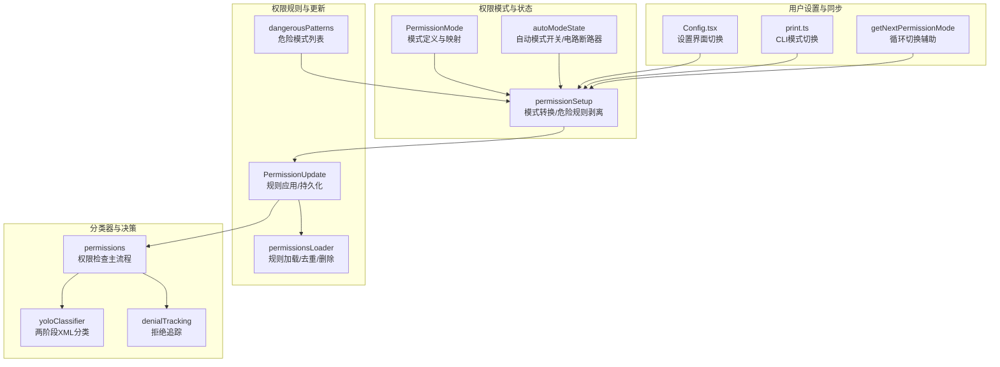
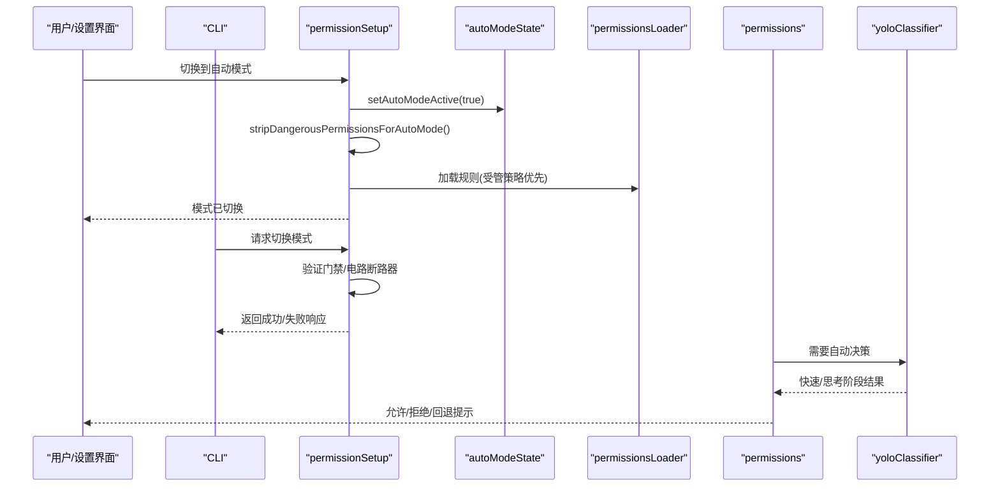
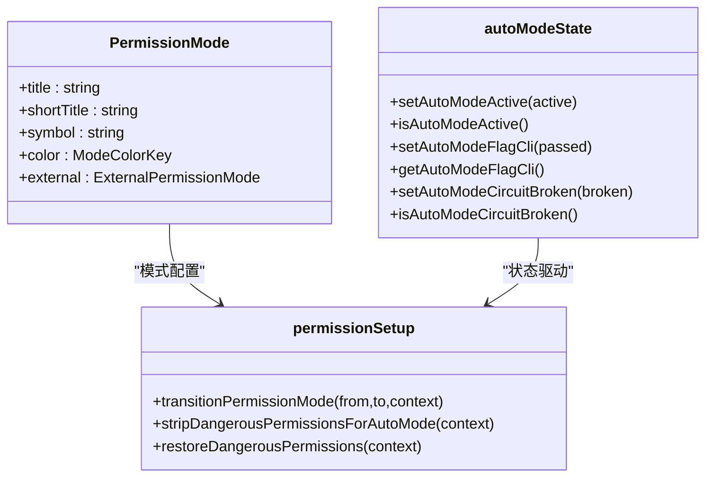
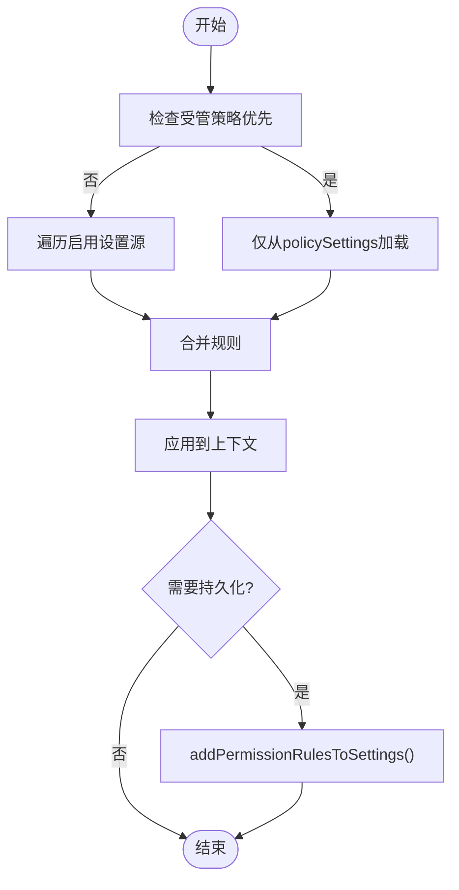
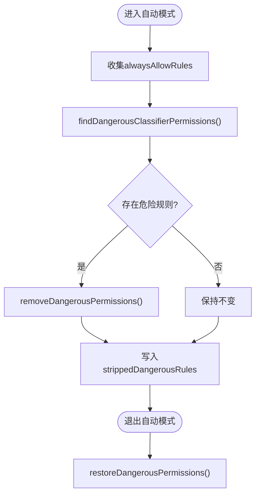
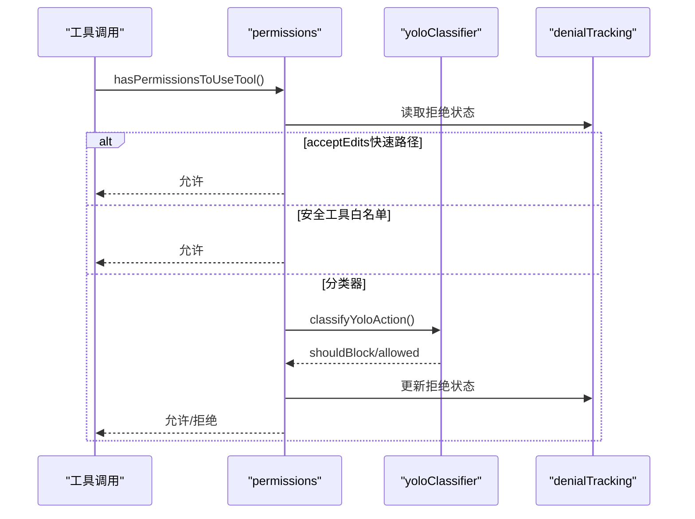
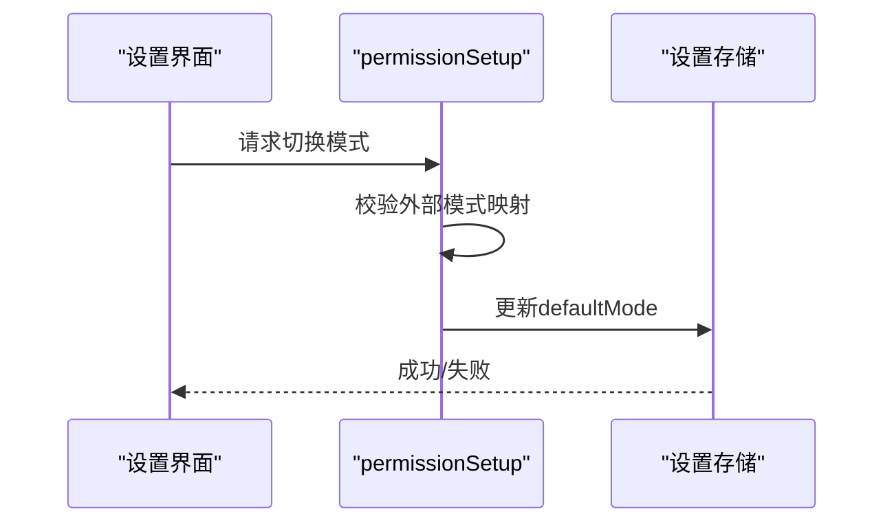
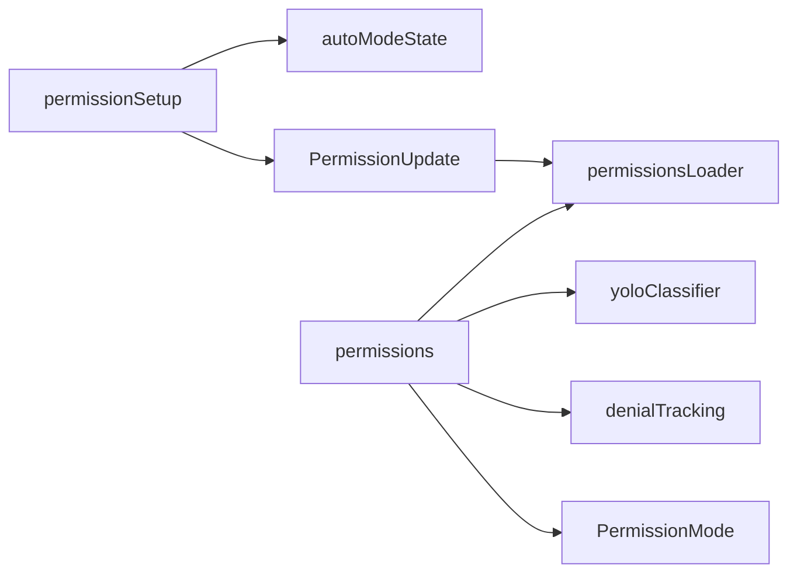

# 自动模式权限管理

<cite>
**本文档引用的文件**
- [permissionSetup.ts](file://src/utils/permissions/permissionSetup.ts)
- [PermissionMode.ts](file://src/utils/permissions/PermissionMode.ts)
- [PermissionUpdate.ts](file://src/utils/permissions/PermissionUpdate.ts)
- [permissionsLoader.ts](file://src/utils/permissions/permissionsLoader.ts)
- [autoModeState.ts](file://src/utils/permissions/autoModeState.ts)
- [permissions.ts](file://src/utils/permissions/permissions.ts)
- [dangerousPatterns.ts](file://src/utils/permissions/dangerousPatterns.ts)
- [yoloClassifier.ts](file://src/utils/permissions/yoloClassifier.ts)
- [denialTracking.ts](file://src/utils/permissions/denialTracking.ts)
- [permissions.ts（类型定义）](file://src/types/permissions.ts)
- [Config.tsx](file://src/components/Settings/Config.tsx)
- [print.ts](file://src/cli/print.ts)
- [getNextPermissionMode.ts](file://src/utils/permissions/getNextPermissionMode.ts)
</cite>

## 目录
1. [简介](#简介)
2. [项目结构](#项目结构)
3. [核心组件](#核心组件)
4. [架构总览](#架构总览)
5. [详细组件分析](#详细组件分析)
6. [依赖关系分析](#依赖关系分析)
7. [性能考虑](#性能考虑)
8. [故障排除指南](#故障排除指南)
9. [结论](#结论)
10. [附录](#附录)

## 简介
本文件面向Claude Code自动模式权限管理，系统性阐述自动模式下的权限状态管理、配置机制、权限加载器与持久化、日志与审计、自动/手动模式差异与转换、性能优化与资源管理、监控与调试方法，以及与用户设置的同步机制。文档以代码级分析为基础，辅以可视化图表，帮助开发者与运维人员快速理解并高效维护自动模式权限体系。

## 项目结构
自动模式权限管理主要由以下模块构成：
- 权限模式与状态：定义与转换自动/手动模式，管理自动模式开关与电路断路器状态
- 权限规则与更新：解析、应用、持久化权限规则，支持多来源合并与去重
- 权限加载器：从设置源加载规则，支持受管策略优先与编辑源过滤
- 安全检查与危险规则剥离：在进入自动模式时剥离可能绕过分类器的安全风险规则
- 分类器与决策：基于对话历史构建分类器输入，执行两阶段XML分类，结合拒绝追踪决定是否回退到交互式提示
- 日志与审计：记录分类器调用、决策原因、令牌用量与成本，支持错误转储与分析
- 用户设置同步：通过设置界面与命令行切换模式，并持久化默认模式

**图表来源**
- [PermissionMode.ts:1-142](file://src/utils/permissions/PermissionMode.ts#L1-L142)
- [autoModeState.ts:1-40](file://src/utils/permissions/autoModeState.ts#L1-L40)
- [permissionSetup.ts:597-646](file://src/utils/permissions/permissionSetup.ts#L597-L646)
- [PermissionUpdate.ts:55-188](file://src/utils/permissions/PermissionUpdate.ts#L55-L188)
- [permissionsLoader.ts:120-145](file://src/utils/permissions/permissionsLoader.ts#L120-L145)
- [dangerousPatterns.ts:1-81](file://src/utils/permissions/dangerousPatterns.ts#L1-L81)
- [permissions.ts:473-800](file://src/utils/permissions/permissions.ts#L473-L800)
- [yoloClassifier.ts:711-800](file://src/utils/permissions/yoloClassifier.ts#L711-L800)
- [denialTracking.ts:1-46](file://src/utils/permissions/denialTracking.ts#L1-L46)
- [Config.tsx:508-521](file://src/components/Settings/Config.tsx#L508-L521)
- [print.ts:4602-4642](file://src/cli/print.ts#L4602-L4642)
- [getNextPermissionMode.ts:1-29](file://src/utils/permissions/getNextPermissionMode.ts#L1-L29)

**章节来源**
- [PermissionMode.ts:1-142](file://src/utils/permissions/PermissionMode.ts#L1-L142)
- [autoModeState.ts:1-40](file://src/utils/permissions/autoModeState.ts#L1-L40)
- [permissionSetup.ts:597-646](file://src/utils/permissions/permissionSetup.ts#L597-L646)
- [PermissionUpdate.ts:55-188](file://src/utils/permissions/PermissionUpdate.ts#L55-L188)
- [permissionsLoader.ts:120-145](file://src/utils/permissions/permissionsLoader.ts#L120-L145)
- [dangerousPatterns.ts:1-81](file://src/utils/permissions/dangerousPatterns.ts#L1-L81)
- [permissions.ts:473-800](file://src/utils/permissions/permissions.ts#L473-L800)
- [yoloClassifier.ts:711-800](file://src/utils/permissions/yoloClassifier.ts#L711-L800)
- [denialTracking.ts:1-46](file://src/utils/permissions/denialTracking.ts#L1-L46)
- [Config.tsx:508-521](file://src/components/Settings/Config.tsx#L508-L521)
- [print.ts:4602-4642](file://src/cli/print.ts#L4602-L4642)
- [getNextPermissionMode.ts:1-29](file://src/utils/permissions/getNextPermissionMode.ts#L1-L29)

## 核心组件
- 权限模式与状态
  - 模式定义与外部映射：支持default、plan、acceptEdits、bypassPermissions、dontAsk、auto等；auto仅ant用户可用
  - 自动模式开关与电路断路器：跟踪自动模式激活状态、CLI标志位、电路断路器状态
  - 模式转换：统一处理Plan/自动模式进入/退出、危险规则剥离与恢复
- 权限规则与更新
  - 规则应用：addRules/replaceRules/removeRules/addDirectories/removeDirectories/setMode
  - 持久化：仅对可编辑设置源进行持久化，避免写入策略或标志设置
  - 去重与规范化：按字符串序列化比较，兼容旧版工具名
- 权限加载器
  - 受管策略优先：allowManagedPermissionRulesOnly启用时仅使用policySettings
  - 多源加载：遍历启用设置源，合并规则
  - 编辑与删除：lenient读取保留非验证字段，删除时规范化匹配
- 安全检查与危险规则剥离
  - 危险规则识别：Bash/PowerShell/Agent的高危前缀与通配符
  - 进入自动模式时剥离危险规则并存入上下文stashed，退出时恢复
- 分类器与决策
  - 两阶段XML分类：fast/thinking/both三种模式，首阶段快速判定，必要时第二阶段给出理由
  - 接拒绝追踪：连续/累计拒绝阈值触发回退到交互提示
  - acceptEdits快速路径：安全操作直接放行，减少分类器调用
- 日志与审计
  - 分类器事件：决策、模型、令牌用量、成本、阶段信息、请求ID/消息ID
  - 错误转储：异常时生成错误提示快照，便于共享与分析
- 用户设置同步
  - 设置界面：校验并持久化默认模式，外部模式与内部模式映射
  - CLI：检查分类器门禁，允许模式切换并返回控制响应

**章节来源**
- [PermissionMode.ts:42-91](file://src/utils/permissions/PermissionMode.ts#L42-L91)
- [autoModeState.ts:1-40](file://src/utils/permissions/autoModeState.ts#L1-L40)
- [permissionSetup.ts:597-646](file://src/utils/permissions/permissionSetup.ts#L597-L646)
- [PermissionUpdate.ts:222-342](file://src/utils/permissions/PermissionUpdate.ts#L222-L342)
- [permissionsLoader.ts:120-145](file://src/utils/permissions/permissionsLoader.ts#L120-L145)
- [dangerousPatterns.ts:14-81](file://src/utils/permissions/dangerousPatterns.ts#L14-L81)
- [permissions.ts:473-800](file://src/utils/permissions/permissions.ts#L473-L800)
- [yoloClassifier.ts:711-800](file://src/utils/permissions/yoloClassifier.ts#L711-L800)
- [denialTracking.ts:1-46](file://src/utils/permissions/denialTracking.ts#L1-L46)
- [Config.tsx:508-521](file://src/components/Settings/Config.tsx#L508-L521)
- [print.ts:4602-4642](file://src/cli/print.ts#L4602-L4642)

## 架构总览
自动模式权限管理采用“模式状态—规则应用—分类器决策—审计日志”的闭环架构。模式转换统一入口，危险规则剥离确保自动模式下不绕过分类器；规则持久化保证用户设置与会话状态一致；分类器通过两阶段XML输出格式进行安全判定；拒绝追踪与回退逻辑保障用户体验与安全。

**图表来源**
- [permissionSetup.ts:597-646](file://src/utils/permissions/permissionSetup.ts#L597-L646)
- [autoModeState.ts:11-17](file://src/utils/permissions/autoModeState.ts#L11-L17)
- [permissionsLoader.ts:120-145](file://src/utils/permissions/permissionsLoader.ts#L120-L145)
- [permissions.ts:473-800](file://src/utils/permissions/permissions.ts#L473-L800)
- [yoloClassifier.ts:711-800](file://src/utils/permissions/yoloClassifier.ts#L711-L800)
- [print.ts:4602-4642](file://src/cli/print.ts#L4602-L4642)

## 详细组件分析

### 组件A：权限模式与状态管理
- 模式定义与外部映射
  - 内部模式集合包含auto（ant用户），外部模式集合排除auto
  - 提供模式标题、短标题、符号、颜色与外部映射函数
- 自动模式状态
  - setAutoModeActive/isAutoModeActive：跟踪当前激活状态
  - setAutoModeFlagCli/getAutoModeFlagCli：记录CLI意图
  - setAutoModeCircuitBroken/isAutoModeCircuitBroken：电路断路器，阻止再次进入
- 模式转换
  - transitionPermissionMode：统一处理Plan/自动模式进入/退出
  - 进入自动模式：检查门禁，设置激活，剥离危险规则
  - 退出自动模式：清除激活，附加退出附件，恢复危险规则

**图表来源**
- [PermissionMode.ts:42-91](file://src/utils/permissions/PermissionMode.ts#L42-L91)
- [autoModeState.ts:1-40](file://src/utils/permissions/autoModeState.ts#L1-L40)
- [permissionSetup.ts:597-646](file://src/utils/permissions/permissionSetup.ts#L597-L646)

**章节来源**
- [PermissionMode.ts:42-91](file://src/utils/permissions/PermissionMode.ts#L42-L91)
- [autoModeState.ts:1-40](file://src/utils/permissions/autoModeState.ts#L1-L40)
- [permissionSetup.ts:597-646](file://src/utils/permissions/permissionSetup.ts#L597-L646)

### 组件B：权限规则加载器与持久化
- 规则加载
  - shouldAllowManagedPermissionRulesOnly：启用时仅从policySettings加载
  - loadAllPermissionRulesFromDisk：遍历启用设置源，合并规则
  - getPermissionRulesForSource：从单源解析规则数组
- 规则持久化
  - addPermissionRulesToSettings：去重后追加到目标设置源
  - deletePermissionRuleFromSettings：规范化匹配后删除
  - 支持持久化的来源：userSettings/projectSettings/localSettings
- 编辑友好读取
  - lenient读取：忽略schema验证错误，保留其他字段，避免丢失现有规则

**图表来源**
- [permissionsLoader.ts:120-145](file://src/utils/permissions/permissionsLoader.ts#L120-L145)
- [PermissionUpdate.ts:222-342](file://src/utils/permissions/PermissionUpdate.ts#L222-L342)

**章节来源**
- [permissionsLoader.ts:120-145](file://src/utils/permissions/permissionsLoader.ts#L120-L145)
- [PermissionUpdate.ts:222-342](file://src/utils/permissions/PermissionUpdate.ts#L222-L342)

### 组件C：危险规则识别与剥离
- 危险规则识别
  - Bash：通配符、解释器前缀、跨平台代码执行入口
  - PowerShell：iex、Start-Process等危险cmdlet
  - Agent：任意子代理允许规则绕过分类器
- 剥离与恢复
  - stripDangerousPermissionsForAutoMode：进入自动模式时剥离并存入stashed
  - restoreDangerousPermissions：退出自动模式时恢复，清空stashed

**图表来源**
- [permissionSetup.ts:510-579](file://src/utils/permissions/permissionSetup.ts#L510-L579)
- [dangerousPatterns.ts:14-81](file://src/utils/permissions/dangerousPatterns.ts#L14-L81)

**章节来源**
- [permissionSetup.ts:510-579](file://src/utils/permissions/permissionSetup.ts#L510-L579)
- [dangerousPatterns.ts:14-81](file://src/utils/permissions/dangerousPatterns.ts#L14-L81)

### 组件D：自动模式分类器与决策
- 两阶段XML分类
  - fast：首阶段快速判定，提升吞吐
  - thinking：仅第二阶段，强调链式推理
  - both：首阶段快速，必要时第二阶段深入
- 快速路径
  - acceptEdits模式：安全操作直接放行
  - 安全工具白名单：跳过分类器调用
- 拒绝追踪与回退
  - 连续/累计拒绝超过阈值时回退到交互提示
- 审计与成本
  - 记录模型、令牌用量、成本、阶段信息、请求ID/消息ID
  - 异常时生成错误提示快照，便于诊断

**图表来源**
- [permissions.ts:473-800](file://src/utils/permissions/permissions.ts#L473-L800)
- [yoloClassifier.ts:711-800](file://src/utils/permissions/yoloClassifier.ts#L711-L800)
- [denialTracking.ts:1-46](file://src/utils/permissions/denialTracking.ts#L1-L46)

**章节来源**
- [permissions.ts:473-800](file://src/utils/permissions/permissions.ts#L473-L800)
- [yoloClassifier.ts:711-800](file://src/utils/permissions/yoloClassifier.ts#L711-L800)
- [denialTracking.ts:1-46](file://src/utils/permissions/denialTracking.ts#L1-L46)

### 组件E：用户设置同步与模式切换
- 设置界面
  - 解析用户输入的模式字符串，校验并映射到外部模式
  - 更新userSettings.permissions.defaultMode并处理错误
- CLI
  - 检查分类器门禁与电路断路器，允许切换并返回控制响应
- 循环切换辅助
  - getNextPermissionMode：结合缓存与实时门禁判断是否可切换到自动模式

**图表来源**
- [Config.tsx:508-521](file://src/components/Settings/Config.tsx#L508-L521)
- [permissionSetup.ts:689-800](file://src/utils/permissions/permissionSetup.ts#L689-L800)
- [print.ts:4602-4642](file://src/cli/print.ts#L4602-L4642)
- [getNextPermissionMode.ts:17-29](file://src/utils/permissions/getNextPermissionMode.ts#L17-L29)

**章节来源**
- [Config.tsx:508-521](file://src/components/Settings/Config.tsx#L508-L521)
- [permissionSetup.ts:689-800](file://src/utils/permissions/permissionSetup.ts#L689-L800)
- [print.ts:4602-4642](file://src/cli/print.ts#L4602-L4642)
- [getNextPermissionMode.ts:17-29](file://src/utils/permissions/getNextPermissionMode.ts#L17-L29)

## 依赖关系分析
- 模块耦合
  - permissionSetup依赖autoModeState与权限规则解析/应用模块，负责模式转换与危险规则剥离
  - permissions作为权限检查主流程，依赖分类器、拒绝追踪与设置源
  - permissionsLoader与PermissionUpdate共同完成规则的加载、去重与持久化
- 外部依赖
  - 分类器调用通过sideQuery封装，支持缓存控制与超时重试
  - 审计事件通过analytics服务上报，包含令牌用量、成本与阶段信息
- 循环依赖规避
  - 类型定义移至types目录，避免运行时循环导入

**图表来源**
- [permissionSetup.ts:1-83](file://src/utils/permissions/permissionSetup.ts#L1-L83)
- [permissions.ts:1-94](file://src/utils/permissions/permissions.ts#L1-L94)
- [permissionsLoader.ts:1-25](file://src/utils/permissions/permissionsLoader.ts#L1-L25)
- [PermissionUpdate.ts:1-25](file://src/utils/permissions/PermissionUpdate.ts#L1-L25)
- [yoloClassifier.ts:1-44](file://src/utils/permissions/yoloClassifier.ts#L1-L44)
- [denialTracking.ts:1-46](file://src/utils/permissions/denialTracking.ts#L1-L46)
- [PermissionMode.ts:1-24](file://src/utils/permissions/PermissionMode.ts#L1-L24)

**章节来源**
- [permissionSetup.ts:1-83](file://src/utils/permissions/permissionSetup.ts#L1-L83)
- [permissions.ts:1-94](file://src/utils/permissions/permissions.ts#L1-L94)
- [permissionsLoader.ts:1-25](file://src/utils/permissions/permissionsLoader.ts#L1-L25)
- [PermissionUpdate.ts:1-25](file://src/utils/permissions/PermissionUpdate.ts#L1-L25)
- [yoloClassifier.ts:1-44](file://src/utils/permissions/yoloClassifier.ts#L1-L44)
- [denialTracking.ts:1-46](file://src/utils/permissions/denialTracking.ts#L1-L46)
- [PermissionMode.ts:1-24](file://src/utils/permissions/PermissionMode.ts#L1-L24)

## 性能考虑
- 快速路径优化
  - acceptEdits模式与安全工具白名单直接放行，减少分类器调用
  - PowerShell在特定构建条件下跳过分类器，避免不必要的API开销
- 拒绝追踪与回退
  - 连续/累计拒绝阈值防止频繁分类器调用，必要时回退到交互提示
- 分类器缓存与成本
  - 使用缓存控制与prompt caching，降低令牌用量与成本
  - 记录阶段1/阶段2用量与延迟，用于性能分析与优化
- 资源管理
  - 电路断路器与门禁检查防止在不可用状态下反复尝试
  - 错误转储与分析工具支持快速定位问题，减少无效重试

[本节为通用性能建议，无需具体文件分析]

## 故障排除指南
- 无法切换到自动模式
  - 检查分类器门禁与电路断路器状态，确认模型支持自动模式
  - 查看getAutoModeUnavailableReason返回的原因（设置禁用、电路断路器、模型不支持）
- 分类器异常
  - 查看错误转储路径，包含系统提示、用户提示与上下文对比
  - 关注令牌用量与阶段信息，评估prompt长度与缓存命中率
- 权限规则未生效
  - 确认规则来源是否为可编辑设置源（userSettings/projectSettings/localSettings）
  - 检查受管策略优先设置，确认是否被policySettings覆盖
- 拒绝过多导致回退
  - 检查拒绝追踪状态，调整规则或使用acceptEdits模式

**章节来源**
- [permissionSetup.ts:1294-1320](file://src/utils/permissions/permissionSetup.ts#L1294-L1320)
- [yoloClassifier.ts:213-250](file://src/utils/permissions/yoloClassifier.ts#L213-L250)
- [permissionsLoader.ts:31-36](file://src/utils/permissions/permissionsLoader.ts#L31-L36)
- [denialTracking.ts:40-46](file://src/utils/permissions/denialTracking.ts#L40-L46)

## 结论
自动模式权限管理通过严格的模式状态控制、危险规则剥离、两阶段分类器决策与拒绝追踪，实现了在保障安全的前提下提升自动化效率。配合完善的日志与审计、用户设置同步与性能优化策略，系统能够在复杂场景中稳定运行并持续改进。

[本节为总结性内容，无需具体文件分析]

## 附录
- 关键类型定义
  - 模式与行为：PermissionMode、PermissionBehavior
  - 规则与更新：PermissionRule、PermissionUpdate、PermissionUpdateDestination
  - 决策与结果：PermissionDecision、PermissionResult、PermissionDecisionReason
- 常用工具函数
  - 模式转换：transitionPermissionMode
  - 规则应用/持久化：applyPermissionUpdate、persistPermissionUpdate
  - 危险规则检测：isDangerousBashPermission、isDangerousPowerShellPermission、isDangerousTaskPermission
  - 分类器构建：buildYoloSystemPrompt、buildTranscriptEntries、classifyYoloAction

**章节来源**
- [permissions.ts（类型定义）:16-442](file://src/types/permissions.ts#L16-L442)
- [permissionSetup.ts:597-646](file://src/utils/permissions/permissionSetup.ts#L597-L646)
- [PermissionUpdate.ts:55-188](file://src/utils/permissions/PermissionUpdate.ts#L55-L188)
- [dangerousPatterns.ts:94-233](file://src/utils/permissions/dangerousPatterns.ts#L94-L233)
- [yoloClassifier.ts:484-540](file://src/utils/permissions/yoloClassifier.ts#L484-L540)