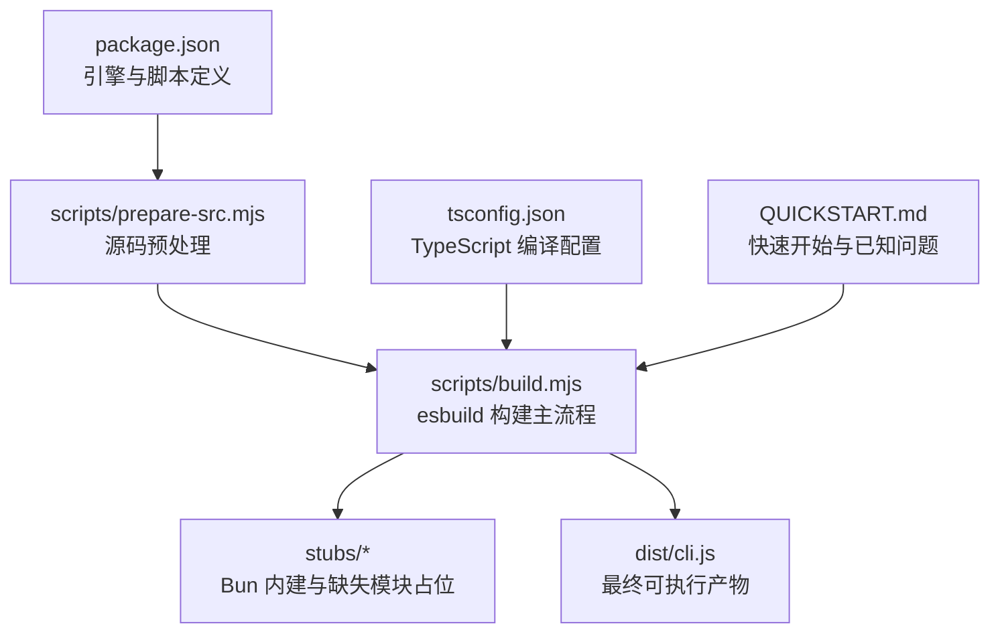
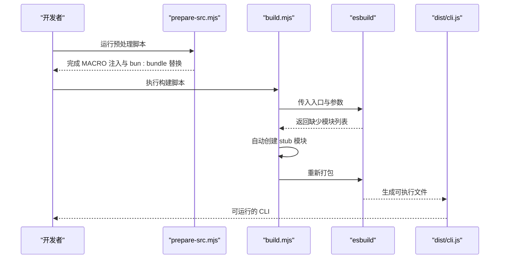
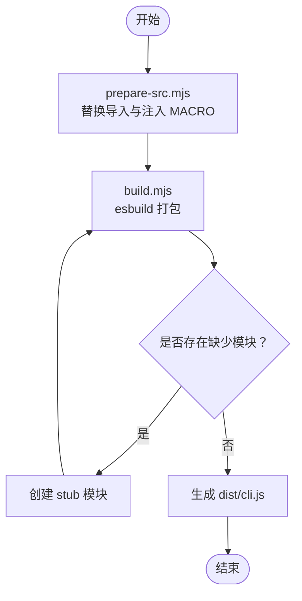
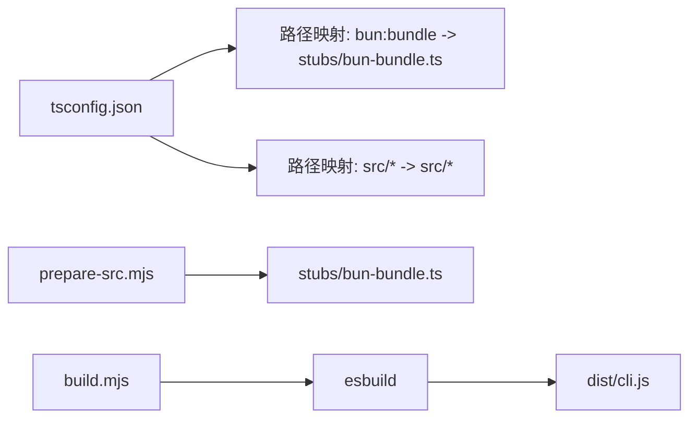

# 开发环境配置

<cite>
**本文档引用的文件**
- [package.json](file://package.json)
- [tsconfig.json](file://tsconfig.json)
- [README.md](file://README.md)
- [QUICKSTART.md](file://QUICKSTART.md)
- [scripts/build.mjs](file://scripts/build.mjs)
- [scripts/prepare-src.mjs](file://scripts/prepare-src.mjs)
- [scripts/stub-modules.mjs](file://scripts/stub-modules.mjs)
- [scripts/transform.mjs](file://scripts/transform.mjs)
- [create-stubs.js](file://create-stubs.js)
- [stubs/global.d.ts](file://stubs/global.d.ts)
- [stubs/macros.d.ts](file://stubs/macros.d.ts)
- [stubs/bun-bundle.ts](file://stubs/bun-bundle.ts)
</cite>

## 目录
1. [简介](#简介)
2. [项目结构](#项目结构)
3. [核心组件](#核心组件)
4. [架构总览](#架构总览)
5. [详细组件分析](#详细组件分析)
6. [依赖关系分析](#依赖关系分析)
7. [性能考虑](#性能考虑)
8. [故障排除指南](#故障排除指南)
9. [结论](#结论)
10. [附录](#附录)

## 简介
本指南面向希望在本地搭建 Claude Code 开发环境的工程师，系统讲解以下内容：
- Node.js 版本要求与环境准备
- TypeScript 编译配置与路径映射
- 开发工具链（esbuild、Bun）的安装与使用
- stub 模块的作用与创建流程
- IDE 配置建议与调试设置
- 开发工作流最佳实践

Claude Code 的源码为 TypeScript，构建系统以 Bun 为核心（包含 compile-time 内建函数），但仓库提供了基于 esbuild 的“尽力而为”构建脚本，可帮助在 Node.js 环境下完成大部分构建工作。

## 项目结构
该仓库采用“源码 + 构建脚本 + stubs”的组织方式：
- src：TypeScript 源码目录（包含大量业务逻辑）
- scripts：构建与预处理脚本（build.mjs、prepare-src.mjs、stub-modules.mjs、transform.mjs）
- stubs：用于替换 Bun 特定内建与缺失模块的占位文件
- dist：构建输出目录
- build-src：构建前的源码副本（经过预处理）

图表来源
- [package.json:1-21](file://package.json#L1-L21)
- [scripts/prepare-src.mjs:1-116](file://scripts/prepare-src.mjs#L1-L116)
- [scripts/build.mjs:1-246](file://scripts/build.mjs#L1-L246)
- [tsconfig.json:1-37](file://tsconfig.json#L1-L37)
- [QUICKSTART.md:1-122](file://QUICKSTART.md#L1-L122)

章节来源
- [README.md:106-122](file://README.md#L106-L122)
- [QUICKSTART.md:1-122](file://QUICKSTART.md#L1-L122)

## 核心组件
- Node.js 与包管理器
  - Node.js 版本要求：>= 18.0.0
  - 推荐使用 npm >= 9
- TypeScript 编译器与配置
  - 目标：ES2022
  - 模块系统：ESNext
  - 解析策略：bundler
  - 输出目录：dist
  - 入口目录：src
  - 类型声明：包含 node 与 DOM
- 构建工具链
  - esbuild：用于打包 CLI
  - Bun：原生支持 compile-time 内建（feature()、MACRO、bun:bundle），用于完整构建
- stub 模块
  - 替换 Bun 特定内建与缺失模块，保证 esbuild 能够解析并打包

章节来源
- [package.json:13-19](file://package.json#L13-L19)
- [tsconfig.json:2-26](file://tsconfig.json#L2-L26)
- [QUICKSTART.md:25-45](file://QUICKSTART.md#L25-L45)

## 架构总览
从源码到可执行 CLI 的关键流程如下：

图表来源
- [scripts/prepare-src.mjs:1-116](file://scripts/prepare-src.mjs#L1-L116)
- [scripts/build.mjs:144-229](file://scripts/build.mjs#L144-L229)

## 详细组件分析

### Node.js 环境与版本要求
- 必须满足 engines.node >= 18.0.0
- 建议使用 npm >= 9
- 若需完整构建，推荐安装 Bun（用于体验原生 compile-time 内建）

章节来源
- [package.json:13-15](file://package.json#L13-L15)
- [QUICKSTART.md:27-30](file://QUICKSTART.md#L27-L30)

### TypeScript 配置详解
- 编译目标与模块系统
  - target: ES2022
  - module: ESNext
  - moduleResolution: bundler（与 esbuild 兼容）
- 类型与声明
  - types: ["node"]
  - lib: ["ES2022", "DOM"]
  - skipLibCheck: true（提升编译速度）
  - strict: false（降低严格性门槛）
- 路径映射与别名
  - "bun:bundle" -> "stubs/bun-bundle.ts"
  - "src/*" -> "src/*"
- 输出与根目录
  - outDir: "dist"
  - rootDir: "src"
- JSX 与 Source Map
  - jsx: "react-jsx"
  - sourceMap: true
  - declaration: true, declarationMap: true

章节来源
- [tsconfig.json:2-26](file://tsconfig.json#L2-L26)

### 构建脚本与工具链
- prepare-src.mjs
  - 将 bun:bundle 导入替换为本地 stub
  - 将 MACRO.X 引用替换为字符串字面量
  - 生成全局类型声明与 bun-ffi 占位
- build.mjs
  - 复制 src 到 build-src
  - 执行多次 esbuild 打包，自动收集缺失模块并创建 stub
  - 最终输出 dist/cli.js
- stub-modules.mjs
  - 通过解析 esbuild 错误，定位缺失模块并批量创建 stub
- transform.mjs
  - 另一种转换策略：直接复制 stub 并注入 MACRO 全局变量
- create-stubs.js
  - 一次性创建大量缺失模块的 stub 文件

章节来源
- [scripts/prepare-src.mjs:1-116](file://scripts/prepare-src.mjs#L1-L116)
- [scripts/build.mjs:1-246](file://scripts/build.mjs#L1-L246)
- [scripts/stub-modules.mjs:1-159](file://scripts/stub-modules.mjs#L1-L159)
- [scripts/transform.mjs:1-144](file://scripts/transform.mjs#L1-L144)
- [create-stubs.js:1-103](file://create-stubs.js#L1-L103)

### stub 模块的作用与创建流程
- 作用
  - 替换 Bun 特定内建（如 feature()、bun:bundle、bun:ffi）
  - 补齐 108 个被死代码消除的 feature-gated 模块
  - 使 esbuild 能够解析并打包，避免“无法解析”错误
- 创建流程
  - 预处理阶段：prepare-src.mjs 将 bun:bundle 导入重写为本地 stub，并生成全局类型声明
  - 构建阶段：build.mjs/transform.mjs/stub-modules.mjs 通过 esbuild 报错信息定位缺失模块，自动生成占位文件
  - 一次性创建：create-stubs.js 提供批量创建能力

图表来源
- [scripts/prepare-src.mjs:40-77](file://scripts/prepare-src.mjs#L40-L77)
- [scripts/build.mjs:144-229](file://scripts/build.mjs#L144-L229)

章节来源
- [QUICKSTART.md:58-87](file://QUICKSTART.md#L58-L87)
- [scripts/build.mjs:196-228](file://scripts/build.mjs#L196-L228)

### IDE 配置建议与调试设置
- VS Code
  - 使用 TypeScript 插件，确保工作区指向 tsconfig.json
  - 启用“在工作区中打开文件夹”，以便正确识别路径映射
  - 设置任务或启动配置，调用 npm 脚本进行检查与构建
- 调试
  - 使用 Node.js 调试器运行 dist/cli.js
  - 在 tsconfig.json 中启用 sourceMap 与 declarationMap，便于断点与类型提示
  - 如需查看 Bun 特有行为，可在本地安装 Bun 并使用其原生构建流程对比

章节来源
- [tsconfig.json:14-16](file://tsconfig.json#L14-L16)
- [package.json:7-11](file://package.json#L7-L11)

### 开发工作流最佳实践
- 快速验证
  - 使用 npm run check 进行类型检查
  - 使用 npm run build 生成 dist/cli.js
- 逐步修复
  - 当 esbuild 报错时，使用 scripts/stub-modules.mjs 或手动创建缺失模块的 stub
  - 参考 QUICKSTART.md 的“To Fix Remaining Issues”部分
- 完整构建
  - 若需要体验原生 Bun 的 compile-time 内建，安装 Bun 并参考 README.md 中的说明

章节来源
- [package.json:7-11](file://package.json#L7-L11)
- [QUICKSTART.md:72-87](file://QUICKSTART.md#L72-L87)
- [README.md:89-104](file://README.md#L89-L104)

## 依赖关系分析
- 构建依赖
  - esbuild：打包 CLI
  - TypeScript：类型检查与编译
- 运行时依赖
  - 项目自身源码（src）与 stubs
- 路径映射
  - tsconfig.json 将 bun:bundle 映射到 stubs/bun-bundle.ts
  - 将 src/* 映射到实际源码路径

图表来源
- [tsconfig.json:19-22](file://tsconfig.json#L19-L22)
- [scripts/prepare-src.mjs:40-51](file://scripts/prepare-src.mjs#L40-L51)
- [scripts/build.mjs:144-173](file://scripts/build.mjs#L144-L173)

章节来源
- [tsconfig.json:19-22](file://tsconfig.json#L19-L22)
- [scripts/prepare-src.mjs:40-51](file://scripts/prepare-src.mjs#L40-L51)

## 性能考虑
- 编译性能
  - skipLibCheck: true 可显著减少编译时间
  - moduleResolution: bundler 与 esbuild 兼容，有利于快速打包
- 构建迭代
  - 使用多轮 esbuild + 自动创建 stub 的策略，减少手工干预
  - sourcemap 与 declarationMap 便于调试，但会增加构建时间

章节来源
- [tsconfig.json:8-14](file://tsconfig.json#L8-L14)
- [scripts/build.mjs:144-173](file://scripts/build.mjs#L144-L173)

## 故障排除指南
- “Could not resolve”错误
  - 使用 scripts/stub-modules.mjs 自动创建缺失模块的 stub
  - 或参考 create-stubs.js 的批量创建方法
- feature() 与 MACRO 问题
  - 确保 prepare-src.mjs 已执行，将 bun:bundle 导入替换为本地 stub
  - 确认 MACRO.X 已被替换为字符串字面量
- 108 个缺失模块
  - 这些模块在发布包中被死代码消除，属于预期行为
  - 通过 stub 占位即可绕过解析错误

章节来源
- [scripts/stub-modules.mjs:30-102](file://scripts/stub-modules.mjs#L30-L102)
- [scripts/prepare-src.mjs:40-77](file://scripts/prepare-src.mjs#L40-L77)
- [QUICKSTART.md:58-71](file://QUICKSTART.md#L58-L71)

## 结论
本指南总结了在本地搭建 Claude Code 开发环境的关键步骤与注意事项。通过 Node.js 与 esbuild 的组合，可以完成“尽力而为”的构建；若需体验原生 Bun 的 compile-time 内建，建议安装 Bun 并参考官方说明。配合 stub 模块与 IDE 配置，开发者可以在不牺牲可用性的前提下高效开展开发与调试。

## 附录
- 快速开始命令
  - 安装依赖：npm install
  - 类型检查：npm run check
  - 构建：npm run build
- 关键文件清单
  - 构建脚本：scripts/build.mjs、scripts/prepare-src.mjs、scripts/stub-modules.mjs、scripts/transform.mjs
  - 配置文件：tsconfig.json、package.json
  - 占位文件：stubs/bun-bundle.ts、stubs/global.d.ts、stubs/macros.d.ts
  - 批量创建：create-stubs.js

章节来源
- [package.json:7-11](file://package.json#L7-L11)
- [QUICKSTART.md:1-22](file://QUICKSTART.md#L1-L22)