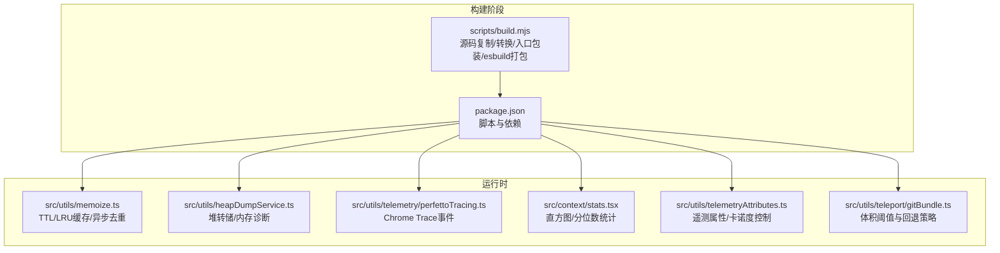
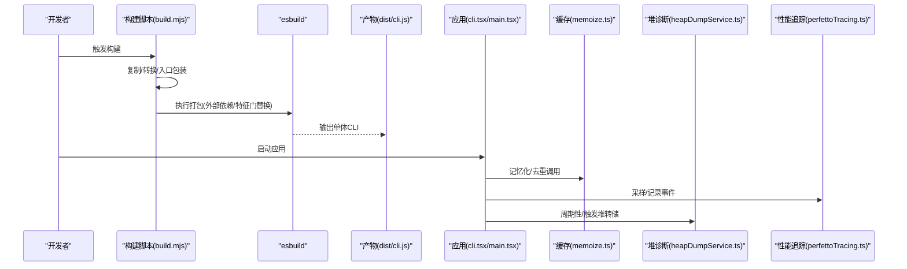
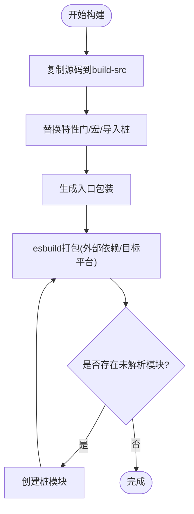
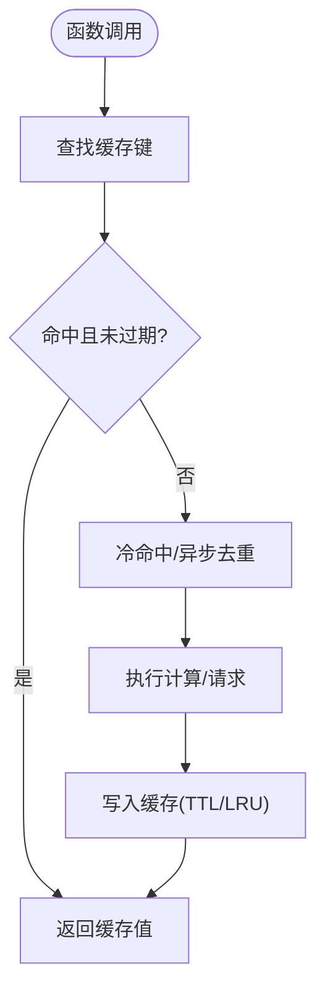
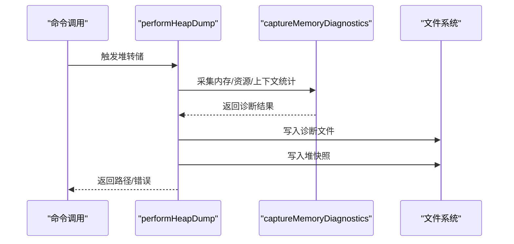
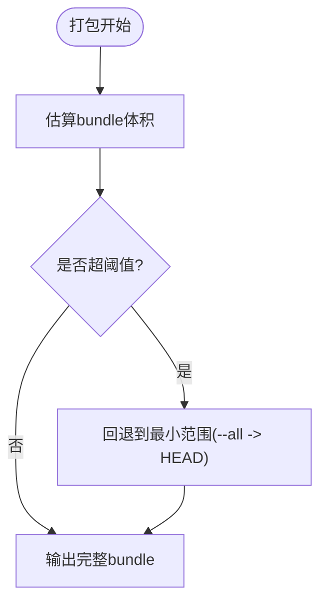
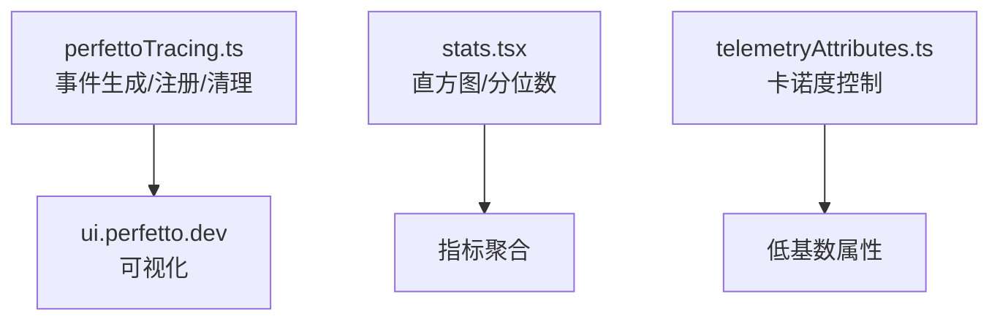
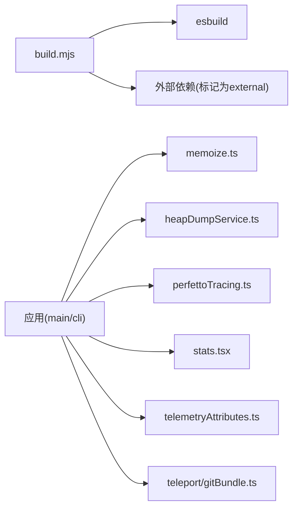

# 性能优化

<cite>
**本文引用的文件**
- [scripts/build.mjs](file://scripts/build.mjs)
- [package.json](file://package.json)
- [src/utils/memoize.ts](file://src/utils/memoize.ts)
- [src/utils/heapDumpService.ts](file://src/utils/heapDumpService.ts)
- [src/commands/heapdump/heapdump.ts](file://src/commands/heapdump/heapdump.ts)
- [src/utils/telemetry/perfettoTracing.ts](file://src/utils/telemetry/perfettoTracing.ts)
- [src/utils/telemetryAttributes.ts](file://src/utils/telemetryAttributes.ts)
- [src/context/stats.tsx](file://src/context/stats.tsx)
- [src/utils/teleport/gitBundle.ts](file://src/utils/teleport/gitBundle.ts)
- [README.md](file://README.md)
</cite>

## 目录
1. [简介](#简介)
2. [项目结构](#项目结构)
3. [核心组件](#核心组件)
4. [架构总览](#架构总览)
5. [详细组件分析](#详细组件分析)
6. [依赖关系分析](#依赖关系分析)
7. [性能考量](#性能考量)
8. [故障排查指南](#故障排查指南)
9. [结论](#结论)
10. [附录](#附录)

## 简介
本指南聚焦于Claude Code在构建期与运行期的性能优化实践，结合仓库中的实际实现，系统阐述以下主题：
- 构建期优化：源码转换、打包策略、外部依赖处理、产物体积控制
- 运行期优化：缓存与记忆化、内存管理与泄漏诊断、并发与异步去重
- 体积控制与包大小优化：按需引入、死代码消除（DCE）、特征门控
- 缓存策略与CDN配置：遥测与日志持久化、磁盘重试与批处理
- 性能监控与分析：Chrome Trace事件格式（Perfetto）、直方图统计、遥测属性
- 性能测试与基准测试：建议方法与可落地步骤

## 项目结构
该项目采用模块化的TypeScript/React架构，入口为CLI与REPL，核心逻辑围绕查询引擎、工具系统、服务层与状态层展开。构建脚本通过esbuild进行打包，并对特性门（feature()）与宏替换进行预处理，以适配非Bun环境。

图表来源
- [scripts/build.mjs](file://scripts/build.mjs)
- [package.json](file://package.json)
- [src/utils/memoize.ts](file://src/utils/memoize.ts)
- [src/utils/heapDumpService.ts](file://src/utils/heapDumpService.ts)
- [src/utils/telemetry/perfettoTracing.ts](file://src/utils/telemetry/perfettoTracing.ts)
- [src/context/stats.tsx](file://src/context/stats.tsx)
- [src/utils/telemetryAttributes.ts](file://src/utils/telemetryAttributes.ts)
- [src/utils/teleport/gitBundle.ts](file://src/utils/teleport/gitBundle.ts)

章节来源
- [README.md](file://README.md)
- [scripts/build.mjs](file://scripts/build.mjs)
- [package.json](file://package.json)

## 核心组件
- 构建与打包：通过迭代式esbuild尝试与自动桩模块生成，确保在Node环境下的可运行打包；对特性门与宏进行静态替换，减少运行期分支判断。
- 缓存与记忆化：提供TTL缓存、异步去重与LRU缓存，兼顾命中率与内存占用，避免重复计算与并发风暴。
- 内存诊断：支持堆转储与内存诊断信息采集，辅助定位V8堆与原生内存泄漏。
- 性能追踪：输出Chrome Trace事件格式，便于在perfetto或chrome://tracing中可视化分析端到端耗时。
- 统计与遥测：直方图统计与遥测属性，用于指标聚合与卡诺度控制，降低高基数带来的开销。
- 体积控制：基于特征门的死代码消除与体积阈值回退策略，保障传输与存储效率。

章节来源
- [scripts/build.mjs](file://scripts/build.mjs)
- [src/utils/memoize.ts](file://src/utils/memoize.ts)
- [src/utils/heapDumpService.ts](file://src/utils/heapDumpService.ts)
- [src/utils/telemetry/perfettoTracing.ts](file://src/utils/telemetry/perfettoTracing.ts)
- [src/context/stats.tsx](file://src/context/stats.tsx)
- [src/utils/telemetryAttributes.ts](file://src/utils/telemetryAttributes.ts)
- [src/utils/teleport/gitBundle.ts](file://src/utils/teleport/gitBundle.ts)

## 架构总览
下图展示从构建到运行的关键路径，以及性能优化点的落位。

图表来源
- [scripts/build.mjs](file://scripts/build.mjs)
- [src/utils/memoize.ts](file://src/utils/memoize.ts)
- [src/utils/heapDumpService.ts](file://src/utils/heapDumpService.ts)
- [src/utils/telemetry/perfettoTracing.ts](file://src/utils/telemetry/perfettoTracing.ts)

## 详细组件分析

### 构建期优化：代码分割、懒加载与缓存机制
- 特征门与宏替换
  - 构建脚本对特性门调用与宏进行静态替换，确保在非Bun环境下也能正确打包。
  - 对缺失模块进行自动桩生成，提升打包成功率。
- 打包策略
  - 使用esbuild进行单体打包，目标平台与版本固定，启用sourcemap便于调试。
  - 将第三方包标记为外部依赖，减少打包体积。
- 懒加载与按需引入
  - 代码中存在动态require与按需启用的功能模块，配合特征门实现“按需加载”，减少初始启动时间与内存占用。
- 缓存机制
  - 构建产物作为缓存基线，后续增量构建可复用已编译模块，缩短构建时间。

图表来源
- [scripts/build.mjs](file://scripts/build.mjs)

章节来源
- [scripts/build.mjs](file://scripts/build.mjs)
- [package.json](file://package.json)

### 运行期优化：缓存与记忆化
- TTL缓存与异步去重
  - 提供同步与异步两种记忆化函数，支持TTL过期与后台刷新，避免阻塞用户响应。
  - 异步记忆化内置“飞行中请求去重”，防止并发冷命中导致的重复计算风暴。
- LRU缓存
  - 面向高频但体量较大的场景，提供LRU淘汰策略，限制内存增长。
- 实践建议
  - 对昂贵的计算或网络请求优先使用记忆化。
  - 针对会话内高频消息处理，结合LRU以控制峰值内存。

图表来源
- [src/utils/memoize.ts](file://src/utils/memoize.ts)

章节来源
- [src/utils/memoize.ts](file://src/utils/memoize.ts)

### 内存管理与垃圾回收优化
- 堆转储与诊断
  - 先写入内存诊断信息，再进行堆快照捕获，避免大堆快照序列化过程中的崩溃与数据偏差。
  - 采集V8堆统计、原生内存、句柄与请求数量等指标，识别潜在泄漏线索。
- 建议
  - 定期触发堆转储，关注detached contexts、活跃句柄与原生内存占比。
  - 在高内存增长场景下，优先检查原生模块与长生命周期对象。

图表来源
- [src/utils/heapDumpService.ts](file://src/utils/heapDumpService.ts)
- [src/commands/heapdump/heapdump.ts](file://src/commands/heapdump/heapdump.ts)

章节来源
- [src/utils/heapDumpService.ts](file://src/utils/heapDumpService.ts)
- [src/commands/heapdump/heapdump.ts](file://src/commands/heapdump/heapdump.ts)

### 体积控制与包大小优化
- 死代码消除（DCE）
  - 通过特征门在构建期剔除未启用的功能模块，显著减少bundle体积。
- 体积阈值与回退策略
  - 在打包前评估体积，超过阈值则回退到更小范围（例如仅HEAD），保证传输与存储效率。
- 依赖外部化
  - 将第三方包标记为外部依赖，由宿主环境提供，进一步压缩产物。

图表来源
- [src/utils/teleport/gitBundle.ts](file://src/utils/teleport/gitBundle.ts)
- [scripts/build.mjs](file://scripts/build.mjs)

章节来源
- [src/utils/teleport/gitBundle.ts](file://src/utils/teleport/gitBundle.ts)
- [scripts/build.mjs](file://scripts/build.mjs)

### 缓存策略与CDN配置
- 遥测与日志持久化
  - 第一方遥测采用批量上报与磁盘重试，失败事件持久化至本地目录，具备高可靠性。
- CDN与远端服务
  - API调用与MCP连接等外部服务通常位于远端，可通过网络层缓存与重试策略提升稳定性。
- 建议
  - 对频繁变更的遥测属性启用卡诺度控制，降低高基数带来的成本。
  - 对远端接口采用幂等与去重策略，避免重复请求。

章节来源
- [docs/en/01-telemetry-and-privacy.md](file://docs/en/01-telemetry-and-privacy.md)
- [src/utils/telemetryAttributes.ts](file://src/utils/telemetryAttributes.ts)

### 性能监控与分析工具
- Perfetto/Chrome Trace
  - 输出Trace事件格式，支持在ui.perfetto.dev或chrome://tracing中查看端到端耗时、工具执行、等待用户输入等。
- 直方图统计
  - 上下文中的直方图模块支持分位数统计与抽样，便于观察延迟分布。
- 遥测属性
  - 通过环境变量控制属性包含范围，平衡可观测性与卡诺度。

图表来源
- [src/utils/telemetry/perfettoTracing.ts](file://src/utils/telemetry/perfettoTracing.ts)
- [src/context/stats.tsx](file://src/context/stats.tsx)
- [src/utils/telemetryAttributes.ts](file://src/utils/telemetryAttributes.ts)

章节来源
- [src/utils/telemetry/perfettoTracing.ts](file://src/utils/telemetry/perfettoTracing.ts)
- [src/context/stats.tsx](file://src/context/stats.tsx)
- [src/utils/telemetryAttributes.ts](file://src/utils/telemetryAttributes.ts)

### 性能测试与基准测试
- 建议方法
  - 使用Chrome Trace导出进行端到端时序分析，定位瓶颈环节（API调用、工具执行、渲染）。
  - 通过直方图统计观察延迟分布，关注P50/P95等分位数。
  - 对热点函数使用记忆化前后对比，验证缓存命中率与吞吐提升。
  - 在不同数据规模下评估体积阈值回退策略对传输时延的影响。
- 可落地步骤
  - 启用Perfetto追踪并定期导出Trace文件，建立回归基线。
  - 在CI中集成体积阈值检查与打包时长告警。
  - 对关键API调用增加遥测埋点，结合直方图统计进行趋势分析。

章节来源
- [src/utils/telemetry/perfettoTracing.ts](file://src/utils/telemetry/perfettoTracing.ts)
- [src/context/stats.tsx](file://src/context/stats.tsx)
- [src/utils/teleport/gitBundle.ts](file://src/utils/teleport/gitBundle.ts)

## 依赖关系分析
- 构建脚本依赖esbuild与Node工具链，负责源码转换、入口包装与打包。
- 运行时组件之间松耦合：缓存、内存诊断、追踪与统计模块均通过独立职责实现，便于替换与扩展。
- 特征门贯穿全链路，既用于构建期DCE，也用于运行期按需启用。

图表来源
- [scripts/build.mjs](file://scripts/build.mjs)
- [src/utils/memoize.ts](file://src/utils/memoize.ts)
- [src/utils/heapDumpService.ts](file://src/utils/heapDumpService.ts)
- [src/utils/telemetry/perfettoTracing.ts](file://src/utils/telemetry/perfettoTracing.ts)
- [src/context/stats.tsx](file://src/context/stats.tsx)
- [src/utils/telemetryAttributes.ts](file://src/utils/telemetryAttributes.ts)
- [src/utils/teleport/gitBundle.ts](file://src/utils/teleport/gitBundle.ts)

章节来源
- [scripts/build.mjs](file://scripts/build.mjs)
- [src/utils/memoize.ts](file://src/utils/memoize.ts)
- [src/utils/heapDumpService.ts](file://src/utils/heapDumpService.ts)
- [src/utils/telemetry/perfettoTracing.ts](file://src/utils/telemetry/perfettoTracing.ts)
- [src/context/stats.tsx](file://src/context/stats.tsx)
- [src/utils/telemetryAttributes.ts](file://src/utils/telemetryAttributes.ts)
- [src/utils/teleport/gitBundle.ts](file://src/utils/teleport/gitBundle.ts)

## 性能考量
- 构建期
  - 通过特征门与宏替换减少运行期分支，提升启动速度。
  - 外部依赖外部化与体积阈值回退，降低首包体积与传输时延。
- 运行期
  - 记忆化与异步去重降低重复计算与并发风暴风险。
  - 堆转储与内存诊断帮助快速定位泄漏根因。
  - Perfetto追踪与直方图统计提供端到端可观测性与趋势分析。

## 故障排查指南
- 构建失败
  - 检查缺失模块列表与自动生成的桩文件，确认路径与类型匹配。
  - 确认esbuild版本与Node版本满足要求。
- 内存问题
  - 使用堆转储命令生成诊断与快照，关注detached contexts与活跃句柄数量。
  - 结合直方图统计观察内存增长速率与峰值。
- 性能瓶颈
  - 导出Trace文件，重点分析API调用、工具执行与用户等待阶段。
  - 对高基数遥测属性进行降维，减少指标维度。

章节来源
- [scripts/build.mjs](file://scripts/build.mjs)
- [src/utils/heapDumpService.ts](file://src/utils/heapDumpService.ts)
- [src/utils/telemetry/perfettoTracing.ts](file://src/utils/telemetry/perfettoTracing.ts)
- [src/context/stats.tsx](file://src/context/stats.tsx)

## 结论
通过构建期的特征门与宏替换、打包策略与体积控制，以及运行期的记忆化、堆诊断与追踪分析，Claude Code在保证功能完整性的同时，实现了可观的性能收益。建议在持续集成中固化体积阈值与追踪导出流程，并结合直方图统计与遥测属性卡诺度控制，形成闭环的性能治理体系。

## 附录
- 关键实现参考路径
  - 构建脚本与打包策略：[scripts/build.mjs](file://scripts/build.mjs)
  - 记忆化与缓存：[src/utils/memoize.ts](file://src/utils/memoize.ts)
  - 堆转储与内存诊断：[src/utils/heapDumpService.ts](file://src/utils/heapDumpService.ts)、[/src/commands/heapdump/heapdump.ts](file://src/commands/heapdump/heapdump.ts)
  - 性能追踪（Perfetto）：[src/utils/telemetry/perfettoTracing.ts](file://src/utils/telemetry/perfettoTracing.ts)
  - 直方图统计：[src/context/stats.tsx](file://src/context/stats.tsx)
  - 遥测属性与卡诺度控制：[src/utils/telemetryAttributes.ts](file://src/utils/telemetryAttributes.ts)
  - 体积阈值与回退策略：[src/utils/teleport/gitBundle.ts](file://src/utils/teleport/gitBundle.ts)