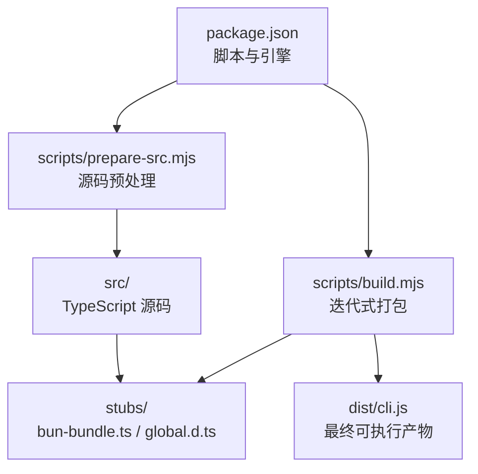
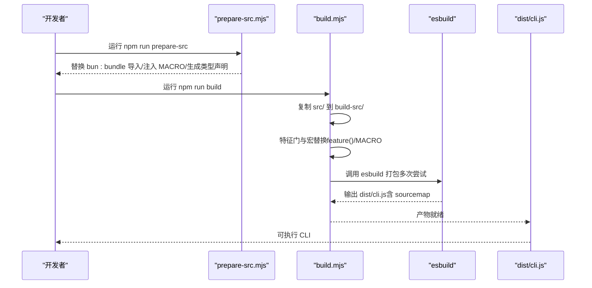
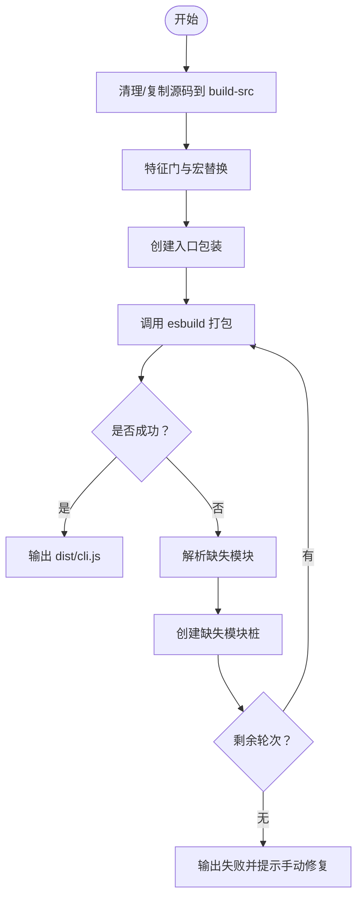
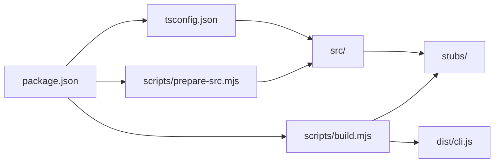

# 构建和部署

<cite>
**本文引用的文件**
- [package.json](file://package.json)
- [tsconfig.json](file://tsconfig.json)
- [README.md](file://README.md)
- [scripts/build.mjs](file://scripts/build.mjs)
- [scripts/prepare-src.mjs](file://scripts/prepare-src.mjs)
- [scripts/stub-modules.mjs](file://scripts/stub-modules.mjs)
- [scripts/transform.mjs](file://scripts/transform.mjs)
- [stubs/bun-bundle.js](file://stubs/bun-bundle.js)
- [stubs/bun-bundle.ts](file://stubs/bun-bundle.ts)
- [stubs/global.d.ts](file://stubs/global.d.ts)
- [src/entrypoints/cli.tsx](file://src/entrypoints/cli.tsx)
- [src/main.tsx](file://src/main.tsx)
</cite>

## 目录
1. [简介](#简介)
2. [项目结构](#项目结构)
3. [核心组件](#核心组件)
4. [架构总览](#架构总览)
5. [详细组件分析](#详细组件分析)
6. [依赖关系分析](#依赖关系分析)
7. [性能考虑](#性能考虑)
8. [故障排除指南](#故障排除指南)
9. [结论](#结论)
10. [附录](#附录)

## 简介
本指南面向希望在本地构建与部署 Claude Code 的工程师与研究者，聚焦于仓库提供的最佳努力构建方案：通过 TypeScript 编译、Bun 特性模拟与 esbuild 打包，生成可运行的单文件 CLI 入口。文档涵盖：
- 构建流程设计与实现（源码准备、特征门替换、模块桩、esbuild 打包）
- 构建脚本的功能与使用方法
- 开发环境配置与工具设置
- 生产环境部署策略与最佳实践
- 包管理与版本控制流程
- 性能优化与体积控制方法
- 常见构建问题的故障排除
- 不同平台的部署注意事项

## 项目结构
仓库采用“源码解包 + 最佳努力重建”的方式组织，核心目录与职责如下：
- scripts：构建与转换脚本（prepare-src、build、stub-modules、transform）
- src：TypeScript 源码（入口、主应用、工具、服务、状态等）
- stubs：Bun 特性桩与全局类型声明
- dist：构建产物输出目录（由脚本生成）
- tsconfig.json：TypeScript 编译配置
- package.json：脚本命令、引擎要求与开发依赖

图表来源
- [package.json:1-21](file://package.json#L1-L21)
- [scripts/prepare-src.mjs:1-116](file://scripts/prepare-src.mjs#L1-L116)
- [scripts/build.mjs:1-246](file://scripts/build.mjs#L1-L246)
- [stubs/bun-bundle.ts:1-5](file://stubs/bun-bundle.ts#L1-L5)
- [stubs/global.d.ts:1-11](file://stubs/global.d.ts#L1-L11)

章节来源
- [package.json:1-21](file://package.json#L1-L21)
- [tsconfig.json:1-37](file://tsconfig.json#L1-L37)

## 核心组件
- 源码准备脚本（prepare-src.mjs）：将 Bun 特定导入替换为本地桩，注入 MACRO 宏值，生成全局类型声明，确保 TypeScript 编译通过。
- 构建脚本（build.mjs）：复制源码到工作目录，进行多轮特征门与宏替换，动态创建缺失模块桩，调用 esbuild 打包，支持失败重试与错误定位。
- 模块桩脚本（stub-modules.mjs）：解析 esbuild 报错中的缺失模块，按路径规则生成桩文件，再尝试打包验证。
- 转换脚本（transform.mjs）：另一种转换策略，直接在构建前注入全局 MACRO 并通过 esbuild define 注入常量。
- 类型配置（tsconfig.json）：启用 bundler 解析、React JSX、声明文件生成与 sourcemap，映射 bun:bundle 到本地桩。
- 入口与主应用（src/entrypoints/cli.tsx、src/main.tsx）：CLI 入口与主应用，大量使用 feature() 作为编译期特征门，配合构建脚本进行死代码消除与替换。

章节来源
- [scripts/prepare-src.mjs:1-116](file://scripts/prepare-src.mjs#L1-L116)
- [scripts/build.mjs:1-246](file://scripts/build.mjs#L1-L246)
- [scripts/stub-modules.mjs:1-159](file://scripts/stub-modules.mjs#L1-L159)
- [scripts/transform.mjs:1-144](file://scripts/transform.mjs#L1-L144)
- [tsconfig.json:1-37](file://tsconfig.json#L1-L37)
- [src/entrypoints/cli.tsx:1-200](file://src/entrypoints/cli.tsx#L1-L200)
- [src/main.tsx:1-200](file://src/main.tsx#L1-L200)

## 架构总览
下图展示从源码到可执行产物的关键步骤与交互。

图表来源
- [scripts/prepare-src.mjs:1-116](file://scripts/prepare-src.mjs#L1-L116)
- [scripts/build.mjs:140-246](file://scripts/build.mjs#L140-L246)
- [package.json:7-12](file://package.json#L7-L12)

## 详细组件分析

### 源码准备（prepare-src.mjs）
- 功能要点
  - 将所有源文件中的 Bun 特定导入（如 bun:bundle）替换为本地桩路径，保证编译器可解析。
  - 使用字符串字面量替换 MACRO.X 引用，避免运行时依赖。
  - 生成全局类型声明文件，声明 MACRO 接口，使 TS 编译通过。
  - 为特定模块创建桩文件（如 bun-ffi），以满足后续打包需求。
- 关键行为
  - 递归遍历 src 目录，对每个 TS/TSX 文件执行替换与写回。
  - 记录被修改的文件数量，便于调试与审计。
- 使用建议
  - 在每次构建前运行该脚本，确保源码处于可编译状态。
  - 若新增使用 Bun 特性的模块，需同步更新桩或替换逻辑。

章节来源
- [scripts/prepare-src.mjs:1-116](file://scripts/prepare-src.mjs#L1-L116)
- [stubs/bun-bundle.ts:1-5](file://stubs/bun-bundle.ts#L1-L5)
- [stubs/global.d.ts:1-11](file://stubs/global.d.ts#L1-L11)

### 构建流程（build.mjs）
- 设计目标
  - 在无 Bun 运行时的情况下，尽可能还原发布包的构建效果。
  - 通过多轮 esbuild + 自动创建桩的方式，逐步补齐缺失模块。
- 流程步骤
  - 清理并复制源码到 build-src，保留原始 src 不受影响。
  - 对 build-src 内的文件执行特征门与宏替换，移除 bun:bundle 导入，修正类型导入。
  - 创建入口包装文件，指向真实 CLI 入口。
  - 调用 esbuild 打包，若报错则解析缺失模块，自动创建桩后重试，最多五轮。
  - 成功后输出 dist/cli.js，并打印大小与使用示例。
- 错误处理
  - 当解析不到缺失模块或存在不可恢复错误时，提示用户检查 build-src 中的转换结果并手动补充桩。
- 产物特性
  - 输出带 banner 的可执行文件，包含版本信息与版权声明。
  - 生成 sourcemap，便于调试。

图表来源
- [scripts/build.mjs:52-246](file://scripts/build.mjs#L52-L246)

章节来源
- [scripts/build.mjs:1-246](file://scripts/build.mjs#L1-L246)

### 模块桩生成（stub-modules.mjs）
- 设计目标
  - 通过解析 esbuild 输出，定位所有“无法解析”的模块，按相对路径规则推断其绝对位置，批量生成桩文件。
- 工作机制
  - 先尝试一次 esbuild，捕获“Could not resolve”错误。
  - 解析每个缺失模块的导入者，计算其在 build-src/src 下的绝对路径。
  - 根据扩展名区分文本资产、类型声明与 JS/TS 模块，分别生成空文件或默认导出函数/对象。
  - 重复上述过程直到打包成功或达到最大尝试次数。
- 适用场景
  - 适合在已知 esbuild 报错但需要快速补齐缺失模块时使用。

章节来源
- [scripts/stub-modules.mjs:1-159](file://scripts/stub-modules.mjs#L1-L159)

### 转换脚本（transform.mjs）
- 设计目标
  - 提供另一种转换思路：在构建前将 bun:bundle 导入替换为本地桩，并通过 esbuild define 注入 MACRO 常量。
- 行为特点
  - 复制 src 与 stubs 到 build-src，替换导入路径。
  - 在入口处注入全局 MACRO 对象，确保运行时可访问。
  - 调用 esbuild 打包，支持可选最小化参数。
- 注意事项
  - 该脚本明确指出源码主要面向阅读/分析而非直接重新编译，复杂 Bun 特性可能仍会失败。

章节来源
- [scripts/transform.mjs:1-144](file://scripts/transform.mjs#L1-L144)

### 类型配置（tsconfig.json）
- 关键配置
  - 模块解析：bundler，适配 esbuild 的解析策略。
  - JSX：react-jsx，匹配 React/Ink 组件。
  - 声明与 sourcemap：开启 declaration、declarationMap、sourceMap。
  - 路径映射：将 bun:bundle 映射到本地桩，确保 TS 编译通过。
  - lib：包含 DOM 与 ES2022，满足浏览器与 Node 环境兼容。
- 影响范围
  - 为 prepare-src 与 build 提供一致的编译上下文，减少类型错误。

章节来源
- [tsconfig.json:1-37](file://tsconfig.json#L1-L37)

### 入口与主应用（src/entrypoints/cli.tsx、src/main.tsx）
- CLI 入口（cli.tsx）
  - 快速路径：仅 --version/-v 时不加载任何模块，直接输出版本。
  - 动态导入：其他路径均采用动态导入，降低首屏加载时间。
  - 特征门：大量 feature() 用于编译期死代码消除，构建脚本会将其替换为 false，从而剔除对应分支。
- 主应用（main.tsx）
  - 启动阶段：记录启动时间线、并行预取系统数据。
  - 权限与策略：初始化权限系统、策略限制、遥测与增长实验。
  - 功能模块：条件加载协调器模式、助理模式、插件与技能等，均由 feature() 控制。

章节来源
- [src/entrypoints/cli.tsx:1-200](file://src/entrypoints/cli.tsx#L1-L200)
- [src/main.tsx:1-200](file://src/main.tsx#L1-L200)

## 依赖关系分析
- 构建脚本依赖
  - Node.js 18+ 与 npm。
  - esbuild（自动安装或显式安装）。
  - 构建产物输出至 dist/cli.js。
- 源码依赖
  - tsconfig.json 将 bun:bundle 映射到本地桩，确保 TS 编译通过。
  - CLI 入口与主应用广泛使用 feature()，构建脚本负责将其替换为 false，实现死代码消除。
- 第三方依赖
  - package.json 中声明 TypeScript 与 esbuild 为开发依赖，用于类型检查与打包。

图表来源
- [package.json:1-21](file://package.json#L1-L21)
- [tsconfig.json:19-22](file://tsconfig.json#L19-L22)
- [scripts/prepare-src.mjs:1-116](file://scripts/prepare-src.mjs#L1-L116)
- [scripts/build.mjs:134-163](file://scripts/build.mjs#L134-L163)

章节来源
- [package.json:1-21](file://package.json#L1-L21)
- [tsconfig.json:1-37](file://tsconfig.json#L1-L37)

## 性能考虑
- 启动性能
  - CLI 入口采用动态导入与快速路径（仅 --version），显著减少首屏模块加载。
  - 主应用在启动早期并行预取系统数据，缩短整体冷启动时间。
- 体积控制
  - 构建脚本通过特征门替换与死代码消除，剔除未启用的功能分支，降低产物体积。
  - esbuild 默认输出单文件，便于分发与部署。
- 资源与缓存
  - 插件与技能的加载采用非阻塞策略，避免影响主流程。
  - 通过迁移与缓存策略减少重复初始化成本。

章节来源
- [src/entrypoints/cli.tsx:33-93](file://src/entrypoints/cli.tsx#L33-L93)
- [src/main.tsx:1-120](file://src/main.tsx#L1-L120)

## 故障排除指南
- esbuild 报错“无法解析模块”
  - 使用 stub-modules.mjs 自动解析缺失模块并生成桩，然后再次尝试打包。
  - 若仍失败，检查 build-src/src 下对应路径是否存在，必要时手动创建桩文件。
- 特征门导致的分支缺失
  - 构建脚本会将 feature('X') 替换为 false，确保未启用功能被剔除。
  - 如需保留某些功能，请在构建前调整源码或构建参数（不推荐）。
- Bun 特性相关错误
  - prepare-src 与 build 已将 bun:bundle 与 bun:ffi 替换为本地桩。
  - 若仍有引用，请在源码中查找并替换为 stubs 下的桩文件。
- TypeScript 类型错误
  - 确保已运行 prepare-src 生成 global.d.ts 与替换后的导入。
  - 检查 tsconfig.json 的路径映射与模块解析策略是否正确。
- Node 版本不兼容
  - 构建脚本与入口均要求 Node >= 18，请确认运行环境满足要求。

章节来源
- [scripts/stub-modules.mjs:21-121](file://scripts/stub-modules.mjs#L21-L121)
- [scripts/build.mjs:175-229](file://scripts/build.mjs#L175-L229)
- [scripts/prepare-src.mjs:93-116](file://scripts/prepare-src.mjs#L93-L116)
- [tsconfig.json:19-22](file://tsconfig.json#L19-L22)

## 结论
本仓库提供了在无 Bun 运行时下的最佳努力构建方案：通过源码预处理、特征门替换、模块桩与 esbuild 打包，生成可运行的 CLI 产物。尽管源码中存在大量 Bun 特性与编译期内联逻辑，但借助脚本与桩文件，仍可在本地完成可执行产物的构建与部署。建议在开发与研究场景中优先使用 prepare-src + build 的组合，在需要更贴近原生构建时参考 transform 的策略。

## 附录

### 构建脚本使用方法
- 准备源码
  - 运行：npm run prepare-src
  - 作用：替换 bun:bundle 导入、注入 MACRO、生成类型声明与桩文件
- 执行构建
  - 运行：npm run build
  - 作用：复制源码、特征门与宏替换、创建入口包装、esbuild 打包（多轮迭代）
- 辅助脚本
  - stub-modules.mjs：解析 esbuild 报错并批量生成桩文件
  - transform.mjs：另一种转换与打包策略（适用于特定场景）

章节来源
- [package.json:7-12](file://package.json#L7-L12)
- [scripts/prepare-src.mjs:1-116](file://scripts/prepare-src.mjs#L1-L116)
- [scripts/build.mjs:1-246](file://scripts/build.mjs#L1-L246)
- [scripts/stub-modules.mjs:1-159](file://scripts/stub-modules.mjs#L1-L159)
- [scripts/transform.mjs:1-144](file://scripts/transform.mjs#L1-L144)

### 开发环境配置与工具设置
- Node.js 与 npm
  - 要求：Node >= 18
  - 安装：使用官方安装包或版本管理器（如 nvm）
- TypeScript 与 esbuild
  - TypeScript：用于类型检查与编译
  - esbuild：用于打包与压缩
- IDE 建议
  - VS Code + TypeScript/ESLint 插件
  - 启用 tsconfig.json 的路径映射与类型检查
- 调试技巧
  - 使用 sourcemap 定位运行时错误
  - 在 CLI 入口添加日志，观察动态导入路径

章节来源
- [package.json:13-19](file://package.json#L13-L19)
- [tsconfig.json:1-37](file://tsconfig.json#L1-L37)

### 生产环境部署策略与最佳实践
- 产物分发
  - dist/cli.js 为单一可执行文件，适合直接分发或集成到 CI/CD 流水线
- 平台兼容
  - 目标：Node 18+，esbuild 输出为 ESM 格式
  - 如需在容器中运行，可设置 NODE_OPTIONS 以提升内存上限
- 安全与合规
  - 构建产物包含版权声明与版本信息，建议在分发前核对
  - 严格遵守仓库的使用限制与免责声明

章节来源
- [scripts/build.mjs:149-163](file://scripts/build.mjs#L149-L163)
- [src/entrypoints/cli.tsx:7-14](file://src/entrypoints/cli.tsx#L7-L14)
- [README.md:1-20](file://README.md#L1-L20)

### 包管理与版本控制流程
- 版本号
  - package.json 中的 version 字段为 2.1.88，构建脚本中也硬编码了相同版本
- 发布与回滚
  - 建议在构建前打标签，构建产物作为二进制附件上传
  - 回滚时可直接使用历史构建产物
- 依赖更新
  - 更新 TypeScript 或 esbuild 时，先在本地验证 prepare-src 与 build 的兼容性

章节来源
- [package.json:2-4](file://package.json#L2-L4)
- [scripts/build.mjs:28](file://scripts/build.mjs#L28)
- [README.md:212-223](file://README.md#L212-L223)

### 不同平台的部署注意事项
- Linux/macOS
  - 确认 Node 18+ 可用，esbuild 可执行文件在 PATH 中
  - 若需要图形界面或终端渲染，确保终端支持 ANSI/颜色
- Windows
  - 建议在 WSL 或 Git Bash 中运行，避免 Windows CMD 的兼容性问题
  - 如需在 PowerShell 中运行，注意路径分隔符与转义字符
- 容器环境
  - 设置 NODE_OPTIONS 以提升堆大小，避免内存不足导致的崩溃
  - 使用只读根文件系统时，确保临时目录可写

章节来源
- [src/entrypoints/cli.tsx:7-14](file://src/entrypoints/cli.tsx#L7-L14)
- [package.json:13-15](file://package.json#L13-L15)