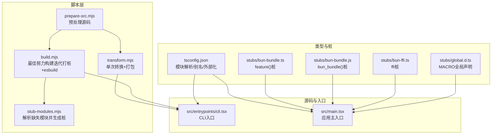
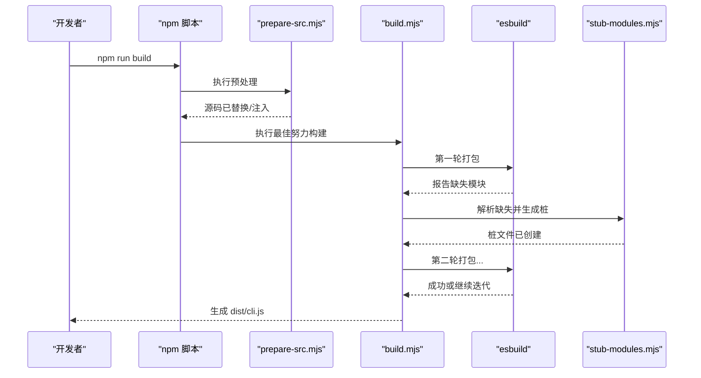
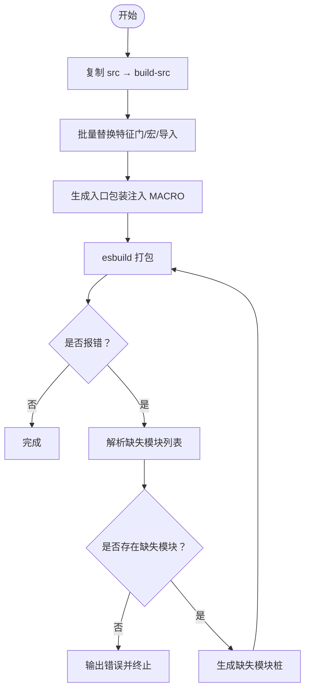
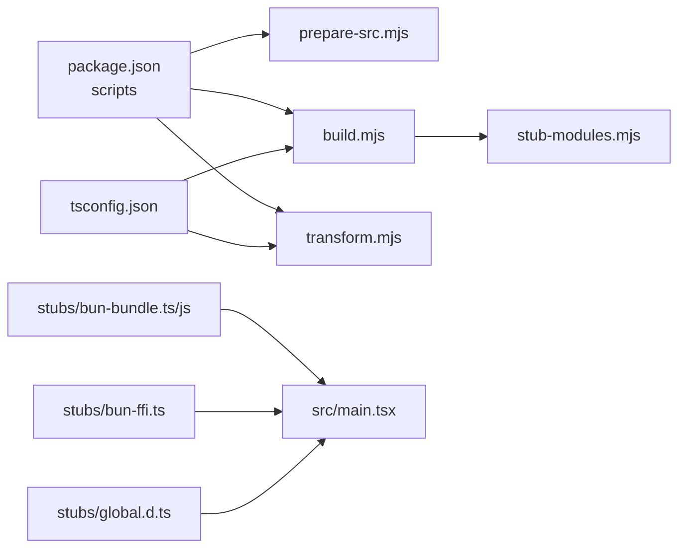

# 构建流程

<cite>
**本文引用的文件**
- [scripts/build.mjs](file://scripts/build.mjs)
- [scripts/prepare-src.mjs](file://scripts/prepare-src.mjs)
- [scripts/transform.mjs](file://scripts/transform.mjs)
- [scripts/stub-modules.mjs](file://scripts/stub-modules.mjs)
- [package.json](file://package.json)
- [tsconfig.json](file://tsconfig.json)
- [stubs/bun-bundle.ts](file://stubs/bun-bundle.ts)
- [stubs/bun-bundle.js](file://stubs/bun-bundle.js)
- [stubs/bun-ffi.ts](file://stubs/bun-ffi.ts)
- [stubs/global.d.ts](file://stubs/global.d.ts)
- [src/entrypoints/cli.tsx](file://src/entrypoints/cli.tsx)
- [src/main.tsx](file://src/main.tsx)
</cite>

## 目录
1. [简介](#简介)
2. [项目结构](#项目结构)
3. [核心组件](#核心组件)
4. [架构总览](#架构总览)
5. [详细组件分析](#详细组件分析)
6. [依赖关系分析](#依赖关系分析)
7. [性能考量](#性能考量)
8. [故障排查指南](#故障排查指南)
9. [结论](#结论)
10. [附录](#附录)

## 简介
本文件系统性梳理 Claude Code 的构建流程，覆盖 prepare-src、build、check 等脚本的作用与执行顺序，解释 TypeScript 编译、代码转换与模块处理机制，并总结构建优化策略、常见失败原因与解决方案，以及如何进行自定义构建配置。

## 项目结构
该仓库采用“脚本驱动 + 源码转换 + esbuild 打包”的混合构建方式：
- 脚本层：位于 scripts/，包含 prepare-src、build、transform、stub-modules 四个脚本，分别负责源码预处理、增量迭代打包、单次打包与缺失模块自动打桩。
- 类型与路径映射：tsconfig.json 定义了模块解析策略（含 bun:bundle 到 stub 的映射）与编译选项。
- 运行时桩：stubs/ 提供 bun:bundle、bun-ffi、global.d.ts 等运行时桩，用于在非 Bun 环境下替换原生特性。
- 入口与主程序：src/entrypoints/cli.tsx 为 CLI 入口；src/main.tsx 作为应用主入口，内部通过 feature() 做死代码消除（DCE）。

图表来源
- [scripts/prepare-src.mjs:1-116](file://scripts/prepare-src.mjs#L1-L116)
- [scripts/build.mjs:1-246](file://scripts/build.mjs#L1-L246)
- [scripts/transform.mjs:1-144](file://scripts/transform.mjs#L1-L144)
- [scripts/stub-modules.mjs:1-159](file://scripts/stub-modules.mjs#L1-L159)
- [tsconfig.json:1-37](file://tsconfig.json#L1-L37)
- [stubs/bun-bundle.ts:1-5](file://stubs/bun-bundle.ts#L1-L5)
- [stubs/bun-bundle.js:1-4](file://stubs/bun-bundle.js#L1-L4)
- [stubs/bun-ffi.ts:1-4](file://stubs/bun-ffi.ts#L1-L4)
- [stubs/global.d.ts:1-11](file://stubs/global.d.ts#L1-L11)
- [src/entrypoints/cli.tsx:1-200](file://src/entrypoints/cli.tsx#L1-L200)
- [src/main.tsx:1-200](file://src/main.tsx#L1-L200)

章节来源
- [package.json:7-12](file://package.json#L7-L12)

## 核心组件
- prepare-src.mjs：对源码树进行预处理，将 bun:bundle 导入替换为本地桩，并注入 MACRO 全局常量声明，确保 TypeScript 编译与后续 esbuild 解析顺利。
- build.mjs：最佳努力构建脚本，复制 src 到 build-src，执行多轮特征门替换与打桩，再用 esbuild 打包到 dist/cli.js。
- transform.mjs：单次转换与打包脚本，将 bun:bundle 导入改写为本地桩，注入 MACRO 全局变量，随后调用 esbuild。
- stub-modules.mjs：解析 esbuild 输出中的缺失模块，定位导入位置并生成对应桩文件，支持 .d.ts、文本资源与 JS/TS 模块。
- tsconfig.json：定义模块解析策略（bundler）、路径映射（bun:bundle → stub）、外部化（bun:*）与编译目标。
- 运行时桩：stubs/bun-bundle.ts、stubs/bun-bundle.js、stubs/bun-ffi.ts、stubs/global.d.ts，用于在 Node 环境下模拟 Bun 特性与全局宏。

章节来源
- [scripts/prepare-src.mjs:1-116](file://scripts/prepare-src.mjs#L1-L116)
- [scripts/build.mjs:1-246](file://scripts/build.mjs#L1-L246)
- [scripts/transform.mjs:1-144](file://scripts/transform.mjs#L1-L144)
- [scripts/stub-modules.mjs:1-159](file://scripts/stub-modules.mjs#L1-L159)
- [tsconfig.json:19-22](file://tsconfig.json#L19-L22)

## 架构总览
构建流程分为两条主线：
- 预处理管线：prepare-src.mjs → tsconfig.json（模块解析/外部化）→ esbuild
- 迭代打包管线：build.mjs（复制/转换/入口包装）→ 多轮 esbuild → 缺失模块解析 → 自动生成桩 → 再打包

图表来源
- [package.json:8-9](file://package.json#L8-L9)
- [scripts/build.mjs:144-229](file://scripts/build.mjs#L144-L229)
- [scripts/stub-modules.mjs:21-121](file://scripts/stub-modules.mjs#L21-L121)

## 详细组件分析

### prepare-src.mjs：源码预处理
- 功能要点
  - 将所有源文件中对 bun:bundle 的导入替换为指向本地桩，同时修正相对路径深度以适配不同目录层级。
  - 将 MACRO.X 引用替换为字符串字面量，避免编译期宏缺失导致的错误。
  - 生成 bun-ffi.ts 与 global.d.ts 类型声明，保证类型检查与运行时可用性。
- 关键行为
  - 遍历 src 下的 TS/TSX 文件，逐个进行正则替换与写回。
  - 通过相对路径计算，确保桩导入路径正确。
- 复杂度与性能
  - 时间复杂度近似 O(N)，N 为源文件数量；空间开销主要来自读取/写回文件内容。
- 错误处理
  - 若替换发生变更则返回 true，便于统计修改数量。

章节来源
- [scripts/prepare-src.mjs:36-77](file://scripts/prepare-src.mjs#L36-L77)
- [scripts/prepare-src.mjs:93-116](file://scripts/prepare-src.mjs#L93-L116)

### build.mjs：最佳努力构建（迭代打桩+esbuild）
- 功能要点
  - 清理并复制 src 至 build-src，作为工作副本。
  - 对 build-src 中的 TS/TSX 文件执行特征门替换（feature(...) → false）、宏替换（MACRO.X → 字符串）、移除 bun:bundle 导入与类型导入等。
  - 生成入口包装文件（entry.ts），在运行时注入 MACRO 全局对象，再由 esbuild 打包。
  - 循环执行 esbuild，解析“无法解析的模块”错误，自动生成桩文件，最多尝试若干轮。
- 关键行为
  - 使用正则匹配特征门调用与宏引用，批量替换后写回。
  - 通过解析 esbuild stderr 中的“Could not resolve”信息，收集缺失模块集合。
  - 自动创建 .d.ts、文本资源与 JS/TS 模块桩，覆盖多种路径场景。
- 性能与优化
  - 仅对 .ts/.tsx 文件进行处理，减少 IO。
  - 限制最大轮次，避免无限循环。
  - 通过外部化 bun:* 与 packages=external，缩小打包体积。
- 错误处理
  - 若某轮 esbuild 成功，直接结束；若无缺失模块但仍有错误，则输出前几条错误行以便诊断。
  - 若超过最大轮次仍未成功，提示用户检查 build-src/ 并手动补充桩。

图表来源
- [scripts/build.mjs:56-117](file://scripts/build.mjs#L56-L117)
- [scripts/build.mjs:144-229](file://scripts/build.mjs#L144-L229)

章节来源
- [scripts/build.mjs:56-117](file://scripts/build.mjs#L56-L117)
- [scripts/build.mjs:144-229](file://scripts/build.mjs#L144-L229)

### transform.mjs：单次转换与打包
- 功能要点
  - 复制 src 与 stubs 到 build-src，确保桩可用。
  - 将所有 bun:bundle 导入替换为本地桩，并在入口处注入 MACRO 全局对象。
  - 调用 esbuild 打包到 dist/cli.js，支持可选最小化参数。
- 适用场景
  - 快速验证转换结果或在已有桩齐全时一次性打包。
- 注意事项
  - 该脚本未实现迭代打桩逻辑，遇到缺失模块会直接失败。

章节来源
- [scripts/transform.mjs:24-68](file://scripts/transform.mjs#L24-L68)
- [scripts/transform.mjs:72-95](file://scripts/transform.mjs#L72-L95)
- [scripts/transform.mjs:111-140](file://scripts/transform.mjs#L111-L140)

### stub-modules.mjs：解析缺失模块并生成桩
- 功能要点
  - 先尝试一次 esbuild，捕获 stderr 中的“无法解析的模块”。
  - 遍历这些模块，通过 grep 查找导入它们的源文件，定位绝对路径。
  - 根据模块类型（.d.ts、文本资源、JS/TS）生成相应桩文件。
- 适用场景
  - 在 build.mjs 的迭代过程中，作为辅助工具快速补齐缺失模块。
- 注意事项
  - 对于以 ../ 开头的相对路径，尝试从多个可能的根目录拼接，提升命中率。

章节来源
- [scripts/stub-modules.mjs:21-121](file://scripts/stub-modules.mjs#L21-L121)
- [scripts/stub-modules.mjs:125-159](file://scripts/stub-modules.mjs#L125-L159)

### TypeScript 编译与模块处理机制
- 模块解析策略
  - 使用 bundler 分辨器，允许按包边界解析。
  - 通过 paths 将 bun:bundle 映射到 stub，避免运行时依赖。
- 外部化与别名
  - tsconfig.json 中 external bun:*，确保 esbuild 不将 Bun 特性打包进产物。
  - 通过 baseUrl 与 paths 简化导入路径。
- 类型声明
  - global.d.ts 提供 MACRO 全局类型，配合 prepare-src.mjs 注入的值使用。
- JSX 与源码映射
  - 启用 react-jsx，保留 sourceMap 便于调试。

章节来源
- [tsconfig.json:3-26](file://tsconfig.json#L3-L26)
- [tsconfig.json:19-22](file://tsconfig.json#L19-L22)
- [stubs/global.d.ts:1-11](file://stubs/global.d.ts#L1-L11)

### CLI 入口与特征门（feature）机制
- CLI 入口
  - src/entrypoints/cli.tsx 为 CLI 入口，内含多条快速路径（如 --version），并在需要时动态加载其他模块。
- 特征门与死代码消除
  - src/main.tsx 与 CLI 入口中广泛使用 feature('FLAG')，在构建阶段被替换为布尔字面量，从而触发死代码消除（DCE），剔除未启用的功能分支。
- 运行时桩
  - stubs/bun-bundle.ts 提供 feature() 实现，使 feature('FLAG') 在 Node 环境下返回固定值（构建脚本将其替换为 false），从而保证可编译性。

章节来源
- [src/entrypoints/cli.tsx:1-200](file://src/entrypoints/cli.tsx#L1-L200)
- [src/main.tsx:74-81](file://src/main.tsx#L74-L81)
- [stubs/bun-bundle.ts:1-5](file://stubs/bun-bundle.ts#L1-L5)

## 依赖关系分析
- 脚本间耦合
  - npm run build 串联 prepare-src 与 build.mjs，形成“预处理 + 最佳努力构建”的默认流程。
  - build.mjs 可独立运行，但通常配合 stub-modules.mjs 进行迭代补桩。
- 外部依赖
  - esbuild：核心打包工具，版本在 devDependencies 中声明。
  - Node ≥ 18：引擎要求。
- 内部依赖
  - tsconfig.json 的 paths 与 external 配置直接影响 esbuild 的解析与打包结果。
  - stubs/ 中的桩文件必须与源码中的导入路径一致，否则会出现“无法解析的模块”。

图表来源
- [package.json:7-12](file://package.json#L7-L12)
- [tsconfig.json:19-22](file://tsconfig.json#L19-L22)
- [stubs/bun-bundle.ts:1-5](file://stubs/bun-bundle.ts#L1-L5)
- [stubs/bun-bundle.js:1-4](file://stubs/bun-bundle.js#L1-L4)
- [stubs/bun-ffi.ts:1-4](file://stubs/bun-ffi.ts#L1-L4)
- [stubs/global.d.ts:1-11](file://stubs/global.d.ts#L1-L11)
- [src/main.tsx:21](file://src/main.tsx#L21)

章节来源
- [package.json:13-19](file://package.json#L13-L19)
- [tsconfig.json:19-22](file://tsconfig.json#L19-L22)

## 性能考量
- 打包体积与速度
  - 使用 packages=external 与 external:bun:*，避免将第三方与 Bun 特性打包进产物，显著减小体积与打包时间。
  - 启用 sourcemap 便于调试，但会增加打包时间与产物体积。
- 迭代策略
  - build.mjs 的多轮迭代可在不手动干预的情况下逐步补齐缺失模块，提高成功率。
- 源码扫描与替换
  - 仅处理 .ts/.tsx 文件，减少不必要的 IO；批量正则替换避免逐行解析成本过高。
- 运行时初始化
  - CLI 入口提供快速路径（如 --version），避免加载大量模块，缩短启动时间。

[本节为通用性能讨论，无需列出章节来源]

## 故障排查指南
- 常见失败原因
  - 缺少运行时桩：esbuild 报告“无法解析的模块”，通常为 feature-gated 或平台特定模块。
  - Bun 特性未替换：仍存在 bun:bundle 导入或 feature() 调用未被替换。
  - 类型声明缺失：MACRO 全局未声明或类型不匹配。
  - 路径映射错误：stubs/bun-bundle.ts 的导入相对路径与源文件所在目录层级不一致。
- 解决方案
  - 使用 build.mjs 的迭代打桩能力，或单独运行 stub-modules.mjs 自动补齐缺失模块。
  - 确保 prepare-src.mjs 已执行，且 MACRO 注入与 bun:bundle 替换已完成。
  - 检查 tsconfig.json 的 paths 与 external 配置，确保 bun:* 被外部化。
  - 如需最小化产物，可传入 transform.mjs 的 --minify 参数（在脚本中支持）。
- 参考路径
  - 迭代打桩与错误输出：[scripts/build.mjs:144-229](file://scripts/build.mjs#L144-L229)
  - 缺失模块解析与桩生成：[scripts/stub-modules.mjs:21-121](file://scripts/stub-modules.mjs#L21-L121)
  - 预处理与 MACRO 注入：[scripts/prepare-src.mjs:36-77](file://scripts/prepare-src.mjs#L36-L77)

章节来源
- [scripts/build.mjs:144-229](file://scripts/build.mjs#L144-L229)
- [scripts/stub-modules.mjs:21-121](file://scripts/stub-modules.mjs#L21-L121)
- [scripts/prepare-src.mjs:36-77](file://scripts/prepare-src.mjs#L36-L77)

## 结论
该构建系统通过“预处理 + 多轮迭代打桩 + esbuild 打包”的组合，在非 Bun 环境下实现了对原生 Bun 特性的近似替换与模块消解，使得源码可被最佳努力地编译与打包。prepare-src.mjs 负责基础转换，build.mjs 提供稳健的迭代补桩与打包，transform.mjs 适合一次性验证，stub-modules.mjs 则作为辅助工具补齐缺失模块。配合 tsconfig.json 的路径映射与外部化策略，整体构建流程具备良好的可维护性与扩展性。

[本节为总结性内容，无需列出章节来源]

## 附录

### 构建命令与执行顺序
- npm run prepare-src：执行 prepare-src.mjs，完成源码预处理与桩生成。
- npm run build：先执行 prepare-src，再执行 build.mjs，完成最佳努力构建。
- npm run check：执行 prepare-src 后运行 tsc --noEmit，进行类型检查。
- npm run start：运行已生成的 dist/cli.js。

章节来源
- [package.json:7-12](file://package.json#L7-L12)

### 自定义构建配置建议
- 修改目标环境
  - 如需切换 Node 目标版本，调整 esbuild 的 --target 与 tsconfig.json 的 target/module。
- 控制打包范围
  - 通过 external 与 packages=external 控制第三方库是否打入产物。
- 定制特征门行为
  - 在构建脚本中统一替换 feature('FLAG') 为期望的布尔值，以裁剪功能分支。
- 调整日志与输出
  - 通过 esbuild 的 --log-level 与 --log-limit 控制输出详细程度。
- 生成最小化产物
  - 在 transform.mjs 中添加 --minify 参数（脚本已支持），或在 build.mjs 中开启相应逻辑。

章节来源
- [scripts/build.mjs:149-168](file://scripts/build.mjs#L149-L168)
- [scripts/transform.mjs:127-131](file://scripts/transform.mjs#L127-L131)
- [tsconfig.json:3-26](file://tsconfig.json#L3-L26)