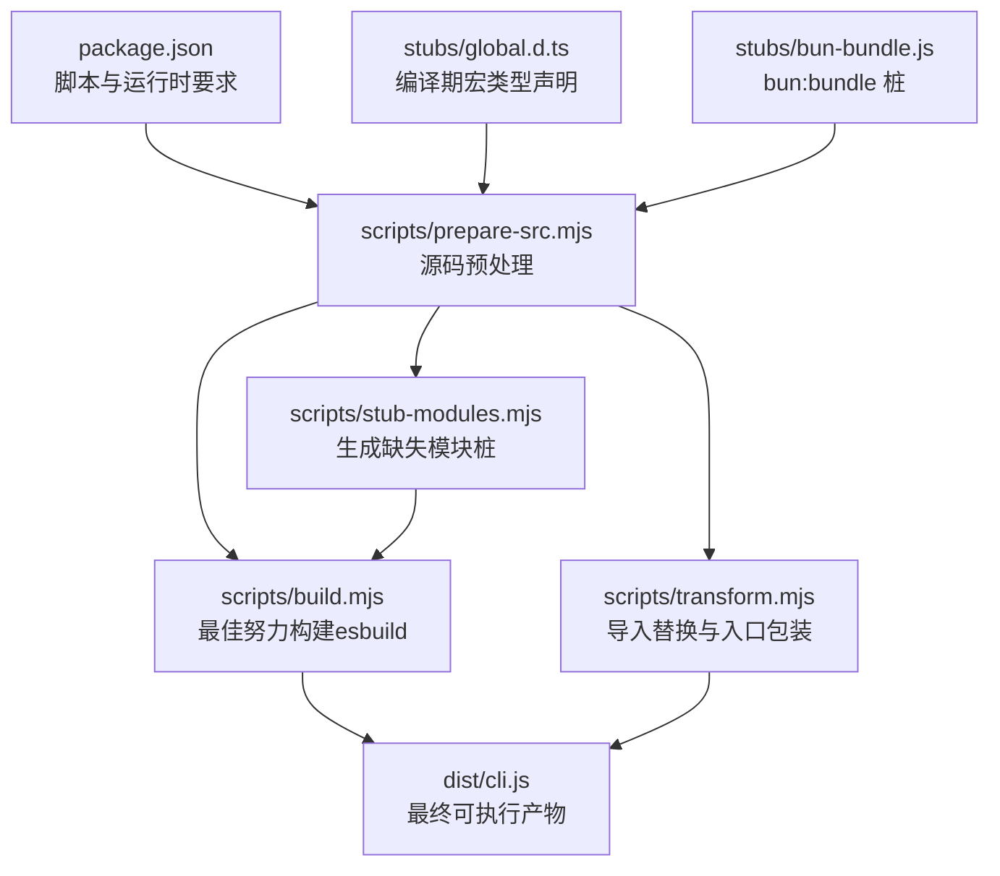
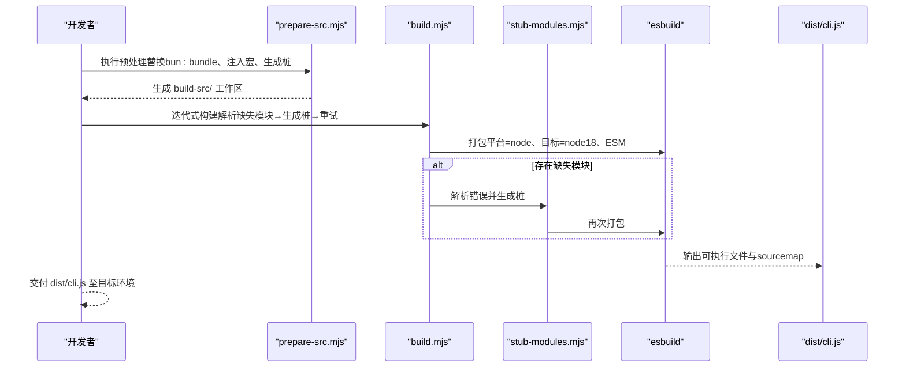
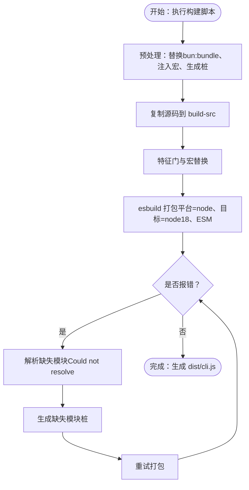
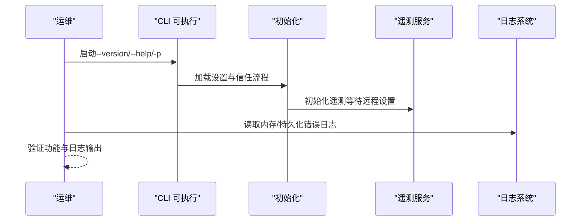
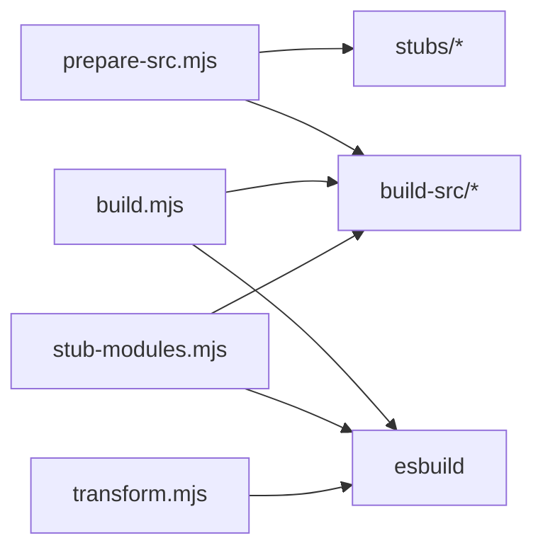

# 生产部署

<cite>
**本文引用的文件**   
- [package.json](file://package.json)
- [README.md](file://README.md)
- [scripts/build.mjs](file://scripts/build.mjs)
- [scripts/prepare-src.mjs](file://scripts/prepare-src.mjs)
- [scripts/stub-modules.mjs](file://scripts/stub-modules.mjs)
- [scripts/transform.mjs](file://scripts/transform.mjs)
- [stubs/bun-bundle.js](file://stubs/bun-bundle.js)
- [stubs/global.d.ts](file://stubs/global.d.ts)
- [.gitignore](file://.gitignore)
- [src/utils/env.ts](file://src/utils/env.ts)
- [src/services/analytics/index.ts](file://src/services/analytics/index.ts)
- [src/entrypoints/init.ts](file://src/entrypoints/init.ts)
- [src/services/mcp/envExpansion.ts](file://src/services/mcp/envExpansion.ts)
- [src/constants/common.ts](file://src/constants/common.ts)
- [src/utils/log.ts](file://src/utils/log.ts)
</cite>

## 目录
1. [简介](#简介)
2. [项目结构](#项目结构)
3. [核心组件](#核心组件)
4. [架构总览](#架构总览)
5. [详细组件分析](#详细组件分析)
6. [依赖关系分析](#依赖关系分析)
7. [性能考量](#性能考量)
8. [故障排查指南](#故障排查指南)
9. [结论](#结论)
10. [附录](#附录)

## 简介
本指南面向在生产环境中部署 Claude Code 的工程团队，聚焦于从源码到可执行产物的构建与打包流程、部署前准备与检查清单、多平台部署方法与注意事项、版本管理与发布流程、部署后验证与监控、以及回滚与应急处理方案。  
Claude Code v2.1.88 的源码为 TypeScript/JS，最终以单文件 CLI 可执行产物分发；仓库提供了基于 esbuild 的最佳努力重建脚本，以及用于生成缺失模块桩（stub）的工具链，便于在非 Bun 环境下完成构建。

## 项目结构
- 核心目录与职责概览
  - scripts：构建与预处理脚本（prepare-src、build、stub-modules、transform）
  - src：TypeScript 源码（入口、查询引擎、工具系统、服务层、状态层等）
  - stubs：编译期宏与缺失模块桩（bun-bundle、global.d.ts 等）
  - dist：构建输出目录（包含最终的 cli.js）
  - build-src：构建中间态目录（prepare-src 与 build 的工作区）
- 关键文件
  - package.json：定义构建脚本与运行时要求（Node >= 18）
  - README.md：项目背景、缺失模块说明、架构与特性旗标等
  - .gitignore：忽略 node_modules、build-src、dist

**图表来源**
- [package.json:1-21](file://package.json#L1-L21)
- [scripts/prepare-src.mjs:1-116](file://scripts/prepare-src.mjs#L1-L116)
- [scripts/build.mjs:1-246](file://scripts/build.mjs#L1-L246)
- [scripts/stub-modules.mjs:1-159](file://scripts/stub-modules.mjs#L1-L159)
- [scripts/transform.mjs:1-144](file://scripts/transform.mjs#L1-L144)
- [stubs/global.d.ts:1-11](file://stubs/global.d.ts#L1-L11)
- [stubs/bun-bundle.js:1-4](file://stubs/bun-bundle.js#L1-L4)

**章节来源**
- [package.json:1-21](file://package.json#L1-L21)
- [README.md:250-380](file://README.md#L250-L380)
- [.gitignore:1-3](file://.gitignore#L1-L3)

## 核心组件
- 构建脚本与工具链
  - prepare-src.mjs：将源码中的 bun:bundle 导入替换为本地桩，并注入编译期宏值，同时生成全局类型声明与缺失的 ffi 桩
  - build.mjs：复制源码至 build-src，进行特征门与宏替换，迭代式生成缺失模块桩并用 esbuild 打包，支持多轮解析与重试
  - stub-modules.mjs：解析 esbuild 错误中的缺失模块，定位导入位置并生成对应桩文件，随后尝试再次打包
  - transform.mjs：直接对拷贝后的源码进行导入替换与入口包装，使用 esbuild 定义宏并打包
- 运行时与环境
  - Node 版本要求：>= 18
  - 产物格式：ESM 单文件可执行（dist/cli.js），带 sourcemap
- 配置与环境变量
  - 通过 process.env 读取 CI/容器平台、终端类型、包管理器、运行时等环境信息
  - MCP 配置支持环境变量展开（${VAR}、${VAR:-default}）

**章节来源**
- [scripts/prepare-src.mjs:1-116](file://scripts/prepare-src.mjs#L1-L116)
- [scripts/build.mjs:1-246](file://scripts/build.mjs#L1-L246)
- [scripts/stub-modules.mjs:1-159](file://scripts/stub-modules.mjs#L1-L159)
- [scripts/transform.mjs:1-144](file://scripts/transform.mjs#L1-L144)
- [package.json:13-19](file://package.json#L13-L19)
- [src/utils/env.ts:284-333](file://src/utils/env.ts#L284-L333)
- [src/services/mcp/envExpansion.ts:1-38](file://src/services/mcp/envExpansion.ts#L1-L38)

## 架构总览
生产部署涉及“构建—打包—交付—运行”的闭环。构建阶段通过脚本链路将源码转换为可在 Node 环境运行的单文件；交付阶段将 dist/cli.js 与必要的运行时依赖一并打包；运行阶段由 Node 启动 CLI 并加载应用初始化逻辑，包括遥测与设置拉取等。

**图表来源**
- [scripts/prepare-src.mjs:1-116](file://scripts/prepare-src.mjs#L1-L116)
- [scripts/build.mjs:140-246](file://scripts/build.mjs#L140-L246)
- [scripts/stub-modules.mjs:21-159](file://scripts/stub-modules.mjs#L21-L159)

## 详细组件分析

### 构建与打包流程（最佳努力）
- 预处理阶段（prepare-src.mjs）
  - 将所有源文件中的 bun:bundle 导入替换为本地桩路径，确保 esbuild 不会因原生模块而失败
  - 注入编译期宏（如 VERSION、BUILD_TIME、FEEDBACK_CHANNEL 等）为字符串字面量
  - 生成全局类型声明 global.d.ts 与 bun-ffi 桩，保证类型检查通过
- 构建阶段（build.mjs）
  - 复制 src 至 build-src，遍历替换 feature('X') 与 MACRO.X 引用
  - 创建入口包装文件，指向真实 CLI 入口
  - 使用 esbuild 打包，若报错则解析“无法解析的模块”，生成对应桩文件，最多重试若干轮
- 桩生成工具（stub-modules.mjs）
  - 基于 esbuild 输出解析缺失模块，定位导入者并生成桩文件（空实现或空对象）
  - 成功后再次尝试打包，直至无缺失模块
- 直接转换与打包（transform.mjs）
  - 对拷贝后的源码进行导入替换与入口包装，使用 --define 注入宏，再调用 esbuild 打包

**图表来源**
- [scripts/build.mjs:52-246](file://scripts/build.mjs#L52-L246)
- [scripts/stub-modules.mjs:21-121](file://scripts/stub-modules.mjs#L21-L121)
- [scripts/transform.mjs:35-144](file://scripts/transform.mjs#L35-L144)

**章节来源**
- [scripts/prepare-src.mjs:36-98](file://scripts/prepare-src.mjs#L36-L98)
- [scripts/build.mjs:67-117](file://scripts/build.mjs#L67-L117)
- [scripts/stub-modules.mjs:34-121](file://scripts/stub-modules.mjs#L34-L121)
- [scripts/transform.mjs:47-95](file://scripts/transform.mjs#L47-L95)

### 部署前准备与检查清单
- 环境要求
  - Node.js 版本：>= 18（package.json 明确）
  - 网络：可访问 esbuild（首次运行自动安装）
- 源码与产物
  - 确认已执行预处理与构建脚本，dist/cli.js 存在且大小合理
  - 若存在缺失模块，确认已通过 stub-modules.mjs 生成桩并成功打包
- 运行时配置
  - 设置必要的环境变量（如 MCP 服务器配置、遥测相关参数）
  - 如需在 CI/容器中运行，确认环境检测逻辑能正确识别平台
- 安全与合规
  - 注意 README 中关于遥测与隐私的说明，确保在生产中按合规要求启用或禁用遥测
  - 对于需要权限的工具与命令，提前在受控环境中验证权限策略

**章节来源**
- [package.json:13-19](file://package.json#L13-L19)
- [scripts/build.mjs:44-50](file://scripts/build.mjs#L44-L50)
- [README.md:60-67](file://README.md#L60-L67)
- [src/utils/env.ts:284-333](file://src/utils/env.ts#L284-L333)

### 多平台部署方法与注意事项
- Linux（通用）
  - 安装 Node >= 18，准备 esbuild（首次运行自动安装）
  - 将 dist/cli.js 分发到目标主机，赋予可执行权限
  - 在 systemd 或自定义启动脚本中以 node 启动 CLI，并设置环境变量
- macOS
  - 与 Linux 类似，注意终端类型与 SSH 环境检测
  - 如需在 GUI 应用中集成，可通过子进程方式调用 CLI
- Windows
  - 使用 WSL2 或 Windows Subsystem for Linux 运行 Node
  - 或在 Windows 上直接使用 Node（需注意路径分隔符与权限）
- 容器与编排
  - 建议将 dist/cli.js 与运行时依赖打包为镜像
  - 在 Kubernetes 中使用 Deployment/Job，设置资源限制与健康检查
  - 在 Docker 中使用只读根文件系统与最小权限原则
- CI/CD 平台
  - GitHub Actions、GitLab CI、CircleCI、Buildkite 等平台可直接运行 Node
  - 注意网络代理与缓存策略，避免重复安装 esbuild

**章节来源**
- [src/utils/env.ts:284-333](file://src/utils/env.ts#L284-L333)
- [README.md:780-800](file://README.md#L780-L800)

### 版本管理与发布流程
- 版本号来源
  - 构建脚本中固定版本号（如 2.1.88），并在产物中嵌入
- 发布物
  - dist/cli.js 为最终交付产物，建议同时提供 sourcemap 以便调试
- 发布步骤建议
  - 在 CI 中执行 prepare-src 与 build，产出 dist/cli.js
  - 将 dist/cli.js 与必要的运行时依赖打包为 tar.gz 或容器镜像
  - 记录构建时间、Node 版本、esbuild 版本等元数据
- 回归测试
  - 在与生产环境一致的平台上运行 --version 与基础命令，确保功能正常

**章节来源**
- [scripts/build.mjs:28](file://scripts/build.mjs#L28)
- [scripts/transform.mjs:20](file://scripts/transform.mjs#L20)
- [package.json:7-11](file://package.json#L7-L11)

### 部署后验证与监控
- 基础验证
  - 运行 node dist/cli.js --version，确认版本号与构建信息
  - 运行 node dist/cli.js -p "Hello"，验证基本交互
- 遥测与日志
  - 初始化遥测（在获得信任后）并观察事件上报情况
  - 通过日志接口读取内存错误日志与持久化错误日志，排查异常
- 性能与稳定性
  - 观察内存占用与 GC 行为，必要时调整 Node 参数
  - 对长时间运行的服务设置健康检查与重启策略

**图表来源**
- [src/entrypoints/init.ts:247-268](file://src/entrypoints/init.ts#L247-L268)
- [src/services/analytics/index.ts:95-123](file://src/services/analytics/index.ts#L95-L123)
- [src/utils/log.ts:201-223](file://src/utils/log.ts#L201-L223)

**章节来源**
- [src/entrypoints/init.ts:247-268](file://src/entrypoints/init.ts#L247-L268)
- [src/services/analytics/index.ts:125-174](file://src/services/analytics/index.ts#L125-L174)
- [src/utils/log.ts:201-223](file://src/utils/log.ts#L201-L223)

### 回滚策略与应急处理
- 回滚策略
  - 保留上一个版本的 dist/cli.js 与发布元数据
  - 通过配置管理或容器镜像标签快速切换版本
  - 在回滚过程中暂停新版本的遥测与动态设置拉取，避免叠加影响
- 应急处理
  - 若构建失败，优先检查 esbuild 是否可用与网络连通性
  - 若运行时缺少模块，使用 stub-modules.mjs 生成桩并重新打包
  - 对 MCP 服务器配置问题，检查环境变量展开结果与必填项
  - 出现严重错误时，临时关闭遥测与异步事件上报，降低干扰

**章节来源**
- [scripts/build.mjs:144-246](file://scripts/build.mjs#L144-L246)
- [scripts/stub-modules.mjs:21-159](file://scripts/stub-modules.mjs#L21-L159)
- [src/services/mcp/envExpansion.ts:10-38](file://src/services/mcp/envExpansion.ts#L10-L38)

## 依赖关系分析
- 构建链路依赖
  - prepare-src.mjs 依赖 stubs 下的桩与类型声明
  - build.mjs 依赖 esbuild，可能多次重试
  - stub-modules.mjs 依赖 esbuild 输出解析缺失模块
- 运行时依赖
  - Node >= 18
  - 无运行时原生绑定（bun:*）依赖，通过桩与替换规避

**图表来源**
- [scripts/prepare-src.mjs:1-116](file://scripts/prepare-src.mjs#L1-L116)
- [scripts/build.mjs:134-246](file://scripts/build.mjs#L134-L246)
- [scripts/stub-modules.mjs:21-159](file://scripts/stub-modules.mjs#L21-L159)
- [scripts/transform.mjs:101-144](file://scripts/transform.mjs#L101-L144)

**章节来源**
- [scripts/prepare-src.mjs:93-116](file://scripts/prepare-src.mjs#L93-L116)
- [scripts/build.mjs:134-174](file://scripts/build.mjs#L134-L174)
- [scripts/stub-modules.mjs:21-159](file://scripts/stub-modules.mjs#L21-L159)
- [scripts/transform.mjs:101-144](file://scripts/transform.mjs#L101-L144)

## 性能考量
- 构建性能
  - esbuild 为单线程打包，建议在 CI 中缓存 node_modules 与构建产物
  - 多轮重试生成桩会增加构建时间，建议在本地开发时先用 stub-modules.mjs 快速定位缺失模块
- 运行性能
  - CLI 为单文件 ESM，启动开销较低
  - 对长会话与高并发场景，建议配合容器编排与资源配额管理

[本节为通用指导，无需特定文件来源]

## 故障排查指南
- 构建失败
  - esbuild 未安装：首次运行会自动安装，若失败请检查网络与 npm 缓存
  - 缺失模块：使用 stub-modules.mjs 生成桩并重试
  - 特征门与宏替换：确认 prepare-src.mjs 是否正确替换 bun:bundle 与 MACRO.X
- 运行时问题
  - 环境检测：确认 CI/容器平台识别正确，避免误判
  - 遥测初始化：在获得信任后初始化遥测，观察事件队列与异步上报
  - 日志：通过日志接口读取内存错误与持久化错误，定位异常

**章节来源**
- [scripts/build.mjs:44-50](file://scripts/build.mjs#L44-L50)
- [scripts/stub-modules.mjs:21-159](file://scripts/stub-modules.mjs#L21-L159)
- [scripts/prepare-src.mjs:36-98](file://scripts/prepare-src.mjs#L36-L98)
- [src/utils/env.ts:284-333](file://src/utils/env.ts#L284-L333)
- [src/services/analytics/index.ts:95-123](file://src/services/analytics/index.ts#L95-L123)
- [src/utils/log.ts:201-223](file://src/utils/log.ts#L201-L223)

## 结论
通过仓库提供的脚本链路，可在非 Bun 环境下完成 Claude Code 的最佳努力构建与打包。生产部署应重点关注 Node 版本、esbuild 可用性、缺失模块桩的生成与验证、运行时环境检测与遥测初始化。结合版本管理与发布流程，配合回滚与应急处理策略，可实现稳定可靠的生产交付。

[本节为总结，无需特定文件来源]

## 附录
- 关键文件路径与用途
  - scripts/prepare-src.mjs：源码预处理与桩生成
  - scripts/build.mjs：迭代式构建与打包
  - scripts/stub-modules.mjs：解析缺失模块并生成桩
  - scripts/transform.mjs：直接转换与打包
  - stubs/global.d.ts：编译期宏类型声明
  - stubs/bun-bundle.js：bun:bundle 桩
  - dist/cli.js：最终可执行产物
  - package.json：脚本与运行时要求
  - README.md：项目背景与缺失模块说明
  - src/utils/env.ts：环境检测与平台识别
  - src/services/analytics/index.ts：遥测服务接口
  - src/entrypoints/init.ts：遥测初始化流程
  - src/services/mcp/envExpansion.ts：环境变量展开工具
  - src/constants/common.ts：日期与会话时间相关常量
  - src/utils/log.ts：日志读取接口

**章节来源**
- [package.json:1-21](file://package.json#L1-L21)
- [README.md:1-224](file://README.md#L1-L224)
- [scripts/prepare-src.mjs:1-116](file://scripts/prepare-src.mjs#L1-L116)
- [scripts/build.mjs:1-246](file://scripts/build.mjs#L1-L246)
- [scripts/stub-modules.mjs:1-159](file://scripts/stub-modules.mjs#L1-L159)
- [scripts/transform.mjs:1-144](file://scripts/transform.mjs#L1-L144)
- [stubs/global.d.ts:1-11](file://stubs/global.d.ts#L1-L11)
- [stubs/bun-bundle.js:1-4](file://stubs/bun-bundle.js#L1-L4)
- [src/utils/env.ts:284-333](file://src/utils/env.ts#L284-L333)
- [src/services/analytics/index.ts:1-174](file://src/services/analytics/index.ts#L1-L174)
- [src/entrypoints/init.ts:247-268](file://src/entrypoints/init.ts#L247-L268)
- [src/services/mcp/envExpansion.ts:1-38](file://src/services/mcp/envExpansion.ts#L1-L38)
- [src/constants/common.ts:1-34](file://src/constants/common.ts#L1-L34)
- [src/utils/log.ts:201-223](file://src/utils/log.ts#L201-L223)