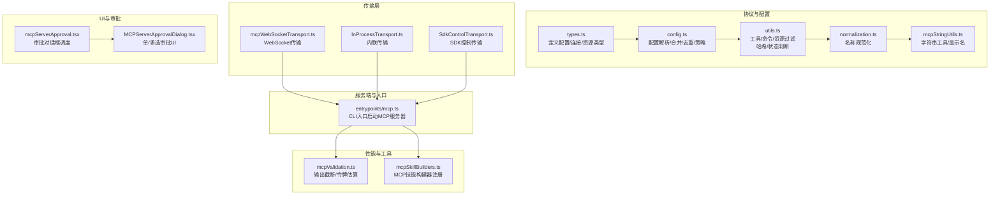
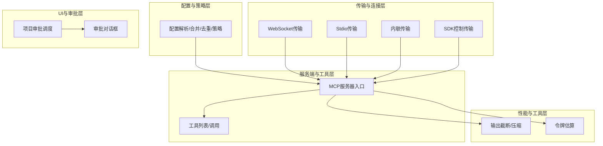
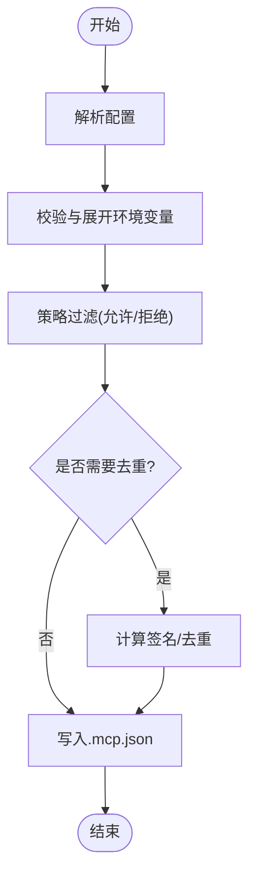
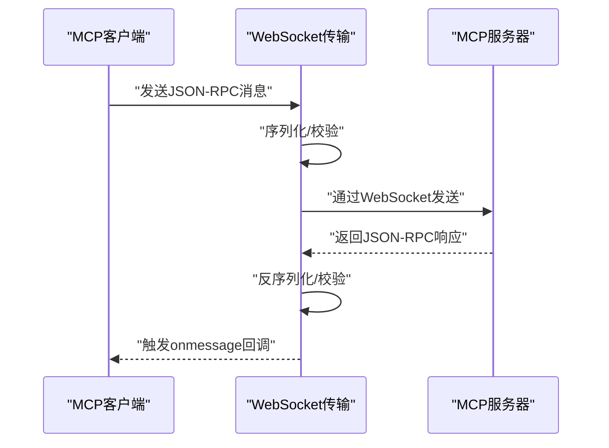
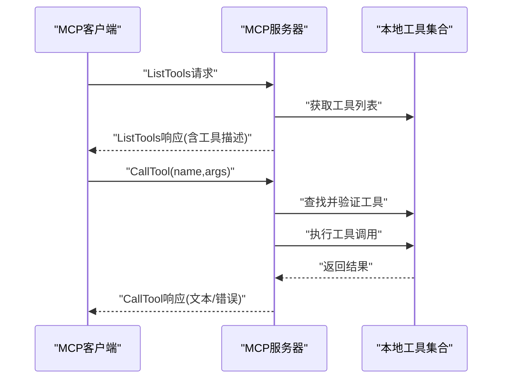
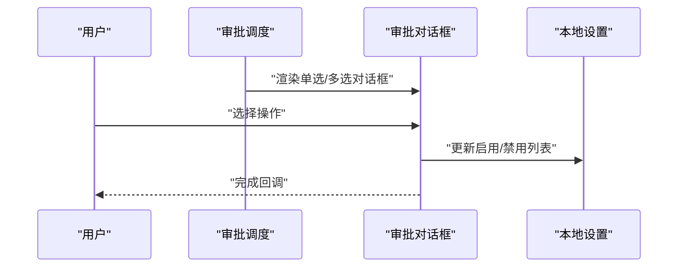
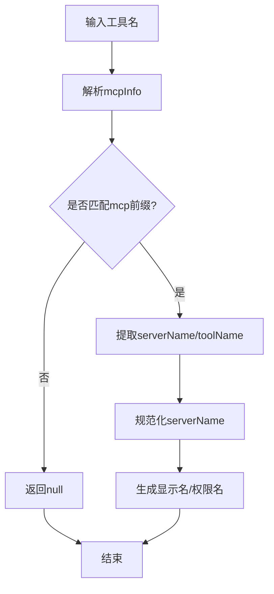
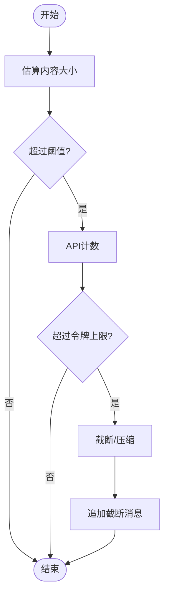
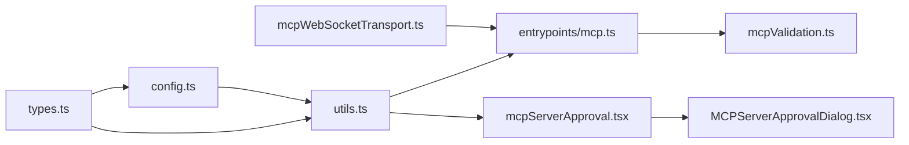

# MCP协议概述

<cite>
**本文档引用的文件**
- [src/services/mcp/types.ts](file://src/services/mcp/types.ts)
- [src/services/mcp/config.ts](file://src/services/mcp/config.ts)
- [src/services/mcp/utils.ts](file://src/services/mcp/utils.ts)
- [src/services/mcp/normalization.ts](file://src/services/mcp/normalization.ts)
- [src/services/mcp/mcpStringUtils.ts](file://src/services/mcp/mcpStringUtils.ts)
- [src/services/mcpServerApproval.tsx](file://src/services/mcpServerApproval.tsx)
- [src/entrypoints/mcp.ts](file://src/entrypoints/mcp.ts)
- [src/utils/mcpWebSocketTransport.ts](file://src/utils/mcpWebSocketTransport.ts)
- [src/utils/mcpValidation.ts](file://src/utils/mcpValidation.ts)
- [src/components/MCPServerApprovalDialog.tsx](file://src/components/MCPServerApprovalDialog.tsx)
- [src/commands/mcp/mcp.tsx](file://src/commands/mcp/mcp.tsx)
- [src/skills/mcpSkillBuilders.ts](file://src/skills/mcpSkillBuilders.ts)
</cite>

## 目录
1. [简介](#简介)
2. [项目结构](#项目结构)
3. [核心组件](#核心组件)
4. [架构总览](#架构总览)
5. [详细组件分析](#详细组件分析)
6. [依赖关系分析](#依赖关系分析)
7. [性能考量](#性能考量)
8. [故障排除指南](#故障排除指南)
9. [结论](#结论)
10. [附录](#附录)

## 简介
本文件面向Claude Code中的MCP（Model Context Protocol）实现，系统化阐述其设计目标、基本架构、消息格式与请求响应机制、事件通知系统、版本兼容性、安全考虑与性能特征，并提供基本使用示例与最佳实践。MCP在Claude Code中用于统一管理外部工具服务器（如HTTP/SSE/WebSocket/STDIO等），通过标准化的协议与传输层，将第三方能力以工具形式暴露给主应用，同时提供权限控制、配置合并、去重与状态管理。

## 项目结构
MCP相关代码主要分布在以下模块：
- 协议类型与配置：定义MCP服务器配置、连接状态、资源类型与序列化结构
- 配置与策略：解析、合并、去重、策略过滤与写入
- 工具字符串与命名规范化：工具名前缀、显示名提取、权限匹配
- 传输层：WebSocket、Stdio、内联进程传输等
- 服务端入口：CLI入口启动MCP服务器，处理工具列表与调用
- 审批与UI：项目级MCP服务器的审批流程与交互
- 性能与输出截断：令牌计数、输出截断与压缩
- 技能构建器：MCP技能发现与注册

**图表来源**
- [src/services/mcp/types.ts:1-259](file://src/services/mcp/types.ts#L1-L259)
- [src/services/mcp/config.ts:1-800](file://src/services/mcp/config.ts#L1-L800)
- [src/services/mcp/utils.ts:1-576](file://src/services/mcp/utils.ts#L1-L576)
- [src/services/mcp/normalization.ts:1-24](file://src/services/mcp/normalization.ts#L1-L24)
- [src/services/mcp/mcpStringUtils.ts:1-107](file://src/services/mcp/mcpStringUtils.ts#L1-L107)
- [src/utils/mcpWebSocketTransport.ts:1-201](file://src/utils/mcpWebSocketTransport.ts#L1-L201)
- [src/entrypoints/mcp.ts:1-197](file://src/entrypoints/mcp.ts#L1-L197)
- [src/services/mcpServerApproval.tsx:1-41](file://src/services/mcpServerApproval.tsx#L1-L41)
- [src/components/MCPServerApprovalDialog.tsx:1-115](file://src/components/MCPServerApprovalDialog.tsx#L1-L115)
- [src/utils/mcpValidation.ts:1-209](file://src/utils/mcpValidation.ts#L1-L209)
- [src/skills/mcpSkillBuilders.ts:1-45](file://src/skills/mcpSkillBuilders.ts#L1-L45)

**章节来源**
- [src/services/mcp/types.ts:1-259](file://src/services/mcp/types.ts#L1-L259)
- [src/services/mcp/config.ts:1-800](file://src/services/mcp/config.ts#L1-L800)
- [src/services/mcp/utils.ts:1-576](file://src/services/mcp/utils.ts#L1-L576)
- [src/services/mcp/normalization.ts:1-24](file://src/services/mcp/normalization.ts#L1-L24)
- [src/services/mcp/mcpStringUtils.ts:1-107](file://src/services/mcp/mcpStringUtils.ts#L1-L107)
- [src/utils/mcpWebSocketTransport.ts:1-201](file://src/utils/mcpWebSocketTransport.ts#L1-L201)
- [src/entrypoints/mcp.ts:1-197](file://src/entrypoints/mcp.ts#L1-L197)
- [src/services/mcpServerApproval.tsx:1-41](file://src/services/mcpServerApproval.tsx#L1-L41)
- [src/components/MCPServerApprovalDialog.tsx:1-115](file://src/components/MCPServerApprovalDialog.tsx#L1-L115)
- [src/utils/mcpValidation.ts:1-209](file://src/utils/mcpValidation.ts#L1-L209)
- [src/skills/mcpSkillBuilders.ts:1-45](file://src/skills/mcpSkillBuilders.ts#L1-L45)

## 核心组件
- 协议类型与配置
  - 服务器配置类型：支持stdio、sse、http、ws、sdk、claudeai-proxy等多种类型，含命令、URL、头信息、OAuth等字段
  - 连接状态：Connected、Failed、NeedsAuth、Pending、Disabled五态
  - 资源类型：扩展Resource并附加server标识
  - 序列化结构：客户端/工具/资源的序列化表示，便于CLI状态导出与恢复
- 配置与策略
  - 解析与合并：从多源配置（用户、项目、本地、动态、企业、claude.ai）合并，支持去重与签名匹配
  - 策略过滤：基于允许/拒绝清单进行名称、命令、URL匹配，支持通配符URL模式
  - 写入与校验：原子写入.mcp.json，保留文件权限；配置校验与环境变量展开
- 工具字符串与命名规范化
  - 工具名前缀：mcp__serverName__toolName，支持显示名提取与权限检查
  - 名称规范化：去除非法字符，保留连字符与下划线，特殊处理claude.ai前缀
- 传输层
  - WebSocket传输：跨平台适配（Bun/Node），错误与关闭清理
  - 内联传输：同一进程内客户端/服务端直连，避免子进程开销
  - SDK控制传输：CLI侧桥接到SDK进程，转发MCP消息
- 服务端入口
  - CLI入口：启动Server，注册ListTools/CALL_TOOL处理器，将工具描述转换为MCP可识别的JSON Schema
- 审批与UI
  - 项目级审批：扫描.mcp.json中的待审批服务器，弹出单选或多选对话框
- 性能与工具
  - 输出截断：基于令牌估算与API计数，对超限内容进行截断与压缩
  - 令牌阈值：启发式阈值避免不必要的昂贵计数
- 技能构建器
  - 注册与获取：在加载技能目录时注册构建器，避免循环依赖

**章节来源**
- [src/services/mcp/types.ts:1-259](file://src/services/mcp/types.ts#L1-L259)
- [src/services/mcp/config.ts:1-800](file://src/services/mcp/config.ts#L1-L800)
- [src/services/mcp/utils.ts:1-576](file://src/services/mcp/utils.ts#L1-L576)
- [src/services/mcp/normalization.ts:1-24](file://src/services/mcp/normalization.ts#L1-L24)
- [src/services/mcp/mcpStringUtils.ts:1-107](file://src/services/mcp/mcpStringUtils.ts#L1-L107)
- [src/utils/mcpWebSocketTransport.ts:1-201](file://src/utils/mcpWebSocketTransport.ts#L1-L201)
- [src/entrypoints/mcp.ts:1-197](file://src/entrypoints/mcp.ts#L1-L197)
- [src/services/mcpServerApproval.tsx:1-41](file://src/services/mcpServerApproval.tsx#L1-L41)
- [src/utils/mcpValidation.ts:1-209](file://src/utils/mcpValidation.ts#L1-L209)
- [src/skills/mcpSkillBuilders.ts:1-45](file://src/skills/mcpSkillBuilders.ts#L1-L45)

## 架构总览
MCP在Claude Code中的整体架构由“配置与策略层”、“传输与连接层”、“服务端与工具层”、“UI与审批层”、“性能与工具层”构成。配置层负责解析与合并多源配置，策略层进行允许/拒绝控制；传输层提供多种传输方式；服务端入口将本地工具暴露为MCP工具；UI层处理项目级服务器审批；性能层负责输出截断与令牌估算。

**图表来源**
- [src/services/mcp/config.ts:1-800](file://src/services/mcp/config.ts#L1-L800)
- [src/utils/mcpWebSocketTransport.ts:1-201](file://src/utils/mcpWebSocketTransport.ts#L1-L201)
- [src/entrypoints/mcp.ts:1-197](file://src/entrypoints/mcp.ts#L1-L197)
- [src/services/mcpServerApproval.tsx:1-41](file://src/services/mcpServerApproval.tsx#L1-L41)
- [src/components/MCPServerApprovalDialog.tsx:1-115](file://src/components/MCPServerApprovalDialog.tsx#L1-L115)
- [src/utils/mcpValidation.ts:1-209](file://src/utils/mcpValidation.ts#L1-L209)

## 详细组件分析

### 组件A：MCP配置与策略（config.ts）
- 功能要点
  - 多源配置合并：用户、项目、本地、动态、企业、claude.ai、managed
  - 去重与签名：基于命令数组或URL签名，避免重复与冲突
  - 策略过滤：允许/拒绝清单，支持名称、命令、URL匹配，URL支持通配符
  - 写入与校验：原子写入.mcp.json，保留权限，展开环境变量
- 关键流程
  - 解析配置 → 校验与展开 → 策略过滤 → 去重 → 写回
- 复杂度与优化
  - 去重采用签名映射，时间复杂度O(n)，空间O(n)
  - URL匹配使用正则预编译，减少重复计算

**图表来源**
- [src/services/mcp/config.ts:1-800](file://src/services/mcp/config.ts#L1-L800)

**章节来源**
- [src/services/mcp/config.ts:1-800](file://src/services/mcp/config.ts#L1-L800)

### 组件B：MCP传输层（mcpWebSocketTransport.ts）
- 功能要点
  - 跨平台WebSocket适配（Bun/Node），自动监听open/error/close事件
  - 发送前JSON序列化，接收后JSON反序列化与Schema校验
  - 错误与关闭清理，确保监听器移除
- 请求响应机制
  - 传输层不直接处理请求/响应语义，仅承载JSON-RPC消息
  - 上层Server/Client负责消息路由与结果返回

**图表来源**
- [src/utils/mcpWebSocketTransport.ts:1-201](file://src/utils/mcpWebSocketTransport.ts#L1-L201)

**章节来源**
- [src/utils/mcpWebSocketTransport.ts:1-201](file://src/utils/mcpWebSocketTransport.ts#L1-L201)

### 组件C：MCP服务端入口（entrypoints/mcp.ts）
- 功能要点
  - 启动Server，声明capabilities（当前为tools）
  - 注册ListTools处理器：将本地工具转换为MCP工具，生成JSON Schema
  - 注册CallTool处理器：执行工具调用，返回文本内容
- 版本与兼容性
  - 服务器元信息包含name/version，便于客户端识别版本
- 错误处理
  - 工具不存在/禁用、输入校验失败、执行异常均转化为标准错误响应

**图表来源**
- [src/entrypoints/mcp.ts:1-197](file://src/entrypoints/mcp.ts#L1-L197)

**章节来源**
- [src/entrypoints/mcp.ts:1-197](file://src/entrypoints/mcp.ts#L1-L197)

### 组件D：项目级MCP服务器审批（mcpServerApproval.tsx 与 MCPServerApprovalDialog.tsx）
- 功能要点
  - 扫描项目配置中待审批服务器，按单个或批量弹窗
  - 支持“使用此服务器/使用全部未来服务器/不使用”
  - 更新本地设置：启用/禁用服务器列表
- 权限与安全
  - 在非交互模式或危险模式跳过权限提示时，自动批准项目级服务器

**图表来源**
- [src/services/mcpServerApproval.tsx:1-41](file://src/services/mcpServerApproval.tsx#L1-L41)
- [src/components/MCPServerApprovalDialog.tsx:1-115](file://src/components/MCPServerApprovalDialog.tsx#L1-L115)

**章节来源**
- [src/services/mcpServerApproval.tsx:1-41](file://src/services/mcpServerApproval.tsx#L1-L41)
- [src/components/MCPServerApprovalDialog.tsx:1-115](file://src/components/MCPServerApprovalDialog.tsx#L1-L115)

### 组件E：工具字符串与命名规范化（mcpStringUtils.ts 与 normalization.ts）
- 功能要点
  - 工具名解析：mcp__serverName__toolName → 提取serverName与toolName
  - 显示名提取：去除前缀与(MCP)后缀，保留纯展示名
  - 权限匹配：使用完全限定名进行规则匹配
  - 名称规范化：替换非法字符，claude.ai前缀特殊处理

**图表来源**
- [src/services/mcp/mcpStringUtils.ts:1-107](file://src/services/mcp/mcpStringUtils.ts#L1-L107)
- [src/services/mcp/normalization.ts:1-24](file://src/services/mcp/normalization.ts#L1-L24)

**章节来源**
- [src/services/mcp/mcpStringUtils.ts:1-107](file://src/services/mcp/mcpStringUtils.ts#L1-L107)
- [src/services/mcp/normalization.ts:1-24](file://src/services/mcp/normalization.ts#L1-L24)

### 组件F：输出截断与性能（mcpValidation.ts）
- 功能要点
  - 令牌估算：启发式估算与API精确计数结合
  - 截断策略：字符串与内容块分别处理，图片可尝试压缩
  - 截断消息：统一追加截断提示
- 性能特征
  - 启发式阈值避免昂贵的API计数
  - 图片压缩失败时优雅降级

**图表来源**
- [src/utils/mcpValidation.ts:1-209](file://src/utils/mcpValidation.ts#L1-L209)

**章节来源**
- [src/utils/mcpValidation.ts:1-209](file://src/utils/mcpValidation.ts#L1-L209)

### 组件G：MCP技能构建器（mcpSkillBuilders.ts）
- 功能要点
  - 注册与获取：在加载技能目录时注册构建器，避免循环依赖
  - 作用域：作为依赖图叶子节点，供其他模块安全依赖

**章节来源**
- [src/skills/mcpSkillBuilders.ts:1-45](file://src/skills/mcpSkillBuilders.ts#L1-L45)

## 依赖关系分析
- 类型与配置
  - types.ts定义所有配置/连接/资源类型，被config.ts、utils.ts广泛引用
- 配置与策略
  - config.ts依赖utils.ts中的过滤与哈希函数，实现去重与变更检测
- 传输层
  - mcpWebSocketTransport.ts独立于具体协议，仅依赖SDK类型定义
- 服务端入口
  - entrypoints/mcp.ts依赖工具集合与权限校验，将本地工具暴露为MCP工具
- UI与审批
  - mcpServerApproval.tsx与MCPServerApprovalDialog.tsx形成审批链路
- 性能与工具
  - mcpValidation.ts与工具调用结果处理耦合，保障输出质量

**图表来源**
- [src/services/mcp/types.ts:1-259](file://src/services/mcp/types.ts#L1-L259)
- [src/services/mcp/config.ts:1-800](file://src/services/mcp/config.ts#L1-L800)
- [src/services/mcp/utils.ts:1-576](file://src/services/mcp/utils.ts#L1-L576)
- [src/entrypoints/mcp.ts:1-197](file://src/entrypoints/mcp.ts#L1-L197)
- [src/services/mcpServerApproval.tsx:1-41](file://src/services/mcpServerApproval.tsx#L1-L41)
- [src/components/MCPServerApprovalDialog.tsx:1-115](file://src/components/MCPServerApprovalDialog.tsx#L1-L115)
- [src/utils/mcpWebSocketTransport.ts:1-201](file://src/utils/mcpWebSocketTransport.ts#L1-L201)
- [src/utils/mcpValidation.ts:1-209](file://src/utils/mcpValidation.ts#L1-L209)

**章节来源**
- [src/services/mcp/types.ts:1-259](file://src/services/mcp/types.ts#L1-L259)
- [src/services/mcp/config.ts:1-800](file://src/services/mcp/config.ts#L1-L800)
- [src/services/mcp/utils.ts:1-576](file://src/services/mcp/utils.ts#L1-L576)
- [src/entrypoints/mcp.ts:1-197](file://src/entrypoints/mcp.ts#L1-L197)
- [src/services/mcpServerApproval.tsx:1-41](file://src/services/mcpServerApproval.tsx#L1-L41)
- [src/components/MCPServerApprovalDialog.tsx:1-115](file://src/components/MCPServerApprovalDialog.tsx#L1-L115)
- [src/utils/mcpWebSocketTransport.ts:1-201](file://src/utils/mcpWebSocketTransport.ts#L1-L201)
- [src/utils/mcpValidation.ts:1-209](file://src/utils/mcpValidation.ts#L1-L209)

## 性能考量
- 令牌估算与截断
  - 使用启发式阈值避免频繁调用昂贵的计数API
  - 对超限内容进行截断与压缩，保证响应及时性
- 去重与哈希
  - 基于签名的去重与变更检测，降低重复连接成本
- 传输层优化
  - WebSocket传输在Bun/Node间统一事件处理，减少分支逻辑开销
- 工具暴露
  - 将本地工具转换为MCP工具时，仅转换必要字段，避免冗余Schema

[本节为通用性能讨论，无需特定文件引用]

## 故障排除指南
- 服务器连接失败
  - 检查URL/端口/认证头是否正确，确认网络可达
  - 查看WebSocket传输日志，定位连接/消息错误
- 工具调用异常
  - 确认工具存在且已启用，检查输入参数Schema
  - 查看错误响应内容，定位具体失败原因
- 输出过大被截断
  - 使用分页/过滤工具减少输出，或调整MAX_MCP_OUTPUT_TOKENS
- 审批未出现
  - 确认.mcp.json中服务器状态为待审批，检查本地设置
- 配置写入失败
  - 检查文件权限与磁盘空间，确认无并发写入冲突

**章节来源**
- [src/utils/mcpWebSocketTransport.ts:1-201](file://src/utils/mcpWebSocketTransport.ts#L1-L201)
- [src/entrypoints/mcp.ts:1-197](file://src/entrypoints/mcp.ts#L1-L197)
- [src/utils/mcpValidation.ts:1-209](file://src/utils/mcpValidation.ts#L1-L209)
- [src/services/mcpServerApproval.tsx:1-41](file://src/services/mcpServerApproval.tsx#L1-L41)
- [src/services/mcp/config.ts:1-800](file://src/services/mcp/config.ts#L1-L800)

## 结论
MCP在Claude Code中提供了统一、可扩展、可治理的外部工具接入框架。通过标准化的配置与策略、灵活的传输层、完善的审批与权限控制，以及高效的性能与输出管理，MCP既满足了开发者对灵活性的需求，也保障了企业级的安全与合规。建议在生产环境中优先使用HTTP/SSE/WebSocket等远程传输，并配合严格的允许/拒绝清单与审批流程，确保可控与可观测。

[本节为总结性内容，无需特定文件引用]

## 附录

### 协议版本兼容性
- 服务器元信息包含name/version，便于客户端识别与兼容性判断
- 当前实现声明capabilities为tools，后续可扩展资源与提示等能力

**章节来源**
- [src/entrypoints/mcp.ts:1-197](file://src/entrypoints/mcp.ts#L1-L197)

### 安全考虑
- 项目级审批：.mcp.json中的服务器需经用户确认，避免未经同意的连接
- 策略过滤：允许/拒绝清单支持名称、命令、URL匹配，防止恶意服务器接入
- 企业配置：企业级MCP配置具有独占控制权，限制用户自定义范围
- 认证与头信息：支持在SSE/HTTP/WebSocket中配置认证头与OAuth

**章节来源**
- [src/services/mcpServerApproval.tsx:1-41](file://src/services/mcpServerApproval.tsx#L1-L41)
- [src/services/mcp/config.ts:1-800](file://src/services/mcp/config.ts#L1-L800)
- [src/services/mcp/types.ts:1-259](file://src/services/mcp/types.ts#L1-L259)

### 性能特征
- 启发式令牌估算与API精确计数结合，平衡准确性与性能
- 去重与变更检测减少重复连接与资源浪费
- WebSocket传输在Bun/Node间统一处理，降低分支开销

**章节来源**
- [src/utils/mcpValidation.ts:1-209](file://src/utils/mcpValidation.ts#L1-L209)
- [src/services/mcp/utils.ts:1-576](file://src/services/mcp/utils.ts#L1-L576)
- [src/utils/mcpWebSocketTransport.ts:1-201](file://src/utils/mcpWebSocketTransport.ts#L1-L201)

### 基本使用示例与最佳实践
- 添加服务器
  - 使用命令添加服务器到指定作用域（用户/项目/本地），配置type、url/命令、headers等
  - 企业配置激活时禁止手动添加
- 审批流程
  - 项目级服务器首次出现时弹窗审批，支持“使用此服务器/使用全部未来服务器/不使用”
- 远程连接
  - 推荐使用HTTP/SSE/WebSocket，配置认证头或OAuth
- 输出管理
  - 设置MAX_MCP_OUTPUT_TOKENS，合理使用分页/过滤工具
- 最佳实践
  - 优先使用允许清单白名单策略
  - 对高风险服务器启用严格审批与监控
  - 定期清理不再使用的服务器与工具

**章节来源**
- [src/commands/mcp/mcp.tsx:1-85](file://src/commands/mcp/mcp.tsx#L1-L85)
- [src/services/mcp/config.ts:1-800](file://src/services/mcp/config.ts#L1-L800)
- [src/services/mcpServerApproval.tsx:1-41](file://src/services/mcpServerApproval.tsx#L1-L41)
- [src/utils/mcpValidation.ts:1-209](file://src/utils/mcpValidation.ts#L1-L209)