# MCP协议集成

<cite>
**本文档引用的文件**
- [src/services/mcp/client.ts](file://src/services/mcp/client.ts)
- [src/services/mcp/config.ts](file://src/services/mcp/config.ts)
- [src/services/mcp/auth.ts](file://src/services/mcp/auth.ts)
- [src/services/mcp/types.ts](file://src/services/mcp/types.ts)
- [src/services/mcp/utils.ts](file://src/services/mcp/utils.ts)
- [src/tools/MCPTool/MCPTool.ts](file://src/tools/MCPTool/MCPTool.ts)
- [src/tools/McpAuthTool/McpAuthTool.ts](file://src/tools/McpAuthTool/McpAuthTool.ts)
- [src/tools/ListMcpResourcesTool/ListMcpResourcesTool.ts](file://src/tools/ListMcpResourcesTool/ListMcpResourcesTool.ts)
- [src/tools/ReadMcpResourceTool/ReadMcpResourceTool.ts](file://src/tools/ReadMcpResourceTool/ReadMcpResourceTool.ts)
- [src/cli/print.ts](file://src/cli/print.ts)
- [src/main.tsx](file://src/main.tsx)
- [src/tools.ts](file://src/tools.ts)
- [src/services/mcp/useManageMCPConnections.ts](file://src/services/mcp/useManageMCPConnections.ts)
- [src/components/mcp/index.ts](file://src/components/mcp/index.ts)
</cite>

## 目录
1. [简介](#简介)
2. [项目结构](#项目结构)
3. [核心组件](#核心组件)
4. [架构概览](#架构概览)
5. [详细组件分析](#详细组件分析)
6. [依赖关系分析](#依赖关系分析)
7. [性能考虑](#性能考虑)
8. [故障排除指南](#故障排除指南)
9. [结论](#结论)
10. [附录](#附录)

## 简介

Claude Code的MCP（Model Context Protocol）协议集成为现代AI代理工具生态系统提供了强大的基础设施。该集成实现了完整的MCP协议支持，包括连接管理、消息传递、资源访问和安全认证机制。

MCP协议是Model Context Protocol的缩写，它为AI代理与外部工具和服务之间的交互提供了一致的标准化接口。在Claude Code中，这一集成使得用户能够无缝连接各种MCP服务器，访问丰富的工具集和资源库，同时保持高度的安全性和可靠性。

该系统支持多种传输方式，包括STDIO进程间通信、HTTP REST API、WebSocket实时通信和Server-Sent Events流式传输。每种传输方式都有其特定的应用场景和优势，从本地工具集成到远程服务访问。

## 项目结构

MCP协议集成在Claude Code项目中的组织结构体现了清晰的分层架构设计：

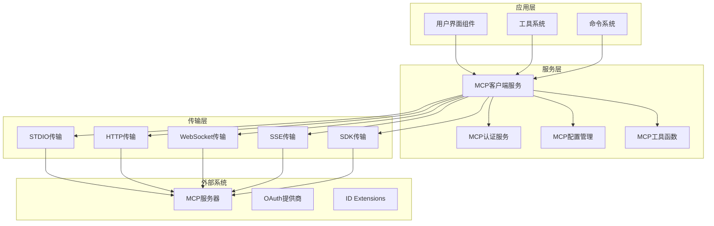

**图表来源**
- [src/services/mcp/client.ts:1-800](file://src/services/mcp/client.ts#L1-L800)
- [src/services/mcp/config.ts:1-200](file://src/services/mcp/config.ts#L1-L200)

**章节来源**
- [src/services/mcp/client.ts:1-800](file://src/services/mcp/client.ts#L1-L800)
- [src/services/mcp/config.ts:1-200](file://src/services/mcp/config.ts#L1-L200)

## 核心组件

### MCP客户端服务

MCP客户端服务是整个集成系统的核心，负责管理所有MCP服务器连接、处理消息传递和协调资源访问。该服务实现了完整的MCP协议规范，支持多种传输方式和认证机制。

主要功能包括：
- 连接管理：建立、维护和断开MCP服务器连接
- 消息路由：在客户端和服务器之间转发消息
- 资源缓存：缓存工具列表、资源目录和提示信息
- 错误处理：处理连接失败、超时和认证问题
- 生命周期管理：清理资源、处理断线重连

### MCP认证服务

认证服务提供了完整的OAuth 2.0和OpenID Connect支持，确保MCP服务器连接的安全性。该服务支持多种认证流程，包括标准OAuth授权码流程、PKCE增强和跨应用访问（XAA）。

关键特性：
- 多种认证方式：OAuth 2.0、OpenID Connect、XAA
- 安全令牌存储：加密存储访问令牌和刷新令牌
- 自动令牌刷新：透明处理令牌过期和刷新
- 会话管理：管理用户会话状态和权限范围

### MCP配置管理

配置管理系统负责MCP服务器的发现、注册和管理。它支持多种配置来源，包括用户配置、项目配置、企业策略和动态配置。

配置功能：
- 多源配置合并：整合来自不同来源的配置
- 策略检查：应用企业策略和安全限制
- 动态更新：支持运行时配置修改
- 配置验证：验证配置的有效性和安全性

**章节来源**
- [src/services/mcp/client.ts:1-800](file://src/services/mcp/client.ts#L1-L800)
- [src/services/mcp/auth.ts:1-200](file://src/services/mcp/auth.ts#L1-L200)
- [src/services/mcp/config.ts:1-200](file://src/services/mcp/config.ts#L1-L200)

## 架构概览

MCP协议集成采用模块化架构设计，每个组件都有明确的职责和边界：

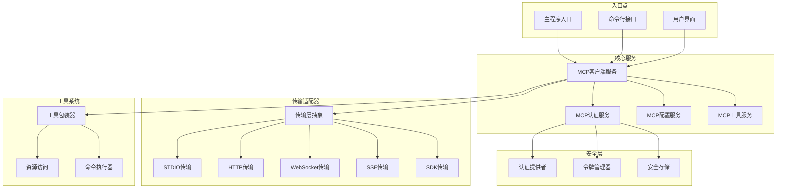

**图表来源**
- [src/services/mcp/client.ts:800-1600](file://src/services/mcp/client.ts#L800-L1600)
- [src/services/mcp/auth.ts:200-600](file://src/services/mcp/auth.ts#L200-L600)

## 详细组件分析

### 连接管理组件

连接管理是MCP协议集成中最复杂的部分，需要处理多种传输方式、认证状态和错误恢复。

#### 连接生命周期管理

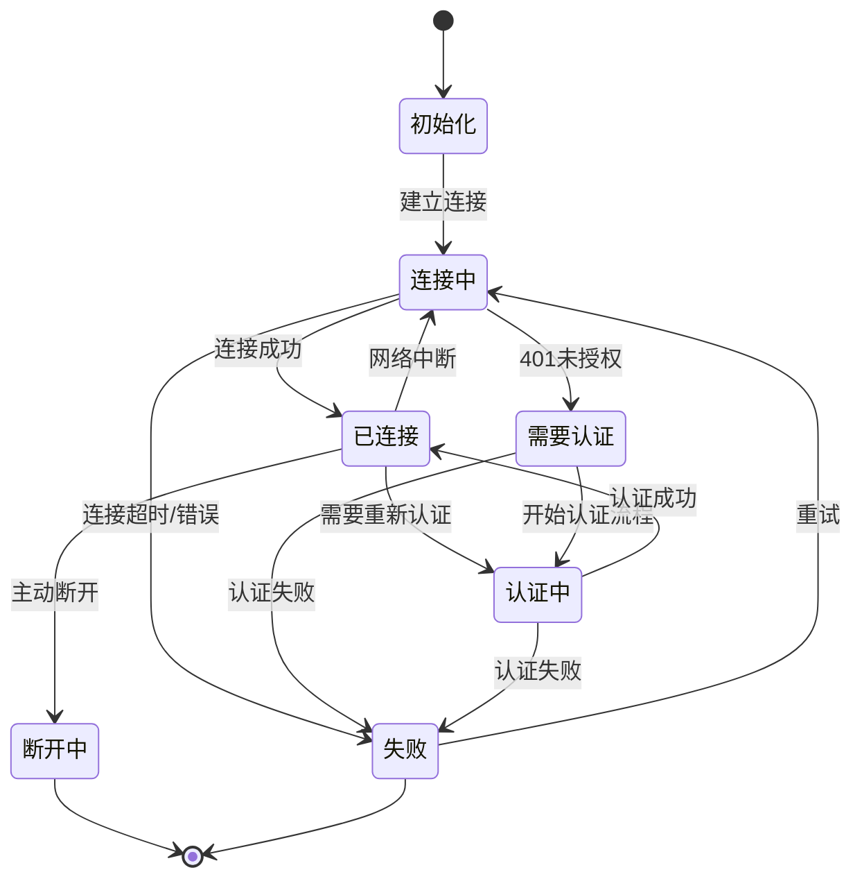

**图表来源**
- [src/services/mcp/client.ts:1200-1400](file://src/services/mcp/client.ts#L1200-L1400)

#### 传输适配器设计

系统支持五种不同的传输方式，每种都有专门的适配器：

| 传输类型 | 用途 | 特点 | 安全性 |
|---------|------|------|--------|
| STDIO | 本地进程通信 | 低延迟，进程隔离 | 高（本地进程） |
| HTTP | REST API调用 | 标准协议，广泛支持 | 中等（TLS） |
| WebSocket | 实时双向通信 | 持久连接，低延迟 | 高（TLS） |
| SSE | 服务器推送事件 | 单向流式数据 | 高（TLS） |
| SDK | 内部SDK集成 | 无进程开销 | 高（内存） |

**章节来源**
- [src/services/mcp/client.ts:595-960](file://src/services/mcp/client.ts#L595-L960)
- [src/services/mcp/types.ts:1-100](file://src/services/mcp/types.ts#L1-L100)

### 认证与安全组件

MCP认证系统实现了企业级的安全标准，支持多种认证协议和安全机制。

#### OAuth 2.0认证流程

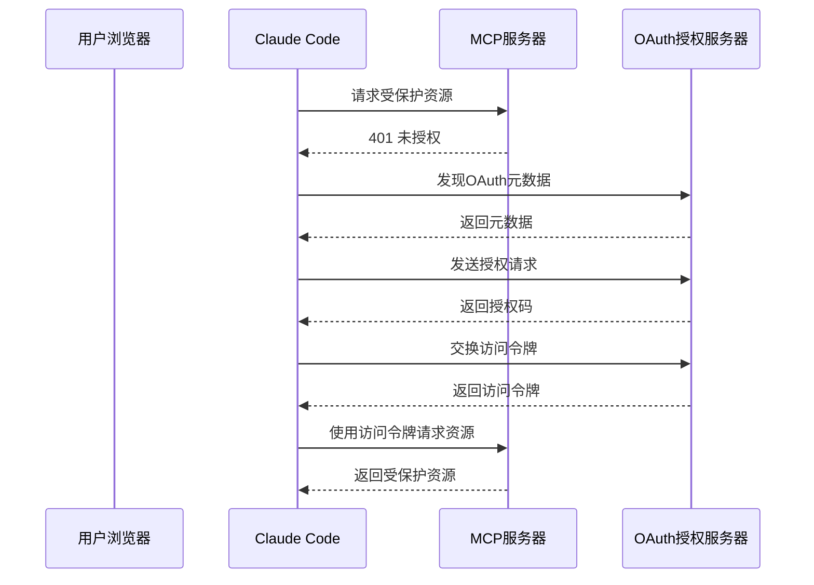

**图表来源**
- [src/services/mcp/auth.ts:256-311](file://src/services/mcp/auth.ts#L256-L311)
- [src/tools/McpAuthTool/McpAuthTool.ts:85-172](file://src/tools/McpAuthTool/McpAuthTool.ts#L85-L172)

#### 安全存储机制

系统使用多层安全存储来保护敏感信息：

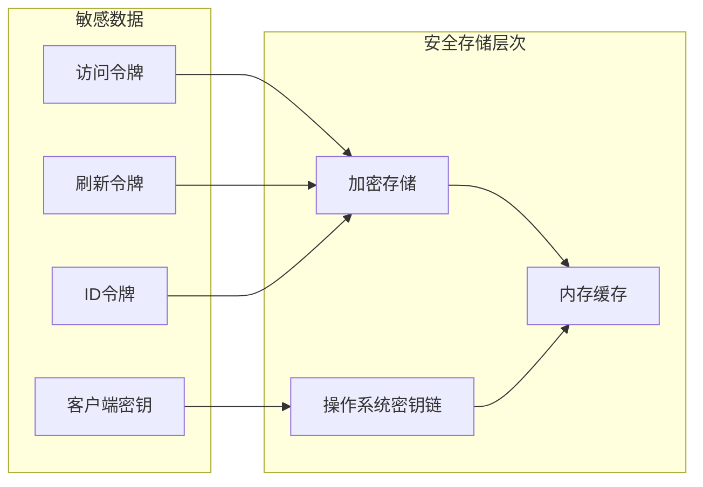

**图表来源**
- [src/services/mcp/auth.ts:467-618](file://src/services/mcp/auth.ts#L467-L618)

**章节来源**
- [src/services/mcp/auth.ts:1-200](file://src/services/mcp/auth.ts#L1-L200)
- [src/tools/McpAuthTool/McpAuthTool.ts:1-100](file://src/tools/McpAuthTool/McpAuthTool.ts#L1-L100)

### 工具包装与执行组件

MCP工具系统提供了统一的接口来包装和执行各种MCP工具，无论它们来自本地还是远程服务器。

#### 工具包装器架构

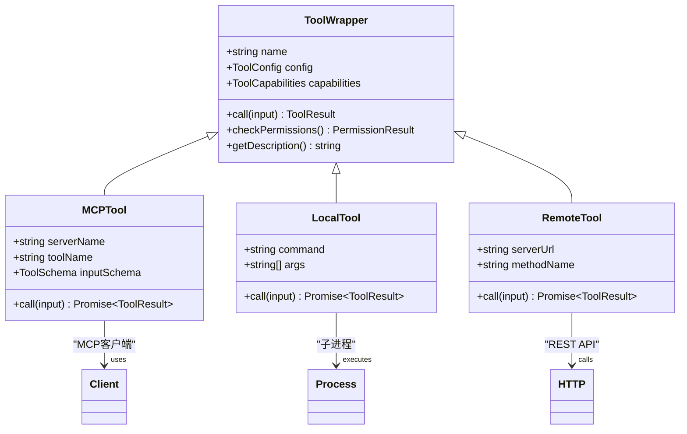

**图表来源**
- [src/tools/MCPTool/MCPTool.ts:1-78](file://src/tools/MCPTool/MCPTool.ts#L1-L78)
- [src/tools.ts:345-352](file://src/tools.ts#L345-L352)

#### 工具执行流程

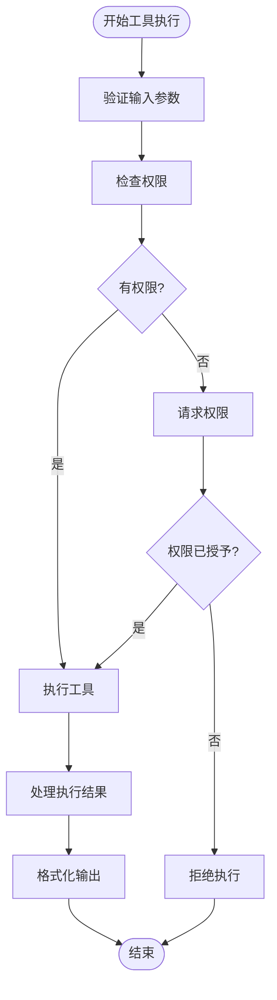

**图表来源**
- [src/tools/MCPTool/MCPTool.ts:50-65](file://src/tools/MCPTool/MCPTool.ts#L50-L65)

**章节来源**
- [src/tools/MCPTool/MCPTool.ts:1-78](file://src/tools/MCPTool/MCPTool.ts#L1-L78)
- [src/tools.ts:345-352](file://src/tools.ts#L345-L352)

### 资源访问组件

MCP资源系统提供了统一的接口来访问和管理各种类型的资源，包括文件、数据库记录和其他数据源。

#### 资源访问架构

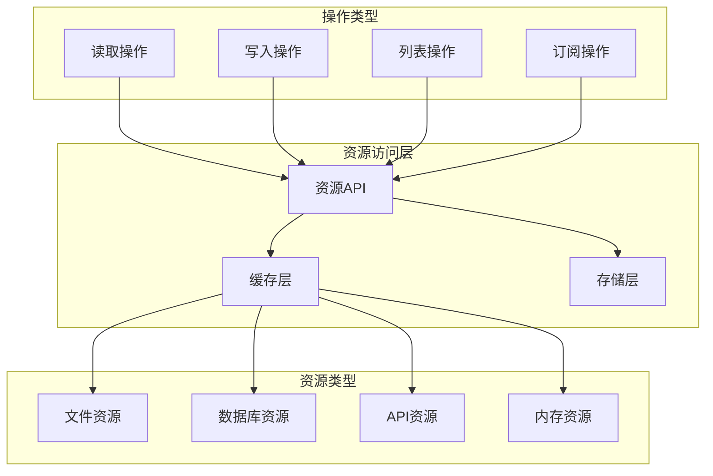

**图表来源**
- [src/tools/ListMcpResourcesTool/ListMcpResourcesTool.ts:66-100](file://src/tools/ListMcpResourcesTool/ListMcpResourcesTool.ts#L66-L100)
- [src/tools/ReadMcpResourceTool/ReadMcpResourceTool.ts:75-101](file://src/tools/ReadMcpResourceTool/ReadMcpResourceTool.ts#L75-L101)

**章节来源**
- [src/tools/ListMcpResourcesTool/ListMcpResourcesTool.ts:1-124](file://src/tools/ListMcpResourcesTool/ListMcpResourcesTool.ts#L1-L124)
- [src/tools/ReadMcpResourceTool/ReadMcpResourceTool.ts:1-101](file://src/tools/ReadMcpResourceTool/ReadMcpResourceTool.ts#L1-L101)

## 依赖关系分析

MCP协议集成系统具有清晰的依赖关系，遵循依赖倒置原则，确保系统的可维护性和可扩展性。

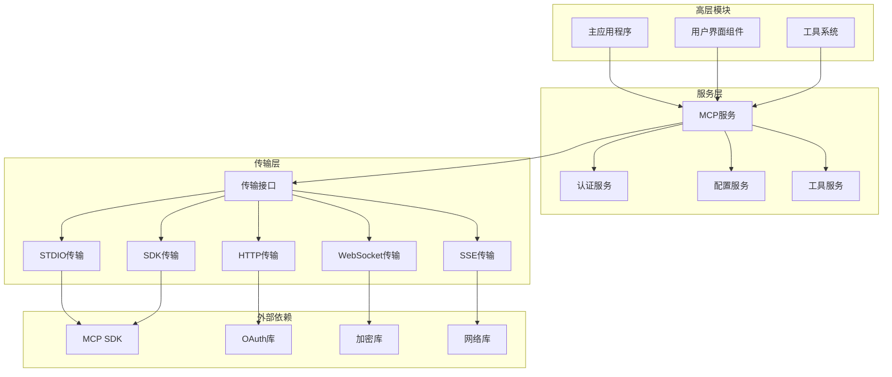

**图表来源**
- [src/services/mcp/client.ts:1-50](file://src/services/mcp/client.ts#L1-L50)
- [src/services/mcp/auth.ts:1-50](file://src/services/mcp/auth.ts#L1-L50)

**章节来源**
- [src/services/mcp/client.ts:1-50](file://src/services/mcp/client.ts#L1-L50)
- [src/services/mcp/auth.ts:1-50](file://src/services/mcp/auth.ts#L1-L50)

## 性能考虑

MCP协议集成系统在设计时充分考虑了性能优化，采用了多种技术和策略来确保高效运行。

### 连接池管理

系统实现了智能的连接池管理，通过以下机制优化性能：

- **连接复用**：重用已建立的连接，避免重复握手开销
- **批量处理**：对多个请求进行批处理，减少网络往返次数
- **预连接**：预先建立连接以减少首次请求延迟
- **连接健康检查**：定期检查连接状态，及时发现和修复问题

### 缓存策略

多层缓存机制确保数据访问的高效性：

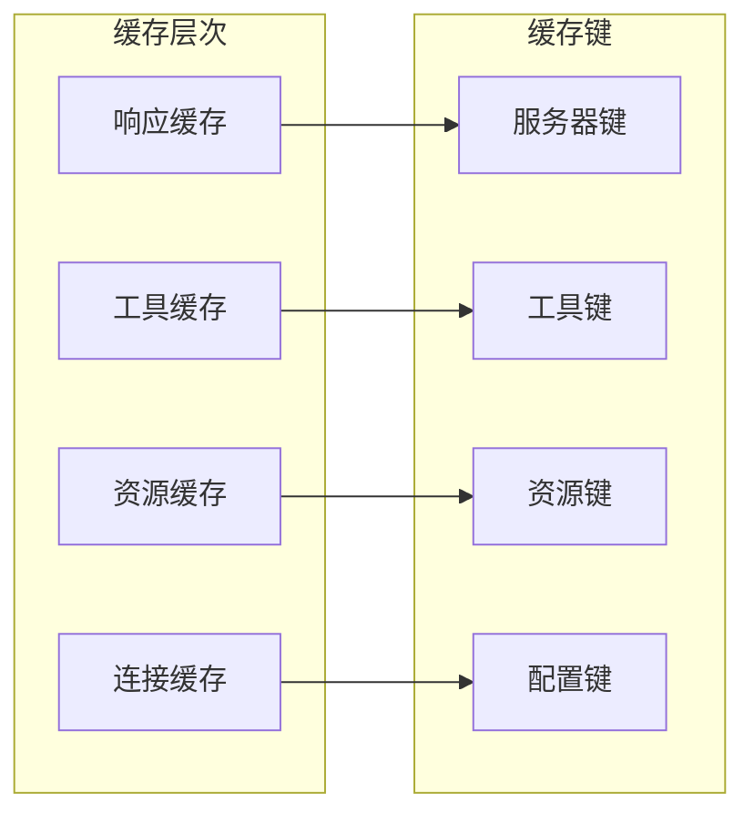

**图表来源**
- [src/services/mcp/client.ts:1389-1395](file://src/services/mcp/client.ts#L1389-L1395)

### 异步处理

系统广泛使用异步编程模式来提高并发性能：

- **Promise链**：使用Promise链处理异步操作序列
- **并发控制**：限制同时进行的连接数量
- **背压处理**：防止过多请求导致系统过载
- **超时管理**：为长时间操作设置合理的超时时间

## 故障排除指南

MCP协议集成系统提供了全面的错误处理和诊断功能，帮助开发者快速定位和解决问题。

### 常见错误类型

| 错误类型 | 触发条件 | 解决方案 | 影响程度 |
|---------|----------|----------|----------|
| 连接超时 | 网络延迟或服务器无响应 | 检查网络连接和服务器状态 | 中等 |
| 认证失败 | 令牌过期或无效 | 重新认证或检查凭据 | 中等 |
| 权限不足 | 用户无权访问特定资源 | 检查用户权限和策略配置 | 低 |
| 资源不存在 | 请求的资源已被删除 | 验证资源状态并重试 | 低 |
| 协议不匹配 | 服务器版本不兼容 | 更新客户端或服务器版本 | 高 |

### 调试工具

系统提供了多种调试工具来帮助诊断问题：

#### 日志系统

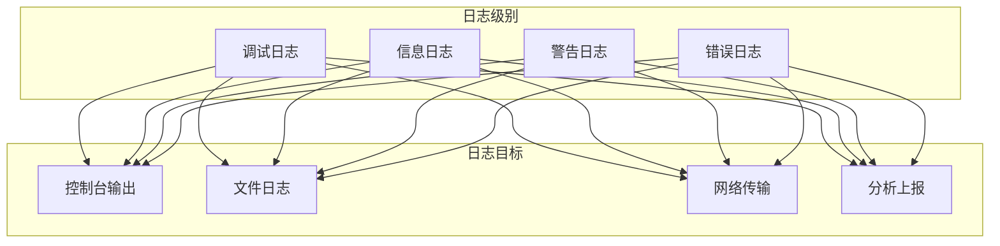

**图表来源**
- [src/services/mcp/client.ts:1688-1704](file://src/services/mcp/client.ts#L1688-L1704)

#### 监控指标

系统收集关键性能指标来监控MCP服务状态：

- **连接成功率**：衡量连接建立的成功率
- **响应时间**：测量请求处理的平均时间
- **错误率**：跟踪各种错误的发生频率
- **资源利用率**：监控内存和CPU使用情况
- **并发连接数**：跟踪同时活跃的连接数量

**章节来源**
- [src/services/mcp/client.ts:1688-1704](file://src/services/mcp/client.ts#L1688-L1704)
- [src/services/mcp/auth.ts:1-100](file://src/services/mcp/auth.ts#L1-L100)

## 结论

Claude Code的MCP协议集成为AI代理工具生态系统提供了强大而灵活的基础架构。通过模块化设计、多层次安全机制和高性能优化，该系统能够可靠地支持各种MCP服务器和工具的集成需求。

系统的主要优势包括：

1. **全面的协议支持**：支持MCP协议的所有核心功能和扩展
2. **多传输方式**：灵活选择最适合的传输方式
3. **企业级安全**：实现严格的安全标准和合规要求
4. **高性能设计**：通过缓存、连接池和异步处理优化性能
5. **易于扩展**：清晰的架构设计便于添加新功能和集成新服务

未来的发展方向包括进一步优化性能、增强安全功能和扩展对更多MCP服务器类型的支持。

## 附录

### 开发指南

#### 添加新的MCP服务器类型

要添加对新MCP服务器类型的支持，需要：

1. 在配置类型中添加新的服务器配置模式
2. 实现相应的传输适配器
3. 更新认证逻辑以支持新类型的认证需求
4. 添加适当的错误处理和重试机制
5. 编写测试用例验证功能正确性

#### 最佳实践

- 始终使用连接池管理MCP连接
- 实现适当的超时和重试机制
- 使用缓存减少重复请求
- 实施严格的错误处理和日志记录
- 遵循最小权限原则进行权限检查