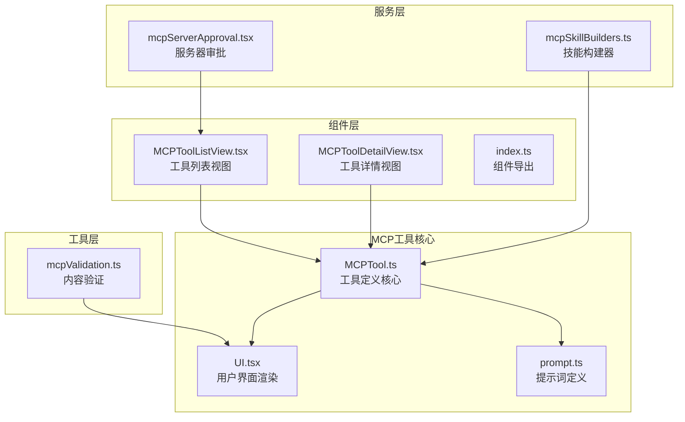
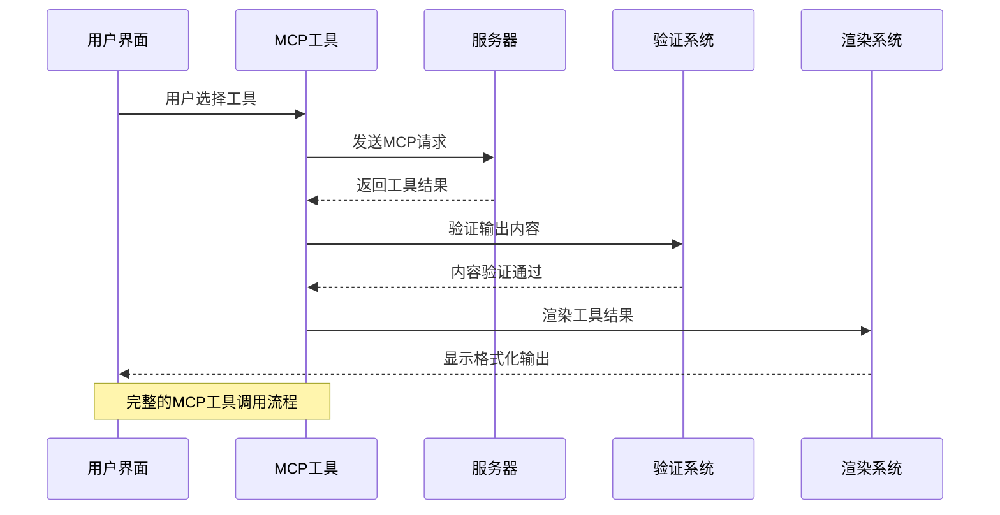
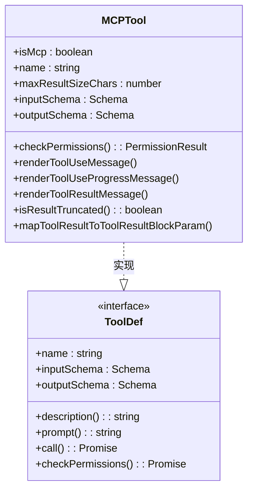
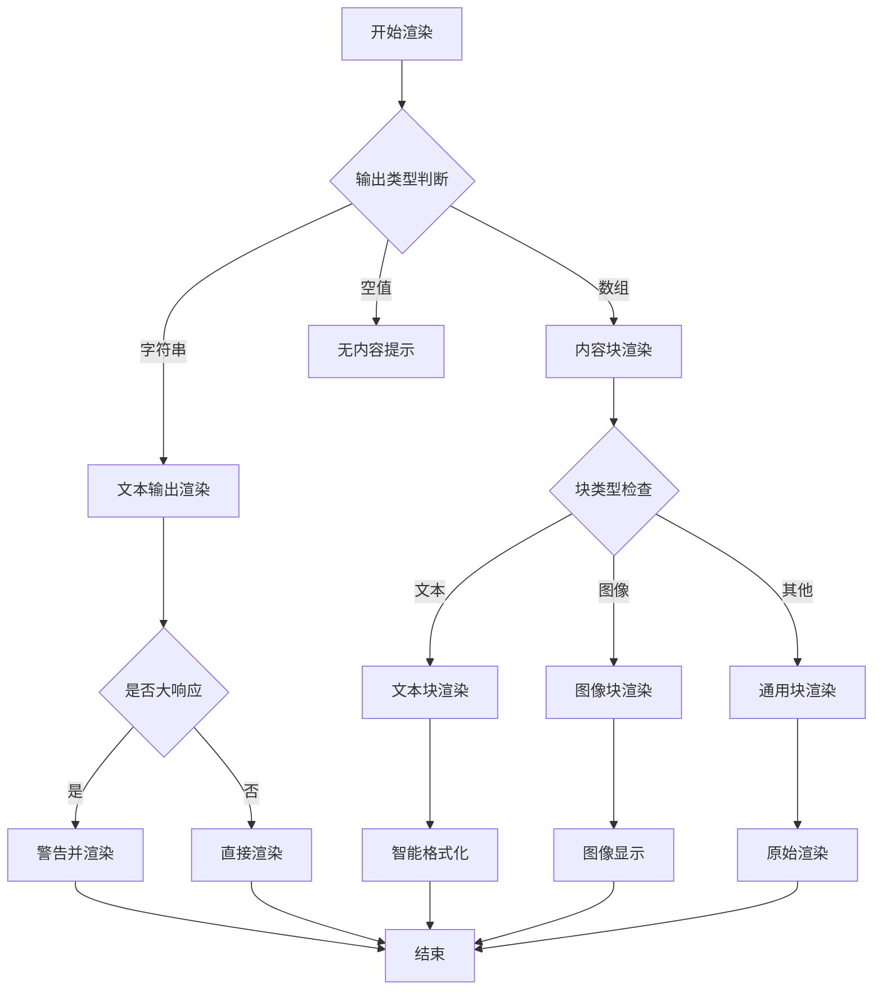
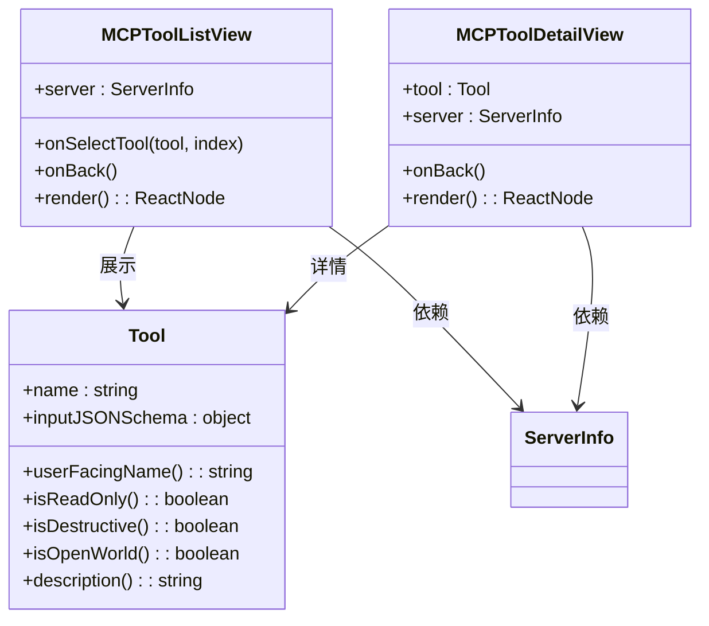
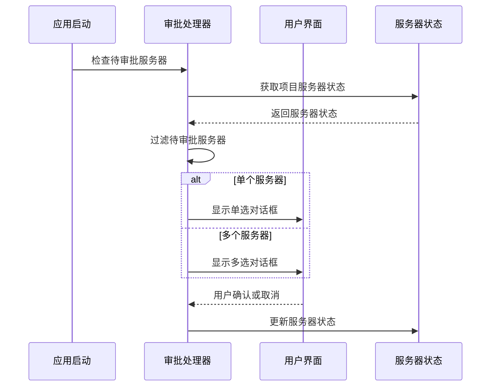
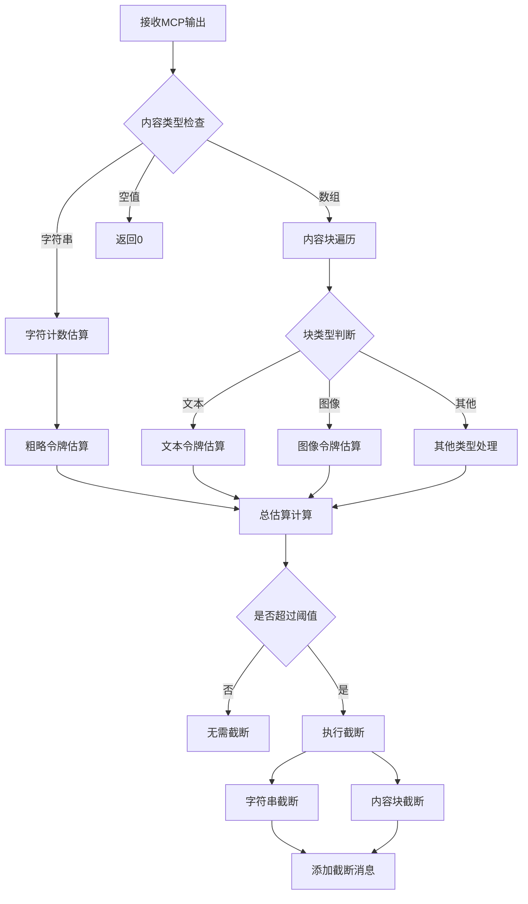

# MCP工具包装

<cite>
**本文档引用的文件**
- [MCPTool.ts](file://src/tools/MCPTool/MCPTool.ts)
- [UI.tsx](file://src/tools/MCPTool/UI.tsx)
- [prompt.ts](file://src/tools/MCPTool/prompt.ts)
- [mcpServerApproval.tsx](file://src/services/mcpServerApproval.tsx)
- [MCPToolListView.tsx](file://src/components/mcp/MCPToolListView.tsx)
- [MCPToolDetailView.tsx](file://src/components/mcp/MCPToolDetailView.tsx)
- [mcpValidation.ts](file://src/utils/mcpValidation.ts)
- [mcpSkillBuilders.ts](file://src/skills/mcpSkillBuilders.ts)
- [index.ts](file://src/components/mcp/index.ts)
</cite>

## 目录
1. [简介](#简介)
2. [项目结构](#项目结构)
3. [核心组件](#核心组件)
4. [架构概览](#架构概览)
5. [详细组件分析](#详细组件分析)
6. [依赖关系分析](#依赖关系分析)
7. [性能考虑](#性能考虑)
8. [故障排除指南](#故障排除指南)
9. [结论](#结论)
10. [附录](#附录)

## 简介

MCP（Model Context Protocol）工具包装是Claude Code中用于将外部MCP服务器提供的工具资源转换为本地可用工具接口的关键组件。该系统实现了从MCP资源发现、工具定义、参数映射到结果处理的完整流程，同时提供了丰富的UI包装、用户交互和状态管理功能。

本系统的核心目标是：
- 将MCP资源转换为Claude Code本地工具接口
- 提供直观的用户界面和交互体验
- 实现安全的权限控制和执行限制
- 支持动态工具发现和加载
- 优化性能和用户体验

## 项目结构

MCP工具包装系统采用模块化设计，主要包含以下核心目录：



**图表来源**
- [MCPTool.ts:1-78](file://src/tools/MCPTool/MCPTool.ts#L1-L78)
- [UI.tsx:1-403](file://src/tools/MCPTool/UI.tsx#L1-L403)
- [MCPToolListView.tsx:1-141](file://src/components/mcp/MCPToolListView.tsx#L1-L141)

**章节来源**
- [MCPTool.ts:1-78](file://src/tools/MCPTool/MCPTool.ts#L1-L78)
- [UI.tsx:1-403](file://src/tools/MCPTool/UI.tsx#L1-L403)
- [index.ts:1-10](file://src/components/mcp/index.ts#L1-L10)

## 核心组件

### MCP工具定义核心

MCPTool.ts定义了MCP工具的基础架构，包括输入输出模式、权限检查和UI渲染方法。

**关键特性：**
- 动态工具名称和描述覆盖机制
- 懒加载模式的输入输出模式
- 权限检查和工具使用消息渲染
- 结果截断检测和映射功能

**章节来源**
- [MCPTool.ts:1-78](file://src/tools/MCPTool/MCPTool.ts#L1-L78)

### 用户界面渲染系统

UI.tsx提供了完整的MCP工具输出渲染解决方案，支持多种输出格式和优化策略。

**核心功能：**
- 大型响应警告机制
- JSON内容自动解析和展示
- 文本内容智能格式化
- 图像内容特殊处理
- 进度条和状态显示

**章节来源**
- [UI.tsx:1-403](file://src/tools/MCPTool/UI.tsx#L1-L403)

### 组件导出系统

index.ts统一管理MCP相关组件的导出，确保模块间的松耦合。

**导出组件：**
- MCPAgentServerMenu - 代理服务器菜单
- MCPListPanel - 列表面板
- MCPReconnect - 重连组件
- MCPRemoteServerMenu - 远程服务器菜单
- MCPSettings - 设置界面
- MCPStdioServerMenu - 标准输入输出服务器菜单
- MCPToolDetailView - 工具详情视图
- MCPToolListView - 工具列表视图

**章节来源**
- [index.ts:1-10](file://src/components/mcp/index.ts#L1-L10)

## 架构概览

MCP工具包装系统采用分层架构设计，实现了从底层工具定义到上层用户交互的完整链路。



**图表来源**
- [MCPTool.ts:27-66](file://src/tools/MCPTool/MCPTool.ts#L27-L66)
- [UI.tsx:91-150](file://src/tools/MCPTool/UI.tsx#L91-L150)

系统架构特点：
- **分层设计**：工具定义、服务层、组件层、工具层清晰分离
- **模块化**：各组件独立可替换，降低耦合度
- **扩展性**：支持新的MCP服务器和工具类型
- **安全性**：内置权限控制和内容验证机制

## 详细组件分析

### MCP工具定义分析

MCPTool.ts实现了工具的核心功能，采用了工厂模式和懒加载策略。



**图表来源**
- [MCPTool.ts:27-77](file://src/tools/MCPTool/MCPTool.ts#L27-L77)

**关键实现细节：**
- 使用`lazySchema`实现延迟模式定义
- 动态权限检查机制
- 可配置的最大结果大小限制
- 灵活的工具名称和描述覆盖

**章节来源**
- [MCPTool.ts:1-78](file://src/tools/MCPTool/MCPTool.ts#L1-L78)

### 用户界面渲染系统分析

UI.tsx提供了多层次的内容渲染策略，针对不同类型的MCP输出进行优化处理。



**图表来源**
- [UI.tsx:91-150](file://src/tools/MCPTool/UI.tsx#L91-L150)

**渲染策略特点：**
- **智能JSON解析**：自动识别和解析JSON格式输出
- **内容压缩**：对大型响应进行警告和截断处理
- **格式化优化**：根据内容特征选择最佳展示方式
- **用户体验优先**：提供清晰的状态反馈和进度指示

**章节来源**
- [UI.tsx:1-403](file://src/tools/MCPTool/UI.tsx#L1-L403)

### 工具列表和详情视图分析

MCPToolListView.tsx和MCPToolDetailView.tsx提供了完整的工具浏览和信息展示功能。



**图表来源**
- [MCPToolListView.tsx:15-26](file://src/components/mcp/MCPToolListView.tsx#L15-L26)
- [MCPToolDetailView.tsx:9-13](file://src/components/mcp/MCPToolDetailView.tsx#L9-L13)

**功能特性：**
- **工具分类标注**：read-only、destructive、open-world标识
- **动态内容加载**：按需获取工具详细描述
- **键盘快捷键支持**：完整的键盘导航体验
- **响应式布局**：适配不同屏幕尺寸

**章节来源**
- [MCPToolListView.tsx:1-141](file://src/components/mcp/MCPToolListView.tsx#L1-L141)
- [MCPToolDetailView.tsx:1-212](file://src/components/mcp/MCPToolDetailView.tsx#L1-L212)

### 服务器审批和权限管理

mcpServerApproval.tsx实现了MCP服务器的自动审批流程，确保用户安全地连接到新的MCP服务器。



**图表来源**
- [mcpServerApproval.tsx:15-40](file://src/services/mcpServerApproval.tsx#L15-L40)

**安全特性：**
- **自动检测**：自动识别待审批的项目服务器
- **批量处理**：支持多个服务器的批量审批
- **状态跟踪**：实时跟踪服务器连接状态
- **用户控制**：完全由用户决定服务器连接

**章节来源**
- [mcpServerApproval.tsx:1-41](file://src/services/mcpServerApproval.tsx#L1-L41)

### 内容验证和截断系统

mcpValidation.ts提供了强大的内容验证和截断功能，确保MCP输出的安全性和性能。



**图表来源**
- [mcpValidation.ts:59-198](file://src/utils/mcpValidation.ts#L59-L198)

**验证机制：**
- **多层验证**：字符数估算、令牌精确计算
- **智能截断**：支持字符串和内容块的混合截断
- **图像优化**：智能压缩图像以适应空间限制
- **错误处理**：完善的异常捕获和降级策略

**章节来源**
- [mcpValidation.ts:1-209](file://src/utils/mcpValidation.ts#L1-L209)

## 依赖关系分析

MCP工具包装系统的依赖关系体现了清晰的分层架构和模块化设计。

```mermaid
graph TB
subgraph "外部依赖"
A[@anthropic-ai/sdk<br/>SDK接口定义]
B[zod<br/>数据验证]
C[react<br/>UI框架]
end
subgraph "内部模块"
D[Tool.js<br/>基础工具定义]
E[utils/*<br/>工具函数]
F[services/*<br/>服务层]
G[components/*<br/>UI组件]
H[constants/*<br/>常量定义]
end
subgraph "MCP特定模块"
I[mcpValidation.ts<br/>内容验证]
J[mcpServerApproval.tsx<br/>服务器审批]
K[MCPTool.ts<br/>工具定义]
L[UI.tsx<br/>界面渲染]
end
A --> K
B --> K
C --> L
D --> K
E --> L
F --> J
G --> L
H --> K
K --> I
J --> G
L --> G
```

**图表来源**
- [MCPTool.ts:1-10](file://src/tools/MCPTool/MCPTool.ts#L1-L10)
- [UI.tsx:1-18](file://src/tools/MCPTool/UI.tsx#L1-L18)

**依赖特点：**
- **向下依赖**：子模块依赖父模块的抽象定义
- **向外依赖**：使用标准库和第三方库
- **循环依赖避免**：通过接口和抽象类避免循环导入
- **松耦合设计**：模块间通过明确定义的接口通信

**章节来源**
- [mcpSkillBuilders.ts:1-45](file://src/skills/mcpSkillBuilders.ts#L1-L45)

## 性能考虑

MCP工具包装系统在多个层面实现了性能优化策略：

### 内存管理优化
- **懒加载模式**：使用`lazySchema`延迟模式定义，减少初始化开销
- **组件缓存**：React.memo和useMemo优化组件重新渲染
- **内容流式处理**：支持大响应的渐进式渲染

### 网络性能优化
- **智能截断**：基于令牌估算的预截断，避免不必要的网络传输
- **批量处理**：支持多个工具的批量审批和加载
- **缓存策略**：工具描述和配置的智能缓存

### 用户体验优化
- **进度反馈**：详细的进度条和状态指示
- **响应式设计**：适配不同设备和屏幕尺寸
- **键盘导航**：完整的键盘快捷键支持

## 故障排除指南

### 常见问题诊断

**MCP服务器连接问题：**
1. 检查服务器配置是否正确
2. 验证网络连接状态
3. 确认防火墙设置允许连接
4. 查看服务器日志获取详细错误信息

**工具执行失败：**
1. 检查工具参数格式是否正确
2. 验证服务器权限配置
3. 确认工具依赖是否满足
4. 查看工具返回的具体错误信息

**UI渲染异常：**
1. 检查浏览器兼容性
2. 验证React版本兼容性
3. 确认样式文件加载正常
4. 查看控制台JavaScript错误

### 调试技巧

**开发环境调试：**
- 启用详细日志记录
- 使用浏览器开发者工具
- 检查网络请求和响应
- 监控内存使用情况

**生产环境监控：**
- 设置性能指标监控
- 配置错误报告系统
- 建立告警机制
- 定期健康检查

**章节来源**
- [mcpServerApproval.tsx:15-40](file://src/services/mcpServerApproval.tsx#L15-L40)
- [mcpValidation.ts:151-178](file://src/utils/mcpValidation.ts#L151-L178)

## 结论

MCP工具包装系统展现了现代前端架构的最佳实践，通过模块化设计、分层架构和完善的错误处理机制，成功实现了MCP资源到本地工具接口的转换。

**主要成就：**
- **完整的工具链**：从资源发现到用户交互的全栈解决方案
- **优秀的用户体验**：直观的界面设计和流畅的交互体验
- **强大的安全性**：多层次的权限控制和内容验证机制
- **出色的性能表现**：优化的渲染策略和资源管理

**未来发展方向：**
- 扩展更多MCP服务器类型的支持
- 增强AI辅助的工具推荐功能
- 优化移动端的用户体验
- 加强与其他开发工具的集成

## 附录

### 开发指南

**环境要求：**
- Node.js 16+
- React 18+
- TypeScript 4+

**安装步骤：**
1. 克隆项目仓库
2. 安装依赖包
3. 配置环境变量
4. 启动开发服务器

**测试策略：**
- 单元测试：覆盖核心逻辑和边界条件
- 集成测试：验证组件间的协作
- 端到端测试：模拟真实用户场景
- 性能测试：评估系统在高负载下的表现

### API参考

**MCPTool接口：**
- `buildTool()` - 创建MCP工具实例
- `checkPermissions()` - 权限检查
- `renderToolUseMessage()` - 工具使用消息渲染
- `renderToolResultMessage()` - 工具结果消息渲染

**UI组件接口：**
- `MCPToolListView` - 工具列表视图
- `MCPToolDetailView` - 工具详情视图
- `MCPServerApprovalDialog` - 服务器审批对话框