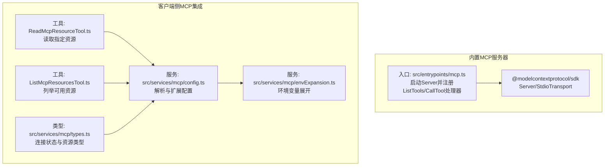
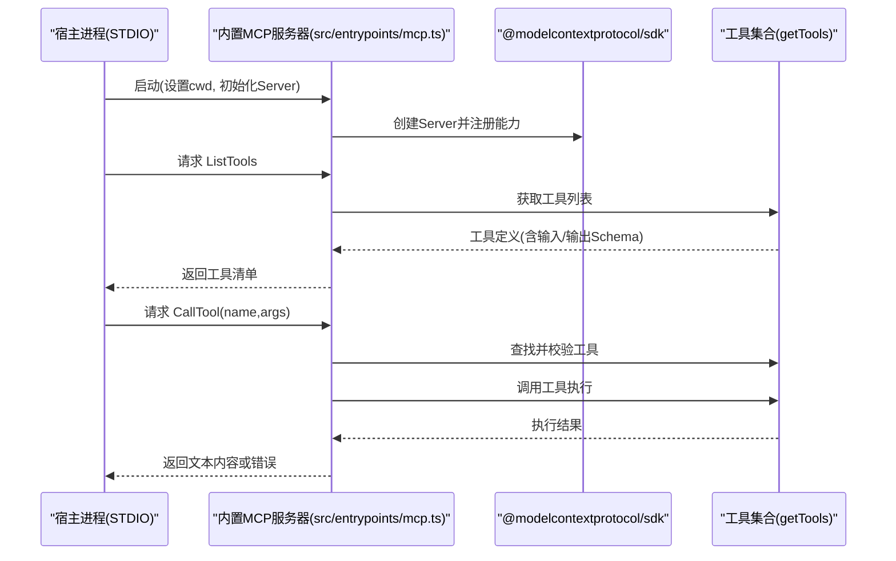
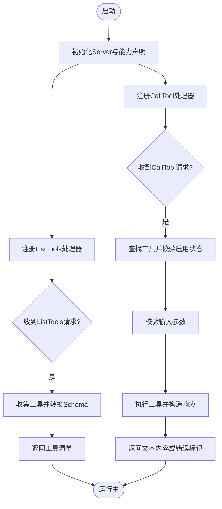
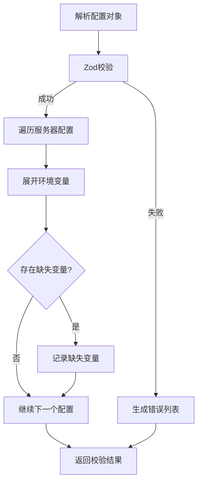
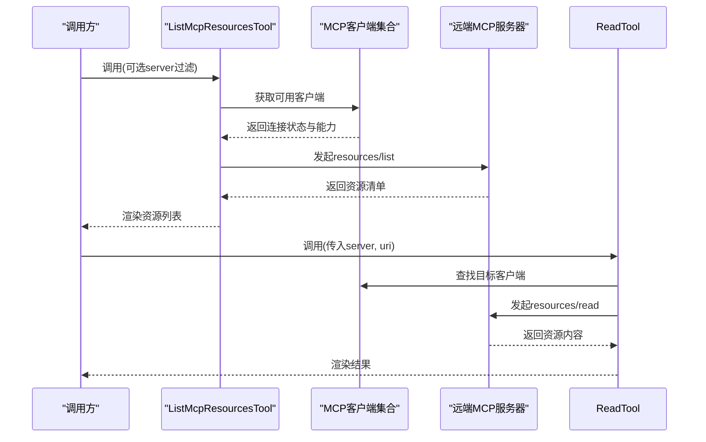
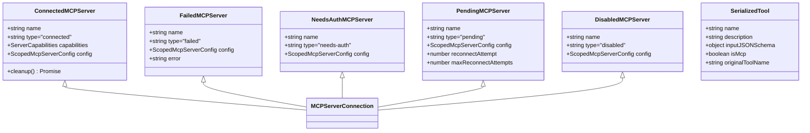
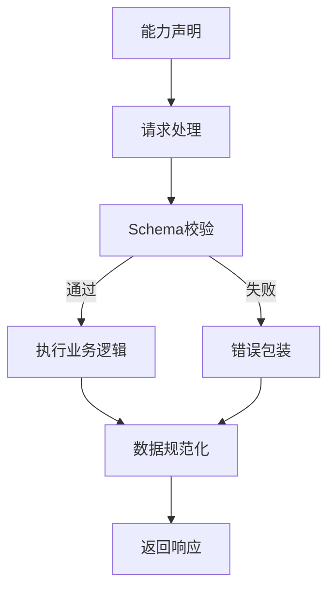
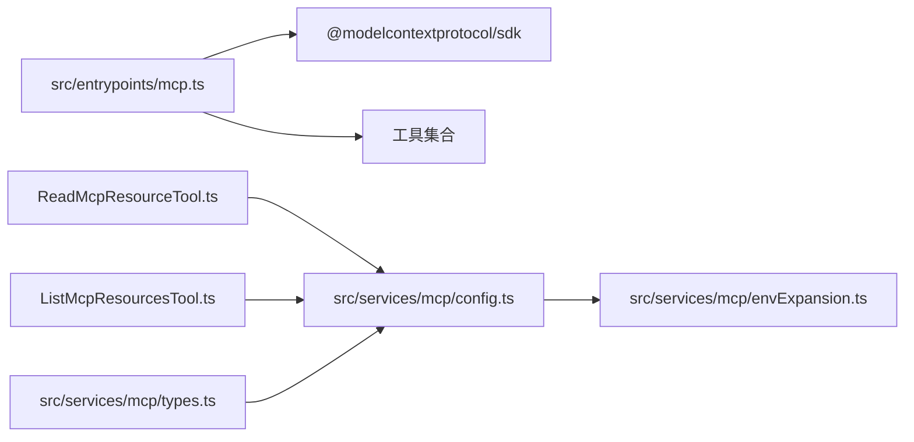

# MCP服务器开发

<cite>
**本文引用的文件**
- [src/entrypoints/mcp.ts](file://src/entrypoints/mcp.ts)
- [node_modules/@modelcontextprotocol/sdk/dist/cjs/server/mcp.js](file://node_modules/@modelcontextprotocol/sdk/dist/cjs/server/mcp.js)
- [src/services/mcp/config.ts](file://src/services/mcp/config.ts)
- [src/services/mcp/envExpansion.ts](file://src/services/mcp/envExpansion.ts)
- [src/components/MCPServerApprovalDialog.tsx](file://src/components/MCPServerApprovalDialog.tsx)
- [src/tools/ReadMcpResourceTool/ReadMcpResourceTool.ts](file://src/tools/ReadMcpResourceTool/ReadMcpResourceTool.ts)
- [src/tools/ListMcpResourcesTool/ListMcpResourcesTool.ts](file://src/tools/ListMcpResourcesTool/ListMcpResourcesTool.ts)
- [src/services/mcp/types.ts](file://src/services/mcp/types.ts)
- [src/commands/mcp/index.ts](file://src/commands/mcp/index.ts)
- [skills/mcpSkills.js](file://skills/mcpSkills.js)
</cite>

## 目录
1. [简介](#简介)
2. [项目结构](#项目结构)
3. [核心组件](#核心组件)
4. [架构总览](#架构总览)
5. [详细组件分析](#详细组件分析)
6. [依赖关系分析](#依赖关系分析)
7. [性能考虑](#性能考虑)
8. [故障排查指南](#故障排查指南)
9. [结论](#结论)
10. [附录](#附录)

## 简介
本指南面向希望基于MCP（Model Context Protocol）标准开发服务器实现的工程师，结合仓库中的现有实现，系统讲解协议实现、资源定义与能力声明、配置管理与环境变量扩展、请求头处理、标准化流程与数据规范化、兼容性保障、开发模板、测试方法与部署建议，以及性能优化、监控指标与故障排查技巧。文档同时提供可视化架构图与流程图，帮助快速理解与落地。

## 项目结构
该仓库围绕MCP协议提供了两类实现路径：
- 内置MCP服务器入口：通过标准SDK封装工具能力，以STDIO传输方式对外提供工具调用服务。
- 客户端侧MCP集成：通过工具与服务层对接远端MCP服务器，支持资源列举与读取等能力。

**图表来源**
- [src/entrypoints/mcp.ts:35-196](file://src/entrypoints/mcp.ts#L35-L196)
- [node_modules/@modelcontextprotocol/sdk/dist/cjs/server/mcp.js:18-782](file://node_modules/@modelcontextprotocol/sdk/dist/cjs/server/mcp.js#L18-L782)
- [src/tools/ReadMcpResourceTool/ReadMcpResourceTool.ts:75-101](file://src/tools/ReadMcpResourceTool/ReadMcpResourceTool.ts#L75-L101)
- [src/tools/ListMcpResourcesTool/ListMcpResourcesTool.ts:15-38](file://src/tools/ListMcpResourcesTool/ListMcpResourcesTool.ts#L15-L38)
- [src/services/mcp/config.ts:1297-1331](file://src/services/mcp/config.ts#L1297-L1331)
- [src/services/mcp/envExpansion.ts:10-38](file://src/services/mcp/envExpansion.ts#L10-L38)
- [src/services/mcp/types.ts:177-244](file://src/services/mcp/types.ts#L177-L244)

**章节来源**
- [src/entrypoints/mcp.ts:35-196](file://src/entrypoints/mcp.ts#L35-L196)
- [src/services/mcp/config.ts:1297-1331](file://src/services/mcp/config.ts#L1297-L1331)
- [src/services/mcp/envExpansion.ts:10-38](file://src/services/mcp/envExpansion.ts#L10-L38)
- [src/tools/ReadMcpResourceTool/ReadMcpResourceTool.ts:75-101](file://src/tools/ReadMcpResourceTool/ReadMcpResourceTool.ts#L75-L101)
- [src/tools/ListMcpResourcesTool/ListMcpResourcesTool.ts:15-38](file://src/tools/ListMcpResourcesTool/ListMcpResourcesTool.ts#L15-L38)
- [src/services/mcp/types.ts:177-244](file://src/services/mcp/types.ts#L177-L244)

## 核心组件
- 内置MCP服务器入口：负责初始化Server、注册工具能力、处理ListTools与CallTool请求，并通过STDIO传输与宿主通信。
- 配置与环境变量：提供MCP配置解析、校验与环境变量展开能力，支持默认值与缺失变量追踪。
- 客户端工具：封装对远端MCP服务器的资源读取与列举操作，统一错误处理与结果渲染。
- 类型与状态：定义服务器连接状态、资源类型与序列化工具结构，支撑跨模块一致性。

**章节来源**
- [src/entrypoints/mcp.ts:35-196](file://src/entrypoints/mcp.ts#L35-L196)
- [src/services/mcp/config.ts:1297-1331](file://src/services/mcp/config.ts#L1297-L1331)
- [src/services/mcp/envExpansion.ts:10-38](file://src/services/mcp/envExpansion.ts#L10-L38)
- [src/tools/ReadMcpResourceTool/ReadMcpResourceTool.ts:75-101](file://src/tools/ReadMcpResourceTool/ReadMcpResourceTool.ts#L75-L101)
- [src/tools/ListMcpResourcesTool/ListMcpResourcesTool.ts:15-38](file://src/tools/ListMcpResourcesTool/ListMcpResourcesTool.ts#L15-L38)
- [src/services/mcp/types.ts:177-244](file://src/services/mcp/types.ts#L177-L244)

## 架构总览
下图展示了内置MCP服务器从启动到处理工具调用的关键交互：

**图表来源**
- [src/entrypoints/mcp.ts:47-196](file://src/entrypoints/mcp.ts#L47-L196)
- [node_modules/@modelcontextprotocol/sdk/dist/cjs/server/mcp.js:59-148](file://node_modules/@modelcontextprotocol/sdk/dist/cjs/server/mcp.js#L59-L148)

## 详细组件分析

### 组件A：内置MCP服务器入口
- 职责
  - 初始化Server与能力声明（tools）
  - 注册ListTools处理器：动态生成工具清单，转换输入/输出Schema为JSON Schema
  - 注册CallTool处理器：查找工具、权限校验、参数验证、执行工具并返回标准化结果
  - 通过STDIO传输与宿主通信
- 关键点
  - 使用LRU缓存限制文件状态读取，避免内存增长
  - 对输出Schema进行根级类型约束，过滤不兼容联合类型
  - 将非字符串结果序列化为文本，确保MCP SDK兼容

**图表来源**
- [src/entrypoints/mcp.ts:47-196](file://src/entrypoints/mcp.ts#L47-L196)

**章节来源**
- [src/entrypoints/mcp.ts:35-196](file://src/entrypoints/mcp.ts#L35-L196)

### 组件B：配置管理与环境变量扩展
- 职责
  - 解析MCP配置对象，校验字段与类型
  - 支持环境变量展开，处理${VAR}与${VAR:-default}语法
  - 记录缺失变量，便于后续诊断
- 关键点
  - 对每个服务器配置项进行展开与校验，生成错误报告
  - 提供URL解包逻辑，适配代理场景下的原始URL提取

**图表来源**
- [src/services/mcp/config.ts:1297-1331](file://src/services/mcp/config.ts#L1297-L1331)
- [src/services/mcp/envExpansion.ts:10-38](file://src/services/mcp/envExpansion.ts#L10-L38)

**章节来源**
- [src/services/mcp/config.ts:1297-1331](file://src/services/mcp/config.ts#L1297-L1331)
- [src/services/mcp/envExpansion.ts:10-38](file://src/services/mcp/envExpansion.ts#L10-L38)

### 组件C：客户端侧MCP资源工具
- 职责
  - 列举远端MCP服务器提供的资源
  - 读取指定URI的资源内容
  - 统一错误处理与结果渲染
- 关键点
  - 通过已连接的客户端实例发起resources/list与resources/read请求
  - 校验服务器类型、连接状态与能力声明
  - 对超长输出进行截断提示

**图表来源**
- [src/tools/ListMcpResourcesTool/ListMcpResourcesTool.ts:15-38](file://src/tools/ListMcpResourcesTool/ListMcpResourcesTool.ts#L15-L38)
- [src/tools/ReadMcpResourceTool/ReadMcpResourceTool.ts:75-101](file://src/tools/ReadMcpResourceTool/ReadMcpResourceTool.ts#L75-L101)

**章节来源**
- [src/tools/ListMcpResourcesTool/ListMcpResourcesTool.ts:15-38](file://src/tools/ListMcpResourcesTool/ListMcpResourcesTool.ts#L15-L38)
- [src/tools/ReadMcpResourceTool/ReadMcpResourceTool.ts:75-101](file://src/tools/ReadMcpResourceTool/ReadMcpResourceTool.ts#L75-L101)

### 组件D：类型与状态定义
- 职责
  - 定义MCP服务器连接状态（已连接、失败、待认证、待重连、禁用）
  - 定义资源类型与序列化工具结构
- 关键点
  - 连接状态用于UI与业务逻辑的分支处理
  - 序列化工具结构支持MCP工具在CLI中的展示与分类

**图表来源**
- [src/services/mcp/types.ts:177-244](file://src/services/mcp/types.ts#L177-L244)

**章节来源**
- [src/services/mcp/types.ts:177-244](file://src/services/mcp/types.ts#L177-L244)

### 概念总览
- MCP服务器标准化流程
  - 能力声明：tools/resources/prompts/completions
  - 请求处理：严格Schema校验、错误包装、幂等与可恢复性
  - 数据规范化：统一文本输出、结构化内容与错误标记
  - 兼容性保障：根级object类型约束、联合类型降级策略
- 配置管理与环境变量扩展
  - 声明式配置解析与校验
  - 变量展开与缺失追踪
  - 代理URL解包与去重签名
- 请求头处理
  - 当前实现主要通过STDIO传输；HTTP/WebSocket场景需在上层适配器中注入头部信息

[此图为概念性流程，不直接映射具体源码文件，故无图表来源]

## 依赖关系分析
- 内置服务器依赖SDK Server与StdioTransport，负责协议层面的请求分发与能力注册
- 客户端工具依赖配置服务与类型定义，确保连接状态与资源类型的强一致
- 配置服务依赖环境变量展开工具，提供解析与校验能力

**图表来源**
- [src/entrypoints/mcp.ts:47-196](file://src/entrypoints/mcp.ts#L47-L196)
- [src/services/mcp/config.ts:1297-1331](file://src/services/mcp/config.ts#L1297-L1331)
- [src/services/mcp/envExpansion.ts:10-38](file://src/services/mcp/envExpansion.ts#L10-L38)
- [src/tools/ReadMcpResourceTool/ReadMcpResourceTool.ts:75-101](file://src/tools/ReadMcpResourceTool/ReadMcpResourceTool.ts#L75-L101)
- [src/tools/ListMcpResourcesTool/ListMcpResourcesTool.ts:15-38](file://src/tools/ListMcpResourcesTool/ListMcpResourcesTool.ts#L15-L38)
- [src/services/mcp/types.ts:177-244](file://src/services/mcp/types.ts#L177-L244)

**章节来源**
- [src/entrypoints/mcp.ts:47-196](file://src/entrypoints/mcp.ts#L47-L196)
- [src/services/mcp/config.ts:1297-1331](file://src/services/mcp/config.ts#L1297-L1331)
- [src/services/mcp/envExpansion.ts:10-38](file://src/services/mcp/envExpansion.ts#L10-L38)
- [src/tools/ReadMcpResourceTool/ReadMcpResourceTool.ts:75-101](file://src/tools/ReadMcpResourceTool/ReadMcpResourceTool.ts#L75-L101)
- [src/tools/ListMcpResourcesTool/ListMcpResourcesTool.ts:15-38](file://src/tools/ListMcpResourcesTool/ListMcpResourcesTool.ts#L15-L38)
- [src/services/mcp/types.ts:177-244](file://src/services/mcp/types.ts#L177-L244)

## 性能考虑
- 内存与缓存
  - 文件状态读取使用LRU缓存，限制容量与大小，避免无界增长
  - 工具输出结果按需序列化，减少大对象开销
- 并发与隔离
  - 工具调用上下文包含独立的AbortController，便于取消与中断
  - 工具描述与权限上下文分离，降低耦合
- I/O与网络
  - STDIO传输简单可靠；HTTP/WebSocket场景建议引入背压与重试机制
  - 资源读取前先做能力检查，避免无效请求

[本节为通用性能建议，不直接分析具体文件，故无章节来源]

## 故障排查指南
- 启动与连接
  - 检查Server是否正确注册能力与处理器
  - 确认STDIO传输已建立且未提前关闭
- 工具调用
  - 输入参数不符合Schema时会返回错误包装；查看日志定位字段
  - 工具未启用或不存在时抛出明确错误
- 配置问题
  - 环境变量缺失会导致解析失败；根据缺失列表补齐
  - 代理URL场景下确认原始URL解包逻辑生效
- 客户端工具
  - 服务器未连接或不支持resources能力时抛错
  - 超长输出可能被截断，检查终端宽度与输出长度

**章节来源**
- [src/entrypoints/mcp.ts:135-187](file://src/entrypoints/mcp.ts#L135-L187)
- [src/services/mcp/config.ts:1297-1331](file://src/services/mcp/config.ts#L1297-L1331)
- [src/tools/ReadMcpResourceTool/ReadMcpResourceTool.ts:80-92](file://src/tools/ReadMcpResourceTool/ReadMcpResourceTool.ts#L80-L92)

## 结论
本指南基于现有代码实现了MCP服务器的核心能力：工具能力声明、请求处理与数据规范化、配置解析与环境变量扩展、客户端侧资源工具与类型定义。遵循这些实践，可以快速构建符合MCP标准的服务器实现，并在兼容性、可维护性与可观测性方面获得良好基础。

[本节为总结性内容，不直接分析具体文件，故无章节来源]

## 附录

### 开发模板（基于现有实现）
- 服务器入口
  - 初始化Server与能力声明
  - 注册ListTools处理器：收集工具、转换Schema、生成描述
  - 注册CallTool处理器：查找工具、校验输入、执行工具、返回文本或错误
  - 通过StdioServerTransport连接宿主
- 配置与环境变量
  - 使用Zod解析配置对象
  - 展开${VAR}与${VAR:-default}，记录缺失变量
  - 对URL进行代理解包，生成去重签名
- 客户端工具
  - 列举资源：发起resources/list，渲染资源列表
  - 读取资源：发起resources/read，处理超长输出与错误

**章节来源**
- [src/entrypoints/mcp.ts:47-196](file://src/entrypoints/mcp.ts#L47-L196)
- [src/services/mcp/config.ts:1297-1331](file://src/services/mcp/config.ts#L1297-L1331)
- [src/tools/ListMcpResourcesTool/ListMcpResourcesTool.ts:15-38](file://src/tools/ListMcpResourcesTool/ListMcpResourcesTool.ts#L15-L38)
- [src/tools/ReadMcpResourceTool/ReadMcpResourceTool.ts:75-101](file://src/tools/ReadMcpResourceTool/ReadMcpResourceTool.ts#L75-L101)

### 测试方法
- 单元测试
  - 针对ListTools/CallTool处理器的输入输出进行边界测试
  - 验证Schema转换与错误包装行为
- 集成测试
  - 使用Mock Transport模拟STDIO交互
  - 验证配置解析与环境变量展开流程
- 端到端测试
  - 通过工具链路验证resources/list与resources/read
  - 模拟缺失变量与代理URL场景

[本节为通用测试建议，不直接分析具体文件，故无章节来源]

### 部署指南
- 内置服务器
  - 作为子进程启动，通过STDIO与宿主通信
  - 在容器中注意工作目录与权限设置
- 客户端集成
  - 在本地设置中启用特定MCP服务器
  - 使用批准对话框管理新发现的服务器

**章节来源**
- [src/commands/mcp/index.ts:3-10](file://src/commands/mcp/index.ts#L3-L10)
- [src/components/MCPServerApprovalDialog.tsx:63-102](file://src/components/MCPServerApprovalDialog.tsx#L63-L102)

### 监控指标与告警
- 指标
  - 工具调用次数与成功率
  - 请求延迟分布（p50/p95）
  - 缓存命中率（文件状态LRU）
  - 配置解析错误数与缺失变量统计
- 告警
  - 工具执行异常率突增
  - 配置解析失败或缺失变量持续出现

[本节为通用监控建议，不直接分析具体文件，故无章节来源]

### 技术细节与兼容性
- 输出Schema根级类型要求
  - MCP SDK要求根级类型为object，避免union/discriminatedUnion等根级联合类型
- 错误处理
  - 统一包装为isError标记与文本内容，便于消费端识别
- 资源能力
  - 仅在服务器声明resources能力后才允许读取与列举

**章节来源**
- [src/entrypoints/mcp.ts:68-92](file://src/entrypoints/mcp.ts#L68-L92)
- [src/tools/ReadMcpResourceTool/ReadMcpResourceTool.ts:90-92](file://src/tools/ReadMcpResourceTool/ReadMcpResourceTool.ts#L90-L92)