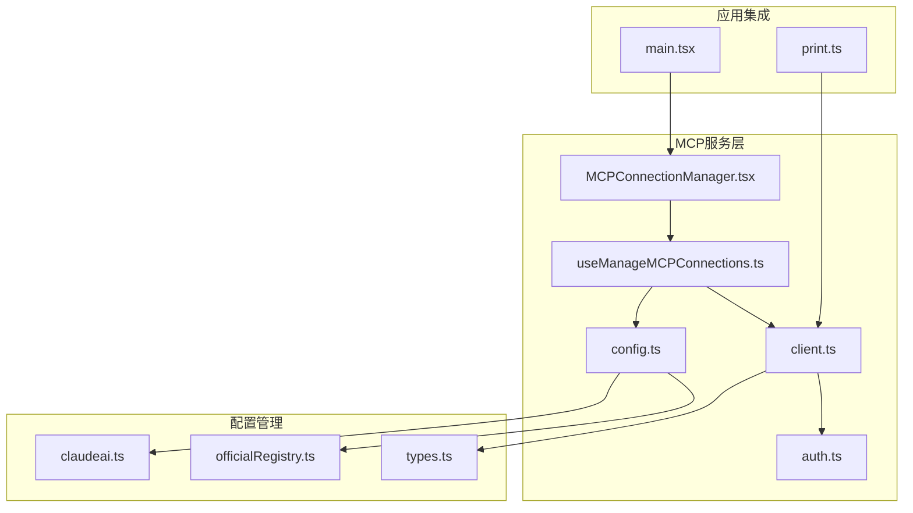
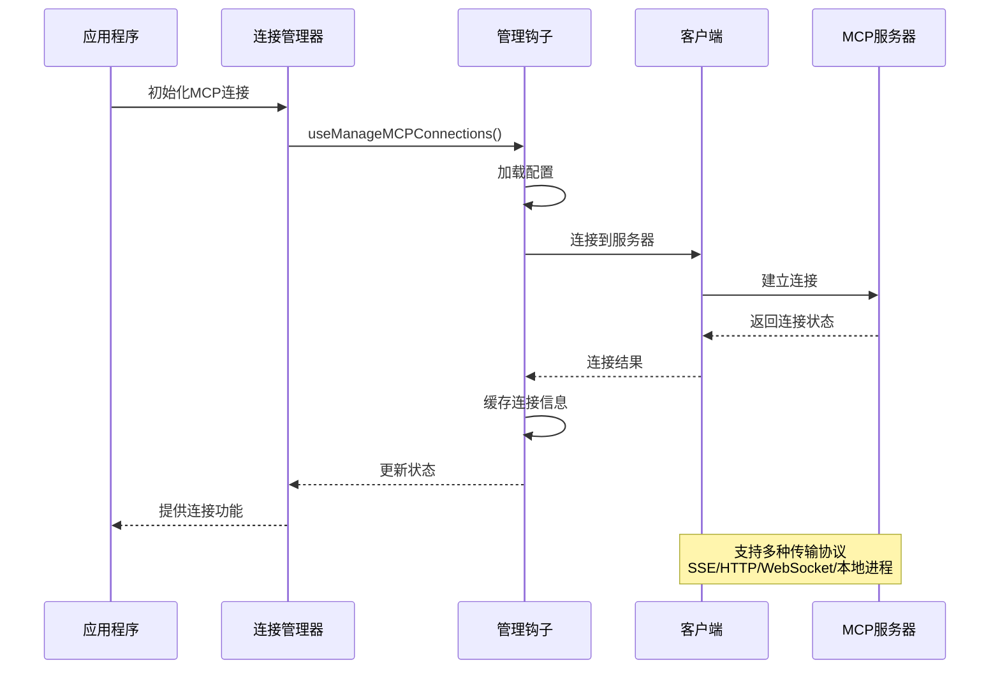
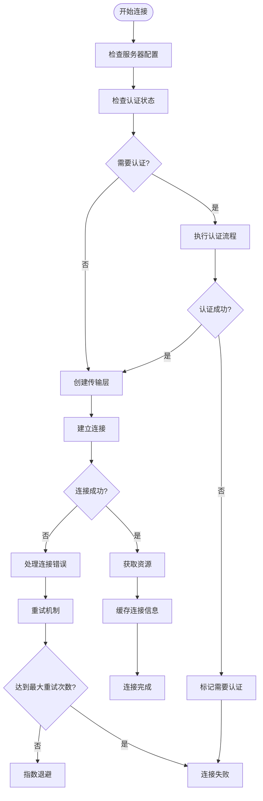
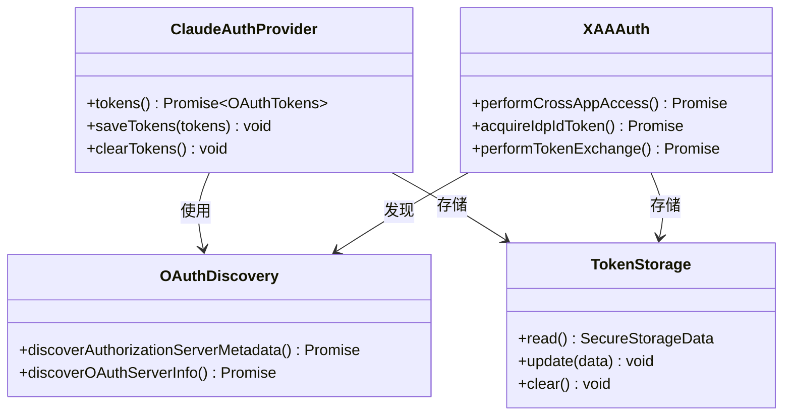

# MCP连接管理

<cite>
**本文档引用的文件**
- [MCPConnectionManager.tsx](file://src/services/mcp/MCPConnectionManager.tsx)
- [useManageMCPConnections.ts](file://src/services/mcp/useManageMCPConnections.ts)
- [client.ts](file://src/services/mcp/client.ts)
- [config.ts](file://src/services/mcp/config.ts)
- [auth.ts](file://src/services/mcp/auth.ts)
- [types.ts](file://src/services/mcp/types.ts)
- [officialRegistry.ts](file://src/services/mcp/officialRegistry.ts)
- [claudeai.ts](file://src/services/mcp/claudeai.ts)
- [main.tsx](file://src/main.tsx)
- [print.ts](file://src/cli/print.ts)
</cite>

## 目录
1. [简介](#简介)
2. [项目结构](#项目结构)
3. [核心组件](#核心组件)
4. [架构概览](#架构概览)
5. [详细组件分析](#详细组件分析)
6. [依赖关系分析](#依赖关系分析)
7. [性能考虑](#性能考虑)
8. [故障排除指南](#故障排除指南)
9. [结论](#结论)

## 简介

MCP（Model Context Protocol）连接管理是Claude Code项目中的关键基础设施，负责管理与各种MCP服务器的连接、认证和资源获取。该系统支持多种传输协议（SSE、HTTP、WebSocket、本地进程），提供智能重连机制、资源缓存和企业级安全策略。

本技术文档深入解析MCP连接管理的完整实现，包括连接建立、维护、销毁的全过程，以及认证流程、超时处理、资源清理等关键技术特性。

## 项目结构

MCP连接管理系统主要位于`src/services/mcp/`目录下，采用模块化设计：



**图表来源**
- [MCPConnectionManager.tsx:1-73](file://src/services/mcp/MCPConnectionManager.tsx#L1-L73)
- [useManageMCPConnections.ts:143-146](file://src/services/mcp/useManageMCPConnections.ts#L143-L146)
- [client.ts:1-800](file://src/services/mcp/client.ts#L1-L800)

**章节来源**
- [MCPConnectionManager.tsx:1-73](file://src/services/mcp/MCPConnectionManager.tsx#L1-L73)
- [useManageMCPConnections.ts:143-146](file://src/services/mcp/useManageMCPConnections.ts#L143-L146)

## 核心组件

### 连接管理器（MCPConnectionManager）

MCPConnectionManager是React上下文提供者，负责在整个应用中提供MCP连接相关的功能：

- **reconnectMcpServer**: 重新连接指定的MCP服务器
- **toggleMcpServer**: 启用或禁用MCP服务器
- **动态配置支持**: 支持运行时添加和移除MCP服务器配置

### 连接管理钩子（useManageMCPConnections）

这是一个核心的React钩子，实现了完整的MCP连接生命周期管理：

- **自动连接初始化**: 启动时自动连接所有已配置的MCP服务器
- **智能重连机制**: 基于指数退避算法的自动重连
- **状态同步**: 将连接状态同步到应用状态树
- **批量处理**: 支持并发连接多个MCP服务器

### 客户端管理（client.ts）

提供了MCP连接的核心功能：

- **连接建立**: 支持多种传输协议（SSE、HTTP、WebSocket、本地进程）
- **资源获取**: 自动获取工具、命令和资源列表
- **缓存管理**: 智能缓存机制减少重复连接开销
- **错误处理**: 完善的错误分类和处理机制

**章节来源**
- [MCPConnectionManager.tsx:37-72](file://src/services/mcp/MCPConnectionManager.tsx#L37-L72)
- [useManageMCPConnections.ts:143-200](file://src/services/mcp/useManageMCPConnections.ts#L143-L200)
- [client.ts:595-607](file://src/services/mcp/client.ts#L595-L607)

## 架构概览

MCP连接管理采用分层架构设计，确保了高可用性和可扩展性：



**图表来源**
- [useManageMCPConnections.ts:856-1024](file://src/services/mcp/useManageMCPConnections.ts#L856-L1024)
- [client.ts:619-800](file://src/services/mcp/client.ts#L619-L800)

### 连接池管理

系统实现了智能的连接池管理机制：

- **并发控制**: 不同类型的服务器使用不同的并发限制
- **资源隔离**: 本地服务器（stdio）和远程服务器分别处理
- **内存优化**: 使用LRU缓存减少内存占用
- **连接复用**: 通过memoization避免重复连接同一服务器

**章节来源**
- [client.ts:2218-2403](file://src/services/mcp/client.ts#L2218-L2403)
- [client.ts:552-561](file://src/services/mcp/client.ts#L552-L561)

## 详细组件分析

### 连接建立流程

MCP连接的建立过程遵循严格的步骤顺序：



**图表来源**
- [client.ts:2137-2210](file://src/services/mcp/client.ts#L2137-L2210)
- [useManageMCPConnections.ts:387-444](file://src/services/mcp/useManageMCPConnections.ts#L387-L444)

### 认证流程

MCP认证系统支持多种认证方式：



**图表来源**
- [auth.ts:325-341](file://src/services/mcp/auth.ts#L325-L341)
- [auth.ts:664-800](file://src/services/mcp/auth.ts#L664-L800)

### 超时处理机制

系统实现了多层次的超时处理：

- **连接超时**: 默认30秒，可通过环境变量MCP_TIMEOUT自定义
- **请求超时**: 默认60秒，针对单个MCP请求
- **认证超时**: 默认30秒，用于OAuth操作
- **工具调用超时**: 可通过MCP_TOOL_TIMEOUT环境变量配置

**章节来源**
- [client.ts:456-463](file://src/services/mcp/client.ts#L456-L463)
- [client.ts:224-229](file://src/services/mcp/client.ts#L224-L229)
- [auth.ts:65-65](file://src/services/mcp/auth.ts#L65-L65)

### 资源清理

MCP连接的资源清理采用多层保护机制：

- **连接关闭**: 正确关闭WebSocket和HTTP连接
- **缓存清理**: 清理认证缓存和连接缓存
- **定时器清理**: 清理所有活动的重连定时器
- **内存释放**: 确保事件监听器被正确移除

**章节来源**
- [useManageMCPConnections.ts:1027-1041](file://src/services/mcp/useManageMCPConnections.ts#L1027-L1041)
- [client.ts:2147-2154](file://src/services/mcp/client.ts#L2147-L2154)

## 依赖关系分析

MCP连接管理系统具有清晰的依赖层次：

```mermaid
graph TB
subgraph "外部依赖"
SDK[@modelcontextprotocol/sdk]
Axios[axios]
Lodash[lodash-es]
Zod[zod]
end
subgraph "内部模块"
Types[types.ts]
Config[config.ts]
Auth[auth.ts]
Client[client.ts]
Manager[useManageMCPConnections.ts]
end
subgraph "应用层"
Main[main.tsx]
Print[print.ts]
end
SDK --> Client
Axios --> Auth
Lodash --> Client
Zod --> Types
Types --> Config
Config --> Client
Auth --> Client
Client --> Manager
Manager --> Main
Client --> Print
```

**图表来源**
- [client.ts:1-88](file://src/services/mcp/client.ts#L1-L88)
- [types.ts:1-8](file://src/services/mcp/types.ts#L1-L8)

### 关键依赖特性

- **类型安全**: 使用Zod进行运行时类型验证
- **异步处理**: 全面使用Promise和async/await模式
- **错误边界**: 实现了完善的错误捕获和处理机制
- **性能优化**: 大量使用memoization和缓存策略

**章节来源**
- [types.ts:10-135](file://src/services/mcp/types.ts#L10-L135)
- [config.ts:1-57](file://src/services/mcp/config.ts#L1-L57)

## 性能考虑

### 连接优化策略

MCP连接管理系统采用了多项性能优化措施：

- **并发连接**: 本地服务器使用较低并发（默认3个），远程服务器使用较高并发（默认20个）
- **智能缓存**: 使用LRU缓存减少重复连接开销
- **批处理优化**: 使用pMap实现更好的任务调度
- **内存管理**: 及时清理不再使用的连接和缓存

### 监控指标

系统收集以下关键性能指标：

- **连接成功率**: 统计不同传输协议的成功率
- **连接时间**: 记录从开始到连接完成的时间
- **资源获取时间**: 统计工具、命令和资源的获取时间
- **重连次数**: 跟踪自动重连的频率和成功率

**章节来源**
- [client.ts:2218-2224](file://src/services/mcp/client.ts#L2218-L2224)
- [client.ts:552-561](file://src/services/mcp/client.ts#L552-L561)

## 故障排除指南

### 常见问题及解决方案

#### 连接失败问题

**问题**: 服务器无法连接
**可能原因**:
- 网络连接问题
- 认证凭据过期
- 服务器配置错误

**解决步骤**:
1. 检查网络连接状态
2. 验证服务器URL和端口
3. 重新执行认证流程
4. 查看详细的错误日志

#### 认证问题

**问题**: 401未授权错误
**解决方法**:
1. 检查OAuth客户端配置
2. 验证访问令牌的有效性
3. 执行令牌刷新操作
4. 检查服务器的OAuth元数据

#### 性能问题

**问题**: 连接缓慢或超时
**优化建议**:
1. 调整并发连接数
2. 检查服务器响应时间
3. 优化网络配置
4. 减少不必要的资源获取

### 调试技巧

- **启用详细日志**: 使用--debug标志获取更多信息
- **检查连接状态**: 监控连接状态变化
- **分析错误模式**: 识别常见的错误模式和解决方案
- **性能基准测试**: 定期评估连接性能

**章节来源**
- [client.ts:340-361](file://src/services/mcp/client.ts#L340-L361)
- [auth.ts:198-237](file://src/services/mcp/auth.ts#L198-L237)

## 结论

MCP连接管理系统展现了现代JavaScript应用在连接管理方面的最佳实践。通过模块化设计、智能缓存、完善的错误处理和性能优化，该系统能够可靠地管理复杂的MCP连接场景。

关键优势包括：
- **高可靠性**: 智能重连机制确保连接稳定性
- **高性能**: 并发处理和缓存策略优化性能
- **安全性**: 多层认证和安全存储保护用户数据
- **可扩展性**: 模块化设计支持新功能的添加

该系统为开发者提供了强大的MCP连接管理能力，支持从简单的本地服务器到复杂的分布式MCP网络的各种应用场景。