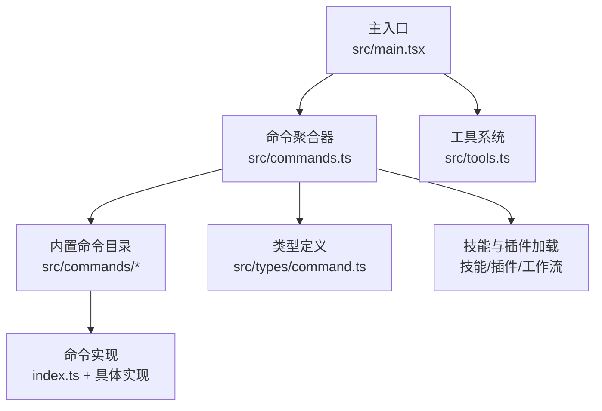
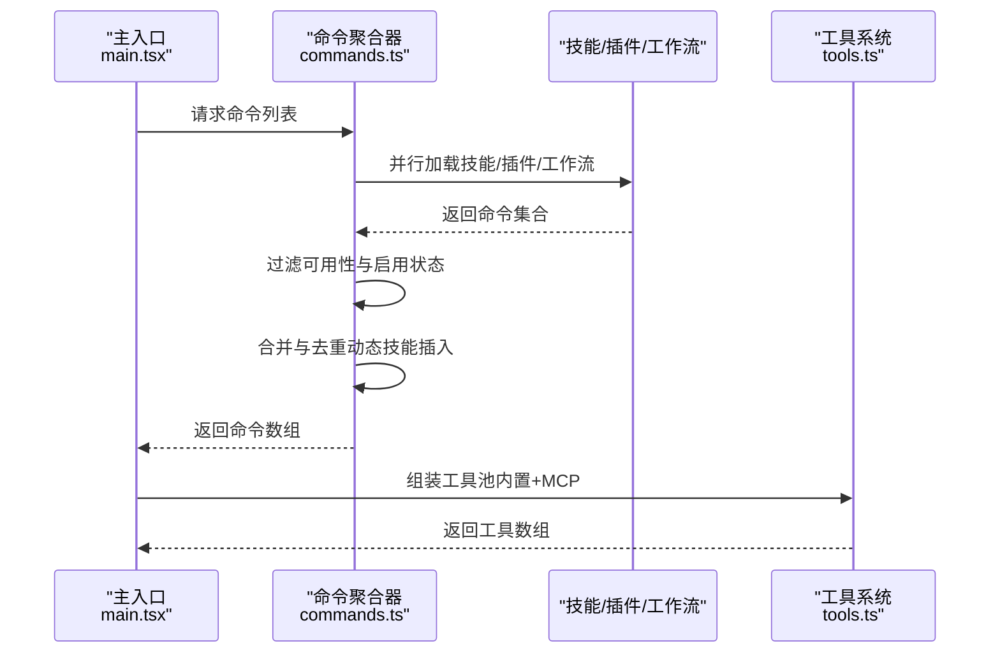
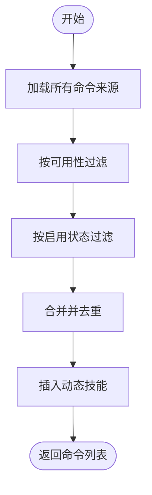
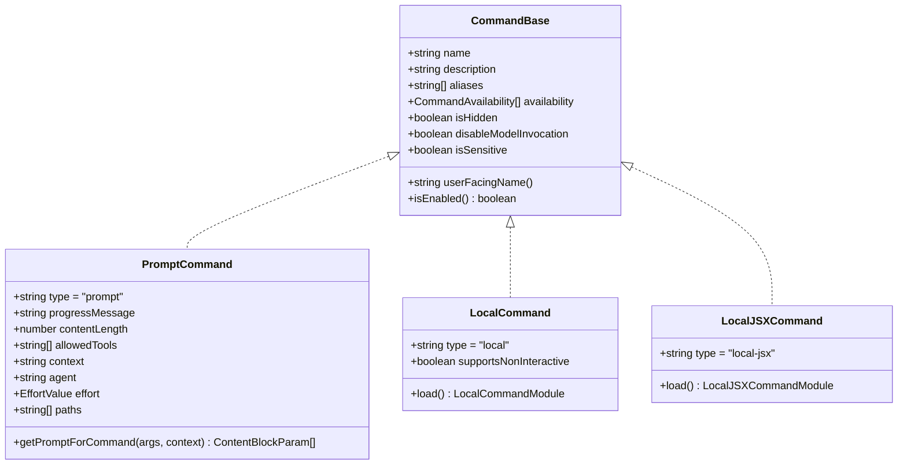
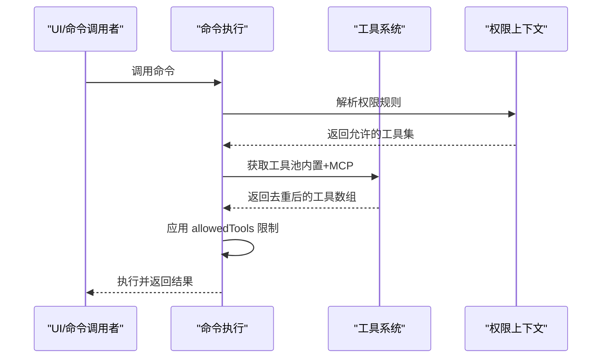
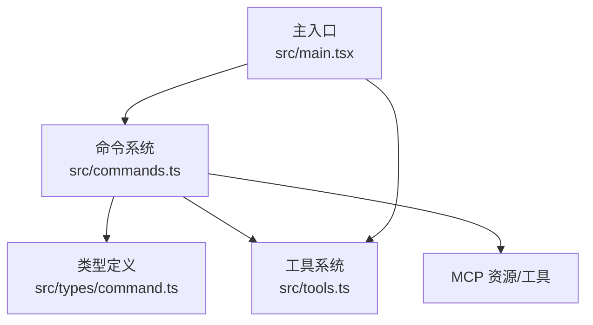

# 命令扩展机制

<cite>
**本文档引用的文件**
- [commands.ts](file://src/commands.ts)
- [main.tsx](file://src/main.tsx)
- [command.ts](file://src/types/command.ts)
- [tools.ts](file://src/tools.ts)
- [init.ts](file://src/commands/init.ts)
- [help/index.ts](file://src/commands/help/index.ts)
- [help.tsx](file://src/commands/help/help.tsx)
- [context/index.ts](file://src/commands/context/index.ts)
- [context.tsx](file://src/commands/context/context.tsx)
- [mcp/index.ts](file://src/commands/mcp/index.ts)
- [mcp.tsx](file://src/commands/mcp/mcp.tsx)
- [init-verifiers.ts](file://src/commands/init-verifiers.ts)
- [hooks/index.ts](file://src/commands/hooks/index.ts)
</cite>

## 目录
1. [简介](#简介)
2. [项目结构](#项目结构)
3. [核心组件](#核心组件)
4. [架构总览](#架构总览)
5. [详细组件分析](#详细组件分析)
6. [依赖关系分析](#依赖关系分析)
7. [性能考虑](#性能考虑)
8. [故障排除指南](#故障排除指南)
9. [结论](#结论)
10. [附录](#附录)

## 简介
本技术文档系统性阐述 Claude Code 的命令扩展机制，覆盖命令的注册、发现与执行流程；命令与工具系统的映射关系；权限验证与上下文处理；命令生命周期管理（创建、激活、销毁）；命令开发指南（接口定义、参数解析、执行逻辑）；钩子系统与事件处理机制；调试、测试与性能优化方法；以及如何将现有工具迁移至命令系统。

## 项目结构
命令系统位于 src/commands 目录下，采用“按功能分组”的模块化组织方式。每个命令以独立目录存在，包含入口 index.ts 和具体实现（如 .tsx 或 .js）。命令清单由 src/commands.ts 统一聚合，并通过类型定义 src/types/command.ts 规范命令接口。

图表来源
- [commands.ts:258-346](file://src/commands.ts#L258-L346)
- [main.tsx:88](file://src/main.tsx#L88)
- [tools.ts:193-390](file://src/tools.ts#L193-L390)

章节来源
- [commands.ts:1-755](file://src/commands.ts#L1-L755)
- [main.tsx:1-800](file://src/main.tsx#L1-L800)
- [command.ts:1-217](file://src/types/command.ts#L1-L217)
- [tools.ts:1-390](file://src/tools.ts#L1-L390)

## 核心组件
- 命令聚合器：负责统一注册、过滤、去重与动态加载命令，支持技能、插件、工作流等来源。
- 命令类型系统：定义命令基类、提示型命令、本地命令与本地 JSX 命令三类，涵盖权限、可用性、描述、别名、来源等元信息。
- 工具系统：与命令紧密协作，提供 Bash、文件读写、网络访问、MCP 资源等能力，支持权限过滤与去重。
- 主入口：在启动阶段加载命令列表并将其注入 REPL/交互环境，同时处理远程模式安全策略。

章节来源
- [commands.ts:258-517](file://src/commands.ts#L258-L517)
- [command.ts:205-217](file://src/types/command.ts#L205-L217)
- [tools.ts:193-390](file://src/tools.ts#L193-L390)
- [main.tsx:88](file://src/main.tsx#L88)

## 架构总览
命令系统采用“集中式聚合 + 多源输入 + 条件加载”的架构。命令来源包括内置命令、技能目录、插件技能、内置插件技能、工作流脚本等。系统在运行时根据可用性（认证/提供商要求）、启用状态（特性标志/环境变量）、动态技能等进行筛选与合并，并对结果进行去重与排序，最终输出给 UI 与模型使用。

图表来源
- [commands.ts:449-517](file://src/commands.ts#L449-L517)
- [main.tsx:88](file://src/main.tsx#L88)
- [tools.ts:345-390](file://src/tools.ts#L345-L390)

## 详细组件分析

### 命令注册与发现机制
- 注册：命令通过 src/commands.ts 的 COMMANDS 数组集中注册，同时支持条件导入（特性标志）与延迟加载（懒加载）。
- 发现：getCommands(cwd) 汇聚所有来源，按可用性与启用状态过滤，动态技能去重后插入到合适位置。
- 可用性：meetsAvailabilityRequirement(cmd) 根据认证/提供商要求（如 claude-ai、console）决定是否显示。
- 启用状态：isCommandEnabled(cmd) 支持基于特性标志或环境变量的动态启用/禁用。

图表来源
- [commands.ts:449-517](file://src/commands.ts#L449-L517)
- [commands.ts:417-443](file://src/commands.ts#L417-L443)
- [commands.ts:214-217](file://src/commands.ts#L214-L217)

章节来源
- [commands.ts:258-346](file://src/commands.ts#L258-L346)
- [commands.ts:417-443](file://src/commands.ts#L417-L443)
- [commands.ts:476-517](file://src/commands.ts#L476-L517)

### 命令类型与接口定义
命令类型分为三类：
- 提示型命令（PromptCommand）：内容展开为模型输入，支持进度消息、内容长度、工具白名单、上下文策略（内联/分叉）、努力值、路径匹配等。
- 本地命令（LocalCommand）：支持非交互执行，通过 load() 懒加载实现。
- 本地 JSX 命令（LocalJSXCommand）：渲染 React 组件，适合复杂 UI 交互。

关键字段与行为：
- CommandBase：名称、描述、别名、可用性、启用状态、来源、是否对模型可调用、敏感参数等。
- 上下文：LocalJSXCommandContext 扩展 ToolUseContext，提供消息更新、主题、IDE 安装状态、动态 MCP 配置回调等。
- 结果显示：LocalCommandResult 支持文本、紧凑显示、跳过等。

图表来源
- [command.ts:25-203](file://src/types/command.ts#L25-L203)

章节来源
- [command.ts:16-217](file://src/types/command.ts#L16-L217)

### 命令与工具系统的映射关系
- 工具池组装：assembleToolPool(permissionContext, mcpTools) 将内置工具与 MCP 工具合并，内置优先，避免重复。
- 权限过滤：filterToolsByDenyRules 根据权限上下文屏蔽工具。
- REPL 模式：当启用 REPL 时，隐藏原始工具，仅允许通过 VM 访问。
- 与命令的协作：提示型命令的 allowedTools 字段可限制其可使用的工具集合；本地命令通过上下文访问工具。

图表来源
- [tools.ts:345-390](file://src/tools.ts#L345-L390)
- [tools.ts:262-269](file://src/tools.ts#L262-L269)
- [tools.ts:271-327](file://src/tools.ts#L271-L327)

章节来源
- [tools.ts:193-390](file://src/tools.ts#L193-L390)

### 权限验证与上下文处理
- 可用性检查：meetsAvailabilityRequirement(cmd) 基于订阅类型与 API 基址判断命令可见性。
- 启用状态：isCommandEnabled(cmd) 支持特性标志与环境变量动态控制。
- 远程模式安全：REMOTE_SAFE_COMMANDS 与 BRIDGE_SAFE_COMMANDS 明确远程/桥接场景下可执行的命令范围。
- 上下文：LocalJSXCommandContext 提供消息更新、主题切换、IDE 安装状态、动态 MCP 配置回调等。

章节来源
- [commands.ts:417-443](file://src/commands.ts#L417-L443)
- [commands.ts:214-217](file://src/commands.ts#L214-L217)
- [commands.ts:619-676](file://src/commands.ts#L619-L676)
- [command.ts:80-98](file://src/types/command.ts#L80-L98)

### 命令生命周期管理
- 创建：命令在 src/commands.ts 中注册，或通过技能/插件/工作流动态加载。
- 激活：getCommands() 在每次调用时重新评估可用性与启用状态，确保登录态变化等场景生效。
- 销毁：命令本身无显式销毁钩子；缓存通过 clearCommandMemoizationCaches()/clearCommandsCache() 清理，以便在动态技能变更后重建命令列表。

章节来源
- [commands.ts:476-517](file://src/commands.ts#L476-L517)
- [commands.ts:523-539](file://src/commands.ts#L523-L539)

### 命令开发指南
- 接口定义：参考 CommandBase/PromptCommand/LocalCommand/LocalJSXCommand 的字段与行为。
- 参数解析：命令实现中解析 args 字符串；对于复杂参数建议使用分隔符或键值对格式。
- 执行逻辑：
  - 提示型命令：实现 getPromptForCommand(args, context)，返回 ContentBlockParam[]。
  - 本地命令：实现 load() 返回包含 call(args, context) 的模块。
  - 本地 JSX 命令：实现 load() 返回包含 call(onDone, context, args) 的模块，onDone 支持显示策略与后续输入。
- 上下文与工具：通过 LocalJSXCommandContext 访问消息、主题、IDE 状态、动态 MCP 配置；通过工具系统获取 Bash、文件、网络等能力。
- 权限与可用性：设置 availability/isEnabled/disableModelInvocation/isSensitive 等元数据。

章节来源
- [command.ts:25-203](file://src/types/command.ts#L25-L203)
- [help.tsx:4-10](file://src/commands/help/help.tsx#L4-L10)
- [context.tsx:30-63](file://src/commands/context/context.tsx#L30-L63)

### 钩子系统与事件处理机制
- 钩子命令：/hooks 命令用于查看工具事件的钩子配置。
- 钩子与命令的关系：钩子通常作为工具事件的自动化动作，命令可触发工具执行，从而间接影响钩子的触发时机。

章节来源
- [hooks/index.ts:1-12](file://src/commands/hooks/index.ts#L1-L12)

### 调试、测试与性能优化
- 调试：
  - 使用 formatDescriptionWithSource(cmd) 在 UI 中显示命令来源与类型标注。
  - 使用 getCommand(commandName, commands) 获取命令对象，便于定位问题。
  - 对于本地 JSX 命令，onDone 支持直接输出 ANSI 文本，便于快速验证。
- 测试：
  - 建议为命令实现提供单元测试，重点覆盖参数解析、上下文访问、工具调用与错误分支。
  - 对于提示型命令，可测试 getPromptForCommand 的输出结构与内容长度估算。
- 性能优化：
  - 利用 memoize 缓存命令列表与技能索引，避免重复磁盘 I/O 与动态导入。
  - 动态技能去重与插入策略减少冗余命令数量。
  - 远程模式预过滤 REMOTE_SAFE_COMMANDS，降低 UI 渲染与交互开销。

章节来源
- [commands.ts:728-754](file://src/commands.ts#L728-L754)
- [commands.ts:688-719](file://src/commands.ts#L688-L719)
- [commands.ts:619-676](file://src/commands.ts#L619-L676)

### 命令迁移指南：从工具到命令
- 识别目标：将常用工具封装为命令，使其具备名称、描述、可用性、启用状态等元信息。
- 设计命令形态：
  - 若需与模型交互：设计为提示型命令，实现 getPromptForCommand 并声明 allowedTools。
  - 若仅本地交互：设计为本地 JSX 命令，通过 React 组件提供 UI。
  - 若可在非交互场景执行：设计为本地命令，实现 load() 与 call()。
- 权限与安全：设置 availability/isEnabled/disableModelInvocation/isSensitive 等字段，确保符合远程/桥接场景的安全策略。
- 集成与测试：将命令注册到 src/commands.ts 的 COMMANDS 数组或动态加载路径，编写测试覆盖关键分支。

章节来源
- [command.ts:25-203](file://src/types/command.ts#L25-L203)
- [tools.ts:193-390](file://src/tools.ts#L193-L390)

## 依赖关系分析
命令系统与工具系统、主入口、MCP 系统存在强耦合关系。命令通过工具系统获得执行能力，主入口在启动阶段加载命令并注入上下文，MCP 提供额外的工具与资源。

图表来源
- [commands.ts:258-346](file://src/commands.ts#L258-L346)
- [main.tsx:88](file://src/main.tsx#L88)
- [tools.ts:345-390](file://src/tools.ts#L345-L390)

章节来源
- [commands.ts:1-755](file://src/commands.ts#L1-L755)
- [main.tsx:1-800](file://src/main.tsx#L1-L800)
- [tools.ts:1-390](file://src/tools.ts#L1-L390)

## 性能考虑
- 懒加载与缓存：命令与技能采用 memoize 缓存，避免重复加载；动态导入仅在首次调用时发生。
- 并行加载：getSkills() 与 getPluginCommands() 并行执行，缩短初始化时间。
- 去重与排序：动态技能插入前进行去重，保持内置命令顺序稳定，提升提示缓存命中率。
- 远程模式优化：REMOTE_SAFE_COMMANDS 与 BRIDGE_SAFE_COMMANDS 预过滤，减少无效命令的 UI 渲染与交互成本。

## 故障排除指南
- 命令未出现：
  - 检查 availability 与 isEnabled 是否满足当前环境。
  - 确认命令未被动态技能去重覆盖。
- 命令不可用：
  - 检查权限上下文与 deny 规则。
  - 确认远程/桥接场景下的安全策略是否允许该命令。
- 执行异常：
  - 对于提示型命令，检查 getPromptForCommand 的输出结构与 allowedTools。
  - 对于本地命令，确认 load() 返回的模块与 call() 签名一致。
  - 使用 formatDescriptionWithSource(cmd) 查看命令来源与类型标注，辅助定位问题。

章节来源
- [commands.ts:417-443](file://src/commands.ts#L417-L443)
- [commands.ts:214-217](file://src/commands.ts#L214-L217)
- [commands.ts:619-676](file://src/commands.ts#L619-L676)
- [commands.ts:728-754](file://src/commands.ts#L728-L754)

## 结论
命令扩展机制通过集中式聚合、多源输入与条件加载，实现了灵活且可扩展的命令体系。配合严格的权限验证、上下文处理与远程安全策略，既保证了安全性，又提供了强大的交互与自动化能力。开发者可通过统一的类型接口与上下文访问工具，快速构建高质量的命令，并平滑迁移现有工具。

## 附录

### 常见命令示例与实现要点
- 初始化命令（/init）：提示型命令，根据特性标志选择新旧引导流程，返回文本内容供模型处理。
- 帮助命令（/help）：本地 JSX 命令，渲染帮助界面并关闭时回调 onDone。
- 上下文可视化（/context）：本地 JSX 命令，对消息进行压缩与分析，渲染 ANSI 输出。
- MCP 管理（/mcp）：本地 JSX 命令，支持启用/禁用服务器、重连与设置页面跳转。
- 验证器初始化（/init-verifiers）：提示型命令，生成不同类型的验证器技能模板。

章节来源
- [init.ts:226-257](file://src/commands/init.ts#L226-L257)
- [help/index.ts:3-10](file://src/commands/help/index.ts#L3-L10)
- [help.tsx:4-10](file://src/commands/help/help.tsx#L4-L10)
- [context/index.ts:4-24](file://src/commands/context/index.ts#L4-L24)
- [context.tsx:30-63](file://src/commands/context/context.tsx#L30-L63)
- [mcp/index.ts:3-12](file://src/commands/mcp/index.ts#L3-L12)
- [mcp.tsx:63-84](file://src/commands/mcp/mcp.tsx#L63-L84)
- [init-verifiers.ts:3-263](file://src/commands/init-verifiers.ts#L3-L263)