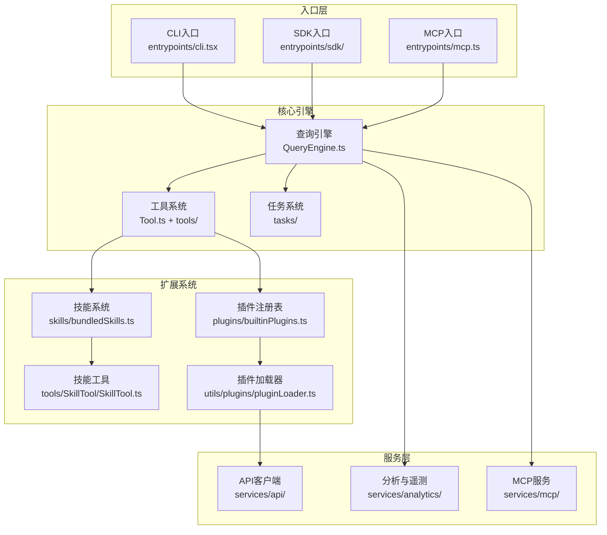
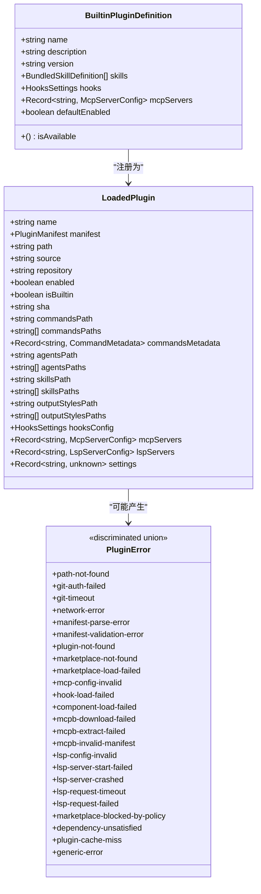
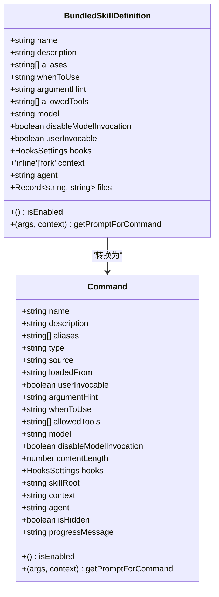
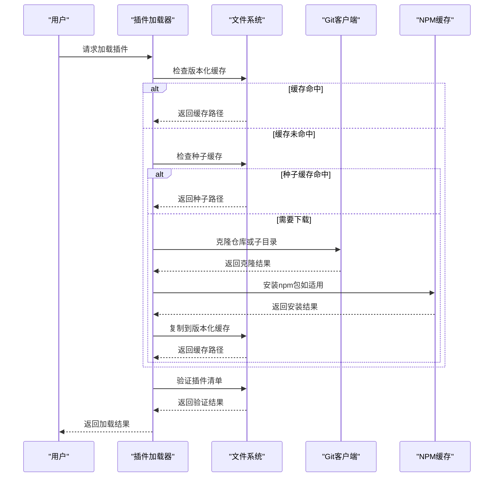
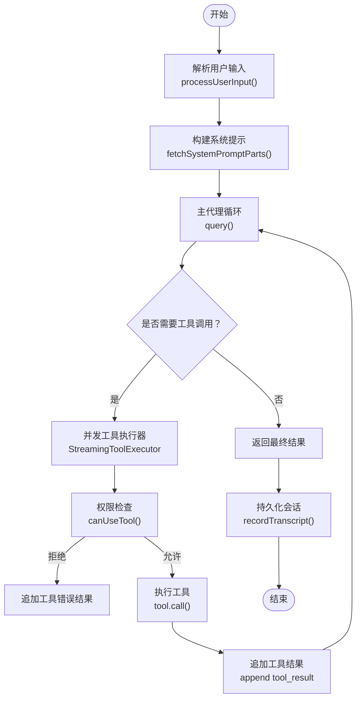
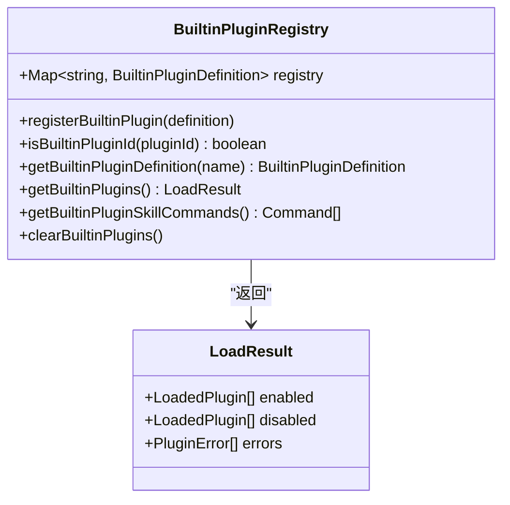
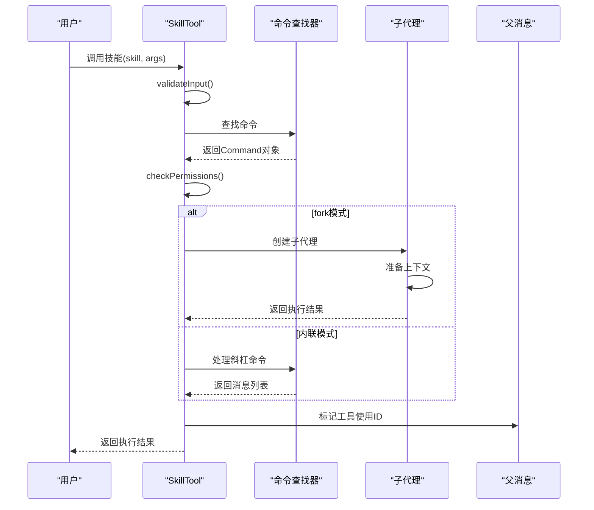
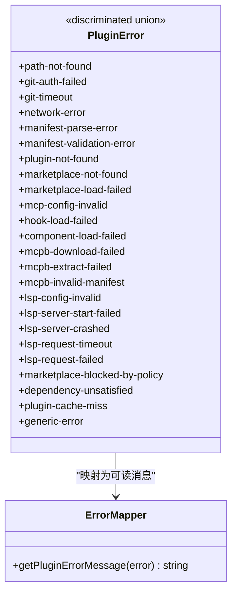
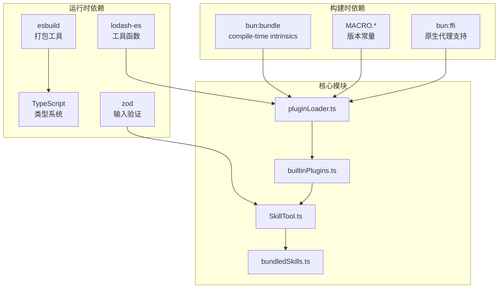

# 扩展开发指南

<cite>
**本文档引用的文件**
- [README.md](file://README.md)
- [package.json](file://package.json)
- [QUICKSTART.md](file://QUICKSTART.md)
- [src/plugins/builtinPlugins.ts](file://src/plugins/builtinPlugins.ts)
- [src/types/plugin.ts](file://src/types/plugin.ts)
- [src/skills/bundledSkills.ts](file://src/skills/bundledSkills.ts)
- [src/utils/plugins/pluginLoader.ts](file://src/utils/plugins/pluginLoader.ts)
- [src/tools/SkillTool/SkillTool.ts](file://src/tools/SkillTool/SkillTool.ts)
</cite>

## 目录
1. [简介](#简介)
2. [项目结构](#项目结构)
3. [核心组件](#核心组件)
4. [架构概览](#架构概览)
5. [详细组件分析](#详细组件分析)
6. [依赖关系分析](#依赖关系分析)
7. [性能考虑](#性能考虑)
8. [故障排除指南](#故障排除指南)
9. [结论](#结论)
10. [附录](#附录)

## 简介

本指南面向Claude Code扩展开发者，提供从环境搭建到发布分发的完整开发流程。Claude Code是一个基于Node.js的智能代码助手，支持插件系统、技能（Skills）扩展、MCP协议集成等高级特性。该文档基于官方源码分析，重点涵盖：

- 开发环境搭建与构建流程
- 插件与技能系统的架构设计
- 接口定义、配置管理与错误处理规范
- 测试策略（单元测试、集成测试、端到端测试）
- 发布分发最佳实践（版本管理、兼容性检查、用户反馈）
- 常见问题与解决方案、性能优化与安全考虑
- 实际开发案例与模板代码路径

## 项目结构

Claude Code采用模块化的目录结构，主要分为以下几类：

- 入口层：CLI入口、REPL交互、SDK入口
- 核心引擎：查询引擎、工具系统、任务系统
- 业务服务层：API客户端、分析与遥测、MCP连接管理
- 状态管理层：应用状态存储、权限状态
- 扩展系统：插件注册与加载、内置技能、技能工具

**图表来源**
- [README.md:250-380](file://README.md#L250-L380)
- [src/plugins/builtinPlugins.ts:1-160](file://src/plugins/builtinPlugins.ts#L1-L160)
- [src/skills/bundledSkills.ts:1-221](file://src/skills/bundledSkills.ts#L1-L221)
- [src/utils/plugins/pluginLoader.ts:1-800](file://src/utils/plugins/pluginLoader.ts#L1-L800)

**章节来源**
- [README.md:250-380](file://README.md#L250-L380)
- [package.json:1-21](file://package.json#L1-L21)

## 核心组件

### 插件系统架构

Claude Code的插件系统由内置插件和市场插件组成，支持动态加载、权限控制和配置管理。

**图表来源**
- [src/types/plugin.ts:18-70](file://src/types/plugin.ts#L18-L70)
- [src/types/plugin.ts:48-70](file://src/types/plugin.ts#L48-L70)
- [src/types/plugin.ts:101-284](file://src/types/plugin.ts#L101-L284)

### 技能系统架构

技能是预定义的提示模板，支持内置技能和磁盘技能两种形式。

**图表来源**
- [src/skills/bundledSkills.ts:15-41](file://src/skills/bundledSkills.ts#L15-L41)
- [src/skills/bundledSkills.ts:75-99](file://src/skills/bundledSkills.ts#L75-L99)

### 插件加载流程

**图表来源**
- [src/utils/plugins/pluginLoader.ts:365-465](file://src/utils/plugins/pluginLoader.ts#L365-L465)
- [src/utils/plugins/pluginLoader.ts:645-678](file://src/utils/plugins/pluginLoader.ts#L645-L678)
- [src/utils/plugins/pluginLoader.ts:492-524](file://src/utils/plugins/pluginLoader.ts#L492-L524)

**章节来源**
- [src/plugins/builtinPlugins.ts:1-160](file://src/plugins/builtinPlugins.ts#L1-L160)
- [src/types/plugin.ts:1-364](file://src/types/plugin.ts#L1-L364)
- [src/skills/bundledSkills.ts:1-221](file://src/skills/bundledSkills.ts#L1-L221)
- [src/utils/plugins/pluginLoader.ts:1-800](file://src/utils/plugins/pluginLoader.ts#L1-L800)

## 架构概览

Claude Code采用"工具驱动的代理循环"架构，核心流程如下：

**图表来源**
- [README.md:449-496](file://README.md#L449-L496)
- [README.md:500-533](file://README.md#L500-L533)

**章节来源**
- [README.md:226-247](file://README.md#L226-L247)
- [README.md:449-496](file://README.md#L449-L496)

## 详细组件分析

### 插件注册与管理

内置插件通过注册表进行统一管理，支持启用/禁用状态持久化。

**图表来源**
- [src/plugins/builtinPlugins.ts:21-102](file://src/plugins/builtinPlugins.ts#L21-L102)
- [src/plugins/builtinPlugins.ts:108-121](file://src/plugins/builtinPlugins.ts#L108-L121)

### 技能工具实现

SkillTool负责执行预定义的技能，支持内联执行和子代理执行两种模式。

**图表来源**
- [src/tools/SkillTool/SkillTool.ts:580-800](file://src/tools/SkillTool/SkillTool.ts#L580-L800)
- [src/tools/SkillTool/SkillTool.ts:118-289](file://src/tools/SkillTool/SkillTool.ts#L118-L289)

**章节来源**
- [src/plugins/builtinPlugins.ts:1-160](file://src/plugins/builtinPlugins.ts#L1-L160)
- [src/tools/SkillTool/SkillTool.ts:1-800](file://src/tools/SkillTool/SkillTool.ts#L1-L800)

### 错误处理与诊断

插件系统提供了丰富的错误类型和错误消息映射机制。

**图表来源**
- [src/types/plugin.ts:101-284](file://src/types/plugin.ts#L101-L284)
- [src/types/plugin.ts:295-363](file://src/types/plugin.ts#L295-L363)

**章节来源**
- [src/types/plugin.ts:101-364](file://src/types/plugin.ts#L101-L364)

## 依赖关系分析

**图表来源**
- [package.json:16-20](file://package.json#L16-L20)
- [QUICKSTART.md:58-104](file://QUICKSTART.md#L58-L104)

**章节来源**
- [package.json:16-20](file://package.json#L16-L20)
- [QUICKSTART.md:58-104](file://QUICKSTART.md#L58-L104)

## 性能考虑

### 并发执行优化

工具系统采用并发执行策略，通过`StreamingToolExecutor`实现并行工具调用：

- **并发安全检测**：通过`isConcurrencySafe()`方法判断工具是否可以并行执行
- **资源隔离**：fork模式下为每个技能创建独立的子代理进程
- **内存管理**：及时释放子代理产生的消息内存，避免内存泄漏

### 缓存策略

插件系统实现了多层次的缓存机制：

- **版本化缓存**：按插件名称、市场、版本组织缓存目录
- **种子缓存**：企业环境中可通过种子目录提供预构建插件
- **ZIP缓存**：支持将插件内容压缩为ZIP格式以节省空间

### 内存安全

内置技能系统采用安全的文件写入策略：

- 使用`O_EXCL`标志确保原子性写入
- 设置严格的文件权限（0o700/0o600）
- 防止符号链接攻击和路径遍历

## 故障排除指南

### 常见构建问题

1. **缺少Bun编译时内建模块**
   - 现象：构建时报错找不到`bun:bundle`或`bun:ffi`
   - 解决：使用提供的stub模块替换，或改用Bun进行完整构建

2. **108个缺失模块**
   - 现象：构建时大量模块无法解析
   - 解决：这些是Anthropic内部模块，在公开版本中被死代码消除

3. **esbuild构建失败**
   - 现象：部分导入语句在esbuild中无法解析
   - 解决：手动创建stub文件或使用Bun进行完整构建

### 插件加载问题

1. **插件缓存失效**
   - 现象：插件更新后仍使用旧版本
   - 解决：清理插件缓存目录或使用`/plugins`命令刷新

2. **Git子目录插件克隆失败**
   - 现象：使用git-subdir源时克隆超时
   - 解决：检查网络连接，确认git版本支持sparse-checkout cone模式

3. **NPM包安装失败**
   - 现象：npm install命令执行失败
   - 解决：检查npm registry配置，确保网络可达

**章节来源**
- [QUICKSTART.md:58-104](file://QUICKSTART.md#L58-L104)
- [src/utils/plugins/pluginLoader.ts:645-678](file://src/utils/plugins/pluginLoader.ts#L645-L678)

## 结论

Claude Code扩展开发提供了完整的插件和技能生态系统。通过理解其架构设计和实现细节，开发者可以：

- 快速搭建开发环境并成功构建项目
- 设计符合规范的插件和技能接口
- 实现健壮的配置管理和错误处理
- 制定有效的测试策略确保质量
- 遵循最佳实践进行发布和分发

建议开发者在开发过程中重点关注：
- 权限系统的正确实现
- 错误处理的完善性
- 性能优化和内存管理
- 兼容性和向后兼容性
- 用户体验和反馈机制

## 附录

### 开发环境搭建步骤

1. **安装Node.js**（版本≥18.0.0）
2. **安装构建依赖**：`npm install --save-dev esbuild`
3. **运行构建脚本**：`node scripts/build.mjs`
4. **启动CLI**：`node dist/cli.js --version`

### 关键开发模板

- 插件定义模板：参考`src/plugins/builtinPlugins.ts`
- 技能定义模板：参考`src/skills/bundledSkills.ts`
- 工具实现模板：参考`src/tools/SkillTool/SkillTool.ts`
- 插件加载模板：参考`src/utils/plugins/pluginLoader.ts`

### 测试建议

1. **单元测试**：针对工具和技能的核心逻辑
2. **集成测试**：测试插件加载和权限系统
3. **端到端测试**：模拟完整的用户交互流程
4. **性能测试**：监控内存使用和执行时间
5. **兼容性测试**：验证不同Node.js版本的兼容性