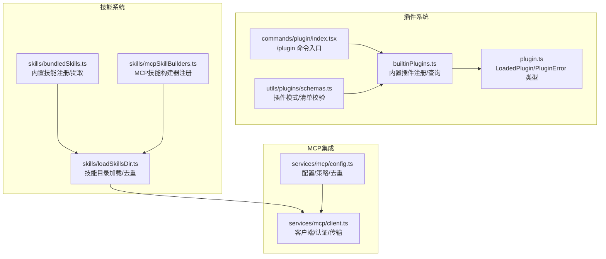
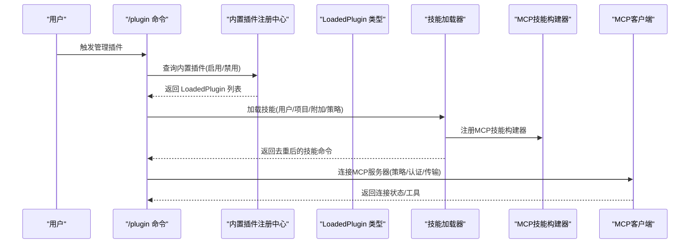
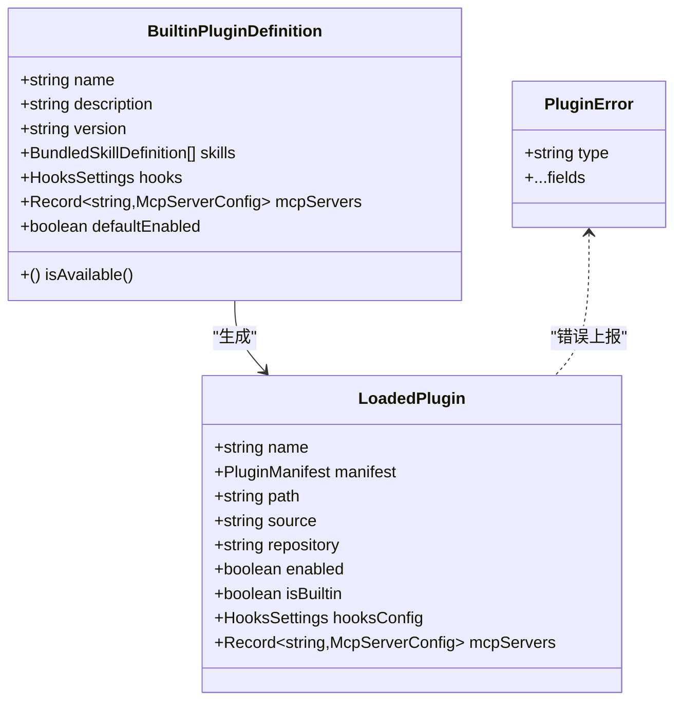
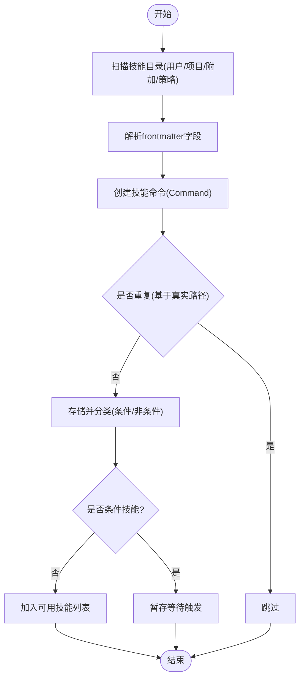
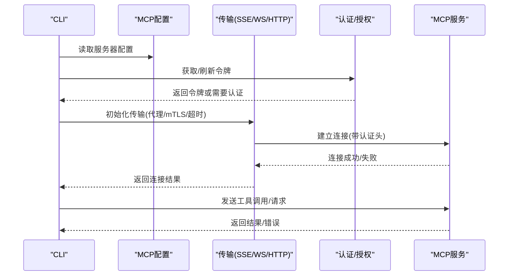
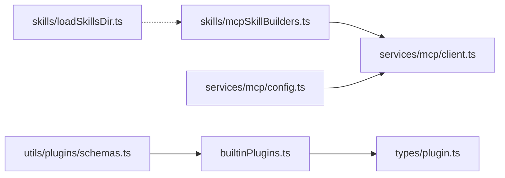

# 扩展性设计

<cite>
**本文引用的文件**
- [builtinPlugins.ts](file://src/plugins/builtinPlugins.ts)
- [bundledSkills.ts](file://src/skills/bundledSkills.ts)
- [loadSkillsDir.ts](file://src/skills/loadSkillsDir.ts)
- [mcpSkillBuilders.ts](file://src/skills/mcpSkillBuilders.ts)
- [plugin.ts](file://src/types/plugin.ts)
- [index.tsx](file://src/commands/plugin/index.tsx)
- [client.ts](file://src/services/mcp/client.ts)
- [config.ts](file://src/services/mcp/config.ts)
- [schemas.ts](file://src/utils/plugins/schemas.ts)
</cite>

## 目录
1. [简介](#简介)
2. [项目结构](#项目结构)
3. [核心组件](#核心组件)
4. [架构总览](#架构总览)
5. [详细组件分析](#详细组件分析)
6. [依赖关系分析](#依赖关系分析)
7. [性能考量](#性能考量)
8. [故障排查指南](#故障排查指南)
9. [结论](#结论)
10. [附录](#附录)

## 简介
本设计文档面向Claude Code的扩展性架构，重点覆盖以下扩展机制：
- 插件系统：内置插件与市场插件的注册、启用/禁用、生命周期与依赖管理
- 技能系统：技能的定义、加载、去重与执行流程
- MCP协议集成：与外部AI服务的连接、认证、传输与工具调用

文档旨在帮助第三方开发者理解并扩展系统功能，提供扩展点识别、最佳实践与API规范。

## 项目结构
围绕扩展性的关键目录与文件：
- 插件系统
  - 内置插件注册与查询：src/plugins/builtinPlugins.ts
  - 插件类型与错误模型：src/types/plugin.ts
  - 插件命令入口：src/commands/plugin/index.tsx
  - 插件模式校验与清单：src/utils/plugins/schemas.ts
- 技能系统
  - 内置技能注册与提取：src/skills/bundledSkills.ts
  - 技能目录加载与去重：src/skills/loadSkillsDir.ts
  - MCP技能构建器注册：src/skills/mcpSkillBuilders.ts
- MCP协议集成
  - 客户端连接与认证：src/services/mcp/client.ts
  - 配置解析与策略：src/services/mcp/config.ts

**图表来源**
- [builtinPlugins.ts:1-160](file://src/plugins/builtinPlugins.ts#L1-L160)
- [plugin.ts:1-364](file://src/types/plugin.ts#L1-L364)
- [index.tsx:1-11](file://src/commands/plugin/index.tsx#L1-L11)
- [bundledSkills.ts:1-221](file://src/skills/bundledSkills.ts#L1-L221)
- [loadSkillsDir.ts:1-800](file://src/skills/loadSkillsDir.ts#L1-L800)
- [mcpSkillBuilders.ts:1-45](file://src/skills/mcpSkillBuilders.ts#L1-L45)
- [client.ts:1-800](file://src/services/mcp/client.ts#L1-L800)
- [config.ts:1-800](file://src/services/mcp/config.ts#L1-L800)
- [schemas.ts:1-800](file://src/utils/plugins/schemas.ts#L1-L800)

**章节来源**
- [builtinPlugins.ts:1-160](file://src/plugins/builtinPlugins.ts#L1-L160)
- [plugin.ts:1-364](file://src/types/plugin.ts#L1-L364)
- [index.tsx:1-11](file://src/commands/plugin/index.tsx#L1-L11)
- [bundledSkills.ts:1-221](file://src/skills/bundledSkills.ts#L1-L221)
- [loadSkillsDir.ts:1-800](file://src/skills/loadSkillsDir.ts#L1-L800)
- [mcpSkillBuilders.ts:1-45](file://src/skills/mcpSkillBuilders.ts#L1-L45)
- [client.ts:1-800](file://src/services/mcp/client.ts#L1-L800)
- [config.ts:1-800](file://src/services/mcp/config.ts#L1-L800)
- [schemas.ts:1-800](file://src/utils/plugins/schemas.ts#L1-L800)

## 核心组件
- 内置插件注册中心
  - 提供注册、可用性检查、按用户设置分组（启用/禁用）、转换为命令对象等能力
  - 支持钩子与MCP服务器声明
- 技能加载器
  - 支持多源目录（用户/项目/附加目录/策略）并行加载，统一去重与条件技能存储
  - 支持内置技能与MCP技能的构建器注册，避免循环依赖
- MCP客户端与配置
  - 统一的连接策略（SSE/HTTP/WebSocket/SDK），认证与超时处理
  - 企业策略（允许/拒绝列表）、签名去重、代理与mTLS支持

**章节来源**
- [builtinPlugins.ts:25-121](file://src/plugins/builtinPlugins.ts#L25-L121)
- [loadSkillsDir.ts:638-800](file://src/skills/loadSkillsDir.ts#L638-L800)
- [mcpSkillBuilders.ts:26-45](file://src/skills/mcpSkillBuilders.ts#L26-L45)
- [client.ts:595-800](file://src/services/mcp/client.ts#L595-L800)
- [config.ts:223-310](file://src/services/mcp/config.ts#L223-L310)

## 架构总览
扩展性由“插件—技能—MCP”三层协同实现：
- 插件层：通过manifest声明技能、钩子、MCP/LSP等组件；内置插件与市场插件共享同一类型模型
- 技能层：从多源目录加载技能，进行去重与条件激活；内置技能与MCP技能通过构建器解耦
- MCP层：统一的客户端与配置策略，支持企业策略、去重与安全传输

**图表来源**
- [index.tsx:1-11](file://src/commands/plugin/index.tsx#L1-L11)
- [builtinPlugins.ts:57-102](file://src/plugins/builtinPlugins.ts#L57-L102)
- [plugin.ts:48-70](file://src/types/plugin.ts#L48-L70)
- [loadSkillsDir.ts:638-770](file://src/skills/loadSkillsDir.ts#L638-L770)
- [mcpSkillBuilders.ts:33-44](file://src/skills/mcpSkillBuilders.ts#L33-L44)
- [client.ts:595-765](file://src/services/mcp/client.ts#L595-L765)

## 详细组件分析

### 插件系统
- 设计要点
  - 内置插件以{name}@builtin标识，与市场插件区分；支持默认启用/可用性回调
  - LoadedPlugin统一承载manifest、路径、来源、组件声明（技能/钩子/MCP/LSP）
  - 插件错误模型类型化，便于UI与日志呈现
- 生命周期与依赖
  - 启动时注册内置插件；根据用户设置决定启用/禁用
  - 依赖解析在安装阶段进行，支持跨市场限制与环依赖检测
- 扩展点
  - 在初始化阶段调用registerBuiltinPlugin注册新内置插件
  - 通过插件manifest声明技能/钩子/MCP/LSP组件

**图表来源**
- [builtinPlugins.ts:18-35](file://src/plugins/builtinPlugins.ts#L18-L35)
- [plugin.ts:48-70](file://src/types/plugin.ts#L48-L70)
- [plugin.ts:101-120](file://src/types/plugin.ts#L101-L120)

**章节来源**
- [builtinPlugins.ts:25-121](file://src/plugins/builtinPlugins.ts#L25-L121)
- [plugin.ts:1-364](file://src/types/plugin.ts#L1-L364)

### 技能系统
- 设计要点
  - 内置技能：编译到CLI，注册后作为命令提供；支持首次调用时抽取参考文件至沙盒目录
  - 技能加载：并行扫描用户/项目/附加/策略目录，统一去重（基于真实路径）
  - 条件技能：记录paths前端配置，仅在匹配文件变更时激活
  - MCP技能：通过构建器注册，避免模块循环依赖
- 执行流程
  - 解析frontmatter字段（描述/工具/上下文/代理/努力度等）
  - 参数替换与环境变量展开
  - 可选的shell命令执行（非MCP技能）
  - 生成内容块用于模型提示

**图表来源**
- [loadSkillsDir.ts:638-770](file://src/skills/loadSkillsDir.ts#L638-L770)
- [loadSkillsDir.ts:185-265](file://src/skills/loadSkillsDir.ts#L185-L265)
- [loadSkillsDir.ts:316-401](file://src/skills/loadSkillsDir.ts#L316-L401)

**章节来源**
- [bundledSkills.ts:53-108](file://src/skills/bundledSkills.ts#L53-L108)
- [bundledSkills.ts:131-145](file://src/skills/bundledSkills.ts#L131-L145)
- [loadSkillsDir.ts:1-800](file://src/skills/loadSkillsDir.ts#L1-L800)
- [mcpSkillBuilders.ts:33-44](file://src/skills/mcpSkillBuilders.ts#L33-L44)

### MCP协议集成
- 设计要点
  - 支持多种传输：SSE、HTTP、WebSocket、SDK、IDE专用传输
  - 认证与授权：OAuth令牌刷新、401重试、需要认证缓存、Claude.ai代理
  - 超时与代理：请求级超时包装、SSE长连接不适用短超时、代理与mTLS
  - 企业策略：允许/拒绝列表、签名去重、保留手动配置优先
- 关键流程
  - 连接建立：根据配置选择传输，注入头与代理，处理认证失败
  - 工具调用：封装结果与元数据，错误归类与重试策略
  - 会话管理：会话过期检测与清理，批量连接与并发控制

**图表来源**
- [client.ts:595-765](file://src/services/mcp/client.ts#L595-L765)
- [client.ts:372-422](file://src/services/mcp/client.ts#L372-L422)
- [config.ts:223-310](file://src/services/mcp/config.ts#L223-L310)

**章节来源**
- [client.ts:1-800](file://src/services/mcp/client.ts#L1-L800)
- [config.ts:1-800](file://src/services/mcp/config.ts#L1-L800)

## 依赖关系分析
- 模块耦合
  - builtinPlugins.ts与types/plugin.ts强耦合，前者输出LoadedPlugin，后者定义其结构
  - loadSkillsDir.ts与mcpSkillBuilders.ts通过类型注册避免循环依赖
  - mcpSkillBuilders.ts被client.ts按需引入，形成单向依赖
- 外部依赖与集成
  - MCP SDK用于传输与类型定义
  - 插件模式校验依赖Zod schema，确保manifest与清单合规
- 潜在风险
  - 循环依赖：通过构建器注册与类型导入规避
  - 企业策略与手动配置冲突：手动优先，策略仅影响未配置项

**图表来源**
- [builtinPlugins.ts:18-35](file://src/plugins/builtinPlugins.ts#L18-L35)
- [plugin.ts:48-70](file://src/types/plugin.ts#L48-L70)
- [loadSkillsDir.ts:65-70](file://src/skills/loadSkillsDir.ts#L65-L70)
- [mcpSkillBuilders.ts:33-44](file://src/skills/mcpSkillBuilders.ts#L33-L44)
- [client.ts:118-121](file://src/services/mcp/client.ts#L118-L121)
- [schemas.ts:274-320](file://src/utils/plugins/schemas.ts#L274-L320)
- [config.ts:223-266](file://src/services/mcp/config.ts#L223-L266)

**章节来源**
- [builtinPlugins.ts:1-160](file://src/plugins/builtinPlugins.ts#L1-L160)
- [plugin.ts:1-364](file://src/types/plugin.ts#L1-L364)
- [loadSkillsDir.ts:1-800](file://src/skills/loadSkillsDir.ts#L1-L800)
- [mcpSkillBuilders.ts:1-45](file://src/skills/mcpSkillBuilders.ts#L1-L45)
- [client.ts:1-800](file://src/services/mcp/client.ts#L1-L800)
- [config.ts:1-800](file://src/services/mcp/config.ts#L1-L800)
- [schemas.ts:1-800](file://src/utils/plugins/schemas.ts#L1-L800)

## 性能考量
- 并行加载
  - 技能加载对不同目录采用并行策略，显著降低启动时间
- 缓存与去重
  - 使用realpath去重，避免符号链接与重复目录带来的重复加载
  - MCP认证失败缓存，减少重复认证开销
- 传输优化
  - 请求级超时避免信号复用导致的“过期超时”问题
  - SSE长连接不应用短超时，HTTP请求强制Accept头以满足流式HTTP规范

[本节为通用指导，无需特定文件引用]

## 故障排查指南
- 插件相关
  - 错误类型化：通过PluginError统一呈现，便于定位与提示
  - 依赖未满足：检查依赖是否启用/存在，跨市场安装限制
- 技能相关
  - 重复技能：确认是否为同一文件的不同路径（符号链接/父目录重叠）
  - 条件技能未激活：确认匹配的文件路径是否已变更
- MCP相关
  - 认证失败：检查OAuth令牌有效性与刷新逻辑；查看needs-auth缓存
  - 会话过期：捕获“Session not found”错误并重建客户端
  - 企业策略阻断：核对允许/拒绝列表与签名去重规则

**章节来源**
- [plugin.ts:101-284](file://src/types/plugin.ts#L101-L284)
- [loadSkillsDir.ts:742-796](file://src/skills/loadSkillsDir.ts#L742-L796)
- [client.ts:193-206](file://src/services/mcp/client.ts#L193-L206)
- [client.ts:340-361](file://src/services/mcp/client.ts#L340-L361)
- [config.ts:417-508](file://src/services/mcp/config.ts#L417-L508)

## 结论
Claude Code的扩展性设计通过“插件—技能—MCP”三层架构实现高内聚、低耦合的扩展能力：
- 插件系统以类型化模型与错误体系保障可靠性
- 技能系统以多源并行加载与严格去重提升可用性
- MCP集成以统一客户端与企业策略确保安全性与可运维性

该设计为第三方开发者提供了清晰的扩展点与最佳实践，便于快速构建与集成新的插件、技能与外部AI服务。

[本节为总结，无需特定文件引用]

## 附录

### 扩展开发最佳实践
- 插件开发
  - 使用插件manifest声明组件（技能/钩子/MCP/LSP），遵循schema约束
  - 内置插件以{name}@builtin命名，避免与市场插件冲突
  - 依赖解析与跨市场限制需在安装阶段明确处理
- 技能开发
  - 使用frontmatter标准化描述、工具、上下文与代理
  - 对于需要文件访问的技能，利用内置技能的抽取机制
  - 条件技能通过paths前端配置精确控制激活范围
- MCP集成
  - 明确传输类型与认证方式，合理设置超时与代理
  - 企业策略下优先考虑手动配置，避免被策略覆盖
  - 使用构建器注册MCP技能，避免模块循环依赖

**章节来源**
- [schemas.ts:274-320](file://src/utils/plugins/schemas.ts#L274-L320)
- [builtinPlugins.ts:37-39](file://src/plugins/builtinPlugins.ts#L37-L39)
- [loadSkillsDir.ts:185-265](file://src/skills/loadSkillsDir.ts#L185-L265)
- [mcpSkillBuilders.ts:33-44](file://src/skills/mcpSkillBuilders.ts#L33-L44)
- [client.ts:492-550](file://src/services/mcp/client.ts#L492-L550)
- [config.ts:417-508](file://src/services/mcp/config.ts#L417-L508)