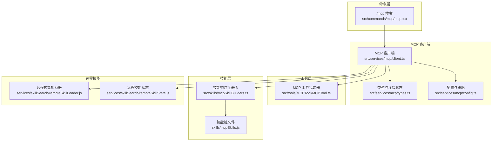
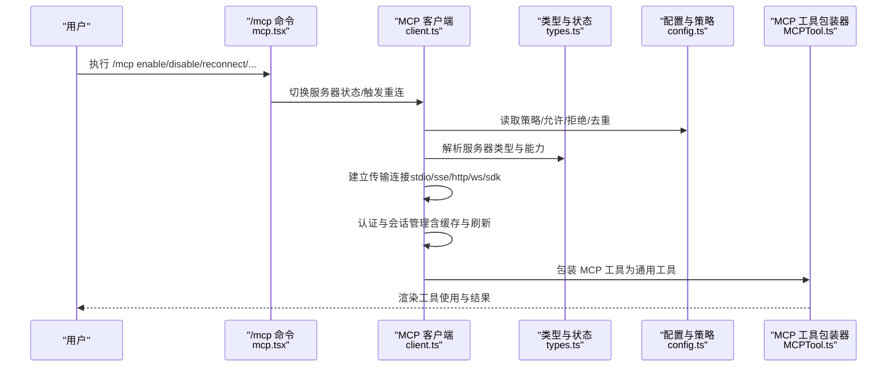
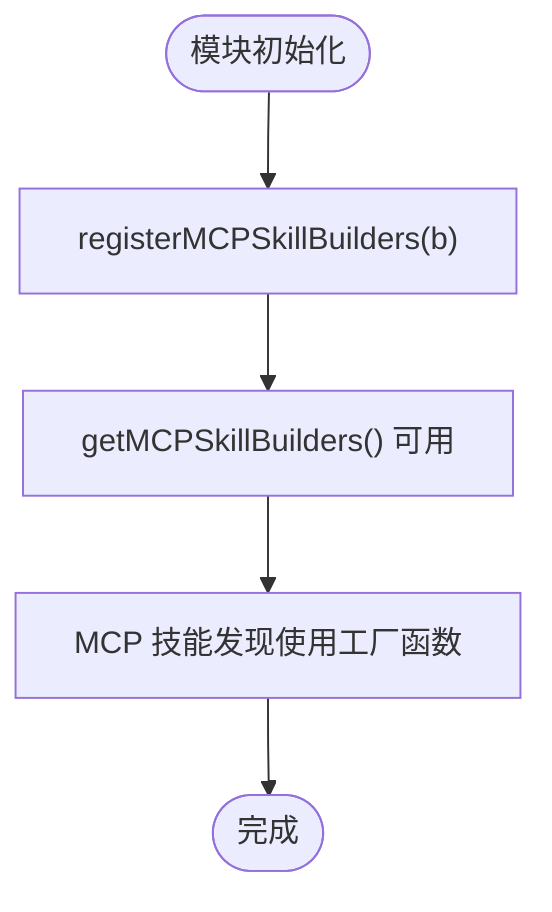
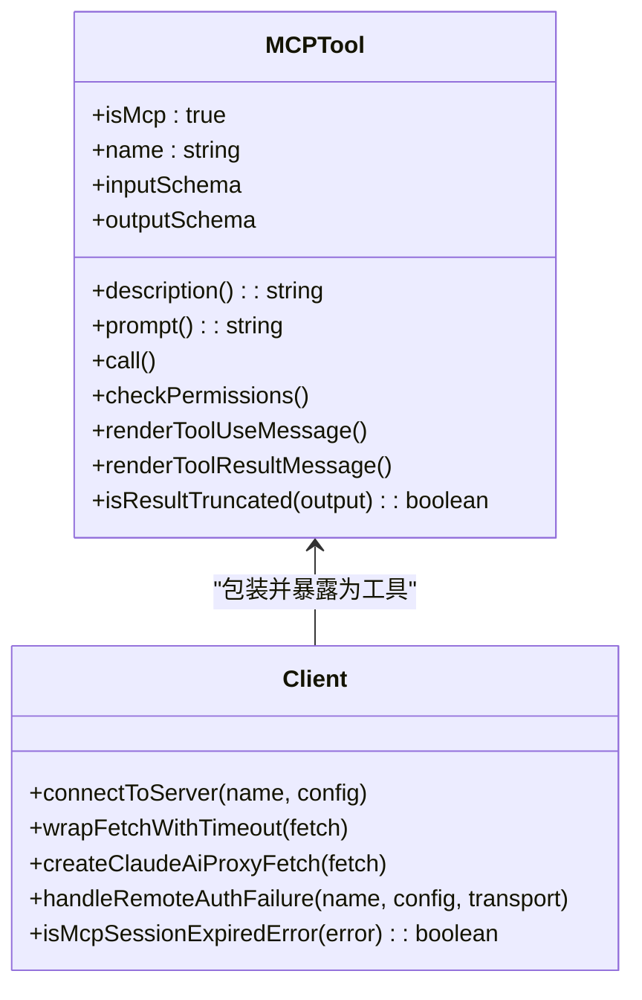
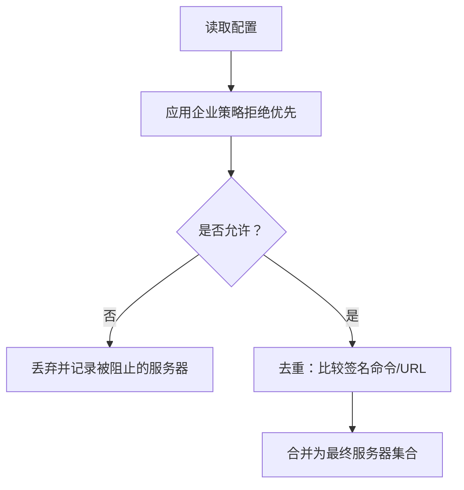
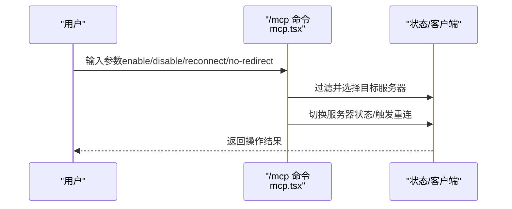
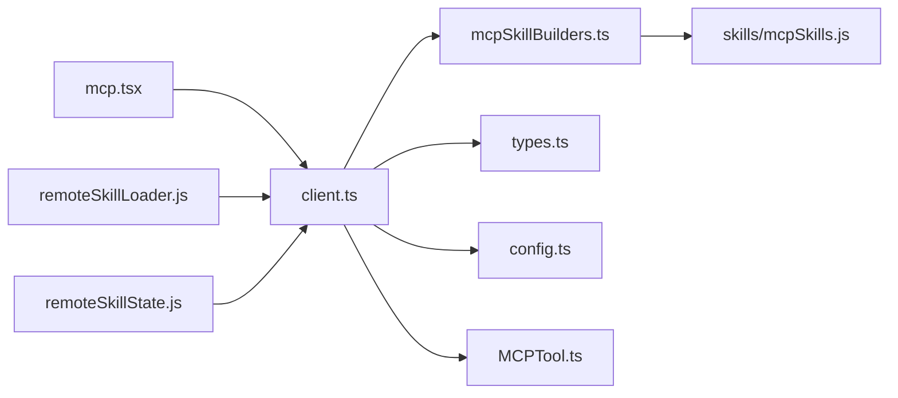

# MCP技能集成

<cite>
**本文引用的文件**
- [mcpSkillBuilders.ts](file://src/skills/mcpSkillBuilders.ts)
- [mcpSkills.js](file://skills/mcpSkills.js)
- [client.ts](file://src/services/mcp/client.ts)
- [MCPTool.ts](file://src/tools/MCPTool/MCPTool.ts)
- [types.ts](file://src/services/mcp/types.ts)
- [config.ts](file://src/services/mcp/config.ts)
- [mcp.tsx](file://src/commands/mcp/mcp.tsx)
- [remoteSkillLoader.js](file://services/skillSearch/remoteSkillLoader.js)
- [remoteSkillState.js](file://services/skillSearch/remoteSkillState.js)
</cite>

## 目录
1. [引言](#引言)
2. [项目结构](#项目结构)
3. [核心组件](#核心组件)
4. [架构总览](#架构总览)
5. [详细组件分析](#详细组件分析)
6. [依赖关系分析](#依赖关系分析)
7. [性能考量](#性能考量)
8. [故障排查指南](#故障排查指南)
9. [结论](#结论)
10. [附录](#附录)

## 引言
本文件系统性阐述 Claude Code 中 MCP（Model Context Protocol）技能集成的设计与实现，覆盖以下主题：
- MCP 技能的定义与构建流程，以及 mcpSkillBuilders 的注册机制与技能适配器职责
- MCP 协议与技能系统的集成方式：技能发现、能力声明、工具包装
- MCP 技能的动态加载与生命周期管理
- MCP 技能与本地技能的差异与优势
- 配置与调试方法、性能优化与错误处理策略
- 分布式环境下的使用场景与最佳实践

## 项目结构
围绕 MCP 技能的关键模块分布如下：
- 技能构建与注册：src/skills/mcpSkillBuilders.ts 提供注册表，skills/mcpSkills.js 作为占位桩文件
- MCP 客户端与工具：src/services/mcp/client.ts 负责连接、认证、请求封装；src/tools/MCPTool/MCPTool.ts 将 MCP 工具包装为通用工具
- 类型与配置：src/services/mcp/types.ts 定义服务器类型与连接状态；src/services/mcp/config.ts 管理策略、去重与允许/拒绝列表
- 命令入口：src/commands/mcp/mcp.tsx 提供 /mcp 命令交互与开关控制
- 远程技能搜索：services/skillSearch/remoteSkillLoader.js、services/skillSearch/remoteSkillState.js 提供远程技能加载与状态

**图表来源**
- [mcp.tsx:63-84](file://src/commands/mcp/mcp.tsx#L63-L84)
- [client.ts:117-121](file://src/services/mcp/client.ts#L117-L121)
- [types.ts:163-226](file://src/services/mcp/types.ts#L163-L226)
- [config.ts:536-551](file://src/services/mcp/config.ts#L536-L551)
- [MCPTool.ts:27-77](file://src/tools/MCPTool/MCPTool.ts#L27-L77)
- [mcpSkillBuilders.ts:31-44](file://src/skills/mcpSkillBuilders.ts#L31-L44)
- [mcpSkills.js:1-4](file://skills/mcpSkills.js#L1-L4)
- [remoteSkillLoader.js:1-4](file://services/skillSearch/remoteSkillLoader.js#L1-L4)
- [remoteSkillState.js:1-4](file://services/skillSearch/remoteSkillState.js#L1-L4)

**章节来源**
- [mcp.tsx:63-84](file://src/commands/mcp/mcp.tsx#L63-L84)
- [client.ts:117-121](file://src/services/mcp/client.ts#L117-L121)
- [types.ts:163-226](file://src/services/mcp/types.ts#L163-L226)
- [config.ts:536-551](file://src/services/mcp/config.ts#L536-L551)
- [MCPTool.ts:27-77](file://src/tools/MCPTool/MCPTool.ts#L27-L77)
- [mcpSkillBuilders.ts:31-44](file://src/skills/mcpSkillBuilders.ts#L31-L44)
- [mcpSkills.js:1-4](file://skills/mcpSkills.js#L1-L4)
- [remoteSkillLoader.js:1-4](file://services/skillSearch/remoteSkillLoader.js#L1-L4)
- [remoteSkillState.js:1-4](file://services/skillSearch/remoteSkillState.js#L1-L4)

## 核心组件
- mcpSkillBuilders 注册表：以只导入类型的方式避免循环依赖，提供 createSkillCommand 与 parseSkillFrontmatterFields 两个函数的注册与获取，供 MCP 技能发现使用
- MCP 客户端：负责连接不同传输类型的 MCP 服务器（stdio、sse、http、ws、sdk），封装认证、超时、代理、日志与错误分类，并将 MCP 工具暴露为统一工具接口
- MCP 工具包装器：将 MCP 工具调用映射到通用工具框架，支持权限检查、渲染消息、结果截断等
- 类型与配置：定义服务器配置类型、连接状态枚举、策略过滤（允许/拒绝）、去重逻辑与签名计算
- 命令入口：/mcp 命令提供启用/禁用、重连、设置界面跳转等交互
- 远程技能：提供远程技能加载与状态管理的占位实现

**章节来源**
- [mcpSkillBuilders.ts:31-44](file://src/skills/mcpSkillBuilders.ts#L31-L44)
- [client.ts:117-121](file://src/services/mcp/client.ts#L117-L121)
- [MCPTool.ts:27-77](file://src/tools/MCPTool/MCPTool.ts#L27-L77)
- [types.ts:163-226](file://src/services/mcp/types.ts#L163-L226)
- [config.ts:536-551](file://src/services/mcp/config.ts#L536-L551)
- [mcp.tsx:63-84](file://src/commands/mcp/mcp.tsx#L63-L84)
- [remoteSkillLoader.js:1-4](file://services/skillSearch/remoteSkillLoader.js#L1-L4)
- [remoteSkillState.js:1-4](file://services/skillSearch/remoteSkillState.js#L1-L4)

## 架构总览
下图展示 MCP 技能从“发现—连接—工具包装—调用”的整体流程。

**图表来源**
- [mcp.tsx:63-84](file://src/commands/mcp/mcp.tsx#L63-L84)
- [client.ts:595-800](file://src/services/mcp/client.ts#L595-L800)
- [types.ts:163-226](file://src/services/mcp/types.ts#L163-L226)
- [config.ts:536-551](file://src/services/mcp/config.ts#L536-L551)
- [MCPTool.ts:27-77](file://src/tools/MCPTool/MCPTool.ts#L27-L77)

## 详细组件分析

### mcpSkillBuilders 注册表与技能适配器
- 设计目标：在不形成循环依赖的前提下，向 MCP 技能发现提供 createSkillCommand 与 parseSkillFrontmatterFields 两个工厂函数
- 注册时机：在模块初始化时由 loadSkillsDir.ts 注册，确保在任何 MCP 服务器连接前完成
- 使用方式：通过 getMCPSkillBuilders 获取，若未注册则抛出明确错误，提示尚未评估 loadSkillsDir.ts

**图表来源**
- [mcpSkillBuilders.ts:31-44](file://src/skills/mcpSkillBuilders.ts#L31-L44)

**章节来源**
- [mcpSkillBuilders.ts:31-44](file://src/skills/mcpSkillBuilders.ts#L31-L44)

### MCP 客户端与工具包装
- 连接与传输：支持 SSE、HTTP、WebSocket、标准输入输出、SDK 内部传输；对 IDE 专用传输（sse-ide、ws-ide）有特殊处理
- 认证与会话：内置 OAuth 令牌刷新、401 处理、会话过期检测、认证缓存与清理
- 请求封装：统一超时策略、Accept 头规范化、代理与 TLS 支持
- 工具包装：将 MCP 工具转换为通用工具，提供描述、提示、输入/输出模式、权限检查、渲染与截断处理

**图表来源**
- [MCPTool.ts:27-77](file://src/tools/MCPTool/MCPTool.ts#L27-L77)
- [client.ts:595-800](file://src/services/mcp/client.ts#L595-L800)

**章节来源**
- [MCPTool.ts:27-77](file://src/tools/MCPTool/MCPTool.ts#L27-L77)
- [client.ts:595-800](file://src/services/mcp/client.ts#L595-L800)

### 类型与配置：能力声明与策略过滤
- 服务器类型：stdio、sse、sse-ide、ws-ide、http、ws、sdk、claudeai-proxy
- 连接状态：connected、failed、needs-auth、pending、disabled
- 策略过滤：允许/拒绝列表、名称/命令/URL 模式匹配、企业策略优先级、插件与手动配置去重
- 去重签名：基于命令数组或 URL（含 CCR 代理 URL 解包）进行内容去重

**图表来源**
- [config.ts:536-551](file://src/services/mcp/config.ts#L536-L551)
- [config.ts:223-266](file://src/services/mcp/config.ts#L223-L266)
- [config.ts:202-212](file://src/services/mcp/config.ts#L202-L212)

**章节来源**
- [types.ts:163-226](file://src/services/mcp/types.ts#L163-L226)
- [config.ts:536-551](file://src/services/mcp/config.ts#L536-L551)
- [config.ts:223-266](file://src/services/mcp/config.ts#L223-L266)
- [config.ts:202-212](file://src/services/mcp/config.ts#L202-L212)

### 命令入口：/mcp 交互与生命周期控制
- 功能：启用/禁用指定或全部服务器、重连、跳转设置界面
- 实现：解析参数，筛选客户端，调用 useMcpToggleEnabled 控制状态，完成后回调

**图表来源**
- [mcp.tsx:63-84](file://src/commands/mcp/mcp.tsx#L63-L84)

**章节来源**
- [mcp.tsx:63-84](file://src/commands/mcp/mcp.tsx#L63-L84)

### 远程技能：加载与状态
- 当前实现：提供占位导出，用于后续扩展远程技能发现与加载
- 作用域：与本地技能互补，支持跨环境、跨项目的技能分发与缓存

**章节来源**
- [remoteSkillLoader.js:1-4](file://services/skillSearch/remoteSkillLoader.js#L1-L4)
- [remoteSkillState.js:1-4](file://services/skillSearch/remoteSkillState.js#L1-L4)

## 依赖关系分析
- mcpSkillBuilders.ts 仅导入类型，避免与 loadSkillsDir.ts 形成循环依赖
- client.ts 条件引入 skills/mcpSkills.js 的 fetchMcpSkillsForClient，受特性开关控制
- MCP 工具包装器依赖工具框架与渲染模块，解耦于具体 MCP 服务器实现
- 配置模块集中处理策略、去重与签名，降低上层耦合

**图表来源**
- [mcpSkillBuilders.ts:31-44](file://src/skills/mcpSkillBuilders.ts#L31-L44)
- [client.ts:117-121](file://src/services/mcp/client.ts#L117-L121)
- [types.ts:163-226](file://src/services/mcp/types.ts#L163-L226)
- [config.ts:536-551](file://src/services/mcp/config.ts#L536-L551)
- [MCPTool.ts:27-77](file://src/tools/MCPTool/MCPTool.ts#L27-L77)
- [mcp.tsx:63-84](file://src/commands/mcp/mcp.tsx#L63-L84)
- [remoteSkillLoader.js:1-4](file://services/skillSearch/remoteSkillLoader.js#L1-L4)
- [remoteSkillState.js:1-4](file://services/skillSearch/remoteSkillState.js#L1-L4)

**章节来源**
- [mcpSkillBuilders.ts:31-44](file://src/skills/mcpSkillBuilders.ts#L31-L44)
- [client.ts:117-121](file://src/services/mcp/client.ts#L117-L121)
- [types.ts:163-226](file://src/services/mcp/types.ts#L163-L226)
- [config.ts:536-551](file://src/services/mcp/config.ts#L536-L551)
- [MCPTool.ts:27-77](file://src/tools/MCPTool/MCPTool.ts#L27-L77)
- [mcp.tsx:63-84](file://src/commands/mcp/mcp.tsx#L63-L84)
- [remoteSkillLoader.js:1-4](file://services/skillSearch/remoteSkillLoader.js#L1-L4)
- [remoteSkillState.js:1-4](file://services/skillSearch/remoteSkillState.js#L1-L4)

## 性能考量
- 连接批大小：支持通过环境变量调整本地与远程服务器的并发连接数，平衡吞吐与资源占用
- 请求超时：针对非 GET 请求设置独立超时，避免单次信号超时导致的长期失败
- 缓存与去重：认证缓存（15 分钟 TTL）、连接记忆化、内容去重签名，减少重复开销
- 代理与 TLS：统一代理与 TLS 配置，降低网络往返与握手成本
- 输出截断：对大输出进行估算与截断，避免模型上下文溢出

**章节来源**
- [client.ts:552-561](file://src/services/mcp/client.ts#L552-L561)
- [client.ts:492-550](file://src/services/mcp/client.ts#L492-L550)
- [client.ts:257-316](file://src/services/mcp/client.ts#L257-L316)
- [client.ts:202-206](file://src/services/mcp/client.ts#L202-L206)

## 故障排查指南
- 认证失败：当远端服务器返回需要认证时，记录事件并写入“需要认证”缓存，返回 needs-auth 状态
- 会话过期：识别 MCP 规范中的“会话未找到”错误（HTTP 404 + JSON-RPC -32001），触发重新获取客户端并重试
- 401 重试：对 claude.ai 代理连接进行令牌刷新与重试，避免缓存陈旧导致的批量失败
- 环境变量：检查 MCP_TOOL_TIMEOUT、MCP_TIMEOUT、MCP_SERVER_CONNECTION_BATCH_SIZE 等变量
- 日志与调试：使用 MCP 调试日志与安全错误记录，定位传输、认证与内容问题

**章节来源**
- [client.ts:340-361](file://src/services/mcp/client.ts#L340-L361)
- [client.ts:193-206](file://src/services/mcp/client.ts#L193-L206)
- [client.ts:372-422](file://src/services/mcp/client.ts#L372-L422)

## 结论
该 MCP 技能集成为 Claude Code 提供了可扩展、可治理、可观察的外部工具接入能力。通过注册表、统一客户端、策略化配置与工具包装，系统实现了：
- 与 MCP 协议的深度集成与多传输支持
- 动态加载与生命周期管理（连接、认证、重连、去重、缓存）
- 与本地技能的差异化互补（远程/分布式、策略化管控）
- 明确的配置与调试路径、性能优化与错误处理策略

## 附录
- 配置项建议
  - MCP_TOOL_TIMEOUT：工具调用超时（毫秒）
  - MCP_TIMEOUT：连接超时（毫秒）
  - MCP_SERVER_CONNECTION_BATCH_SIZE：本地服务器连接批大小
  - MCP_REMOTE_SERVER_CONNECTION_BATCH_SIZE：远程服务器连接批大小
- 最佳实践
  - 使用允许/拒绝列表与企业策略统一管控
  - 对远程服务器启用代理与 TLS，确保安全性
  - 合理设置批大小与超时，兼顾性能与稳定性
  - 利用认证缓存与会话过期检测，提升可用性