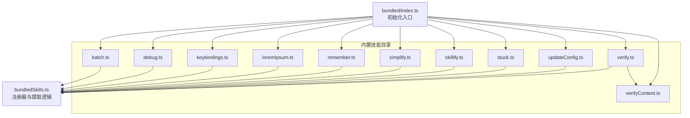
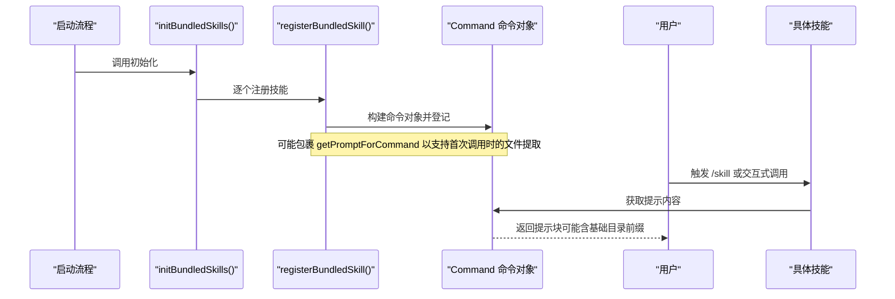
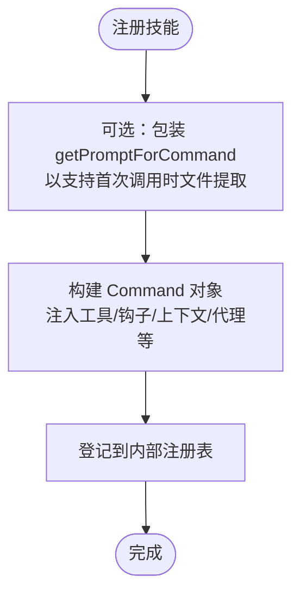
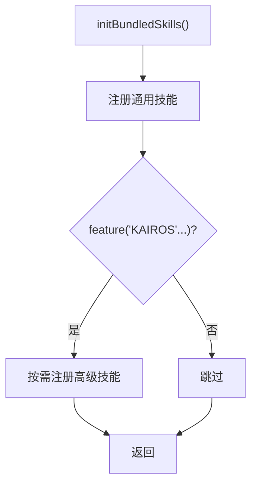
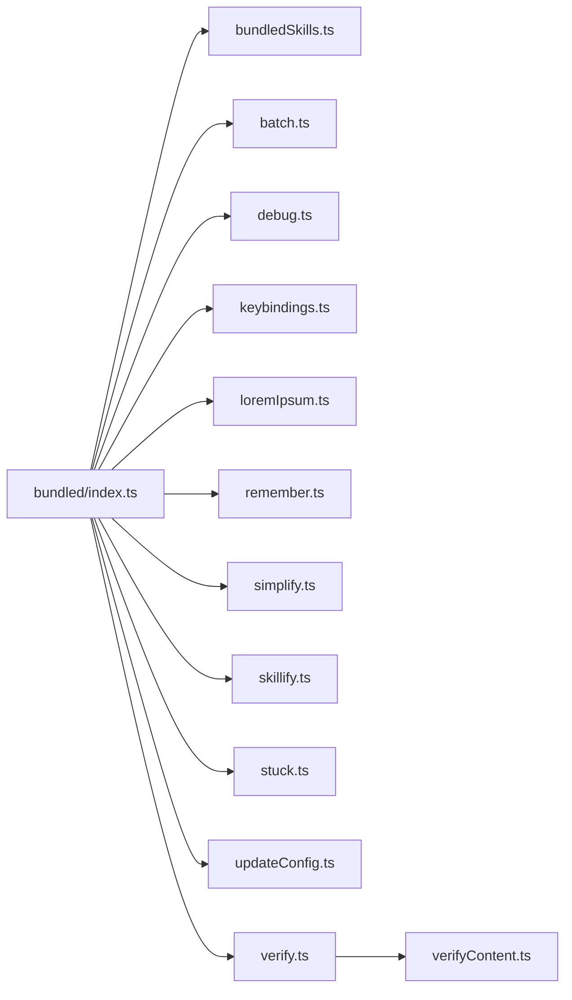

# 内置技能

<cite>
**本文引用的文件**
- [bundledSkills.ts](file://src/skills/bundledSkills.ts)
- [index.ts](file://src/skills/bundled/index.ts)
- [batch.ts](file://src/skills/bundled/batch.ts)
- [debug.ts](file://src/skills/bundled/debug.ts)
- [keybindings.ts](file://src/skills/bundled/keybindings.ts)
- [loremIpsum.ts](file://src/skills/bundled/loremIpsum.ts)
- [remember.ts](file://src/skills/bundled/remember.ts)
- [simplify.ts](file://src/skills/bundled/simplify.ts)
- [skillify.ts](file://src/skills/bundled/skillify.ts)
- [stuck.ts](file://src/skills/bundled/stuck.ts)
- [updateConfig.ts](file://src/skills/bundled/updateConfig.ts)
- [verify.ts](file://src/skills/bundled/verify.ts)
- [verifyContent.ts](file://src/skills/bundled/verifyContent.ts)
</cite>

## 目录
1. [简介](#简介)
2. [项目结构](#项目结构)
3. [核心组件](#核心组件)
4. [架构总览](#架构总览)
5. [详细组件分析](#详细组件分析)
6. [依赖关系分析](#依赖关系分析)
7. [性能考量](#性能考量)
8. [故障排查指南](#故障排查指南)
9. [结论](#结论)
10. [附录](#附录)

## 简介
本文件系统性阐述 Claude Code 的“内置技能”体系：从定义与注册机制、条件特性驱动的动态启用、到各核心技能的功能与用法、与系统其他组件（权限、上下文、工具）的集成方式，并提供扩展与自定义技能的开发指南。目标读者既包括需要快速上手的使用者，也包括希望深入理解实现细节与进行二次开发的技术人员。

## 项目结构
内置技能位于 src/skills/bundled 目录下，采用“按功能分文件 + 统一注册入口”的组织方式：
- 每个技能以独立模块导出一个 registerXxxSkill 函数，负责调用统一的注册器完成注册。
- 注册器在 src/skills/bundledSkills.ts 中实现，负责将技能包装为命令对象并登记到内部注册表。
- 初始化入口在 src/skills/bundled/index.ts，集中调用各技能的注册函数，并通过条件特性（feature flags）动态启用部分高级技能。

**图表来源**
- [bundled/index.ts:1-80](file://src/skills/bundled/index.ts#L1-L80)
- [bundledSkills.ts:1-221](file://src/skills/bundledSkills.ts#L1-L221)

**章节来源**
- [bundled/index.ts:1-80](file://src/skills/bundled/index.ts#L1-L80)

## 核心组件
- 注册器与命令对象
  - 注册器负责将技能定义转换为统一的命令对象，注入工具许可、钩子设置、上下文策略、代理、是否允许用户直接调用等元信息。
  - 支持“首次调用时惰性解包参考文件”的能力，便于模型按需读取示例或辅助文件。
- 条件特性（feature flags）
  - 通过 feature(...) 与环境判定（如 shouldAutoEnableClaudeInChrome）决定是否加载并注册某些高级技能。
- 抽象与复用
  - 各技能模块遵循相同的注册模式，便于扩展与维护。

**章节来源**
- [bundledSkills.ts:15-100](file://src/skills/bundledSkills.ts#L15-L100)
- [bundled/index.ts:24-79](file://src/skills/bundled/index.ts#L24-L79)

## 架构总览
内置技能的生命周期从“初始化注册”到“运行时按需生成提示”，再到“可选的文件提取与上下文注入”。

**图表来源**
- [bundled/index.ts:24-79](file://src/skills/bundled/index.ts#L24-L79)
- [bundledSkills.ts:53-99](file://src/skills/bundledSkills.ts#L53-L99)

## 详细组件分析

### 注册器与命令对象（bundledSkills.ts）
- 关键点
  - 定义 BundledSkillDefinition 接口，描述技能名称、描述、别名、触发条件、参数提示、允许工具、模型、是否禁用模型调用、是否允许用户调用、启用回调、钩子设置、上下文策略、代理、文件引用等。
  - registerBundledSkill 将定义转换为 Command 对象，注入 source/loaded/from 等标识，并可对 getPromptForCommand 进行包装以实现“首次调用时写入参考文件并注入基础目录前缀”。
  - 提供 getBundledSkills/clearBundledSkills，用于查询与测试清理。
  - 文件提取安全：路径规范化与防逃逸校验、原子写入、仅拥有者权限模式、跨平台安全标志位处理。
- 复杂度与性能
  - 文件提取按父目录分组并并发 mkdir/write，避免重复 IO；首次调用缓存 Promise 避免竞态写入。
  - 提示拼接 prependBaseDir 在首块文本前加一行基础目录指引，便于模型后续 Read/Grep。

**图表来源**
- [bundledSkills.ts:53-99](file://src/skills/bundledSkills.ts#L53-L99)
- [bundledSkills.ts:131-145](file://src/skills/bundledSkills.ts#L131-L145)
- [bundledSkills.ts:195-206](file://src/skills/bundledSkills.ts#L195-L206)

**章节来源**
- [bundledSkills.ts:15-100](file://src/skills/bundledSkills.ts#L15-L100)
- [bundledSkills.ts:117-145](file://src/skills/bundledSkills.ts#L117-L145)
- [bundledSkills.ts:195-220](file://src/skills/bundledSkills.ts#L195-L220)

### 初始化入口（bundled/index.ts）
- 关键点
  - 统一导入并调用各技能的 registerXxxSkill。
  - 通过 feature(...) 与 shouldAutoEnableClaudeInChrome 动态启用特定技能，体现“条件特性驱动”的设计。
  - 保持注册顺序稳定，便于后续维护与回溯。
- 扩展建议
  - 新增技能时，在该文件中添加导入与调用，遵循“先定义后注册”的约定。

**图表来源**
- [bundled/index.ts:24-79](file://src/skills/bundled/index.ts#L24-L79)

**章节来源**
- [bundled/index.ts:15-79](file://src/skills/bundled/index.ts#L15-L79)

### batch 技能
- 功能概述
  - 面向大规模、可并行分解的代码变更，引导用户进入“研究与计划”阶段，再并行派生子智能体执行单元任务，最后汇总 PR 状态。
- 使用要点
  - 需要在 Git 仓库中运行；无指令时给出示例与提示。
  - 强调“工作树隔离”“后台运行”“端到端验证配方”等关键步骤。
- 最佳实践
  - 先在计划模式下产出清晰的单元拆分与验证配方，再批量执行。
  - 严格遵循最小单元原则，避免跨单元耦合。

**章节来源**
- [batch.ts:100-124](file://src/skills/bundled/batch.ts#L100-L124)

### debug 技能
- 功能概述
  - 启用当前会话调试日志，读取最近若干行日志，帮助诊断问题；对非蚂蚁用户自动开启调试。
- 使用要点
  - 会话调试日志路径与大小展示；支持 grep 错误与警告标记。
  - 可结合设置文件位置与引导用户复现问题。
- 最佳实践
  - 问题复现前先启用日志；必要时以 --debug 重启以捕获启动期问题。

**章节来源**
- [debug.ts:12-103](file://src/skills/bundled/debug.ts#L12-L103)

### keybindings 技能
- 功能概述
  - 为键盘快捷键定制提供完整参考：默认绑定、上下文、保留键、取消绑定、组合键、行为规则、与 /doctor 的联动校验。
- 使用要点
  - 仅在启用用户快捷键定制时可见；动态生成可用上下文与动作表格。
  - 强调“只覆盖需要的上下文”“避免冲突保留键”等规则。
- 最佳实践
  - 先读取现有 ~/.claude/keybindings.json，再合并修改；避免全量替换。

**章节来源**
- [keybindings.ts:292-327](file://src/skills/bundled/keybindings.ts#L292-L327)

### lorem-ipsum 技能
- 功能概述
  - 为长上下文测试生成填充文本，支持指定近似 token 数量（带上限保护）。
- 使用要点
  - 仅限蚂蚁用户可用；输入非正数时给出错误提示。
- 最佳实践
  - 合理设置目标 token 数，避免超出安全上限。

**章节来源**
- [loremIpsum.ts:234-282](file://src/skills/bundled/loremIpsum.ts#L234-L282)

### remember 技能
- 功能概述
  - 审阅自动记忆层，提出将条目提升至 CLAUDE.md/CLAUDE.local.md 或团队共享记忆的建议，并识别重复、过时与冲突。
- 使用要点
  - 仅在启用自动记忆时可用；可接受用户补充上下文。
- 最佳实践
  - 先通读所有记忆层，再分类提出迁移/清理/待定/无需改动的清单。

**章节来源**
- [remember.ts:4-82](file://src/skills/bundled/remember.ts#L4-L82)

### simplify 技能
- 功能概述
  - 并行启动三个评审子智能体：代码复用审查、质量审查、效率审查，聚合结果后直接修复问题。
- 使用要点
  - 通过 git diff 获取变更范围；支持聚焦额外关注点。
- 最佳实践
  - 优先修复明显低效与重复逻辑；对潜在误报记录但不争辩。

**章节来源**
- [simplify.ts:55-69](file://src/skills/bundled/simplify.ts#L55-L69)

### skillify 技能
- 功能概述
  - 将一次可复用的会话过程固化为可重用技能（SKILL.md），包含名称、描述、工具许可、触发条件、参数、步骤与成功标准。
- 使用要点
  - 通过 AskUserQuestion 循环澄清高层目标、步骤、参数、保存位置与上下文策略；最终输出完整 SKILL.md 供保存与后续调用。
- 最佳实践
  - 明确每步的成功标准；区分可并行与需人工确认的步骤；必要时选择 fork 上下文以减少交互。

**章节来源**
- [skillify.ts:158-197](file://src/skills/bundled/skillify.ts#L158-L197)

### stuck 技能
- 功能概述
  - 诊断本机卡死/缓慢的 Claude Code 会话：列出进程、检查状态/D/T/Z、RSS、子进程挂起等迹象，并指导报告到反馈渠道。
- 使用要点
  - 仅限蚂蚁用户；可基于用户提供的 PID 或症状聚焦调查。
- 最佳实践
  - 仅在确实发现异常时才上报；报告采用两段式结构，便于扫描与追踪。

**章节来源**
- [stuck.ts:61-79](file://src/skills/bundled/stuck.ts#L61-L79)

### update-config 技能
- 功能概述
  - 通过编辑 settings.json/settings.local.json 配置 Claude Code 行为；强调“自动化行为需通过 hooks 实现”。
- 使用要点
  - 读取现有配置后再合并，避免覆盖；对数组类字段采取合并而非替换策略。
  - 提供 hooks 结构、事件、类型、输入输出、常见模式与验证流程。
- 最佳实践
  - 简单设置（主题/模型/语言）优先使用 Config 工具；复杂权限、环境变量、MCP、插件与 hooks 使用该技能直接编辑 JSON。

**章节来源**
- [updateConfig.ts:445-475](file://src/skills/bundled/updateConfig.ts#L445-L475)

### verify 技能
- 功能概述
  - 基于内联的 SKILL.md 与示例文件（CLI/Server）生成验证流程提示，辅助确认代码变更是否符合预期。
- 使用要点
  - 通过 files 字段在首次调用时将示例文件解包到磁盘，提示中自动包含基础目录前缀。
- 最佳实践
  - 在变更完成后使用该技能进行端到端验证；结合示例模板完善步骤与成功标准。

**章节来源**
- [verify.ts:12-30](file://src/skills/bundled/verify.ts#L12-L30)
- [verifyContent.ts:1-14](file://src/skills/bundled/verifyContent.ts#L1-L14)

## 依赖关系分析
- 模块间依赖
  - bundled/index.ts 作为入口，依赖各技能模块的 registerXxxSkill。
  - 各技能模块依赖 bundledSkills.ts 的注册器与工具集（如工具常量、Git 判定、设置路径等）。
  - verify 技能依赖 verifyContent.ts 提供的内联 Markdown 与示例文件映射。
- 特性开关
  - 通过 feature(...) 与 shouldAutoEnableClaudeInChrome 控制高级/实验性技能的注册，避免在不适用场景暴露。

**图表来源**
- [bundled/index.ts:1-80](file://src/skills/bundled/index.ts#L1-L80)
- [bundled/verify.ts:1-30](file://src/skills/bundled/verify.ts#L1-L30)
- [bundled/verifyContent.ts:1-14](file://src/skills/bundled/verifyContent.ts#L1-L14)

**章节来源**
- [bundled/index.ts:1-80](file://src/skills/bundled/index.ts#L1-L80)

## 性能考量
- 文件提取
  - 按父目录分组 mkdir 并并发写入，降低磁盘抖动；首次调用缓存 Promise，避免竞态。
  - 写入采用安全标志位与仅拥有者权限，兼顾安全性与性能。
- 日志读取
  - debug 技能采用尾部截断读取，避免大文件全量读取导致内存压力。
- 并行评审
  - simplify 技能建议并行启动多个子智能体，缩短整体耗时。

[本节为通用性能讨论，不直接分析具体文件]

## 故障排查指南
- 注册失败或未出现
  - 检查 initBundledSkills 是否被调用；确认 feature(...) 与环境判定是否满足启用条件。
- 文件提取失败
  - 查看调试日志中的写入错误；确认路径未逃逸、权限正确、磁盘空间充足。
- 快捷键配置无效
  - 使用 /doctor 校验；检查保留键冲突、语法错误、重复键等问题。
- hooks 不生效
  - 读取对应 settings.json，确保 JSON 有效；核对匹配器与事件类型；通过 --debug 观察执行日志。
- verify 技能找不到示例
  - 确认首次调用已触发文件解包；检查基础目录前缀是否正确注入。

**章节来源**
- [bundledSkills.ts:131-145](file://src/skills/bundledSkills.ts#L131-L145)
- [keybindings.ts:231-290](file://src/skills/bundled/keybindings.ts#L231-L290)
- [updateConfig.ts:434-443](file://src/skills/bundled/updateConfig.ts#L434-L443)

## 结论
内置技能体系通过统一注册器、条件特性驱动与标准化的技能接口，实现了高内聚、易扩展、可维护的技能生态。对于使用者，建议优先掌握 update-config、keybindings、debug、simplify、skillify 等高频技能；对于开发者，可在 bundled/index.ts 中新增注册入口，并在 bundled 目录下创建 registerXxxSkill 模块，遵循既有模式即可无缝接入。

[本节为总结性内容，不直接分析具体文件]

## 附录

### 条件特性与启用策略
- 常见特性开关
  - KAIROS / KAIROS_DREAM：启用高级/梦境相关技能。
  - REVIEW_ARTIFACT：启用猎手类技能。
  - AGENT_TRIGGERS / AGENT_TRIGGERS_REMOTE：启用定时/远程代理调度技能。
  - BUILDING_CLAUDE_APPS：启用 Claude API 相关技能。
  - RUN_SKILL_GENERATOR：启用技能生成器相关能力。
- 自动启用
  - Claude In Chrome：根据 shouldAutoEnableClaudeInChrome 自动启用。

**章节来源**
- [bundled/index.ts:35-79](file://src/skills/bundled/index.ts#L35-L79)

### 权限控制与上下文管理
- 权限控制
  - 通过 allowedTools 与 settings 中的 permissions.allow/deny/ask/defaultMode 管控工具使用范围。
  - hooks 可在 PreToolUse/PostToolUse 等事件点进行阻断、决策与上下文注入。
- 上下文策略
  - 通过 context 字段控制“内联（inline）”或“派生（fork）”两种上下文策略，影响交互与资源占用。
- 代理与模型
  - agent 与 model 字段可指定代理与模型；disableModelInvocation 可阻止模型自动调用，需用户显式触发。

**章节来源**
- [bundledSkills.ts:15-41](file://src/skills/bundledSkills.ts#L15-L41)
- [updateConfig.ts:445-475](file://src/skills/bundled/updateConfig.ts#L445-L475)

### 扩展开发指南与自定义技能创建
- 步骤
  - 在 src/skills/bundled 下创建 myskill.ts，导出 registerMySkill()，在其中调用 registerBundledSkill() 完成注册。
  - 在 src/skills/bundled/index.ts 中导入并调用 registerMySkill()。
  - 如需条件启用，使用 feature(...) 包裹 require 并在 initBundledSkills 中注册。
- 最佳实践
  - 明确定义 whenToUse、argumentHint、allowedTools、context、agent 等元信息。
  - 若包含示例文件，通过 files 映射在首次调用时解包，并在提示中利用基础目录前缀。
  - 对于自动化行为，优先通过 hooks 实现，避免仅依赖记忆偏好。

**章节来源**
- [bundled/index.ts:15-24](file://src/skills/bundled/index.ts#L15-L24)
- [bundledSkills.ts:53-99](file://src/skills/bundledSkills.ts#L53-L99)