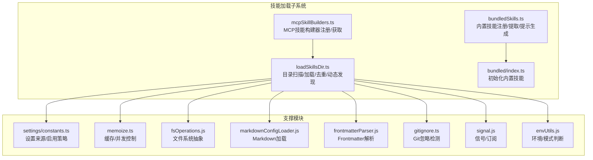
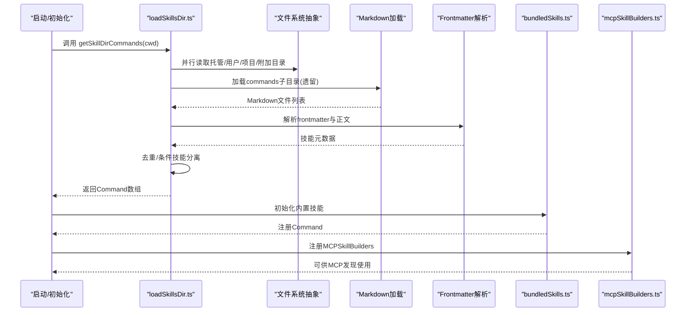
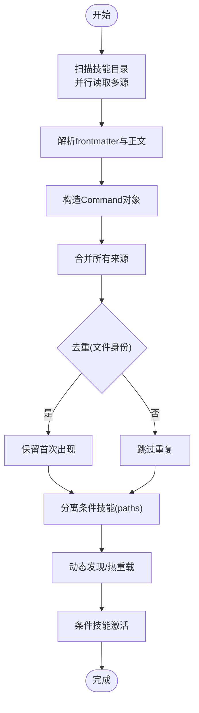
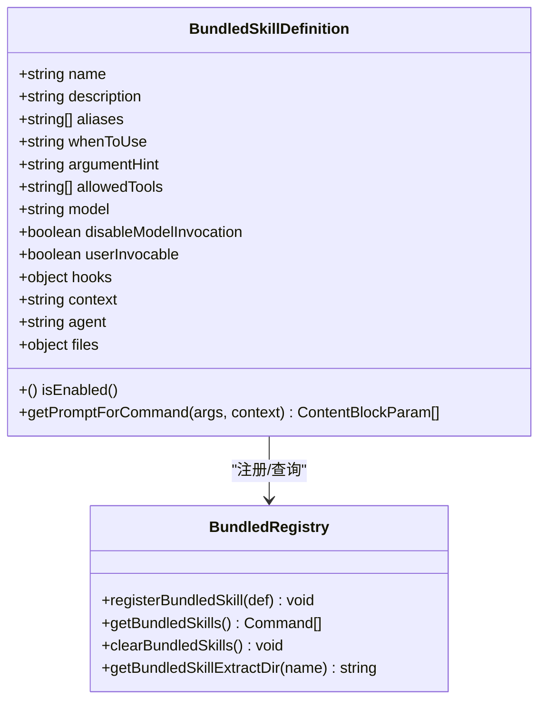
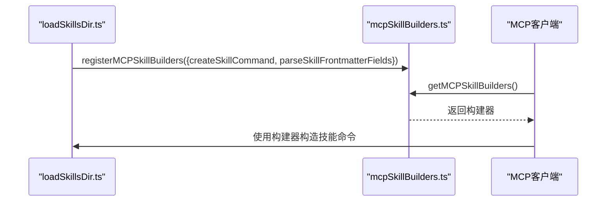
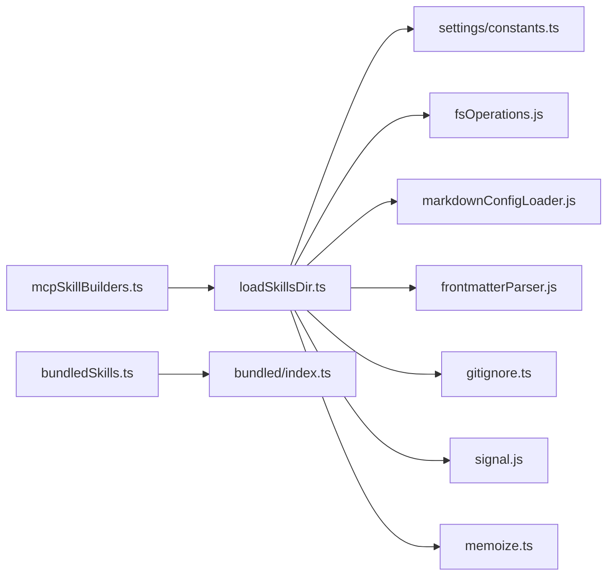

# 技能加载机制

<cite>
**本文引用的文件**
- [src/skills/loadSkillsDir.ts](file://src/skills/loadSkillsDir.ts)
- [src/skills/bundledSkills.ts](file://src/skills/bundledSkills.ts)
- [src/skills/mcpSkillBuilders.ts](file://src/skills/mcpSkillBuilders.ts)
- [src/skills/bundled/index.ts](file://src/skills/bundled/index.ts)
- [src/utils/settings/constants.ts](file://src/utils/settings/constants.ts)
- [src/utils/memoize.ts](file://src/utils/memoize.ts)
- [src/utils/errors.ts](file://src/utils/errors.ts)
- [src/utils/git/gitignore.ts](file://src/utils/git/gitignore.ts)
- [src/utils/markdownConfigLoader.js](file://src/utils/markdownConfigLoader.js)
- [src/utils/frontmatterParser.js](file://src/utils/frontmatterParser.js)
- [src/bootstrap/state.ts](file://src/bootstrap/state.ts)
- [src/services/analytics/index.js](file://src/services/analytics/index.js)
- [src/utils/signal.js](file://src/utils/signal.js)
- [src/utils/fsOperations.js](file://src/utils/fsOperations.js)
- [src/utils/envUtils.js](file://src/utils/envUtils.js)
- [src/utils/promptShellExecution.js](file://src/utils/promptShellExecution.js)
- [src/utils/argumentSubstitution.js](file://src/utils/argumentSubstitution.js)
- [src/utils/effort.js](file://src/utils/effort.js)
- [src/utils/tokenEstimation.js](file://src/utils/tokenEstimation.js)
- [src/utils/debug.js](file://src/utils/debug.js)
- [src/utils/log.js](file://src/utils/log.js)
- [src/utils/format.js](file://src/utils/format.js)
- [src/utils/settings/settings.js](file://src/utils/settings/settings.js)
- [src/tools/SkillTool/SkillTool.ts](file://src/tools/SkillTool/SkillTool.ts)
</cite>

## 目录
1. [简介](#简介)
2. [项目结构](#项目结构)
3. [核心组件](#核心组件)
4. [架构总览](#架构总览)
5. [详细组件分析](#详细组件分析)
6. [依赖分析](#依赖分析)
7. [性能考量](#性能考量)
8. [故障排除指南](#故障排除指南)
9. [结论](#结论)
10. [附录](#附录)

## 简介
本文件系统性阐述 Claude Code 的“技能”加载机制，覆盖以下关键主题：
- 技能发现、加载与注册流程
- 从目录加载技能文件的机制（含 /skills/ 与遗留 /commands/）
- bundledSkills 的管理与注册
- mcpSkillBuilders 的技能构建过程与 MCP 集成
- 动态加载与条件技能激活（热重载式行为）
- 错误处理与故障排除
- 技能优先级、依赖关系与冲突解决
- 技能缓存机制与性能优化策略

## 项目结构
与技能加载直接相关的核心模块如下：
- 目录扫描与加载：src/skills/loadSkillsDir.ts
- 内置/捆绑技能注册：src/skills/bundledSkills.ts、src/skills/bundled/index.ts
- MCP 技能构建器注册：src/skills/mcpSkillBuilders.ts
- 设置来源与启用策略：src/utils/settings/constants.ts
- 缓存与并发：src/utils/memoize.ts
- 工具与辅助：错误、调试、前端数据解析、文件系统抽象、gitignore 检查等

**图表来源**
- [src/skills/loadSkillsDir.ts:1-1087](file://src/skills/loadSkillsDir.ts#L1-L1087)
- [src/skills/bundledSkills.ts:1-221](file://src/skills/bundledSkills.ts#L1-L221)
- [src/skills/mcpSkillBuilders.ts:1-45](file://src/skills/mcpSkillBuilders.ts#L1-L45)
- [src/skills/bundled/index.ts:1-80](file://src/skills/bundled/index.ts#L1-L80)
- [src/utils/settings/constants.ts:1-203](file://src/utils/settings/constants.ts#L1-L203)
- [src/utils/memoize.ts:134-172](file://src/utils/memoize.ts#L134-L172)
- [src/utils/fsOperations.js](file://src/utils/fsOperations.js)
- [src/utils/markdownConfigLoader.js](file://src/utils/markdownConfigLoader.js)
- [src/utils/frontmatterParser.js](file://src/utils/frontmatterParser.js)
- [src/utils/git/gitignore.ts](file://src/utils/git/gitignore.ts)
- [src/utils/signal.js](file://src/utils/signal.js)
- [src/utils/envUtils.js](file://src/utils/envUtils.js)

**章节来源**
- [src/skills/loadSkillsDir.ts:1-1087](file://src/skills/loadSkillsDir.ts#L1-L1087)
- [src/skills/bundledSkills.ts:1-221](file://src/skills/bundledSkills.ts#L1-L221)
- [src/skills/mcpSkillBuilders.ts:1-45](file://src/skills/mcpSkillBuilders.ts#L1-L45)
- [src/skills/bundled/index.ts:1-80](file://src/skills/bundled/index.ts#L1-L80)
- [src/utils/settings/constants.ts:1-203](file://src/utils/settings/constants.ts#L1-L203)

## 核心组件
- 目录扫描与加载器：负责扫描 /skills/ 与遗留 /commands/，解析 frontmatter，构造 Command 对象，执行去重与条件技能分离。
- 内置/捆绑技能：在启动时注册，支持首次调用时惰性解压参考文件，统一 Command 接口。
- MCP 技能构建器：通过只依赖类型的注册表，向 MCP 发现流程提供 createSkillCommand 与 parseSkillFrontmatterFields。
- 设置来源与启用策略：决定哪些来源的技能可被加载（用户/项目/托管/本地/标志），并受策略限制。
- 动态发现与条件技能：基于文件路径动态发现技能目录，按深度优先合并；条件技能在匹配到目标路径时激活。

**章节来源**
- [src/skills/loadSkillsDir.ts:407-804](file://src/skills/loadSkillsDir.ts#L407-L804)
- [src/skills/bundledSkills.ts:43-108](file://src/skills/bundledSkills.ts#L43-L108)
- [src/skills/mcpSkillBuilders.ts:26-44](file://src/skills/mcpSkillBuilders.ts#L26-L44)
- [src/utils/settings/constants.ts:159-177](file://src/utils/settings/constants.ts#L159-L177)

## 架构总览
下图展示技能加载主流程：从目录扫描到命令对象生成，再到动态发现与条件技能激活。

**图表来源**
- [src/skills/loadSkillsDir.ts:638-804](file://src/skills/loadSkillsDir.ts#L638-L804)
- [src/skills/bundledSkills.ts:106-108](file://src/skills/bundledSkills.ts#L106-L108)
- [src/skills/mcpSkillBuilders.ts:1083-1087](file://src/skills/mcpSkillBuilders.ts#L1083-L1087)

## 详细组件分析

### 目录扫描与加载（loadSkillsDir.ts）
- 支持的目录格式
  - 新式：/skills/<技能名>/SKILL.md（目录内单一入口文件）
  - 遗留：/commands/ 下的 SKILL.md 或普通 .md 文件，后者会转换为“自定义命令”
- 关键流程
  - 读取目录条目，过滤非目录/符号链接项
  - 读取 SKILL.md，解析 frontmatter 与正文
  - 使用 parseSkillFrontmatterFields 统一解析通用字段（描述、工具、参数、effort、hooks 等）
  - 使用 createSkillCommand 构造 Command 对象，填充 source、loadedFrom、paths 等
  - 并行加载多源目录，最后进行去重与条件技能分离
- 去重策略
  - 通过 realpath 获取文件身份，避免符号链接与重复父目录导致的重复
  - 同一文件仅保留首次出现来源
- 条件技能
  - 若 frontmatter 中存在 paths，则该技能为条件技能，不立即加入结果集，而是暂存于 conditionalSkills，待后续激活
- 动态发现与热重载式更新
  - discoverSkillDirsForPaths：根据文件路径向上遍历，发现 .claude/skills 子目录（不包含 cwd 自身）
  - addSkillDirectories：按深度排序后反向合并，深路径优先
  - activateConditionalSkillsForPaths：基于 ignore 规则匹配文件路径，命中后将条件技能移动至动态技能集合
  - onDynamicSkillsLoaded：发出信号，通知监听者清理各自缓存
- 缓存与并发
  - getSkillDirCommands 使用 memoize 缓存，键为 cwd，避免重复扫描
  - clearSkillCaches 清理 memoize 缓存、条件技能集合与已激活集合
- 安全与兼容
  - 遗留 /commands/ 仍默认 user-invocable=true
  - MCP 技能禁止在提示中执行 shell 命令（安全考虑）

**图表来源**
- [src/skills/loadSkillsDir.ts:407-804](file://src/skills/loadSkillsDir.ts#L407-L804)
- [src/skills/loadSkillsDir.ts:818-1058](file://src/skills/loadSkillsDir.ts#L818-L1058)

**章节来源**
- [src/skills/loadSkillsDir.ts:407-804](file://src/skills/loadSkillsDir.ts#L407-L804)
- [src/skills/loadSkillsDir.ts:818-1058](file://src/skills/loadSkillsDir.ts#L818-L1058)

### 内置/捆绑技能（bundledSkills.ts 与 bundled/index.ts）
- 注册接口
  - registerBundledSkill：注册一个内置技能定义，返回 Command
  - getBundledSkills：返回已注册技能副本（防外部修改）
  - clearBundledSkills：测试用清空
- 提示生成与文件提取
  - 若定义包含 files，将在首次调用时惰性解压到受控目录，并在提示前添加“Base directory for this skill: <dir>”前缀
  - 使用安全写入策略（O_EXCL/O_NOFOLLOW、权限 0o700/0o600）防止 symlink/traversal 攻击
- 初始化
  - bundled/index.ts 在启动时导入各技能注册函数并逐一调用，形成“内置技能集”

**图表来源**
- [src/skills/bundledSkills.ts:15-108](file://src/skills/bundledSkills.ts#L15-L108)
- [src/skills/bundled/index.ts:24-80](file://src/skills/bundled/index.ts#L24-L80)

**章节来源**
- [src/skills/bundledSkills.ts:15-108](file://src/skills/bundledSkills.ts#L15-L108)
- [src/skills/bundled/index.ts:24-80](file://src/skills/bundled/index.ts#L24-L80)

### MCP 技能构建器（mcpSkillBuilders.ts）
- 设计动机
  - 为避免循环依赖与打包器问题，将 createSkillCommand 与 parseSkillFrontmatterFields 的注册放在叶子模块中
  - 在 loadSkillsDir.ts 初始化时注册，确保在任何 MCP 连接前可用
- 使用方式
  - getMCPSkillBuilders：获取已注册的构建器
  - registerMCPSkillBuilders：写一次注册，幂等

**图表来源**
- [src/skills/mcpSkillBuilders.ts:1083-1087](file://src/skills/mcpSkillBuilders.ts#L1083-L1087)
- [src/skills/loadSkillsDir.ts:1077-1087](file://src/skills/loadSkillsDir.ts#L1077-L1087)

**章节来源**
- [src/skills/mcpSkillBuilders.ts:26-44](file://src/skills/mcpSkillBuilders.ts#L26-L44)
- [src/skills/loadSkillsDir.ts:1077-1087](file://src/skills/loadSkillsDir.ts#L1077-L1087)

### 设置来源与启用策略（settings/constants.ts）
- SettingSource 枚举与显示名称映射
- isSettingSourceEnabled：判断某来源是否启用（受策略/标志位影响）
- getEnabledSettingSources：始终包含 policy 与 flag，再并上允许来源

**章节来源**
- [src/utils/settings/constants.ts:7-177](file://src/utils/settings/constants.ts#L7-L177)

### 动态加载与热重载机制
- discoverSkillDirsForPaths：从文件路径向上遍历，发现 .claude/skills 目录（排除 cwd 自身），并利用 gitignore 检查屏蔽
- addSkillDirectories：按深度排序后反向合并，深路径优先
- activateConditionalSkillsForPaths：基于 ignore 规则匹配文件路径，命中后激活并移出条件集合
- onDynamicSkillsLoaded：发出信号，监听者清理各自缓存，实现“热重载式”更新

**章节来源**
- [src/skills/loadSkillsDir.ts:853-975](file://src/skills/loadSkillsDir.ts#L853-L975)
- [src/skills/loadSkillsDir.ts:997-1058](file://src/skills/loadSkillsDir.ts#L997-L1058)
- [src/skills/loadSkillsDir.ts:831-851](file://src/skills/loadSkillsDir.ts#L831-L851)

## 依赖分析
- 模块耦合
  - loadSkillsDir.ts 依赖 settings、fs、markdownConfigLoader、frontmatterParser、gitignore、signal、envUtils 等
  - bundledSkills.ts 依赖 bundled 目录下的具体技能注册文件，形成启动期初始化链
  - mcpSkillBuilders.ts 作为叶子模块，仅依赖类型，避免循环依赖
- 外部依赖
  - ignore：用于条件技能路径匹配
  - lodash-es/memoize：缓存 getSkillDirCommands
  - fs/promises 与 fsOperations：跨平台文件系统抽象

**图表来源**
- [src/skills/loadSkillsDir.ts:1-66](file://src/skills/loadSkillsDir.ts#L1-L66)
- [src/skills/bundledSkills.ts:1-10](file://src/skills/bundledSkills.ts#L1-L10)
- [src/skills/mcpSkillBuilders.ts:1-5](file://src/skills/mcpSkillBuilders.ts#L1-L5)
- [src/utils/settings/constants.ts:1-203](file://src/utils/settings/constants.ts#L1-L203)
- [src/utils/memoize.ts:134-172](file://src/utils/memoize.ts#L134-L172)

**章节来源**
- [src/skills/loadSkillsDir.ts:1-66](file://src/skills/loadSkillsDir.ts#L1-L66)
- [src/skills/bundledSkills.ts:1-10](file://src/skills/bundledSkills.ts#L1-L10)
- [src/skills/mcpSkillBuilders.ts:1-5](file://src/skills/mcpSkillBuilders.ts#L1-L5)

## 性能考量
- 缓存
  - getSkillDirCommands 使用 memoize，键为 cwd，避免重复扫描
  - clearSkillCaches 清理缓存、条件集合与已激活集合，便于在动态场景后重置
- 并发
  - 目录扫描与 Markdown 加载采用 Promise.all 并行化
  - 去重阶段预计算文件身份，同步去重
- I/O 优化
  - 条件技能仅在命中时激活，减少常驻内存与上下文占用
  - 内置技能首次调用才解压文件，避免启动期额外开销
- 安全与健壮性
  - realpath 去重避免 inode 不可靠问题
  - 安全写入策略与路径规范化防止目录穿越

**章节来源**
- [src/skills/loadSkillsDir.ts:638-804](file://src/skills/loadSkillsDir.ts#L638-L804)
- [src/skills/loadSkillsDir.ts:806-811](file://src/skills/loadSkillsDir.ts#L806-L811)
- [src/utils/memoize.ts:134-172](file://src/utils/memoize.ts#L134-L172)
- [src/skills/bundledSkills.ts:131-193](file://src/skills/bundledSkills.ts#L131-L193)

## 故障排除指南
- 常见错误与定位
  - 目录不可访问：记录日志并跳过；检查权限与磁盘状态
  - SKILL.md 缺失：忽略该目录；确认文件命名大小写与路径
  - 重复文件：通过 realpath 去重；检查符号链接或重复父目录
  - 条件技能未激活：确认 paths 是否与当前文件匹配；检查相对路径与 cwd
  - Git 忽略：若所在目录被 gitignore 屏蔽，不会加载；检查 .gitignore 层级
  - MCP 技能：提示中禁用 shell 命令执行；如需脚本，请使用内置/捆绑技能或插件
- 调试建议
  - 启用调试日志，观察“Deduplicated/Activated/Loaded”等事件
  - 使用 clearSkillCaches 重置缓存后复现问题
  - 检查设置来源启用情况与策略限制
- 相关工具与入口
  - 内置 debug 技能：读取尾部日志、打印设置路径，辅助诊断
  - 远程技能加载：捕获异常并记录错误消息，便于定位网络/缓存问题

**章节来源**
- [src/skills/loadSkillsDir.ts:414-476](file://src/skills/loadSkillsDir.ts#L414-L476)
- [src/skills/loadSkillsDir.ts:853-915](file://src/skills/loadSkillsDir.ts#L853-L915)
- [src/skills/loadSkillsDir.ts:997-1058](file://src/skills/loadSkillsDir.ts#L997-L1058)
- [src/utils/errors.ts](file://src/utils/errors.ts)
- [src/utils/debug.js](file://src/utils/debug.js)
- [src/utils/log.js](file://src/utils/log.js)
- [src/skills/bundled/debug.ts:25-101](file://src/skills/bundled/debug.ts#L25-L101)
- [src/tools/SkillTool/SkillTool.ts:988-1022](file://src/tools/SkillTool/SkillTool.ts#L988-L1022)

## 结论
Claude Code 的技能加载机制以“目录扫描 + 去重 + 条件技能 + 动态发现”为核心，结合内置技能的惰性提取与 MCP 构建器的无环注册，实现了高扩展、高安全与高性能的技能体系。通过设置来源控制与缓存/并发优化，系统在复杂项目中也能保持稳定与高效。

## 附录

### 技能优先级与冲突解决
- 来源优先级（设置来源顺序决定覆盖关系）
  - policySettings > flagSettings > userSettings > projectSettings > localSettings
- 目录深度优先
  - 深度更近的技能目录优先，覆盖浅层同名技能
- 文件身份去重
  - 同一文件（realpath）仅保留首次出现来源
- 条件技能
  - 未激活的条件技能不参与默认列表，命中后再加入动态集合

**章节来源**
- [src/utils/settings/constants.ts:7-22](file://src/utils/settings/constants.ts#L7-L22)
- [src/skills/loadSkillsDir.ts:725-790](file://src/skills/loadSkillsDir.ts#L725-L790)

### 技能缓存与性能优化要点
- 缓存键：cwd
- 清理：clearSkillCaches
- 并发：目录扫描与 Markdown 加载并行
- I/O：条件技能延迟激活、内置技能惰性解压

**章节来源**
- [src/skills/loadSkillsDir.ts:638-804](file://src/skills/loadSkillsDir.ts#L638-L804)
- [src/skills/loadSkillsDir.ts:806-811](file://src/skills/loadSkillsDir.ts#L806-L811)
- [src/utils/memoize.ts:134-172](file://src/utils/memoize.ts#L134-L172)
- [src/skills/bundledSkills.ts:65-73](file://src/skills/bundledSkills.ts#L65-L73)