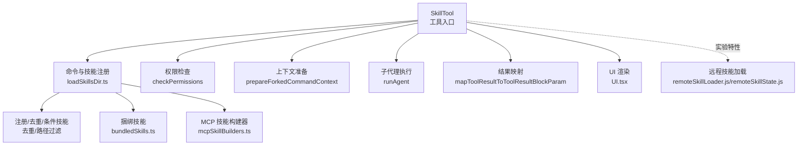
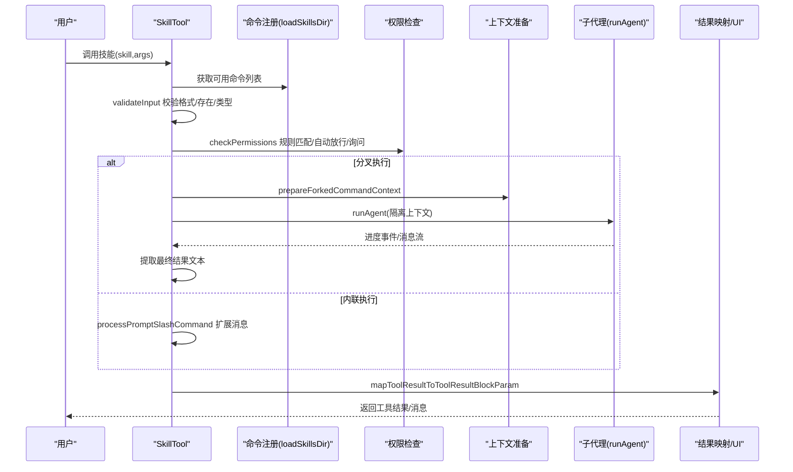
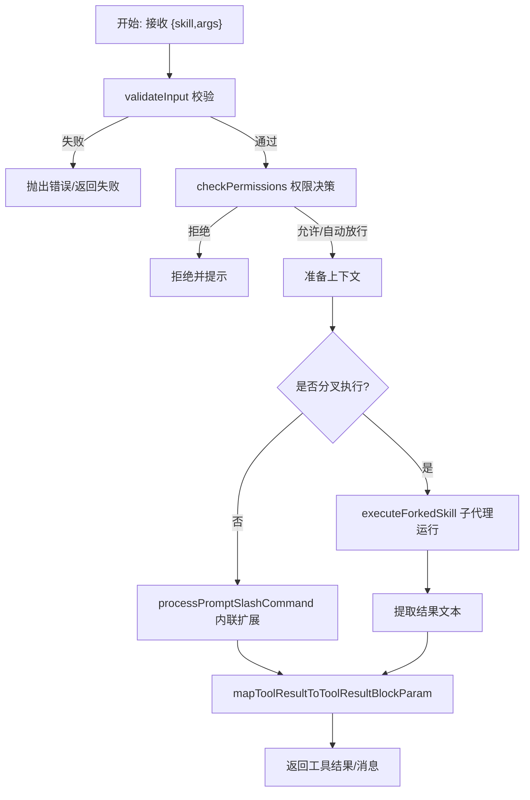
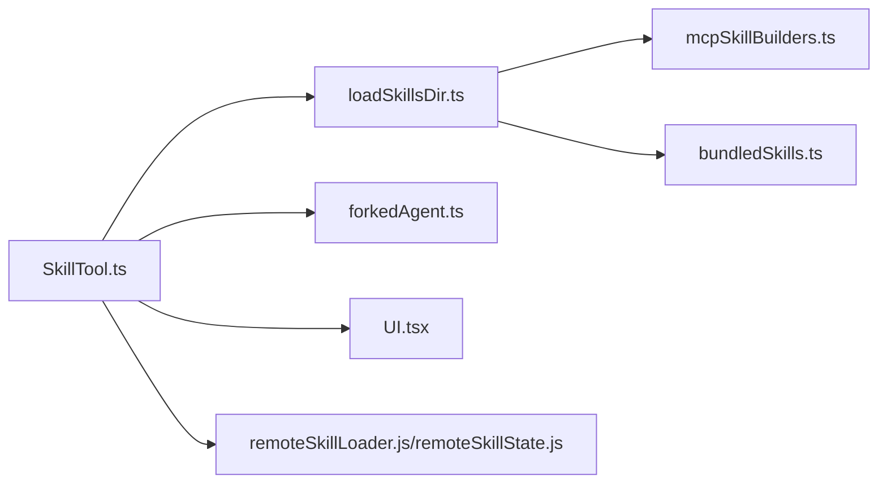

# 技能执行引擎

<cite>
**本文引用的文件**
- [SkillTool.ts](file://src/tools/SkillTool/SkillTool.ts)
- [prompt.ts](file://src/tools/SkillTool/prompt.ts)
- [constants.ts](file://src/tools/SkillTool/constants.ts)
- [UI.tsx](file://src/tools/SkillTool/UI.tsx)
- [loadSkillsDir.ts](file://src/skills/loadSkillsDir.ts)
- [bundledSkills.ts](file://src/skills/bundledSkills.ts)
- [mcpSkillBuilders.ts](file://src/skills/mcpSkillBuilders.ts)
- [remoteSkillLoader.js](file://services/skillSearch/remoteSkillLoader.js)
- [remoteSkillState.js](file://services/skillSearch/remoteSkillState.js)
- [forkedAgent.ts](file://src/utils/forkedAgent.ts)
</cite>

## 目录
1. [简介](#简介)
2. [项目结构](#项目结构)
3. [核心组件](#核心组件)
4. [架构总览](#架构总览)
5. [详细组件分析](#详细组件分析)
6. [依赖分析](#依赖分析)
7. [性能考虑](#性能考虑)
8. [故障排除指南](#故障排除指南)
9. [结论](#结论)

## 简介
本文件系统性阐述 Claude Code 的“技能执行引擎”，聚焦 SkillTool 的工作原理与执行流程，覆盖技能参数解析、上下文准备、结果处理、生命周期、并发控制与资源管理、错误处理与异常恢复、性能监控与优化、安全检查与权限验证，以及与工具系统的集成关系与数据流转。

## 项目结构
围绕技能执行的关键模块分布如下：
- 工具层：SkillTool 作为统一入口，负责输入校验、权限决策、上下文准备、消息注入与结果映射
- 技能发现与加载：本地/项目/策略来源的技能目录扫描与去重；插件/内置/捆绑技能注册
- 远程技能：实验性远程技能加载（AKI/GCS）与缓存
- 子代理执行：forked 执行在隔离子代理中运行，支持独立 token 预算与进度上报
- UI 展示：工具使用、进度、拒绝与错误消息的渲染

图表来源
- [SkillTool.ts:331-869](file://src/tools/SkillTool/SkillTool.ts#L331-L869)
- [loadSkillsDir.ts:638-800](file://src/skills/loadSkillsDir.ts#L638-L800)
- [bundledSkills.ts:43-108](file://src/skills/bundledSkills.ts#L43-L108)
- [mcpSkillBuilders.ts:25-44](file://src/skills/mcpSkillBuilders.ts#L25-L44)
- [remoteSkillLoader.js:1-4](file://services/skillSearch/remoteSkillLoader.js#L1-L4)
- [remoteSkillState.js:1-4](file://services/skillSearch/remoteSkillState.js#L1-L4)

章节来源
- [SkillTool.ts:1-1109](file://src/tools/SkillTool/SkillTool.ts#L1-L1109)
- [loadSkillsDir.ts:1-1087](file://src/skills/loadSkillsDir.ts#L1-L1087)
- [bundledSkills.ts:1-221](file://src/skills/bundledSkills.ts#L1-L221)
- [mcpSkillBuilders.ts:1-45](file://src/skills/mcpSkillBuilders.ts#L1-L45)
- [remoteSkillLoader.js:1-4](file://services/skillSearch/remoteSkillLoader.js#L1-L4)
- [remoteSkillState.js:1-4](file://services/skillSearch/remoteSkillState.js#L1-L4)

## 核心组件
- SkillTool：统一的技能调用工具，定义输入输出模式、权限策略、执行分支（内联/分叉）、结果映射与 UI 渲染
- 命令与技能注册：从多源目录加载技能，解析 frontmatter，生成 Command 对象并去重
- 捆绑技能：编译期打包的内置技能，首次调用时惰性解包到工作目录
- 子代理执行：forked 执行在独立 agent 上下文中运行，支持进度事件与结果提取
- 权限系统：基于规则匹配的允许/拒绝/询问策略，支持精确与前缀规则
- 远程技能：实验特性，支持从 AKI/GCS 加载远程技能内容并注入会话

章节来源
- [SkillTool.ts:291-327](file://src/tools/SkillTool/SkillTool.ts#L291-L327)
- [loadSkillsDir.ts:185-401](file://src/skills/loadSkillsDir.ts#L185-L401)
- [bundledSkills.ts:43-108](file://src/skills/bundledSkills.ts#L43-L108)
- [forkedAgent.ts](file://src/utils/forkedAgent.ts)

## 架构总览
SkillTool 的执行路径分为两条主线：
- 内联执行：直接扩展为一组消息并注入当前会话，适合轻量、无需额外工具的技能
- 分叉执行：在子代理中运行，拥有独立 token 预算与工具集，适合复杂任务或需要隔离的场景

图表来源
- [SkillTool.ts:580-841](file://src/tools/SkillTool/SkillTool.ts#L580-L841)
- [loadSkillsDir.ts:638-800](file://src/skills/loadSkillsDir.ts#L638-L800)
- [forkedAgent.ts](file://src/utils/forkedAgent.ts)

## 详细组件分析

### SkillTool 输入/输出与生命周期
- 输入模式：包含技能名与可选参数，支持去除前导斜杠兼容
- 输出模式：内联返回技能元信息（是否成功、允许工具、模型覆盖等），分叉返回子代理 ID 与结果文本
- 生命周期阶段：
  - 输入校验：格式、存在性、类型（必须为 prompt）、禁用模型调用检查
  - 权限决策：规则匹配、自动放行（仅安全属性）、询问用户
  - 上下文准备：内联时扩展消息；分叉时准备隔离上下文与 agent 定义
  - 执行：内联直接注入消息；分叉在子代理中运行并收集进度
  - 结果映射：将执行结果转换为工具结果块参数
  - UI 渲染：根据状态显示加载/进度/完成/错误消息

图表来源
- [SkillTool.ts:354-841](file://src/tools/SkillTool/SkillTool.ts#L354-L841)

章节来源
- [SkillTool.ts:291-327](file://src/tools/SkillTool/SkillTool.ts#L291-L327)
- [SkillTool.ts:354-578](file://src/tools/SkillTool/SkillTool.ts#L354-L578)
- [SkillTool.ts:580-841](file://src/tools/SkillTool/SkillTool.ts#L580-L841)
- [SkillTool.ts:843-869](file://src/tools/SkillTool/SkillTool.ts#L843-L869)

### 技能参数解析与上下文准备
- 参数解析：移除前导斜杠，标准化命令名；支持远程规范名称（实验特性）
- 上下文准备：
  - 内联：通过 processPromptSlashCommand 将技能扩展为消息序列，并注入工具使用 ID
  - 分叉：prepareForkedCommandContext 生成子代理的消息与 agent 定义，合并技能 effort 到 agent
- 模型与工具覆盖：若技能声明 allowedTools 或 model，则在上下文修改器中注入到工具权限与主循环模型

章节来源
- [SkillTool.ts:580-841](file://src/tools/SkillTool/SkillTool.ts#L580-L841)
- [forkedAgent.ts](file://src/utils/forkedAgent.ts)

### 并发控制与资源管理
- 单次执行限制：注释明确指出一次只能运行一个技能，因为技能展开为完整提示后需等待模型处理
- 子代理隔离：
  - 每个分叉执行分配唯一 agentId，确保资源隔离
  - 子代理运行期间持续收集消息并上报进度
  - 执行完成后清理 invokedSkills 状态，释放内存
- 资源占用：
  - 分叉执行拥有独立 token 预算，避免影响主会话
  - 进度消息在 UI 中按需截断显示，减少渲染压力

章节来源
- [SkillTool.ts:346-352](file://src/tools/SkillTool/SkillTool.ts#L346-L352)
- [SkillTool.ts:122-289](file://src/tools/SkillTool/SkillTool.ts#L122-L289)
- [SkillTool.ts:285-289](file://src/tools/SkillTool/SkillTool.ts#L285-L289)

### 错误处理与异常恢复
- 输入错误：未知技能、格式非法、非 prompt 技能、禁用模型调用
- 权限错误：被显式拒绝规则阻止
- 远程技能加载失败：捕获异常并记录错误消息，抛出清晰的失败信息
- 异常恢复：分叉执行结束后清理 invokedSkills；UI 层提供回退消息组件用于展示错误/拒绝

章节来源
- [SkillTool.ts:354-430](file://src/tools/SkillTool/SkillTool.ts#L354-L430)
- [SkillTool.ts:432-578](file://src/tools/SkillTool/SkillTool.ts#L432-L578)
- [SkillTool.ts:969-1109](file://src/tools/SkillTool/SkillTool.ts#L969-L1109)
- [UI.tsx:94-127](file://src/tools/SkillTool/UI.tsx#L94-L127)

### 性能监控与优化
- 字符预算与描述截断：技能列表采用字符预算策略，优先保留捆绑技能描述，其余按预算截断
- 进度事件：分叉执行过程中按工具使用事件上报进度，便于前端节流与 UI 更新
- 缓存与延迟：远程技能加载记录缓存命中与延迟，辅助性能分析
- 去重与懒加载：技能目录去重避免重复文件；捆绑技能首次调用才解包，降低启动开销

章节来源
- [prompt.ts:31-171](file://src/tools/SkillTool/prompt.ts#L31-L171)
- [SkillTool.ts:122-289](file://src/tools/SkillTool/SkillTool.ts#L122-L289)
- [SkillTool.ts:969-1109](file://src/tools/SkillTool/SkillTool.ts#L969-L1109)
- [loadSkillsDir.ts:725-769](file://src/skills/loadSkillsDir.ts#L725-L769)
- [bundledSkills.ts:131-145](file://src/skills/bundledSkills.ts#L131-L145)

### 安全检查与权限验证
- 规则匹配：支持精确匹配与前缀匹配（如 review:*），分别对应 deny/allow 规则
- 自动放行：当技能仅包含安全属性且值为空/未设置时，自动允许
- 远程技能：实验特性下对特定用户组自动放行，但用户自定义的 deny 规则仍生效
- 插件来源：官方市场来源的技能有额外标识，便于审计与统计

章节来源
- [SkillTool.ts:432-578](file://src/tools/SkillTool/SkillTool.ts#L432-L578)
- [SkillTool.ts:871-933](file://src/tools/SkillTool/SkillTool.ts#L871-L933)
- [SkillTool.ts:935-942](file://src/tools/SkillTool/SkillTool.ts#L935-L942)

### 与工具系统的集成与数据流转
- 工具定义：SkillTool 通过 buildTool 注册输入/输出模式与渲染函数
- 消息注入：内联执行将扩展后的消息注入当前会话，同时标记工具使用 ID
- 结果映射：将执行结果映射为工具结果块参数，供上层工具链消费
- UI 集成：提供多种消息渲染函数，支持进度、拒绝与错误场景

章节来源
- [SkillTool.ts:331-341](file://src/tools/SkillTool/SkillTool.ts#L331-L341)
- [SkillTool.ts:843-869](file://src/tools/SkillTool/SkillTool.ts#L843-L869)
- [UI.tsx:20-127](file://src/tools/SkillTool/UI.tsx#L20-L127)

## 依赖分析
- SkillTool 依赖命令注册与权限系统，动态获取所有可用命令（含 MCP 技能）
- 分叉执行依赖子代理运行器与上下文准备工具
- 远程技能为可选特性，通过特性开关引入
- 捆绑技能与 MCP 技能构建器通过注册表解耦，避免循环依赖

图表来源
- [SkillTool.ts:1-1109](file://src/tools/SkillTool/SkillTool.ts#L1-L1109)
- [loadSkillsDir.ts:1-1087](file://src/skills/loadSkillsDir.ts#L1-L1087)
- [mcpSkillBuilders.ts:1-45](file://src/skills/mcpSkillBuilders.ts#L1-L45)
- [bundledSkills.ts:1-221](file://src/skills/bundledSkills.ts#L1-L221)
- [remoteSkillLoader.js:1-4](file://services/skillSearch/remoteSkillLoader.js#L1-L4)
- [remoteSkillState.js:1-4](file://services/skillSearch/remoteSkillState.js#L1-L4)
- [forkedAgent.ts](file://src/utils/forkedAgent.ts)

章节来源
- [SkillTool.ts:81-94](file://src/tools/SkillTool/SkillTool.ts#L81-L94)
- [loadSkillsDir.ts:638-800](file://src/skills/loadSkillsDir.ts#L638-L800)
- [mcpSkillBuilders.ts:25-44](file://src/skills/mcpSkillBuilders.ts#L25-L44)

## 性能考虑
- 技能列表预算：通过字符预算与描述截断平衡展示与缓存开销
- 分叉执行隔离：独立 agent 与 token 预算避免主会话阻塞
- 去重与懒加载：减少重复 IO 与内存占用
- 进度节流：UI 层对进度消息进行截断与节流，降低渲染压力

## 故障排除指南
- 未知技能：确认技能名拼写与前缀；检查命令注册与 MCP 技能加载
- 权限被拒：检查本地/全局规则；必要时使用建议的规则添加
- 分叉执行异常：查看子代理运行日志；确认 allowedTools 与模型覆盖配置
- 远程技能加载失败：检查网络与缓存；查看延迟与错误字段

章节来源
- [SkillTool.ts:354-430](file://src/tools/SkillTool/SkillTool.ts#L354-L430)
- [SkillTool.ts:432-578](file://src/tools/SkillTool/SkillTool.ts#L432-L578)
- [SkillTool.ts:969-1109](file://src/tools/SkillTool/SkillTool.ts#L969-L1109)

## 结论
SkillTool 将技能调用抽象为统一的工具接口，结合严格的权限控制、灵活的上下文准备与分叉执行能力，实现了安全、可控且高性能的技能执行体系。通过字符预算、去重与懒加载等策略，兼顾了用户体验与系统性能；通过 UI 回退组件与详细的错误信息，提升了可观测性与可维护性。