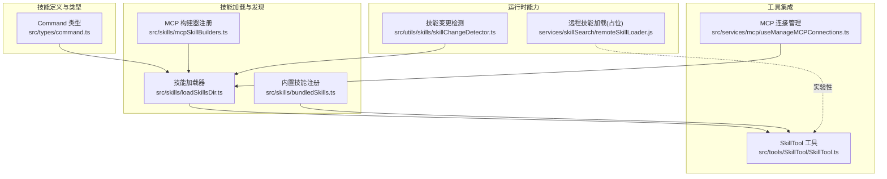
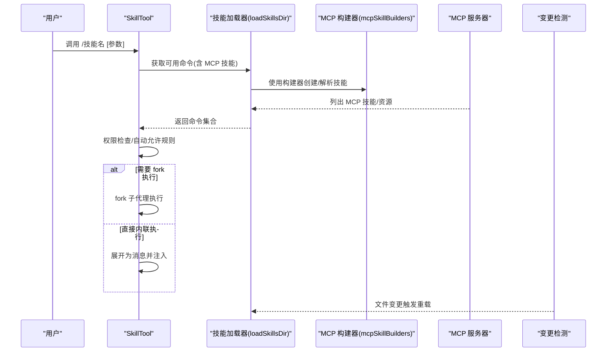
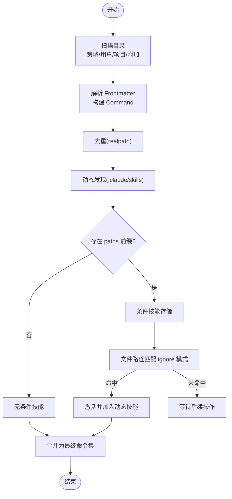
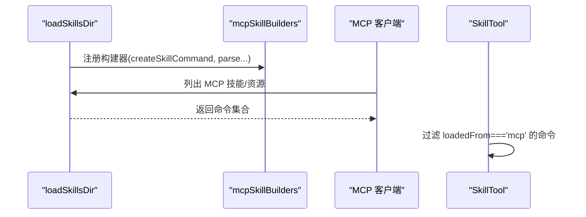
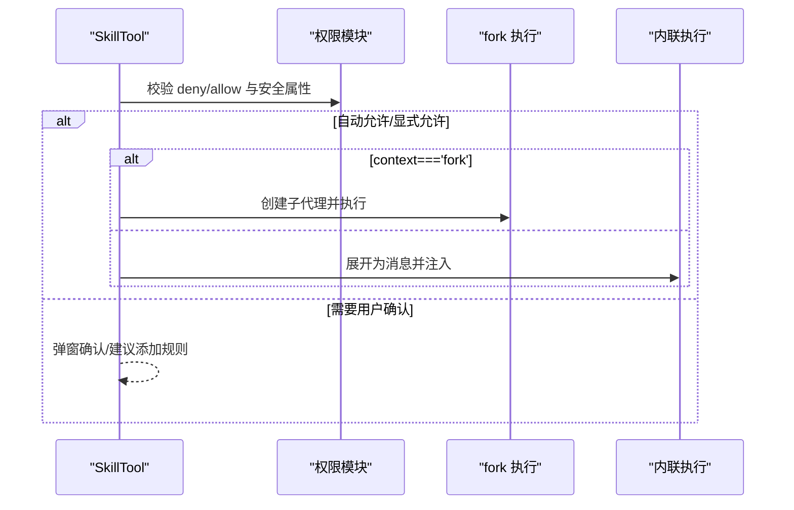
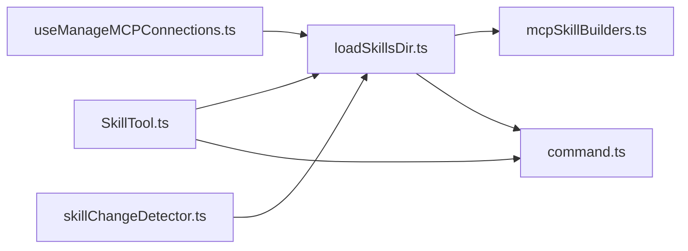

# 技能系统

<cite>
**本文引用的文件**
- [src/skills/loadSkillsDir.ts](file://src/skills/loadSkillsDir.ts)
- [src/skills/mcpSkillBuilders.ts](file://src/skills/mcpSkillBuilders.ts)
- [src/skills/bundledSkills.ts](file://src/skills/bundledSkills.ts)
- [src/tools/SkillTool/SkillTool.ts](file://src/tools/SkillTool/SkillTool.ts)
- [src/types/command.ts](file://src/types/command.ts)
- [src/services/mcp/useManageMCPConnections.ts](file://src/services/mcp/useManageMCPConnections.ts)
- [src/utils/skills/skillChangeDetector.ts](file://src/utils/skills/skillChangeDetector.ts)
- [skills/mcpSkills.js](file://skills/mcpSkills.js)
- [services/skillSearch/remoteSkillLoader.js](file://services/skillSearch/remoteSkillLoader.js)
</cite>

## 目录
1. [简介](#简介)
2. [项目结构](#项目结构)
3. [核心组件](#核心组件)
4. [架构总览](#架构总览)
5. [详细组件分析](#详细组件分析)
6. [依赖分析](#依赖分析)
7. [性能考量](#性能考量)
8. [故障排除指南](#故障排除指南)
9. [结论](#结论)
10. [附录](#附录)

## 简介
本文件系统性梳理 Claude Code 的“技能”体系：从技能的定义、加载与执行机制，到内置与 MCP 技能的集成方式；覆盖技能生命周期（发现、注册、动态加载）、与工具系统的集成关系、在命令系统中的使用方式；并提供开发指南、权限控制、上下文管理、性能优化建议，以及配置、调试与故障排除的实用方法。

## 项目结构
技能系统主要由以下模块构成：
- 技能定义与类型：统一的 Command 类型与 PromptCommand 规范
- 技能加载器：扫描本地/项目/策略目录，解析 frontmatter，构建 Command
- 内置技能注册：编译期打包的内置技能注册表
- MCP 技能集成：通过注册表桥接 MCP 技能发现与加载
- 工具集成：SkillTool 将技能作为工具调用入口，支持 fork 执行与权限校验
- 动态发现与条件激活：基于路径的动态技能发现与条件激活
- 变更检测：监听技能文件变更以触发重载

图表来源
- [src/types/command.ts:1-217](file://src/types/command.ts#L1-L217)
- [src/skills/loadSkillsDir.ts:1-1087](file://src/skills/loadSkillsDir.ts#L1-L1087)
- [src/skills/mcpSkillBuilders.ts:1-45](file://src/skills/mcpSkillBuilders.ts#L1-L45)
- [src/skills/bundledSkills.ts:1-221](file://src/skills/bundledSkills.ts#L1-L221)
- [src/tools/SkillTool/SkillTool.ts:1-1109](file://src/tools/SkillTool/SkillTool.ts#L1-L1109)
- [src/services/mcp/useManageMCPConnections.ts:728-753](file://src/services/mcp/useManageMCPConnections.ts#L728-L753)
- [src/utils/skills/skillChangeDetector.ts:281-311](file://src/utils/skills/skillChangeDetector.ts#L281-L311)
- [services/skillSearch/remoteSkillLoader.js:1-3](file://services/skillSearch/remoteSkillLoader.js#L1-L3)

章节来源
- [src/skills/loadSkillsDir.ts:1-1087](file://src/skills/loadSkillsDir.ts#L1-L1087)
- [src/skills/mcpSkillBuilders.ts:1-45](file://src/skills/mcpSkillBuilders.ts#L1-L45)
- [src/skills/bundledSkills.ts:1-221](file://src/skills/bundledSkills.ts#L1-L221)
- [src/tools/SkillTool/SkillTool.ts:1-1109](file://src/tools/SkillTool/SkillTool.ts#L1-L1109)
- [src/types/command.ts:1-217](file://src/types/command.ts#L1-L217)
- [src/services/mcp/useManageMCPConnections.ts:728-753](file://src/services/mcp/useManageMCPConnections.ts#L728-L753)
- [src/utils/skills/skillChangeDetector.ts:281-311](file://src/utils/skills/skillChangeDetector.ts#L281-L311)
- [skills/mcpSkills.js:1-4](file://skills/mcpSkills.js#L1-L4)
- [services/skillSearch/remoteSkillLoader.js:1-3](file://services/skillSearch/remoteSkillLoader.js#L1-L3)

## 核心组件
- Command/PromptCommand 类型：统一描述技能的元数据、来源、上下文、工具白名单、路径过滤等
- 技能加载器：负责扫描目录、解析 frontmatter、去重、动态发现、条件激活、缓存与信号
- 内置技能注册：将编译期打包的内置技能注入命令表
- MCP 技能集成：通过“叶子注册表”避免循环依赖，暴露构建函数给 MCP 客户端
- SkillTool：作为工具入口，负责权限决策、fork 执行、消息注入、遥测上报
- 变更检测：监听技能文件变更，触发重载与索引重建

章节来源
- [src/types/command.ts:1-217](file://src/types/command.ts#L1-L217)
- [src/skills/loadSkillsDir.ts:638-804](file://src/skills/loadSkillsDir.ts#L638-L804)
- [src/skills/bundledSkills.ts:43-108](file://src/skills/bundledSkills.ts#L43-L108)
- [src/skills/mcpSkillBuilders.ts:26-44](file://src/skills/mcpSkillBuilders.ts#L26-L44)
- [src/tools/SkillTool/SkillTool.ts:331-800](file://src/tools/SkillTool/SkillTool.ts#L331-L800)
- [src/utils/skills/skillChangeDetector.ts:281-311](file://src/utils/skills/skillChangeDetector.ts#L281-L311)

## 架构总览
技能系统围绕“命令(Command)”这一核心抽象展开：本地/项目/策略/插件/内置/MCP 来源统一收敛为 Command，再由 SkillTool 统一调度执行。MCP 技能通过“叶子注册表”安全地共享构建函数，避免依赖环；动态发现与条件激活确保按需加载与最小化开销。

图表来源
- [src/tools/SkillTool/SkillTool.ts:354-430](file://src/tools/SkillTool/SkillTool.ts#L354-L430)
- [src/skills/loadSkillsDir.ts:638-804](file://src/skills/loadSkillsDir.ts#L638-L804)
- [src/skills/mcpSkillBuilders.ts:33-44](file://src/skills/mcpSkillBuilders.ts#L33-L44)
- [src/services/mcp/useManageMCPConnections.ts:728-753](file://src/services/mcp/useManageMCPConnections.ts#L728-L753)
- [src/utils/skills/skillChangeDetector.ts:281-311](file://src/utils/skills/skillChangeDetector.ts#L281-L311)

## 详细组件分析

### 技能定义与类型规范
- Command/PromptCommand 提供统一字段：名称、描述、别名、工具白名单、模型覆盖、是否可被模型调用、是否用户可调用、来源与加载位置、钩子、执行上下文、Agent 类型、努力值、路径过滤、内容长度、提示生成回调等
- 这些字段支撑后续的权限、上下文、条件激活、遥测与 UI 呈现

章节来源
- [src/types/command.ts:25-57](file://src/types/command.ts#L25-L57)
- [src/types/command.ts:175-206](file://src/types/command.ts#L175-L206)

### 技能加载与生命周期
- 目录扫描与去重：支持策略/用户/项目/附加目录，使用 realpath 去重，避免符号链接与重复路径
- Frontmatter 解析：统一解析描述、工具白名单、参数名、whenToUse、版本、模型、禁用模型调用、用户可调用、钩子、执行上下文、Agent、努力值、shell 执行等
- 动态发现：根据文件路径向上遍历，发现 .claude/skills 目录，结合 gitignore 过滤，按深度优先合并
- 条件激活：基于 ignore 规则匹配 paths，首次命中后加入动态技能集合
- 缓存与信号：memoize 缓存、信号通知订阅者清理缓存

图表来源
- [src/skills/loadSkillsDir.ts:638-804](file://src/skills/loadSkillsDir.ts#L638-L804)
- [src/skills/loadSkillsDir.ts:861-915](file://src/skills/loadSkillsDir.ts#L861-L915)
- [src/skills/loadSkillsDir.ts:997-1058](file://src/skills/loadSkillsDir.ts#L997-L1058)

章节来源
- [src/skills/loadSkillsDir.ts:638-804](file://src/skills/loadSkillsDir.ts#L638-L804)
- [src/skills/loadSkillsDir.ts:861-915](file://src/skills/loadSkillsDir.ts#L861-L915)
- [src/skills/loadSkillsDir.ts:997-1058](file://src/skills/loadSkillsDir.ts#L997-L1058)

### 内置技能与打包
- 内置技能以“编译期打包”的形式提供，注册时可选择预提取参考文件到磁盘，并在首次调用时注入 base 目录前缀，便于模型按需读取
- 注册表为进程级单例，支持清空用于测试

章节来源
- [src/skills/bundledSkills.ts:43-108](file://src/skills/bundledSkills.ts#L43-L108)
- [src/skills/bundledSkills.ts:120-145](file://src/skills/bundledSkills.ts#L120-L145)
- [src/skills/bundledSkills.ts:195-221](file://src/skills/bundledSkills.ts#L195-L221)

### MCP 技能集成
- 通过“叶子注册表”在模块初始化时注册 createSkillCommand 与 parseSkillFrontmatterFields，避免循环依赖
- MCP 服务器连接后，刷新资源列表，合并 MCP 技能与提示，触发技能搜索索引清理
- 仅暴露类型为 prompt 且 loadedFrom 为 mcp 的命令给 SkillTool

图表来源
- [src/skills/loadSkillsDir.ts:1077-1086](file://src/skills/loadSkillsDir.ts#L1077-L1086)
- [src/skills/mcpSkillBuilders.ts:33-44](file://src/skills/mcpSkillBuilders.ts#L33-L44)
- [src/services/mcp/useManageMCPConnections.ts:728-753](file://src/services/mcp/useManageMCPConnections.ts#L728-L753)
- [src/tools/SkillTool/SkillTool.ts:81-94](file://src/tools/SkillTool/SkillTool.ts#L81-L94)

章节来源
- [src/skills/loadSkillsDir.ts:1077-1086](file://src/skills/loadSkillsDir.ts#L1077-L1086)
- [src/skills/mcpSkillBuilders.ts:33-44](file://src/skills/mcpSkillBuilders.ts#L33-L44)
- [src/services/mcp/useManageMCPConnections.ts:728-753](file://src/services/mcp/useManageMCPConnections.ts#L728-L753)
- [src/tools/SkillTool/SkillTool.ts:81-94](file://src/tools/SkillTool/SkillTool.ts#L81-L94)

### 工具系统集成与执行
- 输入校验：去除前导斜杠兼容、远程规范名处理、未知技能、禁用模型调用、非 prompt 技能
- 权限决策：deny/allow 规则匹配、前缀通配、仅安全属性自动允许、建议添加规则
- 执行路径：fork 子代理执行或内联扩展为消息注入；fork 模式下独立 token 预算与进度上报
- 遥测：记录调用来源、查询深度、父代理、插件市场信息、是否被发现等

图表来源
- [src/tools/SkillTool/SkillTool.ts:354-430](file://src/tools/SkillTool/SkillTool.ts#L354-L430)
- [src/tools/SkillTool/SkillTool.ts:432-578](file://src/tools/SkillTool/SkillTool.ts#L432-L578)
- [src/tools/SkillTool/SkillTool.ts:622-632](file://src/tools/SkillTool/SkillTool.ts#L622-L632)
- [src/tools/SkillTool/SkillTool.ts:634-766](file://src/tools/SkillTool/SkillTool.ts#L634-L766)

章节来源
- [src/tools/SkillTool/SkillTool.ts:354-430](file://src/tools/SkillTool/SkillTool.ts#L354-L430)
- [src/tools/SkillTool/SkillTool.ts:432-578](file://src/tools/SkillTool/SkillTool.ts#L432-L578)
- [src/tools/SkillTool/SkillTool.ts:622-632](file://src/tools/SkillTool/SkillTool.ts#L622-L632)
- [src/tools/SkillTool/SkillTool.ts:634-766](file://src/tools/SkillTool/SkillTool.ts#L634-L766)

### 上下文管理与权限控制
- 上下文：支持 inline/fork 两种执行上下文；fork 时独立 Agent 与预算
- 权限：基于规则的 deny/allow；前缀匹配；仅安全属性默认允许；建议快速添加规则
- 插件与来源：区分内置、策略、用户、项目、插件、MCP、远程规范名等来源，用于遥测与 UI

章节来源
- [src/tools/SkillTool/SkillTool.ts:432-578](file://src/tools/SkillTool/SkillTool.ts#L432-L578)
- [src/types/command.ts:42-48](file://src/types/command.ts#L42-L48)
- [src/types/command.ts:191-197](file://src/types/command.ts#L191-L197)

### 开发指南：接口规范、参数与执行逻辑
- 接口规范
  - 技能必须实现 getPromptForCommand(args, context) 并返回 ContentBlockParam[]
  - frontmatter 字段：description、arguments、argument-hint、when_to_use、version、model、disable-model-invocation、user-invocable、allowed-tools、hooks、context、agent、effort、shell、paths 等
- 参数定义
  - 支持参数名解析与替换、${CLAUDE_SESSION_ID} 注入、${CLAUDE_SKILL_DIR} 替换（非 MCP）
  - shell 块在非 MCP 场景下执行
- 执行逻辑
  - 内联：直接扩展为消息并注入
  - fork：创建子代理，独立预算与进度上报，结束后释放状态

章节来源
- [src/skills/loadSkillsDir.ts:269-401](file://src/skills/loadSkillsDir.ts#L269-L401)
- [src/skills/loadSkillsDir.ts:344-399](file://src/skills/loadSkillsDir.ts#L344-L399)
- [src/tools/SkillTool/SkillTool.ts:118-289](file://src/tools/SkillTool/SkillTool.ts#L118-L289)

## 依赖分析
- 模块耦合
  - loadSkillsDir.ts 依赖 frontmatter 解析、路径工具、设置源、缓存与信号等；通过 mcpSkillBuilders.ts 以“叶子注册表”解耦 MCP
  - SkillTool 依赖命令检索、权限模块、fork 执行、遥测与 UI 渲染
  - useManageMCPConnections.ts 在 MCP 资源变化时刷新命令并清理索引
- 外部依赖
  - ignore 用于路径过滤
  - lodash-es.memoize 用于缓存
  - 依赖环规避：mcpSkillBuilders.ts 仅导入类型，避免循环

图表来源
- [src/skills/loadSkillsDir.ts:1-1087](file://src/skills/loadSkillsDir.ts#L1-L1087)
- [src/skills/mcpSkillBuilders.ts:1-45](file://src/skills/mcpSkillBuilders.ts#L1-L45)
- [src/tools/SkillTool/SkillTool.ts:1-1109](file://src/tools/SkillTool/SkillTool.ts#L1-L1109)
- [src/services/mcp/useManageMCPConnections.ts:728-753](file://src/services/mcp/useManageMCPConnections.ts#L728-L753)
- [src/utils/skills/skillChangeDetector.ts:281-311](file://src/utils/skills/skillChangeDetector.ts#L281-L311)

章节来源
- [src/skills/loadSkillsDir.ts:1-1087](file://src/skills/loadSkillsDir.ts#L1-L1087)
- [src/skills/mcpSkillBuilders.ts:1-45](file://src/skills/mcpSkillBuilders.ts#L1-L45)
- [src/tools/SkillTool/SkillTool.ts:1-1109](file://src/tools/SkillTool/SkillTool.ts#L1-L1109)
- [src/services/mcp/useManageMCPConnections.ts:728-753](file://src/services/mcp/useManageMCPConnections.ts#L728-L753)
- [src/utils/skills/skillChangeDetector.ts:281-311](file://src/utils/skills/skillChangeDetector.ts#L281-L311)

## 性能考量
- 缓存与去重
  - 使用 memoize 缓存目录扫描结果
  - realpath 去重避免重复加载同一文件
- 并行加载
  - 不同来源目录并行扫描与加载
- 动态发现与条件激活
  - 仅在需要时加载深层目录与条件技能，减少常驻内存
- fork 执行
  - 将高风险/长耗时任务放入子代理，隔离资源与错误

章节来源
- [src/skills/loadSkillsDir.ts:638-804](file://src/skills/loadSkillsDir.ts#L638-L804)
- [src/skills/loadSkillsDir.ts:861-915](file://src/skills/loadSkillsDir.ts#L861-L915)
- [src/skills/loadSkillsDir.ts:997-1058](file://src/skills/loadSkillsDir.ts#L997-L1058)
- [src/tools/SkillTool/SkillTool.ts:118-289](file://src/tools/SkillTool/SkillTool.ts#L118-L289)

## 故障排除指南
- 技能未显示
  - 检查 frontmatter 是否有效、是否被 gitignore 屏蔽、是否被去重跳过
  - 确认 loadedFrom 过滤（仅 MCP prompt 技能会出现在 SkillTool 命令集中）
- 权限被拒绝
  - 查看 deny/allow 规则匹配；使用建议快速添加规则
- fork 执行异常
  - 检查 context 与 agent 配置；查看子代理进度与结果文本
- 动态技能未生效
  - 确认文件路径匹配 paths；检查 ignore 模式；确认变更检测已触发重载
- 远程技能
  - 仅 ant 用户实验性支持；确认已发现并在会话中可见

章节来源
- [src/tools/SkillTool/SkillTool.ts:354-430](file://src/tools/SkillTool/SkillTool.ts#L354-L430)
- [src/tools/SkillTool/SkillTool.ts:432-578](file://src/tools/SkillTool/SkillTool.ts#L432-L578)
- [src/skills/loadSkillsDir.ts:861-915](file://src/skills/loadSkillsDir.ts#L861-L915)
- [src/skills/loadSkillsDir.ts:997-1058](file://src/skills/loadSkillsDir.ts#L997-L1058)
- [src/utils/skills/skillChangeDetector.ts:281-311](file://src/utils/skills/skillChangeDetector.ts#L281-L311)

## 结论
该技能系统以 Command 为核心抽象，统一了多种来源的技能定义与加载流程；通过“叶子注册表”与信号机制实现 MCP 技能的无缝集成；SkillTool 提供一致的调用入口与权限控制；动态发现与条件激活保证按需加载；配合缓存与 fork 执行提升性能与安全性。建议在开发新技能时严格遵循 frontmatter 规范与参数约定，并关注权限与上下文配置。

## 附录
- 配置要点
  - frontmatter 关键字：description、arguments、argument-hint、when_to_use、version、model、disable-model-invocation、user-invocable、allowed-tools、hooks、context、agent、effort、shell、paths
  - 环境变量与设置源：策略/用户/项目/插件/裸模式
- 调试技巧
  - 启用调试日志观察去重、动态发现与条件激活过程
  - 使用变更检测重载验证修改生效
  - 查看遥测事件定位调用来源与性能瓶颈

章节来源
- [src/skills/loadSkillsDir.ts:185-265](file://src/skills/loadSkillsDir.ts#L185-L265)
- [src/utils/skills/skillChangeDetector.ts:281-311](file://src/utils/skills/skillChangeDetector.ts#L281-L311)
- [src/tools/SkillTool/SkillTool.ts:152-203](file://src/tools/SkillTool/SkillTool.ts#L152-L203)