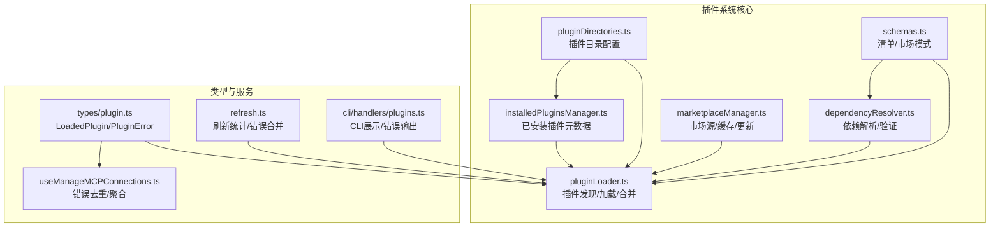
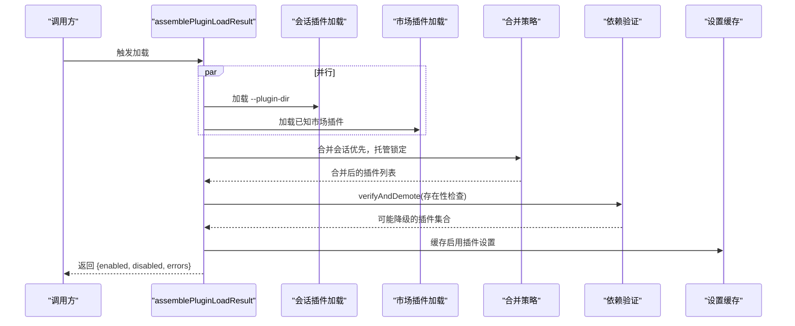
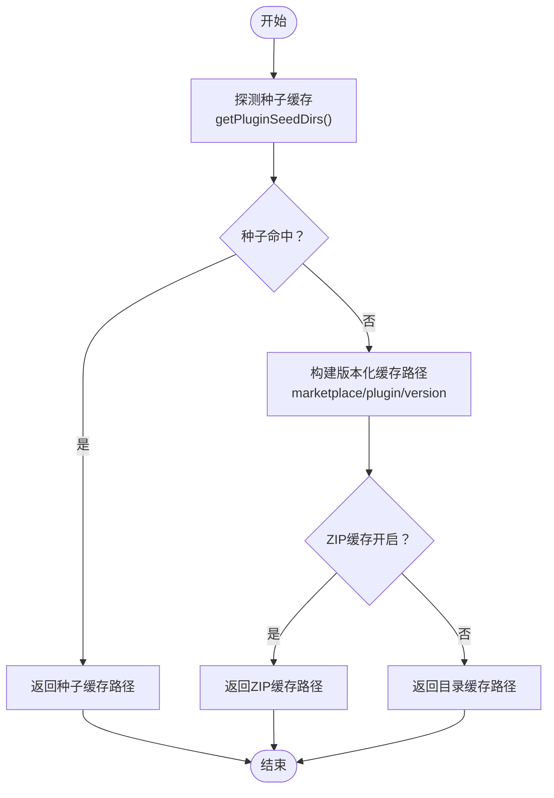
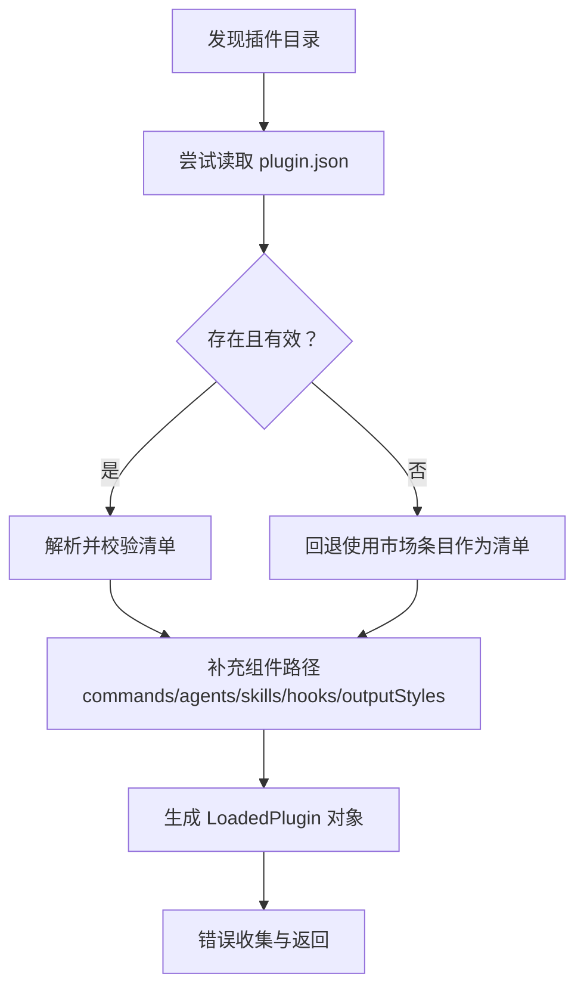
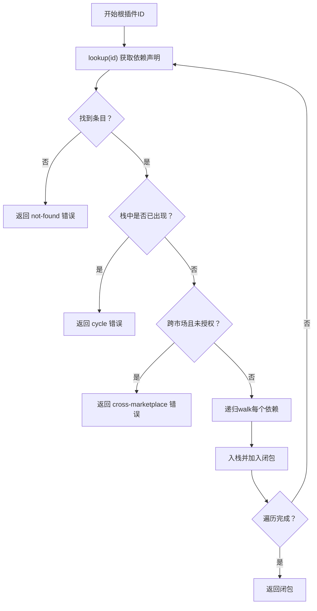
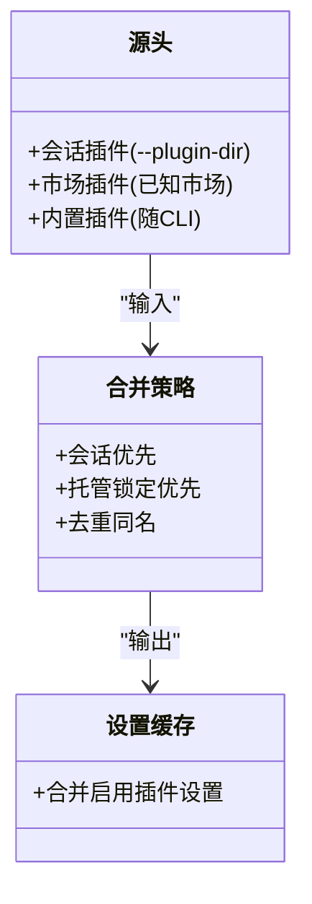
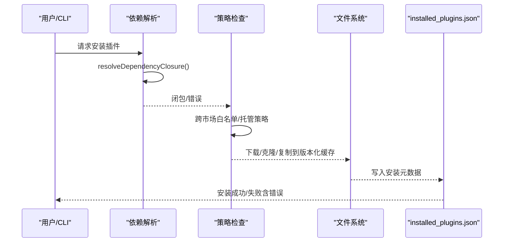
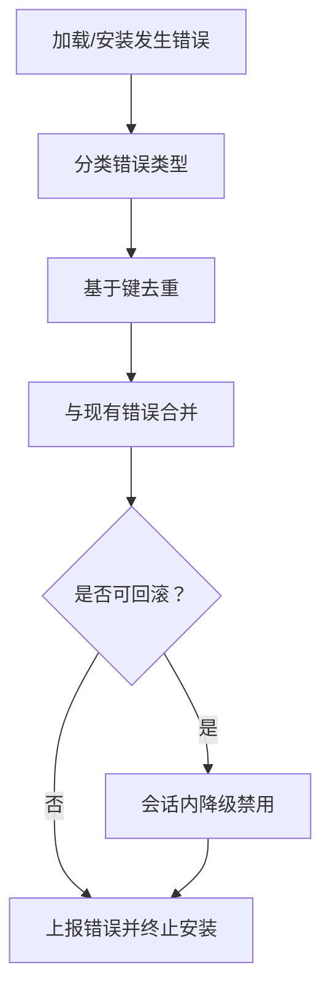
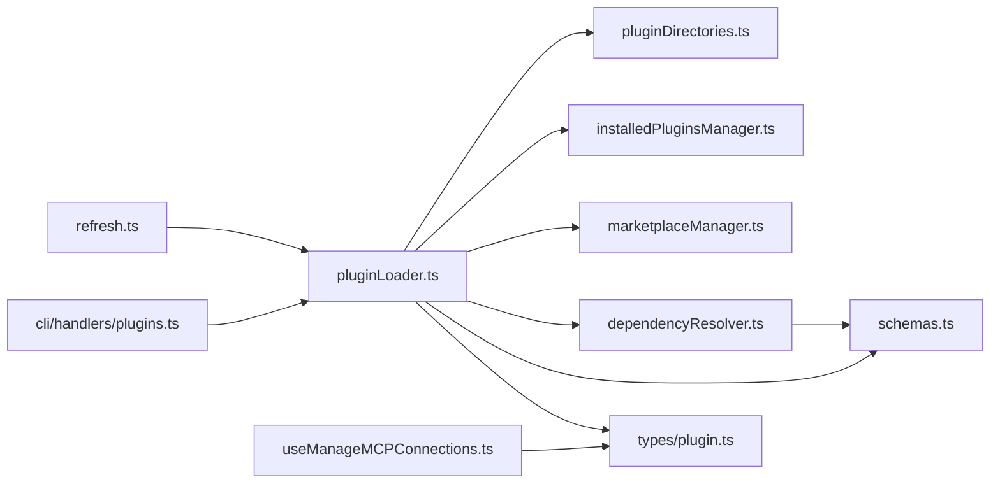

# 插件加载流程

<cite>
**本文档引用的文件**
- [src/utils/plugins/pluginLoader.ts](file://src/utils/plugins/pluginLoader.ts)
- [src/utils/plugins/dependencyResolver.ts](file://src/utils/plugins/dependencyResolver.ts)
- [src/utils/plugins/schemas.ts](file://src/utils/plugins/schemas.ts)
- [src/utils/plugins/installedPluginsManager.ts](file://src/utils/plugins/installedPluginsManager.ts)
- [src/utils/plugins/pluginDirectories.ts](file://src/utils/plugins/pluginDirectories.ts)
- [src/utils/plugins/marketplaceManager.ts](file://src/utils/plugins/marketplaceManager.ts)
- [src/types/plugin.ts](file://src/types/plugin.ts)
- [src/services/mcp/useManageMCPConnections.ts](file://src/services/mcp/useManageMCPConnections.ts)
- [src/utils/plugins/pluginFlagging.ts](file://src/utils/plugins/pluginFlagging.ts)
- [src/utils/plugins/refresh.ts](file://src/utils/plugins/refresh.ts)
- [src/cli/handlers/plugins.ts](file://src/cli/handlers/plugins.ts)
</cite>

## 目录
1. [简介](#简介)
2. [项目结构](#项目结构)
3. [核心组件](#核心组件)
4. [架构总览](#架构总览)
5. [详细组件分析](#详细组件分析)
6. [依赖关系分析](#依赖关系分析)
7. [性能考虑](#性能考虑)
8. [故障排除指南](#故障排除指南)
9. [结论](#结论)

## 简介
本文件面向Claude Code插件系统的“加载流程”，系统性阐述从插件发现、清单解析、依赖解析、安装缓存、到最终激活并注入运行时（命令、代理、钩子、MCP/LSP等）的完整生命周期。内容覆盖：
- 插件文件系统扫描机制与目录结构规范
- 插件清单（plugin.json）解析与校验
- 依赖解析算法（含跨市场限制、环依赖检测）
- 加载失败的错误收集与去重策略
- 性能优化技巧与调试方法

## 项目结构
与插件加载直接相关的模块主要位于src/utils/plugins目录下，并通过类型定义与服务层协同工作：
- 文件系统与目录：pluginDirectories.ts、installedPluginsManager.ts
- 清单与模式：schemas.ts、pluginLoader.ts
- 依赖解析：dependencyResolver.ts
- 市场管理：marketplaceManager.ts
- 错误与状态：types/plugin.ts、useManageMCPConnections.ts
- 调试与刷新：refresh.ts、cli/handlers/plugins.ts

图表来源
- [src/utils/plugins/pluginDirectories.ts:1-179](file://src/utils/plugins/pluginDirectories.ts#L1-L179)
- [src/utils/plugins/installedPluginsManager.ts:1-200](file://src/utils/plugins/installedPluginsManager.ts#L1-L200)
- [src/utils/plugins/schemas.ts:1-200](file://src/utils/plugins/schemas.ts#L1-L200)
- [src/utils/plugins/pluginLoader.ts:1-120](file://src/utils/plugins/pluginLoader.ts#L1-L120)
- [src/utils/plugins/dependencyResolver.ts:1-120](file://src/utils/plugins/dependencyResolver.ts#L1-L120)
- [src/utils/plugins/marketplaceManager.ts:1-120](file://src/utils/plugins/marketplaceManager.ts#L1-L120)
- [src/types/plugin.ts:1-120](file://src/types/plugin.ts#L1-L120)
- [src/services/mcp/useManageMCPConnections.ts:87-132](file://src/services/mcp/useManageMCPConnections.ts#L87-L132)
- [src/utils/plugins/refresh.ts:163-215](file://src/utils/plugins/refresh.ts#L163-L215)
- [src/cli/handlers/plugins.ts:255-428](file://src/cli/handlers/plugins.ts#L255-L428)

章节来源
- [src/utils/plugins/pluginLoader.ts:1-120](file://src/utils/plugins/pluginLoader.ts#L1-L120)
- [src/utils/plugins/pluginDirectories.ts:1-179](file://src/utils/plugins/pluginDirectories.ts#L1-L179)
- [src/utils/plugins/installedPluginsManager.ts:1-120](file://src/utils/plugins/installedPluginsManager.ts#L1-L120)
- [src/utils/plugins/schemas.ts:1-200](file://src/utils/plugins/schemas.ts#L1-L200)
- [src/utils/plugins/dependencyResolver.ts:1-120](file://src/utils/plugins/dependencyResolver.ts#L1-L120)
- [src/utils/plugins/marketplaceManager.ts:1-120](file://src/utils/plugins/marketplaceManager.ts#L1-L120)
- [src/types/plugin.ts:1-120](file://src/types/plugin.ts#L1-L120)
- [src/services/mcp/useManageMCPConnections.ts:87-132](file://src/services/mcp/useManageMCPConnections.ts#L87-L132)
- [src/utils/plugins/refresh.ts:163-215](file://src/utils/plugins/refresh.ts#L163-L215)
- [src/cli/handlers/plugins.ts:255-428](file://src/cli/handlers/plugins.ts#L255-L428)

## 核心组件
- 插件目录与缓存路径：统一管理插件根目录、种子目录、数据目录、版本化缓存路径等。
- 已安装插件元数据：维护installed_plugins.json，记录各作用域的安装路径、版本、时间戳等。
- 清单与模式：定义plugin.json、hooks.json、marketplace.json等结构及校验规则。
- 插件加载器：负责扫描、解析、合并、去重、错误收集与缓存设置。
- 依赖解析器：在安装期进行DFS闭包计算与环检测，在加载期进行存在性验证与降级。
- 市场管理器：管理已知市场源、缓存市场清单、拉取/更新市场数据。

章节来源
- [src/utils/plugins/pluginDirectories.ts:1-179](file://src/utils/plugins/pluginDirectories.ts#L1-L179)
- [src/utils/plugins/installedPluginsManager.ts:1-200](file://src/utils/plugins/installedPluginsManager.ts#L1-L200)
- [src/utils/plugins/schemas.ts:1-200](file://src/utils/plugins/schemas.ts#L1-L200)
- [src/utils/plugins/pluginLoader.ts:1-120](file://src/utils/plugins/pluginLoader.ts#L1-L120)
- [src/utils/plugins/dependencyResolver.ts:1-120](file://src/utils/plugins/dependencyResolver.ts#L1-L120)
- [src/utils/plugins/marketplaceManager.ts:1-120](file://src/utils/plugins/marketplaceManager.ts#L1-L120)

## 架构总览
插件加载的主流程由assemblePluginLoadResult协调，包含以下阶段：
1) 并行加载来源：
- 会话级插件（--plugin-dir）：直接从本地路径加载，标记为inline来源，优先级最高。
- 市场插件：从已知市场源加载，支持缓存命中与网络拉取。
- 内置插件：随CLI分发的插件。
2) 合并策略：会话插件覆盖同名市场插件；受托管设置锁定的插件不可被会话插件覆盖。
3) 依赖验证：对已启用插件执行存在性检查，不满足则在会话内降级禁用。
4) 设置缓存：将启用插件的设置合并到可同步访问的缓存中，供后续查询使用。

图表来源
- [src/utils/plugins/pluginLoader.ts:3155-3211](file://src/utils/plugins/pluginLoader.ts#L3155-L3211)
- [src/utils/plugins/dependencyResolver.ts:177-234](file://src/utils/plugins/dependencyResolver.ts#L177-L234)

章节来源
- [src/utils/plugins/pluginLoader.ts:3096-3211](file://src/utils/plugins/pluginLoader.ts#L3096-L3211)
- [src/utils/plugins/dependencyResolver.ts:177-234](file://src/utils/plugins/dependencyResolver.ts#L177-L234)

## 详细组件分析

### 插件文件系统扫描与目录结构
- 插件根目录与种子目录
  - 插件根目录可通过环境变量覆盖，默认位于用户配置目录下的plugins或cowork_plugins。
  - 支持多层只读种子目录（以平台路径分隔符拼接），按优先顺序查找市场与缓存。
- 版本化缓存路径
  - 使用“市场/插件/版本”三层结构，避免路径冲突与便于GC清理。
  - 支持ZIP缓存与目录缓存两种形式，按配置切换。
- 数据目录
  - 每个插件拥有持久化数据目录（CLAUDE_PLUGIN_DATA），在插件更新时不删除，仅在最后作用域卸载时清理。
- 种子缓存探测
  - 在未命中版本化缓存时，自动探测种子目录中的缓存，实现离线/加速启动。

图表来源
- [src/utils/plugins/pluginLoader.ts:195-287](file://src/utils/plugins/pluginLoader.ts#L195-L287)
- [src/utils/plugins/pluginDirectories.ts:85-90](file://src/utils/plugins/pluginDirectories.ts#L85-L90)

章节来源
- [src/utils/plugins/pluginDirectories.ts:1-179](file://src/utils/plugins/pluginDirectories.ts#L1-L179)
- [src/utils/plugins/pluginLoader.ts:126-287](file://src/utils/plugins/pluginLoader.ts#L126-L287)

### 插件清单（plugin.json）解析与校验
- 清单位置与回退
  - 优先读取plugin.json；若不存在，则使用市场条目作为清单（严格模式下仍需校验）。
- 结构与字段
  - 必填字段：name（小写短横线命名）、version（语义化版本）、description（可选）。
  - 可选字段：author、homepage、repository、license、keywords、dependencies（数组，支持裸名称继承声明插件所在市场）。
- 解析与验证
  - 先JSON解析，再Zod模式校验；失败时返回具体字段错误列表。
  - 对于历史兼容场景（legacy manifest），同样进行严格校验。
- 组件补充
  - 若清单存在，市场条目可补充commands/agents/skills/hooks/outputStyles等路径；两者冲突时在非严格模式下报错。

图表来源
- [src/utils/plugins/pluginLoader.ts:1023-1207](file://src/utils/plugins/pluginLoader.ts#L1023-L1207)
- [src/utils/plugins/pluginLoader.ts:2451-2917](file://src/utils/plugins/pluginLoader.ts#L2451-L2917)
- [src/utils/plugins/schemas.ts:274-320](file://src/utils/plugins/schemas.ts#L274-L320)

章节来源
- [src/utils/plugins/pluginLoader.ts:1023-1207](file://src/utils/plugins/pluginLoader.ts#L1023-L1207)
- [src/utils/plugins/pluginLoader.ts:2451-2917](file://src/utils/plugins/pluginLoader.ts#L2451-L2917)
- [src/utils/plugins/schemas.ts:274-320](file://src/utils/plugins/schemas.ts#L274-L320)

### 依赖解析算法
- 安装期：resolveDependencyClosure
  - 采用DFS遍历，计算“依赖闭包”，跳过已启用依赖以避免意外写入设置。
  - 默认禁止跨市场依赖，除非根市场允许白名单；对裸依赖（无@市场）在inline场景下按名称匹配。
  - 检测环依赖并返回链路。
- 加载期：verifyAndDemote
  - 固定点迭代，逐轮移除不满足依赖的启用插件，直到稳定。
  - 区分“未启用”和“未找到”的原因，生成对应错误类型。
- 反向依赖查找：findReverseDependents
  - 用于提示卸载/禁用风险（哪些插件会因此断开）。

图表来源
- [src/utils/plugins/dependencyResolver.ts:95-159](file://src/utils/plugins/dependencyResolver.ts#L95-L159)
- [src/utils/plugins/dependencyResolver.ts:177-234](file://src/utils/plugins/dependencyResolver.ts#L177-L234)
- [src/utils/plugins/dependencyResolver.ts:244-263](file://src/utils/plugins/dependencyResolver.ts#L244-L263)

章节来源
- [src/utils/plugins/dependencyResolver.ts:1-306](file://src/utils/plugins/dependencyResolver.ts#L1-L306)

### 插件来源与合并策略
- 来源优先级
  - 会话插件（--plugin-dir）优先，覆盖同名市场插件；托管锁定（policySettings）优先，阻止会话覆盖。
  - 内置插件（随CLI分发）最后参与合并。
- 合并逻辑
  - 去除会话插件与市场插件的同名冲突；托管锁定的插件会丢弃会话副本并上报错误。
- 设置缓存
  - 将启用插件的设置合并到可同步访问的缓存，供后续查询使用。

图表来源
- [src/utils/plugins/pluginLoader.ts:3009-3064](file://src/utils/plugins/pluginLoader.ts#L3009-L3064)
- [src/utils/plugins/pluginLoader.ts:3245-3274](file://src/utils/plugins/pluginLoader.ts#L3245-L3274)

章节来源
- [src/utils/plugins/pluginLoader.ts:3009-3064](file://src/utils/plugins/pluginLoader.ts#L3009-L3064)
- [src/utils/plugins/pluginLoader.ts:3245-3274](file://src/utils/plugins/pluginLoader.ts#L3245-L3274)

### 市场管理与安装缓存
- 已安装插件元数据
  - installed_plugins.json记录各作用域（managed/user/project/local）的安装路径、版本、时间戳、git提交SHA等。
  - 支持V1→V2迁移与遗留缓存清理。
- 市场源与缓存
  - known_marketplaces.json记录已知市场源；marketplaces/目录缓存市场清单与仓库克隆。
  - 支持自动更新策略（官方市场默认自动更新，部分例外）。
- 安装流程
  - 计算依赖闭包（含跨市场白名单与环检测）→ 策略检查（托管策略、跨市场限制）→ 写入installed_plugins.json → 清理/重建缓存 → 返回结果。

图表来源
- [src/utils/plugins/installedPluginsManager.ts:315-394](file://src/utils/plugins/installedPluginsManager.ts#L315-L394)
- [src/utils/plugins/marketplaceManager.ts:1-120](file://src/utils/plugins/marketplaceManager.ts#L1-L120)
- [src/utils/plugins/dependencyResolver.ts:95-159](file://src/utils/plugins/dependencyResolver.ts#L95-L159)

章节来源
- [src/utils/plugins/installedPluginsManager.ts:1-200](file://src/utils/plugins/installedPluginsManager.ts#L1-L200)
- [src/utils/plugins/marketplaceManager.ts:1-120](file://src/utils/plugins/marketplaceManager.ts#L1-L120)
- [src/utils/plugins/dependencyResolver.ts:95-159](file://src/utils/plugins/dependencyResolver.ts#L95-L159)

### 错误处理与回滚策略
- 错误类型
  - 路径不存在、Git认证失败/超时、网络错误、清单解析/校验失败、市场不存在/加载失败、MCP/LSP配置无效/启动失败、依赖不满足、插件缓存缺失等。
- 错误收集与去重
  - 使用唯一键（type:source:plugin）去重，避免重复显示。
  - 刷新时将新旧错误合并，保留来自其他子系统的LSP/插件组件错误。
- 回滚与降级
  - 加载期对不满足依赖的启用插件进行会话内降级（禁用），不修改设置文件。
  - 安装期若依赖解析失败（环/未找到/跨市场），直接返回错误，不写入设置。

图表来源
- [src/types/plugin.ts:101-284](file://src/types/plugin.ts#L101-L284)
- [src/services/mcp/useManageMCPConnections.ts:95-132](file://src/services/mcp/useManageMCPConnections.ts#L95-L132)
- [src/utils/plugins/refresh.ts:199-215](file://src/utils/plugins/refresh.ts#L199-L215)

章节来源
- [src/types/plugin.ts:101-284](file://src/types/plugin.ts#L101-L284)
- [src/services/mcp/useManageMCPConnections.ts:95-132](file://src/services/mcp/useManageMCPConnections.ts#L95-L132)
- [src/utils/plugins/refresh.ts:199-215](file://src/utils/plugins/refresh.ts#L199-L215)

### 调试与性能优化
- 性能优化
  - 并行加载：会话插件与市场插件并行加载，减少启动等待。
  - 缓存策略：版本化缓存、ZIP缓存、种子缓存、内存缓存（memoize）。
  - 启动专用缓存：loadAllPluginsCacheOnly仅读缓存，避免网络/克隆阻塞。
  - 路径探测：probeSeedCache/probeSeedCacheAnyVersion快速命中缓存。
- 调试方法
  - CLI展示：/plugins命令输出会话插件状态与错误。
  - 日志：大量logForDebugging与telemetry埋点，便于定位问题。
  - 刷新统计：refreshActivePlugins统计启用插件数、命令数、代理数、钩子数、MCP/LSP数与错误数。

章节来源
- [src/utils/plugins/pluginLoader.ts:3137-3146](file://src/utils/plugins/pluginLoader.ts#L3137-L3146)
- [src/utils/plugins/pluginLoader.ts:195-238](file://src/utils/plugins/pluginLoader.ts#L195-L238)
- [src/cli/handlers/plugins.ts:255-428](file://src/cli/handlers/plugins.ts#L255-L428)
- [src/utils/plugins/refresh.ts:163-191](file://src/utils/plugins/refresh.ts#L163-L191)

## 依赖关系分析
- 组件耦合
  - pluginLoader依赖pluginDirectories、installedPluginsManager、marketplaceManager、dependencyResolver、schemas等。
  - dependencyResolver与schemas紧密耦合（依赖声明、ID解析、模式校验）。
  - 类型定义（types/plugin.ts）贯穿错误类型、LoadedPlugin结构、插件组件枚举。
- 外部依赖
  - 文件系统操作（fs/promises）、git命令、HTTP请求（axios）。
- 循环依赖
  - 通过模块边界清晰划分，未见明显循环导入。

图表来源
- [src/utils/plugins/pluginLoader.ts:1-120](file://src/utils/plugins/pluginLoader.ts#L1-L120)
- [src/utils/plugins/dependencyResolver.ts:1-60](file://src/utils/plugins/dependencyResolver.ts#L1-L60)
- [src/utils/plugins/schemas.ts:1-60](file://src/utils/plugins/schemas.ts#L1-L60)
- [src/utils/plugins/pluginDirectories.ts:1-60](file://src/utils/plugins/pluginDirectories.ts#L1-L60)
- [src/utils/plugins/installedPluginsManager.ts:1-60](file://src/utils/plugins/installedPluginsManager.ts#L1-L60)
- [src/utils/plugins/marketplaceManager.ts:1-60](file://src/utils/plugins/marketplaceManager.ts#L1-L60)
- [src/types/plugin.ts:1-60](file://src/types/plugin.ts#L1-L60)
- [src/services/mcp/useManageMCPConnections.ts:87-132](file://src/services/mcp/useManageMCPConnections.ts#L87-L132)
- [src/utils/plugins/refresh.ts:163-215](file://src/utils/plugins/refresh.ts#L163-L215)
- [src/cli/handlers/plugins.ts:255-428](file://src/cli/handlers/plugins.ts#L255-L428)

章节来源
- [src/utils/plugins/pluginLoader.ts:1-120](file://src/utils/plugins/pluginLoader.ts#L1-L120)
- [src/utils/plugins/dependencyResolver.ts:1-120](file://src/utils/plugins/dependencyResolver.ts#L1-L120)
- [src/utils/plugins/schemas.ts:1-120](file://src/utils/plugins/schemas.ts#L1-L120)
- [src/utils/plugins/pluginDirectories.ts:1-120](file://src/utils/plugins/pluginDirectories.ts#L1-L120)
- [src/utils/plugins/installedPluginsManager.ts:1-120](file://src/utils/plugins/installedPluginsManager.ts#L1-L120)
- [src/utils/plugins/marketplaceManager.ts:1-120](file://src/utils/plugins/marketplaceManager.ts#L1-L120)
- [src/types/plugin.ts:1-120](file://src/types/plugin.ts#L1-L120)
- [src/services/mcp/useManageMCPConnections.ts:87-132](file://src/services/mcp/useManageMCPConnections.ts#L87-L132)
- [src/utils/plugins/refresh.ts:163-215](file://src/utils/plugins/refresh.ts#L163-L215)
- [src/cli/handlers/plugins.ts:255-428](file://src/cli/handlers/plugins.ts#L255-L428)

## 性能考虑
- 并行化
  - 会话插件与市场插件并行加载，显著降低冷启动时间。
- 缓存利用
  - 版本化缓存、ZIP缓存、种子缓存、memoize缓存，减少重复I/O与网络请求。
- 启动路径优化
  - loadAllPluginsCacheOnly在交互式启动中优先使用缓存，避免首次查询阻塞。
- 路径探测与清理
  - probeSeedCacheAnyVersion与遗留缓存清理，确保缓存命中率与磁盘空间健康。

## 故障排除指南
- 常见错误与定位
  - 清单解析/校验失败：查看具体字段错误列表，修正plugin.json。
  - 路径不存在：确认commands/agents/skills/hooks/outputStyles路径正确。
  - 依赖不满足：使用/doctor查看依赖链，启用缺失的依赖或调整版本。
  - 跨市场依赖：检查根市场的allowCrossMarketplaceDependenciesOn配置。
  - 插件缓存缺失：运行/plugins刷新缓存或手动安装。
- 错误去重与聚合
  - 使用错误键去重，避免重复告警；刷新时合并新旧错误，保留LSP/插件组件错误。
- CLI调试
  - 使用/plugins命令查看会话插件状态与错误详情；结合日志定位问题。

章节来源
- [src/types/plugin.ts:101-284](file://src/types/plugin.ts#L101-L284)
- [src/services/mcp/useManageMCPConnections.ts:95-132](file://src/services/mcp/useManageMCPConnections.ts#L95-L132)
- [src/utils/plugins/refresh.ts:199-215](file://src/utils/plugins/refresh.ts#L199-L215)
- [src/cli/handlers/plugins.ts:255-428](file://src/cli/handlers/plugins.ts#L255-L428)

## 结论
Claude Code的插件加载体系通过“目录/缓存/清单/依赖/市场/错误”六大维度形成闭环：以严格的模式校验与安全边界（跨市场限制、托管锁定）保障稳定性；以并行化与多级缓存提升性能；以完善的错误分类与去重机制辅助调试。理解上述流程有助于开发者高效开发、运维与排障。