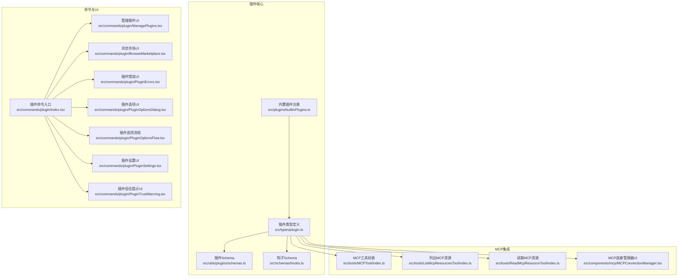
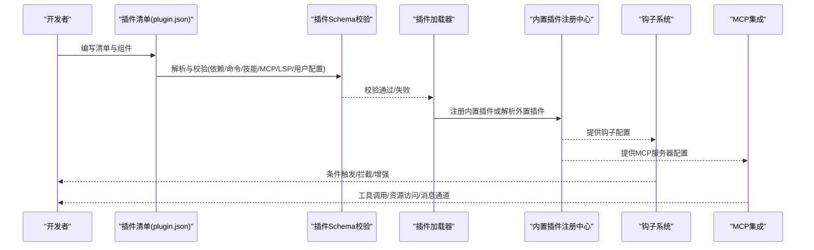
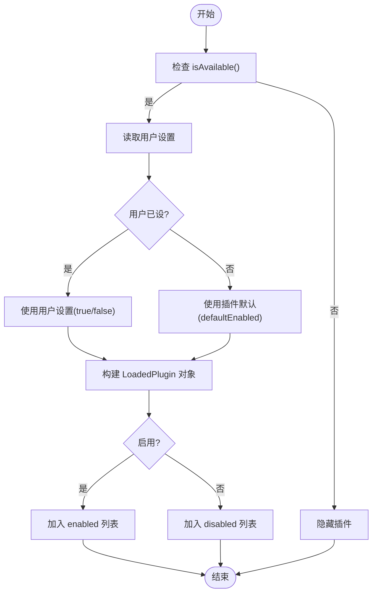
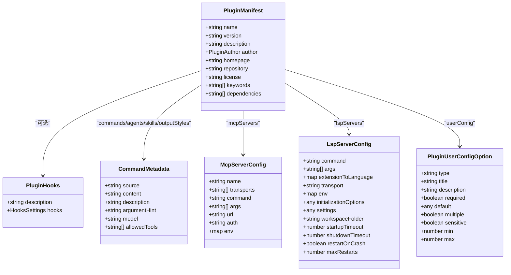
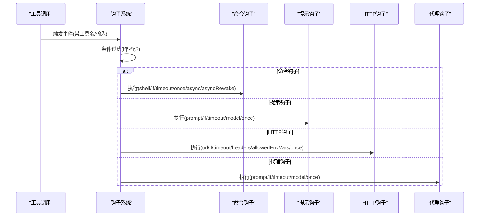
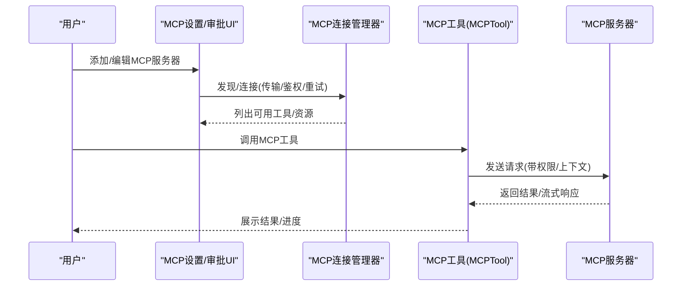
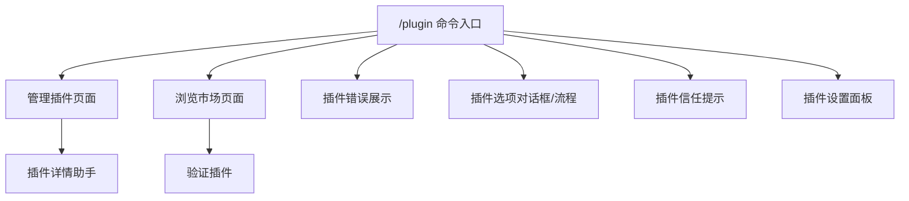
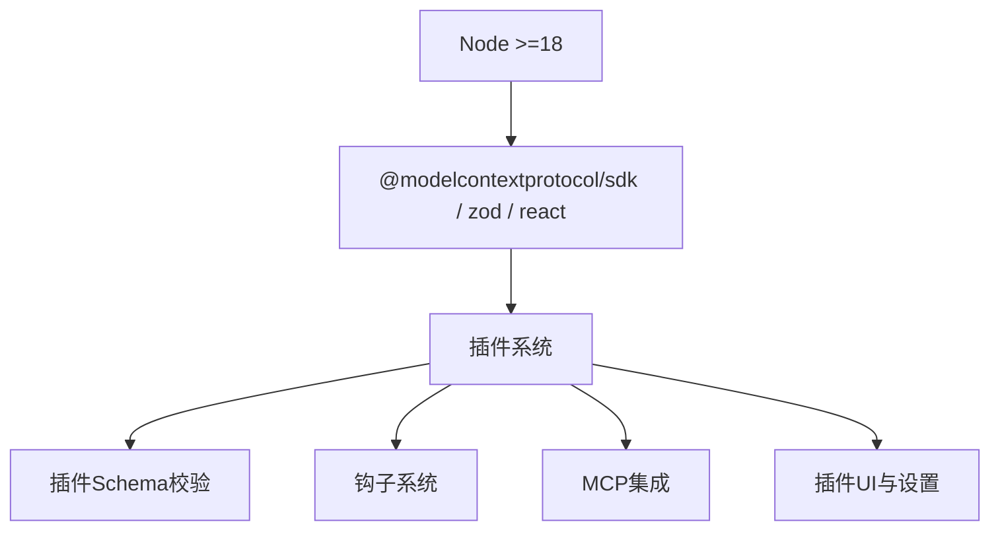

# 插件开发指南

<cite>
**本文引用的文件**
- [package.json](file://package.json)
- [README.md](file://README.md)
- [builtinPlugins.ts](file://src/plugins/builtinPlugins.ts)
- [plugin.ts 类型定义](file://src/types/plugin.ts)
- [插件清单与钩子Schema](file://src/utils/plugins/schemas.ts)
- [钩子Schema定义](file://src/schemas/hooks.ts)
- [插件命令入口](file://src/commands/plugin/index.tsx)
- [插件管理UI（示例）](file://src/commands/plugin/ManagePlugins.tsx)
- [插件市场UI（示例）](file://src/commands/plugin/BrowseMarketplace.tsx)
- [插件错误展示UI（示例）](file://src/commands/plugin/PluginErrors.tsx)
- [插件选项对话框（示例）](file://src/commands/plugin/PluginOptionsDialog.tsx)
- [插件选项流程（示例）](file://src/commands/plugin/PluginOptionsFlow.tsx)
- [插件设置UI（示例）](file://src/commands/plugin/PluginSettings.tsx)
- [插件信任提示UI（示例）](file://src/commands/plugin/PluginTrustWarning.tsx)
- [插件详情助手（示例）](file://src/commands/plugin/pluginDetailsHelpers.tsx)
- [MCP服务类型定义](file://src/services/mcp/types.ts)
- [MCP工具封装](file://src/tools/MCPTool/index.ts)
- [MCP资源列表工具](file://src/tools/ListMcpResourcesTool/index.ts)
- [MCP资源读取工具](file://src/tools/ReadMcpResourceTool/index.ts)
- [MCP连接管理器（UI）](file://src/components/mcp/MCPConnectionManager.tsx)
- [MCP服务器审批对话框](file://src/services/mcpServerApproval.tsx)
- [MCP服务器审批对话框（桌面导入）](file://src/components/mcp/MCPServerDesktopImportDialog.tsx)
- [MCP服务器对话框复制](file://src/components/mcp/MCPServerDialogCopy.tsx)
- [MCP服务器多选对话框](file://src/components/mcp/MCPServerMultiselectDialog.tsx)
- [MCP服务器设置对话框](file://src/components/mcp/MCPServerSettingsDialog.tsx)
- [MCP服务器设置（桌面导入）](file://src/components/mcp/MCPServerSettingsDialogDesktop.tsx)
- [MCP服务器设置（复制）](file://src/components/mcp/MCPServerSettingsDialogCopy.tsx)
- [MCP服务器设置（多选）](file://src/components/mcp/MCPServerMultiselectDialog.tsx)
- [MCP服务器设置（通用）](file://src/components/mcp/MCPServerSettingsDialog.tsx)
- [MCP服务器设置（通用）](file://src/components/mcp/MCPServerSettingsDialog.tsx)
- [MCP服务器设置（通用）](file://src/components/mcp/MCPServerSettingsDialog.tsx)
- [MCP服务器设置（通用）](file://src/components/mcp/MCPServerSettingsDialog.tsx)
- [MCP服务器设置（通用）](file://src/components/mcp/MCPServerSettingsDialog.tsx)
- [MCP服务器设置（通用）](file://src/components/mcp/MCPServerSettingsDialog.tsx)
- [MCP服务器设置（通用）](file://src/components/mcp/MCPServerSettingsDialog.tsx)
- [MCP服务器设置（通用）](file://src/components/mcp/MCPServerSettingsDialog.tsx)
- [MCP服务器设置（通用）](file://src/components/mcp/MCPServerSettingsDialog.tsx)
- [MCP服务器设置（通用）](file://src/components/mcp/MCPServerSettingsDialog.tsx)
- [MCP服务器设置（通用）](file://src/components/mcp/MCPServerSettingsDialog.tsx)
- [MCP服务器设置（通用）](file://src/components/mcp/MCPServerSettingsDialog.tsx)
- [MCP服务器设置（通用）](file://src/components/mcp/MCPServerSettingsDialog.tsx)
- [MCP服务器设置（通用）](file://src/components/mcp/MCPServerSettingsDialog.tsx)
- [MCP服务器设置（通用）](file://src/components/mcp/MCPServerSettingsDialog.tsx)
- [MCP服务器设置（通用）](file://src/components/mcp/MCPServerSettingsDialog.tsx)
- [MCP服务器设置（通用）](file://src/components/mcp/MCPServerSettingsDialog.tsx)
- [MCP服务器设置（通用）](file://src/components/mcp/MCPServerSettingsDialog.tsx)
- [MCP服务器设置（通用）](file://src/components/mcp/MCPServerSettingsDialog.tsx)
- [MCP服务器设置（通用）](file://src/components/mcp/MCPServerSettingsDialog.ts......)
</cite>

## 目录
1. [简介](#简介)
2. [项目结构](#项目结构)
3. [核心组件](#核心组件)
4. [架构总览](#架构总览)
5. [详细组件分析](#详细组件分析)
6. [依赖关系分析](#依赖关系分析)
7. [性能考量](#性能考量)
8. [故障排查指南](#故障排查指南)
9. [结论](#结论)
10. [附录](#附录)

## 简介
本指南面向希望在Claude Code环境中开发插件的开发者，系统讲解插件基础架构、清单schema、钩子系统API、MCP服务器集成、配置选项系统、打包发布流程，并提供从简单命令插件到复杂MCP服务器插件的完整开发示例与调试优化建议。文档中的所有技术细节均来自仓库源码与类型定义，确保可操作性与准确性。

## 项目结构
Claude Code的插件体系由“内置插件注册中心”“插件清单与校验Schema”“钩子系统”“MCP集成”“插件UI与设置”等模块组成。下图给出与插件开发直接相关的目录与职责概览：

**图表来源**
- [builtinPlugins.ts:1-160](file://src/plugins/builtinPlugins.ts#L1-L160)
- [plugin.ts 类型定义:1-364](file://src/types/plugin.ts#L1-L364)
- [插件清单与钩子Schema:1-800](file://src/utils/plugins/schemas.ts#L1-L800)
- [钩子Schema定义:1-223](file://src/schemas/hooks.ts#L1-L223)
- [插件命令入口:1-11](file://src/commands/plugin/index.tsx#L1-L11)
- [插件管理UI（示例）](file://src/commands/plugin/ManagePlugins.tsx)
- [插件市场UI（示例）](file://src/commands/plugin/BrowseMarketplace.tsx)
- [插件错误展示UI（示例）](file://src/commands/plugin/PluginErrors.tsx)
- [插件选项对话框（示例）](file://src/commands/plugin/PluginOptionsDialog.tsx)
- [插件选项流程（示例）](file://src/commands/plugin/PluginOptionsFlow.tsx)
- [插件设置UI（示例）](file://src/commands/plugin/PluginSettings.tsx)
- [插件信任提示UI（示例）](file://src/commands/plugin/PluginTrustWarning.tsx)
- [MCP工具封装](file://src/tools/MCPTool/index.ts)
- [MCP资源列表工具](file://src/tools/ListMcpResourcesTool/index.ts)
- [MCP资源读取工具](file://src/tools/ReadMcpResourceTool/index.ts)
- [MCP连接管理器（UI）](file://src/components/mcp/MCPConnectionManager.tsx)

**章节来源**
- [README.md:250-380](file://README.md#L250-L380)
- [package.json:1-76](file://package.json#L1-L76)

## 核心组件
- 内置插件注册中心：负责注册、启用/禁用、聚合技能/钩子/MCP服务器等能力，支持用户设置持久化与默认状态控制。
- 插件类型与清单Schema：统一定义LoadedPlugin、BuiltinPluginDefinition、PluginManifest、HooksSettings等类型，并对清单字段进行严格校验（含依赖、命令、技能、输出样式、MCP/LSP配置、用户配置等）。
- 钩子系统：通过Zod Schema定义命令、提示、HTTP、代理四种钩子类型，支持条件过滤、超时、一次性执行、异步唤醒等特性。
- MCP集成：提供MCP工具封装、资源列表/读取工具、连接管理器UI，支持多种传输方式与认证策略。
- 插件UI与设置：提供插件管理、市场浏览、错误展示、选项对话框、信任提示、设置面板等前端交互。

**章节来源**
- [builtinPlugins.ts:1-160](file://src/plugins/builtinPlugins.ts#L1-L160)
- [plugin.ts 类型定义:1-364](file://src/types/plugin.ts#L1-L364)
- [插件清单与钩子Schema:1-800](file://src/utils/plugins/schemas.ts#L1-L800)
- [钩子Schema定义:1-223](file://src/schemas/hooks.ts#L1-L223)

## 架构总览
下图展示插件从“清单与Schema校验”到“加载与运行”的整体流程，以及与MCP、钩子系统的交互：

**图表来源**
- [插件清单与钩子Schema:274-800](file://src/utils/plugins/schemas.ts#L274-L800)
- [plugin.ts 类型定义:18-70](file://src/types/plugin.ts#L18-L70)
- [builtinPlugins.ts:25-102](file://src/plugins/builtinPlugins.ts#L25-L102)

## 详细组件分析

### 组件A：内置插件注册中心
- 职责
  - 注册内置插件定义，按用户设置与默认值决定启用/禁用。
  - 将技能转换为命令对象，供命令系统使用。
  - 区分内置与市场插件标识，避免命名冲突。
- 关键点
  - 插件ID格式：name@builtin；内置插件无文件路径，仅用于UI与功能开关。
  - 可用性检查：isAvailable()返回false时隐藏插件。
  - 启用优先级：用户设置 > 插件默认 > true。
- 典型流程（启用内置插件）
  - 用户在/插件界面切换开关 → 设置持久化 → 重新加载插件 → 命令/钩子/MCP生效。

**图表来源**
- [builtinPlugins.ts:57-102](file://src/plugins/builtinPlugins.ts#L57-L102)

**章节来源**
- [builtinPlugins.ts:1-160](file://src/plugins/builtinPlugins.ts#L1-L160)

### 组件B：插件清单与Schema校验
- 清单元数据（metadata）
  - name/version/description/author/homepage/repository/license/keywords/dependencies。
  - 依赖以数组形式声明，bare name按声明插件所属市场解析。
- 钩子配置（hooks.json）
  - 支持外部文件或内联，补充标准位置之外的钩子。
- 命令与技能扩展
  - commands/agents/skills/outputStyles支持三种格式：单路径、路径数组、对象映射（含描述、参数提示、模型、允许工具等）。
- MCP/LSP配置
  - mcpServers支持相对路径、URL、内联对象、MCPB文件；lspServers支持严格字段校验（命令、args、扩展映射、传输、环境变量、初始化选项、工作区、超时、重启策略等）。
- 用户配置（userConfig）
  - 支持string/number/boolean/directory/file类型，必填、默认值、敏感信息、数值范围、多值等；敏感值存储于安全存储而非settings.json。
- 市场与安全
  - marketplace名称校验：禁止官方同名伪装、非ASCII字符、保留字等；官方名称仅限特定GitHub组织使用。
  - 官方名称来源验证：仅允许特定GitHub组织或URL来源。
- 错误类型
  - 提供丰富的插件错误类型（路径不存在、网络错误、清单解析/校验失败、插件未找到、MCP/LSP配置无效、请求超时/失败、依赖不满足、缓存缺失等），便于UI友好展示与定位问题。

**图表来源**
- [插件清单与钩子Schema:274-800](file://src/utils/plugins/schemas.ts#L274-L800)
- [MCP服务类型定义](file://src/services/mcp/types.ts)

**章节来源**
- [插件清单与钩子Schema:1-800](file://src/utils/plugins/schemas.ts#L1-L800)
- [plugin.ts 类型定义:18-70](file://src/types/plugin.ts#L18-L70)

### 组件C：钩子系统API
- 钩子类型
  - 命令钩子：执行shell命令，支持条件过滤、超时、一次性、异步、异步唤醒。
  - 提示钩子：以LLM评估自定义提示，支持条件过滤、超时、一次性、指定模型。
  - HTTP钩子：POST JSON到远端，支持条件过滤、超时、头信息与受控环境变量插值。
  - 代理钩子：以小模型执行验证任务，支持条件过滤、超时、一次性、指定模型。
- 条件过滤
  - 使用权限规则语法（如“Bash(git *)”）在执行前筛选匹配的工具调用，避免不必要的启动。
- Schema设计
  - 通过Zod Schema实现强类型校验，避免设置文件损坏导致的运行时异常。
- 生命周期
  - 钩子在工具调用前后按事件触发，支持once自动移除与async/asyncRewake的并发控制。

**图表来源**
- [钩子Schema定义:176-223](file://src/schemas/hooks.ts#L176-L223)

**章节来源**
- [钩子Schema定义:1-223](file://src/schemas/hooks.ts#L1-L223)

### 组件D：MCP服务器集成
- 工具封装
  - MCPTool：统一封装MCP工具调用，屏蔽底层协议细节。
  - ListMcpResourcesTool/ReadMcpResourceTool：列举与读取MCP资源，支持权限透传。
- 连接管理
  - 支持stdio、sse、http、ws、sdk等多种传输方式；提供重连退避、鉴权（OAuth/XAA/API Key）、工具注册与动态schema。
- UI与设置
  - MCPConnectionManager：集中管理MCP服务器发现、连接、生命周期与权限。
  - 多种设置对话框：通用设置、桌面导入、复制、多选等，满足不同场景。
- 审批与安全
  - MCP服务器审批对话框与策略，防止未授权服务器接入。

**图表来源**
- [MCP工具封装](file://src/tools/MCPTool/index.ts)
- [MCP资源列表工具](file://src/tools/ListMcpResourcesTool/index.ts)
- [MCP资源读取工具](file://src/tools/ReadMcpResourceTool/index.ts)
- [MCP连接管理器（UI）](file://src/components/mcp/MCPConnectionManager.tsx)
- [MCP服务器审批对话框](file://src/services/mcpServerApproval.tsx)
- [MCP服务器设置（通用）](file://src/components/mcp/MCPServerSettingsDialog.tsx)

**章节来源**
- [MCP工具封装](file://src/tools/MCPTool/index.ts)
- [MCP资源列表工具](file://src/tools/ListMcpResourcesTool/index.ts)
- [MCP资源读取工具](file://src/tools/ReadMcpResourceTool/index.ts)
- [MCP连接管理器（UI）](file://src/components/mcp/MCPConnectionManager.tsx)

### 组件E：插件UI与设置
- 插件命令入口：/plugin命令，立即加载插件管理界面。
- 管理与市场：管理插件、浏览市场、添加市场、发现插件、验证插件、插件详情助手等。
- 错误展示：统一的插件错误UI，根据错误类型生成可读提示。
- 选项与信任：插件选项对话框与流程，支持敏感信息输入与安全存储；信任提示保障用户知情同意。
- 设置面板：插件设置UI，集中管理插件配置与行为。

**图表来源**
- [插件命令入口:1-11](file://src/commands/plugin/index.tsx#L1-L11)
- [插件管理UI（示例）](file://src/commands/plugin/ManagePlugins.tsx)
- [插件市场UI（示例）](file://src/commands/plugin/BrowseMarketplace.tsx)
- [插件错误展示UI（示例）](file://src/commands/plugin/PluginErrors.tsx)
- [插件选项对话框（示例）](file://src/commands/plugin/PluginOptionsDialog.tsx)
- [插件选项流程（示例）](file://src/commands/plugin/PluginOptionsFlow.tsx)
- [插件设置UI（示例）](file://src/commands/plugin/PluginSettings.tsx)
- [插件信任提示UI（示例）](file://src/commands/plugin/PluginTrustWarning.tsx)
- [插件详情助手（示例）](file://src/commands/plugin/pluginDetailsHelpers.tsx)

**章节来源**
- [插件命令入口:1-11](file://src/commands/plugin/index.tsx#L1-L11)

## 依赖关系分析
- 运行时依赖
  - Node版本要求：>=18。
  - 关键依赖：@modelcontextprotocol/sdk（MCP协议）、zod（Schema校验）、react等。
- 插件生态
  - 插件清单与Schema校验依赖zod与MCP类型定义；钩子系统依赖权限规则与Shell Provider；MCP集成依赖传输层与鉴权策略；UI依赖React组件库与状态管理。

**图表来源**
- [package.json:13-74](file://package.json#L13-L74)

**章节来源**
- [package.json:1-76](file://package.json#L1-L76)

## 性能考量
- 并发与阻塞
  - 钩子支持异步执行与异步唤醒，避免阻塞主流程；命令钩子的asyncRewake可在后台执行并在特定退出码时唤醒模型。
- 资源与传输
  - MCP支持多种传输方式，选择合适的传输（如stdio、ws、http）以平衡延迟与稳定性；合理设置超时与重试退避。
- 上下文与压缩
  - 插件不应引入过多冗余上下文；结合Claude Code的上下文压缩机制，减少token占用。
- UI渲染
  - 插件UI应避免频繁重渲染，使用稳定的数据结构与必要的memo化策略。

[本节为通用指导，无需具体文件分析]

## 故障排查指南
- 常见错误类型与定位
  - 路径不存在、Git认证失败、网络错误、清单解析/校验失败、插件未找到、MCP/LSP配置无效、请求超时/失败、依赖不满足、缓存缺失等。
- 排查步骤
  - 查看插件错误UI中的具体错误类型与上下文信息。
  - 检查清单字段是否符合Schema；确认依赖插件已启用且存在。
  - 验证MCP/LSP配置（命令、传输、鉴权、超时、重启策略）是否正确。
  - 检查网络与代理设置，必要时增加超时或改用本地传输。
- 建议
  - 使用最小化清单与配置先行验证，再逐步增加复杂度。
  - 对敏感配置使用userConfig并存储于安全存储，避免明文泄露。

**章节来源**
- [plugin.ts 类型定义:101-284](file://src/types/plugin.ts#L101-L284)

## 结论
Claude Code的插件体系以强类型Schema与严格的校验为核心，结合灵活的钩子系统与完善的MCP集成，为开发者提供了从简单命令到复杂服务器的全栈扩展能力。遵循本文档的清单schema、钩子API、MCP集成与UI设计原则，可高效构建高质量插件，并通过统一的错误类型与UI提升用户体验与可维护性。

## 附录

### A. 插件开发示例（从简到繁）

- 示例一：简单命令插件
  - 目标：新增一个可被用户直接调用的命令。
  - 步骤：
    1) 在插件清单中声明commands/skills/outputStyles等扩展路径或对象映射。
    2) 编写命令/技能内容（Markdown），定义描述、参数提示、允许工具、默认模型等。
    3) 如需钩子，在hooks.json中声明命令钩子或提示钩子，设置条件过滤与超时。
    4) 在插件UI中验证命令可见性与行为。
  - 参考路径
    - [插件清单与钩子Schema:429-524](file://src/utils/plugins/schemas.ts#L429-L524)
    - [钩子Schema定义:176-223](file://src/schemas/hooks.ts#L176-L223)

- 示例二：内置插件（可启用/禁用）
  - 目标：将插件作为内置能力，随应用启动加载。
  - 步骤：
    1) 在内置插件注册中心注册插件定义，设置默认启用状态与可用性。
    2) 将技能转换为命令对象，注入命令系统。
    3) 在/插件界面显示并支持用户切换。
  - 参考路径
    - [builtinPlugins.ts:25-121](file://src/plugins/builtinPlugins.ts#L25-L121)

- 示例三：MCP服务器插件
  - 目标：提供MCP服务器，暴露工具与资源，供MCPTool调用。
  - 步骤：
    1) 在插件清单中声明mcpServers，支持内联、相对路径或URL/MCPB文件。
    2) 在MCP设置UI中添加/编辑服务器，配置传输、鉴权、环境变量。
    3) 使用MCPTool调用工具，或通过ListMcpResourcesTool/ReadMcpResourceTool访问资源。
    4) 如需消息通道（如Telegram/Slack），在channels中声明并提供userConfig。
  - 参考路径
    - [插件清单与钩子Schema:543-703](file://src/utils/plugins/schemas.ts#L543-L703)
    - [MCP工具封装](file://src/tools/MCPTool/index.ts)
    - [MCP资源列表工具](file://src/tools/ListMcpResourcesTool/index.ts)
    - [MCP资源读取工具](file://src/tools/ReadMcpResourceTool/index.ts)
    - [MCP连接管理器（UI）](file://src/components/mcp/MCPConnectionManager.tsx)

### B. 插件打包与发布
- 版本管理
  - 使用语义化版本（semver）管理插件版本；在清单中声明version。
- 依赖声明
  - 在清单dependencies中声明必需的其他插件；bare name按声明插件所属市场解析。
- 兼容性测试
  - 在不同Node版本与操作系统上验证插件加载、钩子执行、MCP通信与UI交互。
- 安全与合规
  - 避免使用非ASCII marketplace名称或官方同名伪装；敏感配置使用userConfig并存储于安全存储。
- 市场发布
  - 通过marketplace配置与验证流程，确保名称与来源合法；遵循自动更新策略与企业策略限制。

**章节来源**
- [插件清单与钩子Schema:19-157](file://src/utils/plugins/schemas.ts#L19-L157)
- [package.json:60-74](file://package.json#L60-L74)

### C. 调试技巧与最佳实践
- 调试技巧
  - 使用插件错误UI快速定位问题；开启详细日志与超时设置；在MCP设置中启用本地传输以降低网络干扰。
- 最佳实践
  - 清单字段尽量简洁明确；钩子条件过滤避免不必要的执行；MCP配置分离敏感信息与通用信息；UI交互保持一致与可预期。
- 性能优化
  - 合理使用异步钩子与MCP传输；减少不必要的上下文与资源读取；在UI中避免频繁重渲染。

[本节为通用指导，无需具体文件分析]