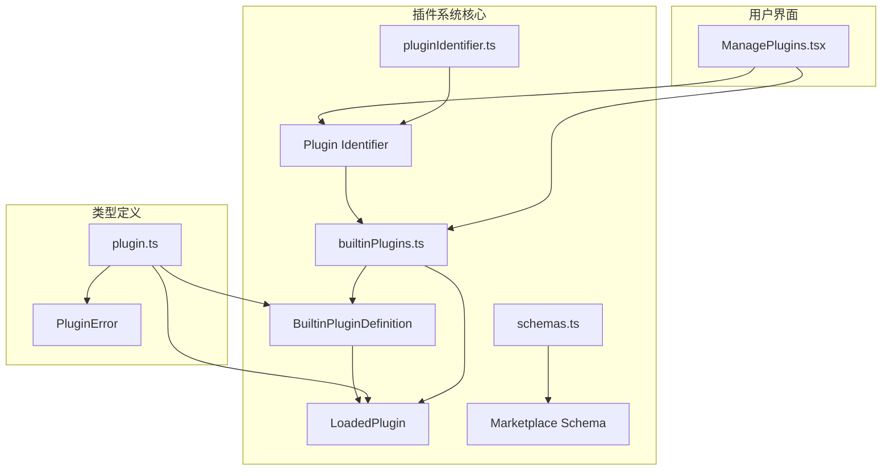
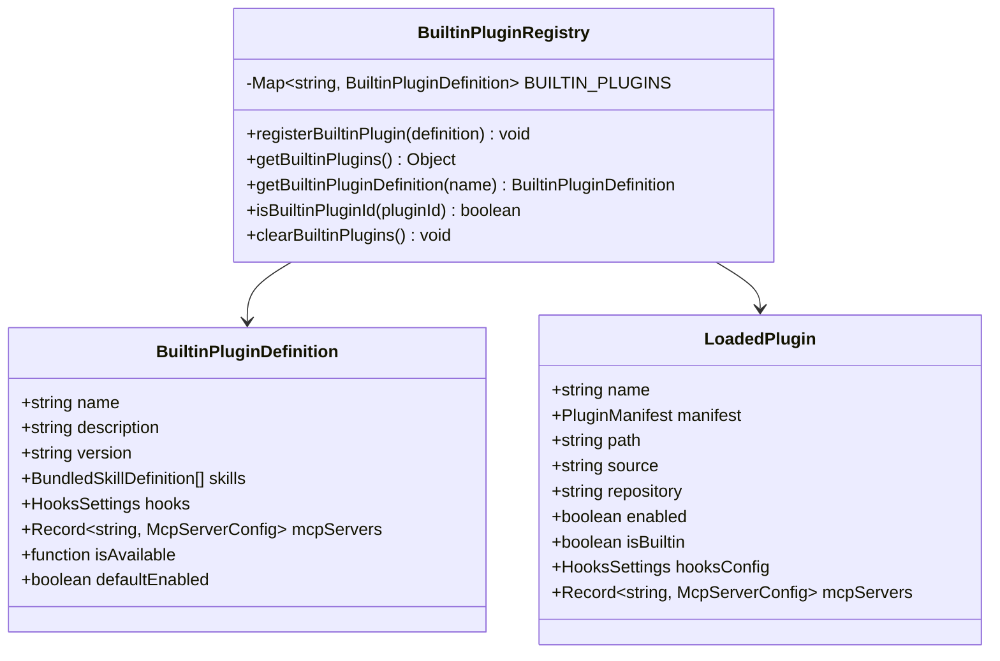
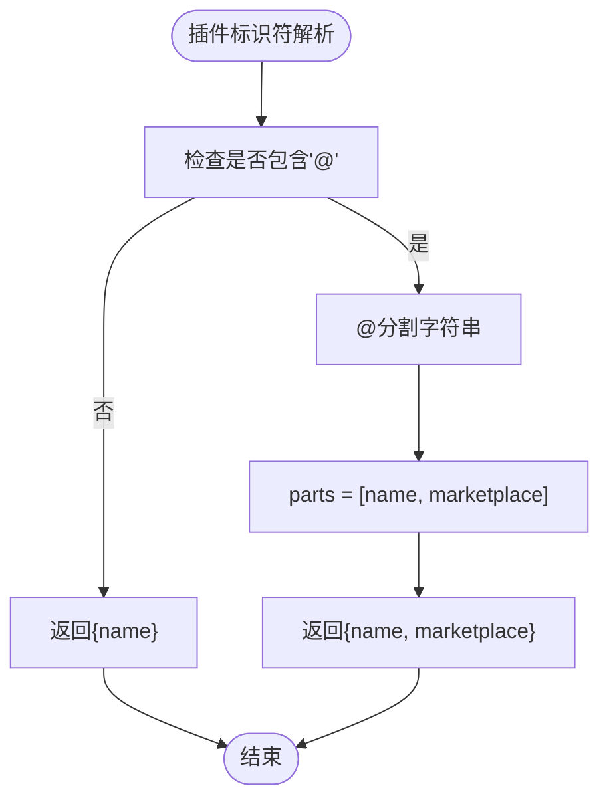
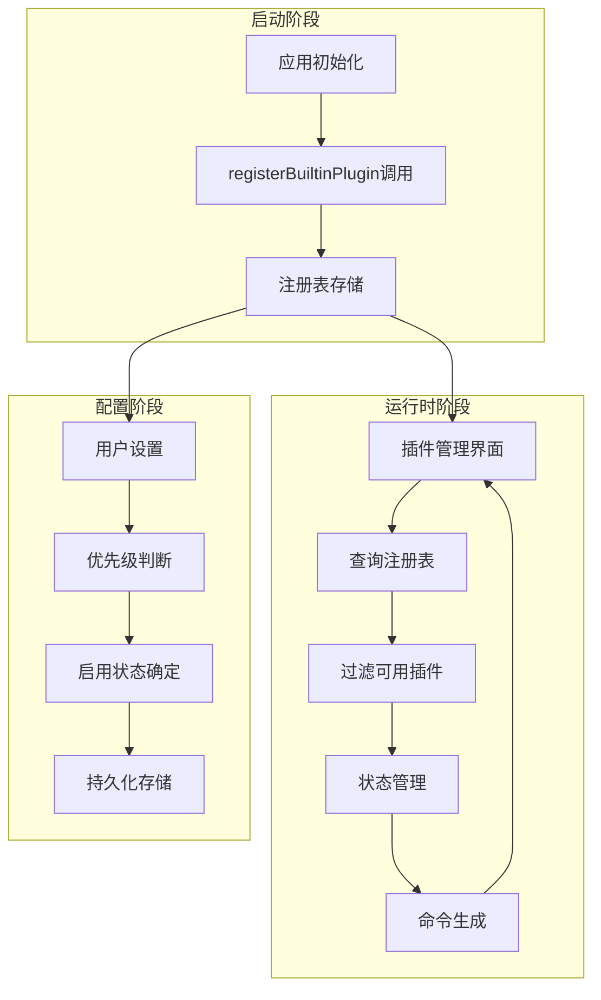
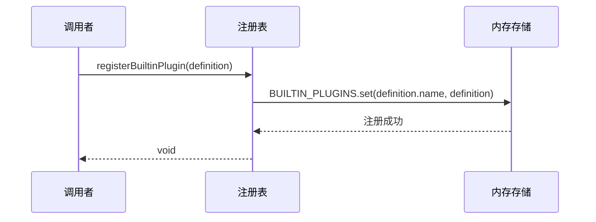
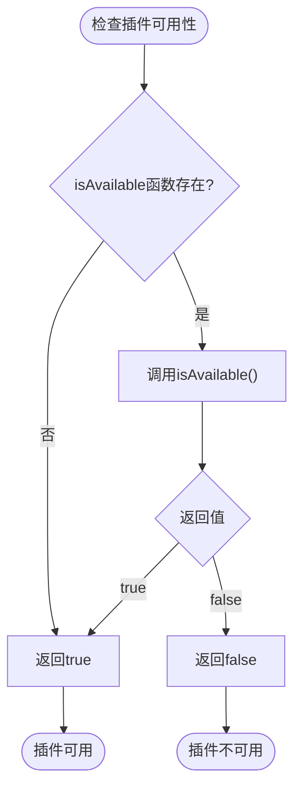
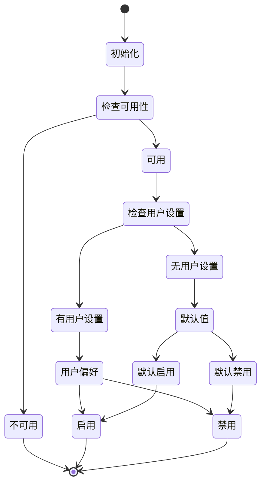
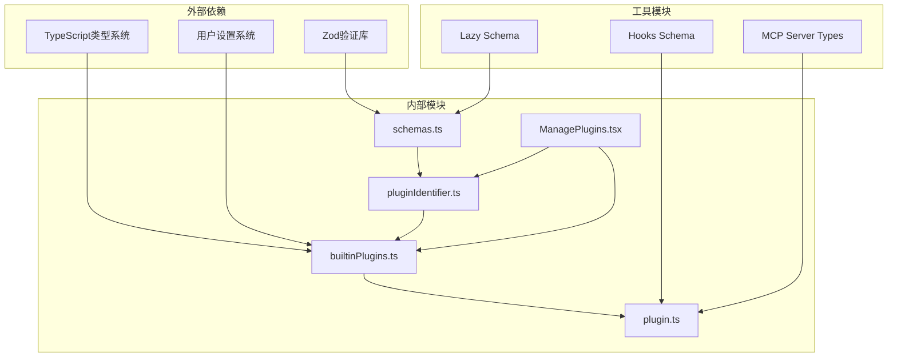

# 插件注册机制

<cite>
**本文档引用的文件**
- [builtinPlugins.ts](file://src/plugins/builtinPlugins.ts)
- [plugin.ts](file://src/types/plugin.ts)
- [pluginIdentifier.ts](file://src/utils/plugins/pluginIdentifier.ts)
- [schemas.ts](file://src/utils/plugins/schemas.ts)
- [ManagePlugins.tsx](file://src/commands/plugin/ManagePlugins.tsx)
</cite>

## 目录
1. [简介](#简介)
2. [项目结构](#项目结构)
3. [核心组件](#核心组件)
4. [架构概览](#架构概览)
5. [详细组件分析](#详细组件分析)
6. [依赖关系分析](#依赖关系分析)
7. [性能考虑](#性能考虑)
8. [故障排除指南](#故障排除指南)
9. [结论](#结论)

## 简介

Claude Code 的插件注册机制是一个核心功能模块，负责管理内置插件的注册、配置和生命周期。该机制支持两种主要类型的插件：内置插件（@builtin）和市场插件（@marketplace），并提供了完整的插件可用性检查、状态管理和用户界面集成。

插件注册机制的关键特性包括：
- 统一的插件定义接口
- 命名空间隔离的插件标识符
- 可配置的启用/禁用状态
- 运行时可用性检查
- 用户设置持久化

## 项目结构

插件注册机制在项目中的组织结构如下：



**图表来源**
- [builtinPlugins.ts:1-160](file://src/plugins/builtinPlugins.ts#L1-L160)
- [plugin.ts:1-364](file://src/types/plugin.ts#L1-L364)
- [pluginIdentifier.ts:1-124](file://src/utils/plugins/pluginIdentifier.ts#L1-L124)

**章节来源**
- [builtinPlugins.ts:1-160](file://src/plugins/builtinPlugins.ts#L1-L160)
- [plugin.ts:1-364](file://src/types/plugin.ts#L1-L364)

## 核心组件

### 插件注册表

插件注册表是整个插件系统的核心数据结构，使用 Map 来存储所有已注册的内置插件定义。



**图表来源**
- [builtinPlugins.ts:21-32](file://src/plugins/builtinPlugins.ts#L21-L32)
- [plugin.ts:18-35](file://src/types/plugin.ts#L18-L35)
- [plugin.ts:48-70](file://src/types/plugin.ts#L48-L70)

### 插件标识符系统

插件标识符采用统一的命名约定，确保插件之间的唯一性和可识别性。



**图表来源**
- [pluginIdentifier.ts:51-57](file://src/utils/plugins/pluginIdentifier.ts#L51-L57)

**章节来源**
- [builtinPlugins.ts:21-32](file://src/plugins/builtinPlugins.ts#L21-L32)
- [plugin.ts:18-35](file://src/types/plugin.ts#L18-L35)
- [pluginIdentifier.ts:51-57](file://src/utils/plugins/pluginIdentifier.ts#L51-L57)

## 架构概览

插件注册机制的整体架构设计体现了清晰的关注点分离和模块化原则：



**图表来源**
- [builtinPlugins.ts:57-102](file://src/plugins/builtinPlugins.ts#L57-L102)
- [builtinPlugins.ts:108-121](file://src/plugins/builtinPlugins.ts#L108-L121)

## 详细组件分析

### registerBuiltinPlugin 函数

`registerBuiltinPlugin` 是插件注册的核心入口函数，负责将插件定义注册到全局注册表中。



**图表来源**
- [builtinPlugins.ts:28-32](file://src/plugins/builtinPlugins.ts#L28-L32)

#### 函数工作原理

1. **参数验证**：接收 `BuiltinPluginDefinition` 类型的插件定义
2. **键值映射**：使用插件名称作为 Map 的键
3. **存储操作**：将完整定义存储到内存注册表中
4. **返回结果**：无返回值（void）

#### 最佳实践

- 在应用启动时调用此函数
- 确保插件名称的唯一性
- 提供完整的插件元数据

**章节来源**
- [builtinPlugins.ts:28-32](file://src/plugins/builtinPlugins.ts#L28-L32)

### 插件定义结构详解

`BuiltinPluginDefinition` 接口定义了内置插件的所有必要属性：

| 字段名 | 类型 | 必需 | 描述 |
|--------|------|------|------|
| name | string | 是 | 插件名称，用于 `{name}@builtin` 标识符 |
| description | string | 是 | 在插件界面显示的描述信息 |
| version | string | 否 | 插件版本号 |
| skills | BundledSkillDefinition[] | 否 | 插件提供的技能列表 |
| hooks | HooksSettings | 否 | 插件提供的钩子配置 |
| mcpServers | Record<string, McpServerConfig> | 否 | 插件提供的 MCP 服务器配置 |
| isAvailable | () => boolean | 否 | 插件可用性检查函数 |
| defaultEnabled | boolean | 否 | 默认启用状态，默认为 true |

#### 字段详细说明

**name 字段**
- 作为插件的唯一标识符
- 用于构建完整的插件 ID：`{name}@builtin`

**description 字段**
- 用户界面中显示的插件描述
- 应简洁明了地说明插件的功能

**version 字段**
- 遵循语义化版本控制
- 用于插件更新和兼容性检查

**skills 字段**
- 定义插件提供的具体技能
- 每个技能包含执行逻辑和用户交互定义

**hooks 字段**
- 插件钩子配置，定义事件响应行为
- 支持多种生命周期事件

**mcpServers 字段**
- MCP（Model Context Protocol）服务器配置
- 允许插件提供外部服务集成

**isAvailable 字段**
- 可选的可用性检查函数
- 用于基于系统环境或条件动态决定插件可用性

**defaultEnabled 字段**
- 插件的默认启用状态
- 当用户未明确设置时生效

**章节来源**
- [plugin.ts:18-35](file://src/types/plugin.ts#L18-L35)

### 插件可用性检查机制

`isAvailable()` 函数提供了灵活的插件可用性检查能力：



**图表来源**
- [builtinPlugins.ts:66-68](file://src/plugins/builtinPlugins.ts#L66-L68)

#### 应用场景

- **系统要求检查**：验证操作系统、硬件或软件依赖
- **权限验证**：检查必要的系统权限
- **网络状态**：验证网络连接状态
- **资源可用性**：检查磁盘空间、内存等系统资源

**章节来源**
- [builtinPlugins.ts:66-68](file://src/plugins/builtinPlugins.ts#L66-L68)

### 插件标识符格式规范

插件标识符采用统一的格式规范，确保插件之间的唯一性和可识别性：

#### 内置插件标识符
- **格式**：`{name}@builtin`
- **用途**：标识内置插件
- **示例**：`code-format@builtin`

#### 市场插件标识符
- **格式**：`{name}@{marketplace}`
- **用途**：标识来自特定市场的插件
- **示例**：`frontend-design@claude-plugins-official`

#### 解析规则

```mermaid
flowchart LR
Input["输入: pluginId"] --> Check["@检查"]
Check --> |存在| Split["split('@')"]
Check --> |不存在| ReturnName["返回{name: pluginId}"]
Split --> First["@位置"]
First --> |第一个@| Parse["parts[0]=name, parts[1]=marketplace"]
Parse --> ReturnParsed["返回{name, marketplace}"]
ReturnName --> Output["输出"]
ReturnParsed --> Output
```

**图表来源**
- [pluginIdentifier.ts:51-57](file://src/utils/plugins/pluginIdentifier.ts#L51-L57)

**章节来源**
- [builtinPlugins.ts:12-13](file://src/plugins/builtinPlugins.ts#L12-L13)
- [pluginIdentifier.ts:51-57](file://src/utils/plugins/pluginIdentifier.ts#L51-L57)

### 插件状态管理

插件状态管理实现了用户偏好、默认设置和运行时可用性的综合决策：



**图表来源**
- [builtinPlugins.ts:72-77](file://src/plugins/builtinPlugins.ts#L72-L77)

#### 状态决策流程

1. **可用性检查**：首先检查 `isAvailable()` 函数
2. **用户设置优先**：读取用户在设置中的偏好
3. **默认值回退**：使用插件定义的默认启用状态
4. **状态分类**：将插件分为启用和禁用两组

**章节来源**
- [builtinPlugins.ts:72-77](file://src/plugins/builtinPlugins.ts#L72-L77)

## 依赖关系分析

插件注册机制的依赖关系体现了清晰的层次结构：



**图表来源**
- [builtinPlugins.ts:16-19](file://src/plugins/builtinPlugins.ts#L16-L19)
- [plugin.ts:1-9](file://src/types/plugin.ts#L1-L9)
- [schemas.ts:1-5](file://src/utils/plugins/schemas.ts#L1-L5)

### 关键依赖关系

1. **类型安全**：通过 TypeScript 和 Zod 确保数据完整性
2. **设置集成**：与用户设置系统深度集成
3. **UI绑定**：与插件管理界面无缝对接
4. **验证机制**：内置的 schema 验证确保配置正确性

**章节来源**
- [builtinPlugins.ts:16-19](file://src/plugins/builtinPlugins.ts#L16-L19)
- [plugin.ts:1-9](file://src/types/plugin.ts#L1-L9)

## 性能考虑

插件注册机制在设计时充分考虑了性能优化：

### 内存效率
- 使用 Map 数据结构提供 O(1) 的查找性能
- 内存中缓存所有插件定义，避免重复加载
- 按需创建 LoadedPlugin 对象，减少不必要的对象创建

### 计算优化
- 插件状态计算仅在需要时进行
- 缓存用户设置结果，避免重复读取
- 批量处理插件查询请求

### 并发安全
- 注册表操作是线程安全的
- 并发访问不会导致数据不一致
- 原子性操作保证数据完整性

## 故障排除指南

### 常见问题及解决方案

#### 插件未显示在界面中
**可能原因**：
- 插件的 `isAvailable()` 函数返回 false
- 插件 ID 格式不正确
- 插件定义缺失必要的字段

**解决步骤**：
1. 检查插件的 `isAvailable()` 实现
2. 验证插件 ID 格式：`{name}@builtin`
3. 确认插件定义包含必需字段

#### 插件状态异常
**可能原因**：
- 用户设置覆盖了默认状态
- 插件注册顺序问题
- 设置文件损坏

**解决步骤**：
1. 检查用户设置中的插件状态
2. 确认插件在正确的时机注册
3. 重置相关设置或重新安装插件

#### 性能问题
**可能原因**：
- 插件数量过多
- 复杂的 `isAvailable()` 实现
- 频繁的状态查询

**优化建议**：
1. 实现高效的可用性检查
2. 缓存昂贵的操作结果
3. 批量处理插件查询

**章节来源**
- [builtinPlugins.ts:66-68](file://src/plugins/builtinPlugins.ts#L66-L68)
- [plugin.ts:101-289](file://src/types/plugin.ts#L101-L289)

## 结论

Claude Code 的插件注册机制通过精心设计的数据结构、清晰的接口定义和完善的错误处理，为插件系统的稳定运行提供了坚实基础。该机制的主要优势包括：

1. **类型安全**：完整的 TypeScript 类型定义确保编译时错误检测
2. **灵活性**：支持多种插件类型和配置选项
3. **可扩展性**：模块化设计便于功能扩展和维护
4. **用户体验**：直观的插件管理界面和状态反馈

通过遵循本文档中介绍的最佳实践和设计原则，开发者可以创建高质量的插件，为 Claude Code 用户提供丰富的功能体验。同时，该机制也为未来的功能扩展和性能优化预留了充足的空间。