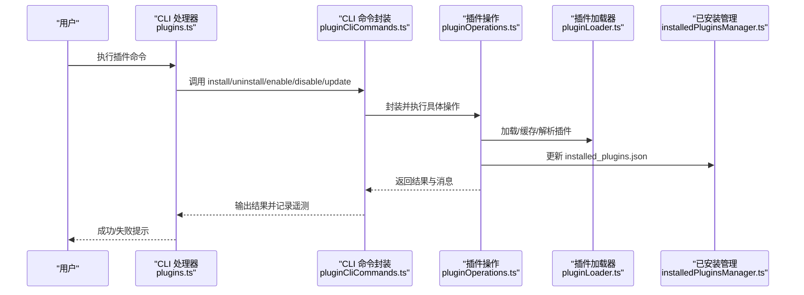
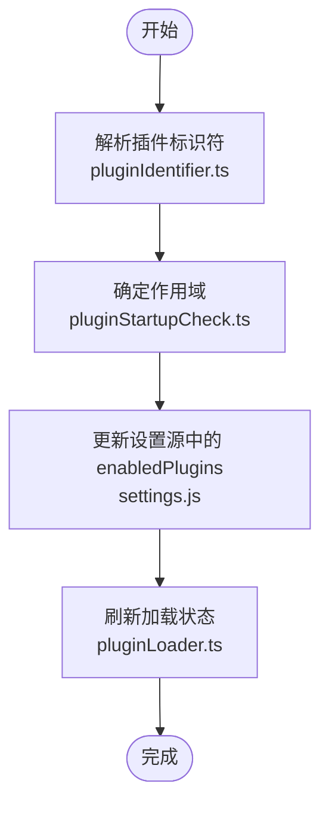
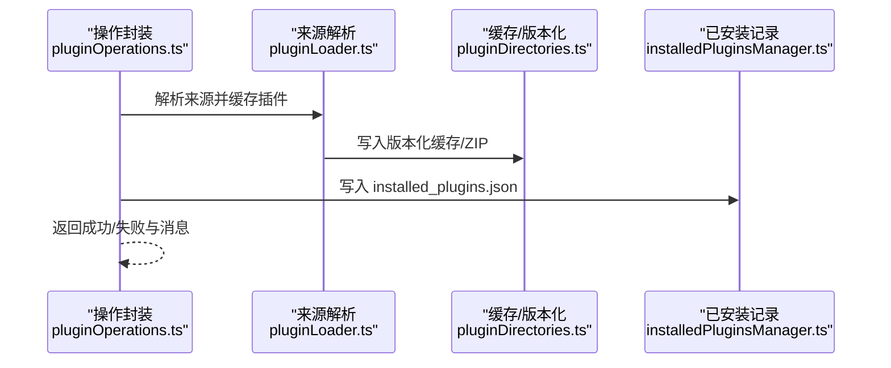
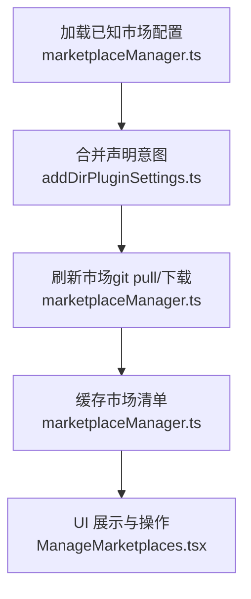
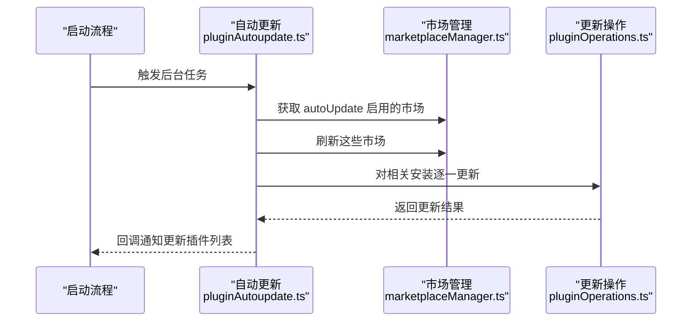
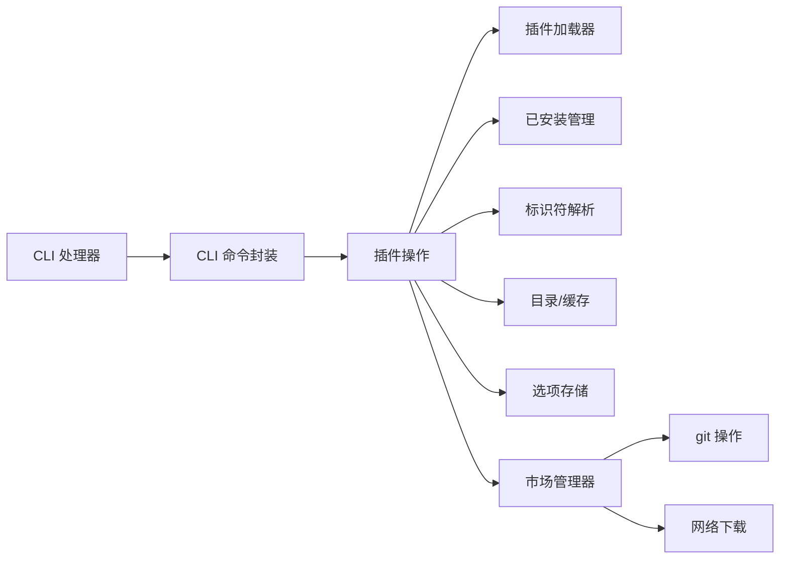

# 插件管理功能

<cite>
**本文档引用的文件**
- [src/commands/plugin/ManagePlugins.tsx](file://src/commands/plugin/ManagePlugins.tsx)
- [src/commands/plugin/ManageMarketplaces.tsx](file://src/commands/plugin/ManageMarketplaces.tsx)
- [src/cli/handlers/plugins.ts](file://src/cli/handlers/plugins.ts)
- [src/services/plugins/pluginCliCommands.ts](file://src/services/plugins/pluginCliCommands.ts)
- [src/services/plugins/pluginOperations.ts](file://src/services/plugins/pluginOperations.ts)
- [src/utils/plugins/pluginLoader.ts](file://src/utils/plugins/pluginLoader.ts)
- [src/utils/plugins/marketplaceManager.ts](file://src/utils/plugins/marketplaceManager.ts)
- [src/utils/plugins/pluginAutoupdate.ts](file://src/utils/plugins/pluginAutoupdate.ts)
- [src/utils/plugins/installedPluginsManager.ts](file://src/utils/plugins/installedPluginsManager.ts)
- [src/utils/plugins/pluginIdentifier.ts](file://src/utils/plugins/pluginIdentifier.ts)
- [src/utils/plugins/schemas.ts](file://src/utils/plugins/schemas.ts)
- [src/utils/plugins/pluginDirectories.ts](file://src/utils/plugins/pluginDirectories.ts)
- [src/utils/plugins/pluginOptionsStorage.ts](file://src/utils/plugins/pluginOptionsStorage.ts)
- [src/utils/plugins/pluginPolicy.ts](file://src/utils/plugins/pluginPolicy.ts)
- [src/utils/plugins/pluginFlagging.ts](file://src/utils/plugins/pluginFlagging.ts)
- [src/utils/plugins/pluginStartupCheck.ts](file://src/utils/plugins/pluginStartupCheck.ts)
- [src/utils/plugins/fetchTelemetry.ts](file://src/utils/plugins/fetchTelemetry.ts)
- [src/utils/plugins/cacheUtils.ts](file://src/utils/plugins/cacheUtils.ts)
- [src/utils/plugins/marketplaceHelpers.ts](file://src/utils/plugins/marketplaceHelpers.ts)
- [src/utils/plugins/officialMarketplace.ts](file://src/utils/plugins/officialMarketplace.ts)
- [src/utils/plugins/officialMarketplaceGcs.ts](file://src/utils/plugins/officialMarketplaceGcs.ts)
- [src/utils/plugins/parseMarketplaceInput.ts](file://src/utils/plugins/parseMarketplaceInput.ts)
- [src/utils/plugins/validatePlugin.ts](file://src/utils/plugins/validatePlugin.ts)
- [src/utils/plugins/mcpPluginIntegration.ts](file://src/utils/plugins/mcpPluginIntegration.ts)
- [src/utils/plugins/addDirPluginSettings.ts](file://src/utils/plugins/addDirPluginSettings.ts)
- [src/utils/plugins/zipCache.ts](file://src/utils/plugins/zipCache.ts)
- [src/utils/plugins/dependencyResolver.ts](file://src/utils/plugins/dependencyResolver.ts)
- [src/utils/plugins/gitAvailability.ts](file://src/utils/plugins/gitAvailability.ts)
- [src/utils/plugins/managedPlugins.ts](file://src/utils/plugins/managedPlugins.ts)
- [src/utils/plugins/pluginVersioning.ts](file://src/utils/plugins/pluginVersioning.ts)
- [src/utils/plugins/installCounts.ts](file://src/utils/plugins/installCounts.ts)
- [src/utils/plugins/pluginInstallationHelpers.ts](file://src/utils/plugins/pluginInstallationHelpers.ts)
- [src/utils/plugins/pluginVersioning.ts](file://src/utils/plugins/pluginVersioning.ts)
- [src/utils/plugins/pluginVersioning.ts](file://src/utils/plugins/pluginVersioning.ts)
- [src/utils/plugins/pluginVersioning.ts](file://src/utils/plugins/pluginVersioning.ts)
</cite>

## 目录
1. [简介](#简介)
2. [项目结构](#项目结构)
3. [核心组件](#核心组件)
4. [架构总览](#架构总览)
5. [详细组件分析](#详细组件分析)
6. [依赖关系分析](#依赖关系分析)
7. [性能考虑](#性能考虑)
8. [故障排除指南](#故障排除指南)
9. [结论](#结论)
10. [附录](#附录)

## 简介
本文件系统性阐述 Claude Code 的插件管理功能，覆盖插件的启用/禁用机制（含用户设置持久化与实时生效）、安装/卸载/更新流程（含版本兼容性检查与依赖更新策略）、插件市场集成（官方与第三方市场）、自动更新机制（检测、下载与安装）、错误监控与故障恢复，以及用户界面与命令行工具的操作指南。

## 项目结构
插件管理功能由三层协同构成：
- 命令层：CLI 子命令处理器与 Ink 终端 UI，负责用户交互与调用服务层。
- 服务层：插件操作封装（安装、启用、禁用、卸载、更新），统一错误处理与遥测。
- 工具层：插件加载器、市场管理器、缓存与版本管理、依赖解析等基础设施。

```mermaid
graph TB
subgraph "命令层"
CLI["CLI 子命令处理器<br/>src/cli/handlers/plugins.ts"]
UI["插件管理 UI<br/>src/commands/plugin/ManagePlugins.tsx"]
MarketUI["市场管理 UI<br/>src/commands/plugin/ManageMarketplaces.tsx"]
end
subgraph "服务层"
Ops["插件操作封装<br/>src/services/plugins/pluginOperations.ts"]
CliCmds["CLI 命令封装<br/>src/services/plugins/pluginCliCommands.ts"]
end
subgraph "工具层"
Loader["插件加载器<br/>src/utils/plugins/pluginLoader.ts"]
Mgr["市场管理器<br/>src/utils/plugins/marketplaceManager.ts"]
Auto["自动更新<br/>src/utils/plugins/pluginAutoupdate.ts"]
Installed["已安装插件管理<br/>src/utils/plugins/installedPluginsManager.ts"]
Ident["标识符解析<br/>src/utils/plugins/pluginIdentifier.ts"]
Schemas["模式与校验<br/>src/utils/plugins/schemas.ts"]
Dir["目录与缓存<br/>src/utils/plugins/pluginDirectories.ts"]
Options["选项存储<br/>src/utils/plugins/pluginOptionsStorage.ts"]
Policy["策略与标记<br/>src/utils/plugins/pluginPolicy.ts<br/>src/utils/plugins/pluginFlagging.ts"]
Startup["启动检查<br/>src/utils/plugins/pluginStartupCheck.ts"]
Telemetry["抓取遥测<br/>src/utils/plugins/fetchTelemetry.ts"]
Cache["缓存工具<br/>src/utils/plugins/cacheUtils.ts"]
Helpers["市场辅助<br/>src/utils/plugins/marketplaceHelpers.ts"]
Official["官方市场<br/>src/utils/plugins/officialMarketplace.ts<br/>src/utils/plugins/officialMarketplaceGcs.ts"]
Parse["市场输入解析<br/>src/utils/plugins/parseMarketplaceInput.ts"]
Validate["插件验证<br/>src/utils/plugins/validatePlugin.ts"]
MCP["MCP 集成<br/>src/utils/plugins/mcpPluginIntegration.ts"]
AddDir["附加目录设置<br/>src/utils/plugins/addDirPluginSettings.ts"]
Zip["ZIP 缓存<br/>src/utils/plugins/zipCache.ts"]
Dep["依赖解析<br/>src/utils/plugins/dependencyResolver.ts"]
GitAvail["Git 可用性<br/>src/utils/plugins/gitAvailability.ts"]
Managed["托管插件<br/>src/utils/plugins/managedPlugins.ts"]
Version["版本计算<br/>src/utils/plugins/pluginVersioning.ts"]
Counts["安装计数<br/>src/utils/plugins/installCounts.ts"]
InstallHelpers["安装辅助<br/>src/utils/plugins/pluginInstallationHelpers.ts"]
end
CLI --> CliCmds --> Ops
UI --> Ops
MarketUI --> Mgr
Ops --> Loader
Ops --> Installed
Ops --> Ident
Ops --> Schemas
Ops --> Dir
Ops --> Options
Ops --> Policy
Ops --> Startup
Ops --> Telemetry
Ops --> Cache
Ops --> Helpers
Ops --> Official
Ops --> Parse
Ops --> Validate
Ops --> MCP
Ops --> AddDir
Ops --> Zip
Ops --> Dep
Ops --> GitAvail
Ops --> Managed
Ops --> Version
Ops --> Counts
Ops --> InstallHelpers
Auto --> Installed
Auto --> Mgr
Auto --> Ident
```

**图表来源**
- [src/cli/handlers/plugins.ts:1-879](file://src/cli/handlers/plugins.ts#L1-L879)
- [src/services/plugins/pluginCliCommands.ts:1-345](file://src/services/plugins/pluginCliCommands.ts#L1-L345)
- [src/services/plugins/pluginOperations.ts](file://src/services/plugins/pluginOperations.ts)
- [src/utils/plugins/pluginLoader.ts:1-3303](file://src/utils/plugins/pluginLoader.ts#L1-L3303)
- [src/utils/plugins/marketplaceManager.ts:1-2644](file://src/utils/plugins/marketplaceManager.ts#L1-L2644)
- [src/utils/plugins/pluginAutoupdate.ts:1-285](file://src/utils/plugins/pluginAutoupdate.ts#L1-L285)
- [src/utils/plugins/installedPluginsManager.ts](file://src/utils/plugins/installedPluginsManager.ts)
- [src/utils/plugins/pluginIdentifier.ts](file://src/utils/plugins/pluginIdentifier.ts)
- [src/utils/plugins/schemas.ts](file://src/utils/plugins/schemas.ts)
- [src/utils/plugins/pluginDirectories.ts](file://src/utils/plugins/pluginDirectories.ts)
- [src/utils/plugins/pluginOptionsStorage.ts](file://src/utils/plugins/pluginOptionsStorage.ts)
- [src/utils/plugins/pluginPolicy.ts](file://src/utils/plugins/pluginPolicy.ts)
- [src/utils/plugins/pluginFlagging.ts](file://src/utils/plugins/pluginFlagging.ts)
- [src/utils/plugins/pluginStartupCheck.ts](file://src/utils/plugins/pluginStartupCheck.ts)
- [src/utils/plugins/fetchTelemetry.ts](file://src/utils/plugins/fetchTelemetry.ts)
- [src/utils/plugins/cacheUtils.ts](file://src/utils/plugins/cacheUtils.ts)
- [src/utils/plugins/marketplaceHelpers.ts](file://src/utils/plugins/marketplaceHelpers.ts)
- [src/utils/plugins/officialMarketplace.ts](file://src/utils/plugins/officialMarketplace.ts)
- [src/utils/plugins/officialMarketplaceGcs.ts](file://src/utils/plugins/officialMarketplaceGcs.ts)
- [src/utils/plugins/parseMarketplaceInput.ts](file://src/utils/plugins/parseMarketplaceInput.ts)
- [src/utils/plugins/validatePlugin.ts](file://src/utils/plugins/validatePlugin.ts)
- [src/utils/plugins/mcpPluginIntegration.ts](file://src/utils/plugins/mcpPluginIntegration.ts)
- [src/utils/plugins/addDirPluginSettings.ts](file://src/utils/plugins/addDirPluginSettings.ts)
- [src/utils/plugins/zipCache.ts](file://src/utils/plugins/zipCache.ts)
- [src/utils/plugins/dependencyResolver.ts](file://src/utils/plugins/dependencyResolver.ts)
- [src/utils/plugins/gitAvailability.ts](file://src/utils/plugins/gitAvailability.ts)
- [src/utils/plugins/managedPlugins.ts](file://src/utils/plugins/managedPlugins.ts)
- [src/utils/plugins/pluginVersioning.ts](file://src/utils/plugins/pluginVersioning.ts)
- [src/utils/plugins/installCounts.ts](file://src/utils/plugins/installCounts.ts)
- [src/utils/plugins/pluginInstallationHelpers.ts](file://src/utils/plugins/pluginInstallationHelpers.ts)

**章节来源**
- [src/cli/handlers/plugins.ts:1-879](file://src/cli/handlers/plugins.ts#L1-L879)
- [src/services/plugins/pluginCliCommands.ts:1-345](file://src/services/plugins/pluginCliCommands.ts#L1-L345)
- [src/utils/plugins/pluginLoader.ts:1-3303](file://src/utils/plugins/pluginLoader.ts#L1-L3303)
- [src/utils/plugins/marketplaceManager.ts:1-2644](file://src/utils/plugins/marketplaceManager.ts#L1-L2644)

## 核心组件
- 插件启用/禁用机制
  - 设置持久化：通过设置源（用户/项目/本地）写入 enabledPlugins 映射，键为 pluginId（name@marketplace）。
  - 实时生效：UI 与 CLI 在执行操作后刷新状态；加载器按 settings 中的 enabledPlugins 决定插件是否启用。
- 安装/卸载/更新流程
  - 安装：解析来源（本地/远程/Git/NPM），缓存到版本化缓存目录，生成清单，写入 installed_plugins.json。
  - 卸载：移除缓存与数据目录，更新 installed_plugins.json 与设置。
  - 更新：对目标范围逐一执行 updatePluginOp，非就地更新，需重启生效。
- 版本兼容性与依赖
  - 版本计算与缓存路径：支持 semver、git SHA、种子缓存回退。
  - 依赖解析：在安装前进行依赖验证与降级。
- 市场管理
  - 官方市场与第三方市场：支持 GitHub/Git/URL/目录/文件等多种来源；可配置 autoUpdate。
  - 市场更新：git pull 或重新下载，失败优雅降级。
- 自动更新
  - 后台扫描：仅对开启 autoUpdate 的市场执行刷新与插件更新。
  - 通知机制：通过回调向 REPL 通知待重启更新的插件列表。
- 错误监控与故障恢复
  - 详尽的错误分类与遥测上报；失败清理临时缓存；网络/认证错误增强提示。
- 用户界面与命令行
  - Ink 终端 UI 提供插件列表、详情、启用/禁用、卸载、选项配置等。
  - CLI 子命令提供 validate/list/add/remove/update 等能力。

**章节来源**
- [src/commands/plugin/ManagePlugins.tsx:1-2215](file://src/commands/plugin/ManagePlugins.tsx#L1-L2215)
- [src/commands/plugin/ManageMarketplaces.tsx:1-388](file://src/commands/plugin/ManageMarketplaces.tsx#L1-L388)
- [src/services/plugins/pluginCliCommands.ts:1-345](file://src/services/plugins/pluginCliCommands.ts#L1-L345)
- [src/utils/plugins/pluginLoader.ts:1-3303](file://src/utils/plugins/pluginLoader.ts#L1-L3303)
- [src/utils/plugins/marketplaceManager.ts:1-2644](file://src/utils/plugins/marketplaceManager.ts#L1-L2644)
- [src/utils/plugins/pluginAutoupdate.ts:1-285](file://src/utils/plugins/pluginAutoupdate.ts#L1-L285)

## 架构总览
下图展示从用户触发到插件实际生效的关键调用链路：

**图表来源**
- [src/cli/handlers/plugins.ts:1-879](file://src/cli/handlers/plugins.ts#L1-L879)
- [src/services/plugins/pluginCliCommands.ts:1-345](file://src/services/plugins/pluginCliCommands.ts#L1-L345)
- [src/services/plugins/pluginOperations.ts](file://src/services/plugins/pluginOperations.ts)
- [src/utils/plugins/pluginLoader.ts:1-3303](file://src/utils/plugins/pluginLoader.ts#L1-L3303)
- [src/utils/plugins/installedPluginsManager.ts](file://src/utils/plugins/installedPluginsManager.ts)

## 详细组件分析

### 启用/禁用机制（设置持久化与实时生效）
- 持久化策略
  - 使用设置源（用户/项目/本地）写入 enabledPlugins 映射，键为 pluginId（name@marketplace）。
  - 支持批量禁用所有插件，便于快速恢复。
- 实时生效
  - UI 与 CLI 在操作后刷新状态；加载器根据 settings 中的 enabledPlugins 决定插件启用状态。
  - 启动时的编辑范围检查确保作用域正确。

**图表来源**
- [src/utils/plugins/pluginIdentifier.ts](file://src/utils/plugins/pluginIdentifier.ts)
- [src/utils/plugins/pluginStartupCheck.ts](file://src/utils/plugins/pluginStartupCheck.ts)
- [src/utils/plugins/pluginLoader.ts:1-3303](file://src/utils/plugins/pluginLoader.ts#L1-L3303)

**章节来源**
- [src/commands/plugin/ManagePlugins.tsx:1296-1310](file://src/commands/plugin/ManagePlugins.tsx#L1296-L1310)
- [src/services/plugins/pluginCliCommands.ts:195-270](file://src/services/plugins/pluginCliCommands.ts#L195-L270)
- [src/utils/plugins/pluginStartupCheck.ts](file://src/utils/plugins/pluginStartupCheck.ts)

### 安装/卸载/更新流程（含版本兼容性与依赖）
- 安装流程
  - 解析来源类型（本地/远程/Git/NPM），生成临时缓存名，下载/克隆至缓存目录。
  - 读取并校验插件清单（plugin.json），必要时回退到默认清单。
  - 将缓存内容复制到版本化缓存目录，移除 .git，支持 ZIP 缓存。
  - 计算版本并写入 installed_plugins.json，注册插件选项与 MCP 服务器。
- 卸载流程
  - 移除缓存与数据目录，清理插件选项与标记。
  - 更新 installed_plugins.json 与设置，必要时保留数据。
- 更新流程
  - 对目标范围逐一执行 updatePluginOp，非就地更新，需重启生效。
  - 自动更新模块后台扫描并更新已声明市场的插件。

**图表来源**
- [src/services/plugins/pluginOperations.ts](file://src/services/plugins/pluginOperations.ts)
- [src/utils/plugins/pluginLoader.ts:911-1098](file://src/utils/plugins/pluginLoader.ts#L911-L1098)
- [src/utils/plugins/pluginDirectories.ts](file://src/utils/plugins/pluginDirectories.ts)
- [src/utils/plugins/installedPluginsManager.ts](file://src/utils/plugins/installedPluginsManager.ts)

**章节来源**
- [src/utils/plugins/pluginLoader.ts:911-1098](file://src/utils/plugins/pluginLoader.ts#L911-L1098)
- [src/utils/plugins/pluginDirectories.ts](file://src/utils/plugins/pluginDirectories.ts)
- [src/utils/plugins/installedPluginsManager.ts](file://src/utils/plugins/installedPluginsManager.ts)

### 版本兼容性与依赖更新策略
- 版本计算与缓存
  - 支持 semver 与 git SHA；当版本未知时探测种子缓存或版本化目录。
  - ZIP 缓存可显著减少磁盘占用与 IO。
- 依赖解析
  - 安装前进行依赖验证与降级，避免冲突。
- 兼容性检查
  - 清理 .git 目录，确保缓存纯净；路径穿越防护。

**章节来源**
- [src/utils/plugins/pluginVersioning.ts](file://src/utils/plugins/pluginVersioning.ts)
- [src/utils/plugins/zipCache.ts](file://src/utils/plugins/zipCache.ts)
- [src/utils/plugins/dependencyResolver.ts](file://src/utils/plugins/dependencyResolver.ts)
- [src/utils/plugins/pluginInstallationHelpers.ts](file://src/utils/plugins/pluginInstallationHelpers.ts)

### 插件市场集成（官方与第三方）
- 官方市场
  - 默认启用 autoUpdate；支持从 GCS 获取官方市场清单。
- 第三方市场
  - 支持 GitHub/Git/URL/目录/文件来源；可配置 autoUpdate。
  - 刷新时执行 git pull 或重新下载，失败优雅降级。
- 市场管理 UI
  - 支持添加/列出/移除/更新市场；批量应用变更并刷新数据。

**图表来源**
- [src/utils/plugins/marketplaceManager.ts:264-350](file://src/utils/plugins/marketplaceManager.ts#L264-L350)
- [src/utils/plugins/officialMarketplace.ts](file://src/utils/plugins/officialMarketplace.ts)
- [src/utils/plugins/officialMarketplaceGcs.ts](file://src/utils/plugins/officialMarketplaceGcs.ts)
- [src/utils/plugins/addDirPluginSettings.ts](file://src/utils/plugins/addDirPluginSettings.ts)
- [src/commands/plugin/ManageMarketplaces.tsx:183-300](file://src/commands/plugin/ManageMarketplaces.tsx#L183-L300)

**章节来源**
- [src/utils/plugins/marketplaceManager.ts:508-710](file://src/utils/plugins/marketplaceManager.ts#L508-L710)
- [src/commands/plugin/ManageMarketplaces.tsx:343-388](file://src/commands/plugin/ManageMarketplaces.tsx#L343-L388)

### 自动更新机制（检测、下载、安装）
- 后台扫描
  - 仅对开启 autoUpdate 的市场执行 refreshMarketplace。
  - 对相关项目的安装实例逐一执行 updatePluginOp。
- 通知机制
  - 通过回调向 REPL 通知待重启更新的插件列表。
- 失败处理
  - 刷新失败与更新失败均记录日志，不影响其他市场。

**图表来源**
- [src/utils/plugins/pluginAutoupdate.ts:227-284](file://src/utils/plugins/pluginAutoupdate.ts#L227-L284)
- [src/utils/plugins/marketplaceManager.ts:508-710](file://src/utils/plugins/marketplaceManager.ts#L508-L710)
- [src/services/plugins/pluginOperations.ts](file://src/services/plugins/pluginOperations.ts)

**章节来源**
- [src/utils/plugins/pluginAutoupdate.ts:1-285](file://src/utils/plugins/pluginAutoupdate.ts#L1-L285)

### 错误监控与故障恢复
- 错误分类与遥测
  - CLI 命令封装统一捕获错误并记录事件，包含错误类别与插件元信息。
- 失败清理
  - 安装失败时清理临时缓存目录，避免残留。
- 网络/认证增强提示
  - git pull 失败时提供 SSH 主机密钥变化、认证失败、网络超时等明确指引。
- 插件标记与策略
  - 标记违规插件并提供查看与移除入口；策略检查阻止不合规来源。

**章节来源**
- [src/services/plugins/pluginCliCommands.ts:53-96](file://src/services/plugins/pluginCliCommands.ts#L53-L96)
- [src/utils/plugins/fetchTelemetry.ts](file://src/utils/plugins/fetchTelemetry.ts)
- [src/utils/plugins/marketplaceManager.ts:649-709](file://src/utils/plugins/marketplaceManager.ts#L649-L709)
- [src/utils/plugins/pluginFlagging.ts](file://src/utils/plugins/pluginFlagging.ts)
- [src/utils/plugins/pluginPolicy.ts](file://src/utils/plugins/pluginPolicy.ts)

### 用户界面与命令行操作指南
- Ink 终端 UI
  - 插件列表与详情：支持启用/禁用、卸载、配置选项、MCP 服务器管理。
  - 市场管理：支持添加/列出/移除/更新市场，批量应用变更。
- CLI 子命令
  - 插件：validate、list、install、uninstall、enable、disable、disable-all、update。
  - 市场：add、list、remove、update。
  - 支持 cowork 与作用域参数，记录详细遥测。

**章节来源**
- [src/commands/plugin/ManagePlugins.tsx:1-2215](file://src/commands/plugin/ManagePlugins.tsx#L1-L2215)
- [src/commands/plugin/ManageMarketplaces.tsx:1-388](file://src/commands/plugin/ManageMarketplaces.tsx#L1-L388)
- [src/cli/handlers/plugins.ts:100-879](file://src/cli/handlers/plugins.ts#L100-L879)
- [src/services/plugins/pluginCliCommands.ts:103-344](file://src/services/plugins/pluginCliCommands.ts#L103-L344)

## 依赖关系分析
- 组件耦合
  - CLI 与 UI 通过服务层解耦，便于独立演进。
  - 加载器与市场管理器通过模式与工具层协作，职责清晰。
- 关键依赖链
  - 插件操作依赖加载器、已安装管理、标识符解析、目录与缓存、选项存储。
  - 市场管理依赖 git、HTTP 下载、遥测与策略。
- 循环依赖
  - 未见直接循环；各模块通过接口与函数边界通信。

**图表来源**
- [src/cli/handlers/plugins.ts:1-879](file://src/cli/handlers/plugins.ts#L1-L879)
- [src/services/plugins/pluginCliCommands.ts:1-345](file://src/services/plugins/pluginCliCommands.ts#L1-L345)
- [src/services/plugins/pluginOperations.ts](file://src/services/plugins/pluginOperations.ts)
- [src/utils/plugins/pluginLoader.ts:1-3303](file://src/utils/plugins/pluginLoader.ts#L1-L3303)
- [src/utils/plugins/marketplaceManager.ts:1-2644](file://src/utils/plugins/marketplaceManager.ts#L1-L2644)

**章节来源**
- [src/utils/plugins/pluginLoader.ts:1-3303](file://src/utils/plugins/pluginLoader.ts#L1-L3303)
- [src/utils/plugins/marketplaceManager.ts:1-2644](file://src/utils/plugins/marketplaceManager.ts#L1-L2644)

## 性能考虑
- 并行优化
  - 路径存在性检查采用 Promise.all 并行化，降低事件循环开销。
  - 市场刷新与插件更新使用 Promise.allSettled 并行处理。
- 缓存策略
  - 版本化缓存与 ZIP 缓存减少重复下载与 IO。
  - 种子缓存优先命中，加速首次启动。
- 网络与 IO
  - git 操作带超时与子模块更新优化；下载失败快速失败并降级。
- 内存与磁盘
  - 临时缓存失败清理；.git 目录移除避免冗余。

[本节为通用指导，无需特定文件分析]

## 故障排除指南
- 安装失败
  - 检查来源合法性与网络可达性；查看 CLI 输出的错误详情与建议。
  - 若为清单问题，使用 validate 命令定位。
- 更新失败
  - 查看自动更新回调通知；手动执行 marketplace update 或 plugin update。
- 启用/禁用无效
  - 确认作用域与设置源；检查 enabledPlugins 映射。
- 市场刷新失败
  - SSH 主机密钥变化、认证失败、网络超时均有明确提示；按提示修复。
- 插件加载错误
  - 查看插件详情中的错误列表；确认组件路径存在且格式正确。

**章节来源**
- [src/services/plugins/pluginCliCommands.ts:53-96](file://src/services/plugins/pluginCliCommands.ts#L53-L96)
- [src/utils/plugins/marketplaceManager.ts:649-709](file://src/utils/plugins/marketplaceManager.ts#L649-L709)
- [src/utils/plugins/validatePlugin.ts](file://src/utils/plugins/validatePlugin.ts)

## 结论
Claude Code 的插件管理功能以清晰的分层设计实现强健的生命周期管理：从安装、启用/禁用、卸载到更新，配合版本化缓存、依赖解析与自动更新机制，既保证了用户体验，也兼顾了安全性与可维护性。UI 与 CLI 双通道覆盖不同使用场景，错误监控与故障恢复机制确保系统稳定运行。

[本节为总结，无需特定文件分析]

## 附录
- 常用命令速查
  - 插件：validate、list、install、uninstall、enable、disable、disable-all、update。
  - 市场：add、list、remove、update。
- 关键配置
  - enabledPlugins 映射、autoUpdate 标志、作用域（user/project/local）。
- 最佳实践
  - 优先使用官方市场；定期更新；合理使用 ZIP 缓存；关注自动更新通知。

[本节为概览，无需特定文件分析]