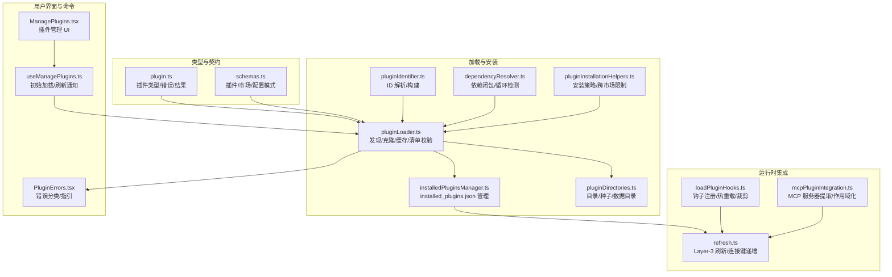
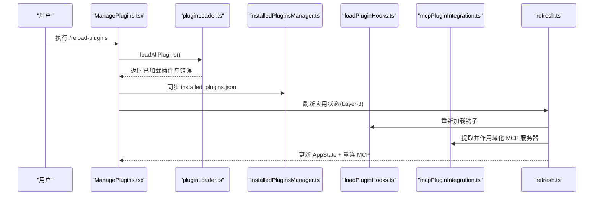
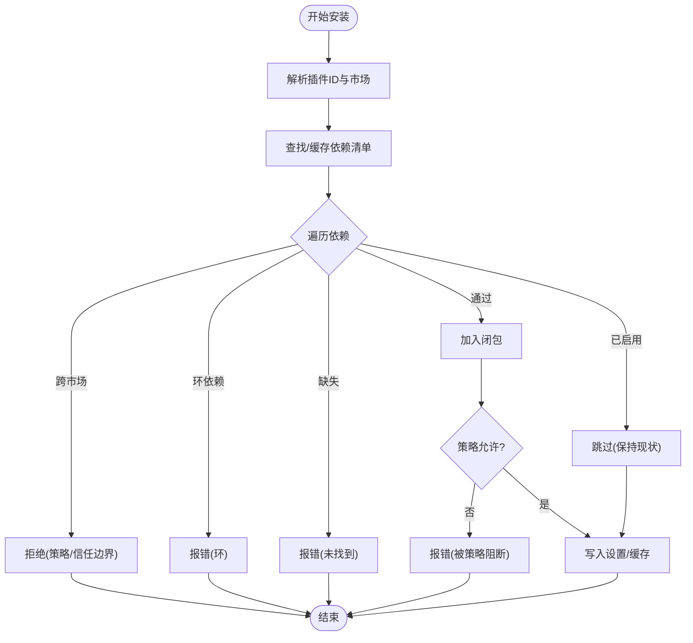
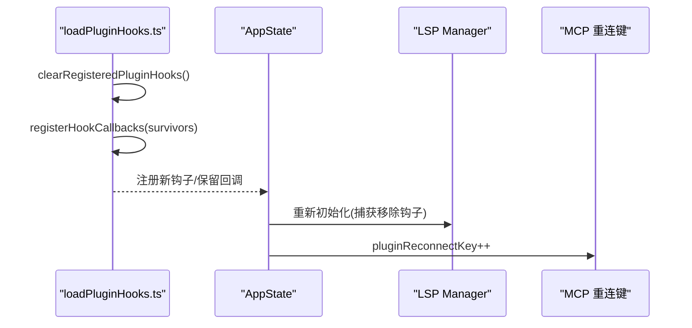
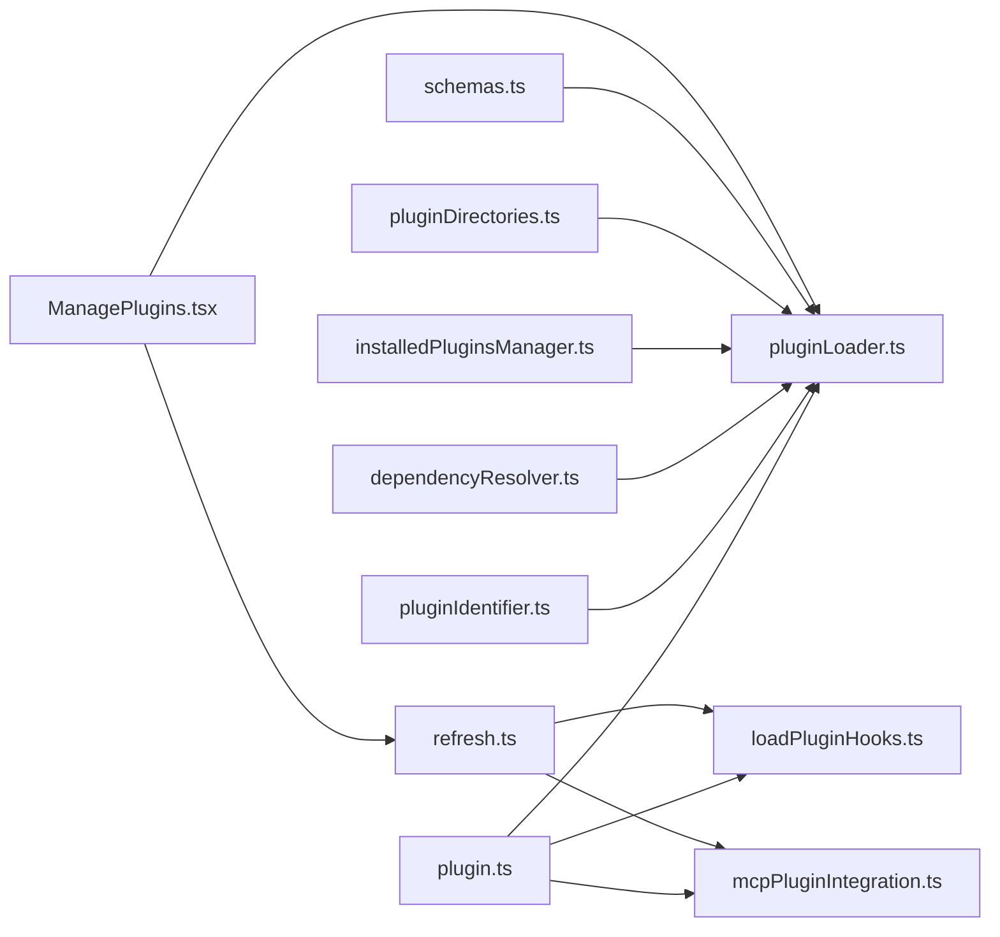

# 插件系统

<cite>
**本文引用的文件**
- [builtinPlugins.ts](file://src/plugins/builtinPlugins.ts)
- [plugin.ts](file://src/types/plugin.ts)
- [pluginLoader.ts](file://src/utils/plugins/pluginLoader.ts)
- [installedPluginsManager.ts](file://src/utils/plugins/installedPluginsManager.ts)
- [pluginDirectories.ts](file://src/utils/plugins/pluginDirectories.ts)
- [pluginIdentifier.ts](file://src/utils/plugins/pluginIdentifier.ts)
- [dependencyResolver.ts](file://src/utils/plugins/dependencyResolver.ts)
- [pluginInstallationHelpers.ts](file://src/utils/plugins/pluginInstallationHelpers.ts)
- [mcpPluginIntegration.ts](file://src/utils/plugins/mcpPluginIntegration.ts)
- [schemas.ts](file://src/utils/plugins/schemas.ts)
- [loadPluginHooks.ts](file://src/utils/plugins/loadPluginHooks.ts)
- [refresh.ts](file://src/utils/plugins/refresh.ts)
- [pluginFlagging.ts](file://src/utils/plugins/pluginFlagging.ts)
- [ManagePlugins.tsx](file://src/commands/plugin/ManagePlugins.tsx)
- [PluginErrors.tsx](file://src/commands/plugin/PluginErrors.tsx)
- [useManagePlugins.ts](file://src/hooks/useManagePlugins.ts)
- [types.ts](file://src/utils/settings/types.ts)
- [pluginTelemetry.ts](file://src/utils/telemetry/pluginTelemetry.ts)
- [useManageMCPConnections.ts](file://src/services/mcp/useManageMCPConnections.ts)
</cite>

## 目录
1. [简介](#简介)
2. [项目结构](#项目结构)
3. [核心组件](#核心组件)
4. [架构总览](#架构总览)
5. [详细组件分析](#详细组件分析)
6. [依赖关系分析](#依赖关系分析)
7. [性能考量](#性能考量)
8. [故障排查指南](#故障排查指南)
9. [结论](#结论)
10. [附录](#附录)

## 简介
本文件系统性阐述 Claude Code 插件系统的架构与实现，覆盖插件注册机制、加载流程、生命周期管理、内置与市场插件差异、依赖解析与版本管理、冲突处理、开发 API 规范（插件接口、钩子系统、MCP 集成）、安装/卸载/更新流程、错误处理与调试方法，并提供可操作的最佳实践与示例路径。

## 项目结构
插件系统围绕“类型定义—加载器—安装管理—目录与缓存—钩子—MCP 集成—UI/命令行”等模块协同工作，形成从磁盘到运行时状态的完整闭环。



图表来源
- [plugin.ts:1-364](file://src/types/plugin.ts#L1-L364)
- [pluginLoader.ts:1-800](file://src/utils/plugins/pluginLoader.ts#L1-L800)
- [installedPluginsManager.ts:1-800](file://src/utils/plugins/installedPluginsManager.ts#L1-L800)
- [pluginDirectories.ts:1-179](file://src/utils/plugins/pluginDirectories.ts#L1-L179)
- [pluginIdentifier.ts:34-67](file://src/utils/plugins/pluginIdentifier.ts#L34-L67)
- [dependencyResolver.ts:91-142](file://src/utils/plugins/dependencyResolver.ts#L91-L142)
- [pluginInstallationHelpers.ts:391-427](file://src/utils/plugins/pluginInstallationHelpers.ts#L391-L427)
- [mcpPluginIntegration.ts:122-377](file://src/utils/plugins/mcpPluginIntegration.ts#L122-L377)
- [loadPluginHooks.ts:159-215](file://src/utils/plugins/loadPluginHooks.ts#L159-L215)
- [refresh.ts:1-18](file://src/utils/plugins/refresh.ts#L1-L18)
- [ManagePlugins.tsx:1-200](file://src/commands/plugin/ManagePlugins.tsx#L1-L200)
- [PluginErrors.tsx:67-123](file://src/commands/plugin/PluginErrors.tsx#L67-L123)
- [useManagePlugins.ts:25-54](file://src/hooks/useManagePlugins.ts#L25-L54)

章节来源
- [pluginLoader.ts:1-800](file://src/utils/plugins/pluginLoader.ts#L1-L800)
- [installedPluginsManager.ts:1-800](file://src/utils/plugins/installedPluginsManager.ts#L1-L800)
- [pluginDirectories.ts:1-179](file://src/utils/plugins/pluginDirectories.ts#L1-L179)

## 核心组件
- 类型与契约：统一定义插件元数据、错误类型、加载结果、配置模式等，确保各模块间强类型一致。
- 加载器：负责插件发现、克隆/下载、版本化缓存、清单校验、组件加载与错误收集。
- 安装管理：维护 installed_plugins.json 的版本化结构，支持多作用域安装、迁移、更新探测与清理。
- 目录与缓存：集中管理插件根目录、种子目录、数据目录、ZIP 缓存与版本化路径。
- 钩子系统：按事件维度注册/裁剪插件钩子，支持热重载与设置变更触发。
- MCP 集成：从插件提取并作用域化 MCP 服务器，注入到全局配置，驱动连接重建。
- UI/命令：提供插件管理界面与命令，支持启用/禁用/卸载/更新、错误展示与指引。

章节来源
- [plugin.ts:1-364](file://src/types/plugin.ts#L1-L364)
- [pluginLoader.ts:1-800](file://src/utils/plugins/pluginLoader.ts#L1-L800)
- [installedPluginsManager.ts:1-800](file://src/utils/plugins/installedPluginsManager.ts#L1-L800)
- [pluginDirectories.ts:1-179](file://src/utils/plugins/pluginDirectories.ts#L1-L179)
- [loadPluginHooks.ts:159-215](file://src/utils/plugins/loadPluginHooks.ts#L159-L215)
- [mcpPluginIntegration.ts:122-377](file://src/utils/plugins/mcpPluginIntegration.ts#L122-L377)
- [ManagePlugins.tsx:1-200](file://src/commands/plugin/ManagePlugins.tsx#L1-L200)

## 架构总览
插件系统采用三层刷新模型：
- Layer 1：意图（设置）变更
- Layer 2：物化（磁盘缓存/市场同步）
- Layer 3：活动组件（应用状态/钩子/MCP）



图表来源
- [refresh.ts:1-18](file://src/utils/plugins/refresh.ts#L1-L18)
- [pluginLoader.ts:1-800](file://src/utils/plugins/pluginLoader.ts#L1-L800)
- [installedPluginsManager.ts:1-800](file://src/utils/plugins/installedPluginsManager.ts#L1-L800)
- [loadPluginHooks.ts:159-215](file://src/utils/plugins/loadPluginHooks.ts#L159-L215)
- [mcpPluginIntegration.ts:122-377](file://src/utils/plugins/mcpPluginIntegration.ts#L122-L377)
- [ManagePlugins.tsx:1-200](file://src/commands/plugin/ManagePlugins.tsx#L1-L200)

## 详细组件分析

### 插件注册与内置插件
- 内置插件通过注册表在启动时集中管理，支持可用性检查、默认启用状态与用户设置合并。
- 内置插件 ID 使用后缀 @builtin 区分于市场插件；其能力通过 manifest 暴露技能、钩子、MCP 服务器等。

```mermaid
classDiagram
class BuiltinPluginRegistry {
+registerBuiltinPlugin(def)
+isBuiltinPluginId(id) boolean
+getBuiltinPluginDefinition(name)
+getBuiltinPlugins() {enabled, disabled}
+getBuiltinPluginSkillCommands() Command[]
+clearBuiltinPlugins()
}
class BuiltinPluginDefinition {
+string name
+string description
+string version
+BundledSkillDefinition[] skills
+HooksSettings hooks
+Record~string, McpServerConfig~ mcpServers
+() isAvailable
+boolean defaultEnabled
}
BuiltinPluginRegistry --> BuiltinPluginDefinition : "管理"
```

图表来源
- [builtinPlugins.ts:1-160](file://src/plugins/builtinPlugins.ts#L1-L160)

章节来源
- [builtinPlugins.ts:1-160](file://src/plugins/builtinPlugins.ts#L1-L160)

### 插件标识符与作用域
- 插件标识符支持 name 或 name@marketplace 两种形式；解析/构建函数保证跨模块一致性。
- 作用域包括 user、project、local、managed、builtin；不同作用域影响可见性与启用状态。

章节来源
- [pluginIdentifier.ts:34-67](file://src/utils/plugins/pluginIdentifier.ts#L34-L67)
- [ManagePlugins.tsx:564-584](file://src/commands/plugin/ManagePlugins.tsx#L564-L584)

### 插件加载与缓存
- 发现顺序：市场插件（settings 中的 name@marketplace）优先，随后是会话级插件（--plugin-dir）。
- 缓存策略：版本化目录缓存（含 ZIP），支持种子目录只读回退，避免重复网络拉取。
- 清单校验：严格校验 manifest 结构与字段，失败即记录具体错误类型以便 UI 呈现。

章节来源
- [pluginLoader.ts:1-800](file://src/utils/plugins/pluginLoader.ts#L1-L800)
- [pluginDirectories.ts:1-179](file://src/utils/plugins/pluginDirectories.ts#L1-L179)

### 安装管理与版本化存储
- installed_plugins.json 采用 V2 结构，按插件聚合多个安装条目（多作用域/多项目）。
- 支持迁移（V1→V2）、清理遗留缓存、后台更新探测（磁盘 vs 内存）、批量删除市场插件。
- 版本化路径：~/.claude/plugins/cache/{marketplace}/{plugin}/{version}/，兼容旧版平铺缓存。

章节来源
- [installedPluginsManager.ts:1-800](file://src/utils/plugins/installedPluginsManager.ts#L1-L800)

### 依赖解析与版本管理
- 依赖闭包：自根插件向外遍历，跳过已启用依赖，阻止跨市场自动安装，检测环依赖。
- 策略与安全：允许白名单市场自动安装依赖；对策略阻断的依赖提前拦截。
- 版本管理：基于版本字符串或 Git SHA，结合缓存命中与 ZIP/目录缓存模式。



图表来源
- [dependencyResolver.ts:91-142](file://src/utils/plugins/dependencyResolver.ts#L91-L142)
- [pluginInstallationHelpers.ts:391-427](file://src/utils/plugins/pluginInstallationHelpers.ts#L391-L427)

章节来源
- [dependencyResolver.ts:91-142](file://src/utils/plugins/dependencyResolver.ts#L91-L142)
- [pluginInstallationHelpers.ts:391-427](file://src/utils/plugins/pluginInstallationHelpers.ts#L391-L427)

### 生命周期与刷新
- 初始加载：useManagePlugins 在挂载时执行一次性全量加载，同时执行下架强制与标记插件通知。
- 刷新机制：/reload-plugins 触发 Layer-3 刷新，原子替换应用状态中的插件组件，递增 MCP 重连键，重建 LSP 管理器。
- 钩子裁剪：移除已禁用插件的钩子，保留回调钩子，确保一致性与低开销。



图表来源
- [loadPluginHooks.ts:159-215](file://src/utils/plugins/loadPluginHooks.ts#L159-L215)
- [refresh.ts:123-161](file://src/utils/plugins/refresh.ts#L123-L161)

章节来源
- [useManagePlugins.ts:25-54](file://src/hooks/useManagePlugins.ts#L25-L54)
- [refresh.ts:1-18](file://src/utils/plugins/refresh.ts#L1-L18)

### MCP 服务器集成
- 插件可通过 manifest、.mcp.json 或 .mcpb 文件提供 MCP 服务器配置。
- 统一提取后为每个服务器添加 plugin: 前缀的作用域，避免命名冲突，并注入到全局配置中。
- 连接管理：去重、错误分类、指数退避重连、错误去重与 UI 展示。

章节来源
- [mcpPluginIntegration.ts:122-377](file://src/utils/plugins/mcpPluginIntegration.ts#L122-L377)
- [useManageMCPConnections.ts:87-132](file://src/services/mcp/useManageMCPConnections.ts#L87-L132)

### 错误处理与调试
- 错误类型：涵盖路径/网络/Git/清单/市场/MCP/LSP/钩子/依赖等，提供稳定的消息格式与 UI 指引。
- 分类与去重：按类型/来源/插件生成唯一键，避免重复提示。
- 调试：提供错误分类（网络/权限/验证/未知）与 Telemetry 分类，便于定位问题。

章节来源
- [plugin.ts:101-283](file://src/types/plugin.ts#L101-L283)
- [PluginErrors.tsx:67-123](file://src/commands/plugin/PluginErrors.tsx#L67-L123)
- [pluginTelemetry.ts:238-259](file://src/utils/telemetry/pluginTelemetry.ts#L238-L259)
- [useManageMCPConnections.ts:87-132](file://src/services/mcp/useManageMCPConnections.ts#L87-L132)

### 安装、卸载与更新流程
- 安装：解析依赖闭包，策略校验，写入 installed_plugins.json，缓存到版本化目录。
- 卸载：按作用域移除安装条目，必要时清理数据目录。
- 更新：后台下载新版本至磁盘，探测差异并提示；用户通过 /reload-plugins 应用到当前会话。

章节来源
- [installedPluginsManager.ts:406-475](file://src/utils/plugins/installedPluginsManager.ts#L406-L475)
- [installedPluginsManager.ts:595-704](file://src/utils/plugins/installedPluginsManager.ts#L595-L704)
- [pluginLoader.ts:365-465](file://src/utils/plugins/pluginLoader.ts#L365-L465)

## 依赖关系分析



图表来源
- [plugin.ts:1-364](file://src/types/plugin.ts#L1-L364)
- [pluginLoader.ts:1-800](file://src/utils/plugins/pluginLoader.ts#L1-L800)
- [loadPluginHooks.ts:159-215](file://src/utils/plugins/loadPluginHooks.ts#L159-L215)
- [mcpPluginIntegration.ts:122-377](file://src/utils/plugins/mcpPluginIntegration.ts#L122-L377)
- [pluginIdentifier.ts:34-67](file://src/utils/plugins/pluginIdentifier.ts#L34-L67)
- [dependencyResolver.ts:91-142](file://src/utils/plugins/dependencyResolver.ts#L91-L142)
- [installedPluginsManager.ts:1-800](file://src/utils/plugins/installedPluginsManager.ts#L1-L800)
- [pluginDirectories.ts:1-179](file://src/utils/plugins/pluginDirectories.ts#L1-L179)
- [schemas.ts:537-572](file://src/utils/plugins/schemas.ts#L537-L572)
- [refresh.ts:1-18](file://src/utils/plugins/refresh.ts#L1-L18)
- [ManagePlugins.tsx:1-200](file://src/commands/plugin/ManagePlugins.tsx#L1-L200)

## 性能考量
- 缓存与种子：版本化缓存与 ZIP 模式显著降低重复下载成本；种子目录提供只读回退。
- 并发与懒加载：钩子与组件加载使用缓存与延迟替换，避免阻塞主流程。
- 网络优化：浅克隆、稀疏检出、按需 fetch 与退让策略减少带宽与时间。
- 刷新最小化：Layer-3 刷新仅在 /reload-plugins 触发，避免频繁重建。

## 故障排查指南
- 常见错误类型与指引：
  - 网络/Git 超时/认证失败：检查网络与凭据；必要时切换协议或代理。
  - 清单解析/校验失败：修正 plugin.json 或相关文件格式。
  - 市场不可用/被策略阻断：确认市场源与企业策略。
  - MCP/LSP 配置无效/崩溃：核对配置文件与日志，使用 --debug 获取详细信息。
  - 依赖缺失/循环：启用所需依赖或调整依赖关系。
- 调试建议：
  - 使用 /reload-plugins 强制刷新。
  - 查看插件错误面板与错误分类指引。
  - 开启调试日志以获取更细粒度信息。

章节来源
- [PluginErrors.tsx:67-123](file://src/commands/plugin/PluginErrors.tsx#L67-L123)
- [pluginTelemetry.ts:238-259](file://src/utils/telemetry/pluginTelemetry.ts#L238-L259)

## 结论
该插件系统通过清晰的类型契约、严格的加载与安装流程、版本化缓存与策略化的依赖解析，实现了高可靠与可扩展的插件生态。配合 UI/命令行与钩子/MCP 集成，既满足用户日常使用，也为开发者提供了完善的扩展能力。

## 附录

### 插件开发 API 规范（概要）
- 插件接口与类型
  - 插件元数据：名称、描述、版本、仓库信息等。
  - 组件声明：commands、agents、skills、hooks、output-styles、LSP/MCP 服务器。
  - 错误类型：统一的错误枚举与消息格式，便于 UI 呈现与用户指导。
- 钩子系统
  - 按事件维度注册钩子，支持热重载与设置变更触发。
  - 提供钩子裁剪机制，移除禁用插件的钩子。
- MCP 集成
  - 插件可提供 MCP 服务器配置，系统自动作用域化并注入全局配置。
  - 支持 .mcp.json、manifest、.mcpb 多种来源。
- 配置管理
  - 插件配置存储于 settings.json 的插件段落，支持用户级与项目级作用域。
  - 用户配置值类型为字符串/数字/布尔/字符串数组。

章节来源
- [plugin.ts:18-70](file://src/types/plugin.ts#L18-L70)
- [plugin.ts:101-283](file://src/types/plugin.ts#L101-L283)
- [loadPluginHooks.ts:159-215](file://src/utils/plugins/loadPluginHooks.ts#L159-L215)
- [mcpPluginIntegration.ts:122-377](file://src/utils/plugins/mcpPluginIntegration.ts#L122-L377)
- [types.ts:1124-1148](file://src/utils/settings/types.ts#L1124-L1148)

### 实际开发示例与最佳实践（路径指引）
- 内置插件注册与启用逻辑
  - [builtinPlugins.ts:28-102](file://src/plugins/builtinPlugins.ts#L28-L102)
- 插件清单与市场配置模式
  - [schemas.ts:537-572](file://src/utils/plugins/schemas.ts#L537-L572)
  - [schemas.ts:1287-1326](file://src/utils/plugins/schemas.ts#L1287-L1326)
- 插件安装与缓存策略
  - [pluginLoader.ts:365-465](file://src/utils/plugins/pluginLoader.ts#L365-L465)
  - [pluginDirectories.ts:1-179](file://src/utils/plugins/pluginDirectories.ts#L1-L179)
- 依赖解析与策略校验
  - [dependencyResolver.ts:91-142](file://src/utils/plugins/dependencyResolver.ts#L91-L142)
  - [pluginInstallationHelpers.ts:391-427](file://src/utils/plugins/pluginInstallationHelpers.ts#L391-L427)
- 钩子注册与热重载
  - [loadPluginHooks.ts:159-215](file://src/utils/plugins/loadPluginHooks.ts#L159-L215)
- MCP 服务器提取与作用域化
  - [mcpPluginIntegration.ts:122-377](file://src/utils/plugins/mcpPluginIntegration.ts#L122-L377)
- 插件管理 UI 与错误展示
  - [ManagePlugins.tsx:1-200](file://src/commands/plugin/ManagePlugins.tsx#L1-L200)
  - [PluginErrors.tsx:67-123](file://src/commands/plugin/PluginErrors.tsx#L67-L123)