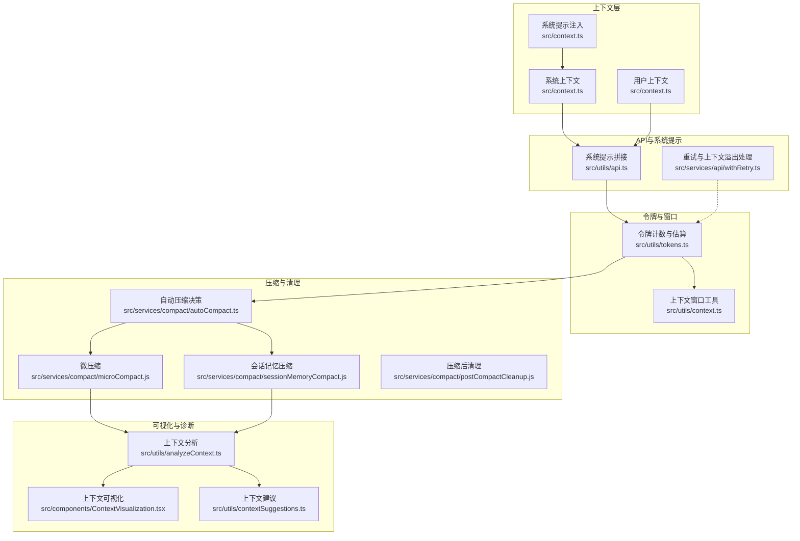
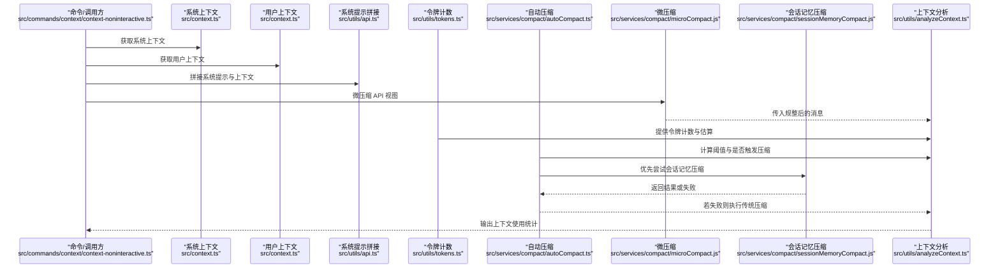
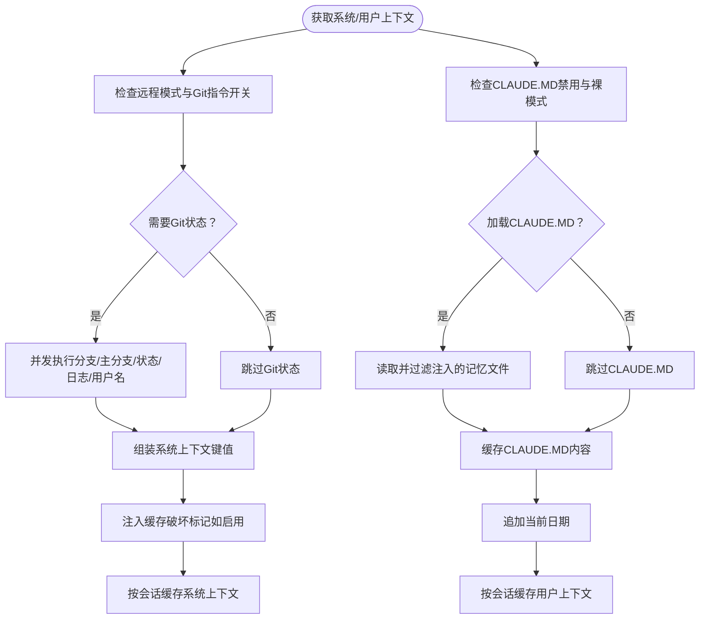
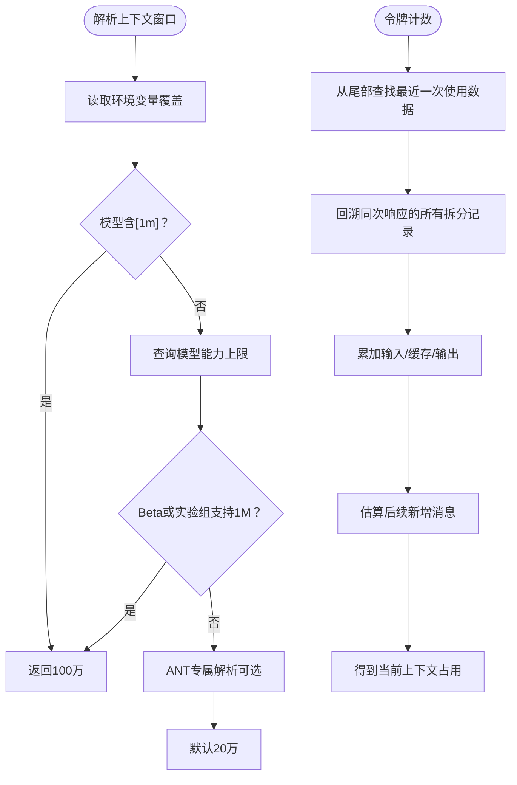
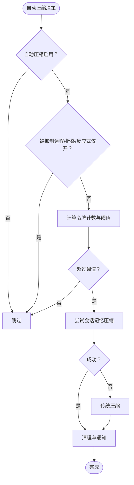
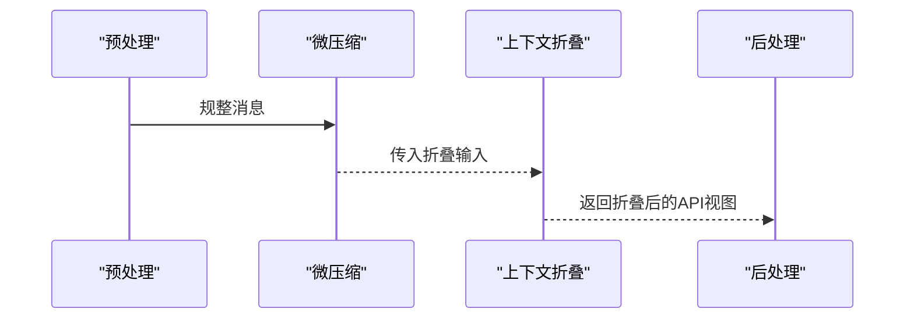
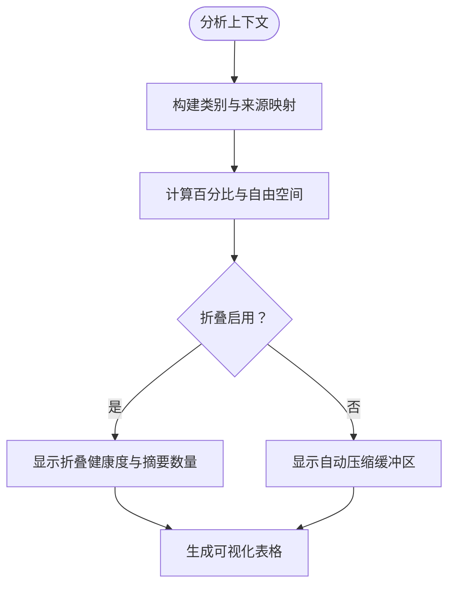
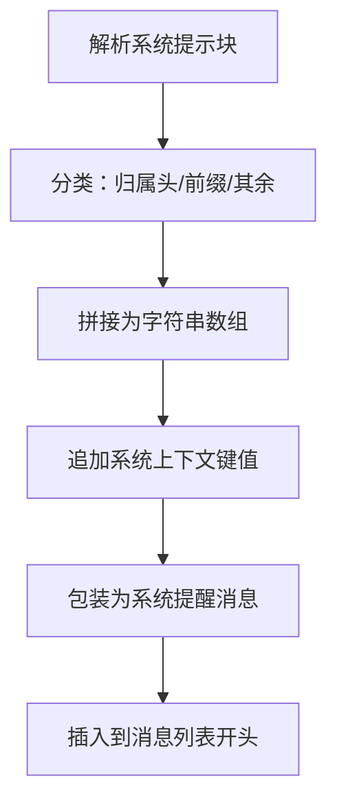
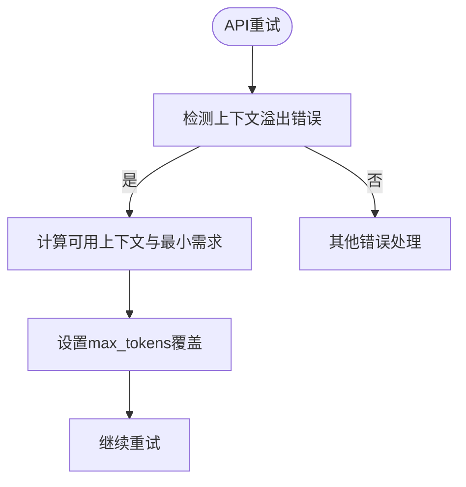
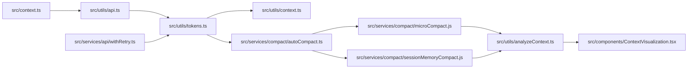

# 上下文构建机制

<cite>
**本文引用的文件**
- [README.md](file://README.md)
- [src/context.ts](file://src/context.ts)
- [src/utils/context.ts](file://src/utils/context.ts)
- [src/utils/tokens.ts](file://src/utils/tokens.ts)
- [src/services/compact/autoCompact.ts](file://src/services/compact/autoCompact.ts)
- [src/commands/context/context-noninteractive.ts](file://src/commands/context/context-noninteractive.ts)
- [src/services/compact/compact.ts](file://src/services/compact/compact.ts)
- [src/services/compact/microCompact.js](file://src/services/compact/microCompact.js)
- [src/services/compact/postCompactCleanup.js](file://src/services/compact/postCompactCleanup.js)
- [src/services/compact/sessionMemoryCompact.js](file://src/services/compact/sessionMemoryCompact.js)
- [src/utils/analyzeContext.ts](file://src/utils/analyzeContext.ts)
- [src/utils/contextSuggestions.ts](file://src/utils/contextSuggestions.ts)
- [src/services/api/withRetry.ts](file://src/services/api/withRetry.ts)
- [src/utils/api.ts](file://src/utils/api.ts)
- [src/components/ContextVisualization.tsx](file://src/components/ContextVisualization.tsx)
- [services/contextCollapse/index.js](file://services/contextCollapse/index.js)
- [services/contextCollapse/operations.js](file://services/contextCollapse/operations.js)
</cite>

## 目录
1. [简介](#简介)
2. [项目结构](#项目结构)
3. [核心组件](#核心组件)
4. [架构总览](#架构总览)
5. [详细组件分析](#详细组件分析)
6. [依赖关系分析](#依赖关系分析)
7. [性能考量](#性能考量)
8. [故障排查指南](#故障排查指南)
9. [结论](#结论)
10. [附录](#附录)

## 简介
本文件系统性阐述 Claude Code 的上下文构建机制，覆盖对话历史、系统提示、用户上下文与系统上下文的整合流程；解释上下文压缩算法（自动压缩、微压缩、会话记忆压缩、历史截断）的工作原理；说明上下文窗口管理、令牌计数策略与内存优化技术；并提供上下文构建过程中的数据转换、格式标准化与性能监控方法，以及可配置项与自定义路径、常见问题排查与解决方案。

## 项目结构
围绕上下文构建的关键模块分布如下：
- 上下文注入与缓存：系统上下文与用户上下文的生成、缓存与注入
- 令牌计数与窗口管理：上下文窗口大小解析、有效窗口计算、令牌估算
- 压缩与清理：自动压缩、微压缩、会话记忆压缩、压缩后清理
- 可视化与诊断：上下文使用可视化、建议与统计
- 上下文折叠（可选）：在特定特性开启时对上下文进行重构以提升效率

图表来源
- [src/context.ts:116-190](file://src/context.ts#L116-L190)
- [src/utils/context.ts:51-98](file://src/utils/context.ts#L51-L98)
- [src/utils/tokens.ts:226-262](file://src/utils/tokens.ts#L226-L262)
- [src/services/compact/autoCompact.ts:160-239](file://src/services/compact/autoCompact.ts#L160-L239)
- [src/services/compact/microCompact.js:1-4](file://src/services/compact/microCompact.js#L1-L4)
- [src/services/compact/sessionMemoryCompact.js:1-4](file://src/services/compact/sessionMemoryCompact.js#L1-L4)
- [src/services/compact/postCompactCleanup.js:1-4](file://src/services/compact/postCompactCleanup.js#L1-L4)
- [src/utils/analyzeContext.ts:1105-1132](file://src/utils/analyzeContext.ts#L1105-L1132)
- [src/utils/contextSuggestions.ts:197-235](file://src/utils/contextSuggestions.ts#L197-L235)
- [src/utils/api.ts:437-467](file://src/utils/api.ts#L437-L467)
- [src/services/api/withRetry.ts:384-427](file://src/services/api/withRetry.ts#L384-L427)

章节来源
- [README.md:650-689](file://README.md#L650-L689)
- [src/context.ts:116-190](file://src/context.ts#L116-L190)
- [src/utils/context.ts:51-98](file://src/utils/context.ts#L51-L98)
- [src/utils/tokens.ts:226-262](file://src/utils/tokens.ts#L226-L262)
- [src/services/compact/autoCompact.ts:160-239](file://src/services/compact/autoCompact.ts#L160-L239)
- [src/commands/context/context-noninteractive.ts:34-77](file://src/commands/context/context-noninteractive.ts#L34-L77)
- [src/utils/analyzeContext.ts:1105-1132](file://src/utils/analyzeContext.ts#L1105-L1132)
- [src/utils/contextSuggestions.ts:197-235](file://src/utils/contextSuggestions.ts#L197-L235)
- [src/utils/api.ts:437-467](file://src/utils/api.ts#L437-L467)
- [src/services/api/withRetry.ts:384-427](file://src/services/api/withRetry.ts#L384-L427)

## 核心组件
- 系统上下文与用户上下文
  - 系统上下文包含 Git 状态、缓存破坏注入等，按会话缓存，避免重复计算
  - 用户上下文包含 CLAUDE.MD 内容、当前日期等，按会话缓存
- 令牌计数与上下文窗口
  - 使用最近一次 API 响应的使用数据作为基准，结合粗略估算新增消息，得到“当前上下文窗口占用”的准确估计
  - 上下文窗口大小根据模型能力、特性开关与环境变量解析
- 自动压缩与阈值
  - 基于有效上下文窗口与缓冲区计算触发阈值，支持测试覆盖与阻断限制覆盖
  - 在上下文折叠开启时抑制自动压缩，避免竞争
- 微压缩与会话记忆压缩
  - 微压缩在进入 API 调用前对消息进行轻量规整
  - 会话记忆压缩优先尝试，失败再回退到传统压缩
- 可视化与建议
  - 提供上下文使用可视化卡片，展示各类别占用、折叠状态与建议
- API 重试与上下文溢出处理
  - 针对上下文溢出错误动态调整输出预算，保障请求可继续

章节来源
- [src/context.ts:116-190](file://src/context.ts#L116-L190)
- [src/utils/tokens.ts:226-262](file://src/utils/tokens.ts#L226-L262)
- [src/utils/context.ts:51-98](file://src/utils/context.ts#L51-L98)
- [src/services/compact/autoCompact.ts:72-145](file://src/services/compact/autoCompact.ts#L72-L145)
- [src/services/compact/microCompact.js:1-4](file://src/services/compact/microCompact.js#L1-L4)
- [src/services/compact/sessionMemoryCompact.js:1-4](file://src/services/compact/sessionMemoryCompact.js#L1-L4)
- [src/components/ContextVisualization.tsx:14-134](file://src/components/ContextVisualization.tsx#L14-L134)
- [src/services/api/withRetry.ts:384-427](file://src/services/api/withRetry.ts#L384-L427)

## 架构总览
上下文构建从“系统提示 + 系统上下文 + 用户上下文 + 对话历史”开始，经过微压缩与可选的上下文折叠，最终形成模型可见的 API 视图，并通过令牌计数与阈值策略决定是否触发自动压缩或会话记忆压缩。

图表来源
- [src/commands/context/context-noninteractive.ts:34-77](file://src/commands/context/context-noninteractive.ts#L34-L77)
- [src/context.ts:116-190](file://src/context.ts#L116-L190)
- [src/utils/api.ts:437-467](file://src/utils/api.ts#L437-L467)
- [src/services/compact/microCompact.js:1-4](file://src/services/compact/microCompact.js#L1-L4)
- [src/utils/tokens.ts:226-262](file://src/utils/tokens.ts#L226-L262)
- [src/services/compact/autoCompact.ts:160-239](file://src/services/compact/autoCompact.ts#L160-L239)
- [src/services/compact/sessionMemoryCompact.js:1-4](file://src/services/compact/sessionMemoryCompact.js#L1-L4)
- [src/utils/analyzeContext.ts:1105-1132](file://src/utils/analyzeContext.ts#L1105-L1132)

## 详细组件分析

### 组件A：上下文注入与缓存（系统/用户）
- 系统上下文
  - 包含 Git 状态、缓存破坏注入标记等，按会话缓存，变更注入时清空缓存
  - 在远程模式或禁用 Git 指令时跳过 Git 状态采集
- 用户上下文
  - 支持禁用 CLAUDE.MD、裸模式下的自动发现行为，缓存 CLAUDE.MD 内容供分类器使用
  - 注入当前日期信息

图表来源
- [src/context.ts:116-190](file://src/context.ts#L116-L190)

章节来源
- [src/context.ts:116-190](file://src/context.ts#L116-L190)

### 组件B：令牌计数与上下文窗口管理
- 上下文窗口大小解析
  - 支持环境变量覆盖、[1m] 后缀、模型能力检测、Beta 开关与实验组配置
- 有效上下文窗口与自动压缩阈值
  - 扣除最大摘要输出预算，得到“有效窗口”
  - 自动压缩阈值 = 有效窗口 − 缓冲区
- 令牌计数策略
  - 以最近一次带使用数据的助手消息为锚点，向前回溯同次响应的所有拆分记录，累加使用量并加上后续消息的粗略估算
  - 提供“最终上下文窗口”用于任务预算剩余计算

图表来源
- [src/utils/context.ts:51-98](file://src/utils/context.ts#L51-L98)
- [src/utils/tokens.ts:226-262](file://src/utils/tokens.ts#L226-L262)

章节来源
- [src/utils/context.ts:51-98](file://src/utils/context.ts#L51-L98)
- [src/utils/tokens.ts:226-262](file://src/utils/tokens.ts#L226-L262)

### 组件C：自动压缩与阈值判定
- 触发条件
  - 自动压缩启用且未被抑制（远程模式、上下文折叠、反应式仅开等）
  - 当前令牌计数 ≥ 自动压缩阈值
- 失败保护
  - 连续失败超过阈值即熔断，避免无意义重试
- 优先级
  - 先尝试会话记忆压缩，失败再走传统压缩
  - 压缩后执行清理与提示缓存破坏通知

图表来源
- [src/services/compact/autoCompact.ts:160-239](file://src/services/compact/autoCompact.ts#L160-L239)
- [src/services/compact/autoCompact.ts:241-351](file://src/services/compact/autoCompact.ts#L241-L351)

章节来源
- [src/services/compact/autoCompact.ts:160-239](file://src/services/compact/autoCompact.ts#L160-L239)
- [src/services/compact/autoCompact.ts:241-351](file://src/services/compact/autoCompact.ts#L241-L351)

### 组件D：微压缩与上下文折叠
- 微压缩
  - 在进入 API 调用前对消息进行轻量规整，减少冗余与噪声
- 上下文折叠（可选）
  - 在特性开启时，对消息进行项目视图重构，提升上下文效率
  - 折叠状态与统计在可视化中展示

图表来源
- [src/commands/context/context-noninteractive.ts:49-58](file://src/commands/context/context-noninteractive.ts#L49-L58)
- [services/contextCollapse/operations.js:1-4](file://services/contextCollapse/operations.js#L1-L4)
- [src/components/ContextVisualization.tsx:21-47](file://src/components/ContextVisualization.tsx#L21-L47)

章节来源
- [src/commands/context/context-noninteractive.ts:49-58](file://src/commands/context/context-noninteractive.ts#L49-L58)
- [services/contextCollapse/operations.js:1-4](file://services/contextCollapse/operations.js#L1-L4)
- [src/components/ContextVisualization.tsx:21-47](file://src/components/ContextVisualization.tsx#L21-L47)

### 组件E：上下文分析与可视化
- 分析维度
  - 类别占用（系统提示、工具、代理、技能、记忆文件、消息分解等）
  - 自动压缩缓冲区、可用空间占比
  - 上下文折叠状态与健康度
- 建议
  - 当自动压缩关闭且接近容量时给出启用建议
  - 当记忆文件占用高时给出修剪建议

图表来源
- [src/utils/analyzeContext.ts:1105-1132](file://src/utils/analyzeContext.ts#L1105-L1132)
- [src/utils/contextSuggestions.ts:197-235](file://src/utils/contextSuggestions.ts#L197-L235)
- [src/components/ContextVisualization.tsx:14-134](file://src/components/ContextVisualization.tsx#L14-L134)

章节来源
- [src/utils/analyzeContext.ts:1105-1132](file://src/utils/analyzeContext.ts#L1105-L1132)
- [src/utils/contextSuggestions.ts:197-235](file://src/utils/contextSuggestions.ts#L197-L235)
- [src/components/ContextVisualization.tsx:14-134](file://src/components/ContextVisualization.tsx#L14-L134)

### 组件F：系统提示拼接与数据转换
- 系统提示块解析
  - 将系统提示按块类型与缓存作用域进行归类
- 系统上下文拼接
  - 将系统上下文键值对转为文本并追加到系统提示末尾
- 用户上下文包装
  - 将用户上下文封装为“系统提醒”消息插入对话历史

图表来源
- [src/utils/api.ts:415-447](file://src/utils/api.ts#L415-L447)
- [src/utils/api.ts:449-467](file://src/utils/api.ts#L449-L467)

章节来源
- [src/utils/api.ts:415-447](file://src/utils/api.ts#L415-L447)
- [src/utils/api.ts:449-467](file://src/utils/api.ts#L449-L467)

### 组件G：API 重试与上下文溢出处理
- 针对“上下文窗口超限”类错误，动态调整 max_tokens，确保有足够空间容纳思考与至少一个输出 token
- 保留安全下限，避免极端情况

图表来源
- [src/services/api/withRetry.ts:384-427](file://src/services/api/withRetry.ts#L384-L427)

章节来源
- [src/services/api/withRetry.ts:384-427](file://src/services/api/withRetry.ts#L384-L427)

## 依赖关系分析
- 模块耦合
  - 上下文注入依赖环境与特性开关，避免在不适用场景产生开销
  - 令牌计数依赖最近一次使用数据，保证阈值判断准确
  - 自动压缩依赖上下文折叠与反应式模式的抑制逻辑，避免竞争
- 外部依赖
  - 系统提示解析与拼接依赖统一的系统提示块规范
  - API 重试依赖错误解析与上下文溢出专用处理

图表来源
- [src/context.ts:116-190](file://src/context.ts#L116-L190)
- [src/utils/api.ts:437-467](file://src/utils/api.ts#L437-L467)
- [src/utils/tokens.ts:226-262](file://src/utils/tokens.ts#L226-L262)
- [src/utils/context.ts:51-98](file://src/utils/context.ts#L51-L98)
- [src/services/compact/autoCompact.ts:160-239](file://src/services/compact/autoCompact.ts#L160-L239)
- [src/services/compact/microCompact.js:1-4](file://src/services/compact/microCompact.js#L1-L4)
- [src/services/compact/sessionMemoryCompact.js:1-4](file://src/services/compact/sessionMemoryCompact.js#L1-L4)
- [src/utils/analyzeContext.ts:1105-1132](file://src/utils/analyzeContext.ts#L1105-L1132)
- [src/components/ContextVisualization.tsx:14-134](file://src/components/ContextVisualization.tsx#L14-L134)
- [src/services/api/withRetry.ts:384-427](file://src/services/api/withRetry.ts#L384-L427)

章节来源
- [src/context.ts:116-190](file://src/context.ts#L116-L190)
- [src/utils/api.ts:437-467](file://src/utils/api.ts#L437-L467)
- [src/utils/tokens.ts:226-262](file://src/utils/tokens.ts#L226-L262)
- [src/utils/context.ts:51-98](file://src/utils/context.ts#L51-L98)
- [src/services/compact/autoCompact.ts:160-239](file://src/services/compact/autoCompact.ts#L160-L239)
- [src/services/compact/microCompact.js:1-4](file://src/services/compact/microCompact.js#L1-L4)
- [src/services/compact/sessionMemoryCompact.js:1-4](file://src/services/compact/sessionMemoryCompact.js#L1-L4)
- [src/utils/analyzeContext.ts:1105-1132](file://src/utils/analyzeContext.ts#L1105-L1132)
- [src/components/ContextVisualization.tsx:14-134](file://src/components/ContextVisualization.tsx#L14-L134)
- [src/services/api/withRetry.ts:384-427](file://src/services/api/withRetry.ts#L384-L427)

## 性能考量
- 令牌计数准确性
  - 使用“最近一次使用数据 + 后续消息粗略估算”的组合，避免累计计数导致的重复计数误差
- 缓存与懒加载
  - 系统/用户上下文按会话缓存，Git 状态并发采集并截断长输出，降低重复 I/O
- 压缩策略选择
  - 优先会话记忆压缩，失败再传统压缩，减少不必要的大范围摘要
- 上下文折叠
  - 在折叠启用时跳过自动压缩缓冲区显示，避免误导用户感知
- 错误恢复
  - 针对上下文溢出错误动态调整输出预算，提高成功率与稳定性

[本节为通用性能讨论，无需具体文件分析]

## 故障排查指南
- 自动压缩未触发
  - 检查自动压缩开关、远程模式、上下文折叠与反应式仅开等抑制条件
  - 使用上下文可视化确认是否处于折叠模式或缓冲区被跳过
- 上下文接近容量
  - 启用自动压缩或手动执行压缩；查看建议面板中的修剪建议
- 上下文溢出错误
  - 查看重试逻辑是否已调整 max_tokens；确认思考预算与最小输出需求
- 折叠状态异常
  - 检查折叠特性开关与健康度统计；关注空运行警告与错误计数

章节来源
- [src/services/compact/autoCompact.ts:160-239](file://src/services/compact/autoCompact.ts#L160-L239)
- [src/utils/contextSuggestions.ts:197-235](file://src/utils/contextSuggestions.ts#L197-L235)
- [src/services/api/withRetry.ts:384-427](file://src/services/api/withRetry.ts#L384-L427)
- [src/components/ContextVisualization.tsx:14-134](file://src/components/ContextVisualization.tsx#L14-L134)

## 结论
Claude Code 的上下文构建机制通过“系统提示 + 系统/用户上下文 + 对话历史”的整合，配合精确的令牌计数与灵活的上下文窗口管理，在自动压缩、微压缩与会话记忆压缩之间实现高效平衡。在上下文折叠开启时，系统进一步抑制自动压缩以避免竞争，同时提供可视化与建议帮助用户优化上下文占用。针对上下文溢出等异常，系统具备动态调整与熔断保护，确保稳定与可恢复性。

[本节为总结性内容，无需具体文件分析]

## 附录

### 配置选项与自定义路径
- 环境变量
  - 上下文窗口覆盖、自动压缩百分比覆盖、阻断限制覆盖、1M 上下文禁用等
- 特性开关
  - 上下文折叠、反应式仅开、缓存破坏注入等
- 工具与系统提示
  - 系统提示块解析与缓存作用域、系统提醒消息包装

章节来源
- [src/services/compact/autoCompact.ts:72-91](file://src/services/compact/autoCompact.ts#L72-L91)
- [src/services/compact/autoCompact.ts:127-135](file://src/services/compact/autoCompact.ts#L127-L135)
- [src/context.ts:22-34](file://src/context.ts#L22-L34)
- [src/utils/api.ts:415-447](file://src/utils/api.ts#L415-L447)
- [src/utils/api.ts:449-467](file://src/utils/api.ts#L449-L467)