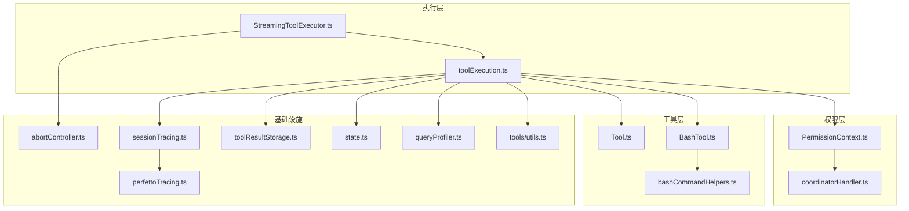
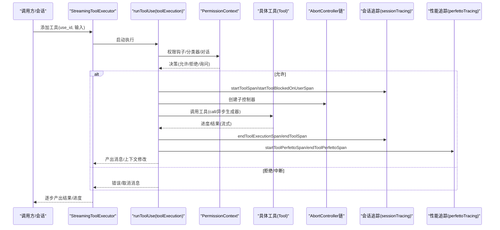
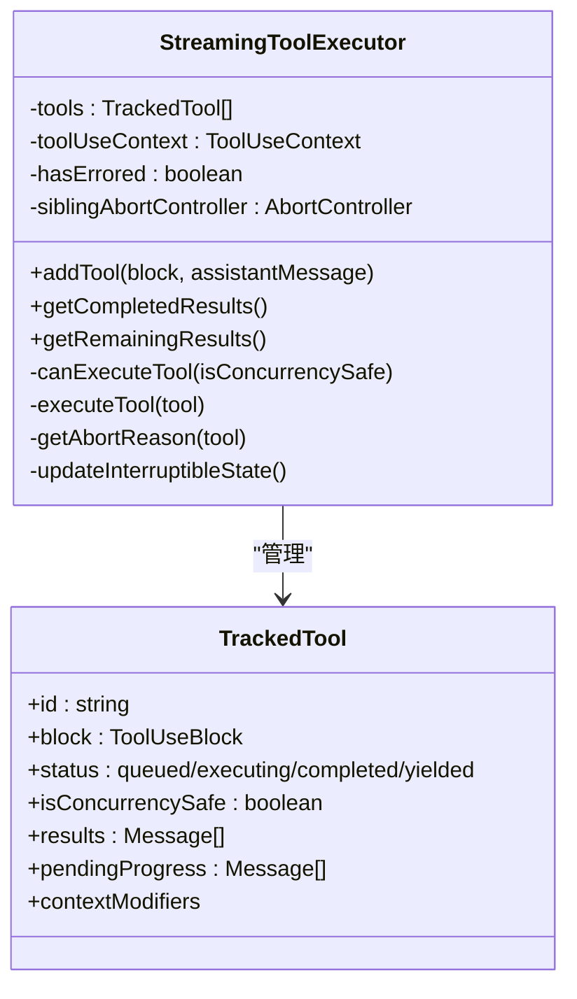
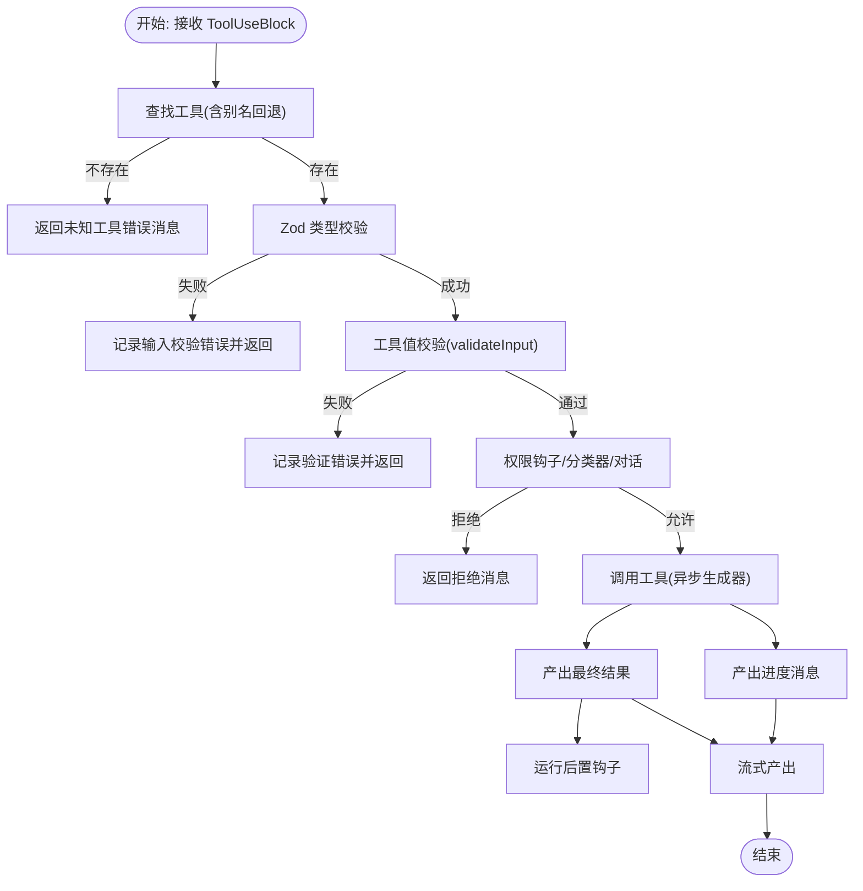
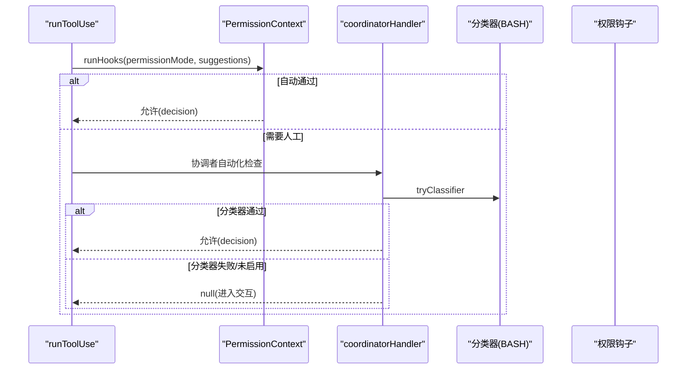
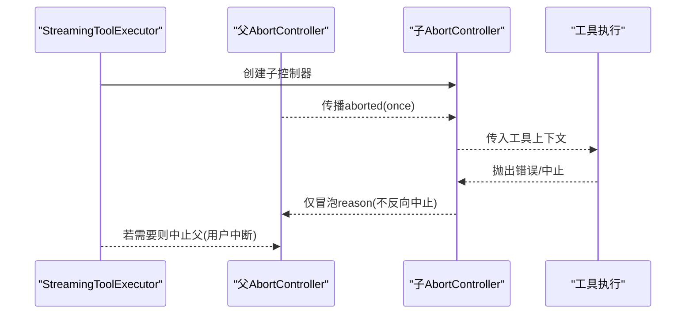
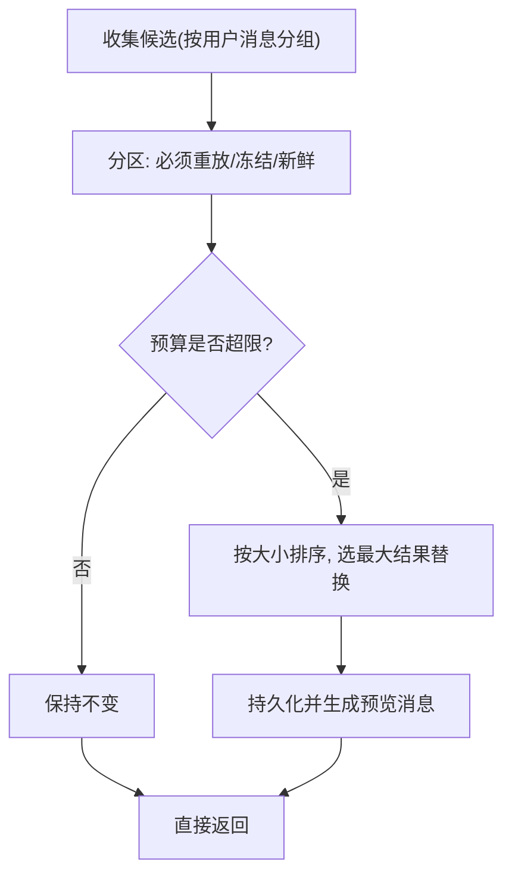
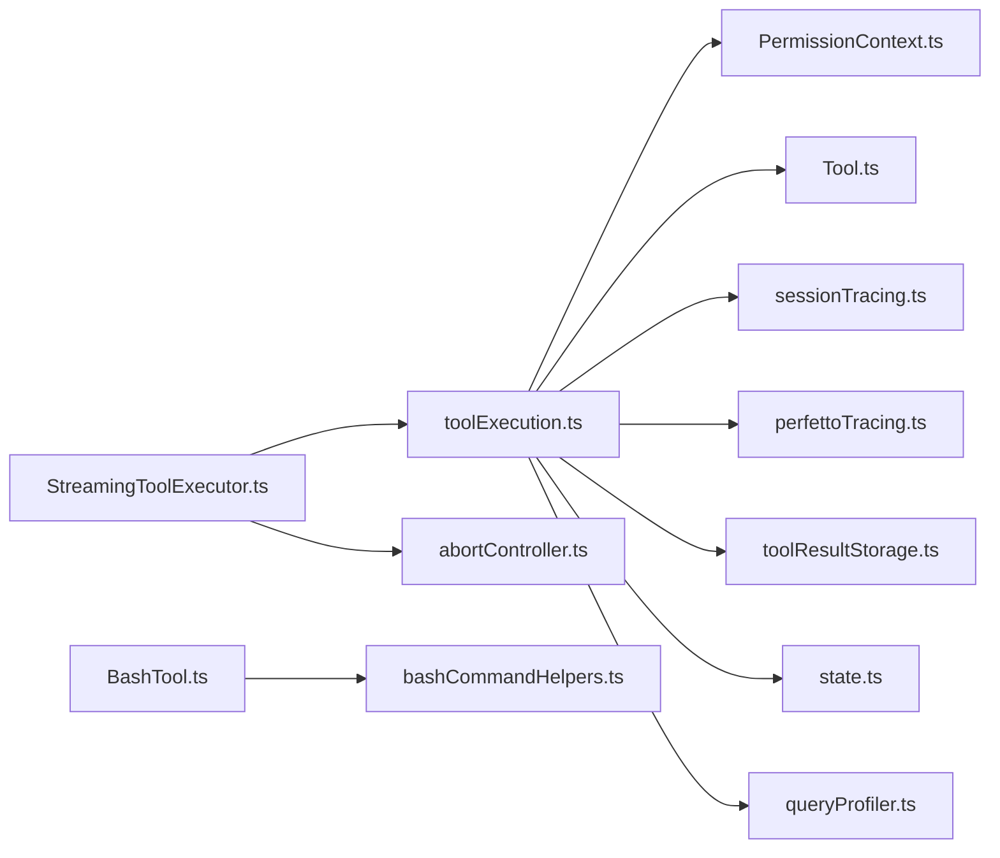

# 工具执行流程

<cite>
**本文引用的文件**
- [StreamingToolExecutor.ts](file://src/services/tools/StreamingToolExecutor.ts)
- [toolExecution.ts](file://src/services/tools/toolExecution.ts)
- [Tool.ts](file://src/Tool.ts)
- [PermissionContext.ts](file://src/hooks/toolPermission/PermissionContext.ts)
- [coordinatorHandler.ts](file://src/hooks/toolPermission/handlers/coordinatorHandler.ts)
- [abortController.ts](file://src/utils/abortController.ts)
- [toolResultStorage.ts](file://src/utils/toolResultStorage.ts)
- [sessionTracing.ts](file://src/utils/telemetry/sessionTracing.ts)
- [perfettoTracing.ts](file://src/utils/telemetry/perfettoTracing.ts)
- [bashCommandHelpers.ts](file://src/tools/BashTool/bashCommandHelpers.ts)
- [bashTool.ts](file://src/tools/BashTool/BashTool.ts)
- [state.ts](file://src/bootstrap/state.ts)
- [queryProfiler.ts](file://src/utils/queryProfiler.ts)
- [utils.ts](file://src/tools/utils.ts)
</cite>

## 目录
1. [简介](#简介)
2. [项目结构](#项目结构)
3. [核心组件](#核心组件)
4. [架构总览](#架构总览)
5. [详细组件分析](#详细组件分析)
6. [依赖关系分析](#依赖关系分析)
7. [性能考量](#性能考量)
8. [故障排查指南](#故障排查指南)
9. [结论](#结论)

## 简介
本文件系统性梳理 Claude Code 的工具执行流程，覆盖从工具发现、权限验证、执行调度到结果处理的全链路。重点阐述流式工具执行器（StreamingToolExecutor）的并发控制、错误传播与资源管理；解释状态跟踪、进度上报与中断处理；说明工具结果的聚合、过滤与格式化策略；并给出性能监控指标、优化建议与故障恢复机制。

## 项目结构
围绕工具执行的关键模块分布如下：
- 执行调度与流式输出：src/services/tools/StreamingToolExecutor.ts
- 工具调用主流程与权限校验：src/services/tools/toolExecution.ts
- 工具抽象与上下文：src/Tool.ts
- 权限上下文与自动化检查：src/hooks/toolPermission/PermissionContext.ts、src/hooks/toolPermission/handlers/coordinatorHandler.ts
- 中断与信号传播：src/utils/abortController.ts
- 结果持久化与预算控制：src/utils/toolResultStorage.ts
- 性能追踪与会话追踪：src/utils/telemetry/sessionTracing.ts、src/utils/telemetry/perfettoTracing.ts
- Bash 工具命令解析与权限辅助：src/tools/BashTool/bashCommandHelpers.ts、src/tools/BashTool/BashTool.ts
- 全局统计与计数：src/bootstrap/state.ts
- 查询阶段耗时分析：src/utils/queryProfiler.ts
- 工具消息标记与提取：src/tools/utils.ts

图表来源
- [StreamingToolExecutor.ts:1-531](file://src/services/tools/StreamingToolExecutor.ts#L1-531)
- [toolExecution.ts:1-800](file://src/services/tools/toolExecution.ts#L1-800)
- [Tool.ts:158-300](file://src/Tool.ts#L158-300)
- [PermissionContext.ts:96-389](file://src/hooks/toolPermission/PermissionContext.ts#L96-389)
- [coordinatorHandler.ts:26-66](file://src/hooks/toolPermission/handlers/coordinatorHandler.ts#L26-66)
- [abortController.ts:68-100](file://src/utils/abortController.ts#L68-100)
- [sessionTracing.ts:466-736](file://src/utils/telemetry/sessionTracing.ts#L466-736)
- [perfettoTracing.ts:696-763](file://src/utils/telemetry/perfettoTracing.ts#L696-763)
- [toolResultStorage.ts:137-334](file://src/utils/toolResultStorage.ts#L137-334)
- [state.ts:582-621](file://src/bootstrap/state.ts#L582-621)
- [queryProfiler.ts:205-262](file://src/utils/queryProfiler.ts#L205-262)
- [utils.ts:12-41](file://src/tools/utils.ts#L12-41)

章节来源
- [StreamingToolExecutor.ts:1-531](file://src/services/tools/StreamingToolExecutor.ts#L1-531)
- [toolExecution.ts:1-800](file://src/services/tools/toolExecution.ts#L1-800)

## 核心组件
- 流式工具执行器（StreamingToolExecutor）
  - 负责工具入队、并发安全判断、执行与结果产出；支持进度消息优先投递、错误传播与中断处理。
- 工具调用主流程（runToolUse）
  - 完整的工具调用生命周期：工具查找、输入校验、权限决策、钩子执行、工具调用、结果处理与后置钩子。
- 工具抽象（Tool）
  - 统一的工具接口定义，包含输入/输出模式、并发安全、中断行为、渲染与描述等能力。
- 权限上下文（PermissionContext）
  - 封装权限决策、钩子执行、分类器自动审批、持久化更新与交互提示。
- 中断控制器（AbortController 链）
  - 提供父子弱引用传播、一次性清理与内存安全的信号传递。
- 结果存储与预算（toolResultStorage）
  - 大结果落盘与预览、消息级预算强制替换、前缀稳定与重放一致性。
- 追踪与性能（sessionTracing/perfettoTracing）
  - 会话/工具/阻塞等待/执行阶段的 OpenTelemetry 与 Perfetto 双轨追踪。
- Bash 工具辅助（bashCommandHelpers/BashTool）
  - 命令解析、权限检查与 Bash 特定的并发错误传播策略。

章节来源
- [StreamingToolExecutor.ts:40-124](file://src/services/tools/StreamingToolExecutor.ts#L40-124)
- [toolExecution.ts:337-490](file://src/services/tools/toolExecution.ts#L337-490)
- [Tool.ts:362-473](file://src/Tool.ts#L362-473)
- [PermissionContext.ts:96-348](file://src/hooks/toolPermission/PermissionContext.ts#L96-348)
- [abortController.ts:68-100](file://src/utils/abortController.ts#L68-100)
- [toolResultStorage.ts:137-334](file://src/utils/toolResultStorage.ts#L137-334)
- [sessionTracing.ts:466-736](file://src/utils/telemetry/sessionTracing.ts#L466-736)
- [perfettoTracing.ts:696-763](file://src/utils/telemetry/perfettoTracing.ts#L696-763)
- [bashCommandHelpers.ts:181-202](file://src/tools/BashTool/bashCommandHelpers.ts#L181-202)
- [bashTool.ts](file://src/tools/BashTool/BashTool.ts)

## 架构总览
下图展示一次工具调用从“流式执行器”到“工具实现”的端到端路径，以及权限与追踪贯穿其中的关键节点。

图表来源
- [StreamingToolExecutor.ts:265-405](file://src/services/tools/StreamingToolExecutor.ts#L265-405)
- [toolExecution.ts:492-570](file://src/services/tools/toolExecution.ts#L492-570)
- [PermissionContext.ts:216-263](file://src/hooks/toolPermission/PermissionContext.ts#L216-263)
- [sessionTracing.ts:466-736](file://src/utils/telemetry/sessionTracing.ts#L466-736)
- [perfettoTracing.ts:696-763](file://src/utils/telemetry/perfettoTracing.ts#L696-763)

## 详细组件分析

### 流式工具执行器（StreamingToolExecutor）
- 并发控制
  - 通过 isConcurrencySafe 字段区分并发安全工具与串行工具；仅当无并发工具在执行或当前工具与已执行工具均为并发安全时才启动新工具。
- 执行与结果产出
  - 使用 runToolUse 生成器逐条产出消息；进度消息优先投递，非进度消息按顺序累积；完成工具更新上下文并标记完成。
- 错误传播与中断
  - Bash 工具错误会触发兄弟进程级联中止；用户中断根据工具 interruptBehavior 决定是否取消；支持“流式回退丢弃”场景。
- 上下文与状态
  - 维护 inProgressToolUseIDs、interruptible 状态标志与工具描述摘要，用于 UI 与后续钩子。

图表来源
- [StreamingToolExecutor.ts:19-62](file://src/services/tools/StreamingToolExecutor.ts#L19-62)
- [StreamingToolExecutor.ts:129-151](file://src/services/tools/StreamingToolExecutor.ts#L129-151)
- [StreamingToolExecutor.ts:265-405](file://src/services/tools/StreamingToolExecutor.ts#L265-405)

章节来源
- [StreamingToolExecutor.ts:129-151](file://src/services/tools/StreamingToolExecutor.ts#L129-151)
- [StreamingToolExecutor.ts:265-405](file://src/services/tools/StreamingToolExecutor.ts#L265-405)
- [StreamingToolExecutor.ts:412-490](file://src/services/tools/StreamingToolExecutor.ts#L412-490)
- [StreamingToolExecutor.ts:453-490](file://src/services/tools/StreamingToolExecutor.ts#L453-490)

### 工具调用主流程（runToolUse）
- 工具发现与别名回退
  - 优先在可用工具集中查找，若未命中则尝试通过别名回退至基础工具集。
- 输入校验与值校验
  - 使用 zod schema 校验类型；再调用工具 validateInput 做业务规则校验。
- 权限决策与钩子
  - 执行前置钩子、分类器（Bash 专用）、用户确认；支持自动化检查失败时降级到交互对话。
- 工具调用与进度
  - 通过工具实现的异步生成器产出进度与最终结果；统一记录事件与追踪。
- 错误处理与后置钩子
  - 对异常进行分类与格式化；记录 OTel 事件；运行失败后置钩子。

图表来源
- [toolExecution.ts:337-490](file://src/services/tools/toolExecution.ts#L337-490)
- [toolExecution.ts:492-570](file://src/services/tools/toolExecution.ts#L492-570)
- [toolExecution.ts:599-753](file://src/services/tools/toolExecution.ts#L599-753)
- [toolExecution.ts:1134-1401](file://src/services/tools/toolExecution.ts#L1134-1401)
- [toolExecution.ts:1674-1713](file://src/services/tools/toolExecution.ts#L1674-1713)

章节来源
- [toolExecution.ts:337-490](file://src/services/tools/toolExecution.ts#L337-490)
- [toolExecution.ts:492-570](file://src/services/tools/toolExecution.ts#L492-570)
- [toolExecution.ts:599-753](file://src/services/tools/toolExecution.ts#L599-753)
- [toolExecution.ts:1134-1401](file://src/services/tools/toolExecution.ts#L1134-1401)
- [toolExecution.ts:1674-1713](file://src/services/tools/toolExecution.ts#L1674-1713)

### 权限验证与自动化检查
- 权限上下文（PermissionContext）
  - 提供 runHooks、tryClassifier、handleUserAllow/handleHookAllow、持久化权限更新、取消与中止等能力。
- 协调者权限处理器（coordinatorHandler）
  - 在协调者模式下顺序等待钩子与分类器，失败时降级到交互对话。
- Bash 命令权限辅助
  - 支持命令解析与操作符权限检查，为 Bash 工具提供更细粒度的权限判定。

图表来源
- [PermissionContext.ts:216-263](file://src/hooks/toolPermission/PermissionContext.ts#L216-263)
- [coordinatorHandler.ts:26-66](file://src/hooks/toolPermission/handlers/coordinatorHandler.ts#L26-66)
- [bashCommandHelpers.ts:181-202](file://src/tools/BashTool/bashCommandHelpers.ts#L181-202)

章节来源
- [PermissionContext.ts:96-348](file://src/hooks/toolPermission/PermissionContext.ts#L96-348)
- [coordinatorHandler.ts:26-66](file://src/hooks/toolPermission/handlers/coordinatorHandler.ts#L26-66)
- [bashCommandHelpers.ts:181-202](file://src/tools/BashTool/bashCommandHelpers.ts#L181-202)

### 中断与信号传播
- 子控制器链
  - createChildAbortController 实现父到子弱引用传播，避免循环引用；子中止不反向影响父；一次性监听自动清理。
- 流式执行器中的使用
  - 为每个工具创建独立子控制器；Bash 错误通过 siblingAbortController 触发兄弟进程级联中止；用户中断按工具 interruptBehavior 决策。

图表来源
- [abortController.ts:68-100](file://src/utils/abortController.ts#L68-100)
- [StreamingToolExecutor.ts:294-318](file://src/services/tools/StreamingToolExecutor.ts#L294-318)

章节来源
- [abortController.ts:68-100](file://src/utils/abortController.ts#L68-100)
- [StreamingToolExecutor.ts:294-318](file://src/services/tools/StreamingToolExecutor.ts#L294-318)

### 结果聚合、过滤与格式化
- 大结果持久化与预览
  - 超过阈值的结果写入磁盘，返回包含预览与文件路径的消息；支持 JSON/文本内容。
- 消息级预算强制替换
  - 按用户消息分组收集候选，基于“必须重放/冻结/新鲜”三态选择最大结果替换，确保前缀稳定与可重放。
- 空结果处理
  - 对空结果注入占位文本，避免模型在提示末尾误判停机序列。
- 工具消息标记
  - 为用户消息附加 sourceToolUseID，防止 UI 重复显示“正在运行”。

图表来源
- [toolResultStorage.ts:600-639](file://src/utils/toolResultStorage.ts#L600-639)
- [toolResultStorage.ts:649-692](file://src/utils/toolResultStorage.ts#L649-692)
- [toolResultStorage.ts:728-737](file://src/utils/toolResultStorage.ts#L728-737)
- [toolResultStorage.ts:137-184](file://src/utils/toolResultStorage.ts#L137-184)
- [toolResultStorage.ts:272-334](file://src/utils/toolResultStorage.ts#L272-334)
- [utils.ts:12-25](file://src/tools/utils.ts#L12-25)

章节来源
- [toolResultStorage.ts:137-334](file://src/utils/toolResultStorage.ts#L137-334)
- [toolResultStorage.ts:600-737](file://src/utils/toolResultStorage.ts#L600-737)
- [utils.ts:12-25](file://src/tools/utils.ts#L12-25)

### 状态跟踪、进度报告与中断处理
- 追踪
  - 会话/LLM 请求/工具/阻塞等待/执行阶段的 OpenTelemetry 与 Perfetto 双轨追踪；支持事件内容截断与属性扩展。
- 进度
  - 工具实现通过生成器产出进度消息；流式执行器优先投递进度，保证实时反馈。
- 中断
  - 用户中断按工具 interruptBehavior 决策；Bash 错误触发兄弟级联中止；流式回退丢弃待执行队列。

章节来源
- [sessionTracing.ts:466-736](file://src/utils/telemetry/sessionTracing.ts#L466-736)
- [perfettoTracing.ts:696-763](file://src/utils/telemetry/perfettoTracing.ts#L696-763)
- [StreamingToolExecutor.ts:366-382](file://src/services/tools/StreamingToolExecutor.ts#L366-382)
- [StreamingToolExecutor.ts:210-231](file://src/services/tools/StreamingToolExecutor.ts#L210-231)

## 依赖关系分析
- StreamingToolExecutor 依赖
  - 工具集合与工具定义（Tool.ts）、工具调用入口（toolExecution.ts）、中断控制器（abortController.ts）。
- toolExecution 依赖
  - 权限上下文（PermissionContext.ts）、追踪（sessionTracing.ts/perfettoTracing.ts）、结果存储（toolResultStorage.ts）、全局状态（state.ts）、查询分析（queryProfiler.ts）。
- 工具实现依赖
  - Bash 工具（BashTool.ts）与命令解析（bashCommandHelpers.ts）。

图表来源
- [StreamingToolExecutor.ts:1-531](file://src/services/tools/StreamingToolExecutor.ts#L1-531)
- [toolExecution.ts:1-800](file://src/services/tools/toolExecution.ts#L1-800)
- [Tool.ts:158-300](file://src/Tool.ts#L158-300)
- [PermissionContext.ts:96-348](file://src/hooks/toolPermission/PermissionContext.ts#L96-348)
- [sessionTracing.ts:466-736](file://src/utils/telemetry/sessionTracing.ts#L466-736)
- [perfettoTracing.ts:696-763](file://src/utils/telemetry/perfettoTracing.ts#L696-763)
- [toolResultStorage.ts:137-334](file://src/utils/toolResultStorage.ts#L137-334)
- [state.ts:582-621](file://src/bootstrap/state.ts#L582-621)
- [queryProfiler.ts:205-262](file://src/utils/queryProfiler.ts#L205-262)
- [bashTool.ts](file://src/tools/BashTool/BashTool.ts)
- [bashCommandHelpers.ts:181-202](file://src/tools/BashTool/bashCommandHelpers.ts#L181-202)
- [abortController.ts:68-100](file://src/utils/abortController.ts#L68-100)

章节来源
- [StreamingToolExecutor.ts:1-531](file://src/services/tools/StreamingToolExecutor.ts#L1-531)
- [toolExecution.ts:1-800](file://src/services/tools/toolExecution.ts#L1-800)

## 性能考量
- 并发策略
  - 并发安全工具可并行执行，串行工具严格串行，避免资源竞争与状态污染。
- 进度优先投递
  - 进度消息先于结果产出，降低感知延迟，提升交互体验。
- 大结果落盘
  - 超阈值结果落盘并返回预览，避免内存与网络压力。
- 追踪开销
  - OTel 与 Perfetto 双轨追踪可按需开启；工具输入/输出内容可配置截断，避免敏感信息泄露。
- 统计与分析
  - 全局工具耗时、轮次耗时与钩子耗时统计，结合查询阶段分析定位瓶颈。

章节来源
- [StreamingToolExecutor.ts:129-151](file://src/services/tools/StreamingToolExecutor.ts#L129-151)
- [toolResultStorage.ts:137-184](file://src/utils/toolResultStorage.ts#L137-184)
- [sessionTracing.ts:747-776](file://src/utils/telemetry/sessionTracing.ts#L747-776)
- [state.ts:582-621](file://src/bootstrap/state.ts#L582-621)
- [queryProfiler.ts:205-262](file://src/utils/queryProfiler.ts#L205-262)

## 故障排查指南
- 未知工具
  - 工具名称不存在或别名未匹配：返回错误消息并记录事件。
- 输入校验失败
  - Zod 类型校验失败或工具值校验失败：记录错误详情并返回。
- 权限拒绝
  - 钩子/分类器/用户拒绝：返回拒绝消息；必要时中止父级以结束本轮。
- Bash 错误级联
  - Bash 工具错误导致兄弟工具被中止；检查命令依赖链与工作目录。
- 中断处理
  - 用户中断按工具 interruptBehavior 决策；若为 cancel 则丢弃结果并中止父级。
- 结果为空
  - 注入占位文本避免模型误判；检查工具实现是否正确返回内容。
- 性能问题
  - 开启追踪与查询分析，定位慢点；评估并发策略与结果落盘阈值。

章节来源
- [toolExecution.ts:369-411](file://src/services/tools/toolExecution.ts#L369-411)
- [toolExecution.ts:614-733](file://src/services/tools/toolExecution.ts#L614-733)
- [toolExecution.ts:1674-1713](file://src/services/tools/toolExecution.ts#L1674-1713)
- [StreamingToolExecutor.ts:153-205](file://src/services/tools/StreamingToolExecutor.ts#L153-205)
- [StreamingToolExecutor.ts:354-364](file://src/services/tools/StreamingToolExecutor.ts#L354-364)
- [toolResultStorage.ts:287-295](file://src/utils/toolResultStorage.ts#L287-295)

## 结论
Claude Code 的工具执行流程通过“流式执行器 + 权限上下文 + 追踪与存储”的组合，实现了高并发、强一致、可观测且可恢复的工具调用体系。并发安全与中断传播保障了稳定性；大结果落盘与预算替换提升了可扩展性；双轨追踪与统计为性能优化提供了数据支撑。遵循本文档的流程与最佳实践，可在复杂场景中获得可靠的工具执行体验。