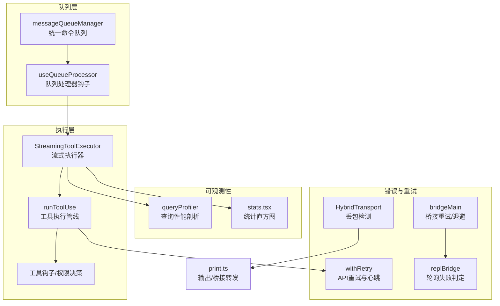
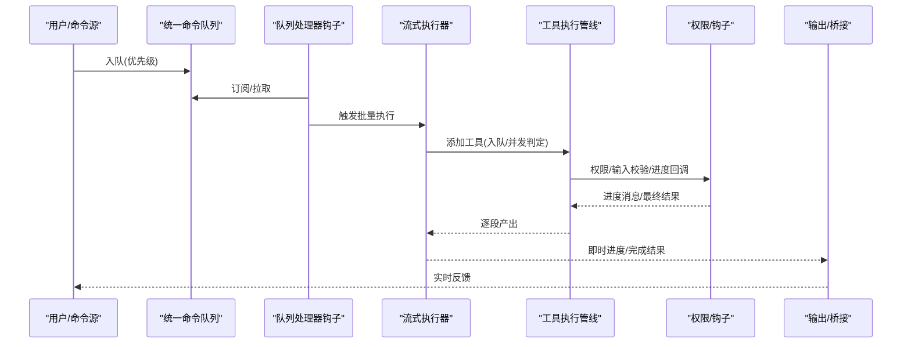
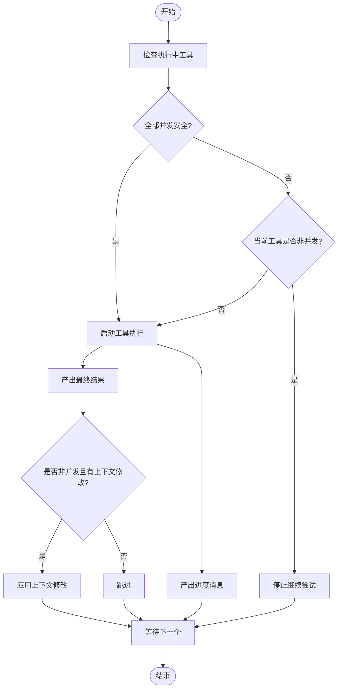
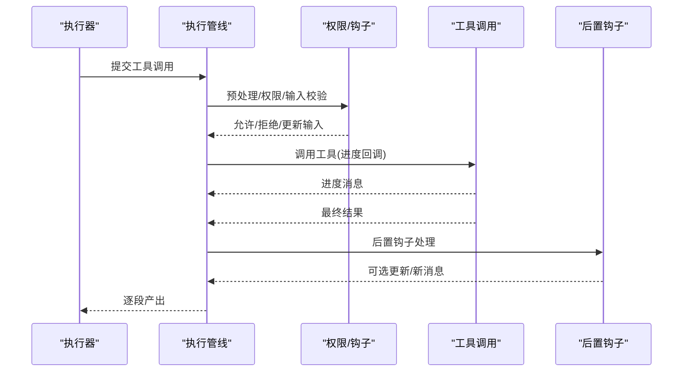
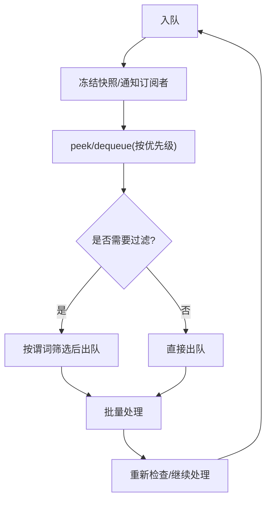
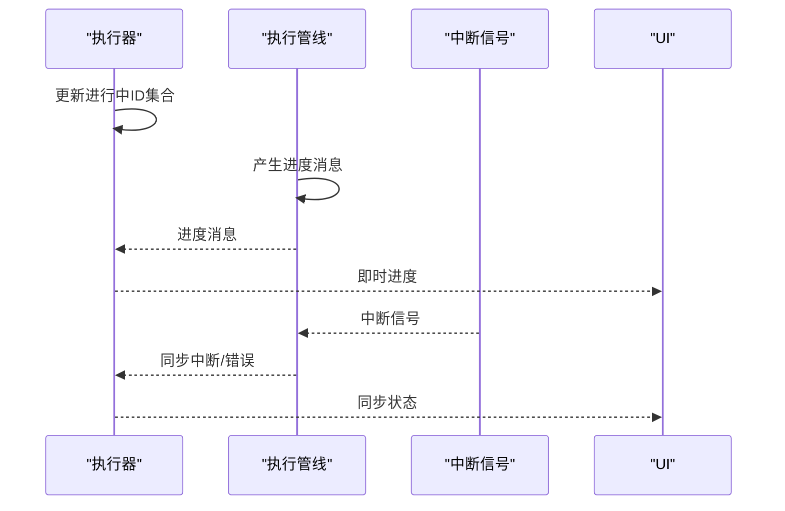
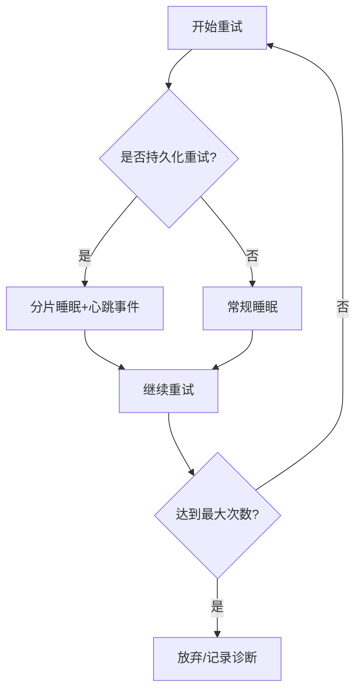
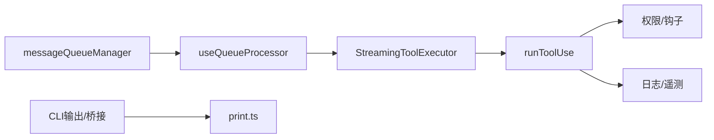

# 执行调度系统

<cite>
**本文引用的文件**
- [StreamingToolExecutor.ts](file://src/services/tools/StreamingToolExecutor.ts)
- [toolExecution.ts](file://src/services/tools/toolExecution.ts)
- [messageQueueManager.ts](file://src/utils/messageQueueManager.ts)
- [useQueueProcessor.ts](file://src/hooks/useQueueProcessor.ts)
- [queryProfiler.ts](file://src/utils/queryProfiler.ts)
- [sleep.ts](file://src/utils/sleep.ts)
- [withRetry.ts](file://src/services/api/withRetry.ts)
- [bridgeMain.ts](file://src/bridge/bridgeMain.ts)
- [replBridge.ts](file://src/bridge/replBridge.ts)
- [HybridTransport.ts](file://src/cli/transports/HybridTransport.ts)
- [print.ts](file://src/cli/print.ts)
- [stats.tsx](file://src/context/stats.tsx)
- [diagnosticTracking.ts](file://src/services/diagnosticTracking.ts)
- [messages.ts](file://src/utils/messages.ts)
- [query.ts](file://src/query.ts)
</cite>

## 目录
1. [简介](#简介)
2. [项目结构](#项目结构)
3. [核心组件](#核心组件)
4. [架构总览](#架构总览)
5. [详细组件分析](#详细组件分析)
6. [依赖关系分析](#依赖关系分析)
7. [性能考量](#性能考量)
8. [故障排查指南](#故障排查指南)
9. [结论](#结论)
10. [附录](#附录)

## 简介
本文件面向“工具执行调度系统”，围绕以下目标展开：工具队列管理（分区策略、并发安全、批量执行）、流式执行器（任务分配、资源池与负载均衡）、状态同步（工具使用ID跟踪、进度报告、中断处理）、错误处理与重试（超时、异常恢复、回滚）、性能监控与调优、以及故障诊断方法。文档以代码级可视化为主，辅以流程与时序图，帮助读者快速理解并高效运维该系统。

## 项目结构
本系统的关键实现集中在以下模块：
- 工具执行与流式调度：StreamingToolExecutor、runToolUse、工具钩子与权限决策
- 命令队列与优先级：统一命令队列、优先级出队、React钩子驱动的处理
- 性能与可观测性：查询性能剖析、统计直方图、内存快照
- 错误与重试：API重试与心跳、桥接连接重试与退避、传输层丢包检测
- 运行时状态与进度：进度消息、工具使用ID集合、中断行为

图表来源
- [StreamingToolExecutor.ts:40-531](file://src/services/tools/StreamingToolExecutor.ts#L40-L531)
- [toolExecution.ts:337-490](file://src/services/tools/toolExecution.ts#L337-L490)
- [messageQueueManager.ts:53-337](file://src/utils/messageQueueManager.ts#L53-L337)
- [useQueueProcessor.ts:28-68](file://src/hooks/useQueueProcessor.ts#L28-L68)
- [queryProfiler.ts:1-302](file://src/utils/queryProfiler.ts#L1-L302)
- [stats.tsx:38-88](file://src/context/stats.tsx#L38-L88)
- [withRetry.ts:477-514](file://src/services/api/withRetry.ts#L477-L514)
- [bridgeMain.ts:1314-1339](file://src/bridge/bridgeMain.ts#L1314-L1339)
- [replBridge.ts:2345-2364](file://src/bridge/replBridge.ts#L2345-L2364)
- [HybridTransport.ts:140-169](file://src/cli/transports/HybridTransport.ts#L140-L169)
- [print.ts:2216-2254](file://src/cli/print.ts#L2216-L2254)

章节来源
- [StreamingToolExecutor.ts:40-531](file://src/services/tools/StreamingToolExecutor.ts#L40-L531)
- [toolExecution.ts:337-490](file://src/services/tools/toolExecution.ts#L337-L490)
- [messageQueueManager.ts:53-337](file://src/utils/messageQueueManager.ts#L53-L337)
- [useQueueProcessor.ts:28-68](file://src/hooks/useQueueProcessor.ts#L28-L68)
- [queryProfiler.ts:1-302](file://src/utils/queryProfiler.ts#L1-L302)
- [stats.tsx:38-88](file://src/context/stats.tsx#L38-L88)
- [withRetry.ts:477-514](file://src/services/api/withRetry.ts#L477-L514)
- [bridgeMain.ts:1314-1339](file://src/bridge/bridgeMain.ts#L1314-L1339)
- [replBridge.ts:2345-2364](file://src/bridge/replBridge.ts#L2345-L2364)
- [HybridTransport.ts:140-169](file://src/cli/transports/HybridTransport.ts#L140-L169)
- [print.ts:2216-2254](file://src/cli/print.ts#L2216-L2254)

## 核心组件
- 流式工具执行器（StreamingToolExecutor）
  - 负责工具入队、并发安全判断、顺序保证、进度消息即时投递、中断与回滚、上下文修改累积与应用。
  - 关键点：并发安全策略（仅当无执行中工具或全部并发安全工具时允许并发）、非并发工具串行、进度消息独立队列、兄弟进程错误传播（如 Bash）。
- 工具执行管线（runToolUse）
  - 统一封装权限校验、输入校验、进度事件、工具调用、后置钩子、结果映射与日志。
  - 关键点：异步生成器逐段产出进度与最终结果；支持 MCP 工具与本地工具；严格错误分类与遥测。
- 统一命令队列（messageQueueManager）
  - 模块级单例队列，支持优先级（now/next/later）、FIFO、过滤出队、可见性与可编辑性判定、批量弹出等。
  - 关键点：冻结快照、useSyncExternalStore订阅、非React侧直接读取接口。
- 队列处理器钩子（useQueueProcessor）
  - 在查询空闲、无本地UI阻塞、队列有任务时触发批量处理，避免竞态与丢失通知。
- 性能剖析与统计（queryProfiler、stats.tsx）
  - 查询端到端时间线剖析、阶段耗时汇总、直方图采样与分位数统计。
- 错误与重试（withRetry、bridgeMain、replBridge、HybridTransport）
  - API重试与心跳、桥接轮询失败判定与放弃阈值、传输层丢包计数、输出缓冲与延迟刷新。

章节来源
- [StreamingToolExecutor.ts:40-531](file://src/services/tools/StreamingToolExecutor.ts#L40-L531)
- [toolExecution.ts:337-490](file://src/services/tools/toolExecution.ts#L337-L490)
- [messageQueueManager.ts:53-337](file://src/utils/messageQueueManager.ts#L53-L337)
- [useQueueProcessor.ts:28-68](file://src/hooks/useQueueProcessor.ts#L28-L68)
- [queryProfiler.ts:1-302](file://src/utils/queryProfiler.ts#L1-L302)
- [stats.tsx:38-88](file://src/context/stats.tsx#L38-L88)
- [withRetry.ts:477-514](file://src/services/api/withRetry.ts#L477-L514)
- [bridgeMain.ts:1314-1339](file://src/bridge/bridgeMain.ts#L1314-L1339)
- [replBridge.ts:2345-2364](file://src/bridge/replBridge.ts#L2345-L2364)
- [HybridTransport.ts:140-169](file://src/cli/transports/HybridTransport.ts#L140-L169)

## 架构总览
下图展示从命令入队到工具执行、进度与结果产出、桥接输出的整体链路。

图表来源
- [messageQueueManager.ts:167-193](file://src/utils/messageQueueManager.ts#L167-L193)
- [useQueueProcessor.ts:48-67](file://src/hooks/useQueueProcessor.ts#L48-L67)
- [StreamingToolExecutor.ts:76-124](file://src/services/tools/StreamingToolExecutor.ts#L76-L124)
- [toolExecution.ts:337-490](file://src/services/tools/toolExecution.ts#L337-L490)
- [print.ts:2216-2254](file://src/cli/print.ts#L2216-L2254)

## 详细组件分析

### 流式执行器：并发安全与批量执行
- 并发安全策略
  - 仅在“无执行中工具”或“全部执行中工具均为并发安全”时允许并发。
  - 非并发工具必须独占执行窗口，遇到非并发工具会停止继续尝试启动后续工具。
- 顺序与进度
  - 使用“已完成但未产出”的状态机与“待产出进度”队列，确保非并发工具的顺序性与进度消息的实时性。
- 中断与回滚
  - 支持用户中断（按工具中断行为决定取消或阻塞）、兄弟工具错误（如 Bash 失败）级联取消。
  - 同步更新“进行中工具ID集合”，用于 UI 交互与状态提示。
- 上下文修改
  - 非并发工具完成后应用其上下文修改；并发工具不支持上下文修改累积。

图表来源
- [StreamingToolExecutor.ts:129-151](file://src/services/tools/StreamingToolExecutor.ts#L129-L151)
- [StreamingToolExecutor.ts:265-405](file://src/services/tools/StreamingToolExecutor.ts#L265-L405)
- [StreamingToolExecutor.ts:412-440](file://src/services/tools/StreamingToolExecutor.ts#L412-L440)

章节来源
- [StreamingToolExecutor.ts:129-151](file://src/services/tools/StreamingToolExecutor.ts#L129-L151)
- [StreamingToolExecutor.ts:265-405](file://src/services/tools/StreamingToolExecutor.ts#L265-L405)
- [StreamingToolExecutor.ts:412-440](file://src/services/tools/StreamingToolExecutor.ts#L412-L440)

### 工具执行管线：任务分配与资源池
- 任务分配
  - 输入校验（Zod）与值校验（工具自定义），失败即返回错误消息。
  - 权限决策（自动/交互），支持钩子注入、内容块、图像粘贴ID等。
- 资源池与负载均衡
  - 通过并发安全工具的并发执行实现“同质资源池”内的并行利用；非并发工具串行避免资源争用。
  - 进度事件与最终结果通过异步生成器分批产出，降低首包延迟与内存峰值。
- 负载均衡策略
  - 优先满足高优先级（now）与用户输入（next），系统通知（later）不饿死；在非阻塞条件下批量处理。

图表来源
- [toolExecution.ts:492-570](file://src/services/tools/toolExecution.ts#L492-L570)
- [toolExecution.ts:614-862](file://src/services/tools/toolExecution.ts#L614-L862)
- [toolExecution.ts:1206-1288](file://src/services/tools/toolExecution.ts#L1206-L1288)

章节来源
- [toolExecution.ts:492-570](file://src/services/tools/toolExecution.ts#L492-L570)
- [toolExecution.ts:614-862](file://src/services/tools/toolExecution.ts#L614-L862)
- [toolExecution.ts:1206-1288](file://src/services/tools/toolExecution.ts#L1206-L1288)

### 队列管理：分区策略与批量执行
- 分区策略
  - 优先级：now > next > later；同优先级 FIFO。
  - 可见性与可编辑性：区分系统通知与用户输入，避免将原始XML泄漏到输入缓冲。
- 批量执行
  - 队列处理器在查询空闲、无本地UI阻塞时触发批量处理，避免竞态与通知丢失。
  - 支持过滤出队（between-turn drain），限制只处理主线程命令。

图表来源
- [messageQueueManager.ts:167-193](file://src/utils/messageQueueManager.ts#L167-L193)
- [messageQueueManager.ts:219-238](file://src/utils/messageQueueManager.ts#L219-L238)
- [messageQueueManager.ts:244-266](file://src/utils/messageQueueManager.ts#L244-L266)
- [useQueueProcessor.ts:48-67](file://src/hooks/useQueueProcessor.ts#L48-L67)

章节来源
- [messageQueueManager.ts:151-193](file://src/utils/messageQueueManager.ts#L151-L193)
- [messageQueueManager.ts:219-266](file://src/utils/messageQueueManager.ts#L219-L266)
- [useQueueProcessor.ts:28-68](file://src/hooks/useQueueProcessor.ts#L28-L68)

### 状态同步：工具使用ID、进度与中断
- 工具使用ID跟踪
  - 执行器维护“进行中工具ID集合”，完成时移除；UI据此显示中断能力与状态。
- 进度报告
  - 工具执行管线在进度回调中产出进度消息，执行器将其放入“待产出进度”队列，立即投递给上层。
- 中断处理
  - 用户中断（如 ESC）根据工具中断行为决定取消或阻塞；兄弟工具错误（如 Bash）触发级联取消。

图表来源
- [StreamingToolExecutor.ts:265-396](file://src/services/tools/StreamingToolExecutor.ts#L265-L396)
- [toolExecution.ts:509-569](file://src/services/tools/toolExecution.ts#L509-L569)

章节来源
- [StreamingToolExecutor.ts:254-260](file://src/services/tools/StreamingToolExecutor.ts#L254-L260)
- [StreamingToolExecutor.ts:332-345](file://src/services/tools/StreamingToolExecutor.ts#L332-L345)
- [toolExecution.ts:509-569](file://src/services/tools/toolExecution.ts#L509-L569)

### 错误处理与重试：超时、异常恢复与回滚
- API重试与心跳
  - 重试循环中分片睡眠并周期性上报系统消息，避免宿主误判空闲。
- 桥接连接重试与退避
  - 连接错误按指数退避，带抖动；轮询失败超过阈值后放弃并记录诊断事件。
- 传输层丢包检测
  - HybridTransport 在写批前后快照，检测静默丢弃并计数。
- 异常恢复与回滚
  - 工具执行错误分类与遥测；兄弟工具错误（如 Bash）触发级联取消；UI 层使用 REJECT_MESSAGE 区分用户拒绝与错误。

图表来源
- [withRetry.ts:477-514](file://src/services/api/withRetry.ts#L477-L514)
- [bridgeMain.ts:1314-1339](file://src/bridge/bridgeMain.ts#L1314-L1339)
- [replBridge.ts:2345-2364](file://src/bridge/replBridge.ts#L2345-L2364)
- [HybridTransport.ts:140-169](file://src/cli/transports/HybridTransport.ts#L140-L169)

章节来源
- [withRetry.ts:477-514](file://src/services/api/withRetry.ts#L477-L514)
- [bridgeMain.ts:1314-1339](file://src/bridge/bridgeMain.ts#L1314-L1339)
- [replBridge.ts:2345-2364](file://src/bridge/replBridge.ts#L2345-L2364)
- [HybridTransport.ts:140-169](file://src/cli/transports/HybridTransport.ts#L140-L169)

## 依赖关系分析
- 组件耦合
  - StreamingToolExecutor 依赖工具注册表、canUseTool、AbortController、工具执行管线。
  - runToolUse 依赖工具定义、权限钩子、进度回调、结果映射与日志。
  - messageQueueManager 作为模块级单例，被 React 钩子与非 React 代码共同使用。
- 外部依赖与集成点
  - MCP 工具通过服务器连接与类型信息参与并发与追踪。
  - CLI 输出与桥接转发在结果产出后进行，确保进度先于结果。

图表来源
- [messageQueueManager.ts:53-117](file://src/utils/messageQueueManager.ts#L53-L117)
- [useQueueProcessor.ts:28-68](file://src/hooks/useQueueProcessor.ts#L28-L68)
- [StreamingToolExecutor.ts:40-62](file://src/services/tools/StreamingToolExecutor.ts#L40-L62)
- [toolExecution.ts:337-490](file://src/services/tools/toolExecution.ts#L337-L490)
- [print.ts:2216-2254](file://src/cli/print.ts#L2216-L2254)

章节来源
- [messageQueueManager.ts:53-117](file://src/utils/messageQueueManager.ts#L53-L117)
- [useQueueProcessor.ts:28-68](file://src/hooks/useQueueProcessor.ts#L28-L68)
- [StreamingToolExecutor.ts:40-62](file://src/services/tools/StreamingToolExecutor.ts#L40-L62)
- [toolExecution.ts:337-490](file://src/services/tools/toolExecution.ts#L337-L490)
- [print.ts:2216-2254](file://src/cli/print.ts#L2216-L2254)

## 性能考量
- 查询性能剖析
  - 通过性能标记与内存快照，定位预请求开销、网络延迟、工具执行等阶段耗时。
- 统计与采样
  - 直方图采样与分位数统计，支持慢操作告警与瓶颈识别。
- 并发控制参数调优
  - 通过工具并发安全标注与非并发工具串行策略，平衡吞吐与资源争用。
- 输出与桥接
  - 输出缓冲延迟刷新与丢包检测，减少静默丢弃对体验的影响。

章节来源
- [queryProfiler.ts:1-302](file://src/utils/queryProfiler.ts#L1-L302)
- [stats.tsx:38-88](file://src/context/stats.tsx#L38-L88)
- [HybridTransport.ts:140-169](file://src/cli/transports/HybridTransport.ts#L140-L169)
- [print.ts:2216-2254](file://src/cli/print.ts#L2216-L2254)

## 故障排查指南
- 桥接连接问题
  - 轮询失败超过阈值后放弃，记录诊断事件；检查重试退避与心跳。
- API重试卡顿
  - 关注分片睡眠与心跳事件，确认宿主未误判空闲。
- 工具执行错误
  - 查看错误分类与遥测，区分输入校验、权限拒绝、工具内部错误；必要时启用工具详情日志。
- 传输层丢包
  - 检查丢包计数与延迟刷新策略，优化批处理大小与刷新时机。
- 消息一致性
  - 利用消息工具使用ID与进度消息，核对工具调用链与结果匹配情况。

章节来源
- [replBridge.ts:2345-2364](file://src/bridge/replBridge.ts#L2345-L2364)
- [bridgeMain.ts:1314-1339](file://src/bridge/bridgeMain.ts#L1314-L1339)
- [withRetry.ts:477-514](file://src/services/api/withRetry.ts#L477-L514)
- [HybridTransport.ts:140-169](file://src/cli/transports/HybridTransport.ts#L140-L169)
- [messages.ts:5402-5435](file://src/utils/messages.ts#L5402-L5435)

## 结论
该执行调度系统通过“统一命令队列 + 流式执行器 + 工具执行管线”的分层设计，在保证并发安全与顺序约束的同时，实现了低延迟、可观测、可恢复的工具执行闭环。结合性能剖析、统计采样与重试退避机制，系统在复杂场景下仍能保持稳定与可诊断性。

## 附录
- 术语
  - 并发安全工具：可与其他并发安全工具并行执行的工具。
  - 非并发工具：需要独占资源的工具，串行执行以避免冲突。
  - 进度消息：工具执行过程中产生的中间状态，需实时投递。
- 诊断建议
  - 启用查询性能剖析与统计直方图，定期审查慢操作与瓶颈阶段。
  - 对桥接与 API 重试进行基线对比，关注失败率与恢复时间。
  - 在 MCP 工具场景下，结合服务器类型与基础地址进行追踪与告警。