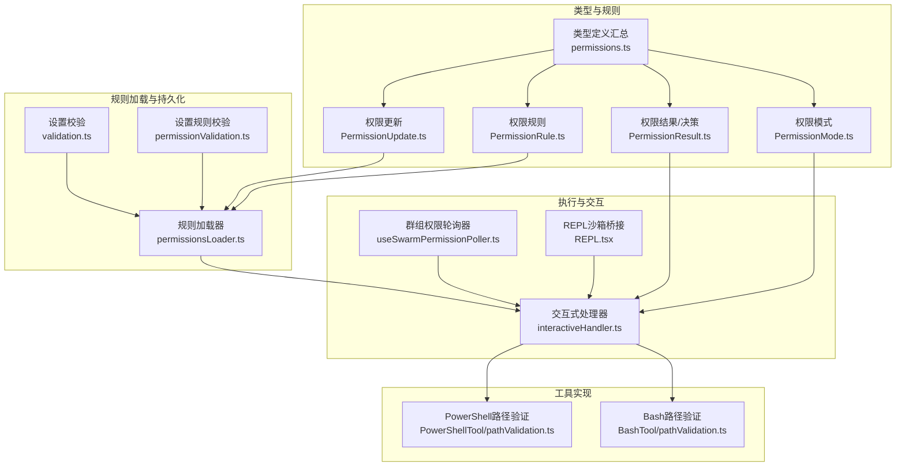
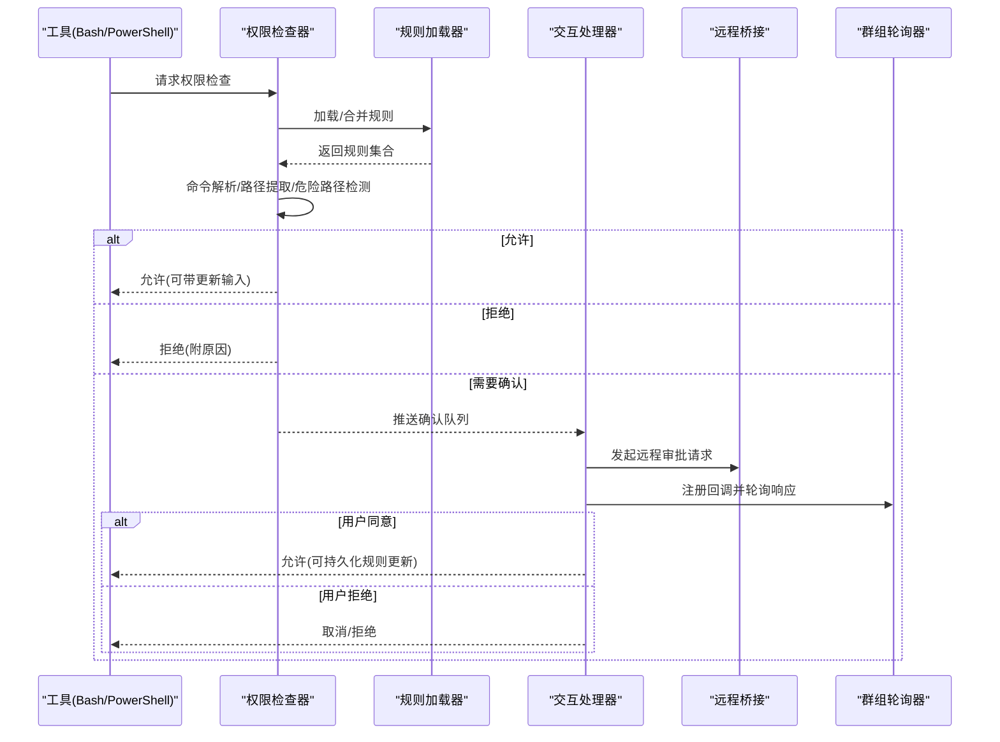
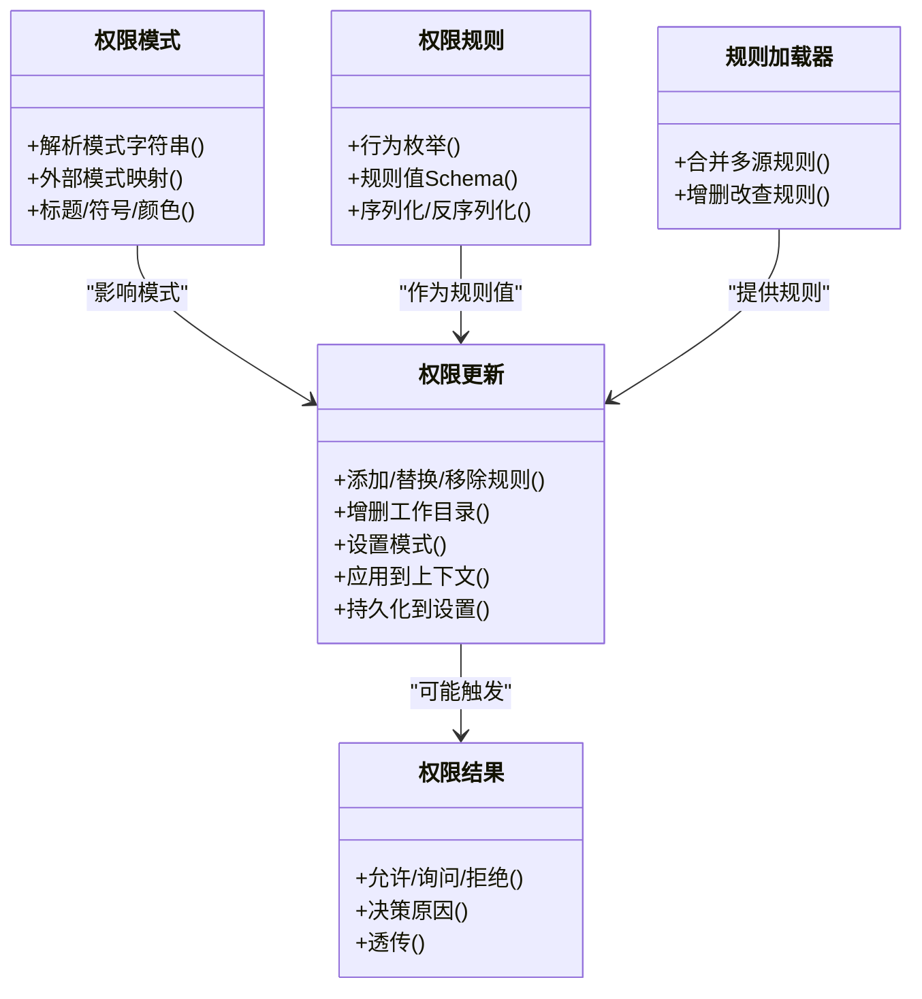
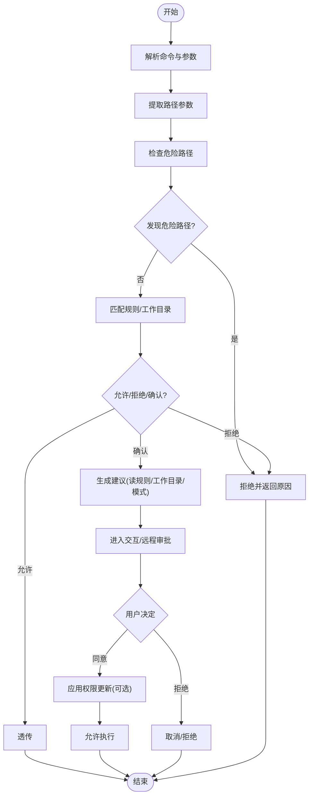
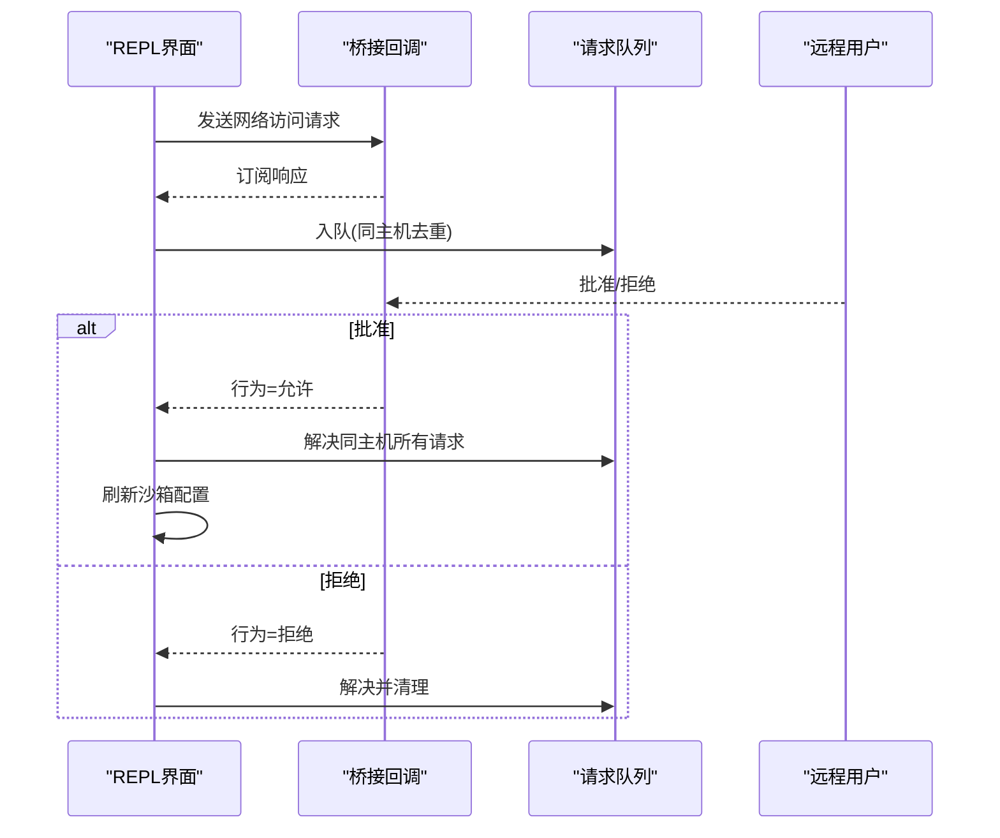
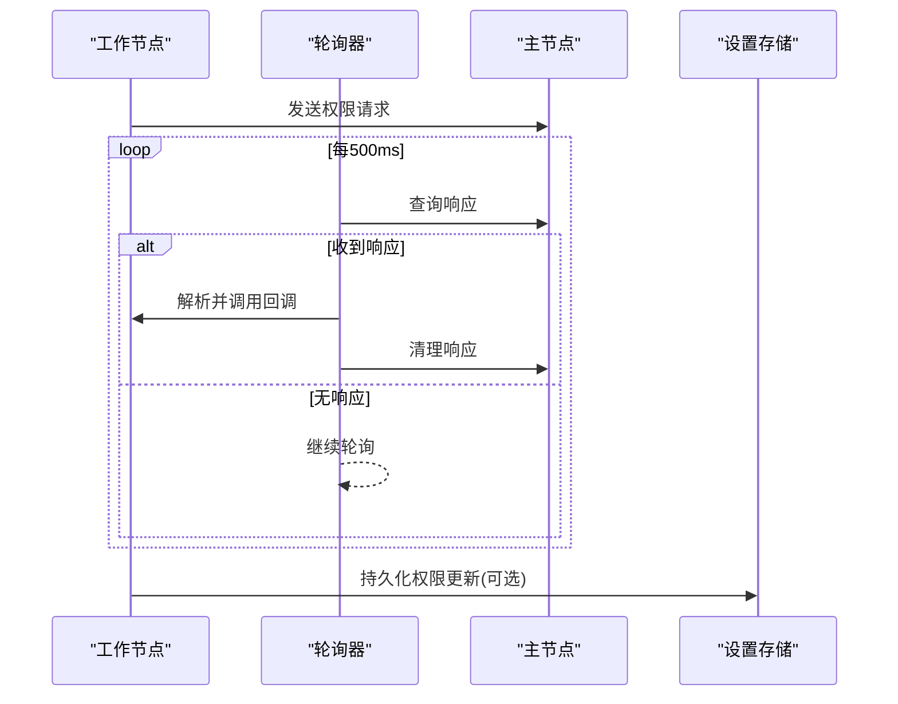
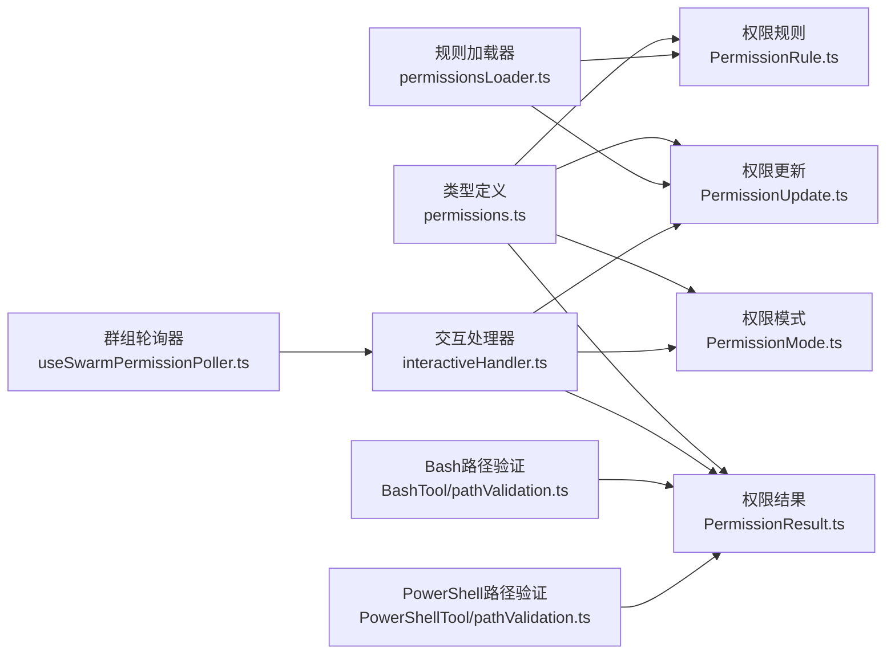

# 权限验证机制

<cite>
**本文档引用的文件**
- [src/utils/permissions/PermissionMode.ts](file://src/utils/permissions/PermissionMode.ts)
- [src/utils/permissions/PermissionUpdate.ts](file://src/utils/permissions/PermissionUpdate.ts)
- [src/utils/permissions/PermissionResult.ts](file://src/utils/permissions/PermissionResult.ts)
- [src/utils/permissions/PermissionRule.ts](file://src/utils/permissions/PermissionRule.ts)
- [src/utils/permissions/permissionsLoader.ts](file://src/utils/permissions/permissionsLoader.ts)
- [src/utils/settings/permissionValidation.ts](file://src/utils/settings/permissionValidation.ts)
- [src/utils/settings/validation.ts](file://src/utils/settings/validation.ts)
- [src/hooks/useSwarmPermissionPoller.ts](file://src/hooks/useSwarmPermissionPoller.ts)
- [src/hooks/toolPermission/handlers/interactiveHandler.ts](file://src/hooks/toolPermission/handlers/interactiveHandler.ts)
- [src/tools/BashTool/pathValidation.ts](file://src/tools/BashTool/pathValidation.ts)
- [src/tools/PowerShellTool/pathValidation.ts](file://src/tools/PowerShellTool/pathValidation.ts)
- [src/types/permissions.ts](file://src/types/permissions.ts)
- [src/screens/REPL.tsx](file://src/screens/REPL.tsx)
- [src/utils/hooks/ssrfGuard.ts](file://src/utils/hooks/ssrfGuard.ts)
</cite>

## 目录
1. [简介](#简介)
2. [项目结构](#项目结构)
3. [核心组件](#核心组件)
4. [架构总览](#架构总览)
5. [详细组件分析](#详细组件分析)
6. [依赖关系分析](#依赖关系分析)
7. [性能考虑](#性能考虑)
8. [故障排除指南](#故障排除指南)
9. [结论](#结论)
10. [附录](#附录)

## 简介
本文件系统化梳理并解释该代码库中的工具权限验证机制，重点覆盖以下方面：
- 权限分类系统设计：模式（Mode）、行为（Allow/Deny/Ask）与规则（Rule）的分层结构
- 危险命令识别算法：基于命令类型、参数提取与路径安全检查的综合判定
- 路径验证规则：跨平台路径解析、危险路径检测与工作目录白名单
- 沙箱限制策略：网络访问与主机连接的权限控制
- 实时性与缓存：交互式弹窗、远程桥接响应与异步分类器评估的协同
- 失败反馈与错误处理：多通道提示、内容块回传与降级策略
- 配置选项：自定义规则、工作区目录白名单与权限豁免
- 性能优化与调试：并发控制、轮询间隔、日志与可视化诊断

## 项目结构
权限验证机制由“类型定义-规则加载-执行决策-交互与桥接-工具实现”五条主线构成，并通过工具层（Bash/PowerShell）与沙箱管理器（REPL）进行落地。

**图表来源**
- [src/types/permissions.ts:1-442](file://src/types/permissions.ts#L1-L442)
- [src/utils/permissions/PermissionMode.ts:1-142](file://src/utils/permissions/PermissionMode.ts#L1-L142)
- [src/utils/permissions/PermissionResult.ts:1-36](file://src/utils/permissions/PermissionResult.ts#L1-L36)
- [src/utils/permissions/PermissionRule.ts:1-41](file://src/utils/permissions/PermissionRule.ts#L1-L41)
- [src/utils/permissions/PermissionUpdate.ts:1-390](file://src/utils/permissions/PermissionUpdate.ts#L1-L390)
- [src/utils/permissions/permissionsLoader.ts:129-296](file://src/utils/permissions/permissionsLoader.ts#L129-L296)
- [src/utils/settings/validation.ts:238-265](file://src/utils/settings/validation.ts#L238-L265)
- [src/utils/settings/permissionValidation.ts:238-262](file://src/utils/settings/permissionValidation.ts#L238-L262)
- [src/hooks/toolPermission/handlers/interactiveHandler.ts:1-537](file://src/hooks/toolPermission/handlers/interactiveHandler.ts#L1-L537)
- [src/hooks/useSwarmPermissionPoller.ts:1-331](file://src/hooks/useSwarmPermissionPoller.ts#L1-L331)
- [src/screens/REPL.tsx:2267-4646](file://src/screens/REPL.tsx#L2267-L4646)
- [src/tools/BashTool/pathValidation.ts:1-800](file://src/tools/BashTool/pathValidation.ts#L1-L800)
- [src/tools/PowerShellTool/pathValidation.ts:1-800](file://src/tools/PowerShellTool/pathValidation.ts#L1-L800)

**章节来源**
- [src/types/permissions.ts:1-442](file://src/types/permissions.ts#L1-L442)
- [src/utils/permissions/PermissionMode.ts:1-142](file://src/utils/permissions/PermissionMode.ts#L1-L142)
- [src/utils/permissions/PermissionUpdate.ts:1-390](file://src/utils/permissions/PermissionUpdate.ts#L1-L390)
- [src/utils/permissions/permissionsLoader.ts:129-296](file://src/utils/permissions/permissionsLoader.ts#L129-L296)

## 核心组件
- 权限模式（PermissionMode）
  - 定义默认、计划模式、接受编辑、绕过权限、不询问等模式，支持外部模式映射与颜色标识。
  - 提供模式字符串解析、标题与符号映射、是否外部模式判断等工具函数。
- 权限规则（PermissionRule）
  - 规则值包含工具名与可选内容；行为分为允许、拒绝、询问。
  - 提供规则值的序列化/反序列化与Zod Schema校验。
- 权限更新（PermissionUpdate）
  - 支持添加/替换/移除规则、增删工作目录、设置模式等操作。
  - 提供应用更新到上下文与持久化到设置的能力。
- 权限结果（PermissionResult）
  - 结果类型包含允许、询问（含建议）、拒绝（含原因），以及透传场景。
  - 提供决策原因枚举，涵盖规则、模式、子命令结果、钩子、异步代理、沙箱覆盖、分类器、工作目录、安全检查等。
- 规则加载器（permissionsLoader）
  - 合并来自不同设置源的规则，支持从可编辑设置中增删改查规则。
- 类型定义（permissions.ts）
  - 抽象出纯类型定义，避免循环依赖，集中管理模式、行为、规则、更新、决策与上下文等。

**章节来源**
- [src/utils/permissions/PermissionMode.ts:1-142](file://src/utils/permissions/PermissionMode.ts#L1-L142)
- [src/utils/permissions/PermissionRule.ts:1-41](file://src/utils/permissions/PermissionRule.ts#L1-L41)
- [src/utils/permissions/PermissionUpdate.ts:1-390](file://src/utils/permissions/PermissionUpdate.ts#L1-L390)
- [src/utils/permissions/PermissionResult.ts:1-36](file://src/utils/permissions/PermissionResult.ts#L1-L36)
- [src/utils/permissions/permissionsLoader.ts:129-296](file://src/utils/permissions/permissionsLoader.ts#L129-L296)
- [src/types/permissions.ts:1-442](file://src/types/permissions.ts#L1-L442)

## 架构总览
权限验证采用“规则驱动 + 交互决策 + 工具层安全”的三层架构：
- 规则层：集中管理规则与上下文，支持多源合并与持久化。
- 决策层：在工具调用前进行快速判定，必要时进入交互或远程审批流程。
- 工具层：对具体命令进行路径提取、参数解析与安全检查，结合规则与危险路径检测给出最终结果。

**图表来源**
- [src/hooks/toolPermission/handlers/interactiveHandler.ts:57-537](file://src/hooks/toolPermission/handlers/interactiveHandler.ts#L57-L537)
- [src/hooks/useSwarmPermissionPoller.ts:268-331](file://src/hooks/useSwarmPermissionPoller.ts#L268-L331)
- [src/utils/permissions/permissionsLoader.ts:129-296](file://src/utils/permissions/permissionsLoader.ts#L129-L296)
- [src/tools/BashTool/pathValidation.ts:603-783](file://src/tools/BashTool/pathValidation.ts#L603-L783)
- [src/tools/PowerShellTool/pathValidation.ts:1-800](file://src/tools/PowerShellTool/pathValidation.ts#L1-L800)

## 详细组件分析

### 权限模式与规则系统
- 模式体系
  - 内部模式包含默认、计划、接受编辑、绕过权限、不询问，以及可选的自动模式与气泡模式。
  - 外部模式用于跨端展示，自动模式在非Ant用户下不可见。
- 规则行为
  - 允许（Always Allow）、拒绝（Always Deny）、询问（Always Ask）三类规则按源聚合。
  - 支持为特定目标（会话、用户、项目、本地）设置规则与工作目录。
- 更新与持久化
  - 应用更新到上下文后，可选择持久化到可编辑设置源（用户/项目/本地）。
  - 支持批量添加、替换与移除规则，避免重复并保留未知字段。

**图表来源**
- [src/utils/permissions/PermissionMode.ts:1-142](file://src/utils/permissions/PermissionMode.ts#L1-L142)
- [src/utils/permissions/PermissionRule.ts:1-41](file://src/utils/permissions/PermissionRule.ts#L1-L41)
- [src/utils/permissions/PermissionUpdate.ts:1-390](file://src/utils/permissions/PermissionUpdate.ts#L1-L390)
- [src/utils/permissions/PermissionResult.ts:1-36](file://src/utils/permissions/PermissionResult.ts#L1-L36)
- [src/utils/permissions/permissionsLoader.ts:129-296](file://src/utils/permissions/permissionsLoader.ts#L129-L296)

**章节来源**
- [src/utils/permissions/PermissionMode.ts:1-142](file://src/utils/permissions/PermissionMode.ts#L1-L142)
- [src/utils/permissions/PermissionRule.ts:1-41](file://src/utils/permissions/PermissionRule.ts#L1-L41)
- [src/utils/permissions/PermissionUpdate.ts:1-390](file://src/utils/permissions/PermissionUpdate.ts#L1-L390)
- [src/utils/permissions/PermissionResult.ts:1-36](file://src/utils/permissions/PermissionResult.ts#L1-L36)
- [src/utils/permissions/permissionsLoader.ts:129-296](file://src/utils/permissions/permissionsLoader.ts#L129-L296)

### 危险命令识别与路径验证
- Bash路径验证
  - 命令类型识别与参数提取：针对不同命令（如cd/ls/find/mv/cp/rm/rmdir/sed/grep/rg/jq/git等）定制参数解析逻辑。
  - 危险路径检测：对rm/rmdir进行危险路径扫描，阻止删除关键系统目录。
  - 组合命令安全：禁止在包含cd的复合命令中执行写操作，防止路径解析绕过。
  - 建议生成：根据阻断路径与操作类型，建议添加读规则或工作目录，或切换到接受编辑模式。
- PowerShell路径验证
  - 基于AST解析命令参数，严格限定已知参数集，未知参数一律视为不可静态验证，强制“需要确认”。
  - 对写操作cmdlet（如Set-Content/Add-Content/Remove-Item等）进行路径参数提取与安全检查。
  - 特殊处理：位置参数跳过（如Invoke-WebRequest的URI）、可选写入（仅当存在输出参数时才视为写）等。

**图表来源**
- [src/tools/BashTool/pathValidation.ts:603-783](file://src/tools/BashTool/pathValidation.ts#L603-L783)
- [src/tools/PowerShellTool/pathValidation.ts:1-800](file://src/tools/PowerShellTool/pathValidation.ts#L1-L800)

**章节来源**
- [src/tools/BashTool/pathValidation.ts:1-800](file://src/tools/BashTool/pathValidation.ts#L1-L800)
- [src/tools/PowerShellTool/pathValidation.ts:1-800](file://src/tools/PowerShellTool/pathValidation.ts#L1-L800)

### 沙箱限制策略与网络访问
- 沙箱网络访问
  - 在REPL界面中，网络访问请求通过桥接发送至远程端（如claude.ai），等待远程用户批准。
  - 批量同主机请求统一处理，避免重复弹窗；批准后立即刷新沙箱配置以消除竞态。
- SSRF防护
  - DNS解析阶段拦截私有/链路本地地址，仅允许回环地址用于本地开发。
  - 对已解析IP进行黑名单校验，阻断潜在SSRF攻击。

**图表来源**
- [src/screens/REPL.tsx:2267-4646](file://src/screens/REPL.tsx#L2267-L4646)
- [src/utils/hooks/ssrfGuard.ts:227-294](file://src/utils/hooks/ssrfGuard.ts#L227-L294)

**章节来源**
- [src/screens/REPL.tsx:2267-4646](file://src/screens/REPL.tsx#L2267-L4646)
- [src/utils/hooks/ssrfGuard.ts:227-294](file://src/utils/hooks/ssrfGuard.ts#L227-L294)

### 权限决策的实时性与缓存
- 交互式处理器
  - 将待确认项推入确认队列，同时异步运行钩子与分类器检查，先到先决。
  - 支持用户交互、远程桥接（CCR）与渠道（Telegram/iMessage等）三种路径竞争，原子化决议。
- 群组权限轮询器
  - 工作节点轮询主节点的邮箱/磁盘响应，注册回调并解析权限更新。
  - 500ms轮询间隔，避免频繁IO；处理完成后清理响应文件。
- 缓存与持久化
  - 权限更新可持久化到用户/项目/本地设置，重启后仍生效。
  - 规则加载器合并多源规则，支持增量修改与去重。

**图表来源**
- [src/hooks/useSwarmPermissionPoller.ts:268-331](file://src/hooks/useSwarmPermissionPoller.ts#L268-L331)
- [src/utils/permissions/PermissionUpdate.ts:222-342](file://src/utils/permissions/PermissionUpdate.ts#L222-L342)

**章节来源**
- [src/hooks/toolPermission/handlers/interactiveHandler.ts:57-537](file://src/hooks/toolPermission/handlers/interactiveHandler.ts#L57-L537)
- [src/hooks/useSwarmPermissionPoller.ts:1-331](file://src/hooks/useSwarmPermissionPoller.ts#L1-L331)
- [src/utils/permissions/PermissionUpdate.ts:1-390](file://src/utils/permissions/PermissionUpdate.ts#L1-L390)

### 权限验证失败时的用户反馈与错误处理
- 多通道反馈
  - 交互式对话框：显示风险说明、建议与决策原因。
  - 远程桥接：同步远程端审批状态，支持更新输入与权限规则。
  - 渠道通知：通过MCP客户端向Telegram/iMessage等渠道发送请求。
- 错误处理
  - 分类器API错误记录但不中断流程，避免网络波动导致的误判。
  - SSRF防护在DNS解析阶段即阻断，返回明确错误码与原因。
  - 设置校验对非法规则进行警告并跳过，保证系统稳定。

**章节来源**
- [src/hooks/toolPermission/handlers/interactiveHandler.ts:1-537](file://src/hooks/toolPermission/handlers/interactiveHandler.ts#L1-L537)
- [src/utils/hooks/ssrfGuard.ts:227-294](file://src/utils/hooks/ssrfGuard.ts#L227-L294)
- [src/utils/settings/validation.ts:238-265](file://src/utils/settings/validation.ts#L238-L265)

### 配置选项与自定义规则
- 自定义权限规则
  - 支持在用户/项目/本地设置中添加/替换/移除规则，行为可为允许/拒绝/询问。
  - 规则内容由工具名与可选模式组成，经Zod Schema校验。
- 工作区目录白名单
  - 可为会话/用户/项目/本地添加额外工作目录，提升自动化效率。
- 权限豁免机制
  - 绕过权限模式（bypassPermissions）用于特殊场景，需谨慎启用。
  - 不询问模式（dontAsk）适合高度可信环境，但会降低安全性。

**章节来源**
- [src/utils/permissions/permissionsLoader.ts:129-296](file://src/utils/permissions/permissionsLoader.ts#L129-L296)
- [src/utils/settings/permissionValidation.ts:238-262](file://src/utils/settings/permissionValidation.ts#L238-L262)
- [src/utils/permissions/PermissionUpdate.ts:222-342](file://src/utils/permissions/PermissionUpdate.ts#L222-L342)
- [src/utils/permissions/PermissionMode.ts:1-142](file://src/utils/permissions/PermissionMode.ts#L1-L142)

## 依赖关系分析
- 类型定义集中于permissions.ts，避免循环依赖，其他模块仅通过类型导入。
- 规则加载器依赖设置系统，负责从多源合并规则并提供查询接口。
- 交互处理器与轮询器共同完成“本地决策 + 远程审批”的协作。
- 工具层（Bash/PowerShell）依赖路径验证与规则匹配，形成闭环。

**图表来源**
- [src/types/permissions.ts:1-442](file://src/types/permissions.ts#L1-L442)
- [src/utils/permissions/PermissionMode.ts:1-142](file://src/utils/permissions/PermissionMode.ts#L1-L142)
- [src/utils/permissions/PermissionRule.ts:1-41](file://src/utils/permissions/PermissionRule.ts#L1-L41)
- [src/utils/permissions/PermissionUpdate.ts:1-390](file://src/utils/permissions/PermissionUpdate.ts#L1-L390)
- [src/utils/permissions/PermissionResult.ts:1-36](file://src/utils/permissions/PermissionResult.ts#L1-L36)
- [src/utils/permissions/permissionsLoader.ts:129-296](file://src/utils/permissions/permissionsLoader.ts#L129-L296)
- [src/hooks/toolPermission/handlers/interactiveHandler.ts:1-537](file://src/hooks/toolPermission/handlers/interactiveHandler.ts#L1-L537)
- [src/hooks/useSwarmPermissionPoller.ts:1-331](file://src/hooks/useSwarmPermissionPoller.ts#L1-L331)
- [src/tools/BashTool/pathValidation.ts:1-800](file://src/tools/BashTool/pathValidation.ts#L1-L800)
- [src/tools/PowerShellTool/pathValidation.ts:1-800](file://src/tools/PowerShellTool/pathValidation.ts#L1-L800)

**章节来源**
- [src/types/permissions.ts:1-442](file://src/types/permissions.ts#L1-L442)
- [src/utils/permissions/permissionsLoader.ts:129-296](file://src/utils/permissions/permissionsLoader.ts#L129-L296)
- [src/hooks/toolPermission/handlers/interactiveHandler.ts:1-537](file://src/hooks/toolPermission/handlers/interactiveHandler.ts#L1-L537)
- [src/hooks/useSwarmPermissionPoller.ts:1-331](file://src/hooks/useSwarmPermissionPoller.ts#L1-L331)

## 性能考虑
- 并发控制
  - 交互处理器使用“原子决议”与“用户交互标记”，避免多次解析与重复UI。
  - 轮询器通过防抖与状态锁，避免并发轮询与重复处理。
- 轮询与I/O
  - 群组轮询间隔为500ms，平衡实时性与资源消耗。
  - 响应处理后及时清理，减少磁盘压力。
- 规则匹配
  - 规则合并与去重在设置加载阶段完成，工具侧直接消费已整合结果。
- 分类器评估
  - 异步分类器检查在UI指示器中进行，避免阻塞主流程；API错误被记录但不影响当前决策。

[本节为通用指导，无需列出具体文件来源]

## 故障排除指南
- 权限未生效
  - 检查规则是否正确持久化到用户/项目/本地设置。
  - 确认规则行为与目标源一致，避免冲突。
- 交互弹窗未出现
  - 确认当前模式允许弹窗；检查远程桥接与渠道订阅是否建立。
  - 查看轮询器日志，确认回调注册与响应处理。
- 命令被误判
  - 检查命令参数是否符合工具层解析规范；对于Bash，注意POSIX选项分隔符（--）。
  - 对于PowerShell，确保使用已知参数集，避免未知参数导致“不可验证”。
- 网络访问被阻断
  - 检查DNS解析是否命中私有/链路本地地址；仅回环地址允许本地开发。
  - 确认沙箱配置已刷新，避免竞态导致的漏放行。

**章节来源**
- [src/utils/permissions/permissionsLoader.ts:129-296](file://src/utils/permissions/permissionsLoader.ts#L129-L296)
- [src/hooks/useSwarmPermissionPoller.ts:1-331](file://src/hooks/useSwarmPermissionPoller.ts#L1-L331)
- [src/utils/hooks/ssrfGuard.ts:227-294](file://src/utils/hooks/ssrfGuard.ts#L227-L294)

## 结论
该权限验证机制通过“规则驱动 + 交互决策 + 工具层安全”的分层设计，在保障安全性的同时兼顾了灵活性与可扩展性。其特性包括：
- 明确的模式与规则体系，支持细粒度控制与持久化
- 严谨的命令解析与路径验证，有效识别危险操作
- 多通道审批与实时轮询，满足分布式与远程协作需求
- 完善的错误处理与日志记录，便于问题定位与修复

[本节为总结性内容，无需列出具体文件来源]

## 附录
- 调试工具与建议
  - 使用日志级别与错误消息查看权限决策原因与处理过程。
  - 对于Bash/PowerShell命令，可通过最小化复现样例验证参数解析与路径提取。
  - 在REPL中观察沙箱配置刷新与批量请求处理，确保一致性。

[本节为通用指导，无需列出具体文件来源]